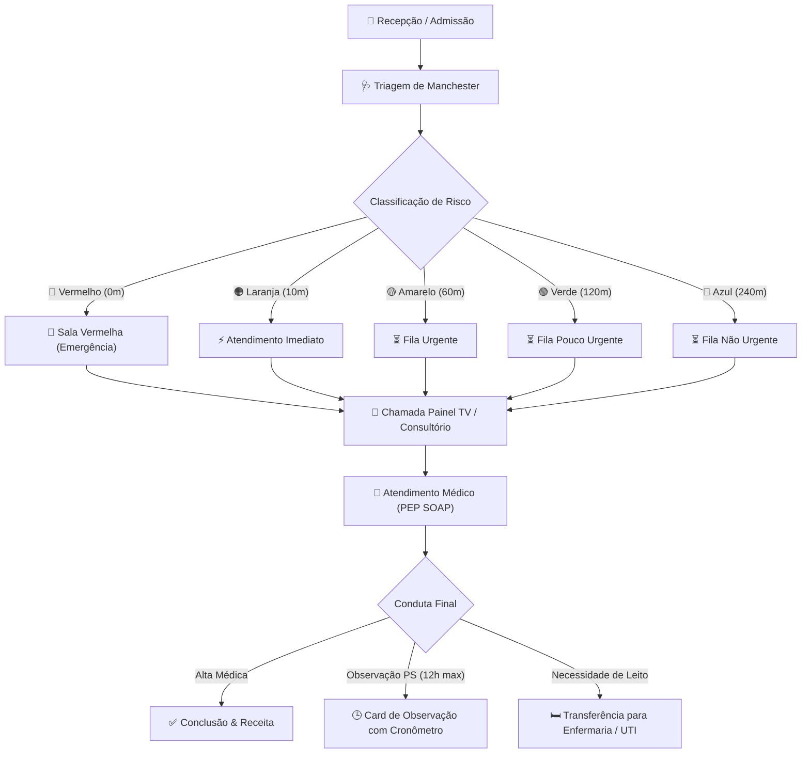

# 📘 Manual do Usuário Completo & Guia Operacional Definitivo — Health Nexus (v1.3.0)

> **Health Nexus — Sistema de Gestão Hospitalar & Prontuário Eletrônico**  
> Guia completo, exaustivo e publicação-grade de navegação, modais, formulários, botões, máscaras de entrada, fluxos operacionais e protocolos clínicos.

---

## 📋 Sumário Executivo
- 1. [Visão Geral & Arquitetura do Fluxo Hospitalar](#sec-1)
- 2. [Central de Atendimentos & Painel Kanban](#sec-2)
  - 2.1. [Cards Métricos e Filtros de Fila](#sec-2-1)
  - 2.2. [Fila 1: Aguardando Triagem (Protocolo de Manchester)](#sec-2-2)
  - 2.3. [Fila 2: Aguardando Médico (Chamada de Consultório)](#sec-2-3)
  - 2.4. [Fila 3: Em Atendimento (Ações do Médico)](#sec-2-4)
- 3. [Prontuário Eletrônico do Paciente (PEP — Método SOAP)](#sec-3)
  - 3.1. [Estrutura SOAP](#sec-3-1)
  - 3.2. [Autocomplete CID-10](#sec-3-2)
  - 3.3. [Assinatura Eletrônica e Exportação PDF](#sec-3-3)
- 4. [Guia Completo de Todos os Modais do Sistema](#sec-4)
  - 4.1. [Modal de Triagem de Manchester](#sec-4-1)
  - 4.2. [Modal de Prescrição & Receituário Médico](#sec-4-2)
  - 4.3. [Modal de Transferência & Alocação de Leito](#sec-4-3)
  - 4.4. [Modal de Nova Admissão & Entrada de Paciente](#sec-4-4)
  - 4.5. [Modal de Direcionamento & Reatribuição de Fila](#sec-4-5)
  - 4.6. [Modal de Histórico Pós-Alta & Prontuário Consolidado](#sec-4-6)
  - 4.7. [Modal de Aprovação de Acesso Master](#sec-4-7)
  - 4.8. [Modal de Gestão de Usuários & Troca de Perfil](#sec-4-8)
- 5. [Gestão de Pacientes & Histórico Clínico](#sec-5)
- 6. [Gestão da Equipe Médica & Corpo Clínico](#sec-6)
- 7. [Gestão de Consultórios & Salas de Atendimento](#sec-7)
- 8. [Gestão de Leitos & Hospitalização](#sec-8)
- 9. [Agenda, Escala Médica & Consultas Eletivas](#sec-9)
- 10. [Farmácia & Dispensação de Medicamentos](#sec-10)
- 11. [Faturamento, Guias TISS & Gestão Financeira](#sec-11)
- 12. [Relatórios Analytics & Indicadores Hospitalares](#sec-12)
- 13. [Painel de Chamada TV (Recepção)](#sec-13)
- 14. [Central de Estagnação & Aprovações Master](#sec-14)
- 15. [Configurações, Backup e Sincronização em Nuvem](#sec-15)
- 16. [Sistema de Avisos, Notificações & Toasts](#sec-16)
- 17. [Tabela de Máscaras, Atalhos & Teclas de Atalho](#sec-17)
- 18. [Solução de Dúvidas Frequentes & Erros Comuns (FAQ)](#sec-18)
- 19. [🆕 Kanban de Internação — Guia Completo](#sec-19)
- 20. [🆕 Histórico de Sessões de Usuários (Master)](#sec-20)

---

<h2 id="sec-1">1. Visão Geral & Arquitetura do Fluxo Hospitalar</h2>

O **Health Nexus** organiza a jornada assistencial do paciente desde a recepção até a alta definitiva ou internação em UTI/Enfermaria.

### 🔄 Diagrama de Fluxo da Jornada Assistencial

### 👥 Perfis de Acesso & Matriz de Permissões
| Perfil | Acesso Principal | Módulos Liberados | Ações Permitidas |
| :--- | :--- | :--- | :--- |
| **Administrador Master** | Todo o sistema | Todas as abas + Painel Master | Aprovar solicitações de acesso Master, gerenciar usuários, importar/exportar backups JSON, resetar banco. |
| **Médico** | Atendimentos, PEP, Leitos | Atendimentos, Pacientes, Leitos, Agenda | Realizar atendimento médico, assinar PEP (SOAP), prescrever medicamentos, colocar em observação, solicitar leito. |
| **Enfermeiro(a)** | Atendimentos, Triagem | Atendimentos, Pacientes, Farmácia | Realizar Triagem de Manchester, coletar sinais vitais (PA, FC, Temp, SpO2, Dor), administrar medicação. |
| **Recepcionista** | Pacientes, Agenda | Pacientes, Agenda, Atendimentos (Admissão) | Cadastrar novos pacientes, agendar consultas eletivas, dar entrada na recepção do PS, emitir senhas. |
| **Farmacêutico(a)** | Farmácia | Farmácia, Estoque | Controle de lote/validade, dar baixa em receitas dispensadas, definir estoque mínimo de segurança. |

---

<h2 id="sec-2">2. Central de Atendimentos & Painel Kanban</h2>

<h3 id="sec-2-1">2.1. Cards Métricos e Filtros de Fila</h3>
No topo da aba **Atendimentos**, encontram-se os 4 **Cards Métricos Clicáveis** para controle imediato do fluxo:

| Card | Ícone | Cor Tema | Ação ao Clicar | Descrição / Objetivo |
| :--- | :---: | :---: | :--- | :--- |
| **Triagem** | 🩺 | Roxo (`#8b5cf6`) | `filterKanbanColumn('triage')` | Filtra a tela para exibir exclusivamente a coluna de pacientes aguardando triagem da enfermagem. |
| **Ag. Médico** | ⌛ | Amarelo (`#f59e0b`) | `filterKanbanColumn('waiting')` | Filtra a tela para exibir apenas os pacientes triados aguardando chamada do médico. |
| **Em Consulta** | 👤 | Verde (`#10b981`) | `filterKanbanColumn('active')` | Filtra a tela para focar nos atendimentos em andamento e em observação no PS. |
| **Ver Todos** | 🔳 | Neutro (`#94a3b8`) | `filterKanbanColumn('all')` | Reseta os filtros e exibe as 3 colunas lado a lado no painel Kanban. |

---

<h3 id="sec-2-2">2.2. Fila 1: Aguardando Triagem (Protocolo de Manchester)</h3>
Pacientes admitidos na recepção dão entrada nesta fila para classificação de risco pela enfermagem.

#### 🔘 Tabela de Campos do Modal de Triagem
| Campo do Formulário | Tipo de Entrada | Valores de Referência / Validação | Função Clínica |
| :--- | :--- | :--- | :--- |
| **Pressão Arterial (PA)** | Texto (ex: `120/80`) | NORMOTENSO: 120/80 mmHg | Avaliação hemodinâmica inicial (máscara autocompletável). |
| **Frequência Cardíaca (FC)** | Número (bpm) | NORMOFAGIA: 60 - 100 bpm | Detecção de taquicardia ou bradicardia. |
| **Temperatura (°C)** | Número (°C) | AFEBRIL: 36.1°C - 37.2°C (Febre: >= 37.8°C) | Identificação de febre ou hipotermia. |
| **Peso (kg)** | Número (kg) | Exemplo: 70.5 kg | Cálculo de dosagem de medicamentos e anestésicos. |
| **Saturação de O2 (SpO2)** | Número (%) | NORMAL: >= 95% (Hipóxia: < 92%) | Avaliação de insuficiência respiratória. |
| **Escala de Dor** | Seletor (0 a 10) | 0: Sem dor / 10: Pior dor imaginável | Escala analógica visual de dor. |
| **Queixa Principal** | Área de Texto | Mínimo 5 caracteres | Registro narrativo dos sintomas do paciente. |

#### 🎨 Tabela de Classificação de Risco (Manchester)
| Cor de Risco | Nível de Gravidade | Tempo Máximo de Espera | Sinalização Visual | Ação Recomendada |
| :---: | :--- | :---: | :---: | :--- |
| 🔴 **Vermelho** | Emergência Absoluta | **0 minutos** (Imediato) | Card Vermelho Piscando | Paciente em risco iminente de morte. Sala Vermelha imediata. |
| 🟠 **Laranja** | Muito Urgente | **10 minutos** | Border Laranja | Risco significativo de perda de função/vida. Atendimento rápido. |
| 🟡 **Amarelo** | Urgente | **60 minutos** | Border Amarelo | Condição estável com necessidade de avaliação médica em até 1h. |
| 🟢 **Verde** | Pouco Urgente | **120 minutos** | Border Verde | Quadro leve sem risco de agravamento rápido. Fila regular. |
| 🔵 **Azul** | Não Urgente | **240 minutos** | Border Azul | Queixa crônica ou consulta simples. Atendimento eletivo. |

---

<h3 id="sec-2-3">2.3. Fila 2: Aguardando Médico (Chamada de Consultório)</h3>
Nesta coluna, os pacientes são ordenados por **Gravidade Manchester** e **Tempo de Espera**.

#### 🔘 Tabela de Ações do Card de Espera Médica
| Ação no Card | Ícone | Função Técnica | Resultado no Sistema |
| :--- | :---: | :--- | :--- |
| **Chamar para Consulta** | 📢 | Dispara websockets/eventos locais para a recepção. | 1. Toca sinal sonoro no Painel TV. 2. Exibe o nome do paciente no painel central. 3. Move o atendimento para a coluna *Em Atendimento*. |

---

<h3 id="sec-2-4">2.4. Fila 3: Em Atendimento (Ações do Médico)</h3>
Coluna onde o médico realiza o atendimento ativo. Cada card contém 5 botões de ação:

#### 🔘 Tabela Completa de Botões do Médico
| Botão | Ícone | Função do Botão | Resultado ao Clicar |
| :--- | :---: | :--- | :--- |
| **PEP** | 📄 | Prontuário Eletrônico | Abre a janela modal do Prontuário (SOAP, sinais vitais, CID-10, histórico e assinatura). |
| **Prescrição** | 💊 | Receituário Médico | Abre a tela para prescrever medicamentos, posologias, via de administração e orientações. |
| **Observação** | 🕒 | Observação no PS (12h max) | Inicia a contagem do cronômetro de permanência contínua e exibe badge de tempo no card. |
| **Transferir Leito** | 🛏️ | Internação / Leito | Abre o modal para selecionar e alocar o paciente em um leito livre da Enfermaria ou UTI. |
| **Finalizar** | ✅ | Alta Médica / Conclusão | Encerra a consulta, grava a alta no sistema e move o atendimento para o Histórico Pós-Alta. |

---

<h2 id="sec-3">3. Prontuário Eletrônico do Paciente (PEP — Método SOAP)</h2>

<h3 id="sec-3-1">3.1. Estrutura SOAP</h3>
| Bloco SOAP | Elemento | Descrição do Preenchimento | Exemplo de Preenchimento |
| :---: | :--- | :--- | :--- |
| **S** | **Subjetivo** | Anamnese, queixa principal, tempo de evolução dos sintomas e histórico. | *"Paciente relata dor torácica há 2 horas com irradiação para braço esquerdo."* |
| **O** | **Objetivo** | Exame físico, ausculta cardíaca/pulmonar, sinais vitais e exames complementares. | *"PA: 140/90, FC: 98bpm, ausculta cardíaca sem sopros. ECG com elevação ST."* |
| **A** | **Avaliação** | Hipótese diagnóstica principal e busca do código **CID-10**. | *"I21.9 — Infarto agudo do miocárdio não especificado."* |
| **P** | **Plano** | Conduta terapêutica, prescrição farmacológica, solicitações de exames e recomendações de alta/retorno. | *"Administrado AAS 300mg + Clopidogrel 300mg. Solicitada Vaga na UTI Coronariana."* |

<h3 id="sec-3-2">3.2. Autocomplete CID-10</h3>
No campo **Avaliação**, ao digitar o código ou nome da doença, o sistema lista sugestões oficiais.

<h3 id="sec-3-3">3.3. Assinatura Eletrônica e Exportação PDF</h3>
Recursos de rascunho, assinatura médica com senha e geração de laudo PDF.

---

<h2 id="sec-4">4. Guia Completo de Todos os Modais do Sistema</h2>

Abaixo encontra-se o detalhamento técnico de cada janela modal presente no sistema, seus botões, validações e comportamentos.

<h3 id="sec-4-1">4.1. Modal de Triagem de Manchester</h3>
- **Como Acessar:** Clique no botão `🩺 Realizar Triagem` na primeira coluna do Kanban.
- **Campos de Entrada:** `triage-pa`, `triage-fc`, `triage-temp`, `triage-peso`, `triage-spo2`, `triage-dor`, `manchesterColor`, `triage-queixa`.

| Botão do Modal | Classe / ID | Comportamento ao Clicar |
| :--- | :--- | :--- |
| **Confirmar Triagem** | `button[type="submit"]` | Valida cor obrigatória e queixa. Altera status para `Aguardando_Atendimento` e fecha modal. |
| **Cancelar** | `#btn-cancel-triage` | Cancela a operação, limpa o formulário e fecha a janela sem alterar o paciente. |
| **Fechar (X)** | `#close-triage-modal` | Fecha a janela modal imediatamente. |

<h3 id="sec-4-2">4.2. Modal de Prescrição & Receituário Médico</h3>
- **Como Acessar:** Clique no botão `💊 Prescrição` na 3ª coluna do Kanban (*Em Atendimento*).
- **Campos de Entrada:** `rx-med-name`, `rx-dosage`, `rx-route`, `rx-frequency`, `rx-notes`.

| Botão do Modal | Ação | Resultado |
| :--- | :--- | :--- |
| **➕ Adicionar Item** | Insere o medicamento na lista temporária da receita | Atualiza a tabela interna do receituário. |
| **🗑️ Remover Item** | Exclui o item selecionado da lista da receita | Remove o fármaco da lista atual. |
| **💾 Salvar & Dispensar**| Registra a receita e conecta com a farmácia | Envia pedido de baixa para o estoque da farmácia. |
| **🖨️ Imprimir PDF** | Gera a receita médica formatada em PDF | Baixa o arquivo de receita com cabeçalho médico. |

<h3 id="sec-4-3">4.3. Modal de Transferência & Alocação de Leito</h3>
- **Como Acessar:** Clique no botão `🛏️ Transferir Leito` no card do paciente em consulta.
- **Campos de Entrada:** `bed-sector`, `bed-target`, `bed-notes`.

| Botão do Modal | Ação | Resultado |
| :--- | :--- | :--- |
| **Confirmar Transferência**| Associa o paciente ao leito escolhido | Altera o status do leito para `Ocupado` e atualiza a aba *Leitos*. |
| **Solicitar Higienização** | Marca o leito de origem para limpeza | Altera o leito anterior para status `Higienização`. |
| **Cancelar** | Cancela o procedimento | Fecha o modal sem alterar o local do paciente. |

<h3 id="sec-4-4">4.4. Modal de Nova Admissão & Entrada de Paciente</h3>
- **Como Acessar:** Clique no botão `+ Nova Admissão` no topo da Central de Atendimentos.
- **Campos de Entrada:** `admission-patient-id`, `admission-type`, `admission-specialty`, `admission-priority`.

| Botão do Modal | Ação | Resultado |
| :--- | :--- | :--- |
| **Confirmar Admissão** | Cria o novo atendimento | Insere o paciente na 1ª coluna do Kanban (*Aguardando Triagem*). |
| **+ Cadastrar Novo Paciente**| Abre embutido o cadastro rápido | Permite criar o cadastro caso o paciente nunca tenha vindo ao hospital. |

<h3 id="sec-4-5">4.5. Modal de Direcionamento & Reatribuição de Fila</h3>
- **Como Acessar:** Na aba **Estagnação**, clique no botão `Direcionar` ao lado de um paciente com atraso.
- **Campos de Entrada:** `reassign-room`, `reassign-status`.

| Botão do Modal | Ação | Resultado |
| :--- | :--- | :--- |
| **Confirmar Direcionamento**| Atualiza consultório e status | Move o paciente imediatamente no Kanban desobstruindo o gargalo. |
| **🛏️ Solicitar Internação** | Solicitação direta de leito | Define o status para `Aguardando_Leito` e envia alerta para a Central de Leitos. |

<h3 id="sec-4-6">4.6. Modal de Histórico Pós-Alta & Prontuário Consolidado</h3>
- **Como Acessar:** Clique no botão `Histórico` no topo da Central de Atendimentos ou na aba *Pacientes*.

| Botão do Modal | Ação | Resultado |
| :--- | :--- | :--- |
| **🖨️ Imprimir PDF Consolidado**| Gera o prontuário impresso em PDF | Baixa o relatório PDF completo com todas as consultas do histórico. |
| **Fechar** | Fecha a exibição do histórico | Retorna à navegação normal. |

<h3 id="sec-4-7">4.7. Modal de Aprovação de Acesso Master</h3>
- **Como Acessar:** Exclusivo para o perfil **Administrador Master** na aba *Estagnação*.

| Botão do Modal | Ação | Resultado |
| :--- | :--- | :--- |
| **🛡️ Aprovar Acesso Total** | Concede o perfil `Master` | Libera todas as permissões administrativas para o usuário. |
| **❌ Recusar Solicitação** | Define o perfil como `Médico` padrão | Nega privilégios de administrador mantendo acesso de médico. |

<h3 id="sec-4-8">4.8. Modal de Gestão de Usuários & Troca de Perfil</h3>
- **Como Acessar:** Clique no nome do usuário logado no canto superior direito do menu.

| Botão do Modal | Ação | Resultado |
| :--- | :--- | :--- |
| **Salvar Alterações** | Atualiza a senha e dados do operador | Grava no banco e emite toast de confirmação. |
| **Sair / Logout** | Encerra a sessão atual | Redireciona para a tela de Login. |

---

<h2 id="sec-5">5. Gestão de Pacientes & Histórico Clínico</h2>

Na aba **Pacientes**, o hospital mantém o cadastro centralizado.

### 📋 Tabela de Campos Cadastrais do Paciente
| Campo | Tipo de Dado | Regra de Validação | Exemplo de Preenchimento |
| :--- | :--- | :--- | :--- |
| **Nome Completo** | Texto | Mínimo de 3 caracteres | `Renato Ramos Machado` |
| **CPF** | Número / Texto | Validação de algoritmo de 11 dígitos | `123.456.789-00` |
| **Data de Nascimento** | Data (AAAA-MM-DD) | Não pode ser data futura | `1985-04-12` |
| **Telefone / WhatsApp**| Texto | DDD + Número | `(11) 98765-4321` |
| **Endereço Completo** | Texto | Logradouro, Número, Bairro, Cidade | `Av. Paulista, 1000 — São Paulo/SP` |
| **Convênio / Plano** | Seletor | SUS, Particular ou Nome do Convênio | `Bradesco Saúde` |

---

<h2 id="sec-6">6. Gestão da Equipe Médica & Corpo Clínico</h2>

Na aba **Médicos**, gerencia-se o corpo clínico do hospital.

### 👨‍⚕️ Tabela de Campos e Ações dos Médicos
| Campo / Ação | Tipo | Descrição / Exemplo | Função no Sistema |
| :--- | :--- | :--- | :--- |
| **Nome do Médico** | Texto | `Dr. Carlos Eduardo Silva` | Exibido nos laudos, receitas e chamadas de TV. |
| **CRM / UF** | Texto | `123456/SP` | Registro profissional de classe no conselho médico. |
| **Especialidade** | Seletor | `Cardiologia`, `Pediatria`, `Ortopedia` | Vincula a fila de atendimento da especialidade. |
| **Consultório Alocado**| Seletor | `Consultório 03` | Define em qual sala o médico atende no dia. |
| **Status da Escala** | Badge | 🟢 `Em Plantão` / ⚪ `Folga` | Controla se o médico está disponível para chamadas. |

---

<h2 id="sec-7">7. Gestão de Consultórios & Salas de Atendimento</h2>

Na aba **Consultórios**, controla-se a ocupação das salas médicas.

### 🏢 Tabela de Status e Gestão das Salas
| Sala / Consultório | Ala | Especialidade Vinculada | Médico Alocado | Status Atual | Ações Rápidas |
| :--- | :--- | :--- | :--- | :---: | :--- |
| **Consultório 01** | Térreo | Clinica Geral | Dr. Carlos Silva | 🟢 `Disponível` | `Alocar Médico`, `Chamar Próximo` |
| **Consultório 02** | Térreo | Pediatria | Dra. Mariana Costa | 🔴 `Em Consulta` | `Ver Atendimento` |
| **Consultório 03** | 1º Andar | Ortopedia | Dr. Roberto Alves | 🟡 `Higienização` | `Liberar Sala` |
| **Sala Amarela** | Urgência | Emergência / PS | Dra. Fernanda Lima | 🔴 `Em Consulta` | `Transferir Paciente` |

---

<h2 id="sec-8">8. Gestão de Leitos & Hospitalização</h2>

Na aba **Leitos**, a equipe gerencia a ocupação das alas hospitalares.

### 🛏️ Tabela de Gestão de Leitos
| Leito ID | Ala / Setor | Paciente Internado | Tempo de Internação | Status do Leito | Ações Permitidas |
| :--- | :--- | :--- | :---: | :---: | :--- |
| **Enfermaria 101-A**| Enfermaria Geral | Maria Eduarda Souza | 3 dias | 🔴 `Ocupado` | `Transferir Leito`, `Dar Alta` |
| **Enfermaria 101-B**| Enfermaria Geral | — | — | 🟢 `Disponível` | `Internar Paciente` |
| **UTI-01** | UTI Adulto | José Ramos Ferreira | 7 dias | 🔴 `Ocupado` | `Transferir Leito`, `Evolução UTI` |
| **Isolamento-02** | Isolamento | — | — | 🟡 `Higienização` | `Liberar para Uso` |

---

<h2 id="sec-9">9. Agenda, Escala Médica & Consultas Eletivas</h2>

Na aba **Agenda**, realiza-se a marcação e controle de horários.

### 📅 Tabela de Operações da Agenda
| Operação | Parâmetros Necessários | Ação do Sistema | Resultado Gerado |
| :--- | :--- | :--- | :--- |
| **Novo Agendamento** | Paciente, Médico, Data, Horário | Grava a consulta na grade. | Insere na agenda e habilita emissão de PDF. |
| **Imprimir Comprovante**| ID do Agendamento | Gera documento PDF formatado. | Baixa o ticket impresso para entrega ao paciente. |
| **Cancelar Horário** | Motivo do cancelamento | Altera status para `Cancelado`. | Libera a vaga no horário para nova marcação. |

---

<h2 id="sec-10">10. Farmácia & Dispensação de Medicamentos</h2>

Na aba **Farmácia**, faz-se a gestão de estoque e rastreabilidade de medicamentos.

### 📦 Tabela de Controle de Farmácia e Estoque
| Medicamento | Apresentação / Via | Lote | Data Validade | Estoque Atual | Estoque Mín. | Status Estoque |
| :--- | :--- | :--- | :---: | :---: | :---: | :---: |
| **Dipirona Sódica** | Ampola 500mg/ml (EV/IM)| `L-9821` | 2027-12-31 | 450 un | 100 un | 🟢 OK |
| **Amoxicilina 500mg** | Comprimido (VO) | `L-4410` | 2026-09-15 | 85 un | 100 un | 🟡 Abaixo Mínimo |
| **Fentanil 0.05mg/ml**| Ampola (EV) | `L-1102` | 2026-08-20 | 12 un | 20 un | 🔴 Alerta Validade/Estoque |

---

<h2 id="sec-11">11. Faturamento, Guias TISS & Gestão Financeira</h2>

Na aba **Faturamento**, acompanha-se a receita e os repasses dos convênios.

### 💳 Tabela de Lançamentos Financeiros
| Código Atendimento | Paciente | Convênio / Plano | Valor dos Serviços | Valor Taxas/Exames | Status Financeiro | Ações Disponíveis |
| :--- | :--- | :--- | :---: | :---: | :---: | :--- |
| `#ATD-2026-081` | Renato Ramos | Unimed Saúde | R$ 350,00 | R$ 120,00 | 🟡 `Pendente` | `Dar Baixa`, `Editar` |
| `#ATD-2026-082` | Camila Ferreira | SUS / Público | R$ 180,00 | R$ 0,00 | 🟢 `Faturado` | `Ver Detalhes` |
| `#ATD-2026-083` | Lucas Mendes | Particular | R$ 450,00 | R$ 200,00 | 🟢 `Pago` | `Imprimir Recibo` |

---

<h2 id="sec-12">12. Relatórios Analytics & Indicadores Hospitalares</h2>

Na aba **Relatórios**, o gestor visualiza os gráficos e indicadores de desempenho.

### 📊 Tabela de Indicadores Gerenciais
| Relatório / Métrica | Indicador Analisado | Período Selecionável | Formato de Exportação |
| :--- | :--- | :---: | :---: |
| **Taxa de Ocupação de Leitos** | % de leitos ocupados vs leitos totais | Hoje / 7 dias / 30 dias | PDF / Excel |
| **Tempo Médio de Espera (SLA)** | Minutos médios de espera por Manchester | Hoje / Mensal | PDF / Excel |
| **Volume de Atendimentos** | Quantidade de pacientes atendidos por especialidade | Mensal / Anual | Excel / CSV |
| **Faturamento Por Convênio** | Total arrecadado discriminado por plano de saúde | Mensal | Excel / PDF |

---

<h2 id="sec-13">13. Painel de Chamada TV (Recepção)</h2>

Na aba **Painel TV**, a recepção gerencia as chamadas na televisão da sala de espera.

### 📺 Tabela de Recursos do Painel TV
| Recurso | Descrição Técnica | Resultado Visual / Sonoro |
| :--- | :--- | :--- |
| **Chamada Sonora (Chime)** | Reproduz o sinal de áudio sintetizado em alto-falante. | Atrai a atenção dos pacientes na recepção. |
| **Placa Visual Principal** | Exibe o Nome do Paciente e o Consultório em fonte gigante. | Pisca em cor de alto contraste na tela da TV. |
| **Lista de Chamadas Recentes** | Histórico das últimas 5 chamadas no canto da tela. | Permite ao paciente verificar se seu nome foi chamado. |

---

<h2 id="sec-14">14. Central de Estagnação & Aprovações Master</h2>

Na aba **Estagnação**, o sistema monitora gargalos e aprovações de acesso Master.

### 🚨 Tabela de Alertas de Estagnação & Aprovações
| Tipo de Alerta | Critério de Disparo | Cor do Badge | Ação Recomendada |
| :--- | :---: | :---: | :--- |
| **Alerta de Espera** | Tempo de espera > **15 min** | 🟡 Amarelo | Acionar o médico da sala ou agilizar a triagem. |
| **Alerta Crítico** | Tempo de espera > **30 min** | 🔴 Vermelho | Remanejar paciente para consultório vago. |
| **Observação Excedida** | Permaneceu > **12h em Obs no PS** | 🔴 Piscando | Solicitar internação imediata em leito de enfermaria. |
| **Solicitação Master** | Usuário solicitou acesso Total | 🟠 Laranja | Botão `Aprovar Acesso Total` exclusivo do Administrador Master. |

---

<h2 id="sec-15">15. Configurações, Backup e Sincronização em Nuvem</h2>

Na aba **Configurações**, realiza-se a manutenção do banco de dados local e nuvem.

### ⚙️ Tabela de Operações de Configuração
| Operação | Botão | Ação / Quando Utilizar |
| :--- | :---: | :--- |
| **Sincronização Nuvem** | `Sincronizar` | Conecta ao banco de dados Turso/SQLite na nuvem para sincronização em tempo real. |
| **Exportar Backup JSON** | `Exportar JSON` | Baixa o arquivo completo de backup do banco de dados para segurança externa. |
| **Importar Backup JSON** | `Importar JSON` | Restaura a base de dados a partir de um arquivo de backup previamente salvo. |
| **Popular Banco (Seed)** | `Gerar Dados Teste` | Cria pacientes e atendimentos fictícios para treinamentos ou testes. |
| **Resetar Banco** | `Limpar Dados` | Apaga os dados locais (requer confirmação da senha Master). |

---

<h2 id="sec-16">16. Sistema de Avisos, Notificações & Toasts</h2>

| Tipo de Notificação | Cor do Toast | Duração na Tela | Exemplo de Mensagem |
| :--- | :---: | :---: | :--- |
| **Sucesso** | 🟢 Verde | 3 segundos | `✅ Prontuário assinado com sucesso!` |
| **Alerta / Aviso** | 🟡 Amarelo | 4 segundos | `⏱️ Paciente colocado em Observação Médica (Cronômetro 12h iniciado)` |
| **Erro / Falha** | 🔴 Vermelho | 5 segundos | `❌ Selecione a classificação de risco obrigatória.` |

---

<h2 id="sec-17">17. Tabela de Máscaras, Atalhos & Teclas de Atalho</h2>

| Atalho / Clique | Função | Onde Funciona |
| :--- | :--- | :--- |
| `Mascara PA (120/80)` | Formata números em formato sistólica/diastólica | Campo Pressão Arterial na Triagem |
| `Mascara CPF (000.000.000-00)` | Formata 11 dígitos com pontos e hífen | Cadastro de Paciente |
| `Clique no Card Triagem` | Filtra para ver apenas a fila de Triagem | Aba Atendimentos |
| `Clique no Card Ag. Médico`| Filtra para ver apenas os pacientes aguardando médico | Aba Atendimentos |
| `Clique no Card Em Consulta`| Filtra para ver os atendimentos ativos | Aba Atendimentos |
| `Clique em Ver Todos` | Exibe as 3 colunas do Kanban lado a lado | Aba Atendimentos |
| `Botão Imprimir / PDF` | Imprime laudo oficial em PDF do PEP | Modal do PEP |

---

<h2 id="sec-18">18. Solução de Dúvidas Frequentes & Erros Comuns (FAQ)</h2>

| Problema Encontrado | Causa Provável | Solução Passo a Passo |
| :--- | :--- | :--- |
| **Ao clicar no PEP exibe erro no console** | O atendimento não foi inicializado | Verifique se o atendimento está na coluna *Em Consulta* antes de abrir o PEP. |
| **Prontuário gerado em PDF com campos vazios** | Paciente sem CPF/dados cadastrais | Acesse a aba *Pacientes*, complete o cadastro do paciente e tente gerar novamente. |
| **Histórico exibe "Nenhum atendimento registrado"** | Consulta recém-criada sem triagem | Certifique-se de realizar a Triagem de Manchester antes de buscar o histórico. |
| **O cronômetro do card não está atualizando** | Intervalo de atualização pausado | Clique no botão `Atualizar` na barra superior ou recarregue a aba *Atendimentos*. |
| **Paciente adicionado ao Kanban não aparece** | Filtro de setor ativo diferente do setor escolhido | Clique em **Todos** nos filtros rápidos do Kanban para exibir todos os setores. |
| **Barra de progresso do card Kanban está vermelha** | Meta de tempo do setor excedida | Revise a conduta clínica do paciente e avalie alta ou transferência de setor. |
| **Histórico de Sessões não aparece no menu** | Usuário sem perfil Master | O Histórico de Sessões é exclusivo para o perfil **Master**. Faça login com uma conta Master. |

---

<h2 id="sec-19">19. 🆕 Kanban de Internação — Guia Completo</h2>

O **Kanban de Internação** é uma ferramenta de gestão visual do fluxo de pacientes internados, inspirado na metodologia Kanban, adaptada para o ambiente hospitalar.

### 📌 Objetivo
Permitir que a equipe clínica visualize, em tempo real, todos os pacientes internados, o setor em que se encontram, o tempo de permanência e o status em relação às metas de alta evolutiva.

### 🏛️ Setores (Colunas do Kanban)

| Setor | Cor | Meta de Alta | Lógica de Alerta |
|---|---|---|---|
| **Pronto Socorro (Obs)** | 🔵 Azul | 24 horas | Após 18h → Atenção; Após 24h → Crítico |
| **Corredor de Internação** | 🟡 Amarelo | 1 dia | Após 18h → Atenção; Após 24h → Crítico |
| **Clínica Cirúrgica** | 🟣 Roxo | 7 dias | Após 5d → Atenção; Após 7d → Crítico |
| **Clínica Médica (SUS)** | 🟢 Verde | 10 dias | Após 7d → Atenção; Após 10d → Crítico |
| **UTI** | 🔴 Vermelho | **5 dias** | Após 3d → Atenção; Após 5d → Crítico |

> 💡 **Filosofia das Metas:** As metas não são prazos rígidos, mas estimuladores de conduta clínica proativa. Especialmente na UTI, onde o objetivo de 5 dias incentiva a equipe a buscar resultados evolutivos que viabilizem a alta ou remanejamento do paciente.

### ➕ Como Adicionar um Paciente ao Kanban

1. Acesse a aba **Kanban** no menu lateral.
2. Clique no botão **+ Adicionar Paciente** (canto superior direito).
3. No modal de admissão, preencha:
   - **Paciente \*** — selecione da lista de pacientes cadastrados
   - **Setor Inicial \*** — coluna onde o paciente será posicionado
   - **Leito** — número ou código do leito (ex: UTI-03)
   - **Data de Admissão** — pré-preenchida com a data/hora atual
   - **Diagnóstico / Hipótese** — texto livre (ex: Pneumonia Grave, TCE leve)
   - **Médico Responsável** — selecione da lista de usuários médicos
   - **Observações Iniciais** — notas de admissão
4. Clique em **Adicionar**.

O card aparecerá imediatamente na coluna do setor selecionado.

### 🃏 Entendendo o Card do Paciente

Cada card exibe:
- **Avatar colorido** com as iniciais do paciente (cor da coluna do setor)
- **Nome completo** e ID curto do paciente
- **Diagnóstico, Leito e Médico** responsável (quando preenchidos), com ícones alinhados
- **Barra de progresso** — indica visualmente quanto da meta de tempo foi consumida:
  - 🟢 Verde: dentro do prazo
  - 🟡 Amarelo: atenção (75%+ da meta)
  - 🔴 Vermelho: meta excedida (100%+)
- **Tempo no setor atual** e **tempo total de internação**
- **Ponto vermelho 🔴** no botão Evolução quando há anotações clínicas registradas

### 🔧 Ações Disponíveis no Card

O card é dividido em **dois grupos de ações**:

#### Ações Clínicas (Acesso Rápido)

| Botão | Ação |
|---|---|
| 🩺 **Prontuário** | Abre o **histórico clínico completo** do paciente: PEP SOAP, consultas anteriores, receituários, atestados e toda a documentação médica |
| 📝 **Evolução** | Abre o **Painel de Evolução Clínica** — veja detalhes abaixo |

#### Ações de Gerenciamento (Rodapé do Card)

| Botão | Ação |
|---|---|
| ✏️ (lápis) | **Editar Detalhes** — atualiza diagnóstico, leito e médico responsável |
| ↔️ (setas) | **Mover Setor** — transfere para outra coluna (reinicia o contador de tempo no setor) |
| 🚶 (pessoa saindo) | **Alta Hospitalar** — solicita confirmação e remove o paciente do Kanban |

### 📝 Painel de Evolução Clínica

Ao clicar em **📝 Evolução**, um painel completo é aberto com:

1. **Campo de nova anotação** — textarea com destaque de foco ao digitar
2. **Timestamp automático** — data e hora exatas da anotação
3. **Botão Prontuário** — acesso direto ao histórico completo sem fechar o painel
4. **Botão Salvar** — persiste a evolução com nome do profissional logado e data/hora
5. **Timeline de histórico** — todas as evoluções anteriores em ordem cronológica reversa (mais recente primeiro), exibindo autor e data de cada entrada

> 💡 **Migração automática:** Anotações antigas (campo `notes`) são automaticamente reconhecidas e exibidas no histórico como entradas legadas.

**Para registrar uma evolução clínica:**
1. Clique em **📝 Evolução** no card do paciente.
2. Digite a evolução no campo de texto.
3. Clique em **Salvar** — a anotação fica registrada com seu nome e horário.
4. O ponto vermelho aparecerá no botão do card, indicando que há registros.

### 🖱️ Drag & Drop

Além dos botões, é possível **arrastar e soltar** os cards entre as colunas:
1. Clique e segure o card.
2. Arraste até a coluna de destino.
3. Solte — o paciente será movido e o tempo no setor será reiniciado automaticamente.

### ➕ Adicionar Paciente em Setor Vazio

Se uma coluna não tiver pacientes, você pode **clicar diretamente no aviso central da coluna** ("Clique para adicionar"). O sistema abrirá o formulário de internação com aquele setor já pré-selecionado automaticamente.

### 🔍 Filtros em Formato de Card (Dashboard)

No topo do Kanban, os setores são exibidos em um moderno **grid de Cards interativos**:
- Cada card representa um setor e mostra a **contagem em tempo real** de pacientes internados (ex: *Todos*, *Pronto Socorro*, *UTI*).
- Ao clicar em um card, o sistema filtra a tela para focar exclusivamente na respectiva coluna (expandindo sua largura para melhor visualização).
- O card selecionado ganha destaque visual (sombra e borda acentuadas) com um selo `ATIVO`.
- Clique no card **Todos Setores** para retornar à visão geral com todas as colunas lado a lado.

### 🎨 Design Premium das Colunas e Pacientes

- **Colunas *Tinted*:** As colunas do Kanban possuem fundo transparente (*tinted*) e bordas estilizadas de acordo com a cor do setor, conferindo um layout visual limpo e de alto padrão.
- **Cards Premium:** Avatar colorido com iniciais, informações alinhadas com ícones, barra de progresso com glow colorido e painel de ações bem delimitado.

---

<h2 id="sec-20">20. 🆕 Histórico de Sessões de Usuários (Exclusivo Master)</h2>

O **Histórico de Sessões** registra automaticamente cada entrada e saída de todos os usuários do sistema.

### 📍 Como Acessar

> ⚠️ Este recurso é **exclusivo para o perfil Master**.

1. Faça login com uma conta Master.
2. Acesse a aba **Gestão de Usuários** no menu lateral.
3. Clique no botão **📊 Histórico de Sessões** disponível no painel.

### 📊 Informações do Relatório

O relatório exibe, para cada usuário:
- Data e hora de **login** (entrada no sistema)
- Data e hora de **logout** (saída ou encerramento de sessão)
- **Tempo de uso** total da sessão
- Gráfico visual de tempo de uso por período

### 🔒 Privacidade e Segurança

- Os registros são armazenados localmente e sincronizados via Turso Cloud quando configurado.
- Apenas usuários com perfil **Master** têm acesso a esses dados.
- Os dados de sessão **não podem ser apagados** por usuários comuns.

---
*Health Nexus — Manual do Usuário v1.3.0 | Sistema de Gestão Hospitalar de Alta Performance*  
*Atualizado em Agosto 2026 — @mazzarowysk & @_coltri_*

## Nova Atualização: Gráficos e Interatividade
- **Dashboard Principal**: Agora conta com visualização completa de ocupação através de gráficos interativos.
- **Kanban Interativo**: 
  - Gráfico 'Distribuição Geral' para análise em tempo real dos pacientes por setor.
  - Cartões de pacientes agora são **clicáveis**, exibindo o histórico detalhado do paciente.
  - Áreas vazias de colunas permitem o rápido cadastro de admissão no setor.
- **Relatórios**: A sessão de Relatórios e Exportação foi refinada e padronizada.
