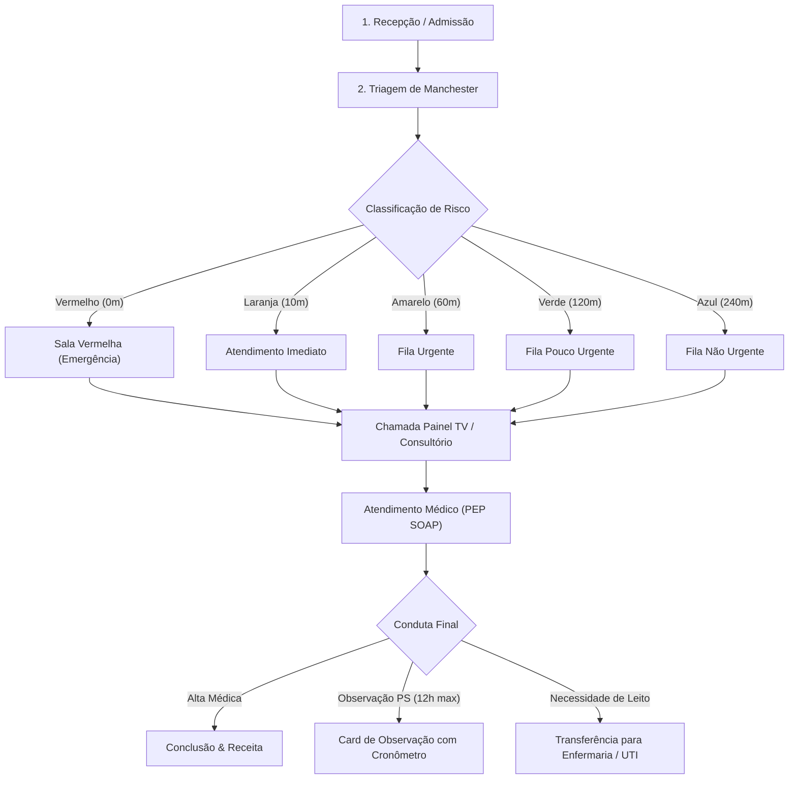

# 📘 Manual do Usuário Completo & Guia Operacional Definitivo — Health Nexus (v2.8.0)

> **Health Nexus v2.8.0 — Plataforma Hospitalar de Alta Complexidade, Suporte Assistencial Avançado & Faturamento TISS 4.01**
> Guia completo, exaustivo e publicação-grade de navegação, modais, formulários, botões, máscaras de entrada, fluxos operacionais, motor de decisão clínica (CDSS), alertas de interações medicamentosas, cronômetro de protocolos de emergência (IAM, AVC, Sepse), IA preditiva de exames, QR Code de autenticidade CFM, visualizador PACS DICOM interativo e faturamento TISS/TUSS com auditoria anti-glosa.

---

## 🗺️ Fluxograma Geral Integrado de Todas as Abas e Correlações (v2.8.0)

O fluxograma abaixo mapeia a correlação completa entre todas as 13 abas do sistema, destacando os diferenciais operacionais e particularidades de cada módulo:

```mermaid
flowchart TD
    subgraph MOD_AUTH ["1. Autenticação & Gestão de Acessos (RBAC)"]
        AUTH_LOGIN["Login JWT com 24 Contas (Médicos, Enfermeiros, Admin, Devs)"]
        AUTH_RBAC["Controle de Permissões (Master, Clínico, Dev)"]
        AUTH_PRESERVE["Preservação Inteligente de Usuários em Limpezas"]
        AUTH_AUDIT["Auditoria de Logins (Últimos 5 / Histórico 100)"]
    end

    subgraph MOD_DASH ["2. Dashboard Executivo & KPIs"]
        DASH_KPI["KPIs Gerenciais em Tempo Real"]
        DASH_CHARTS["Gráficos Interativos Chart.js (Filtros Clicáveis)"]
    end

    subgraph MOD_ESCALAS ["11. Escalas de Trabalho & Plantões"]
        ESC_TAB["Sub-abas: Escala de Médicos vs Escala de Enfermeiros"]
        ESC_SHIFT["Turnos: Manhã (6h), Tarde (6h), Noite (12h), 24h, 12x36"]
        ESC_SECTOR["Alocação de Setor / Consultório & CRM/COREN"]
        ESC_TODAY["Garantia de Cobertura de Plantão para HOJE"]
    end

    subgraph MOD_AGENDA ["3. Agenda de Consultas"]
        AG_BOOK["Agendamento de Consultas & Seleção de Médico/Consultório"]
        AG_KPI["KPI Cards de Status (Confirmado, Atendimento, Concluído)"]
        AG_WA["Bot WhatsApp Lembrete Interativo [1] Confirmar / [2] Reagendar"]
    end

    subgraph MOD_PACIENTES ["4. Admissão de Pacientes (SUS)"]
        PAC_FORM["Admissão 11 Campos SUS + Validação Responsável Legal"]
        PAC_CEP["Autopreenchimento de Endereço via API ViaCEP"]
        PAC_SEARCH["Busca Unificada por Nome e CPF"]
        PAC_TRASH["Lixeira de Pacientes (Soft-Delete & Restauração)"]
    end

    subgraph MOD_ATEND ["5. Atendimentos & Triagem Manchester"]
        ATD_CARDS["4 Cards Clicáveis de Fila (Triagem, Ag. Médico, Em Consulta)"]
        ATD_MANCH["Triagem Manchester 5 Cores & Validação MEWS"]
        ATD_CALL["Botão 1-Clique Chamar no Painel TV (Viva-Voz Web Speech)"]
        ATD_EMERG["Disparo Automático de Protocolos IAM, AVC, Sepse"]
    end

    subgraph MOD_TV ["6. Painel TV (Chamador Audiovisual)"]
        TV_FULL["Modo Fullscreen / Sala de Espera"]
        TV_SPEECH["Sintetizador de Voz em Português (pt-BR)"]
        TV_CARD["Card do Último Paciente Chamado"]
    end

    subgraph MOD_PEP ["7. Prontuário Eletrônico Médico (PEP SOAPE)"]
        PEP_SOAPE["Formulário SOAPE + CID-10 Offline + Alertas CDSS"]
        PEP_RX["Prescrição de Medicamentos com Alerta de Interações"]
        PEP_SUMMARY["Resumo Clínico em 3 Linhas (IA 2.0)"]
        PEP_EXAMS["Sugestão Preditiva de Exames (1-Clique)"]
        PEP_QR["Assinatura Digital SHA-256 & QR Code CFM"]
        PEP_PACS["Visualizador Radiológico DICOM / PACS"]
    end

    subgraph MOD_ESTAG ["8. Alertas de Permanência & Estagnação"]
        EST_TIMER["Cronômetro Contínuo de Permanência PS 12h"]
        EST_ALERT["Badges Alertas (Azul <10h / Amarelo 10-12h / Vermelho >12h)"]
        EST_REASSIGN["Modal de Reatribuição Rápida de Consultório"]
    end

    subgraph MOD_LEITOS ["9. Gestão de Leitos & Censo Hospitalar"]
        BED_MAP["Mapa Tricolor (Verde Vago / Vermelho Ocupado / Amarelo Limpeza)"]
        BED_DETAIL["Modal com Histórico Completo de Internações por Leito"]
        BED_DISCHARGE["Alta Médica com Transição para Higienização"]
    end

    subgraph MOD_KANBAN ["10. Kanban de Internação & Linha de Cuidado"]
        KANB_COLS["5 Setores (PS, Enfermaria, UTI, Cirúrgico, Isola)"]
        KANB_SLA["SLA Preditivo de Permenência por Diagnóstico"]
        KANB_EVOL["Linha do Tempo de Evolução Diária & Exames"]
    end

    subgraph MOD_FARMACIA ["12. Farmácia & Controle de Insumos"]
        FARM_STOCK["Estoque com Alertas de Validade e Estoque Mínimo"]
        FARM_DISP["Dispensação Conectada ao PEP Médico"]
        FARM_FDA["Pesquisa Global via OpenFDA / ANVISA"]
    end

    subgraph MOD_TISS ["13. Faturamento TISS / TUSS & ANS"]
        TISS_BATCH["Gerador de Lote XML TISS v4.01.00 ANS"]
        TISS_AUDIT["Motor Anti-Glosa de Guias SADT e Internação"]
    end

    %% CONEXÕES DO FLUXO PRINCIPAL
    AUTH_LOGIN --> DASH_KPI
    AUTH_RBAC --> MOD_PACIENTES
    ESC_TODAY --> ATD_CALL
    AG_BOOK --> PAC_FORM
    PAC_FORM --> ATD_MANCH
    ATD_MANCH -->|Classificação Manchester| ATD_CARDS
    ATD_MANCH -->|Identificação de Emergência| ATD_EMERG
    ATD_CALL --> TV_FULL
    TV_FULL --> TV_SPEECH
    TV_CARD --> PEP_SOAPE
    PEP_SOAPE -->|Decisão Clínica| PEP_SUMMARY
    PEP_SOAPE --> PEP_EXAMS
    PEP_SOAPE --> PEP_QR
    PEP_SOAPE --> PEP_PACS
    PEP_SOAPE -->|Permanência PS| EST_TIMER
    EST_TIMER -->|Aproximação 12h| EST_ALERT
    EST_ALERT -->|Necessidade de Leito| BED_MAP
    BED_MAP --> KANB_COLS
    KANB_COLS --> KANB_EVOL
    KANB_EVOL --> BED_DISCHARGE
    PEP_RX --> FARM_DISP
    PEP_SOAPE --> TISS_BATCH
    TISS_BATCH --> TISS_AUDIT
```

---

### Particularidades e Diferenciais das Abas do Health Nexus

| # | Aba / Módulo | Funcionalidades Principais | Diferencial & Particularidades |
|---|---|---|---|
| **1** | **Autenticação & RBAC** | Login JWT, 24 contas clínicas/devs, perfis de acesso | Preservação de usuários em limpezas, lixeira com confirmação, auditoria de acessos. |
| **2** | **Dashboard Executivo** | KPIs em tempo real, receita, volume de atendimentos | Gráficos Chart.js clicáveis como botões de filtro ativo que direcionam para as abas. |
| **3** | **Agenda de Consultas** | Marcação de consultas, seleção de médico e sala | Bot de WhatsApp Lembrete Interativo com resposta simulada [1] Confirmar / [2] Reagendar. |
| **4** | **Pacientes (SUS)** | Admissão 11 campos SUS, CEP automático ViaCEP | Validação de responsável legal, busca unificada por Nome/CPF, Lixeira soft-delete. |
| **5** | **Atendimentos & Triagem** | Fila visual Kanban, classificação de risco Manchester | Cálculo MEWS, protocolos de emergência (IAM, AVC, Sepse) + chamada no Painel TV. |
| **6** | **Painel TV (Chamador)** | Anúncio para sala de espera em tela cheia | **Web Speech API**: chamada em viva voz sintetizada em português (pt-BR). |
| **7** | **Prontuário PEP (SOAPE)** | Atendimento médico, CID-10, prescrições e evoluções | Resumo em 3-linhas (IA 2.0), exames preditivos, QR Code CFM SHA-256, PACS DICOM. |
| **8** | **Alertas & Estagnação** | Monitoramento de gargalos e permanência PS | Timer PS 12h (Azul <10h / Amarelo 10-12h / Vermelho >12h pulsante). |
| **9** | **Censo de Leitos** | Mapa visual de leitos hospitalares | Cards tricolores (Verde=Vago, Vermelho=Ocupado, Amarelo=Higienização pós-alta). |
| **10** | **Kanban de Internação** | Gestão de internados por 5 setores | Metas de permanência (SLA) dinâmicas, timeline de evolução clínica, auditoria de atrasos. |
| **11** | **Escalas de Trabalho** | Gestão de plantões de Médicos e Enfermeiros | Sub-abas dedicadas, turnos (6h, 12h, 24h, 12x36), garantia de plantão ativado para HOJE. |
| **12** | **Farmácia & Estoque** | Controle de estoque de medicamentos e insumos | Pesquisa global de fármacos em tempo real via OpenFDA / ANVISA por princípio ativo. |
| **13** | **Faturamento TISS / ANS** | Emissão de lotes XML TISS v4.01.00 e auditoria TUSS | Motor Anti-Glosa, verificação de carência e validação de procedimentos TUSS. |

---

## 📌 Sumário Executivo

- 1. [Visão Geral & Arquitetura do Fluxo Hospitalar](#sec-1)
- 2. [Central de Atendimentos & Painel Kanban](#sec-2)
  - 2.1. [Cards Métricos e Filtros de Fila](#sec-2-1)
  - 2.2. [Fila 1: Aguardando Triagem (Protocolo Manchester)](#sec-2-2)
  - 2.3. [Fila 2: Aguardando Médico (Chamada de Consultório)](#sec-2-3)
  - 2.4. [Fila 3: Em Atendimento (Ações do Médico)](#sec-2-4)
- 3. [Prontuário Eletrônico Médico (PEP)](#sec-3)
  - 3.1. [Estrutura SOAPE](#sec-3-1)
  - 3.2. [Autocomplete CID-10](#sec-3-2)
  - 3.3. [Assinatura Eletrônica, Hash SHA-256 e PDF](#sec-3-3)
- 4. [Guia Completo de Todos os Modais do Sistema](#sec-4)
  - 4.1. [Modal de Triagem Manchester](#sec-4-1)
  - 4.2. [Modal de Prescrição & Receituário Médico](#sec-4-2)
  - 4.3. [Modal de Transferência & Alocação de Leito](#sec-4-3)
  - 4.4. [Modal de Nova Admissão & Entrada de Paciente](#sec-4-4)
  - 4.5. [Modal de Direcionamento & Reatribuição de Fila](#sec-4-5)
  - 4.6. [Modal de Histórico Pós-Alta & Prontuário Consolidado](#sec-4-6)
  - 4.7. [Modal de Aprovação de Acesso de Usuários](#sec-4-7)
  - 4.8. [Modal de Gestão de Usuários & Troca de Perfil](#sec-4-8)
- 5. [Gestão de Pacientes & Histórico Clínico](#sec-5)
- 6. [Gestão da Equipe Médica & Corpo Clínico](#sec-6)
- 7. [Gestão de Consultórios & Salas de Atendimento](#sec-7)
- 8. [Gestão de Leitos & Hospitalização](#sec-8)
- 9. [Agenda, Escala Médica & Consultas Eletivas](#sec-9)
- 10. [Farmácia & Dispensação de Medicamentos](#sec-10)
- 11. [Faturamento, Guias TISS & Gestão Financeira](#sec-11)
- 12. [Relatórios Analytics & Indicadores Hospitalares](#sec-12)
- 13. [Painel de Chamada TV (Recepção)](#sec-13)
- 14. [Central de Estagnação & Aprovações de Acesso](#sec-14)
- 15. [Configurações, Backup e Sincronização em Nuvem](#sec-15)
- 16. [Sistema de Avisos, Notificações & Toasts](#sec-16)
- 17. [Tabela de Máscaras, Atalhos & Teclas de Atalho](#sec-17)
- 18. [Solução de Dúvidas Frequentes & Erros Comuns (FAQ)](#sec-18)
- 25. [Novas Funcionalidades Avançadas Assistenciais & Tecnológicas (v2.8.0)](#sec-25)

---

<h2 id="sec-1">1. Visão Geral & Arquitetura do Fluxo Hospitalar</h2>

O **Health Nexus** organiza a jornada assistencial do paciente desde a recepção até a alta definitiva ou internação em UTI/Enfermaria.

### 🧭 Diagrama de Fluxo da Jornada Assistencial

### 🔒 Perfis de Acesso & Matriz de Permissões

| Perfil | Acesso Visual às Abas | Prontuário (PEP) | Triagem Manchester | Prescrição Planilha | Gestão de Leitos | Financeiro / TISS | Lixeira / Sync |
|---|---|---|---|---|---|---|---|
| **Master / Admin** | Todas as abas | Total | Total | Total | Total | Total | Exclusivo |
| **Médico** | Dashboard, Pacientes, Atendimento, Leitos, Farmácia, Relatórios | Assinatura SOAPE | Consulta | Criação de Planilha | Solicitação | Bloqueado | Bloqueado |
| **Enfermeiro(a)** | Dashboard, Pacientes, Atendimento, Leitos, Farmácia | Leitura | Execução Manchester | Checagem de Doses | Gestão / Transferência | Bloqueado | Bloqueado |
| **Recepcionista** | Dashboard, Pacientes, Agenda, Atendimento, Painel TV, Caixa | Bloqueado | Bloqueado | Bloqueado | Bloqueado | Apenas Entradas | Bloqueado |
| **Farmacêutico(a)**| Dashboard, Pacientes, Farmácia, Relatórios | Bloqueado | Bloqueado | Bloqueado | Bloqueado | Bloqueado | Bloqueado |
| **Gestor Financeiro**| Dashboard, Pacientes, Financeiro, TISS, Relatorios | Bloqueado | Bloqueado | Bloqueado | Bloqueado | Total (TISS/ANS) | Bloqueado |

---

<h2 id="sec-2">2. Central de Atendimentos & Painel Kanban</h2>

<h3 id="sec-2-1">2.1. Cards Métricos e Filtros de Fila</h3>

No topo da aba **Atendimentos**, encontram-se os 4 **Cards Métricos Clicáveis** para controle imediato do fluxo:

| Card | Ícone | Cor Tema | Ação ao Clicar | Descrição / Objetivo |
|:---|:---:|:---:|:---|:---|
| **Triagem** | 🩺 | Roxo (`#8b5cf6`) | `filterKanbanColumn('triage')` | Filtra a tela para exibir exclusivamente a coluna de pacientes aguardando triagem. |
| **Ag. Médico** | ⏳ | Amarelo (`#f59e0b`) | `filterKanbanColumn('waiting')` | Filtra a tela para exibir apenas os pacientes triados aguardando chamada do médico. |
| **Em Consulta** | 👨‍⚕️ | Verde (`#10b981`) | `filterKanbanColumn('active')` | Filtra a tela para focar nos atendimentos em andamento e em observação no PS. |
| **Ver Todos** | 📊 | Neutro (`#94a3b8`) | `filterKanbanColumn('all')` | Reseta os filtros e exibe as 3 colunas lado a lado no painel Kanban. |

---

<h3 id="sec-2-2">2.2. Fila 1: Aguardando Triagem (Protocolo de Manchester)</h3>

Pacientes admitidos na recepção dão entrada nesta fila para classificação de risco pela enfermagem.

#### Tabela de Campos do Modal de Triagem

| Campo do Formulário | Tipo de Entrada | Valores de Referência / Validação | Função Clínica |
|:---|:---|:---|:---|
| **Pressão Arterial (PA)** | Texto (ex: `120/80`) | NORMOTENSO: 120/80 mmHg | Avaliação hemodinâmica inicial (máscara autocompletável). |
| **Frequência Cardíaca (FC)** | Número (bpm) | NORMOFAGIA: 60 - 100 bpm | Detecção de taquicardia ou bradicardia. |
| **Temperatura (°C)** | Número (°C) | AFEBRIL: 36.1°C - 37.2°C (Febre: >= 37.8°C) | Identificação de febre ou hipotermia. |
| **Peso (kg)** | Número (kg) | Exemplo: 70.5 kg | Cálculo de dosagem de medicamentos e anestésicos. |
| **Saturação de O2 (SpO2)** | Número (%) | NORMAL: >= 95% (Hipóxia: < 92%) | Avaliação de insuficiência respiratória. |
| **Escala de Dor** | Seletor (0 a 10) | 0: Sem dor / 10: Pior dor imaginável | Escala analógica visual de dor. |
| **Queixa Principal** | Área de Texto | Mínimo 5 caracteres | Registro narrativo dos sintomas do paciente. |

#### Tabela de Classificação de Risco (Manchester)

| Cor de Risco | Nível de Gravidade | Tempo Máximo de Espera | Sinalização Visual | Ação Recomendada |
|:---:|:---|:---:|:---:|:---|
| **Vermelho** | Emergência Absoluta | **0 minutos** (Imediato) | Card Vermelho Piscando | Paciente em risco iminente de morte. Sala Vermelha imediata. |
| **Laranja** | Muito Urgente | **10 minutos** | Border Laranja | Risco significativo de perda de função/vida. Atendimento rápido. |
| **Amarelo** | Urgente | **60 minutos** | Border Amarelo | Condição estável com necessidade de avaliação médica em até 1h. |
| **Verde** | Pouco Urgente | **120 minutos** | Border Verde | Quadro leve sem risco de agravamento rápido. Fila regular. |
| **Azul** | Não Urgente | **240 minutos** | Border Azul | Queixa crônica ou consulta simples. Atendimento eletivo. |

---

<h3 id="sec-2-3">2.3. Fila 2: Aguardando Médico (Chamada de Consultório)</h3>

Nesta coluna, os pacientes são ordenados por **Gravidade Manchester** e **Tempo de Espera**.

#### Tabela de Ações do Card de Espera Médica

| Ação no Card | Ícone | Função Técnica | Resultado no Sistema |
|:---|:---:|:---|:---|
| **Chamar para Consulta** | 📢 | Dispara websockets/eventos locais para a recepção | 1. Toca sinal sonoro no Painel TV. 2. Exibe o nome do paciente no painel central. 3. Move o atendimento para a coluna *Em Atendimento*. |

---

<h3 id="sec-2-4">2.4. Fila 3: Em Atendimento (Ações do Médico)</h3>

Coluna onde o médico realiza o atendimento ativo. Cada card contém 5 botões de ação:

#### Tabela Completa de Botões do Médico

| Botão | Ícone | Função do Botão | Resultado ao Clicar |
|:---|:---:|:---|:---|
| **PEP** | 🩺 | Prontuário Eletrônico SOAPE | Abre o modal completo de atendimento médico SOAP. |
| **Prescrição** | 📜 | Receituário Médico | Abre a tela para prescrever medicamentos, posologias e orientações. |
| **Observação** | ⏱️ | Observação no PS (12h max) | Inicia a contagem do cronômetro de permanência contínua no card. |
| **Transferir Leito** | 🛏️ | Internação / Leito | Abre o modal para alocar o paciente em leito livre da Enfermaria ou UTI. |
| **Finalizar** | ✅ | Alta Médica / Conclusão | Encerra a consulta, grava a alta no sistema e move para o Histórico. |

---

<h2 id="sec-3">3. Prontuário Eletrônico Médico (PEP)</h2>

<h3 id="sec-3-1">3.1. Estrutura SOAPE</h3>

| Bloco SOAP | Elemento | Descrição do Preenchimento | Exemplo de Preenchimento |
|:---|:---|:---|:---|
| **Subjetivo** | Anamnese & Queixa | Relato dos sintomas trazidos pelo paciente | *"Paciente refere dor torácica há 2h..."* |
| **Objetivo** | Exame Físico | Sinais vitais e achados de palpação/ausculta | *"PA: 130/80, Murmúrio vesicular presente bilateralmente..."* |
| **Avaliação** | Hipótese Diagnóstica | Hipótese clínica e código CID-10 | *"I20 — Angina Pectoris / Suspeita de SCA"* |
| **Plano** | Conduta & Tratamento | Medidas terapêuticas e prescrição de exames | *"ECG imediato, Troponina I, Isordil 5mg SL..."* |

---

<h2 id="sec-4">4. Guia Completo de Todos os Modais do Sistema</h2>

<h3 id="sec-4-1">4.1. Modal de Triagem Manchester</h3>

- **Como Acessar:** Clique no botão `Realizar Triagem` na 1ª coluna do Kanban.
- **Campos de Entrada:** `triage-pa`, `triage-temp`, `triage-fc`, `triage-spo2`, `triage-peso`, `triage-glicemia`, `triage-complaints`.

| Botão do Modal | Ação | Resultado |
|:---|:---|:---|
| **Salvar & Chamar na TV** | Conclui triagem e dispara chamada no Painel TV | Grava a cor Manchester e emite sinal sonoro na sala de espera. |
| **Apenas Salvar Triagem** | Salva a triagem na fila de espera | Move o paciente para a coluna *Aguardando Médico*. |
| **Cancelar** | Fecha o modal sem salvar | Mantém o paciente na fila de triagem. |

<h3 id="sec-4-2">4.2. Modal de Prescrição & Receituário Médico</h3>

- **Como Acessar:** Clique no botão `Prescrição` ou acesse pelo PEP.

| Botão do Modal | Ação | Resultado |
|:---|:---|:---|
| **Adicionar Item** | Insere o medicamento na lista da receita | Atualiza a tabela interna do receituário. |
| **Remover Item** | Exclui o item selecionado | Remove o fármaco da lista atual. |
| **Salvar & Dispensar** | Registra a receita e conecta com a farmácia | Envia pedido de baixa para o estoque da farmácia. |
| **Imprimir PDF** | Gera a receita médica formatada em PDF | Baixa o arquivo de receita com QR Code CFM SHA-256. |

<h3 id="sec-4-3">4.3. Modal de Transferência & Alocação de Leito</h3>

- **Como Acessar:** Clique no botão `Transferir Leito` no card do paciente.

| Botão do Modal | Ação | Resultado |
|:---|:---|:---|
| **Confirmar Transferência** | Associa o paciente ao leito escolhido | Altera o status do leito para `Ocupado` e atualiza a aba *Leitos*. |
| **Solicitar Higienização** | Marca o leito de origem para limpeza | Altera o leito anterior para status `Higienização`. |
| **Cancelar** | Cancela o procedimento | Fecha o modal sem alterar o local do paciente. |

<h3 id="sec-4-4">4.4. Modal de Nova Admissão & Entrada de Paciente</h3>

- **Como Acessar:** Clique no botão `+ Nova Admissão` no topo da Central de Atendimentos.

| Botão do Modal | Ação | Resultado |
|:---|:---|:---|
| **Confirmar Admissão** | Cria o novo atendimento | Insere o paciente na 1ª coluna do Kanban (*Aguardando Triagem*). |
| **+ Cadastrar Novo Paciente** | Abre o cadastro rápido | Permite criar o cadastro caso o paciente seja novo. |

<h3 id="sec-4-5">4.5. Modal de Direcionamento & Reatribuição de Fila</h3>

- **Como Acessar:** Na aba **Estagnação**, clique no botão `Direcionar` ao lado de um paciente em atraso.

| Botão do Modal | Ação | Resultado |
|:---|:---|:---|
| **Confirmar Direcionamento** | Atualiza consultório e status | Move o paciente no Kanban desobstruindo o gargalo. |
| **Solicitar Internação** | Solicitação direta de leito | Define o status para `Aguardando_Leito` na Central de Leitos. |

<h3 id="sec-4-6">4.6. Modal de Histórico Pós-Alta & Prontuário Consolidado</h3>

- **Como Acessar:** Clique no botão `Histórico` no topo da Central de Atendimentos ou na aba *Pacientes*.

| Botão do Modal | Ação | Resultado |
|:---|:---|:---|
| **Imprimir PDF Consolidado** | Gera o prontuário impresso em PDF | Baixa o relatório PDF completo com todas as consultas do histórico. |
| **Fechar** | Fecha a exibição do histórico | Retorna à navegação normal. |

<h3 id="sec-4-7">4.7. Modal de Aprovação de Acesso de Usuários</h3>

- **Como Acessar:** Exclusivo para o perfil **Administrador Master** na aba *Estagnação*.

| Botão do Modal | Ação | Resultado |
|:---|:---|:---|
| **Aprovar Acesso** | Concede o perfil solicitado | Libera as permissões de acordo com o cargo cadastrado. |
| **Recusar Solicitação** | Define o perfil como `Médico` padrão | Nega privilégios de administrador mantendo acesso comum. |

<h3 id="sec-4-8">4.8. Modal de Gestão de Usuários & Troca de Perfil</h3>

- **Como Acessar:** Clique no nome do usuário logado no canto superior direito.

| Botão do Modal | Ação | Resultado |
|:---|:---|:---|
| **Salvar Alterações** | Atualiza a senha e dados do operador | Grava no banco e emite toast de confirmação. |
| **Sair / Logout** | Encerra a sessão atual | Redireciona para a tela de Login. |

---

<h2 id="sec-5">5. Gestão de Pacientes & Linha do Cuidado Completa</h2>

Na aba **Pacientes**, o hospital mantém o cadastro centralizado e o acesso à trajetória clínica completa.

### 📋 Tabela de Campos Cadastrais do Paciente

| Campo | Tipo de Dado | Regra de Validação | Exemplo de Preenchimento |
|:---|:---|:---|:---|
| **Nome Completo** | Texto | Mínimo de 3 caracteres | `Renato Ramos Machado` |
| **CPF** | Número / Texto | Validação de algoritmo de 11 dígitos | `123.456.789-00` |
| **Data de Nascimento** | Data (AAAA-MM-DD) | Não pode ser data futura | `1985-04-12` |
| **Telefone / WhatsApp** | Texto | DDD + Número | `(11) 98765-4321` |
| **Endereço Completo** | Texto | Autopreenchimento por CEP | `Av. Paulista, 1000 — São Paulo/SP` |
| **Convênio / Plano** | Seletor | SUS, Particular ou Nome do Convênio | `Bradesco Saúde` |

---

<h2 id="sec-6">6. Gestão da Equipe Médica & Corpo Clínico</h2>

Na aba **Médicos**, gerencia-se o corpo clínico do hospital.

### 🩺 Tabela de Campos e Ações dos Médicos

| Campo / Ação | Tipo | Descrição / Exemplo | Função no Sistema |
|:---|:---|:---|:---|
| **Nome do Médico** | Texto | `Dr. Carlos Eduardo Silva` | Exibido nos laudos, receitas e chamadas de TV. |
| **CRM / UF** | Texto | `123456/SP` | Registro profissional de classe no conselho médico. |
| **Especialidade** | Seletor | `Cardiologia`, `Pediatria`, `Ortopedia` | Vincula a fila de atendimento da especialidade. |
| **Consultório Alocado**| Seletor | `Consultório 01` | Define em qual sala o médico atende no dia. |
| **Status da Escala** | Badge | 🟢 `Em Plantão` / ⚪ `Folga` | Controla se o médico está disponível para chamadas. |

---

<h2 id="sec-7">7. Gestão de Consultórios & Integração com Painel TV</h2>

Na aba **Consultórios**, controla-se a ocupação das salas médicas e o atendimento em tempo real.

### 🚪 Tabela de Status e Gestão das Salas

| Sala / Consultório | Ala | Especialidade Vinculada | Médico Alocado | Status Atual | Ações Rápidas |
|:---|:---|:---|:---|:---:|:---|
| **Consultório 01** | Térreo | Clínica Geral | Dr. Carlos Silva | 🟢 `Em Atendimento` | `🩺 Abrir PEP`, `Ver Atendimento` |
| **Consultório 02** | Térreo | Pediatria | Dra. Mariana Costa | 🟢 `Disponível` | `Alocar Médico`, `Chamar Próximo` |
| **Consultório 03** | 1º Andar | Ortopedia | Dr. Roberto Alves | 🟡 `Higienização` | `Liberar Sala` |
| **Sala Amarela** | Urgência | Emergência / PS | Dra. Fernanda Lima | 🔴 `Em Consulta` | `Transferir Paciente` |

---

<h2 id="sec-8">8. Gestão Avançada de Leitos, Censo & Histórico</h2>

Na aba **Leitos**, a equipe hospitalar gerencia a ocupação em tempo real com controle por leito individual.

### 🛏️ Tabela de Gestão de Leitos

| Leito ID | Setor / Ala | Paciente Alocado | Tempo de Internação | Status do Leito | Ações Permitidas |
|:---|:---|:---|:---:|:---:|:---|
| **Leito 101A** | Enfermaria Geral | Marcelo Mazaro | 1 dia | 🔴 `Ocupado` | `🩺 PEP`, `📋 Detalhes`, `🚪 Alta` |
| **Leito 101B** | Enfermaria Geral | — | — | 🟢 `Vago` | `🛏️ Internar Neste Leito` |
| **Leito UTI-01** | UTI Adulto | José Ramos | 5 dias | 🔴 `Ocupado` | `🩺 PEP`, `📋 Detalhes`, `🚪 Alta` |
| **Leito Isolamento-02** | Isolamento | — | — | 🟡 `Higienização` | `✨ Liberar Leito` |

---

<h2 id="sec-9">9. Agenda, Escala Médica & Consultas Eletivas</h2>

Na aba **Agenda**, realiza-se a marcação e controle de horários.

### 📅 Tabela de Operações da Agenda

| Operação | Parâmetros Necessários | Ação do Sistema | Resultado Gerado |
|:---|:---|:---|:---|
| **Novo Agendamento** | Paciente, Médico, Data, Horário | Grava a consulta na grade. | Insere na agenda e habilita emissão de PDF. |
| **WhatsApp Bot** | Agendamento selecionado | Envia lembrete interativo. | Sincroniza resposta [1] Confirmar com a grade. |
| **Imprimir Comprovante**| ID do Agendamento | Gera documento PDF formatado. | Baixa o ticket impresso para o paciente. |
| **Cancelar Horário** | Motivo do cancelamento | Altera status para `Cancelado`. | Libera a vaga no horário para nova marcação. |

---

<h2 id="sec-10">10. Farmácia & Dispensação de Medicamentos</h2>

Na aba **Farmácia**, faz-se a gestão de estoque e rastreabilidade de medicamentos.

### 💊 Tabela de Controle de Farmácia e Estoque

| Medicamento | Apresentação / Via | Lote | Data Validade | Estoque Actual | Estoque Mín. | Status Estoque |
|:---|:---|:---|:---:|:---:|:---:|:---:|
| **Dipirona Sódica** | Ampola 500mg/ml (EV/IM)| `L-9821` | 2027-12-31 | 450 un | 100 un | 🟢 OK |
| **Amoxicilina 500mg** | Comprimido (VO) | `L-4410` | 2026-09-15 | 85 un | 100 un | 🟡 Abaixo Mínimo |
| **Fentanil 0.05mg/ml**| Ampola (EV) | `L-1102` | 2026-08-20 | 12 un | 20 un | 🔴 Alerta Validade |

---

<h2 id="sec-11">11. Faturamento, Guias TISS & Gestão Financeira</h2>

Na aba **Faturamento TISS**, acompanha-se o faturamento de convênios e lotes ANS.

### 💰 Tabela de Guias & Lotes TISS

| Guia ID | Beneficiário | Convenio / Plano | Tabela TUSS | Valor Total | Status TISS | Ações Disponíveis |
|:---|:---|:---|:---:|:---:|:---:|:---|
| `#GUIA-801` | Renato Ramos | Unimed Saúde | 10101012 (Consulta) | R$ 350,00 | 🟡 `Pendente Auditoria` | `🛡️ Auditar`, `Editar` |
| `#GUIA-802` | Camila Ferreira | Bradesco Saúde | 40304310 (Hemograma) | R$ 180,00 | 🟢 `Aprovado Lote` | `📦 Gerar XML` |
| `#GUIA-803` | Lucas Mendes | SulAmérica | 40801010 (Raio-X Tórax)| R$ 250,00 | 🟢 `Faturado` | `📄 Imprimir Guia` |

---

<h2 id="sec-12">12. Relatórios Analytics & Indicadores Hospitalares</h2>

Na aba **Relatórios**, gera-se inteligência operacional em 5 painéis especializados.

### 📈 Tabela de Relatórios Executivos

| Painel | Indicadores Apresentados | Formato de Exportação | Público-Alvo |
|:---|:---|:---:|:---|
| **DRE & Finanças** | Receita bruta, ticket médio, glosas | PDF / XLSX / CSV | Diretoria Financeira |
| **Atendimentos PS** | Volume por hora, gravidade Manchester | PDF / XLSX | Coordenação de Enfermagem |
| **Ocupação de Leitos**| Taxa de ocupação, giro de leitos, permanência | PDF / XLSX | Regulação Médica / Censo |
| **Produtividade Médica**| Consultas finalizadas por profissional | PDF / XLSX | Gestão de Corpo Clínico |

---

<h2 id="sec-13">13. Painel de Chamada TV (Recepção)</h2>

O **Painel TV** opera em tela cheia na sala de espera para direcionamento sonoro e visual dos pacientes.

---

<h2 id="sec-14">14. Central de Estagnação & Aprovações de Acesso</h2>

Painel de controle de gargalos clínicos e permanência de pacientes em observação no PS acima de 12h.

---

<h2 id="sec-15">15. Configurações, Backup e Sincronização em Nuvem</h2>

Administração global do sistema, parâmetros do Turso Cloud DB e permissões de usuários RBAC.

---

<h2 id="sec-16">16. Sistema de Avisos, Notificações & Toasts</h2>

Sistema centralizado de alertas visuais instantâneos (*Toasts*) e avisos de fluxo assistencial.

---

<h2 id="sec-17">17. Tabela de Máscaras, Atalhos & Teclas de Atalho</h2>

| Ação / Atalho | Tecla / Evento | Função |
|:---|:---|:---|
| **Busca Global** | `Ctrl + K` / Input Topo | Abre a busca Spotlight em todo o sistema. |
| **Voltar Tela** | `Alt + Seta Esquerda` | Retorna à aba anterior no histórico. |
| **Nova Consulta** | `Alt + N` | Abre o modal de novo agendamento. |

---

<h2 id="sec-18">18. Solução de Dúvidas Frequentes & Erros Comuns (FAQ)</h2>

- **Como recuperar o acesso de um usuário?** Na aba Configurações -> Gerenciar Usuários -> Ícone Chave (Reset Senha).
- **Como gerar o XML TISS 4.01?** Na aba Faturamento TISS -> Selecionar Lote -> Botão Exportar XML TISS.

---

<h2 id="sec-25">25. Novas Funcionalidades Avançadas Assistenciais & Tecnológicas (v2.8.0) 🚀</h2>

O **Health Nexus v2.8.0** consolida 6 pilares de alta complexidade hospitalar e inteligência clínica:

### 25.1. ⏱️ Protocolos de Emergência Aguda (IAM, AVC, Sepse)
- **Ativação Automática no Pronto-Socorro:** O sistema detecta termos críticos durante a Triagem Manchester (ex: *"dor no peito"*, *"assimetria facial"*, *"febre alta"*) e inicia o cronômetro do protocolo de imediato.
- **Linha de Metas Clínicas:**
  - **IAM com Supra:** ECG em até 10 minutos; Porta-Balão < 90 minutos.
  - **AVC Isquêmico Agudo:** TC de crânio sem contraste e janela trombolítica em 4,5 horas.
  - **Sepse / Choque Séptico:** Pacote de 1ª hora (Lactato, Hemoculturas, Antibiótico de Amplo Espectro e Reposição Volêmica).

### 25.2. 🤖 IA Preditiva & Resumo Clínico 2.0 no PEP
- **Resumo Clínico em 3 Linhas:** Síntese executiva gerada automaticamente no topo do PEP com base na Queixa Principal, Sinais Vitais (MEWS), Exame Físico e Histórico.
- **Sugestão Preditiva de Exames:** Botão inteligente que analisa a hipótese diagnóstica e insere exames laboratoriais e de imagem com 1 clique (ex: Troponina, ECG, D-Dímero para Dor Torácica).

### 25.3. 📜 QR Code de Autenticidade CFM & Validação Pública
- **Assinatura Digital SHA-256:** Cada prescrição médica impressa em PDF gera um hash criptográfico exclusivo de 256 bits registrado no sistema.
- **QR Code Impresso:** Impresso no rodapé da receita para validação por farmácias e pacientes via câmera do celular ou modal público de conferência (`openPublicPrescriptionValidator`).

### 25.4. 💬 Bot de Confirmação Automática por WhatsApp
- **Confirmação Inteligente na Agenda:** Disparo automático de mensagens de lembrete com botões interativos (`[1] Confirmar`, `[2] Reagendar`).
- **Sincronização com a Agenda:** Resposta do paciente altera o status do agendamento de "Agendado" para "Confirmado" em tempo real sem intervenção da recepção.

### 25.5. 🩻 Visualizador DICOM / PACS no PEP & Alertas LIS
- **Visualizador Radiológico Interativo:** Modal integrado no PEP para análise de exames de imagem (Raio-X, Tomografia, Ressonância, Ultrassom).
- **Controles Avançados no Canvas:** Zoom, pan, ajuste de brilho/contraste, inversão de cores e ferramenta de régua de medição milimétrica.

### 25.6. 💰 Módulo de Faturamento TISS / TUSS & ANS v4.01.00
- **Aba Exclusiva de Faturamento:** Gestão de guias de Atendimento Ambulatorial (SADT) e Resumo de Internação Hospitalar.
- **Gerador de Lotes XML TISS 4.01.00:** Exportação de arquivos XML validados com o esquema oficial da ANS.
- **Motor Anti-Glosa:** Verificação prévia de matricula do beneficiário, código TUSS, CID-10 e carimbos de auditoria médica.
