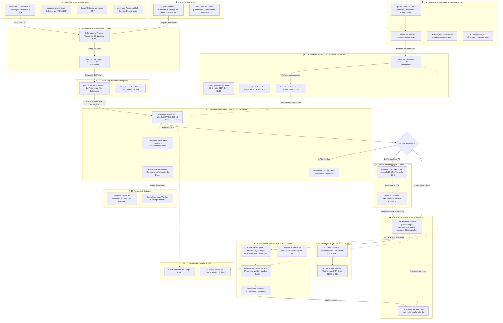

#ôôô ôôôïôôô¿ôôô½ôôôïôôô¿ôôô½ôôô ôôôMôôôaôôônôôôuôôôaôôôlôôô ôôôdôôôoôôô ôôôUôôôsôôôuôôôÃôôô¡ôôôrôôôiôôôoôôô ôôôCôôôoôôômôôôpôôôlôôôeôôôtôôôoôôô ôôô&ôôô ôôôGôôôuôôôiôôôaôôô ôôôOôôôpôôôeôôôrôôôaôôôcôôôiôôôoôôônôôôaôôôlôôô ôôôDôôôeôôôfôôôiôôônôôôiôôôtôôôiôôôvôôôoôôô ôôôâôôô€ôôô”ôôô ôôôHôôôeôôôaôôôlôôôtôôôhôôô ôôôNôôôeôôôxôôôuôôôsôôô ôôô(ôôôvôôô1ôôô.ôôô0ôôô)ôôô
ôôô
ôôô
ôôô
ôôô>ôôô ôôô*ôôô*ôôôHôôôeôôôaôôôlôôôtôôôhôôô ôôôNôôôeôôôxôôôuôôôsôôô ôôôâôôô€ôôô”ôôô ôôôSôôôiôôôsôôôtôôôeôôômôôôaôôô ôôôdôôôeôôô ôôôGôôôeôôôsôôôtôôôÃôôô£ôôôoôôô ôôôHôôôoôôôsôôôpôôôiôôôtôôôaôôôlôôôaôôôrôôô ôôô&ôôô ôôôPôôôrôôôoôôônôôôtôôôuôôôÃôôô¡ôôôrôôôiôôôoôôô ôôôEôôôlôôôeôôôtôôôrôôônôôôiôôôcôôôoôôô*ôôô*ôôô ôôô ôôô
ôôô
ôôô>ôôô ôôôGôôôuôôôiôôôaôôô ôôôcôôôoôôômôôôpôôôlôôôeôôôtôôôoôôô,ôôô ôôôeôôôxôôôaôôôuôôôsôôôtôôôiôôôvôôôoôôô ôôôeôôô ôôôpôôôuôôôbôôôlôôôiôôôcôôôaôôôÃôôô§ôôôÃôôô£ôôôoôôô-ôôôgôôôrôôôaôôôdôôôeôôô ôôôdôôôeôôô ôôônôôôaôôôvôôôeôôôgôôôaôôôÃôôô§ôôôÃôôô£ôôôoôôô,ôôô ôôômôôôoôôôdôôôaôôôiôôôsôôô,ôôô ôôôfôôôoôôôrôôômôôôuôôôlôôôÃôôô¡ôôôrôôôiôôôoôôôsôôô,ôôô ôôôbôôôoôôôtôôôÃôôôµôôôeôôôsôôô,ôôô ôôômôôôÃôôô¡ôôôsôôôcôôôaôôôrôôôaôôôsôôô ôôôdôôôeôôô ôôôeôôônôôôtôôôrôôôaôôôdôôôaôôô,ôôô ôôôfôôôlôôôuôôôxôôôoôôôsôôô ôôôoôôôpôôôeôôôrôôôaôôôcôôôiôôôoôôônôôôaôôôiôôôsôôô ôôôeôôô ôôôpôôôrôôôoôôôtôôôoôôôcôôôoôôôlôôôoôôôsôôô ôôôcôôôlôôôÃôôô­ôôônôôôiôôôcôôôoôôôsôôô.ôôô
ôôô
ôôô
ôôô
ôôô-ôôô-ôôô-ôôô
ôôô
ôôô
ôôô
ôôô#ôôô#ôôô ôôôïôôô¿ôôô½ôôôïôôô¿ôôô½ôôô ôôô2ôôô.ôôô ôôôFôôôlôôôuôôôxôôôoôôôgôôôrôôôaôôômôôôaôôô ôôôGôôôeôôôrôôôaôôôlôôô ôôôIôôônôôôtôôôeôôôgôôôrôôôaôôôdôôôoôôô ôôôdôôôeôôô ôôôTôôôoôôôdôôôaôôôsôôô ôôôaôôôsôôô ôôôAôôôbôôôaôôôsôôô ôôôeôôô ôôôCôôôoôôôrôôôrôôôeôôôlôôôaôôôÃôôô§ôôôÃôôôµôôôeôôôsôôô ôôô(ôôôvôôô2ôôô.ôôô4ôôô.ôôô0ôôô)ôôô
ôôô
ôôô
ôôô
ôôôOôôô ôôôfôôôlôôôuôôôxôôôoôôôgôôôrôôôaôôômôôôaôôô ôôôaôôôbôôôaôôôiôôôxôôôoôôô ôôômôôôaôôôpôôôeôôôiôôôaôôô ôôôaôôô ôôôcôôôoôôôrôôôrôôôeôôôlôôôaôôôÃôôô§ôôôÃôôô£ôôôoôôô ôôôcôôôoôôômôôôpôôôlôôôeôôôtôôôaôôô ôôôeôôônôôôtôôôrôôôeôôô ôôôtôôôoôôôdôôôaôôôsôôô ôôôaôôôsôôô ôôô1ôôô2ôôô ôôôaôôôbôôôaôôôsôôô ôôôdôôôoôôô ôôôsôôôiôôôsôôôtôôôeôôômôôôaôôô,ôôô ôôôdôôôeôôôsôôôtôôôaôôôcôôôaôôônôôôdôôôoôôô ôôôoôôôsôôô ôôôdôôôiôôôfôôôeôôôrôôôeôôônôôôcôôôiôôôaôôôiôôôsôôô ôôôoôôôpôôôeôôôrôôôaôôôcôôôiôôôoôôônôôôaôôôiôôôsôôô ôôôeôôô ôôôpôôôaôôôrôôôtôôôiôôôcôôôuôôôlôôôaôôôrôôôiôôôdôôôaôôôdôôôeôôôsôôô ôôôdôôôeôôô ôôôcôôôaôôôdôôôaôôô ôôômôôôÃôôô³ôôôdôôôuôôôlôôôoôôô:ôôô
ôôô
ôôô
ôôô
ôôô`ôôô`ôôô`ôôômôôôeôôôrôôômôôôaôôôiôôôdôôô
ôôô
ôôôfôôôlôôôoôôôwôôôcôôôhôôôaôôôrôôôtôôô ôôôTôôôDôôô
ôôô
ôôô ôôô ôôô ôôô ôôôsôôôuôôôbôôôgôôôrôôôaôôôpôôôhôôô ôôôMôôôOôôôDôôô_ôôôAôôôUôôôTôôôHôôô ôôô[ôôô"ôôôïôôô¿ôôô½ôôôïôôô¿ôôô½ôôô ôôô1ôôô.ôôô ôôôAôôôuôôôtôôôeôôônôôôtôôôiôôôcôôôaôôôÃôôô§ôôôÃôôô£ôôôoôôô ôôô&ôôô ôôôGôôôeôôôsôôôtôôôÃôôô£ôôôoôôô ôôôdôôôeôôô ôôôAôôôcôôôeôôôsôôôsôôôoôôôsôôô ôôô(ôôôRôôôBôôôAôôôCôôô)ôôô"ôôô]ôôô
ôôô
ôôô ôôô ôôô ôôô ôôô ôôô ôôô ôôô ôôôAôôôUôôôTôôôHôôô_ôôôLôôôOôôôGôôôIôôôNôôô[ôôô"ôôôLôôôoôôôgôôôiôôônôôô ôôôJôôôWôôôTôôô ôôôcôôôoôôômôôô ôôô2ôôô4ôôô ôôôCôôôoôôônôôôtôôôaôôôsôôô ôôô(ôôôMôôôÃôôô©ôôôdôôôiôôôcôôôoôôôsôôô,ôôô ôôôEôôônôôôfôôôeôôôrôôômôôôeôôôiôôôrôôôoôôôsôôô,ôôô ôôôAôôôdôôômôôôiôôônôôô,ôôô ôôôDôôôeôôôvôôôsôôô)ôôô"ôôô]ôôô
ôôô
ôôô ôôô ôôô ôôô ôôô ôôô ôôô ôôô ôôôAôôôUôôôTôôôHôôô_ôôôRôôôBôôôAôôôCôôô[ôôô"ôôôCôôôoôôônôôôtôôôrôôôoôôôlôôôeôôô ôôôdôôôeôôô ôôôPôôôeôôôrôôômôôôiôôôsôôôsôôôÃôôôµôôôeôôôsôôô ôôô(ôôôMôôôaôôôsôôôtôôôeôôôrôôô,ôôô ôôôCôôôlôôôÃôôô­ôôônôôôiôôôcôôôoôôô,ôôô ôôôDôôôeôôôvôôô)ôôô"ôôô]ôôô
ôôô
ôôô ôôô ôôô ôôô ôôô ôôô ôôô ôôô ôôôAôôôUôôôTôôôHôôô_ôôôPôôôRôôôEôôôSôôôEôôôRôôôVôôôEôôô[ôôô"ôôôPôôôrôôôeôôôsôôôeôôôrôôôvôôôaôôôÃôôô§ôôôÃôôô£ôôôoôôô ôôôIôôônôôôtôôôeôôôlôôôiôôôgôôôeôôônôôôtôôôeôôô ôôôdôôôeôôô ôôôUôôôsôôôuôôôÃôôô¡ôôôrôôôiôôôoôôôsôôô ôôôeôôômôôô ôôôLôôôiôôômôôôpôôôeôôôzôôôaôôôsôôô"ôôô]ôôô
ôôô
ôôô ôôô ôôô ôôô ôôô ôôô ôôô ôôô ôôôAôôôUôôôTôôôHôôô_ôôôAôôôUôôôDôôôIôôôTôôô[ôôô"ôôôAôôôuôôôdôôôiôôôtôôôoôôôrôôôiôôôaôôô ôôôdôôôeôôô ôôôLôôôoôôôgôôôiôôônôôôsôôô ôôô(ôôôÃôôôšôôôlôôôtôôôiôôômôôôoôôôsôôô ôôô5ôôô ôôô/ôôô ôôôHôôôiôôôsôôôtôôôÃôôô³ôôôrôôôiôôôcôôôoôôô ôôô1ôôô0ôôô0ôôô)ôôô"ôôô]ôôô
ôôô
ôôô ôôô ôôô ôôô ôôôeôôônôôôdôôô
ôôô
ôôô
ôôô
ôôô ôôô ôôô ôôô ôôôsôôôuôôôbôôôgôôôrôôôaôôôpôôôhôôô ôôôMôôôOôôôDôôô_ôôôDôôôAôôôSôôôHôôô ôôô[ôôô"ôôôïôôô¿ôôô½ôôôïôôô¿ôôô½ôôô ôôô2ôôô.ôôô ôôôDôôôaôôôsôôôhôôôbôôôoôôôaôôôrôôôdôôô ôôôEôôôxôôôeôôôcôôôuôôôtôôôiôôôvôôôoôôô ôôô&ôôô ôôôKôôôPôôôIôôôsôôô"ôôô]ôôô
ôôô
ôôô ôôô ôôô ôôô ôôô ôôô ôôô ôôô ôôôDôôôAôôôSôôôHôôô_ôôôKôôôPôôôIôôô[ôôô"ôôôKôôôPôôôIôôôsôôô ôôôGôôôeôôôrôôôeôôônôôôcôôôiôôôaôôôiôôôsôôô ôôôeôôômôôô ôôôTôôôeôôômôôôpôôôoôôô ôôôRôôôeôôôaôôôlôôô"ôôô]ôôô
ôôô
ôôô ôôô ôôô ôôô ôôô ôôô ôôô ôôô ôôôDôôôAôôôSôôôHôôô_ôôôCôôôHôôôAôôôRôôôTôôôSôôô[ôôô"ôôôGôôôrôôôÃôôô¡ôôôfôôôiôôôcôôôoôôôsôôô ôôôIôôônôôôtôôôeôôôrôôôaôôôtôôôiôôôvôôôoôôôsôôô ôôôCôôôhôôôaôôôrôôôtôôô.ôôôjôôôsôôô ôôô(ôôôFôôôiôôôlôôôtôôôrôôôoôôôsôôô ôôôCôôôlôôôiôôôcôôôÃôôô¡ôôôvôôôeôôôiôôôsôôô)ôôô"ôôô]ôôô
ôôô
ôôô ôôô ôôô ôôô ôôôeôôônôôôdôôô
ôôô
ôôô
ôôô
ôôô ôôô ôôô ôôô ôôôsôôôuôôôbôôôgôôôrôôôaôôôpôôôhôôô ôôôMôôôOôôôDôôô_ôôôEôôôSôôôCôôôAôôôLôôôAôôôSôôô ôôô[ôôô"ôôôïôôô¿ôôô½ôôôïôôô¿ôôô½ôôô ôôô1ôôô1ôôô.ôôô ôôôEôôôsôôôcôôôaôôôlôôôaôôôsôôô ôôôdôôôeôôô ôôôTôôôrôôôaôôôbôôôaôôôlôôôhôôôoôôô ôôô&ôôô ôôôPôôôlôôôaôôônôôôtôôôÃôôôµôôôeôôôsôôô ôôô(ôôôDôôôiôôôfôôôeôôôrôôôeôôônôôôcôôôiôôôaôôôlôôô)ôôô"ôôô]ôôô
ôôô
ôôô ôôô ôôô ôôô ôôô ôôô ôôô ôôô ôôôEôôôSôôôCôôô_ôôôTôôôAôôôBôôô[ôôô"ôôôSôôôuôôôbôôô-ôôôaôôôbôôôaôôôsôôô:ôôô ôôôEôôôsôôôcôôôaôôôlôôôaôôô ôôôdôôôeôôô ôôôMôôôÃôôô©ôôôdôôôiôôôcôôôoôôôsôôô ôôôvôôôsôôô ôôôEôôôsôôôcôôôaôôôlôôôaôôô ôôôdôôôeôôô ôôôEôôônôôôfôôôeôôôrôôômôôôeôôôiôôôrôôôoôôôsôôô"ôôô]ôôô
ôôô
ôôô ôôô ôôô ôôô ôôô ôôô ôôô ôôô ôôôEôôôSôôôCôôô_ôôôSôôôHôôôIôôôFôôôTôôô[ôôô"ôôôTôôôuôôôrôôônôôôoôôôsôôô:ôôô ôôôMôôôaôôônôôôhôôôÃôôô£ôôô ôôô(ôôô6ôôôhôôô)ôôô,ôôô ôôôTôôôaôôôrôôôdôôôeôôô ôôô(ôôô6ôôôhôôô)ôôô,ôôô ôôôNôôôoôôôiôôôtôôôeôôô ôôô(ôôô1ôôô2ôôôhôôô)ôôô,ôôô ôôô2ôôô4ôôôhôôô,ôôô ôôô1ôôô2ôôôxôôô3ôôô6ôôô"ôôô]ôôô
ôôô
ôôô ôôô ôôô ôôô ôôô ôôô ôôô ôôô ôôôEôôôSôôôCôôô_ôôôSôôôEôôôCôôôTôôôOôôôRôôô[ôôô"ôôôAôôôlôôôoôôôcôôôaôôôÃôôô§ôôôÃôôô£ôôôoôôô ôôôdôôôeôôô ôôôSôôôeôôôtôôôoôôôrôôô ôôô/ôôô ôôôCôôôoôôônôôôsôôôuôôôlôôôtôôôÃôôô³ôôôrôôôiôôôoôôô ôôô&ôôô ôôôCôôôRôôôMôôô/ôôôCôôôOôôôRôôôEôôôNôôô"ôôô]ôôô
ôôô
ôôô ôôô ôôô ôôô ôôô ôôô ôôô ôôô ôôôEôôôSôôôCôôô_ôôôTôôôOôôôDôôôAôôôYôôô[ôôô"ôôôGôôôaôôôrôôôaôôônôôôtôôôiôôôaôôô ôôôdôôôeôôô ôôôCôôôoôôôbôôôeôôôrôôôtôôôuôôôrôôôaôôô ôôôdôôôeôôô ôôôPôôôlôôôaôôônôôôtôôôÃôôô£ôôôoôôô ôôôpôôôaôôôrôôôaôôô ôôôHôôôOôôôJôôôEôôô"ôôô]ôôô
ôôô
ôôô ôôô ôôô ôôô ôôôeôôônôôôdôôô
ôôô
ôôô
ôôô
ôôô ôôô ôôô ôôô ôôôsôôôuôôôbôôôgôôôrôôôaôôôpôôôhôôô ôôôMôôôOôôôDôôô_ôôôAôôôGôôôEôôôNôôôDôôôAôôô ôôô[ôôô"ôôôïôôô¿ôôô½ôôôïôôô¿ôôô½ôôôïôôô¸ôôôôôô ôôô3ôôô.ôôô ôôôAôôôgôôôeôôônôôôdôôôaôôô ôôôdôôôeôôô ôôôCôôôoôôônôôôsôôôuôôôlôôôtôôôaôôôsôôô"ôôô]ôôô
ôôô
ôôô ôôô ôôô ôôô ôôô ôôô ôôô ôôô ôôôAôôôGôôô_ôôôBôôôOôôôOôôôKôôô[ôôô"ôôôAôôôgôôôeôôônôôôdôôôaôôômôôôeôôônôôôtôôôoôôô ôôôdôôôeôôô ôôôCôôôoôôônôôôsôôôuôôôlôôôtôôôaôôôsôôô ôôô&ôôô ôôôSôôôeôôôlôôôeôôôÃôôô§ôôôÃôôô£ôôôoôôô ôôôdôôôeôôô ôôôMôôôÃôôô©ôôôdôôôiôôôcôôôoôôô/ôôôCôôôoôôônôôôsôôôuôôôlôôôtôôôÃôôô³ôôôrôôôiôôôoôôô"ôôô]ôôô
ôôô
ôôô ôôô ôôô ôôô ôôô ôôô ôôô ôôô ôôôAôôôGôôô_ôôôKôôôPôôôIôôô[ôôô"ôôôKôôôPôôôIôôô ôôôCôôôaôôôrôôôdôôôsôôô ôôôdôôôeôôô ôôôSôôôtôôôaôôôtôôôuôôôsôôô ôôô(ôôôCôôôoôôônôôôfôôôiôôôrôôômôôôaôôôdôôôoôôô,ôôô ôôôAôôôtôôôeôôônôôôdôôôiôôômôôôeôôônôôôtôôôoôôô,ôôô ôôôCôôôoôôônôôôcôôôlôôôuôôôÃôôô­ôôôdôôôoôôô)ôôô"ôôô]ôôô
ôôô
ôôô ôôô ôôô ôôô ôôôeôôônôôôdôôô
ôôô
ôôô
ôôô
ôôô ôôô ôôô ôôô ôôôsôôôuôôôbôôôgôôôrôôôaôôôpôôôhôôô ôôôMôôôOôôôDôôô_ôôôPôôôAôôôCôôôIôôôEôôôNôôôTôôôEôôôSôôô ôôô[ôôô"ôôôïôôô¿ôôô½ôôôïôôô¿ôôô½ôôô ôôô4ôôô.ôôô ôôôAôôôdôôômôôôiôôôsôôôsôôôÃôôô£ôôôoôôô ôôôdôôôeôôô ôôôPôôôaôôôcôôôiôôôeôôônôôôtôôôeôôôsôôô ôôô(ôôôSôôôUôôôSôôô)ôôô"ôôô]ôôô
ôôô
ôôô ôôô ôôô ôôô ôôô ôôô ôôô ôôô ôôôPôôôAôôôCôôô_ôôôFôôôOôôôRôôôMôôô[ôôô"ôôôAôôôdôôômôôôiôôôsôôôsôôôÃôôô£ôôôoôôô ôôô1ôôô1ôôô ôôôCôôôaôôômôôôpôôôoôôôsôôô ôôôSôôôUôôôSôôô ôôô+ôôô ôôôVôôôaôôôlôôôiôôôdôôôaôôôÃôôô§ôôôÃôôô£ôôôoôôô ôôôRôôôeôôôsôôôpôôôoôôônôôôsôôôÃôôô¡ôôôvôôôeôôôlôôô ôôôLôôôeôôôgôôôaôôôlôôô"ôôô]ôôô
ôôô
ôôô ôôô ôôô ôôô ôôô ôôô ôôô ôôô ôôôPôôôAôôôCôôô_ôôôCôôôEôôôPôôô[ôôô"ôôôAôôôuôôôtôôôoôôôpôôôrôôôeôôôeôôônôôôcôôôhôôôiôôômôôôeôôônôôôtôôôoôôô ôôôdôôôeôôô ôôôEôôônôôôdôôôeôôôrôôôeôôôÃôôô§ôôôoôôô ôôôvôôôiôôôaôôô ôôôAôôôPôôôIôôô ôôôVôôôiôôôaôôôCôôôEôôôPôôô"ôôô]ôôô
ôôô
ôôô ôôô ôôô ôôô ôôô ôôô ôôô ôôô ôôôPôôôAôôôCôôô_ôôôSôôôEôôôAôôôRôôôCôôôHôôô[ôôô"ôôôBôôôuôôôsôôôcôôôaôôô ôôôUôôônôôôiôôôfôôôiôôôcôôôaôôôdôôôaôôô ôôôpôôôoôôôrôôô ôôôNôôôoôôômôôôeôôô ôôôeôôô ôôôCôôôPôôôFôôô"ôôô]ôôô
ôôô
ôôô ôôô ôôô ôôô ôôô ôôô ôôô ôôô ôôôPôôôAôôôCôôô_ôôôTôôôRôôôAôôôSôôôHôôô[ôôô"ôôôLôôôiôôôxôôôeôôôiôôôrôôôaôôô ôôôdôôôeôôô ôôôPôôôaôôôcôôôiôôôeôôônôôôtôôôeôôôsôôô ôôô(ôôôSôôôoôôôfôôôtôôô-ôôôDôôôeôôôlôôôeôôôtôôôeôôô ôôô&ôôô ôôôRôôôeôôôsôôôtôôôaôôôuôôôrôôôaôôôÃôôô§ôôôÃôôô£ôôôoôôô)ôôô"ôôô]ôôô
ôôô
ôôô ôôô ôôô ôôô ôôôeôôônôôôdôôô
ôôô
ôôô
ôôô
ôôô ôôô ôôô ôôô ôôôsôôôuôôôbôôôgôôôrôôôaôôôpôôôhôôô ôôôMôôôOôôôDôôô_ôôôAôôôTôôôEôôôNôôôDôôô ôôô[ôôô"ôôôïôôô¿ôôô½ôôôïôôô¿ôôô½ôôô ôôô5ôôô.ôôô ôôôAôôôtôôôeôôônôôôdôôôiôôômôôôeôôônôôôtôôôoôôôsôôô ôôô&ôôô ôôôTôôôrôôôiôôôaôôôgôôôeôôômôôô ôôôMôôôaôôônôôôcôôôhôôôeôôôsôôôtôôôeôôôrôôô"ôôô]ôôô
ôôô
ôôô ôôô ôôô ôôô ôôô ôôô ôôô ôôô ôôôTôôôRôôôIôôô_ôôôMôôôAôôôNôôôCôôôHôôôEôôôSôôôTôôôEôôôRôôô[ôôô"ôôôEôôônôôôfôôôeôôôrôôômôôôaôôôgôôôeôôômôôô:ôôô ôôôTôôôrôôôiôôôaôôôgôôôeôôômôôô ôôôMôôôaôôônôôôcôôôhôôôeôôôsôôôtôôôeôôôrôôô ôôô(ôôô5ôôô ôôôNôôôÃôôô­ôôôvôôôeôôôiôôôsôôô ôôôdôôôeôôô ôôôRôôôiôôôsôôôcôôôoôôô)ôôô"ôôô]ôôô
ôôô
ôôô ôôô ôôô ôôô ôôô ôôô ôôô ôôô ôôôTôôôRôôôIôôô_ôôôQôôôUôôôEôôôUôôôEôôô[ôôô"ôôôFôôôiôôôlôôôaôôô ôôôPôôôSôôô:ôôô ôôôSôôôoôôôrôôôtôôôiôôônôôôgôôô ôôôpôôôoôôôrôôô ôôôPôôôrôôôiôôôoôôôrôôôiôôôdôôôaôôôdôôôeôôô ôôôCôôôlôôôÃôôô­ôôônôôôiôôôcôôôaôôô ôôôAôôôuôôôtôôôoôôômôôôÃôôô¡ôôôtôôôiôôôcôôôaôôô"ôôô]ôôô
ôôô
ôôô ôôô ôôô ôôô ôôôeôôônôôôdôôô
ôôô
ôôô
ôôô
ôôô ôôô ôôô ôôô ôôôsôôôuôôôbôôôgôôôrôôôaôôôpôôôhôôô ôôôMôôôOôôôDôôô_ôôôTôôôVôôô ôôô[ôôô"ôôôïôôô¿ôôô½ôôôïôôô¿ôôô½ôôô ôôô6ôôô.ôôô ôôôPôôôaôôôiôôônôôôeôôôlôôô ôôôTôôôVôôô ôôô(ôôôCôôôhôôôaôôômôôôaôôôdôôôoôôôrôôô ôôôIôôônôôôtôôôeôôôlôôôiôôôgôôôeôôônôôôtôôôeôôô)ôôô"ôôô]ôôô
ôôô
ôôô ôôô ôôô ôôô ôôô ôôô ôôô ôôô ôôôTôôôVôôô_ôôôSôôôPôôôEôôôEôôôCôôôHôôô[ôôô"ôôôWôôôeôôôbôôô ôôôSôôôpôôôeôôôeôôôcôôôhôôô ôôôAôôôPôôôIôôô:ôôô ôôôAôôônôôôÃôôôºôôônôôôcôôôiôôôoôôô ôôôdôôôeôôô ôôôPôôôaôôôcôôôiôôôeôôônôôôtôôôeôôô ôôôpôôôoôôôrôôô ôôôVôôôoôôôzôôô ôôôSôôôiôôônôôôtôôôeôôôtôôôiôôôzôôôaôôôdôôôaôôô"ôôô]ôôô
ôôô
ôôô ôôô ôôô ôôô ôôô ôôô ôôô ôôô ôôôTôôôVôôô_ôôôDôôôIôôôSôôôPôôôLôôôAôôôYôôô[ôôô"ôôôEôôôxôôôiôôôbôôôiôôôÃôôô§ôôôÃôôô£ôôôoôôô ôôôeôôômôôô ôôôTôôôeôôôlôôôaôôô ôôôCôôôhôôôeôôôiôôôaôôô ôôôpôôôaôôôrôôôaôôô ôôôSôôôaôôôlôôôaôôô ôôôdôôôeôôô ôôôEôôôsôôôpôôôeôôôrôôôaôôô"ôôô]ôôô
ôôô
ôôô ôôô ôôô ôôô ôôôeôôônôôôdôôô
ôôô
ôôô
ôôô
ôôô ôôô ôôô ôôô ôôôsôôôuôôôbôôôgôôôrôôôaôôôpôôôhôôô ôôôMôôôOôôôDôôô_ôôôPôôôEôôôPôôô ôôô[ôôô"ôôôïôôô¿ôôô½ôôôïôôô¿ôôô½ôôô ôôô7ôôô.ôôô ôôôPôôôrôôôoôôônôôôtôôôuôôôÃôôô¡ôôôrôôôiôôôoôôô ôôôEôôôlôôôeôôôtôôôrôôônôôôiôôôcôôôoôôô ôôô(ôôôPôôôEôôôPôôô ôôôSôôôOôôôAôôôPôôô ôôô&ôôô ôôôPôôôlôôôaôôônôôôiôôôlôôôhôôôaôôô)ôôô"ôôô]ôôô
ôôô
ôôô ôôô ôôô ôôô ôôô ôôô ôôô ôôô ôôôPôôôEôôôPôôô_ôôôSôôôOôôôAôôôPôôôEôôô[ôôô"ôôôAôôôtôôôeôôônôôôdôôôiôôômôôôeôôônôôôtôôôoôôô ôôôMôôôÃôôô©ôôôdôôôiôôôcôôôoôôô:ôôô ôôôMôôôÃôôô©ôôôtôôôoôôôdôôôoôôô ôôôSôôôOôôôAôôôPôôôEôôô ôôô&ôôô ôôôCôôôIôôôDôôô-ôôô1ôôô0ôôô ôôôOôôôfôôôfôôôlôôôiôôônôôôeôôô"ôôô]ôôô
ôôô
ôôô ôôô ôôô ôôô ôôô ôôô ôôô ôôô ôôôPôôôEôôôPôôô_ôôôPôôôRôôôEôôôSôôôCôôôRôôô[ôôô"ôôôPôôôrôôôeôôôsôôôcôôôrôôôiôôôÃôôô§ôôôÃôôô£ôôôoôôô ôôôMôôôÃôôô©ôôôdôôôiôôôcôôôaôôô ôôôeôôômôôô ôôôPôôôlôôôaôôônôôôiôôôlôôôhôôôaôôô ôôô+ôôô ôôôDôôôoôôôsôôôeôôô/ôôôVôôôiôôôaôôô/ôôôFôôôrôôôeôôôqôôôuôôôÃôôôªôôônôôôcôôôiôôôaôôô"ôôô]ôôô
ôôô
ôôô ôôô ôôô ôôô ôôô ôôô ôôô ôôô ôôôPôôôEôôôPôôô_ôôôEôôôNôôôFôôô[ôôô"ôôôMôôôaôôôtôôôrôôôiôôôzôôô ôôôdôôôaôôô ôôôEôôônôôôfôôôeôôôrôôômôôôaôôôgôôôeôôômôôô:ôôô ôôôCôôôhôôôeôôôcôôôaôôôgôôôeôôômôôô ôôôdôôôeôôô ôôôAôôôpôôôlôôôiôôôcôôôaôôôÃôôô§ôôôÃôôô£ôôôoôôô ôôôdôôôeôôô ôôôDôôôoôôôsôôôeôôôsôôô"ôôô]ôôô
ôôô
ôôô ôôô ôôô ôôô ôôô ôôô ôôô ôôô ôôôPôôôEôôôPôôô_ôôôPôôôDôôôFôôô[ôôô"ôôôEôôômôôôiôôôsôôôsôôôÃôôô£ôôôoôôô ôôôdôôôeôôô ôôôPôôôDôôôFôôô ôôôAôôô4ôôô ôôôOôôôfôôôiôôôcôôôiôôôaôôôlôôô ôôô(ôôôRôôôeôôôcôôôeôôôiôôôtôôôuôôôÃôôô¡ôôôrôôôiôôôoôôô ôôô&ôôô ôôôHôôôiôôôsôôôtôôôÃôôô³ôôôrôôôiôôôcôôôoôôô)ôôô"ôôô]ôôô
ôôô
ôôô ôôô ôôô ôôô ôôôeôôônôôôdôôô
ôôô
ôôô
ôôô
ôôô ôôô ôôô ôôô ôôôsôôôuôôôbôôôgôôôrôôôaôôôpôôôhôôô ôôôMôôôOôôôDôôô_ôôôFôôôAôôôRôôôMôôôAôôôCôôôIôôôAôôô ôôô[ôôô"ôôôïôôô¿ôôô½ôôôïôôô¿ôôô½ôôô ôôô1ôôô0ôôô.ôôô ôôôFôôôaôôôrôôômôôôÃôôô¡ôôôcôôôiôôôaôôô ôôô&ôôô ôôôEôôôsôôôtôôôoôôôqôôôuôôôeôôô"ôôô]ôôô
ôôô
ôôô ôôô ôôô ôôô ôôô ôôô ôôô ôôô ôôôFôôôAôôôRôôôMôôô_ôôôSôôôEôôôAôôôRôôôCôôôHôôô[ôôô"ôôôPôôôeôôôsôôôqôôôuôôôiôôôsôôôaôôô ôôôGôôôlôôôoôôôbôôôaôôôlôôô ôôôdôôôeôôô ôôôFôôôÃôôô¡ôôôrôôômôôôaôôôcôôôoôôôsôôô ôôô(ôôôOôôôpôôôeôôônôôôFôôôDôôôAôôô ôôô&ôôô ôôôAôôôNôôôVôôôIôôôSôôôAôôô)ôôô"ôôô]ôôô
ôôô
ôôô ôôô ôôô ôôô ôôô ôôô ôôô ôôô ôôôFôôôAôôôRôôôMôôô_ôôôSôôôTôôôOôôôCôôôKôôô[ôôô"ôôôCôôôoôôônôôôtôôôrôôôoôôôlôôôeôôô ôôôdôôôeôôô ôôôLôôôoôôôtôôôeôôô,ôôô ôôôVôôôaôôôlôôôiôôôdôôôaôôôdôôôeôôô ôôôeôôô ôôôEôôôsôôôtôôôoôôôqôôôuôôôeôôô ôôôMôôôÃôôô­ôôônôôôiôôômôôôoôôô"ôôô]ôôô
ôôô
ôôô ôôô ôôô ôôô ôôôeôôônôôôdôôô
ôôô
ôôô
ôôô
ôôô ôôô ôôô ôôô ôôôsôôôuôôôbôôôgôôôrôôôaôôôpôôôhôôô ôôôMôôôOôôôDôôô_ôôôEôôôSôôôTôôôAôôôGôôô ôôô[ôôô"ôôôâôôôôôô±ôôôïôôô¸ôôôôôô ôôô8ôôô.ôôô ôôôAôôôlôôôeôôôrôôôtôôôaôôôsôôô ôôôdôôôeôôô ôôôEôôôsôôôtôôôaôôôgôôônôôôaôôôÃôôô§ôôôÃôôô£ôôôoôôô ôôô&ôôô ôôôTôôôiôôômôôôeôôôrôôô ôôôPôôôSôôô ôôô1ôôô2ôôôhôôô"ôôô]ôôô
ôôô
ôôô ôôô ôôô ôôô ôôô ôôô ôôô ôôô ôôôEôôôSôôôTôôô_ôôôTôôôIôôôMôôôEôôôRôôô[ôôô"ôôôTôôôiôôômôôôeôôôrôôô ôôôPôôôSôôô ôôô1ôôô2ôôôhôôô ôôô(ôôôAôôôzôôôuôôôlôôô ôôô<ôôô1ôôô0ôôôhôôô ôôô/ôôô ôôôAôôômôôôaôôôrôôôeôôôlôôôoôôô ôôô1ôôô0ôôô-ôôô1ôôô2ôôôhôôô ôôô/ôôô ôôôVôôôeôôôrôôômôôôeôôôlôôôhôôôoôôô ôôô>ôôô1ôôô2ôôôhôôô)ôôô"ôôô]ôôô
ôôô
ôôô ôôô ôôô ôôô ôôô ôôô ôôô ôôô ôôôEôôôSôôôTôôô_ôôôAôôôLôôôEôôôRôôôTôôô[ôôô"ôôôAôôôlôôôeôôôrôôôtôôôaôôô ôôôPôôôuôôôlôôôsôôôaôôônôôôtôôôeôôô ôôôdôôôeôôô ôôôPôôôeôôôrôôômôôôaôôônôôôÃôôôªôôônôôôcôôôiôôôaôôô ôôôMôôôÃôôô¡ôôôxôôôiôôômôôôaôôô ôôôEôôôxôôôcôôôeôôôdôôôiôôôdôôôaôôô"ôôô]ôôô
ôôô
ôôô ôôô ôôô ôôô ôôôeôôônôôôdôôô
ôôô
ôôô
ôôô
ôôô ôôô ôôô ôôô ôôôsôôôuôôôbôôôgôôôrôôôaôôôpôôôhôôô ôôôMôôôOôôôDôôô_ôôôLôôôEôôôIôôôTôôôOôôôSôôô ôôô[ôôô"ôôôïôôô¿ôôô½ôôôïôôô¿ôôô½ôôôïôôô¸ôôôôôô ôôô9ôôô.ôôô ôôôCôôôeôôônôôôsôôôoôôô ôôôHôôôoôôôsôôôpôôôiôôôtôôôaôôôlôôôaôôôrôôô ôôô&ôôô ôôôMôôôaôôôpôôôaôôô ôôôdôôôeôôô ôôôLôôôeôôôiôôôtôôôoôôôsôôô"ôôô]ôôô
ôôô
ôôô ôôô ôôô ôôô ôôô ôôô ôôô ôôô ôôôBôôôEôôôDôôô_ôôôMôôôAôôôPôôô[ôôô"ôôôGôôôrôôôiôôôdôôô ôôôdôôôeôôô ôôôLôôôeôôôiôôôtôôôoôôôsôôô ôôôTôôôrôôôiôôôcôôôoôôôlôôôoôôôrôôô ôôô(ôôôVôôôeôôôrôôôdôôôeôôô=ôôôVôôôaôôôgôôôoôôô,ôôô ôôôVôôôeôôôrôôômôôôeôôôlôôôhôôôoôôô=ôôôOôôôcôôôuôôôpôôôaôôôdôôôoôôô,ôôô ôôôAôôômôôôaôôôrôôôeôôôlôôôoôôô=ôôôHôôôiôôôgôôôiôôôeôôônôôôiôôôzôôôaôôôÃôôô§ôôôÃôôô£ôôôoôôô)ôôô"ôôô]ôôô
ôôô
ôôô ôôô ôôô ôôô ôôô ôôô ôôô ôôô ôôôBôôôEôôôDôôô_ôôôCôôôLôôôEôôôAôôôNôôô[ôôô"ôôôTôôôrôôôoôôôcôôôaôôô ôôôAôôôuôôôtôôôoôôômôôôÃôôô¡ôôôtôôôiôôôcôôôaôôô ôôôdôôôoôôô ôôôLôôôeôôôiôôôtôôôoôôô ôôôpôôôaôôôrôôôaôôô ôôôHôôôiôôôgôôôiôôôeôôônôôôiôôôzôôôaôôôÃôôô§ôôôÃôôô£ôôôoôôô ôôôpôôôÃôôô³ôôôsôôô-ôôôaôôôlôôôtôôôaôôô"ôôô]ôôô
ôôô
ôôô ôôô ôôô ôôô ôôôeôôônôôôdôôô
ôôô
ôôô
ôôô
ôôô ôôô ôôô ôôô ôôôsôôôuôôôbôôôgôôôrôôôaôôôpôôôhôôô ôôôMôôôOôôôDôôô_ôôôKôôôAôôôNôôôBôôôAôôôNôôô ôôô[ôôô"ôôôïôôô¿ôôô½ôôôïôôô¿ôôô½ôôô ôôô1ôôô0ôôô.ôôô ôôôKôôôaôôônôôôbôôôaôôônôôô ôôôdôôôeôôô ôôôIôôônôôôtôôôeôôôrôôônôôôaôôôÃôôô§ôôôÃôôô£ôôôoôôô ôôô&ôôô ôôôSôôôLôôôAôôôsôôô ôôô(ôôô5ôôô ôôôSôôôeôôôtôôôoôôôrôôôeôôôsôôô)ôôô"ôôô]ôôô
ôôô
ôôô ôôô ôôô ôôô ôôô ôôô ôôô ôôô ôôôKôôôAôôôNôôôBôôô_ôôôCôôôOôôôLôôôSôôô[ôôô"ôôô5ôôô ôôôSôôôeôôôtôôôoôôôrôôôeôôôsôôô:ôôô ôôôPôôôSôôô ôôô(ôôô2ôôô4ôôôhôôô)ôôô,ôôô ôôôCôôôoôôôrôôôrôôôeôôôdôôôoôôôrôôô ôôô(ôôô1ôôôdôôô)ôôô,ôôô ôôôCôôôiôôôrôôôÃôôôºôôôrôôôgôôôiôôôcôôôaôôô ôôô(ôôô7ôôôdôôô)ôôô,ôôô ôôôMôôôÃôôô©ôôôdôôôiôôôcôôôaôôô ôôô(ôôô1ôôô0ôôôdôôô)ôôô,ôôô ôôôUôôôTôôôIôôô ôôô(ôôô5ôôôdôôô)ôôô"ôôô]ôôô
ôôô
ôôô ôôô ôôô ôôô ôôô ôôô ôôô ôôô ôôôKôôôAôôôNôôôBôôô_ôôôSôôôLôôôAôôô[ôôô"ôôôIôôônôôôdôôôiôôôcôôôaôôôdôôôoôôôrôôôeôôôsôôô ôôôVôôôiôôôsôôôuôôôaôôôiôôôsôôô ôôôdôôôeôôô ôôôSôôôLôôôAôôô ôôô(ôôôPôôôrôôôoôôôgôôôrôôôeôôôsôôôsôôôoôôô ôôôVôôôeôôôrôôôdôôôeôôô ôôô-ôôô>ôôô ôôôÃôôô‚ôôômôôôbôôôaôôôrôôô ôôô-ôôô>ôôô ôôôRôôôoôôôsôôôÃôôôªôôô)ôôô"ôôô]ôôô
ôôô
ôôô ôôô ôôô ôôô ôôô ôôô ôôô ôôô ôôôKôôôAôôôNôôôBôôô_ôôôEôôôVôôôOôôôLôôô[ôôô"ôôôTôôôiôôômôôôeôôôlôôôiôôônôôôeôôô ôôôdôôôeôôô ôôôEôôôvôôôoôôôlôôôuôôôÃôôô§ôôôÃôôô£ôôôoôôô ôôôCôôôlôôôÃôôô­ôôônôôôiôôôcôôôaôôô ôôôcôôôoôôômôôô ôôôTôôôiôôômôôôeôôôsôôôtôôôaôôômôôôpôôô"ôôô]ôôô
ôôô
ôôô ôôô ôôô ôôô ôôô ôôô ôôô ôôô ôôôKôôôAôôôNôôôBôôô_ôôôAôôôUôôôDôôôIôôôTôôô[ôôô"ôôôMôôôoôôôdôôôaôôôlôôô ôôôdôôôeôôô ôôôAôôôuôôôdôôôiôôôtôôôoôôôrôôôiôôôaôôô ôôôdôôôeôôô ôôôSôôôLôôôAôôôsôôô ôôô&ôôô ôôôDôôôeôôôtôôôaôôôlôôôhôôôaôôômôôôeôôônôôôtôôôoôôô ôôôpôôôoôôôrôôô ôôôAôôôlôôôaôôô"ôôô]ôôô
ôôô
ôôô ôôô ôôô ôôô ôôôeôôônôôôdôôô
ôôô
ôôô
ôôô
ôôô ôôô ôôô ôôô ôôôsôôôuôôôbôôôgôôôrôôôaôôôpôôôhôôô ôôôMôôôOôôôDôôô_ôôôRôôôEôôôPôôôOôôôRôôôTôôôSôôô ôôô[ôôô"ôôôïôôô¿ôôô½ôôôïôôô¿ôôô½ôôô ôôô1ôôô2ôôô.ôôô ôôôRôôôeôôôlôôôaôôôtôôôÃôôô³ôôôrôôôiôôôoôôôsôôô ôôô&ôôô ôôôEôôôxôôôpôôôoôôôrôôôtôôôaôôôÃôôô§ôôôÃôôô£ôôôoôôô ôôô(ôôô5ôôô ôôôCôôôaôôôrôôôdôôôsôôô)ôôô"ôôô]ôôô
ôôô
ôôô ôôô ôôô ôôô ôôô ôôô ôôô ôôô ôôôRôôôEôôôPôôô_ôôôCôôôAôôôRôôôDôôôSôôô[ôôô"ôôô5ôôô ôôôCôôôaôôôrôôôdôôôsôôô:ôôô ôôôFôôôiôôônôôôaôôônôôôÃôôô§ôôôaôôôsôôô,ôôô ôôôAôôôtôôôeôôônôôôdôôôiôôômôôôeôôônôôôtôôôoôôôsôôô,ôôô ôôôPôôôEôôôPôôô,ôôô ôôôLôôôeôôôiôôôtôôôoôôôsôôô ôôôeôôô ôôôEôôôSôôôCôôôAôôôLôôôAôôôSôôô"ôôô]ôôô
ôôô
ôôô ôôô ôôô ôôô ôôô ôôô ôôô ôôô ôôôRôôôEôôôPôôô_ôôôEôôôXôôôPôôô[ôôô"ôôôEôôôxôôôpôôôoôôôrôôôtôôôaôôôÃôôô§ôôôÃôôô£ôôôoôôô ôôôRôôôeôôôlôôôaôôôtôôôoôôôrôôôiôôôaôôôlôôô ôôôMôôôuôôôlôôôtôôôiôôôfôôôoôôôrôôômôôôaôôôtôôôoôôô:ôôô ôôôPôôôDôôôFôôô,ôôô ôôôEôôôxôôôcôôôeôôôlôôô ôôô(ôôôXôôôLôôôSôôôXôôô)ôôô ôôôeôôô ôôôCôôôSôôôVôôô"ôôô]ôôô
ôôô
ôôô ôôô ôôô ôôô ôôôeôôônôôôdôôô
ôôô
ôôô
ôôô
ôôô ôôô ôôô ôôô ôôô%ôôô%ôôô ôôôCôôôOôôôRôôôRôôôEôôôLôôôAôôôÃôôô‡ôôôÃôôô•ôôôEôôôSôôô ôôôEôôô ôôôFôôôLôôôUôôôXôôôOôôô ôôôOôôôPôôôEôôôRôôôAôôôCôôôIôôôOôôôNôôôAôôôLôôô ôôôIôôôNôôôTôôôEôôôGôôôRôôôAôôôDôôôOôôô
ôôô
ôôô ôôô ôôô ôôô ôôôAôôôUôôôTôôôHôôô_ôôôLôôôOôôôGôôôIôôôNôôô ôôô-ôôô-ôôô>ôôô ôôôAôôôUôôôTôôôHôôô_ôôôRôôôBôôôAôôôCôôô
ôôô
ôôô ôôô ôôô ôôô ôôôAôôôUôôôTôôôHôôô_ôôôRôôôBôôôAôôôCôôô ôôô-ôôô-ôôô>ôôô|ôôôMôôôÃôôô©ôôôdôôôiôôôcôôôoôôôsôôô ôôô&ôôô ôôôEôôônôôôfôôôeôôôrôôômôôôeôôôiôôôrôôôoôôôsôôô|ôôô ôôôEôôôSôôôCôôô_ôôôTôôôAôôôBôôô
ôôô
ôôô ôôô ôôô ôôô ôôôEôôôSôôôCôôô_ôôôTôôôAôôôBôôô ôôô-ôôô-ôôô>ôôô|ôôôPôôôrôôôoôôôfôôôiôôôsôôôsôôôiôôôoôôônôôôaôôôiôôôsôôô ôôôAôôôlôôôoôôôcôôôaôôôdôôôoôôôsôôô|ôôô ôôôEôôôSôôôCôôô_ôôôTôôôOôôôDôôôAôôôYôôô
ôôô
ôôô ôôô ôôô ôôô ôôô
ôôô
ôôô ôôô ôôô ôôô ôôôPôôôAôôôCôôô_ôôôFôôôOôôôRôôôMôôô ôôô-ôôô-ôôô>ôôô|ôôôVôôôaôôôlôôôiôôôdôôôaôôôÃôôô§ôôôÃôôô£ôôôoôôô ôôôOôôôKôôô|ôôô ôôôTôôôRôôôIôôô_ôôôMôôôAôôôNôôôCôôôHôôôEôôôSôôôTôôôEôôôRôôô
ôôô
ôôô ôôô ôôô ôôô ôôôAôôôGôôô_ôôôBôôôOôôôOôôôKôôô ôôô-ôôô-ôôô>ôôô|ôôôCôôôhôôôeôôôgôôôaôôôdôôôaôôô ôôôdôôôoôôô ôôôPôôôaôôôcôôôiôôôeôôônôôôtôôôeôôô|ôôô ôôôTôôôRôôôIôôô_ôôôMôôôAôôôNôôôCôôôHôôôEôôôSôôôTôôôEôôôRôôô
ôôô
ôôô ôôô ôôô ôôô ôôô
ôôô
ôôô ôôô ôôô ôôô ôôôTôôôRôôôIôôô_ôôôMôôôAôôôNôôôCôôôHôôôEôôôSôôôTôôôEôôôRôôô ôôô-ôôô-ôôô>ôôô|ôôôSôôôoôôôrôôôtôôôiôôônôôôgôôô ôôôdôôôeôôô ôôôRôôôiôôôsôôôcôôôoôôô|ôôô ôôôTôôôRôôôIôôô_ôôôQôôôUôôôEôôôUôôôEôôô
ôôô
ôôô ôôô ôôô ôôô ôôôTôôôRôôôIôôô_ôôôQôôôUôôôEôôôUôôôEôôô ôôô-ôôô-ôôô>ôôô|ôôôCôôôhôôôaôôômôôôaôôôdôôôaôôô ôôôdôôôeôôô ôôôPôôôaôôôcôôôiôôôeôôônôôôtôôôeôôô|ôôô ôôôTôôôVôôô_ôôôSôôôPôôôEôôôEôôôCôôôHôôô
ôôô
ôôô ôôô ôôô ôôô ôôôTôôôVôôô_ôôôSôôôPôôôEôôôEôôôCôôôHôôô ôôô-ôôô-ôôô>ôôô|ôôôEôôônôôôcôôôaôôômôôôiôôônôôôhôôôaôôôdôôôoôôô ôôôpôôôaôôôrôôôaôôô ôôôCôôôoôôônôôôsôôôuôôôlôôôtôôôÃôôô³ôôôrôôôiôôôoôôô|ôôô ôôôPôôôEôôôPôôô_ôôôSôôôOôôôAôôôPôôôEôôô
ôôô
ôôô ôôô ôôô ôôô ôôô
ôôô
ôôô ôôô ôôô ôôô ôôôEôôôSôôôCôôô_ôôôTôôôOôôôDôôôAôôôYôôô ôôô-ôôô.ôôô-ôôô>ôôô|ôôôAôôôtôôôeôôônôôôdôôôiôôômôôôeôôônôôôtôôôoôôô ôôôMôôôÃôôô©ôôôdôôôiôôôcôôôoôôô/ôôôEôôônôôôfôôô|ôôô ôôôPôôôEôôôPôôô_ôôôSôôôOôôôAôôôPôôôEôôô
ôôô
ôôô ôôô ôôô ôôô ôôôPôôôEôôôPôôô_ôôôSôôôOôôôAôôôPôôôEôôô ôôô-ôôô-ôôô>ôôô ôôôPôôôEôôôPôôô_ôôôPôôôRôôôEôôôSôôôCôôôRôôô
ôôô
ôôô ôôô ôôô ôôô ôôôPôôôEôôôPôôô_ôôôPôôôRôôôEôôôSôôôCôôôRôôô ôôô-ôôô-ôôô>ôôô ôôôPôôôEôôôPôôô_ôôôEôôôNôôôFôôô
ôôô
ôôô ôôô ôôô ôôô ôôôPôôôEôôôPôôô_ôôôEôôôNôôôFôôô ôôô-ôôô-ôôô>ôôô|ôôôBôôôaôôôiôôôxôôôaôôô ôôôdôôôeôôô ôôôIôôônôôôsôôôuôôômôôôoôôôsôôô|ôôô ôôôFôôôAôôôRôôôMôôô_ôôôSôôôTôôôOôôôCôôôKôôô
ôôô
ôôô ôôô ôôô ôôô ôôô
ôôô
ôôô ôôô ôôô ôôô ôôôPôôôEôôôPôôô_ôôôSôôôOôôôAôôôPôôôEôôô ôôô-ôôô-ôôô>ôôô|ôôôDôôôeôôôcôôôiôôôsôôôÃôôô£ôôôoôôô ôôôCôôôlôôôÃôôô­ôôônôôôiôôôcôôôaôôô|ôôô ôôôDôôôEôôôCôôôIôôôSôôôIôôôOôôôNôôô{ôôôDôôôeôôôcôôôiôôôsôôôÃôôô£ôôôoôôô ôôôAôôôsôôôsôôôiôôôsôôôtôôôeôôônôôôcôôôiôôôaôôôlôôô}ôôô
ôôô
ôôô ôôô ôôô ôôô ôôô
ôôô
ôôô ôôô ôôô ôôô ôôôDôôôEôôôCôôôIôôôSôôôIôôôOôôôNôôô ôôô-ôôô-ôôô>ôôô|ôôô1ôôô.ôôô ôôôAôôôlôôôtôôôaôôô ôôôMôôôÃôôô©ôôôdôôôiôôôcôôôaôôô|ôôô ôôôPôôôEôôôPôôô_ôôôPôôôDôôôFôôô
ôôô
ôôô ôôô ôôô ôôô ôôôPôôôEôôôPôôô_ôôôPôôôDôôôFôôô ôôô-ôôô-ôôô>ôôô ôôôRôôôEôôôPôôô_ôôôCôôôAôôôRôôôDôôôSôôô
ôôô
ôôô ôôô ôôô ôôô ôôô
ôôô
ôôô ôôô ôôô ôôô ôôôDôôôEôôôCôôôIôôôSôôôIôôôOôôôNôôô ôôô-ôôô-ôôô>ôôô|ôôô2ôôô.ôôô ôôôPôôôeôôôrôôômôôôaôôônôôôÃôôôªôôônôôôcôôôiôôôaôôô ôôôPôôôSôôô|ôôô ôôôEôôôSôôôTôôô_ôôôTôôôIôôôMôôôEôôôRôôô
ôôô
ôôô ôôô ôôô ôôô ôôôEôôôSôôôTôôô_ôôôTôôôIôôôMôôôEôôôRôôô ôôô-ôôô-ôôô>ôôô|ôôôAôôôpôôôrôôôoôôôxôôôiôôômôôôaôôôÃôôô§ôôôÃôôô£ôôôoôôô ôôô1ôôô2ôôôhôôô|ôôô ôôôEôôôSôôôTôôô_ôôôAôôôLôôôEôôôRôôôTôôô
ôôô
ôôô ôôô ôôô ôôô ôôôEôôôSôôôTôôô_ôôôAôôôLôôôEôôôRôôôTôôô ôôô-ôôô-ôôô>ôôô|ôôôNôôôeôôôcôôôeôôôsôôôsôôôiôôôdôôôaôôôdôôôeôôô ôôôdôôôeôôô ôôôIôôônôôôtôôôeôôôrôôônôôôaôôôÃôôô§ôôôÃôôô£ôôôoôôô|ôôô ôôôBôôôEôôôDôôô_ôôôMôôôAôôôPôôô
ôôô
ôôô ôôô ôôô ôôô ôôô
ôôô
ôôô ôôô ôôô ôôô ôôôDôôôEôôôCôôôIôôôSôôôIôôôOôôôNôôô ôôô-ôôô-ôôô>ôôô|ôôô3ôôô.ôôô ôôôIôôônôôôtôôôeôôôrôôônôôôaôôôÃôôô§ôôôÃôôô£ôôôoôôô ôôôDôôôiôôôrôôôeôôôtôôôaôôô|ôôô ôôôBôôôEôôôDôôô_ôôôMôôôAôôôPôôô
ôôô
ôôô ôôô ôôô ôôô ôôôBôôôEôôôDôôô_ôôôMôôôAôôôPôôô ôôô-ôôô-ôôô>ôôô|ôôôAôôôlôôôoôôôcôôôaôôôÃôôô§ôôôÃôôô£ôôôoôôô ôôôeôôômôôô ôôôLôôôeôôôiôôôtôôôoôôô ôôôVôôôaôôôgôôôoôôô|ôôô ôôôKôôôAôôôNôôôBôôô_ôôôCôôôOôôôLôôôSôôô
ôôô
ôôô ôôô ôôô ôôô ôôô
ôôô
ôôô ôôô ôôô ôôô ôôôKôôôAôôôNôôôBôôô_ôôôCôôôOôôôLôôôSôôô ôôô-ôôô-ôôô>ôôô ôôôKôôôAôôôNôôôBôôô_ôôôSôôôLôôôAôôô
ôôô
ôôô ôôô ôôô ôôô ôôôKôôôAôôôNôôôBôôô_ôôôSôôôLôôôAôôô ôôô-ôôô-ôôô>ôôô ôôôKôôôAôôôNôôôBôôô_ôôôEôôôVôôôOôôôLôôô
ôôô
ôôô ôôô ôôô ôôô ôôôKôôôAôôôNôôôBôôô_ôôôEôôôVôôôOôôôLôôô ôôô-ôôô-ôôô>ôôô|ôôôAôôôlôôôtôôôaôôô ôôôHôôôoôôôsôôôpôôôiôôôtôôôaôôôlôôôaôôôrôôô|ôôô ôôôBôôôEôôôDôôô_ôôôCôôôLôôôEôôôAôôôNôôô
ôôô
ôôô ôôô ôôô ôôô ôôôBôôôEôôôDôôô_ôôôCôôôLôôôEôôôAôôôNôôô ôôô-ôôô-ôôô>ôôô|ôôôLôôôiôôôbôôôeôôôrôôôaôôôÃôôô§ôôôÃôôô£ôôôoôôô ôôôdôôôoôôô ôôôLôôôeôôôiôôôtôôôoôôô|ôôô ôôôBôôôEôôôDôôô_ôôôMôôôAôôôPôôô
ôôô
ôôô ôôô ôôô ôôô ôôô
ôôô
ôôô ôôô ôôô ôôô ôôô%ôôô%ôôô ôôôCôôôOôôôNôôôEôôôXôôôÃôôô•ôôôEôôôSôôô ôôôDôôôEôôô ôôôAôôôUôôôDôôôIôôôTôôôOôôôRôôôIôôôAôôô ôôôEôôô ôôôRôôôEôôôLôôôAôôôTôôôÃôôô“ôôôRôôôIôôôOôôôSôôô
ôôô
ôôô ôôô ôôô ôôô ôôôPôôôEôôôPôôô_ôôôSôôôOôôôAôôôPôôôEôôô ôôô-ôôô.ôôô-ôôô>ôôô ôôôDôôôAôôôSôôôHôôô_ôôôKôôôPôôôIôôô
ôôô
ôôô ôôô ôôô ôôô ôôôKôôôAôôôNôôôBôôô_ôôôAôôôUôôôDôôôIôôôTôôô ôôô-ôôô.ôôô-ôôô>ôôô ôôôDôôôAôôôSôôôHôôô_ôôôCôôôHôôôAôôôRôôôTôôôSôôô
ôôô
ôôô ôôô ôôô ôôô ôôôEôôôSôôôCôôô_ôôôTôôôAôôôBôôô ôôô-ôôô.ôôô-ôôô>ôôô ôôôRôôôEôôôPôôô_ôôôCôôôAôôôRôôôDôôôSôôô
ôôô
ôôô ôôô ôôô ôôô ôôôBôôôEôôôDôôô_ôôôMôôôAôôôPôôô ôôô-ôôô.ôôô-ôôô>ôôô ôôôRôôôEôôôPôôô_ôôôCôôôAôôôRôôôDôôôSôôô
ôôô
ôôô ôôô ôôô ôôô ôôôRôôôEôôôPôôô_ôôôCôôôAôôôRôôôDôôôSôôô ôôô-ôôô-ôôô>ôôô ôôôRôôôEôôôPôôô_ôôôEôôôXôôôPôôô
ôôô
ôôô
ôôô
ôôô`ôôô`ôôô`ôôô
ôôô
ôôô
ôôô
ôôô#ôôô#ôôô#ôôô ôôôïôôô¿ôôô½ôôôïôôô¿ôôô½ôôô ôôôPôôôaôôôrôôôtôôôiôôôcôôôuôôôlôôôaôôôrôôôiôôôdôôôaôôôdôôôeôôôsôôô ôôôeôôô ôôôDôôôiôôôfôôôeôôôrôôôeôôônôôôcôôôiôôôaôôôiôôôsôôô ôôôdôôôaôôôsôôô ôôôAôôôbôôôaôôôsôôô ôôôdôôôoôôô ôôôHôôôeôôôaôôôlôôôtôôôhôôô ôôôNôôôeôôôxôôôuôôôsôôô
ôôô
ôôô
ôôô
ôôô|ôôô ôôô#ôôô ôôô|ôôô ôôôAôôôbôôôaôôô ôôô/ôôô ôôôMôôôÃôôô³ôôôdôôôuôôôlôôôoôôô ôôô|ôôô ôôôFôôôuôôônôôôcôôôiôôôoôôônôôôaôôôlôôôiôôôdôôôaôôôdôôôeôôôsôôô ôôôPôôôrôôôiôôônôôôcôôôiôôôpôôôaôôôiôôôsôôô ôôô|ôôô ôôôDôôôiôôôfôôôeôôôrôôôeôôônôôôcôôôiôôôaôôôlôôô ôôô&ôôô ôôôPôôôaôôôrôôôtôôôiôôôcôôôuôôôlôôôaôôôrôôôiôôôdôôôaôôôdôôôeôôôsôôô ôôô|ôôô
ôôô
ôôô|ôôô-ôôô-ôôô-ôôô|ôôô-ôôô-ôôô-ôôô|ôôô-ôôô-ôôô-ôôô|ôôô-ôôô-ôôô-ôôô|ôôô
ôôô
ôôô|ôôô ôôô*ôôô*ôôô1ôôô*ôôô*ôôô ôôô|ôôô ôôô*ôôô*ôôôïôôô¿ôôô½ôôôïôôô¿ôôô½ôôô ôôôAôôôuôôôtôôôeôôônôôôtôôôiôôôcôôôaôôôÃôôô§ôôôÃôôô£ôôôoôôô ôôô&ôôô ôôôRôôôBôôôAôôôCôôô*ôôô*ôôô ôôô|ôôô ôôôLôôôoôôôgôôôiôôônôôô ôôôJôôôWôôôTôôô,ôôô ôôô2ôôô4ôôô ôôôcôôôoôôônôôôtôôôaôôôsôôô ôôôcôôôlôôôÃôôô­ôôônôôôiôôôcôôôaôôôsôôô/ôôôdôôôeôôôvôôôsôôô,ôôô ôôôpôôôeôôôrôôôfôôôiôôôsôôô ôôôdôôôeôôô ôôôaôôôcôôôeôôôsôôôsôôôoôôô ôôô|ôôô ôôôPôôôrôôôeôôôsôôôeôôôrôôôvôôôaôôôÃôôô§ôôôÃôôô£ôôôoôôô ôôôdôôôeôôô ôôôuôôôsôôôuôôôÃôôô¡ôôôrôôôiôôôoôôôsôôô ôôôeôôômôôô ôôôlôôôiôôômôôôpôôôeôôôzôôôaôôôsôôô,ôôô ôôôlôôôiôôôxôôôeôôôiôôôrôôôaôôô ôôôcôôôoôôômôôô ôôôcôôôoôôônôôôfôôôiôôôrôôômôôôaôôôÃôôô§ôôôÃôôô£ôôôoôôô,ôôô ôôôaôôôuôôôdôôôiôôôtôôôoôôôrôôôiôôôaôôô ôôôdôôôeôôô ôôôaôôôcôôôeôôôsôôôsôôôoôôôsôôô ôôô(ôôô5ôôô/ôôô1ôôô0ôôô0ôôô)ôôô.ôôô ôôô|ôôô
ôôô
ôôô|ôôô ôôô*ôôô*ôôô2ôôô*ôôô*ôôô ôôô|ôôô ôôô*ôôô*ôôôïôôô¿ôôô½ôôôïôôô¿ôôô½ôôô ôôôDôôôaôôôsôôôhôôôbôôôoôôôaôôôrôôôdôôô ôôôEôôôxôôôeôôôcôôôuôôôtôôôiôôôvôôôoôôô*ôôô*ôôô ôôô|ôôô ôôôKôôôPôôôIôôôsôôô ôôôeôôômôôô ôôôtôôôeôôômôôôpôôôoôôô ôôôrôôôeôôôaôôôlôôô,ôôô ôôôrôôôeôôôcôôôeôôôiôôôtôôôaôôô,ôôô ôôôvôôôoôôôlôôôuôôômôôôeôôô ôôôdôôôeôôô ôôôaôôôtôôôeôôônôôôdôôôiôôômôôôeôôônôôôtôôôoôôôsôôô ôôô|ôôô ôôôGôôôrôôôÃôôô¡ôôôfôôôiôôôcôôôoôôôsôôô ôôôCôôôhôôôaôôôrôôôtôôô.ôôôjôôôsôôô ôôôcôôôlôôôiôôôcôôôÃôôô¡ôôôvôôôeôôôiôôôsôôô ôôôcôôôoôôômôôôoôôô ôôôbôôôoôôôtôôôÃôôôµôôôeôôôsôôô ôôôdôôôeôôô ôôôfôôôiôôôlôôôtôôôrôôôoôôô ôôôaôôôtôôôiôôôvôôôoôôô ôôôqôôôuôôôeôôô ôôôdôôôiôôôrôôôeôôôcôôôiôôôoôôônôôôaôôômôôô ôôôpôôôaôôôrôôôaôôô ôôôaôôôsôôô ôôôaôôôbôôôaôôôsôôô.ôôô ôôô|ôôô
ôôô
ôôô|ôôô ôôô*ôôô*ôôô3ôôô*ôôô*ôôô ôôô|ôôô ôôô*ôôô*ôôôïôôô¿ôôô½ôôôïôôô¿ôôô½ôôôïôôô¸ôôôôôô ôôôAôôôgôôôeôôônôôôdôôôaôôô ôôôdôôôeôôô ôôôCôôôoôôônôôôsôôôuôôôlôôôtôôôaôôôsôôô*ôôô*ôôô ôôô|ôôô ôôôMôôôaôôôrôôôcôôôaôôôÃôôô§ôôôÃôôô£ôôôoôôô ôôôdôôôeôôô ôôôcôôôoôôônôôôsôôôuôôôlôôôtôôôaôôôsôôô,ôôô ôôôsôôôeôôôlôôôeôôôÃôôô§ôôôÃôôô£ôôôoôôô ôôôdôôôeôôô ôôômôôôÃôôô©ôôôdôôôiôôôcôôôoôôô ôôôeôôô ôôôsôôôaôôôlôôôaôôô ôôô|ôôô ôôôKôôôPôôôIôôô ôôôcôôôaôôôrôôôdôôôsôôô ôôôcôôôlôôôiôôôcôôôÃôôô¡ôôôvôôôeôôôiôôôsôôô ôôôpôôôoôôôrôôô ôôôsôôôtôôôaôôôtôôôuôôôsôôô ôôô(ôôôCôôôoôôônôôôfôôôiôôôrôôômôôôaôôôdôôôoôôô,ôôô ôôôAôôôtôôôeôôônôôôdôôôiôôômôôôeôôônôôôtôôôoôôô,ôôô ôôôCôôôoôôônôôôcôôôlôôôuôôôÃôôô­ôôôdôôôoôôô)ôôô.ôôô ôôô|ôôô
ôôô
ôôô|ôôô ôôô*ôôô*ôôô4ôôô*ôôô*ôôô ôôô|ôôô ôôô*ôôô*ôôôïôôô¿ôôô½ôôôïôôô¿ôôô½ôôô ôôôPôôôaôôôcôôôiôôôeôôônôôôtôôôeôôôsôôô ôôô(ôôôSôôôUôôôSôôô)ôôô*ôôô*ôôô ôôô|ôôô ôôôAôôôdôôômôôôiôôôsôôôsôôôÃôôô£ôôôoôôô ôôô1ôôô1ôôô ôôôcôôôaôôômôôôpôôôoôôôsôôô ôôôSôôôUôôôSôôô,ôôô ôôôCôôôEôôôPôôô ôôôaôôôuôôôtôôôoôôômôôôÃôôô¡ôôôtôôôiôôôcôôôoôôô ôôôVôôôiôôôaôôôCôôôEôôôPôôô ôôô|ôôô ôôôVôôôaôôôlôôôiôôôdôôôaôôôÃôôô§ôôôÃôôô£ôôôoôôô ôôôrôôôiôôôgôôôoôôôrôôôoôôôsôôôaôôô ôôôdôôôeôôô ôôôrôôôeôôôsôôôpôôôoôôônôôôsôôôÃôôô¡ôôôvôôôeôôôlôôô ôôôlôôôeôôôgôôôaôôôlôôô ôôô(ôôô<ôôô1ôôô8ôôô/ôôô>ôôô6ôôô5ôôô)ôôô,ôôô ôôôbôôôuôôôsôôôcôôôaôôô ôôôpôôôoôôôrôôô ôôôNôôôoôôômôôôeôôô/ôôôCôôôPôôôFôôô,ôôô ôôôLôôôiôôôxôôôeôôôiôôôrôôôaôôô ôôôsôôôoôôôfôôôtôôô-ôôôdôôôeôôôlôôôeôôôtôôôeôôô.ôôô ôôô|ôôô
ôôô
ôôô|ôôô ôôô*ôôô*ôôô5ôôô*ôôô*ôôô ôôô|ôôô ôôô*ôôô*ôôôïôôô¿ôôô½ôôôïôôô¿ôôô½ôôô ôôôAôôôtôôôeôôônôôôdôôôiôôômôôôeôôônôôôtôôôoôôôsôôô ôôô&ôôô ôôôTôôôrôôôiôôôaôôôgôôôeôôômôôô*ôôô*ôôô ôôô|ôôô ôôôFôôôiôôôlôôôaôôô ôôôvôôôiôôôsôôôuôôôaôôôlôôô ôôôKôôôaôôônôôôbôôôaôôônôôô,ôôô ôôôcôôôlôôôaôôôsôôôsôôôiôôôfôôôiôôôcôôôaôôôÃôôô§ôôôÃôôô£ôôôoôôô ôôôdôôôeôôô ôôôrôôôiôôôsôôôcôôôoôôô ôôôMôôôaôôônôôôcôôôhôôôeôôôsôôôtôôôeôôôrôôô ôôô|ôôô ôôôSôôôoôôôrôôôtôôôiôôônôôôgôôô ôôôdôôôeôôô ôôôpôôôrôôôiôôôoôôôrôôôiôôôdôôôaôôôdôôôeôôô ôôôpôôôoôôôrôôô ôôôcôôôoôôôrôôô ôôôdôôôeôôô ôôôrôôôiôôôsôôôcôôôoôôô ôôôaôôôuôôôtôôôoôôômôôôÃôôô¡ôôôtôôôiôôôcôôôoôôô ôôô+ôôô ôôôcôôôhôôôaôôômôôôaôôôdôôôaôôô ôôônôôôoôôô ôôôPôôôaôôôiôôônôôôeôôôlôôô ôôôTôôôVôôô.ôôô ôôô|ôôô
ôôô
ôôô|ôôô ôôô*ôôô*ôôô6ôôô*ôôô*ôôô ôôô|ôôô ôôô*ôôô*ôôôïôôô¿ôôô½ôôôïôôô¿ôôô½ôôô ôôôPôôôaôôôiôôônôôôeôôôlôôô ôôôTôôôVôôô ôôô(ôôôCôôôhôôôaôôômôôôaôôôdôôôoôôôrôôô)ôôô*ôôô*ôôô ôôô|ôôô ôôôAôôônôôôÃôôôºôôônôôôcôôôiôôôoôôô ôôôpôôôaôôôrôôôaôôô ôôôsôôôaôôôlôôôaôôô ôôôdôôôeôôô ôôôeôôôsôôôpôôôeôôôrôôôaôôô ôôôeôôômôôô ôôôtôôôeôôôlôôôaôôô ôôôcôôôhôôôeôôôiôôôaôôô ôôô|ôôô ôôô*ôôô*ôôôWôôôeôôôbôôô ôôôSôôôpôôôeôôôeôôôcôôôhôôô ôôôAôôôPôôôIôôô*ôôô*ôôô:ôôô ôôôcôôôhôôôaôôômôôôaôôôdôôôaôôô ôôôeôôômôôô ôôôvôôôiôôôvôôôaôôô ôôôvôôôoôôôzôôô ôôôsôôôiôôônôôôtôôôeôôôtôôôiôôôzôôôaôôôdôôôaôôô ôôôeôôômôôô ôôôpôôôoôôôrôôôtôôôuôôôgôôôuôôôÃôôôªôôôsôôô.ôôô ôôô|ôôô
ôôô
ôôô|ôôô ôôô*ôôô*ôôô7ôôô*ôôô*ôôô ôôô|ôôô ôôô*ôôô*ôôôïôôô¿ôôô½ôôôïôôô¿ôôô½ôôô ôôôPôôôrôôôoôôônôôôtôôôuôôôÃôôô¡ôôôrôôôiôôôoôôô ôôôPôôôEôôôPôôô ôôô(ôôôSôôôOôôôAôôôPôôôEôôô)ôôô*ôôô*ôôô ôôô|ôôô ôôôAôôôtôôôeôôônôôôdôôôiôôômôôôeôôônôôôtôôôoôôô ôôômôôôÃôôô©ôôôdôôôiôôôcôôôoôôô,ôôô ôôôCôôôIôôôDôôô-ôôô1ôôô0ôôô,ôôô ôôôpôôôrôôôeôôôsôôôcôôôrôôôiôôôÃôôô§ôôôÃôôôµôôôeôôôsôôô ôôôeôôô ôôôeôôôvôôôoôôôlôôôuôôôÃôôô§ôôôÃôôôµôôôeôôôsôôô ôôô|ôôô ôôôBôôôuôôôsôôôcôôôaôôô ôôôCôôôIôôôDôôô-ôôô1ôôô0ôôô ôôôoôôôfôôôfôôôlôôôiôôônôôôeôôô,ôôô ôôôpôôôrôôôeôôôsôôôcôôôrôôôiôôôÃôôô§ôôôÃôôô£ôôôoôôô ôôôeôôômôôô ôôôpôôôlôôôaôôônôôôiôôôlôôôhôôôaôôô,ôôô ôôôMôôôaôôôtôôôrôôôiôôôzôôô ôôôdôôôaôôô ôôôEôôônôôôfôôôeôôôrôôômôôôaôôôgôôôeôôômôôô ôôôpôôôaôôôrôôôaôôô ôôôcôôôhôôôeôôôcôôôaôôôgôôôeôôômôôô,ôôô ôôôPôôôDôôôFôôô ôôôAôôô4ôôô.ôôô ôôô|ôôô
ôôô
ôôô|ôôô ôôô*ôôô*ôôô8ôôô*ôôô*ôôô ôôô|ôôô ôôô*ôôô*ôôôâôôôôôô±ôôôïôôô¸ôôôôôô ôôôAôôôlôôôeôôôrôôôtôôôaôôôsôôô ôôô&ôôô ôôôEôôôsôôôtôôôaôôôgôôônôôôaôôôÃôôô§ôôôÃôôô£ôôôoôôô*ôôô*ôôô ôôô|ôôô ôôôMôôôoôôônôôôiôôôtôôôoôôôrôôôaôôômôôôeôôônôôôtôôôoôôô ôôôdôôôeôôô ôôôgôôôaôôôrôôôgôôôaôôôlôôôoôôôsôôô ôôôeôôô ôôôpôôôeôôôrôôômôôôaôôônôôôÃôôôªôôônôôôcôôôiôôôaôôô ôôôPôôôSôôô ôôô|ôôô ôôôTôôôiôôômôôôeôôôrôôô ôôôPôôôSôôô ôôô1ôôô2ôôôhôôô ôôô(ôôôAôôôzôôôuôôôlôôô ôôô<ôôô1ôôô0ôôôhôôô ôôô/ôôô ôôôAôôômôôôaôôôrôôôeôôôlôôôoôôô ôôô1ôôô0ôôô-ôôô1ôôô2ôôôhôôô ôôô/ôôô ôôôVôôôeôôôrôôômôôôeôôôlôôôhôôôoôôô ôôô>ôôô1ôôô2ôôôhôôô ôôôpôôôuôôôlôôôsôôôaôôônôôôtôôôeôôô)ôôô.ôôô ôôô|ôôô
ôôô
ôôô|ôôô ôôô*ôôô*ôôô9ôôô*ôôô*ôôô ôôô|ôôô ôôô*ôôô*ôôôïôôô¿ôôô½ôôôïôôô¿ôôô½ôôôïôôô¸ôôôôôô ôôôCôôôeôôônôôôsôôôoôôô ôôôdôôôeôôô ôôôLôôôeôôôiôôôtôôôoôôôsôôô*ôôô*ôôô ôôô|ôôô ôôôMôôôaôôôpôôôaôôô ôôôvôôôiôôôsôôôuôôôaôôôlôôô ôôôdôôôeôôô ôôôlôôôeôôôiôôôtôôôoôôôsôôô ôôôhôôôoôôôsôôôpôôôiôôôtôôôaôôôlôôôaôôôrôôôeôôôsôôô ôôô|ôôô ôôôCôôôaôôôrôôôdôôôsôôô ôôôtôôôrôôôiôôôcôôôoôôôlôôôoôôôrôôôeôôôsôôô ôôô(ôôôVôôôeôôôrôôôdôôôeôôô=ôôôVôôôaôôôgôôôoôôô,ôôô ôôôVôôôeôôôrôôômôôôeôôôlôôôhôôôoôôô=ôôôOôôôcôôôuôôôpôôôaôôôdôôôoôôô,ôôô ôôôAôôômôôôaôôôrôôôeôôôlôôôoôôô=ôôôHôôôiôôôgôôôiôôôeôôônôôôiôôôzôôôaôôôÃôôô§ôôôÃôôô£ôôôoôôô ôôôaôôôuôôôtôôôoôôômôôôÃôôô¡ôôôtôôôiôôôcôôôaôôô ôôôpôôôÃôôô³ôôôsôôô-ôôôaôôôlôôôtôôôaôôô)ôôô.ôôô ôôô|ôôô
ôôô
ôôô|ôôô ôôô*ôôô*ôôô1ôôô0ôôô*ôôô*ôôô ôôô|ôôô ôôô*ôôô*ôôôïôôô¿ôôô½ôôôïôôô¿ôôô½ôôô ôôôKôôôaôôônôôôbôôôaôôônôôô ôôôdôôôeôôô ôôôIôôônôôôtôôôeôôôrôôônôôôaôôôÃôôô§ôôôÃôôô£ôôôoôôô*ôôô*ôôô ôôô|ôôô ôôôGôôôeôôôsôôôtôôôÃôôô£ôôôoôôô ôôôdôôôeôôô ôôôiôôônôôôtôôôeôôôrôôônôôôaôôôdôôôoôôôsôôô ôôôpôôôoôôôrôôô ôôô5ôôô ôôôsôôôeôôôtôôôoôôôrôôôeôôôsôôô ôôô|ôôô ôôôMôôôeôôôtôôôaôôôsôôô ôôôdôôôeôôô ôôôpôôôeôôôrôôômôôôaôôônôôôÃôôôªôôônôôôcôôôiôôôaôôô ôôô(ôôôSôôôLôôôAôôô)ôôô ôôôdôôôiôôônôôôÃôôô¢ôôômôôôiôôôcôôôaôôôsôôô,ôôô ôôôtôôôiôôômôôôeôôôlôôôiôôônôôôeôôô ôôôdôôôeôôô ôôôeôôôvôôôoôôôlôôôuôôôÃôôô§ôôôÃôôô£ôôôoôôô ôôôcôôôlôôôÃôôô­ôôônôôôiôôôcôôôaôôô,ôôô ôôôaôôôuôôôdôôôiôôôtôôôoôôôrôôôiôôôaôôô ôôôdôôôeôôô ôôôaôôôtôôôrôôôaôôôsôôôoôôôsôôô.ôôô ôôô|ôôô
ôôô
ôôô|ôôô ôôô*ôôô*ôôô1ôôô1ôôô*ôôô*ôôô ôôô|ôôô ôôô*ôôô*ôôôïôôô¿ôôô½ôôôïôôô¿ôôô½ôôô ôôôEôôôsôôôcôôôaôôôlôôôaôôôsôôô ôôôdôôôeôôô ôôôTôôôrôôôaôôôbôôôaôôôlôôôhôôôoôôô*ôôô*ôôô ôôô|ôôô ôôôGôôôeôôôsôôôtôôôÃôôô£ôôôoôôô ôôôdôôôeôôô ôôôpôôôlôôôaôôônôôôtôôôÃôôôµôôôeôôôsôôô ôôôdôôôeôôô ôôôMôôôÃôôô©ôôôdôôôiôôôcôôôoôôôsôôô ôôôeôôô ôôôEôôônôôôfôôôeôôôrôôômôôôeôôôiôôôrôôôoôôôsôôô ôôô|ôôô ôôôOôôôrôôôeôôôlôôôhôôôaôôôsôôô/ôôôsôôôuôôôbôôô-ôôôaôôôbôôôaôôôsôôô ôôôdôôôeôôôdôôôiôôôcôôôaôôôdôôôaôôôsôôô,ôôô ôôôtôôôuôôôrôôônôôôoôôôsôôô ôôô(ôôô6ôôôhôôô,ôôô ôôô1ôôô2ôôôhôôô,ôôô ôôô2ôôô4ôôôhôôô,ôôô ôôô1ôôô2ôôôxôôô3ôôô6ôôô)ôôô,ôôô ôôôgôôôaôôôrôôôaôôônôôôtôôôiôôôaôôô ôôôdôôôeôôô ôôôpôôôlôôôaôôônôôôtôôôÃôôô£ôôôoôôô ôôôaôôôtôôôiôôôvôôôaôôôdôôôoôôô ôôôpôôôaôôôrôôôaôôô ôôôHôôôOôôôJôôôEôôô.ôôô ôôô|ôôô
ôôô
ôôô|ôôô ôôô*ôôô*ôôô1ôôô2ôôô*ôôô*ôôô ôôô|ôôô ôôô*ôôô*ôôôïôôô¿ôôô½ôôôïôôô¿ôôô½ôôô ôôôFôôôaôôôrôôômôôôÃôôô¡ôôôcôôôiôôôaôôô ôôô&ôôô ôôôEôôôsôôôtôôôoôôôqôôôuôôôeôôô*ôôô*ôôô ôôô|ôôô ôôôCôôôoôôônôôôtôôôrôôôoôôôlôôôeôôô ôôôdôôôeôôô ôôôeôôôsôôôtôôôoôôôqôôôuôôôeôôô ôôôdôôôeôôô ôôômôôôeôôôdôôôiôôôcôôôaôôômôôôeôôônôôôtôôôoôôôsôôô ôôôeôôô ôôôiôôônôôôsôôôuôôômôôôoôôôsôôô ôôô|ôôô ôôôPôôôeôôôsôôôqôôôuôôôiôôôsôôôaôôô ôôôgôôôlôôôoôôôbôôôaôôôlôôô ôôôdôôôeôôô ôôôfôôôÃôôô¡ôôôrôôômôôôaôôôcôôôoôôôsôôô ôôôeôôômôôô ôôôtôôôeôôômôôôpôôôoôôô ôôôrôôôeôôôaôôôlôôô ôôôvôôôiôôôaôôô ôôôOôôôpôôôeôôônôôôFôôôDôôôAôôô ôôô/ôôô ôôôAôôôNôôôVôôôIôôôSôôôAôôô ôôôpôôôoôôôrôôô ôôôpôôôrôôôiôôônôôôcôôôÃôôô­ôôôpôôôiôôôoôôô ôôôaôôôtôôôiôôôvôôôoôôô.ôôô ôôô|ôôô
ôôô
ôôô|ôôô ôôô*ôôô*ôôô1ôôô3ôôô*ôôô*ôôô ôôô|ôôô ôôô*ôôô*ôôôïôôô¿ôôô½ôôôïôôô¿ôôô½ôôô ôôôRôôôeôôôlôôôaôôôtôôôÃôôô³ôôôrôôôiôôôoôôôsôôô ôôô&ôôô ôôôEôôôxôôôpôôôoôôôrôôôtôôôaôôôÃôôô§ôôôÃôôô£ôôôoôôô*ôôô*ôôô|ôôô ôôô5ôôô ôôôcôôôaôôôrôôôdôôôsôôô ôôôeôôôsôôôpôôôeôôôcôôôiôôôaôôôlôôôiôôôzôôôaôôôdôôôoôôôsôôô ôôôdôôôeôôô ôôôeôôômôôôiôôôsôôôsôôôÃôôô£ôôôoôôô ôôôrôôôeôôôlôôôaôôôtôôôoôôôrôôôiôôôaôôôlôôô ôôô|ôôô ôôôEôôôxôôôpôôôoôôôrôôôtôôôaôôôÃôôô§ôôôÃôôô£ôôôoôôô ôôômôôôuôôôlôôôtôôôiôôôfôôôoôôôrôôômôôôaôôôtôôôoôôô ôôô(ôôô*ôôô*ôôôPôôôDôôôFôôô*ôôô*ôôô,ôôô ôôô*ôôô*ôôôEôôôxôôôcôôôeôôôlôôô ôôôXôôôLôôôSôôôXôôô*ôôô*ôôô,ôôô ôôô*ôôô*ôôôCôôôSôôôVôôô*ôôô*ôôô)ôôô ôôôpôôôaôôôrôôôaôôô ôôôFôôôiôôônôôôaôôônôôôÃôôô§ôôôaôôôsôôô,ôôô ôôôAôôôtôôôeôôônôôôdôôôiôôômôôôeôôônôôôtôôôoôôôsôôô,ôôô ôôôPôôôEôôôPôôô,ôôô ôôôLôôôeôôôiôôôtôôôoôôôsôôô ôôôeôôô ôôôEôôôsôôôcôôôaôôôlôôôaôôôsôôô.ôôô ôôô|ôôô
ôôô
ôôô
ôôô
ôôô
ôôô
ôôô-ôôô-ôôô-ôôô
ôôô
ôôô
ôôô
ôôô#ôôô#ôôô ôôôïôôô¿ôôô½ôôôïôôô¿ôôô½ôôô ôôôSôôôuôôômôôôÃôôô¡ôôôrôôôiôôôoôôô ôôôEôôôxôôôeôôôcôôôuôôôtôôôiôôôvôôôoôôô
ôôô
ôôô-ôôô ôôô1ôôô.ôôô ôôô[ôôôVôôôiôôôsôôôÃôôô£ôôôoôôô ôôôGôôôeôôôrôôôaôôôlôôô ôôô&ôôô ôôôAôôôrôôôqôôôuôôôiôôôtôôôeôôôtôôôuôôôrôôôaôôô ôôôdôôôoôôô ôôôFôôôlôôôuôôôxôôôoôôô ôôôHôôôoôôôsôôôpôôôiôôôtôôôaôôôlôôôaôôôrôôô]ôôô(ôôô#ôôôsôôôeôôôcôôô-ôôô1ôôô)ôôô
ôôô
ôôô-ôôô ôôô2ôôô.ôôô ôôô[ôôôCôôôeôôônôôôtôôôrôôôaôôôlôôô ôôôdôôôeôôô ôôôAôôôtôôôeôôônôôôdôôôiôôômôôôeôôônôôôtôôôoôôôsôôô ôôô&ôôô ôôôPôôôaôôôiôôônôôôeôôôlôôô ôôôKôôôaôôônôôôbôôôaôôônôôô]ôôô(ôôô#ôôôsôôôeôôôcôôô-ôôô2ôôô)ôôô
ôôô
ôôô ôôô ôôô-ôôô ôôô2ôôô.ôôô1ôôô.ôôô ôôô[ôôôCôôôaôôôrôôôdôôôsôôô ôôôMôôôÃôôô©ôôôtôôôrôôôiôôôcôôôoôôôsôôô ôôôeôôô ôôôFôôôiôôôlôôôtôôôrôôôoôôôsôôô ôôôdôôôeôôô ôôôFôôôiôôôlôôôaôôô]ôôô(ôôô#ôôôsôôôeôôôcôôô-ôôô2ôôô-ôôô1ôôô)ôôô
ôôô
ôôô ôôô ôôô-ôôô ôôô2ôôô.ôôô2ôôô.ôôô ôôô[ôôôFôôôiôôôlôôôaôôô ôôô1ôôô:ôôô ôôôAôôôgôôôuôôôaôôôrôôôdôôôaôôônôôôdôôôoôôô ôôôTôôôrôôôiôôôaôôôgôôôeôôômôôô ôôô(ôôôPôôôrôôôoôôôtôôôoôôôcôôôoôôôlôôôoôôô ôôôdôôôeôôô ôôôMôôôaôôônôôôcôôôhôôôeôôôsôôôtôôôeôôôrôôô)ôôô]ôôô(ôôô#ôôôsôôôeôôôcôôô-ôôô2ôôô-ôôô2ôôô)ôôô
ôôô
ôôô ôôô ôôô-ôôô ôôô2ôôô.ôôô3ôôô.ôôô ôôô[ôôôFôôôiôôôlôôôaôôô ôôô2ôôô:ôôô ôôôAôôôgôôôuôôôaôôôrôôôdôôôaôôônôôôdôôôoôôô ôôôMôôôÃôôô©ôôôdôôôiôôôcôôôoôôô ôôô(ôôôCôôôhôôôaôôômôôôaôôôdôôôaôôô ôôôdôôôeôôô ôôôCôôôoôôônôôôsôôôuôôôlôôôtôôôÃôôô³ôôôrôôôiôôôoôôô)ôôô]ôôô(ôôô#ôôôsôôôeôôôcôôô-ôôô2ôôô-ôôô3ôôô)ôôô
ôôô
ôôô ôôô ôôô-ôôô ôôô2ôôô.ôôô4ôôô.ôôô ôôô[ôôôFôôôiôôôlôôôaôôô ôôô3ôôô:ôôô ôôôEôôômôôô ôôôAôôôtôôôeôôônôôôdôôôiôôômôôôeôôônôôôtôôôoôôô ôôô(ôôôAôôôÃôôô§ôôôÃôôôµôôôeôôôsôôô ôôôdôôôoôôô ôôôMôôôÃôôô©ôôôdôôôiôôôcôôôoôôô)ôôô]ôôô(ôôô#ôôôsôôôeôôôcôôô-ôôô2ôôô-ôôô4ôôô)ôôô
ôôô
ôôô-ôôô ôôô3ôôô.ôôô ôôô[ôôôPôôôrôôôoôôônôôôtôôôuôôôÃôôô¡ôôôrôôôiôôôoôôô ôôôEôôôlôôôeôôôtôôôrôôônôôôiôôôcôôôoôôô ôôôdôôôoôôô ôôôPôôôaôôôcôôôiôôôeôôônôôôtôôôeôôô ôôô(ôôôPôôôEôôôPôôô ôôôâôôô€ôôô”ôôô ôôôMôôôÃôôô©ôôôtôôôoôôôdôôôoôôô ôôôSôôôOôôôAôôôPôôô)ôôô]ôôô(ôôô#ôôôsôôôeôôôcôôô-ôôô3ôôô)ôôô
ôôô
ôôô ôôô ôôô-ôôô ôôô3ôôô.ôôô1ôôô.ôôô ôôô[ôôôEôôôsôôôtôôôrôôôuôôôtôôôuôôôrôôôaôôô ôôôSôôôOôôôAôôôPôôô]ôôô(ôôô#ôôôsôôôeôôôcôôô-ôôô3ôôô-ôôô1ôôô)ôôô
ôôô
ôôô ôôô ôôô-ôôô ôôô3ôôô.ôôô2ôôô.ôôô ôôô[ôôôAôôôuôôôtôôôoôôôcôôôoôôômôôôpôôôlôôôeôôôtôôôeôôô ôôôCôôôIôôôDôôô-ôôô1ôôô0ôôô]ôôô(ôôô#ôôôsôôôeôôôcôôô-ôôô3ôôô-ôôô2ôôô)ôôô
ôôô
ôôô ôôô ôôô-ôôô ôôô3ôôô.ôôô3ôôô.ôôô ôôô[ôôôAôôôsôôôsôôôiôôônôôôaôôôtôôôuôôôrôôôaôôô ôôôEôôôlôôôeôôôtôôôrôôônôôôiôôôcôôôaôôô ôôôeôôô ôôôEôôôxôôôpôôôoôôôrôôôtôôôaôôôÃôôô§ôôôÃôôô£ôôôoôôô ôôôPôôôDôôôFôôô]ôôô(ôôô#ôôôsôôôeôôôcôôô-ôôô3ôôô-ôôô3ôôô)ôôô
ôôô
ôôô-ôôô ôôô4ôôô.ôôô ôôô[ôôôGôôôuôôôiôôôaôôô ôôôCôôôoôôômôôôpôôôlôôôeôôôtôôôoôôô ôôôdôôôeôôô ôôôTôôôoôôôdôôôoôôôsôôô ôôôoôôôsôôô ôôôMôôôoôôôdôôôaôôôiôôôsôôô ôôôdôôôoôôô ôôôSôôôiôôôsôôôtôôôeôôômôôôaôôô]ôôô(ôôô#ôôôsôôôeôôôcôôô-ôôô4ôôô)ôôô
ôôô
ôôô ôôô ôôô-ôôô ôôô4ôôô.ôôô1ôôô.ôôô ôôô[ôôôMôôôoôôôdôôôaôôôlôôô ôôôdôôôeôôô ôôôTôôôrôôôiôôôaôôôgôôôeôôômôôô ôôôdôôôeôôô ôôôMôôôaôôônôôôcôôôhôôôeôôôsôôôtôôôeôôôrôôô]ôôô(ôôô#ôôôsôôôeôôôcôôô-ôôô4ôôô-ôôô1ôôô)ôôô
ôôô
ôôô ôôô ôôô-ôôô ôôô4ôôô.ôôô2ôôô.ôôô ôôô[ôôôMôôôoôôôdôôôaôôôlôôô ôôôdôôôeôôô ôôôPôôôrôôôeôôôsôôôcôôôrôôôiôôôÃôôô§ôôôÃôôô£ôôôoôôô ôôô&ôôô ôôôRôôôeôôôcôôôeôôôiôôôtôôôuôôôÃôôô¡ôôôrôôôiôôôoôôô ôôôMôôôÃôôô©ôôôdôôôiôôôcôôôoôôô]ôôô(ôôô#ôôôsôôôeôôôcôôô-ôôô4ôôô-ôôô2ôôô)ôôô
ôôô
ôôô ôôô ôôô-ôôô ôôô4ôôô.ôôô3ôôô.ôôô ôôô[ôôôMôôôoôôôdôôôaôôôlôôô ôôôdôôôeôôô ôôôTôôôrôôôaôôônôôôsôôôfôôôeôôôrôôôÃôôôªôôônôôôcôôôiôôôaôôô ôôô&ôôô ôôôAôôôlôôôoôôôcôôôaôôôÃôôô§ôôôÃôôô£ôôôoôôô ôôôdôôôeôôô ôôôLôôôeôôôiôôôtôôôoôôô]ôôô(ôôô#ôôôsôôôeôôôcôôô-ôôô4ôôô-ôôô3ôôô)ôôô
ôôô
ôôô ôôô ôôô-ôôô ôôô4ôôô.ôôô4ôôô.ôôô ôôô[ôôôMôôôoôôôdôôôaôôôlôôô ôôôdôôôeôôô ôôôNôôôoôôôvôôôaôôô ôôôAôôôdôôômôôôiôôôsôôôsôôôÃôôô£ôôôoôôô ôôô&ôôô ôôôEôôônôôôtôôôrôôôaôôôdôôôaôôô ôôôdôôôeôôô ôôôPôôôaôôôcôôôiôôôeôôônôôôtôôôeôôô]ôôô(ôôô#ôôôsôôôeôôôcôôô-ôôô4ôôô-ôôô4ôôô)ôôô
ôôô
ôôô ôôô ôôô-ôôô ôôô4ôôô.ôôô5ôôô.ôôô ôôô[ôôôMôôôoôôôdôôôaôôôlôôô ôôôdôôôeôôô ôôôDôôôiôôôrôôôeôôôcôôôiôôôoôôônôôôaôôômôôôeôôônôôôtôôôoôôô ôôô&ôôô ôôôRôôôeôôôaôôôtôôôrôôôiôôôbôôôuôôôiôôôÃôôô§ôôôÃôôô£ôôôoôôô ôôôdôôôeôôô ôôôFôôôiôôôlôôôaôôô]ôôô(ôôô#ôôôsôôôeôôôcôôô-ôôô4ôôô-ôôô5ôôô)ôôô
ôôô
ôôô ôôô ôôô-ôôô ôôô4ôôô.ôôô6ôôô.ôôô ôôô[ôôôMôôôoôôôdôôôaôôôlôôô ôôôdôôôeôôô ôôôHôôôiôôôsôôôtôôôÃôôô³ôôôrôôôiôôôcôôôoôôô ôôôPôôôÃôôô³ôôôsôôô-ôôôAôôôlôôôtôôôaôôô ôôô&ôôô ôôôPôôôrôôôoôôônôôôtôôôuôôôÃôôô¡ôôôrôôôiôôôoôôô ôôôCôôôoôôônôôôsôôôoôôôlôôôiôôôdôôôaôôôdôôôoôôô]ôôô(ôôô#ôôôsôôôeôôôcôôô-ôôô4ôôô-ôôô6ôôô)ôôô
ôôô
ôôô ôôô ôôô-ôôô ôôô4ôôô.ôôô7ôôô.ôôô ôôô[ôôôMôôôoôôôdôôôaôôôlôôô ôôôdôôôeôôô ôôôAôôôpôôôrôôôoôôôvôôôaôôôÃôôô§ôôôÃôôô£ôôôoôôô ôôôdôôôeôôô ôôôAôôôcôôôeôôôsôôôsôôôoôôô ôôôdôôôeôôô ôôôUôôôsôôôuôôôÃôôô¡ôôôrôôôiôôôoôôôsôôô]ôôô(ôôô#ôôôsôôôeôôôcôôô-ôôô4ôôô-ôôô7ôôô)ôôô
ôôô
ôôô ôôô ôôô-ôôô ôôô4ôôô.ôôô8ôôô.ôôô ôôô[ôôôMôôôoôôôdôôôaôôôlôôô ôôôdôôôeôôô ôôôGôôôeôôôsôôôtôôôÃôôô£ôôôoôôô ôôôdôôôeôôô ôôôUôôôsôôôuôôôÃôôô¡ôôôrôôôiôôôoôôôsôôô ôôô&ôôô ôôôTôôôrôôôoôôôcôôôaôôô ôôôdôôôeôôô ôôôPôôôeôôôrôôôfôôôiôôôlôôô]ôôô(ôôô#ôôôsôôôeôôôcôôô-ôôô4ôôô-ôôô8ôôô)ôôô
ôôô
ôôô-ôôô ôôô5ôôô.ôôô ôôô[ôôôGôôôeôôôsôôôtôôôÃôôô£ôôôoôôô ôôôdôôôeôôô ôôôPôôôaôôôcôôôiôôôeôôônôôôtôôôeôôôsôôô ôôô&ôôô ôôôHôôôiôôôsôôôtôôôÃôôô³ôôôrôôôiôôôcôôôoôôô ôôôCôôôlôôôÃôôô­ôôônôôôiôôôcôôôoôôô]ôôô(ôôô#ôôôsôôôeôôôcôôô-ôôô5ôôô)ôôô
ôôô
ôôô-ôôô ôôô6ôôô.ôôô ôôô[ôôôGôôôeôôôsôôôtôôôÃôôô£ôôôoôôô ôôôdôôôaôôô ôôôEôôôqôôôuôôôiôôôpôôôeôôô ôôôMôôôÃôôô©ôôôdôôôiôôôcôôôaôôô ôôô&ôôô ôôôCôôôoôôôrôôôpôôôoôôô ôôôCôôôlôôôÃôôô­ôôônôôôiôôôcôôôoôôô]ôôô(ôôô#ôôôsôôôeôôôcôôô-ôôô6ôôô)ôôô
ôôô
ôôô-ôôô ôôô7ôôô.ôôô ôôô[ôôôGôôôeôôôsôôôtôôôÃôôô£ôôôoôôô ôôôdôôôeôôô ôôôCôôôoôôônôôôsôôôuôôôlôôôtôôôÃôôô³ôôôrôôôiôôôoôôôsôôô ôôô&ôôô ôôôSôôôaôôôlôôôaôôôsôôô ôôôdôôôeôôô ôôôAôôôtôôôeôôônôôôdôôôiôôômôôôeôôônôôôtôôôoôôô]ôôô(ôôô#ôôôsôôôeôôôcôôô-ôôô7ôôô)ôôô
ôôô
ôôô-ôôô ôôô8ôôô.ôôô ôôô[ôôôGôôôeôôôsôôôtôôôÃôôô£ôôôoôôô ôôôdôôôeôôô ôôôLôôôeôôôiôôôtôôôoôôôsôôô ôôô&ôôô ôôôHôôôoôôôsôôôpôôôiôôôtôôôaôôôlôôôiôôôzôôôaôôôÃôôô§ôôôÃôôô£ôôôoôôô]ôôô(ôôô#ôôôsôôôeôôôcôôô-ôôô8ôôô)ôôô
ôôô
ôôô-ôôô ôôô9ôôô.ôôô ôôô[ôôôAôôôgôôôeôôônôôôdôôôaôôô,ôôô ôôôEôôôsôôôcôôôaôôôlôôôaôôô ôôôMôôôÃôôô©ôôôdôôôiôôôcôôôaôôô ôôô&ôôô ôôôCôôôoôôônôôôsôôôuôôôlôôôtôôôaôôôsôôô ôôôEôôôlôôôeôôôtôôôiôôôvôôôaôôôsôôô]ôôô(ôôô#ôôôsôôôeôôôcôôô-ôôô9ôôô)ôôô
ôôô
ôôô-ôôô ôôô1ôôô0ôôô.ôôô ôôô[ôôôFôôôaôôôrôôômôôôÃôôô¡ôôôcôôôiôôôaôôô ôôô&ôôô ôôôDôôôiôôôsôôôpôôôeôôônôôôsôôôaôôôÃôôô§ôôôÃôôô£ôôôoôôô ôôôdôôôeôôô ôôôMôôôeôôôdôôôiôôôcôôôaôôômôôôeôôônôôôtôôôoôôôsôôô]ôôô(ôôô#ôôôsôôôeôôôcôôô-ôôô1ôôô0ôôô)ôôô
ôôô
ôôô-ôôô ôôô1ôôô1ôôô.ôôô ôôô[ôôôFôôôaôôôtôôôuôôôrôôôaôôômôôôeôôônôôôtôôôoôôô,ôôô ôôôGôôôuôôôiôôôaôôôsôôô ôôôTôôôIôôôSôôôSôôô ôôô&ôôô ôôôGôôôeôôôsôôôtôôôÃôôô£ôôôoôôô ôôôFôôôiôôônôôôaôôônôôôcôôôeôôôiôôôrôôôaôôô]ôôô(ôôô#ôôôsôôôeôôôcôôô-ôôô1ôôô1ôôô)ôôô
ôôô
ôôô-ôôô ôôô1ôôô2ôôô.ôôô ôôô[ôôôRôôôeôôôlôôôaôôôtôôôÃôôô³ôôôrôôôiôôôoôôôsôôô ôôôAôôônôôôaôôôlôôôyôôôtôôôiôôôcôôôsôôô ôôô&ôôô ôôôIôôônôôôdôôôiôôôcôôôaôôôdôôôoôôôrôôôeôôôsôôô ôôôHôôôoôôôsôôôpôôôiôôôtôôôaôôôlôôôaôôôrôôôeôôôsôôô]ôôô(ôôô#ôôôsôôôeôôôcôôô-ôôô1ôôô2ôôô)ôôô
ôôô
ôôô-ôôô ôôô1ôôô3ôôô.ôôô ôôô[ôôôPôôôaôôôiôôônôôôeôôôlôôô ôôôdôôôeôôô ôôôCôôôhôôôaôôômôôôaôôôdôôôaôôô ôôôTôôôVôôô ôôô(ôôôRôôôeôôôcôôôeôôôpôôôÃôôô§ôôôÃôôô£ôôôoôôô)ôôô]ôôô(ôôô#ôôôsôôôeôôôcôôô-ôôô1ôôô3ôôô)ôôô
ôôô
ôôô-ôôô ôôô1ôôô4ôôô.ôôô ôôô[ôôôCôôôeôôônôôôtôôôrôôôaôôôlôôô ôôôdôôôeôôô ôôôEôôôsôôôtôôôaôôôgôôônôôôaôôôÃôôô§ôôôÃôôô£ôôôoôôô ôôô&ôôô ôôôAôôôpôôôrôôôoôôôvôôôaôôôÃôôô§ôôôÃôôôµôôôeôôôsôôô ôôôdôôôeôôô ôôôAôôôcôôôeôôôsôôôsôôôoôôô]ôôô(ôôô#ôôôsôôôeôôôcôôô-ôôô1ôôô4ôôô)ôôô
ôôô
ôôô-ôôô ôôô1ôôô5ôôô.ôôô ôôô[ôôôCôôôoôôônôôôfôôôiôôôgôôôuôôôrôôôaôôôÃôôô§ôôôÃôôôµôôôeôôôsôôô,ôôô ôôôBôôôaôôôcôôôkôôôuôôôpôôô ôôôeôôô ôôôSôôôiôôônôôôcôôôrôôôoôôônôôôiôôôzôôôaôôôÃôôô§ôôôÃôôô£ôôôoôôô ôôôeôôômôôô ôôôNôôôuôôôvôôôeôôômôôô]ôôô(ôôô#ôôôsôôôeôôôcôôô-ôôô1ôôô5ôôô)ôôô
ôôô
ôôô-ôôô ôôô1ôôô6ôôô.ôôô ôôô[ôôôSôôôiôôôsôôôtôôôeôôômôôôaôôô ôôôdôôôeôôô ôôôAôôôvôôôiôôôsôôôoôôôsôôô,ôôô ôôôNôôôoôôôtôôôiôôôfôôôiôôôcôôôaôôôÃôôô§ôôôÃôôôµôôôeôôôsôôô ôôô&ôôô ôôôTôôôoôôôaôôôsôôôtôôôsôôô]ôôô(ôôô#ôôôsôôôeôôôcôôô-ôôô1ôôô6ôôô)ôôô
ôôô
ôôô-ôôô ôôô1ôôô7ôôô.ôôô ôôô[ôôôTôôôaôôôbôôôeôôôlôôôaôôô ôôôdôôôeôôô ôôôMôôôÃôôô¡ôôôsôôôcôôôaôôôrôôôaôôôsôôô,ôôô ôôôAôôôtôôôaôôôlôôôhôôôoôôôsôôô ôôô&ôôô ôôôTôôôeôôôcôôôlôôôaôôôsôôô ôôôdôôôeôôô ôôôAôôôtôôôaôôôlôôôhôôôoôôô]ôôô(ôôô#ôôôsôôôeôôôcôôô-ôôô1ôôô7ôôô)ôôô
ôôô
ôôô-ôôô ôôô1ôôô8ôôô.ôôô ôôô[ôôôSôôôoôôôlôôôuôôôÃôôô§ôôôÃôôô£ôôôoôôô ôôôdôôôeôôô ôôôDôôôÃôôôºôôôvôôôiôôôdôôôaôôôsôôô ôôôFôôôrôôôeôôôqôôôuôôôeôôônôôôtôôôeôôôsôôô ôôô&ôôô ôôôEôôôrôôôrôôôoôôôsôôô ôôôCôôôoôôômôôôuôôônôôôsôôô ôôô(ôôôFôôôAôôôQôôô)ôôô]ôôô(ôôô#ôôôsôôôeôôôcôôô-ôôô1ôôô8ôôô)ôôô
ôôô
ôôô
ôôô
ôôô-ôôô-ôôô-ôôô
ôôô
ôôô
ôôô
ôôô<ôôôhôôô2ôôô ôôôiôôôdôôô=ôôô"ôôôsôôôeôôôcôôô-ôôô1ôôô"ôôô>ôôô1ôôô.ôôô ôôôVôôôiôôôsôôôÃôôô£ôôôoôôô ôôôGôôôeôôôrôôôaôôôlôôô ôôô&ôôô ôôôAôôôrôôôqôôôuôôôiôôôtôôôeôôôtôôôuôôôrôôôaôôô ôôôdôôôoôôô ôôôFôôôlôôôuôôôxôôôoôôô ôôôHôôôoôôôsôôôpôôôiôôôtôôôaôôôlôôôaôôôrôôô<ôôô/ôôôhôôô2ôôô>ôôô
ôôô
ôôô
ôôô
ôôôOôôô ôôô*ôôô*ôôôHôôôeôôôaôôôlôôôtôôôhôôô ôôôNôôôeôôôxôôôuôôôsôôô*ôôô*ôôô ôôôoôôôrôôôgôôôaôôônôôôiôôôzôôôaôôô ôôôaôôô ôôôjôôôoôôôrôôônôôôaôôôdôôôaôôô ôôôaôôôsôôôsôôôiôôôsôôôtôôôeôôônôôôcôôôiôôôaôôôlôôô ôôôdôôôoôôô ôôôpôôôaôôôcôôôiôôôeôôônôôôtôôôeôôô ôôôdôôôeôôôsôôôdôôôeôôô ôôôaôôô ôôôrôôôeôôôcôôôeôôôpôôôÃôôô§ôôôÃôôô£ôôôoôôô ôôôaôôôtôôôÃôôô©ôôô ôôôaôôô ôôôaôôôlôôôtôôôaôôô ôôôdôôôeôôôfôôôiôôônôôôiôôôtôôôiôôôvôôôaôôô ôôôoôôôuôôô ôôôiôôônôôôtôôôeôôôrôôônôôôaôôôÃôôô§ôôôÃôôô£ôôôoôôô ôôôeôôômôôô ôôôUôôôTôôôIôôô/ôôôEôôônôôôfôôôeôôôrôôômôôôaôôôrôôôiôôôaôôô.ôôô
ôôô
ôôô
ôôô
ôôô#ôôô#ôôô#ôôô ôôôïôôô¿ôôô½ôôôïôôô¿ôôô½ôôô ôôôDôôôiôôôaôôôgôôôrôôôaôôômôôôaôôô ôôôdôôôeôôô ôôôFôôôlôôôuôôôxôôôoôôô ôôôdôôôaôôô ôôôJôôôoôôôrôôônôôôaôôôdôôôaôôô ôôôAôôôsôôôsôôôiôôôsôôôtôôôeôôônôôôcôôôiôôôaôôôlôôô
ôôô
ôôô`ôôô`ôôô`ôôômôôôeôôôrôôômôôôaôôôiôôôdôôô
ôôô
ôôôgôôôrôôôaôôôpôôôhôôô ôôôTôôôDôôô
ôôô
ôôô ôôô ôôô ôôô ôôôAôôô[ôôô"ôôôïôôô¿ôôô½ôôôïôôô¿ôôô½ôôô ôôôRôôôeôôôcôôôeôôôpôôôÃôôô§ôôôÃôôô£ôôôoôôô ôôô/ôôô ôôôAôôôdôôômôôôiôôôsôôôsôôôÃôôô£ôôôoôôô"ôôô]ôôô ôôô-ôôô-ôôô>ôôô ôôôBôôô[ôôô"ôôôïôôô¿ôôô½ôôôïôôô¿ôôô½ôôô ôôôTôôôrôôôiôôôaôôôgôôôeôôômôôô ôôôdôôôeôôô ôôôMôôôaôôônôôôcôôôhôôôeôôôsôôôtôôôeôôôrôôô"ôôô]ôôô
ôôô
ôôô ôôô ôôô ôôô ôôôBôôô ôôô-ôôô-ôôô>ôôô ôôôCôôô{ôôô"ôôôCôôôlôôôaôôôsôôôsôôôiôôôfôôôiôôôcôôôaôôôÃôôô§ôôôÃôôô£ôôôoôôô ôôôdôôôeôôô ôôôRôôôiôôôsôôôcôôôoôôô"ôôô}ôôô
ôôô
ôôô ôôô ôôô ôôô ôôôCôôô ôôô-ôôô-ôôô>ôôô|ôôô"ôôôïôôô¿ôôô½ôôôïôôô¿ôôô½ôôô ôôôVôôôeôôôrôôômôôôeôôôlôôôhôôôoôôô ôôô(ôôô0ôôômôôô)ôôô"ôôô|ôôô ôôôDôôô1ôôô[ôôô"ôôôïôôô¿ôôô½ôôôïôôô¿ôôô½ôôô ôôôSôôôaôôôlôôôaôôô ôôôVôôôeôôôrôôômôôôeôôôlôôôhôôôaôôô ôôô(ôôôEôôômôôôeôôôrôôôgôôôÃôôôªôôônôôôcôôôiôôôaôôô)ôôô"ôôô]ôôô
ôôô
ôôô ôôô ôôô ôôô ôôôCôôô ôôô-ôôô-ôôô>ôôô|ôôô"ôôôïôôô¿ôôô½ôôôïôôô¿ôôô½ôôô ôôôLôôôaôôôrôôôaôôônôôôjôôôaôôô ôôô(ôôô1ôôô0ôôômôôô)ôôô"ôôô|ôôô ôôôDôôô2ôôô[ôôô"ôôôâôôôšôôô¡ôôô ôôôAôôôtôôôeôôônôôôdôôôiôôômôôôeôôônôôôtôôôoôôô ôôôIôôômôôôeôôôdôôôiôôôaôôôtôôôoôôô"ôôô]ôôô
ôôô
ôôô ôôô ôôô ôôô ôôôCôôô ôôô-ôôô-ôôô>ôôô|ôôô"ôôôïôôô¿ôôô½ôôôïôôô¿ôôô½ôôô ôôôAôôômôôôaôôôrôôôeôôôlôôôoôôô ôôô(ôôô6ôôô0ôôômôôô)ôôô"ôôô|ôôô ôôôDôôô3ôôô[ôôô"ôôôâôôôôôô³ôôô ôôôFôôôiôôôlôôôaôôô ôôôUôôôrôôôgôôôeôôônôôôtôôôeôôô"ôôô]ôôô
ôôô
ôôô ôôô ôôô ôôô ôôôCôôô ôôô-ôôô-ôôô>ôôô|ôôô"ôôôïôôô¿ôôô½ôôôïôôô¿ôôô½ôôô ôôôVôôôeôôôrôôôdôôôeôôô ôôô(ôôô1ôôô2ôôô0ôôômôôô)ôôô"ôôô|ôôô ôôôDôôô4ôôô[ôôô"ôôôâôôôôôô³ôôô ôôôFôôôiôôôlôôôaôôô ôôôPôôôoôôôuôôôcôôôoôôô ôôôUôôôrôôôgôôôeôôônôôôtôôôeôôô"ôôô]ôôô
ôôô
ôôô ôôô ôôô ôôô ôôôCôôô ôôô-ôôô-ôôô>ôôô|ôôô"ôôôïôôô¿ôôô½ôôôïôôô¿ôôô½ôôô ôôôAôôôzôôôuôôôlôôô ôôô(ôôô2ôôô4ôôô0ôôômôôô)ôôô"ôôô|ôôô ôôôDôôô5ôôô[ôôô"ôôôâôôôôôô³ôôô ôôôFôôôiôôôlôôôaôôô ôôôNôôôÃôôô£ôôôoôôô ôôôUôôôrôôôgôôôeôôônôôôtôôôeôôô"ôôô]ôôô
ôôô
ôôô ôôô ôôô ôôô ôôôDôôô1ôôô ôôô&ôôô ôôôDôôô2ôôô ôôô&ôôô ôôôDôôô3ôôô ôôô&ôôô ôôôDôôô4ôôô ôôô&ôôô ôôôDôôô5ôôô ôôô-ôôô-ôôô>ôôô ôôôEôôô[ôôô"ôôôïôôô¿ôôô½ôôôïôôô¿ôôô½ôôô ôôôCôôôhôôôaôôômôôôaôôôdôôôaôôô ôôôPôôôaôôôiôôônôôôeôôôlôôô ôôôTôôôVôôô ôôô/ôôô ôôôCôôôoôôônôôôsôôôuôôôlôôôtôôôÃôôô³ôôôrôôôiôôôoôôô"ôôô]ôôô
ôôô
ôôô ôôô ôôô ôôô ôôôEôôô ôôô-ôôô-ôôô>ôôô ôôôFôôô[ôôô"ôôôïôôô¿ôôô½ôôôïôôô¿ôôô½ôôô ôôôAôôôtôôôeôôônôôôdôôôiôôômôôôeôôônôôôtôôôoôôô ôôôMôôôÃôôô©ôôôdôôôiôôôcôôôoôôô ôôô(ôôôPôôôEôôôPôôô ôôôSôôôOôôôAôôôPôôô)ôôô"ôôô]ôôô
ôôô
ôôô ôôô ôôô ôôô ôôôFôôô ôôô-ôôô-ôôô>ôôô ôôôGôôô{ôôô"ôôôCôôôoôôônôôôdôôôuôôôtôôôaôôô ôôôFôôôiôôônôôôaôôôlôôô"ôôô}ôôô
ôôô
ôôô ôôô ôôô ôôô ôôôGôôô ôôô-ôôô-ôôô>ôôô|ôôô"ôôôAôôôlôôôtôôôaôôô ôôôMôôôÃôôô©ôôôdôôôiôôôcôôôaôôô"ôôô|ôôô ôôôHôôô[ôôô"ôôôâôôôœôôô…ôôô ôôôCôôôoôôônôôôcôôôlôôôuôôôsôôôÃôôô£ôôôoôôô ôôô&ôôô ôôôRôôôeôôôcôôôeôôôiôôôtôôôaôôô"ôôô]ôôô
ôôô
ôôô ôôô ôôô ôôô ôôôGôôô ôôô-ôôô-ôôô>ôôô|ôôô"ôôôOôôôbôôôsôôôeôôôrôôôvôôôaôôôÃôôô§ôôôÃôôô£ôôôoôôô ôôôPôôôSôôô ôôô(ôôô1ôôô2ôôôhôôô ôôômôôôaôôôxôôô)ôôô"ôôô|ôôô ôôôIôôô[ôôô"ôôôïôôô¿ôôô½ôôôïôôô¿ôôô½ôôô ôôôCôôôaôôôrôôôdôôô ôôôdôôôeôôô ôôôOôôôbôôôsôôôeôôôrôôôvôôôaôôôÃôôô§ôôôÃôôô£ôôôoôôô ôôôcôôôoôôômôôô ôôôCôôôrôôôoôôônôôômôôôeôôôtôôôrôôôoôôô"ôôô]ôôô
ôôô
ôôô ôôô ôôô ôôô ôôôGôôô ôôô-ôôô-ôôô>ôôô|ôôô"ôôôNôôôeôôôcôôôeôôôsôôôsôôôiôôôdôôôaôôôdôôôeôôô ôôôdôôôeôôô ôôôLôôôeôôôiôôôtôôôoôôô"ôôô|ôôô ôôôJôôô[ôôô"ôôôïôôô¿ôôô½ôôôïôôô¿ôôô½ôôôïôôô¸ôôôôôô ôôôTôôôrôôôaôôônôôôsôôôfôôôeôôôrôôôÃôôôªôôônôôôcôôôiôôôaôôô ôôôpôôôaôôôrôôôaôôô ôôôEôôônôôôfôôôeôôôrôôômôôôaôôôrôôôiôôôaôôô ôôô/ôôô ôôôUôôôTôôôIôôô"ôôô]ôôô
ôôô
ôôô`ôôô`ôôô`ôôô
ôôô
ôôô
ôôô
ôôô#ôôô#ôôô#ôôô ôôô�ôôô�ôôô ôôôPôôôeôôôrôôôfôôôiôôôsôôô ôôôdôôôeôôô ôôôAôôôcôôôeôôôsôôôsôôôoôôô ôôô&ôôô ôôôMôôôaôôôtôôôrôôôiôôôzôôô ôôôdôôôeôôô ôôôPôôôeôôôrôôômôôôiôôôsôôôsôôôõôôôeôôôsôôô
ôôô
ôôô|ôôô ôôôPôôôeôôôrôôôfôôôiôôôlôôô ôôô|ôôô ôôôAôôôcôôôeôôôsôôôsôôôoôôô ôôôVôôôiôôôsôôôuôôôaôôôlôôô ôôôàôôôsôôô ôôôAôôôbôôôaôôôsôôô ôôô|ôôô ôôôPôôôrôôôoôôônôôôtôôôuôôôáôôôrôôôiôôôoôôô ôôô(ôôôPôôôEôôôPôôô)ôôô ôôô|ôôô ôôôTôôôrôôôiôôôaôôôgôôôeôôômôôô ôôôMôôôaôôônôôôcôôôhôôôeôôôsôôôtôôôeôôôrôôô ôôô|ôôô ôôôPôôôrôôôeôôôsôôôcôôôrôôôiôôôçôôôãôôôoôôô ôôôPôôôlôôôaôôônôôôiôôôlôôôhôôôaôôô ôôô|ôôô ôôôGôôôeôôôsôôôtôôôãôôôoôôô ôôôdôôôeôôô ôôôLôôôeôôôiôôôtôôôoôôôsôôô ôôô|ôôô ôôôFôôôiôôônôôôaôôônôôôcôôôeôôôiôôôrôôôoôôô ôôô|ôôô ôôôLôôôiôôôxôôôeôôôiôôôrôôôaôôô ôôô/ôôô ôôôSôôôyôôônôôôcôôô ôôô|ôôô
ôôô
ôôô|ôôô-ôôô-ôôô-ôôô|ôôô-ôôô-ôôô-ôôô|ôôô-ôôô-ôôô-ôôô|ôôô-ôôô-ôôô-ôôô|ôôô-ôôô-ôôô-ôôô|ôôô-ôôô-ôôô-ôôô|ôôô-ôôô-ôôô-ôôô|ôôô-ôôô-ôôô-ôôô|ôôô
ôôô
ôôô|ôôô ôôô*ôôô*ôôô�ôôô�ôôô ôôôMôôôaôôôsôôôtôôôeôôôrôôô ôôô/ôôô ôôôAôôôdôôômôôôiôôônôôô*ôôô*ôôô ôôô|ôôô ôôôTôôôoôôôdôôôaôôôsôôô ôôôaôôôsôôô ôôôaôôôbôôôaôôôsôôô ôôô|ôôô ôôôTôôôoôôôtôôôaôôôlôôô ôôô|ôôô ôôôTôôôoôôôtôôôaôôôlôôô ôôô|ôôô ôôôTôôôoôôôtôôôaôôôlôôô ôôô|ôôô ôôôTôôôoôôôtôôôaôôôlôôô ôôô|ôôô ôôôTôôôoôôôtôôôaôôôlôôô ôôô|ôôô ôôôEôôôxôôôcôôôlôôôuôôôsôôôiôôôvôôôoôôô ôôô|ôôô
ôôô
ôôô|ôôô ôôô*ôôô*ôôô�ôôô�ôôô ôôôMôôôéôôôdôôôiôôôcôôôoôôô*ôôô*ôôô ôôô|ôôô ôôôDôôôaôôôsôôôhôôôbôôôoôôôaôôôrôôôdôôô,ôôô ôôôPôôôaôôôcôôôiôôôeôôônôôôtôôôeôôôsôôô,ôôô ôôôAôôôtôôôeôôônôôôdôôôiôôômôôôeôôônôôôtôôôoôôô,ôôô ôôôLôôôeôôôiôôôtôôôoôôôsôôô,ôôô ôôôFôôôaôôôrôôômôôôáôôôcôôôiôôôaôôô,ôôô ôôôRôôôeôôôlôôôaôôôtôôôóôôôrôôôiôôôoôôôsôôô ôôô|ôôô ôôôAôôôsôôôsôôôiôôônôôôaôôôtôôôuôôôrôôôaôôô ôôôSôôôOôôôAôôôPôôôEôôô ôôô|ôôô ôôôCôôôoôôônôôôsôôôuôôôlôôôtôôôaôôô ôôô|ôôô ôôôCôôôrôôôiôôôaôôôçôôôãôôôoôôô ôôôdôôôeôôô ôôôPôôôlôôôaôôônôôôiôôôlôôôhôôôaôôô ôôô|ôôô ôôôSôôôoôôôlôôôiôôôcôôôiôôôtôôôaôôôçôôôãôôôoôôô ôôô|ôôô ôôôBôôôlôôôoôôôqôôôuôôôeôôôaôôôdôôôoôôô ôôô|ôôô ôôôBôôôlôôôoôôôqôôôuôôôeôôôaôôôdôôôoôôô ôôô|ôôô
ôôô
ôôô|ôôô ôôô*ôôô*ôôô�ôôô�ôôô ôôôEôôônôôôfôôôeôôôrôôômôôôeôôôiôôôrôôôoôôô(ôôôaôôô)ôôô*ôôô*ôôô ôôô|ôôô ôôôDôôôaôôôsôôôhôôôbôôôoôôôaôôôrôôôdôôô,ôôô ôôôPôôôaôôôcôôôiôôôeôôônôôôtôôôeôôôsôôô,ôôô ôôôAôôôtôôôeôôônôôôdôôôiôôômôôôeôôônôôôtôôôoôôô,ôôô ôôôLôôôeôôôiôôôtôôôoôôôsôôô,ôôô ôôôFôôôaôôôrôôômôôôáôôôcôôôiôôôaôôô ôôô|ôôô ôôôLôôôeôôôiôôôtôôôuôôôrôôôaôôô ôôô|ôôô ôôôEôôôxôôôeôôôcôôôuôôôçôôôãôôôoôôô ôôôMôôôaôôônôôôcôôôhôôôeôôôsôôôtôôôeôôôrôôô ôôô|ôôô ôôôCôôôhôôôeôôôcôôôaôôôgôôôeôôômôôô ôôôdôôôeôôô ôôôDôôôoôôôsôôôeôôôsôôô ôôô|ôôô ôôôGôôôeôôôsôôôtôôôãôôôoôôô ôôô/ôôô ôôôTôôôrôôôaôôônôôôsôôôfôôôeôôôrôôôêôôônôôôcôôôiôôôaôôô ôôô|ôôô ôôôBôôôlôôôoôôôqôôôuôôôeôôôaôôôdôôôoôôô ôôô|ôôô ôôôBôôôlôôôoôôôqôôôuôôôeôôôaôôôdôôôoôôô ôôô|ôôô
ôôô
ôôô|ôôô ôôô*ôôô*ôôô�ôôô�ôôô ôôôRôôôeôôôcôôôeôôôpôôôcôôôiôôôoôôônôôôiôôôsôôôtôôôaôôô*ôôô*ôôô ôôô|ôôô ôôôDôôôaôôôsôôôhôôôbôôôoôôôaôôôrôôôdôôô,ôôô ôôôPôôôaôôôcôôôiôôôeôôônôôôtôôôeôôôsôôô,ôôô ôôôAôôôgôôôeôôônôôôdôôôaôôô,ôôô ôôôAôôôtôôôeôôônôôôdôôôiôôômôôôeôôônôôôtôôôoôôô,ôôô ôôôPôôôaôôôiôôônôôôeôôôlôôô ôôôTôôôVôôô,ôôô ôôôCôôôaôôôiôôôxôôôaôôô ôôô|ôôô ôôôBôôôlôôôoôôôqôôôuôôôeôôôaôôôdôôôoôôô ôôô|ôôô ôôôBôôôlôôôoôôôqôôôuôôôeôôôaôôôdôôôoôôô ôôô|ôôô ôôôBôôôlôôôoôôôqôôôuôôôeôôôaôôôdôôôoôôô ôôô|ôôô ôôôBôôôlôôôoôôôqôôôuôôôeôôôaôôôdôôôoôôô ôôô|ôôô ôôôAôôôpôôôeôôônôôôaôôôsôôô ôôôEôôônôôôtôôôrôôôaôôôdôôôaôôôsôôô ôôô|ôôô ôôôBôôôlôôôoôôôqôôôuôôôeôôôaôôôdôôôoôôô ôôô|ôôô
ôôô
ôôô|ôôô ôôô*ôôô*ôôô�ôôô�ôôô ôôôFôôôaôôôrôôômôôôaôôôcôôôêôôôuôôôtôôôiôôôcôôôoôôô(ôôôaôôô)ôôô*ôôô*ôôô|ôôô ôôôDôôôaôôôsôôôhôôôbôôôoôôôaôôôrôôôdôôô,ôôô ôôôPôôôaôôôcôôôiôôôeôôônôôôtôôôeôôôsôôô,ôôô ôôôFôôôaôôôrôôômôôôáôôôcôôôiôôôaôôô,ôôô ôôôRôôôeôôôlôôôaôôôtôôôóôôôrôôôiôôôoôôôsôôô ôôô|ôôô ôôôBôôôlôôôoôôôqôôôuôôôeôôôaôôôdôôôoôôô ôôô|ôôô ôôôBôôôlôôôoôôôqôôôuôôôeôôôaôôôdôôôoôôô ôôô|ôôô ôôôBôôôlôôôoôôôqôôôuôôôeôôôaôôôdôôôoôôô ôôô|ôôô ôôôBôôôlôôôoôôôqôôôuôôôeôôôaôôôdôôôoôôô ôôô|ôôô ôôôBôôôlôôôoôôôqôôôuôôôeôôôaôôôdôôôoôôô ôôô|ôôô ôôôBôôôlôôôoôôôqôôôuôôôeôôôaôôôdôôôoôôô ôôô|ôôô
ôôô
ôôô
ôôô
ôôô#ôôô#ôôô#ôôô ôôô�ôôô�ôôô ôôôAôôôsôôôsôôôiôôôsôôôtôôôeôôônôôôtôôôeôôô ôôôdôôôeôôô ôôôIôôôAôôô ôôôLôôôoôôôcôôôaôôôlôôô ôôô(ôôôMôôôaôôônôôôuôôôaôôôlôôô ôôôIôôônôôôtôôôeôôôrôôôaôôôtôôôiôôôvôôôoôôô)ôôô
ôôô
ôôô
ôôô
ôôôOôôô ôôôsôôôiôôôsôôôtôôôeôôômôôôaôôô ôôôpôôôoôôôsôôôsôôôuôôôiôôô ôôôuôôômôôô ôôô*ôôô*ôôôAôôôsôôôsôôôiôôôsôôôtôôôeôôônôôôtôôôeôôô ôôôIôôôAôôô ôôôIôôônôôôtôôôeôôôgôôôrôôôaôôôdôôôoôôô*ôôô*ôôô ôôônôôôaôôô ôôôbôôôuôôôsôôôcôôôaôôô ôôôdôôôoôôô ôôôMôôôaôôônôôôuôôôaôôôlôôô.ôôô ôôôAôôôoôôô ôôôfôôôaôôôzôôôeôôôrôôô ôôôpôôôeôôôrôôôgôôôuôôônôôôtôôôaôôôsôôô ôôôeôôômôôô ôôôlôôôiôôônôôôgôôôuôôôaôôôgôôôeôôômôôô ôôônôôôaôôôtôôôuôôôrôôôaôôôlôôô ôôô(ôôôeôôôxôôô:ôôô ôôô"ôôôcôôôoôôômôôôoôôô ôôôiôôônôôôcôôôlôôôuôôôiôôôrôôô ôôôuôôômôôô ôôôpôôôaôôôcôôôiôôôeôôônôôôtôôôeôôô?ôôô"ôôô)ôôô,ôôô ôôôaôôô ôôôIôôôAôôô ôôôcôôôoôôôrôôôrôôôeôôôlôôôaôôôcôôôiôôôoôôônôôôaôôô ôôôaôôô ôôôiôôônôôôtôôôeôôônôôôçôôôãôôôoôôô ôôôcôôôoôôômôôô ôôôoôôôsôôô ôôôbôôôoôôôtôôôõôôôeôôôsôôô ôôôeôôô ôôômôôôóôôôdôôôuôôôlôôôoôôôsôôô ôôôdôôôoôôô ôôôsôôôiôôôsôôôtôôôeôôômôôôaôôô.ôôô
ôôô
ôôô
ôôô
ôôô*ôôô*ôôôSôôôeôôôgôôôuôôôrôôôaôôônôôôçôôôaôôô ôôôRôôôBôôôAôôôCôôô ôôônôôôaôôô ôôôIôôôAôôô:ôôô*ôôô*ôôô ôôôAôôô ôôôIôôôAôôô ôôôtôôôeôôômôôô ôôôpôôôlôôôeôôônôôôaôôô ôôôcôôôoôôônôôôsôôôcôôôiôôôêôôônôôôcôôôiôôôaôôô ôôôdôôôoôôô ôôôpôôôeôôôrôôôfôôôiôôôlôôô ôôôdôôôeôôô ôôôaôôôcôôôeôôôsôôôsôôôoôôô ôôôdôôôoôôô ôôôuôôôsôôôuôôôáôôôrôôôiôôôoôôô.ôôô ôôôSôôôeôôô ôôôuôôômôôô ôôôuôôôsôôôuôôôáôôôrôôôiôôôoôôô ôôôpôôôeôôôsôôôqôôôuôôôiôôôsôôôaôôôrôôô ôôôpôôôoôôôrôôô ôôôuôôômôôôaôôô ôôôfôôôuôôônôôôcôôôiôôôoôôônôôôaôôôlôôôiôôôdôôôaôôôdôôôeôôô ôôôrôôôeôôôsôôôtôôôrôôôiôôôtôôôaôôô ôôôaôôô ôôôuôôômôôô ôôôpôôôeôôôrôôôfôôôiôôôlôôô ôôôsôôôuôôôpôôôeôôôrôôôiôôôoôôôrôôô ôôô(ôôôeôôôxôôô:ôôô ôôôuôôômôôô ôôôMôôôéôôôdôôôiôôôcôôôoôôô ôôôpôôôeôôôsôôôqôôôuôôôiôôôsôôôaôôônôôôdôôôoôôô ôôôsôôôoôôôbôôôrôôôeôôô ôôô"ôôôCôôôoôôônôôôtôôôrôôôoôôôlôôôeôôô ôôôdôôôeôôô ôôôPôôôeôôôrôôôfôôôiôôôsôôô"ôôô)ôôô,ôôô ôôôaôôô ôôôIôôôAôôô ôôônôôôãôôôoôôô ôôôiôôônôôôsôôôtôôôrôôôuôôôiôôôrôôôáôôô ôôôsôôôoôôôbôôôrôôôeôôô ôôôoôôô ôôômôôôóôôôdôôôuôôôlôôôoôôô;ôôô ôôôeôôômôôô ôôôvôôôeôôôzôôô ôôôdôôôiôôôsôôôsôôôoôôô,ôôô ôôôiôôônôôôfôôôoôôôrôôômôôôaôôôrôôôáôôô ôôôcôôôlôôôaôôôrôôôaôôômôôôeôôônôôôtôôôeôôô ôôôqôôôuôôôeôôô ôôôoôôô ôôôuôôôsôôôuôôôáôôôrôôôiôôôoôôô ôôôlôôôoôôôgôôôaôôôdôôôoôôô ôôônôôôãôôôoôôô ôôôpôôôoôôôsôôôsôôôuôôôiôôô ôôôpôôôeôôôrôôômôôôiôôôsôôôsôôôãôôôoôôô ôôôpôôôaôôôrôôôaôôô ôôôeôôôxôôôeôôôcôôôuôôôtôôôaôôôrôôô ôôôaôôô ôôôaôôôçôôôãôôôoôôô ôôôsôôôoôôôlôôôiôôôcôôôiôôôtôôôaôôôdôôôaôôô,ôôô ôôôcôôôiôôôtôôôaôôônôôôdôôôoôôô ôôôoôôôsôôô ôôôpôôôeôôôrôôôfôôôiôôôsôôô ôôôaôôôuôôôtôôôoôôôrôôôiôôôzôôôaôôôdôôôoôôôsôôô.ôôô
ôôô
ôôô
ôôô
ôôô-ôôô-ôôô-ôôô
ôôô
ôôô
ôôô
ôôô<ôôôhôôô2ôôô ôôôiôôôdôôô=ôôô"ôôôsôôôeôôôcôôô-ôôô2ôôô"ôôô>ôôô2ôôô.ôôô ôôôCôôôeôôônôôôtôôôrôôôaôôôlôôô ôôôdôôôeôôô ôôôAôôôtôôôeôôônôôôdôôôiôôômôôôeôôônôôôtôôôoôôôsôôô ôôô&ôôô ôôôPôôôaôôôiôôônôôôeôôôlôôô ôôôKôôôaôôônôôôbôôôaôôônôôô<ôôô/ôôôhôôô2ôôô>ôôô
ôôô
ôôô
ôôô
ôôô<ôôôhôôô3ôôô ôôôiôôôdôôô=ôôô"ôôôsôôôeôôôcôôô-ôôô2ôôô-ôôô1ôôô"ôôô>ôôô2ôôô.ôôô1ôôô.ôôô ôôôCôôôaôôôrôôôdôôôsôôô ôôôMôôôÃôôô©ôôôtôôôrôôôiôôôcôôôoôôôsôôô ôôôeôôô ôôôFôôôiôôôlôôôtôôôrôôôoôôôsôôô ôôôdôôôeôôô ôôôFôôôiôôôlôôôaôôô<ôôô/ôôôhôôô3ôôô>ôôô
ôôô
ôôôNôôôoôôô ôôôtôôôoôôôpôôôoôôô ôôôdôôôaôôô ôôôaôôôbôôôaôôô ôôô*ôôô*ôôôAôôôtôôôeôôônôôôdôôôiôôômôôôeôôônôôôtôôôoôôôsôôô*ôôô*ôôô,ôôô ôôôeôôônôôôcôôôoôôônôôôtôôôrôôôaôôômôôô-ôôôsôôôeôôô ôôôoôôôsôôô ôôô4ôôô ôôô*ôôô*ôôôCôôôaôôôrôôôdôôôsôôô ôôôMôôôÃôôô©ôôôtôôôrôôôiôôôcôôôoôôôsôôô ôôôCôôôlôôôiôôôcôôôÃôôô¡ôôôvôôôeôôôiôôôsôôô*ôôô*ôôô ôôôpôôôaôôôrôôôaôôô ôôôcôôôoôôônôôôtôôôrôôôoôôôlôôôeôôô ôôôiôôômôôôeôôôdôôôiôôôaôôôtôôôoôôô ôôôdôôôoôôô ôôôfôôôlôôôuôôôxôôôoôôô:ôôô
ôôô
ôôô
ôôô
ôôô|ôôô ôôôCôôôaôôôrôôôdôôô ôôô|ôôô ôôôÃôôôôôôcôôôoôôônôôôeôôô ôôô|ôôô ôôôCôôôoôôôrôôô ôôôTôôôeôôômôôôaôôô ôôô|ôôô ôôôAôôôÃôôô§ôôôÃôôô£ôôôoôôô ôôôaôôôoôôô ôôôCôôôlôôôiôôôcôôôaôôôrôôô ôôô|ôôô ôôôDôôôeôôôsôôôcôôôrôôôiôôôÃôôô§ôôôÃôôô£ôôôoôôô ôôô/ôôô ôôôOôôôbôôôjôôôeôôôtôôôiôôôvôôôoôôô ôôô|ôôô
ôôô
ôôô|ôôô ôôô:ôôô-ôôô-ôôô-ôôô ôôô|ôôô ôôô:ôôô-ôôô-ôôô-ôôô:ôôô ôôô|ôôô ôôô:ôôô-ôôô-ôôô-ôôô:ôôô ôôô|ôôô ôôô:ôôô-ôôô-ôôô-ôôô ôôô|ôôô ôôô:ôôô-ôôô-ôôô-ôôô ôôô|ôôô
ôôô
ôôô|ôôô ôôô*ôôô*ôôôTôôôrôôôiôôôaôôôgôôôeôôômôôô*ôôô*ôôô ôôô|ôôô ôôôïôôô¿ôôô½ôôôïôôô¿ôôô½ôôô ôôô|ôôô ôôôRôôôoôôôxôôôoôôô ôôô(ôôô`ôôô#ôôô8ôôôbôôô5ôôôcôôôfôôô6ôôô`ôôô)ôôô ôôô|ôôô ôôô`ôôôfôôôiôôôlôôôtôôôeôôôrôôôKôôôaôôônôôôbôôôaôôônôôôCôôôoôôôlôôôuôôômôôônôôô(ôôô'ôôôtôôôrôôôiôôôaôôôgôôôeôôô'ôôô)ôôô`ôôô ôôô|ôôô ôôôFôôôiôôôlôôôtôôôrôôôaôôô ôôôaôôô ôôôtôôôeôôôlôôôaôôô ôôôpôôôaôôôrôôôaôôô ôôôeôôôxôôôiôôôbôôôiôôôrôôô ôôôeôôôxôôôcôôôlôôôuôôôsôôôiôôôvôôôaôôômôôôeôôônôôôtôôôeôôô ôôôaôôô ôôôcôôôoôôôlôôôuôôônôôôaôôô ôôôdôôôeôôô ôôôpôôôaôôôcôôôiôôôeôôônôôôtôôôeôôôsôôô ôôôaôôôgôôôuôôôaôôôrôôôdôôôaôôônôôôdôôôoôôô ôôôtôôôrôôôiôôôaôôôgôôôeôôômôôô ôôôdôôôaôôô ôôôeôôônôôôfôôôeôôôrôôômôôôaôôôgôôôeôôômôôô.ôôô ôôô|ôôô
ôôô
ôôô|ôôô ôôô*ôôô*ôôôAôôôgôôô.ôôô ôôôMôôôÃôôô©ôôôdôôôiôôôcôôôoôôô*ôôô*ôôô ôôô|ôôô ôôôâôôôŒôôô›ôôô ôôô|ôôô ôôôAôôômôôôaôôôrôôôeôôôlôôôoôôô ôôô(ôôô`ôôô#ôôôfôôô5ôôô9ôôôeôôô0ôôôbôôô`ôôô)ôôô ôôô|ôôô ôôô`ôôôfôôôiôôôlôôôtôôôeôôôrôôôKôôôaôôônôôôbôôôaôôônôôôCôôôoôôôlôôôuôôômôôônôôô(ôôô'ôôôwôôôaôôôiôôôtôôôiôôônôôôgôôô'ôôô)ôôô`ôôô ôôô|ôôô ôôôFôôôiôôôlôôôtôôôrôôôaôôô ôôôaôôô ôôôtôôôeôôôlôôôaôôô ôôôpôôôaôôôrôôôaôôô ôôôeôôôxôôôiôôôbôôôiôôôrôôô ôôôaôôôpôôôeôôônôôôaôôôsôôô ôôôoôôôsôôô ôôôpôôôaôôôcôôôiôôôeôôônôôôtôôôeôôôsôôô ôôôtôôôrôôôiôôôaôôôdôôôoôôôsôôô ôôôaôôôgôôôuôôôaôôôrôôôdôôôaôôônôôôdôôôoôôô ôôôcôôôhôôôaôôômôôôaôôôdôôôaôôô ôôôdôôôoôôô ôôômôôôÃôôô©ôôôdôôôiôôôcôôôoôôô.ôôô ôôô|ôôô
ôôô
ôôô|ôôô ôôô*ôôô*ôôôEôôômôôô ôôôCôôôoôôônôôôsôôôuôôôlôôôtôôôaôôô*ôôô*ôôô ôôô|ôôô ôôôïôôô¿ôôô½ôôôïôôô¿ôôô½ôôô ôôô|ôôô ôôôVôôôeôôôrôôôdôôôeôôô ôôô(ôôô`ôôô#ôôô1ôôô0ôôôbôôô9ôôô8ôôô1ôôô`ôôô)ôôô ôôô|ôôô ôôô`ôôôfôôôiôôôlôôôtôôôeôôôrôôôKôôôaôôônôôôbôôôaôôônôôôCôôôoôôôlôôôuôôômôôônôôô(ôôô'ôôôaôôôcôôôtôôôiôôôvôôôeôôô'ôôô)ôôô`ôôô ôôô|ôôô ôôôFôôôiôôôlôôôtôôôrôôôaôôô ôôôaôôô ôôôtôôôeôôôlôôôaôôô ôôôpôôôaôôôrôôôaôôô ôôôfôôôoôôôcôôôaôôôrôôô ôôônôôôoôôôsôôô ôôôaôôôtôôôeôôônôôôdôôôiôôômôôôeôôônôôôtôôôoôôôsôôô ôôôeôôômôôô ôôôaôôônôôôdôôôaôôômôôôeôôônôôôtôôôoôôô ôôôeôôô ôôôeôôômôôô ôôôoôôôbôôôsôôôeôôôrôôôvôôôaôôôÃôôô§ôôôÃôôô£ôôôoôôô ôôônôôôoôôô ôôôPôôôSôôô.ôôô ôôô|ôôô
ôôô
ôôô|ôôô ôôô*ôôô*ôôôVôôôeôôôrôôô ôôôTôôôoôôôdôôôoôôôsôôô*ôôô*ôôô ôôô|ôôô ôôôïôôô¿ôôô½ôôôïôôô¿ôôô½ôôô ôôô|ôôô ôôôNôôôeôôôuôôôtôôôrôôôoôôô ôôô(ôôô`ôôô#ôôô9ôôô4ôôôaôôô3ôôôbôôô8ôôô`ôôô)ôôô ôôô|ôôô ôôô`ôôôfôôôiôôôlôôôtôôôeôôôrôôôKôôôaôôônôôôbôôôaôôônôôôCôôôoôôôlôôôuôôômôôônôôô(ôôô'ôôôaôôôlôôôlôôô'ôôô)ôôô`ôôô ôôô|ôôô ôôôRôôôeôôôsôôôeôôôtôôôaôôô ôôôoôôôsôôô ôôôfôôôiôôôlôôôtôôôrôôôoôôôsôôô ôôôeôôô ôôôeôôôxôôôiôôôbôôôeôôô ôôôaôôôsôôô ôôô3ôôô ôôôcôôôoôôôlôôôuôôônôôôaôôôsôôô ôôôlôôôaôôôdôôôoôôô ôôôaôôô ôôôlôôôaôôôdôôôoôôô ôôônôôôoôôô ôôôpôôôaôôôiôôônôôôeôôôlôôô ôôôKôôôaôôônôôôbôôôaôôônôôô.ôôô ôôô|ôôô
ôôô
ôôô
ôôô
ôôô-ôôô-ôôô-ôôô
ôôô
ôôô
ôôô
ôôô<ôôôhôôô3ôôô ôôôiôôôdôôô=ôôô"ôôôsôôôeôôôcôôô-ôôô2ôôô-ôôô2ôôô"ôôô>ôôô2ôôô.ôôô2ôôô.ôôô ôôôFôôôiôôôlôôôaôôô ôôô1ôôô:ôôô ôôôAôôôgôôôuôôôaôôôrôôôdôôôaôôônôôôdôôôoôôô ôôôTôôôrôôôiôôôaôôôgôôôeôôômôôô ôôô(ôôôPôôôrôôôoôôôtôôôoôôôcôôôoôôôlôôôoôôô ôôôdôôôeôôô ôôôMôôôaôôônôôôcôôôhôôôeôôôsôôôtôôôeôôôrôôô)ôôô<ôôô/ôôôhôôô3ôôô>ôôô
ôôô
ôôôPôôôaôôôcôôôiôôôeôôônôôôtôôôeôôôsôôô ôôôaôôôdôôômôôôiôôôtôôôiôôôdôôôoôôôsôôô ôôônôôôaôôô ôôôrôôôeôôôcôôôeôôôpôôôÃôôô§ôôôÃôôô£ôôôoôôô ôôôdôôôÃôôô£ôôôoôôô ôôôeôôônôôôtôôôrôôôaôôôdôôôaôôô ôôônôôôeôôôsôôôtôôôaôôô ôôôfôôôiôôôlôôôaôôô ôôôpôôôaôôôrôôôaôôô ôôôcôôôlôôôaôôôsôôôsôôôiôôôfôôôiôôôcôôôaôôôÃôôô§ôôôÃôôô£ôôôoôôô ôôôdôôôeôôô ôôôrôôôiôôôsôôôcôôôoôôô ôôôpôôôeôôôlôôôaôôô ôôôeôôônôôôfôôôeôôôrôôômôôôaôôôgôôôeôôômôôô.ôôô
ôôô
ôôô
ôôô
ôôô#ôôô#ôôô#ôôô#ôôô ôôôïôôô¿ôôô½ôôôïôôô¿ôôô½ôôô ôôôTôôôaôôôbôôôeôôôlôôôaôôô ôôôdôôôeôôô ôôôCôôôaôôômôôôpôôôoôôôsôôô ôôôdôôôoôôô ôôôMôôôoôôôdôôôaôôôlôôô ôôôdôôôeôôô ôôôTôôôrôôôiôôôaôôôgôôôeôôômôôô
ôôô
ôôô|ôôô ôôôCôôôaôôômôôôpôôôoôôô ôôôdôôôoôôô ôôôFôôôoôôôrôôômôôôuôôôlôôôÃôôô¡ôôôrôôôiôôôoôôô ôôô|ôôô ôôôTôôôiôôôpôôôoôôô ôôôdôôôeôôô ôôôEôôônôôôtôôôrôôôaôôôdôôôaôôô ôôô|ôôô ôôôVôôôaôôôlôôôoôôôrôôôeôôôsôôô ôôôdôôôeôôô ôôôRôôôeôôôfôôôeôôôrôôôÃôôôªôôônôôôcôôôiôôôaôôô ôôô/ôôô ôôôVôôôaôôôlôôôiôôôdôôôaôôôÃôôô§ôôôÃôôô£ôôôoôôô ôôô|ôôô ôôôFôôôuôôônôôôÃôôô§ôôôÃôôô£ôôôoôôô ôôôCôôôlôôôÃôôô­ôôônôôôiôôôcôôôaôôô ôôô|ôôô
ôôô
ôôô|ôôô ôôô:ôôô-ôôô-ôôô-ôôô ôôô|ôôô ôôô:ôôô-ôôô-ôôô-ôôô ôôô|ôôô ôôô:ôôô-ôôô-ôôô-ôôô ôôô|ôôô ôôô:ôôô-ôôô-ôôô-ôôô ôôô|ôôô
ôôô
ôôô|ôôô ôôô*ôôô*ôôôPôôôrôôôeôôôsôôôsôôôÃôôô£ôôôoôôô ôôôAôôôrôôôtôôôeôôôrôôôiôôôaôôôlôôô ôôô(ôôôPôôôAôôô)ôôô*ôôô*ôôô ôôô|ôôô ôôôTôôôeôôôxôôôtôôôoôôô ôôô(ôôôeôôôxôôô:ôôô ôôô`ôôô1ôôô2ôôô0ôôô/ôôô8ôôô0ôôô`ôôô)ôôô ôôô|ôôô ôôôNôôôOôôôRôôôMôôôOôôôTôôôEôôôNôôôSôôôOôôô:ôôô ôôô1ôôô2ôôô0ôôô/ôôô8ôôô0ôôô ôôômôôômôôôHôôôgôôô ôôô|ôôô ôôôAôôôvôôôaôôôlôôôiôôôaôôôÃôôô§ôôôÃôôô£ôôôoôôô ôôôhôôôeôôômôôôoôôôdôôôiôôônôôôÃôôô¢ôôômôôôiôôôcôôôaôôô ôôôiôôônôôôiôôôcôôôiôôôaôôôlôôô ôôô(ôôômôôôÃôôô¡ôôôsôôôcôôôaôôôrôôôaôôô ôôôaôôôuôôôtôôôoôôôcôôôoôôômôôôpôôôlôôôeôôôtôôôÃôôô¡ôôôvôôôeôôôlôôô)ôôô.ôôô ôôô|ôôô
ôôô
ôôô|ôôô ôôô*ôôô*ôôôFôôôrôôôeôôôqôôôuôôôÃôôôªôôônôôôcôôôiôôôaôôô ôôôCôôôaôôôrôôôdôôôÃôôô­ôôôaôôôcôôôaôôô ôôô(ôôôFôôôCôôô)ôôô*ôôô*ôôô ôôô|ôôô ôôôNôôôÃôôôºôôômôôôeôôôrôôôoôôô ôôô(ôôôbôôôpôôômôôô)ôôô ôôô|ôôô ôôôNôôôOôôôRôôôMôôôOôôôFôôôAôôôGôôôIôôôAôôô:ôôô ôôô6ôôô0ôôô ôôô-ôôô ôôô1ôôô0ôôô0ôôô ôôôbôôôpôôômôôô ôôô|ôôô ôôôDôôôeôôôtôôôeôôôcôôôÃôôô§ôôôÃôôô£ôôôoôôô ôôôdôôôeôôô ôôôtôôôaôôôqôôôuôôôiôôôcôôôaôôôrôôôdôôôiôôôaôôô ôôôoôôôuôôô ôôôbôôôrôôôaôôôdôôôiôôôcôôôaôôôrôôôdôôôiôôôaôôô.ôôô ôôô|ôôô
ôôô
ôôô|ôôô ôôô*ôôô*ôôôTôôôeôôômôôôpôôôeôôôrôôôaôôôtôôôuôôôrôôôaôôô ôôô(ôôôÂôôô°ôôôCôôô)ôôô*ôôô*ôôô ôôô|ôôô ôôôNôôôÃôôôºôôômôôôeôôôrôôôoôôô ôôô(ôôôÂôôô°ôôôCôôô)ôôô ôôô|ôôô ôôôAôôôFôôôEôôôBôôôRôôôIôôôLôôô:ôôô ôôô3ôôô6ôôô.ôôô1ôôôÂôôô°ôôôCôôô ôôô-ôôô ôôô3ôôô7ôôô.ôôô2ôôôÂôôô°ôôôCôôô ôôô(ôôôFôôôeôôôbôôôrôôôeôôô:ôôô ôôô>ôôô=ôôô ôôô3ôôô7ôôô.ôôô8ôôôÂôôô°ôôôCôôô)ôôô ôôô|ôôô ôôôIôôôdôôôeôôônôôôtôôôiôôôfôôôiôôôcôôôaôôôÃôôô§ôôôÃôôô£ôôôoôôô ôôôdôôôeôôô ôôôfôôôeôôôbôôôrôôôeôôô ôôôoôôôuôôô ôôôhôôôiôôôpôôôoôôôtôôôeôôôrôôômôôôiôôôaôôô.ôôô ôôô|ôôô
ôôô
ôôô|ôôô ôôô*ôôô*ôôôPôôôeôôôsôôôoôôô ôôô(ôôôkôôôgôôô)ôôô*ôôô*ôôô ôôô|ôôô ôôôNôôôÃôôôºôôômôôôeôôôrôôôoôôô ôôô(ôôôkôôôgôôô)ôôô ôôô|ôôô ôôôEôôôxôôôeôôômôôôpôôôlôôôoôôô:ôôô ôôô7ôôô0ôôô.ôôô5ôôô ôôôkôôôgôôô ôôô|ôôô ôôôCôôôÃôôô¡ôôôlôôôcôôôuôôôlôôôoôôô ôôôdôôôeôôô ôôôdôôôoôôôsôôôaôôôgôôôeôôômôôô ôôôdôôôeôôô ôôômôôôeôôôdôôôiôôôcôôôaôôômôôôeôôônôôôtôôôoôôôsôôô ôôôeôôô ôôôaôôônôôôeôôôsôôôtôôôÃôôô©ôôôsôôôiôôôcôôôoôôôsôôô.ôôô ôôô|ôôô
ôôô
ôôô|ôôô ôôô*ôôô*ôôôSôôôaôôôtôôôuôôôrôôôaôôôÃôôô§ôôôÃôôô£ôôôoôôô ôôôdôôôeôôô ôôôOôôô2ôôô ôôô(ôôôSôôôpôôôOôôô2ôôô)ôôô*ôôô*ôôô ôôô|ôôô ôôôNôôôÃôôôºôôômôôôeôôôrôôôoôôô ôôô(ôôô%ôôô)ôôô ôôô|ôôô ôôôNôôôOôôôRôôôMôôôAôôôLôôô:ôôô ôôô>ôôô=ôôô ôôô9ôôô5ôôô%ôôô ôôô(ôôôHôôôiôôôpôôôÃôôô³ôôôxôôôiôôôaôôô:ôôô ôôô<ôôô ôôô9ôôô2ôôô%ôôô)ôôô ôôô|ôôô ôôôAôôôvôôôaôôôlôôôiôôôaôôôÃôôô§ôôôÃôôô£ôôôoôôô ôôôdôôôeôôô ôôôiôôônôôôsôôôuôôôfôôôiôôôcôôôiôôôÃôôôªôôônôôôcôôôiôôôaôôô ôôôrôôôeôôôsôôôpôôôiôôôrôôôaôôôtôôôÃôôô³ôôôrôôôiôôôaôôô.ôôô ôôô|ôôô
ôôô
ôôô|ôôô ôôô*ôôô*ôôôEôôôsôôôcôôôaôôôlôôôaôôô ôôôdôôôeôôô ôôôDôôôoôôôrôôô*ôôô*ôôô ôôô|ôôô ôôôSôôôeôôôlôôôeôôôtôôôoôôôrôôô ôôô(ôôô0ôôô ôôôaôôô ôôô1ôôô0ôôô)ôôô ôôô|ôôô ôôô0ôôô:ôôô ôôôSôôôeôôômôôô ôôôdôôôoôôôrôôô ôôô/ôôô ôôô1ôôô0ôôô:ôôô ôôôPôôôiôôôoôôôrôôô ôôôdôôôoôôôrôôô ôôôiôôômôôôaôôôgôôôiôôônôôôÃôôô¡ôôôvôôôeôôôlôôô ôôô|ôôô ôôôEôôôsôôôcôôôaôôôlôôôaôôô ôôôaôôônôôôaôôôlôôôÃôôô³ôôôgôôôiôôôcôôôaôôô ôôôvôôôiôôôsôôôuôôôaôôôlôôô ôôôdôôôeôôô ôôôdôôôoôôôrôôô.ôôô ôôô|ôôô
ôôô
ôôô|ôôô ôôô*ôôô*ôôôQôôôuôôôeôôôiôôôxôôôaôôô ôôôPôôôrôôôiôôônôôôcôôôiôôôpôôôaôôôlôôô*ôôô*ôôô ôôô|ôôô ôôôÃôôôôôôrôôôeôôôaôôô ôôôdôôôeôôô ôôôTôôôeôôôxôôôtôôôoôôô ôôô|ôôô ôôôMôôôÃôôô­ôôônôôôiôôômôôôoôôô ôôô5ôôô ôôôcôôôaôôôrôôôaôôôcôôôtôôôeôôôrôôôeôôôsôôô ôôô|ôôô ôôôRôôôeôôôgôôôiôôôsôôôtôôôrôôôoôôô ôôônôôôaôôôrôôôrôôôaôôôtôôôiôôôvôôôoôôô ôôôdôôôoôôôsôôô ôôôsôôôiôôônôôôtôôôoôôômôôôaôôôsôôô ôôôdôôôoôôô ôôôpôôôaôôôcôôôiôôôeôôônôôôtôôôeôôô.ôôô ôôô|ôôô
ôôô
ôôô
ôôô
ôôô#ôôô#ôôô#ôôô#ôôô ôôôïôôô¿ôôô½ôôôïôôô¿ôôô½ôôô ôôôTôôôaôôôbôôôeôôôlôôôaôôô ôôôdôôôeôôô ôôôCôôôlôôôaôôôsôôôsôôôiôôôfôôôiôôôcôôôaôôôÃôôô§ôôôÃôôô£ôôôoôôô ôôôdôôôeôôô ôôôRôôôiôôôsôôôcôôôoôôô ôôô(ôôôMôôôaôôônôôôcôôôhôôôeôôôsôôôtôôôeôôôrôôô)ôôô
ôôô
ôôô|ôôô ôôôCôôôoôôôrôôô ôôôdôôôeôôô ôôôRôôôiôôôsôôôcôôôoôôô ôôô|ôôô ôôôNôôôÃôôô­ôôôvôôôeôôôlôôô ôôôdôôôeôôô ôôôGôôôrôôôaôôôvôôôiôôôdôôôaôôôdôôôeôôô ôôô|ôôô ôôôTôôôeôôômôôôpôôôoôôô ôôôMôôôÃôôô¡ôôôxôôôiôôômôôôoôôô ôôôdôôôeôôô ôôôEôôôsôôôpôôôeôôôrôôôaôôô ôôô|ôôô ôôôSôôôiôôônôôôaôôôlôôôiôôôzôôôaôôôÃôôô§ôôôÃôôô£ôôôoôôô ôôôVôôôiôôôsôôôuôôôaôôôlôôô ôôô|ôôô ôôôAôôôÃôôô§ôôôÃôôô£ôôôoôôô ôôôRôôôeôôôcôôôoôôômôôôeôôônôôôdôôôaôôôdôôôaôôô ôôô|ôôô
ôôô
ôôô|ôôô ôôô:ôôô-ôôô-ôôô-ôôô:ôôô ôôô|ôôô ôôô:ôôô-ôôô-ôôô-ôôô ôôô|ôôô ôôô:ôôô-ôôô-ôôô-ôôô:ôôô ôôô|ôôô ôôô:ôôô-ôôô-ôôô-ôôô:ôôô ôôô|ôôô ôôô:ôôô-ôôô-ôôô-ôôô ôôô|ôôô
ôôô
ôôô|ôôô ôôôïôôô¿ôôô½ôôôïôôô¿ôôô½ôôô ôôô*ôôô*ôôôVôôôeôôôrôôômôôôeôôôlôôôhôôôoôôô*ôôô*ôôô ôôô|ôôô ôôôEôôômôôôeôôôrôôôgôôôÃôôôªôôônôôôcôôôiôôôaôôô ôôôAôôôbôôôsôôôoôôôlôôôuôôôtôôôaôôô ôôô|ôôô ôôô*ôôô*ôôô0ôôô ôôômôôôiôôônôôôuôôôtôôôoôôôsôôô*ôôô*ôôô ôôô(ôôôIôôômôôôeôôôdôôôiôôôaôôôtôôôoôôô)ôôô ôôô|ôôô ôôôCôôôaôôôrôôôdôôô ôôôVôôôeôôôrôôômôôôeôôôlôôôhôôôoôôô ôôôPôôôiôôôsôôôcôôôaôôônôôôdôôôoôôô ôôô|ôôô ôôôPôôôaôôôcôôôiôôôeôôônôôôtôôôeôôô ôôôeôôômôôô ôôôrôôôiôôôsôôôcôôôoôôô ôôôiôôômôôôiôôônôôôeôôônôôôtôôôeôôô ôôôdôôôeôôô ôôômôôôoôôôrôôôtôôôeôôô.ôôô ôôôSôôôaôôôlôôôaôôô ôôôVôôôeôôôrôôômôôôeôôôlôôôhôôôaôôô ôôôiôôômôôôeôôôdôôôiôôôaôôôtôôôaôôô.ôôô ôôô|ôôô
ôôô
ôôô|ôôô ôôôïôôô¿ôôô½ôôôïôôô¿ôôô½ôôô ôôô*ôôô*ôôôLôôôaôôôrôôôaôôônôôôjôôôaôôô*ôôô*ôôô ôôô|ôôô ôôôMôôôuôôôiôôôtôôôoôôô ôôôUôôôrôôôgôôôeôôônôôôtôôôeôôô ôôô|ôôô ôôô*ôôô*ôôô1ôôô0ôôô ôôômôôôiôôônôôôuôôôtôôôoôôôsôôô*ôôô*ôôô ôôô|ôôô ôôôBôôôoôôôrôôôdôôôeôôôrôôô ôôôLôôôaôôôrôôôaôôônôôôjôôôaôôô ôôô|ôôô ôôôRôôôiôôôsôôôcôôôoôôô ôôôsôôôiôôôgôôônôôôiôôôfôôôiôôôcôôôaôôôtôôôiôôôvôôôoôôô ôôôdôôôeôôô ôôôpôôôeôôôrôôôdôôôaôôô ôôôdôôôeôôô ôôôfôôôuôôônôôôÃôôô§ôôôÃôôô£ôôôoôôô/ôôôvôôôiôôôdôôôaôôô.ôôô ôôôAôôôtôôôeôôônôôôdôôôiôôômôôôeôôônôôôtôôôoôôô ôôôrôôôÃôôô¡ôôôpôôôiôôôdôôôoôôô.ôôô ôôô|ôôô
ôôô
ôôô|ôôô ôôôïôôô¿ôôô½ôôôïôôô¿ôôô½ôôô ôôô*ôôô*ôôôAôôômôôôaôôôrôôôeôôôlôôôoôôô*ôôô*ôôô ôôô|ôôô ôôôUôôôrôôôgôôôeôôônôôôtôôôeôôô ôôô|ôôô ôôô*ôôô*ôôô6ôôô0ôôô ôôômôôôiôôônôôôuôôôtôôôoôôôsôôô*ôôô*ôôô ôôô|ôôô ôôôBôôôoôôôrôôôdôôôeôôôrôôô ôôôAôôômôôôaôôôrôôôeôôôlôôôoôôô ôôô|ôôô ôôôCôôôoôôônôôôdôôôiôôôÃôôô§ôôôÃôôô£ôôôoôôô ôôôeôôôsôôôtôôôÃôôô¡ôôôvôôôeôôôlôôô ôôôcôôôoôôômôôô ôôônôôôeôôôcôôôeôôôsôôôsôôôiôôôdôôôaôôôdôôôeôôô ôôôdôôôeôôô ôôôaôôôvôôôaôôôlôôôiôôôaôôôÃôôô§ôôôÃôôô£ôôôoôôô ôôômôôôÃôôô©ôôôdôôôiôôôcôôôaôôô ôôôeôôômôôô ôôôaôôôtôôôÃôôô©ôôô ôôô1ôôôhôôô.ôôô ôôô|ôôô
ôôô
ôôô|ôôô ôôôïôôô¿ôôô½ôôôïôôô¿ôôô½ôôô ôôô*ôôô*ôôôVôôôeôôôrôôôdôôôeôôô*ôôô*ôôô ôôô|ôôô ôôôPôôôoôôôuôôôcôôôoôôô ôôôUôôôrôôôgôôôeôôônôôôtôôôeôôô ôôô|ôôô ôôô*ôôô*ôôô1ôôô2ôôô0ôôô ôôômôôôiôôônôôôuôôôtôôôoôôôsôôô*ôôô*ôôô ôôô|ôôô ôôôBôôôoôôôrôôôdôôôeôôôrôôô ôôôVôôôeôôôrôôôdôôôeôôô ôôô|ôôô ôôôQôôôuôôôaôôôdôôôrôôôoôôô ôôôlôôôeôôôvôôôeôôô ôôôsôôôeôôômôôô ôôôrôôôiôôôsôôôcôôôoôôô ôôôdôôôeôôô ôôôaôôôgôôôrôôôaôôôvôôôaôôômôôôeôôônôôôtôôôoôôô ôôôrôôôÃôôô¡ôôôpôôôiôôôdôôôoôôô.ôôô ôôôFôôôiôôôlôôôaôôô ôôôrôôôeôôôgôôôuôôôlôôôaôôôrôôô.ôôô ôôô|ôôô
ôôô
ôôô|ôôô ôôôïôôô¿ôôô½ôôôïôôô¿ôôô½ôôô ôôô*ôôô*ôôôAôôôzôôôuôôôlôôô*ôôô*ôôô ôôô|ôôô ôôôNôôôÃôôô£ôôôoôôô ôôôUôôôrôôôgôôôeôôônôôôtôôôeôôô ôôô|ôôô ôôô*ôôô*ôôô2ôôô4ôôô0ôôô ôôômôôôiôôônôôôuôôôtôôôoôôôsôôô*ôôô*ôôô ôôô|ôôô ôôôBôôôoôôôrôôôdôôôeôôôrôôô ôôôAôôôzôôôuôôôlôôô ôôô|ôôô ôôôQôôôuôôôeôôôiôôôxôôôaôôô ôôôcôôôrôôônôôôiôôôcôôôaôôô ôôôoôôôuôôô ôôôcôôôoôôônôôôsôôôuôôôlôôôtôôôaôôô ôôôsôôôiôôômôôôpôôôlôôôeôôôsôôô.ôôô ôôôAôôôtôôôeôôônôôôdôôôiôôômôôôeôôônôôôtôôôoôôô ôôôeôôôlôôôeôôôtôôôiôôôvôôôoôôô.ôôô ôôô|ôôô
ôôô
ôôô
ôôô
ôôô-ôôô-ôôô-ôôô
ôôô
ôôô
ôôô
ôôô<ôôôhôôô3ôôô ôôôiôôôdôôô=ôôô"ôôôsôôôeôôôcôôô-ôôô2ôôô-ôôô3ôôô"ôôô>ôôô2ôôô.ôôô3ôôô.ôôô ôôôFôôôiôôôlôôôaôôô ôôô2ôôô:ôôô ôôôAôôôgôôôuôôôaôôôrôôôdôôôaôôônôôôdôôôoôôô ôôôMôôôÃôôô©ôôôdôôôiôôôcôôôoôôô ôôô(ôôôCôôôhôôôaôôômôôôaôôôdôôôaôôô ôôôdôôôeôôô ôôôCôôôoôôônôôôsôôôuôôôlôôôtôôôÃôôô³ôôôrôôôiôôôoôôô)ôôô<ôôô/ôôôhôôô3ôôô>ôôô
ôôô
ôôôNôôôeôôôsôôôtôôôaôôô ôôôcôôôoôôôlôôôuôôônôôôaôôô,ôôô ôôôoôôôsôôô ôôôpôôôaôôôcôôôiôôôeôôônôôôtôôôeôôôsôôô ôôôsôôôÃôôô£ôôôoôôô ôôôoôôôrôôôdôôôeôôônôôôaôôôdôôôoôôôsôôô ôôôpôôôoôôôrôôô ôôô*ôôô*ôôôGôôôrôôôaôôôvôôôiôôôdôôôaôôôdôôôeôôô ôôôMôôôaôôônôôôcôôôhôôôeôôôsôôôtôôôeôôôrôôô*ôôô*ôôô ôôôeôôô ôôô*ôôô*ôôôTôôôeôôômôôôpôôôoôôô ôôôdôôôeôôô ôôôEôôôsôôôpôôôeôôôrôôôaôôô*ôôô*ôôô.ôôô
ôôô
ôôô
ôôô
ôôô#ôôô#ôôô#ôôô#ôôô ôôôïôôô¿ôôô½ôôôïôôô¿ôôô½ôôô ôôôTôôôaôôôbôôôeôôôlôôôaôôô ôôôdôôôeôôô ôôôAôôôÃôôô§ôôôÃôôôµôôôeôôôsôôô ôôôdôôôoôôô ôôôCôôôaôôôrôôôdôôô ôôôdôôôeôôô ôôôEôôôsôôôpôôôeôôôrôôôaôôô ôôôMôôôÃôôô©ôôôdôôôiôôôcôôôaôôô
ôôô
ôôô|ôôô ôôôAôôôÃôôô§ôôôÃôôô£ôôôoôôô ôôônôôôoôôô ôôôCôôôaôôôrôôôdôôô ôôô|ôôô ôôôÃôôôôôôcôôôoôôônôôôeôôô ôôô|ôôô ôôôFôôôuôôônôôôÃôôô§ôôôÃôôô£ôôôoôôô ôôôTôôôÃôôô©ôôôcôôônôôôiôôôcôôôaôôô ôôô|ôôô ôôôRôôôeôôôsôôôuôôôlôôôtôôôaôôôdôôôoôôô ôôônôôôoôôô ôôôSôôôiôôôsôôôtôôôeôôômôôôaôôô ôôô|ôôô
ôôô
ôôô|ôôô ôôô:ôôô-ôôô-ôôô-ôôô ôôô|ôôô ôôô:ôôô-ôôô-ôôô-ôôô:ôôô ôôô|ôôô ôôô:ôôô-ôôô-ôôô-ôôô ôôô|ôôô ôôô:ôôô-ôôô-ôôô-ôôô ôôô|ôôô
ôôô
ôôô|ôôô ôôô*ôôô*ôôôCôôôhôôôaôôômôôôaôôôrôôô ôôôpôôôaôôôrôôôaôôô ôôôCôôôoôôônôôôsôôôuôôôlôôôtôôôaôôô*ôôô*ôôô ôôô|ôôô ôôôïôôô¿ôôô½ôôôïôôô¿ôôô½ôôô ôôô|ôôô ôôôDôôôiôôôsôôôpôôôaôôôrôôôaôôô ôôôwôôôeôôôbôôôsôôôoôôôcôôôkôôôeôôôtôôôsôôô/ôôôeôôôvôôôeôôônôôôtôôôoôôôsôôô ôôôlôôôoôôôcôôôaôôôiôôôsôôô ôôôpôôôaôôôrôôôaôôô ôôôaôôô ôôôrôôôeôôôcôôôeôôôpôôôÃôôô§ôôôÃôôô£ôôôoôôô.ôôô ôôô|ôôô ôôô1ôôô.ôôô ôôôTôôôoôôôcôôôaôôô ôôôsôôôiôôônôôôaôôôlôôô ôôôsôôôoôôônôôôoôôôrôôôoôôô ôôônôôôoôôô ôôôPôôôaôôôiôôônôôôeôôôlôôô ôôôTôôôVôôô.ôôô<ôôôbôôôrôôô>ôôô2ôôô.ôôô ôôôEôôôxôôôiôôôbôôôeôôô ôôôoôôô ôôônôôôoôôômôôôeôôô ôôôdôôôoôôô ôôôpôôôaôôôcôôôiôôôeôôônôôôtôôôeôôô ôôônôôôoôôô ôôôpôôôaôôôiôôônôôôeôôôlôôô ôôôcôôôeôôônôôôtôôôrôôôaôôôlôôô.ôôô<ôôôbôôôrôôô>ôôô3ôôô.ôôô ôôôMôôôoôôôvôôôeôôô ôôôoôôô ôôôaôôôtôôôeôôônôôôdôôôiôôômôôôeôôônôôôtôôôoôôô ôôôpôôôaôôôrôôôaôôô ôôôaôôô ôôôcôôôoôôôlôôôuôôônôôôaôôô ôôô*ôôôEôôômôôô ôôôAôôôtôôôeôôônôôôdôôôiôôômôôôeôôônôôôtôôôoôôô*ôôô.ôôô ôôô|ôôô
ôôô
ôôô
ôôô
ôôô-ôôô-ôôô-ôôô
ôôô
ôôô
ôôô
ôôô<ôôôhôôô3ôôô ôôôiôôôdôôô=ôôô"ôôôsôôôeôôôcôôô-ôôô2ôôô-ôôô4ôôô"ôôô>ôôô2ôôô.ôôô4ôôô.ôôô ôôôFôôôiôôôlôôôaôôô ôôô3ôôô:ôôô ôôôEôôômôôô ôôôAôôôtôôôeôôônôôôdôôôiôôômôôôeôôônôôôtôôôoôôô ôôô(ôôôAôôôÃôôô§ôôôÃôôôµôôôeôôôsôôô ôôôdôôôoôôô ôôôMôôôÃôôô©ôôôdôôôiôôôcôôôoôôô)ôôô<ôôô/ôôôhôôô3ôôô>ôôô
ôôô
ôôôCôôôoôôôlôôôuôôônôôôaôôô ôôôoôôônôôôdôôôeôôô ôôôoôôô ôôômôôôÃôôô©ôôôdôôôiôôôcôôôoôôô ôôôrôôôeôôôaôôôlôôôiôôôzôôôaôôô ôôôoôôô ôôôaôôôtôôôeôôônôôôdôôôiôôômôôôeôôônôôôtôôôoôôô ôôôaôôôtôôôiôôôvôôôoôôô.ôôô ôôôCôôôaôôôdôôôaôôô ôôôcôôôaôôôrôôôdôôô ôôôcôôôoôôônôôôtôôôÃôôô©ôôômôôô ôôô5ôôô ôôôbôôôoôôôtôôôÃôôôµôôôeôôôsôôô ôôôdôôôeôôô ôôôaôôôÃôôô§ôôôÃôôô£ôôôoôôô:ôôô
ôôô
ôôô
ôôô
ôôô#ôôô#ôôô#ôôô#ôôô ôôôïôôô¿ôôô½ôôôïôôô¿ôôô½ôôô ôôôTôôôaôôôbôôôeôôôlôôôaôôô ôôôCôôôoôôômôôôpôôôlôôôeôôôtôôôaôôô ôôôdôôôeôôô ôôôBôôôoôôôtôôôÃôôôµôôôeôôôsôôô ôôôdôôôoôôô ôôôMôôôÃôôô©ôôôdôôôiôôôcôôôoôôô
ôôô
ôôô|ôôô ôôôBôôôoôôôtôôôÃôôô£ôôôoôôô ôôô|ôôô ôôôÃôôôôôôcôôôoôôônôôôeôôô ôôô|ôôô ôôôFôôôuôôônôôôÃôôô§ôôôÃôôô£ôôôoôôô ôôôdôôôoôôô ôôôBôôôoôôôtôôôÃôôô£ôôôoôôô ôôô|ôôô ôôôRôôôeôôôsôôôuôôôlôôôtôôôaôôôdôôôoôôô ôôôaôôôoôôô ôôôCôôôlôôôiôôôcôôôaôôôrôôô ôôô|ôôô
ôôô
ôôô|ôôô ôôô:ôôô-ôôô-ôôô-ôôô ôôô|ôôô ôôô:ôôô-ôôô-ôôô-ôôô:ôôô ôôô|ôôô ôôô:ôôô-ôôô-ôôô-ôôô ôôô|ôôô ôôô:ôôô-ôôô-ôôô-ôôô ôôô|ôôô
ôôô
ôôô|ôôô ôôô*ôôô*ôôôPôôôEôôôPôôô*ôôô*ôôô ôôô|ôôô ôôôïôôô¿ôôô½ôôôïôôô¿ôôô½ôôô ôôô|ôôô ôôôPôôôrôôôoôôônôôôtôôôuôôôÃôôô¡ôôôrôôôiôôôoôôô ôôôEôôôlôôôeôôôtôôôrôôônôôôiôôôcôôôoôôô ôôô|ôôô ôôôAôôôbôôôrôôôeôôô ôôôaôôô ôôôjôôôaôôônôôôeôôôlôôôaôôô ôôômôôôoôôôdôôôaôôôlôôô ôôôdôôôoôôô ôôôPôôôrôôôoôôônôôôtôôôuôôôÃôôô¡ôôôrôôôiôôôoôôô ôôô(ôôôSôôôOôôôAôôôPôôô,ôôô ôôôsôôôiôôônôôôaôôôiôôôsôôô ôôôvôôôiôôôtôôôaôôôiôôôsôôô,ôôô ôôôCôôôIôôôDôôô-ôôô1ôôô0ôôô,ôôô ôôôhôôôiôôôsôôôtôôôÃôôô³ôôôrôôôiôôôcôôôoôôô ôôôeôôô ôôôaôôôsôôôsôôôiôôônôôôaôôôtôôôuôôôrôôôaôôô)ôôô.ôôô ôôô|ôôô
ôôô
ôôô|ôôô ôôô*ôôô*ôôôPôôôrôôôeôôôsôôôcôôôrôôôiôôôÃôôô§ôôôÃôôô£ôôôoôôô*ôôô*ôôô ôôô|ôôô ôôôïôôô¿ôôô½ôôôïôôô¿ôôô½ôôô ôôô|ôôô ôôôRôôôeôôôcôôôeôôôiôôôtôôôuôôôÃôôô¡ôôôrôôôiôôôoôôô ôôôMôôôÃôôô©ôôôdôôôiôôôcôôôoôôô ôôô|ôôô ôôôAôôôbôôôrôôôeôôô ôôôaôôô ôôôtôôôeôôôlôôôaôôô ôôôpôôôaôôôrôôôaôôô ôôôpôôôrôôôeôôôsôôôcôôôrôôôeôôôvôôôeôôôrôôô ôôômôôôeôôôdôôôiôôôcôôôaôôômôôôeôôônôôôtôôôoôôôsôôô,ôôô ôôôpôôôoôôôsôôôoôôôlôôôoôôôgôôôiôôôaôôôsôôô,ôôô ôôôvôôôiôôôaôôô ôôôdôôôeôôô ôôôaôôôdôôômôôôiôôônôôôiôôôsôôôtôôôrôôôaôôôÃôôô§ôôôÃôôô£ôôôoôôô ôôôeôôô ôôôoôôôrôôôiôôôeôôônôôôtôôôaôôôÃôôô§ôôôÃôôôµôôôeôôôsôôô.ôôô ôôô|ôôô
ôôô
ôôô|ôôô ôôô*ôôô*ôôôOôôôbôôôsôôôeôôôrôôôvôôôaôôôÃôôô§ôôôÃôôô£ôôôoôôô*ôôô*ôôô ôôô|ôôô ôôôïôôô¿ôôô½ôôôïôôô¿ôôô½ôôô ôôô|ôôô ôôôOôôôbôôôsôôôeôôôrôôôvôôôaôôôÃôôô§ôôôÃôôô£ôôôoôôô ôôônôôôoôôô ôôôPôôôSôôô ôôô(ôôô1ôôô2ôôôhôôô ôôômôôôaôôôxôôô)ôôô ôôô|ôôô ôôôIôôônôôôiôôôcôôôiôôôaôôô ôôôaôôô ôôôcôôôoôôônôôôtôôôaôôôgôôôeôôômôôô ôôôdôôôoôôô ôôôcôôôrôôôoôôônôôômôôôeôôôtôôôrôôôoôôô ôôôdôôôeôôô ôôôpôôôeôôôrôôômôôôaôôônôôôÃôôôªôôônôôôcôôôiôôôaôôô ôôôcôôôoôôônôôôtôôôÃôôô­ôôônôôôuôôôaôôô ôôôeôôô ôôôeôôôxôôôiôôôbôôôeôôô ôôôbôôôaôôôdôôôgôôôeôôô ôôôdôôôeôôô ôôôtôôôeôôômôôôpôôôoôôô ôôônôôôoôôô ôôôcôôôaôôôrôôôdôôô.ôôô ôôô|ôôô
ôôô
ôôô|ôôô ôôô*ôôô*ôôôTôôôrôôôaôôônôôôsôôôfôôôeôôôrôôôiôôôrôôô ôôôLôôôeôôôiôôôtôôôoôôô*ôôô*ôôô ôôô|ôôô ôôôïôôô¿ôôô½ôôôïôôô¿ôôô½ôôôïôôô¸ôôôôôô ôôô|ôôô ôôôIôôônôôôtôôôeôôôrôôônôôôaôôôÃôôô§ôôôÃôôô£ôôôoôôô ôôô/ôôô ôôôLôôôeôôôiôôôtôôôoôôô ôôô|ôôô ôôôAôôôbôôôrôôôeôôô ôôôoôôô ôôômôôôoôôôdôôôaôôôlôôô ôôôpôôôaôôôrôôôaôôô ôôôsôôôeôôôlôôôeôôôcôôôiôôôoôôônôôôaôôôrôôô ôôôeôôô ôôôaôôôlôôôoôôôcôôôaôôôrôôô ôôôoôôô ôôôpôôôaôôôcôôôiôôôeôôônôôôtôôôeôôô ôôôeôôômôôô ôôôuôôômôôô ôôôlôôôeôôôiôôôtôôôoôôô ôôôlôôôiôôôvôôôrôôôeôôô ôôôdôôôaôôô ôôôEôôônôôôfôôôeôôôrôôômôôôaôôôrôôôiôôôaôôô ôôôoôôôuôôô ôôôUôôôTôôôIôôô.ôôô ôôô|ôôô
ôôô
ôôô|ôôô ôôô*ôôô*ôôôFôôôiôôônôôôaôôôlôôôiôôôzôôôaôôôrôôô*ôôô*ôôô ôôô|ôôô ôôôâôôôœôôô…ôôô ôôô|ôôô ôôôAôôôlôôôtôôôaôôô ôôôMôôôÃôôô©ôôôdôôôiôôôcôôôaôôô ôôô/ôôô ôôôCôôôoôôônôôôcôôôlôôôuôôôsôôôÃôôô£ôôôoôôô ôôô|ôôô ôôôEôôônôôôcôôôeôôôrôôôrôôôaôôô ôôôaôôô ôôôcôôôoôôônôôôsôôôuôôôlôôôtôôôaôôô,ôôô ôôôgôôôrôôôaôôôvôôôaôôô ôôôaôôô ôôôaôôôlôôôtôôôaôôô ôôônôôôoôôô ôôôsôôôiôôôsôôôtôôôeôôômôôôaôôô ôôôeôôô ôôômôôôoôôôvôôôeôôô ôôôoôôô ôôôaôôôtôôôeôôônôôôdôôôiôôômôôôeôôônôôôtôôôoôôô ôôôpôôôaôôôrôôôaôôô ôôôoôôô ôôôHôôôiôôôsôôôtôôôÃôôô³ôôôrôôôiôôôcôôôoôôô ôôôPôôôÃôôô³ôôôsôôô-ôôôAôôôlôôôtôôôaôôô.ôôô ôôô|ôôô
ôôô
ôôô
ôôô
ôôô-ôôô-ôôô-ôôô
ôôô
ôôô
ôôô
ôôô<ôôôhôôô2ôôô ôôôiôôôdôôô=ôôô"ôôôsôôôeôôôcôôô-ôôô3ôôô"ôôô>ôôô3ôôô.ôôô ôôôPôôôrôôôoôôônôôôtôôôuôôôÃôôô¡ôôôrôôôiôôôoôôô ôôôEôôôlôôôeôôôtôôôrôôônôôôiôôôcôôôoôôô ôôôdôôôoôôô ôôôPôôôaôôôcôôôiôôôeôôônôôôtôôôeôôô ôôô(ôôôPôôôEôôôPôôô ôôôâôôô€ôôô”ôôô ôôôMôôôÃôôô©ôôôtôôôoôôôdôôôoôôô ôôôSôôôOôôôAôôôPôôô)ôôô<ôôô/ôôôhôôô2ôôô>ôôô
ôôô
ôôô
ôôô
ôôô<ôôôhôôô3ôôô ôôôiôôôdôôô=ôôô"ôôôsôôôeôôôcôôô-ôôô3ôôô-ôôô1ôôô"ôôô>ôôô3ôôô.ôôô1ôôô.ôôô ôôôEôôôsôôôtôôôrôôôuôôôtôôôuôôôrôôôaôôô ôôôSôôôOôôôAôôôPôôô<ôôô/ôôôhôôô3ôôô>ôôô
ôôô
ôôô|ôôô ôôôBôôôlôôôoôôôcôôôoôôô ôôôSôôôOôôôAôôôPôôô ôôô|ôôô ôôôEôôôlôôôeôôômôôôeôôônôôôtôôôoôôô ôôô|ôôô ôôôDôôôeôôôsôôôcôôôrôôôiôôôÃôôô§ôôôÃôôô£ôôôoôôô ôôôdôôôoôôô ôôôPôôôrôôôeôôôeôôônôôôcôôôhôôôiôôômôôôeôôônôôôtôôôoôôô ôôô|ôôô ôôôEôôôxôôôeôôômôôôpôôôlôôôoôôô ôôôdôôôeôôô ôôôPôôôrôôôeôôôeôôônôôôcôôôhôôôiôôômôôôeôôônôôôtôôôoôôô ôôô|ôôô
ôôô
ôôô|ôôô ôôô:ôôô-ôôô-ôôô-ôôô:ôôô ôôô|ôôô ôôô:ôôô-ôôô-ôôô-ôôô ôôô|ôôô ôôô:ôôô-ôôô-ôôô-ôôô ôôô|ôôô ôôô:ôôô-ôôô-ôôô-ôôô ôôô|ôôô
ôôô
ôôô|ôôô ôôô*ôôô*ôôôSôôô*ôôô*ôôô ôôô|ôôô ôôô*ôôô*ôôôSôôôuôôôbôôôjôôôeôôôtôôôiôôôvôôôoôôô*ôôô*ôôô ôôô|ôôô ôôôAôôônôôôaôôômôôônôôôeôôôsôôôeôôô,ôôô ôôôqôôôuôôôeôôôiôôôxôôôaôôô ôôôpôôôrôôôiôôônôôôcôôôiôôôpôôôaôôôlôôô,ôôô ôôôtôôôeôôômôôôpôôôoôôô ôôôdôôôeôôô ôôôeôôôvôôôoôôôlôôôuôôôÃôôô§ôôôÃôôô£ôôôoôôô ôôôdôôôoôôôsôôô ôôôsôôôiôôônôôôtôôôoôôômôôôaôôôsôôô ôôôeôôô ôôôhôôôiôôôsôôôtôôôÃôôô³ôôôrôôôiôôôcôôôoôôô.ôôô ôôô|ôôô ôôô*ôôô"ôôôPôôôaôôôcôôôiôôôeôôônôôôtôôôeôôô ôôôrôôôeôôôlôôôaôôôtôôôaôôô ôôôdôôôoôôôrôôô ôôôtôôôoôôôrôôôÃôôô¡ôôôcôôôiôôôcôôôaôôô ôôôhôôôÃôôô¡ôôô ôôô2ôôô ôôôhôôôoôôôrôôôaôôôsôôô ôôôcôôôoôôômôôô ôôôiôôôrôôôrôôôaôôôdôôôiôôôaôôôÃôôô§ôôôÃôôô£ôôôoôôô ôôôpôôôaôôôrôôôaôôô ôôôbôôôrôôôaôôôÃôôô§ôôôoôôô ôôôeôôôsôôôqôôôuôôôeôôôrôôôdôôôoôôô.ôôô"ôôô*ôôô ôôô|ôôô
ôôô
ôôô|ôôô ôôô*ôôô*ôôôOôôô*ôôô*ôôô ôôô|ôôô ôôô*ôôô*ôôôOôôôbôôôjôôôeôôôtôôôiôôôvôôôoôôô*ôôô*ôôô ôôô|ôôô ôôôEôôôxôôôaôôômôôôeôôô ôôôfôôôÃôôô­ôôôsôôôiôôôcôôôoôôô,ôôô ôôôaôôôuôôôsôôôcôôôuôôôlôôôtôôôaôôô ôôôcôôôaôôôrôôôdôôôÃôôô­ôôôaôôôcôôôaôôô/ôôôpôôôuôôôlôôômôôôoôôônôôôaôôôrôôô,ôôô ôôôsôôôiôôônôôôaôôôiôôôsôôô ôôôvôôôiôôôtôôôaôôôiôôôsôôô ôôôeôôô ôôôeôôôxôôôaôôômôôôeôôôsôôô ôôôcôôôoôôômôôôpôôôlôôôeôôômôôôeôôônôôôtôôôaôôôrôôôeôôôsôôô.ôôô ôôô|ôôô ôôô*ôôô"ôôôPôôôAôôô:ôôô ôôô1ôôô4ôôô0ôôô/ôôô9ôôô0ôôô,ôôô ôôôFôôôCôôô:ôôô ôôô9ôôô8ôôôbôôôpôôômôôô,ôôô ôôôaôôôuôôôsôôôcôôôuôôôlôôôtôôôaôôô ôôôcôôôaôôôrôôôdôôôÃôôô­ôôôaôôôcôôôaôôô ôôôsôôôeôôômôôô ôôôsôôôoôôôpôôôrôôôoôôôsôôô.ôôô ôôôEôôôCôôôGôôô ôôôcôôôoôôômôôô ôôôeôôôlôôôeôôôvôôôaôôôÃôôô§ôôôÃôôô£ôôôoôôô ôôôSôôôTôôô.ôôô"ôôô*ôôô ôôô|ôôô
ôôô
ôôô|ôôô ôôô*ôôô*ôôôAôôô*ôôô*ôôô ôôô|ôôô ôôô*ôôô*ôôôAôôôvôôôaôôôlôôôiôôôaôôôÃôôô§ôôôÃôôô£ôôôoôôô*ôôô*ôôô ôôô|ôôô ôôôHôôôiôôôpôôôÃôôô³ôôôtôôôeôôôsôôôeôôô ôôôdôôôiôôôaôôôgôôônôôôÃôôô³ôôôsôôôtôôôiôôôcôôôaôôô ôôôpôôôrôôôiôôônôôôcôôôiôôôpôôôaôôôlôôô ôôôeôôô ôôôbôôôuôôôsôôôcôôôaôôô ôôôdôôôoôôô ôôôcôôôÃôôô³ôôôdôôôiôôôgôôôoôôô ôôô*ôôô*ôôôCôôôIôôôDôôô-ôôô1ôôô0ôôô*ôôô*ôôô.ôôô ôôô|ôôô ôôô*ôôô"ôôôIôôô2ôôô1ôôô.ôôô9ôôô ôôôâôôô€ôôô”ôôô ôôôIôôônôôôfôôôaôôôrôôôtôôôoôôô ôôôaôôôgôôôuôôôdôôôoôôô ôôôdôôôoôôô ôôômôôôiôôôoôôôcôôôÃôôô¡ôôôrôôôdôôôiôôôoôôô ôôônôôôÃôôô£ôôôoôôô ôôôeôôôsôôôpôôôeôôôcôôôiôôôfôôôiôôôcôôôaôôôdôôôoôôô.ôôô"ôôô*ôôô ôôô|ôôô
ôôô
ôôô|ôôô ôôô*ôôô*ôôôPôôô*ôôô*ôôô ôôô|ôôô ôôô*ôôô*ôôôPôôôlôôôaôôônôôôoôôô*ôôô*ôôô ôôô|ôôô ôôôCôôôoôôônôôôdôôôuôôôtôôôaôôô ôôôtôôôeôôôrôôôaôôôpôôôÃôôôªôôôuôôôtôôôiôôôcôôôaôôô,ôôô ôôôpôôôrôôôeôôôsôôôcôôôrôôôiôôôÃôôô§ôôôÃôôô£ôôôoôôô ôôôfôôôaôôôrôôômôôôaôôôcôôôoôôôlôôôÃôôô³ôôôgôôôiôôôcôôôaôôô,ôôô ôôôsôôôoôôôlôôôiôôôcôôôiôôôtôôôaôôôÃôôô§ôôôÃôôôµôôôeôôôsôôô ôôôdôôôeôôô ôôôeôôôxôôôaôôômôôôeôôôsôôô ôôôeôôô ôôôrôôôeôôôcôôôoôôômôôôeôôônôôôdôôôaôôôÃôôô§ôôôÃôôôµôôôeôôôsôôô ôôôdôôôeôôô ôôôaôôôlôôôtôôôaôôô/ôôôrôôôeôôôtôôôoôôôrôôônôôôoôôô.ôôô ôôô|ôôô ôôô*ôôô"ôôôAôôôdôôômôôôiôôônôôôiôôôsôôôtôôôrôôôaôôôdôôôoôôô ôôôAôôôAôôôSôôô ôôô3ôôô0ôôô0ôôômôôôgôôô ôôô+ôôô ôôôCôôôlôôôoôôôpôôôiôôôdôôôoôôôgôôôrôôôeôôôlôôô ôôô3ôôô0ôôô0ôôômôôôgôôô.ôôô ôôôSôôôoôôôlôôôiôôôcôôôiôôôtôôôaôôôdôôôaôôô ôôôVôôôaôôôgôôôaôôô ôôônôôôaôôô ôôôUôôôTôôôIôôô ôôôCôôôoôôôrôôôoôôônôôôaôôôrôôôiôôôaôôônôôôaôôô.ôôô"ôôô*ôôô ôôô|ôôô
ôôô
ôôô
ôôô
ôôô<ôôôhôôô3ôôô ôôôiôôôdôôô=ôôô"ôôôsôôôeôôôcôôô-ôôô3ôôô-ôôô2ôôô"ôôô>ôôô3ôôô.ôôô2ôôô.ôôô ôôôAôôôuôôôtôôôoôôôcôôôoôôômôôôpôôôlôôôeôôôtôôôeôôô ôôôCôôôIôôôDôôô-ôôô1ôôô0ôôô<ôôô/ôôôhôôô3ôôô>ôôô
ôôô
ôôôNôôôoôôô ôôôcôôôaôôômôôôpôôôoôôô ôôô*ôôô*ôôôAôôôvôôôaôôôlôôôiôôôaôôôÃôôô§ôôôÃôôô£ôôôoôôô*ôôô*ôôô,ôôô ôôôaôôôoôôô ôôôdôôôiôôôgôôôiôôôtôôôaôôôrôôô ôôôoôôô ôôôcôôôÃôôô³ôôôdôôôiôôôgôôôoôôô ôôôoôôôuôôô ôôônôôôoôôômôôôeôôô ôôôdôôôaôôô ôôôdôôôoôôôeôôônôôôÃôôô§ôôôaôôô,ôôô ôôôoôôô ôôôsôôôiôôôsôôôtôôôeôôômôôôaôôô ôôôlôôôiôôôsôôôtôôôaôôô ôôôsôôôuôôôgôôôeôôôsôôôtôôôÃôôôµôôôeôôôsôôô ôôôoôôôfôôôiôôôcôôôiôôôaôôôiôôôsôôô.ôôô
ôôô
ôôô
ôôô
ôôô<ôôôhôôô3ôôô ôôôiôôôdôôô=ôôô"ôôôsôôôeôôôcôôô-ôôô3ôôô-ôôô3ôôô"ôôô>ôôô3ôôô.ôôô3ôôô.ôôô ôôôAôôôsôôôsôôôiôôônôôôaôôôtôôôuôôôrôôôaôôô ôôôEôôôlôôôeôôôtôôôrôôônôôôiôôôcôôôaôôô ôôôeôôô ôôôEôôôxôôôpôôôoôôôrôôôtôôôaôôôÃôôô§ôôôÃôôô£ôôôoôôô ôôôPôôôDôôôFôôô<ôôô/ôôôhôôô3ôôô>ôôô
ôôô
ôôôRôôôeôôôcôôôuôôôrôôôsôôôoôôôsôôô ôôôdôôôeôôô ôôôrôôôaôôôsôôôcôôôuôôônôôôhôôôoôôô,ôôô ôôôaôôôsôôôsôôôiôôônôôôaôôôtôôôuôôôrôôôaôôô ôôômôôôÃôôô©ôôôdôôôiôôôcôôôaôôô ôôôcôôôoôôômôôô ôôôsôôôeôôônôôôhôôôaôôô ôôôeôôô ôôôgôôôeôôôrôôôaôôôÃôôô§ôôôÃôôô£ôôôoôôô ôôôdôôôeôôô ôôôlôôôaôôôuôôôdôôôoôôô ôôôPôôôDôôôFôôô.ôôô
ôôô
ôôô
ôôô
ôôô-ôôô-ôôô-ôôô
ôôô
ôôô
ôôô
ôôô<ôôôhôôô2ôôô ôôôiôôôdôôô=ôôô"ôôôsôôôeôôôcôôô-ôôô4ôôô"ôôô>ôôô4ôôô.ôôô ôôôGôôôuôôôiôôôaôôô ôôôCôôôoôôômôôôpôôôlôôôeôôôtôôôoôôô ôôôdôôôeôôô ôôôTôôôoôôôdôôôoôôôsôôô ôôôoôôôsôôô ôôôMôôôoôôôdôôôaôôôiôôôsôôô ôôôdôôôoôôô ôôôSôôôiôôôsôôôtôôôeôôômôôôaôôô<ôôô/ôôôhôôô2ôôô>ôôô
ôôô
ôôô
ôôô
ôôôAôôôbôôôaôôôiôôôxôôôoôôô ôôôeôôônôôôcôôôoôôônôôôtôôôrôôôaôôô-ôôôsôôôeôôô ôôôoôôô ôôôdôôôeôôôtôôôaôôôlôôôhôôôaôôômôôôeôôônôôôtôôôoôôô ôôôtôôôÃôôô©ôôôcôôônôôôiôôôcôôôoôôô ôôôdôôôeôôô ôôôcôôôaôôôdôôôaôôô ôôôjôôôaôôônôôôeôôôlôôôaôôô ôôômôôôoôôôdôôôaôôôlôôô ôôôpôôôrôôôeôôôsôôôeôôônôôôtôôôeôôô ôôônôôôoôôô ôôôsôôôiôôôsôôôtôôôeôôômôôôaôôô,ôôô ôôôsôôôeôôôuôôôsôôô ôôôbôôôoôôôtôôôÃôôôµôôôeôôôsôôô,ôôô ôôôvôôôaôôôlôôôiôôôdôôôaôôôÃôôô§ôôôÃôôôµôôôeôôôsôôô ôôôeôôô ôôôcôôôoôôômôôôpôôôoôôôrôôôtôôôaôôômôôôeôôônôôôtôôôoôôôsôôô.ôôô
ôôô
ôôô
ôôô
ôôô<ôôôhôôô3ôôô ôôôiôôôdôôô=ôôô"ôôôsôôôeôôôcôôô-ôôô4ôôô-ôôô1ôôô"ôôô>ôôô4ôôô.ôôô1ôôô.ôôô ôôôMôôôoôôôdôôôaôôôlôôô ôôôdôôôeôôô ôôôTôôôrôôôiôôôaôôôgôôôeôôômôôô ôôôdôôôeôôô ôôôMôôôaôôônôôôcôôôhôôôeôôôsôôôtôôôeôôôrôôô<ôôô/ôôôhôôô3ôôô>ôôô
ôôô
ôôô-ôôô ôôô*ôôô*ôôôCôôôoôôômôôôoôôô ôôôAôôôcôôôeôôôsôôôsôôôaôôôrôôô:ôôô*ôôô*ôôô ôôôCôôôlôôôiôôôqôôôuôôôeôôô ôôônôôôoôôô ôôôbôôôoôôôtôôôÃôôô£ôôôoôôô ôôô`ôôôïôôô¿ôôô½ôôôïôôô¿ôôô½ôôô ôôôRôôôeôôôaôôôlôôôiôôôzôôôaôôôrôôô ôôôTôôôrôôôiôôôaôôôgôôôeôôômôôô`ôôô ôôônôôôaôôô ôôôpôôôrôôôiôôômôôôeôôôiôôôrôôôaôôô ôôôcôôôoôôôlôôôuôôônôôôaôôô ôôôdôôôoôôô ôôôKôôôaôôônôôôbôôôaôôônôôô.ôôô
ôôô
ôôô-ôôô ôôô*ôôô*ôôôCôôôaôôômôôôpôôôoôôôsôôô ôôôdôôôeôôô ôôôEôôônôôôtôôôrôôôaôôôdôôôaôôô:ôôô*ôôô*ôôô ôôô`ôôôtôôôrôôôiôôôaôôôgôôôeôôô-ôôôpôôôaôôô`ôôô,ôôô ôôô`ôôôtôôôrôôôiôôôaôôôgôôôeôôô-ôôôfôôôcôôô`ôôô,ôôô ôôô`ôôôtôôôrôôôiôôôaôôôgôôôeôôô-ôôôtôôôeôôômôôôpôôô`ôôô,ôôô ôôô`ôôôtôôôrôôôiôôôaôôôgôôôeôôô-ôôôpôôôeôôôsôôôoôôô`ôôô,ôôô ôôô`ôôôtôôôrôôôiôôôaôôôgôôôeôôô-ôôôsôôôpôôôoôôô2ôôô`ôôô,ôôô ôôô`ôôôtôôôrôôôiôôôaôôôgôôôeôôô-ôôôdôôôoôôôrôôô`ôôô,ôôô ôôô`ôôômôôôaôôônôôôcôôôhôôôeôôôsôôôtôôôeôôôrôôôCôôôoôôôlôôôoôôôrôôô`ôôô,ôôô ôôô`ôôôtôôôrôôôiôôôaôôôgôôôeôôô-ôôôqôôôuôôôeôôôiôôôxôôôaôôô`ôôô.ôôô
ôôô
ôôô
ôôô
ôôô|ôôô ôôôBôôôoôôôtôôôÃôôô£ôôôoôôô ôôôdôôôoôôô ôôôMôôôoôôôdôôôaôôôlôôô ôôô|ôôô ôôôCôôôlôôôaôôôsôôôsôôôeôôô ôôô/ôôô ôôôIôôôDôôô ôôô|ôôô ôôôCôôôoôôômôôôpôôôoôôôrôôôtôôôaôôômôôôeôôônôôôtôôôoôôô ôôôaôôôoôôô ôôôCôôôlôôôiôôôcôôôaôôôrôôô ôôô|ôôô
ôôô
ôôô|ôôô ôôô:ôôô-ôôô-ôôô-ôôô ôôô|ôôô ôôô:ôôô-ôôô-ôôô-ôôô ôôô|ôôô ôôô:ôôô-ôôô-ôôô-ôôô ôôô|ôôô
ôôô
ôôô|ôôô ôôô*ôôô*ôôôCôôôoôôônôôôfôôôiôôôrôôômôôôaôôôrôôô ôôôTôôôrôôôiôôôaôôôgôôôeôôômôôô*ôôô*ôôô ôôô|ôôô ôôô`ôôôbôôôuôôôtôôôtôôôoôôônôôô[ôôôtôôôyôôôpôôôeôôô=ôôô"ôôôsôôôuôôôbôôômôôôiôôôtôôô"ôôô]ôôô`ôôô ôôô|ôôô ôôôVôôôaôôôlôôôiôôôdôôôaôôô ôôôcôôôoôôôrôôô ôôôoôôôbôôôrôôôiôôôgôôôaôôôtôôôÃôôô³ôôôrôôôiôôôaôôô ôôôeôôô ôôôqôôôuôôôeôôôiôôôxôôôaôôô.ôôô ôôôAôôôlôôôtôôôeôôôrôôôaôôô ôôôsôôôtôôôaôôôtôôôuôôôsôôô ôôôpôôôaôôôrôôôaôôô ôôô`ôôôAôôôgôôôuôôôaôôôrôôôdôôôaôôônôôôdôôôoôôô_ôôôAôôôtôôôeôôônôôôdôôôiôôômôôôeôôônôôôtôôôoôôô`ôôô ôôôeôôô ôôôfôôôeôôôcôôôhôôôaôôô ôôômôôôoôôôdôôôaôôôlôôô.ôôô ôôô|ôôô
ôôô
ôôô|ôôô ôôô*ôôô*ôôôCôôôaôôônôôôcôôôeôôôlôôôaôôôrôôô*ôôô*ôôô ôôô|ôôô ôôô`ôôô#ôôôbôôôtôôônôôô-ôôôcôôôaôôônôôôcôôôeôôôlôôô-ôôôtôôôrôôôiôôôaôôôgôôôeôôô`ôôô ôôô|ôôô ôôôCôôôaôôônôôôcôôôeôôôlôôôaôôô ôôôaôôô ôôôoôôôpôôôeôôôrôôôaôôôÃôôô§ôôôÃôôô£ôôôoôôô,ôôô ôôôlôôôiôôômôôôpôôôaôôô ôôôoôôô ôôôfôôôoôôôrôôômôôôuôôôlôôôÃôôô¡ôôôrôôôiôôôoôôô ôôôeôôô ôôôfôôôeôôôcôôôhôôôaôôô ôôôaôôô ôôôjôôôaôôônôôôeôôôlôôôaôôô ôôôsôôôeôôômôôô ôôôaôôôlôôôtôôôeôôôrôôôaôôôrôôô ôôôoôôô ôôôpôôôaôôôcôôôiôôôeôôônôôôtôôôeôôô.ôôô ôôô|ôôô
ôôô
ôôô|ôôô ôôô*ôôô*ôôôFôôôeôôôcôôôhôôôaôôôrôôô ôôô(ôôôXôôô)ôôô*ôôô*ôôô ôôô|ôôô ôôô`ôôô#ôôôcôôôlôôôoôôôsôôôeôôô-ôôôtôôôrôôôiôôôaôôôgôôôeôôô-ôôômôôôoôôôdôôôaôôôlôôô`ôôô ôôô|ôôô ôôôFôôôeôôôcôôôhôôôaôôô ôôôaôôô ôôôjôôôaôôônôôôeôôôlôôôaôôô ôôômôôôoôôôdôôôaôôôlôôô ôôôiôôômôôôeôôôdôôôiôôôaôôôtôôôaôôômôôôeôôônôôôtôôôeôôô.ôôô ôôô|ôôô
ôôô
ôôô
ôôô
ôôô<ôôôhôôô3ôôô ôôôiôôôdôôô=ôôô"ôôôsôôôeôôôcôôô-ôôô4ôôô-ôôô2ôôô"ôôô>ôôô4ôôô.ôôô2ôôô.ôôô ôôôMôôôoôôôdôôôaôôôlôôô ôôôdôôôeôôô ôôôPôôôrôôôeôôôsôôôcôôôrôôôiôôôÃôôô§ôôôÃôôô£ôôôoôôô ôôô&ôôô ôôôRôôôeôôôcôôôeôôôiôôôtôôôuôôôÃôôô¡ôôôrôôôiôôôoôôô ôôôMôôôÃôôô©ôôôdôôôiôôôcôôôoôôô<ôôô/ôôôhôôô3ôôô>ôôô
ôôô
ôôô-ôôô ôôô*ôôô*ôôôCôôôoôôômôôôoôôô ôôôAôôôcôôôeôôôsôôôsôôôaôôôrôôô:ôôô*ôôô*ôôô ôôôCôôôlôôôiôôôqôôôuôôôeôôô ôôônôôôoôôô ôôôbôôôoôôôtôôôÃôôô£ôôôoôôô ôôô`ôôôïôôô¿ôôô½ôôôïôôô¿ôôô½ôôô ôôôPôôôrôôôeôôôsôôôcôôôrôôôiôôôÃôôô§ôôôÃôôô£ôôôoôôô`ôôô ôôônôôôaôôô ôôô3ôôôÂôôôªôôô ôôôcôôôoôôôlôôôuôôônôôôaôôô ôôôdôôôoôôô ôôôKôôôaôôônôôôbôôôaôôônôôô ôôô(ôôô*ôôôEôôômôôô ôôôAôôôtôôôeôôônôôôdôôôiôôômôôôeôôônôôôtôôôoôôô*ôôô)ôôô.ôôô
ôôô
ôôô-ôôô ôôô*ôôô*ôôôCôôôaôôômôôôpôôôoôôôsôôô ôôôdôôôeôôô ôôôEôôônôôôtôôôrôôôaôôôdôôôaôôô:ôôô*ôôô*ôôô ôôô`ôôôrôôôxôôô-ôôômôôôeôôôdôôô-ôôônôôôaôôômôôôeôôô`ôôô,ôôô ôôô`ôôôrôôôxôôô-ôôôdôôôoôôôsôôôaôôôgôôôeôôô`ôôô,ôôô ôôô`ôôôrôôôxôôô-ôôôrôôôoôôôuôôôtôôôeôôô`ôôô,ôôô ôôô`ôôôrôôôxôôô-ôôôfôôôrôôôeôôôqôôôuôôôeôôônôôôcôôôyôôô`ôôô,ôôô ôôô`ôôôrôôôxôôô-ôôônôôôoôôôtôôôeôôôsôôô`ôôô.ôôô
ôôô
ôôô
ôôô
ôôô|ôôô ôôôBôôôoôôôtôôôÃôôô£ôôôoôôô ôôôdôôôoôôô ôôôMôôôoôôôdôôôaôôôlôôô ôôô|ôôô ôôôAôôôÃôôô§ôôôÃôôô£ôôôoôôô ôôô|ôôô ôôôRôôôeôôôsôôôuôôôlôôôtôôôaôôôdôôôoôôô ôôô|ôôô
ôôô
ôôô|ôôô ôôô:ôôô-ôôô-ôôô-ôôô ôôô|ôôô ôôô:ôôô-ôôô-ôôô-ôôô ôôô|ôôô ôôô:ôôô-ôôô-ôôô-ôôô ôôô|ôôô
ôôô
ôôô|ôôô ôôô*ôôô*ôôôâôôôžôôô•ôôô ôôôAôôôdôôôiôôôcôôôiôôôoôôônôôôaôôôrôôô ôôôIôôôtôôôeôôômôôô*ôôô*ôôô ôôô|ôôô ôôôIôôônôôôsôôôeôôôrôôôeôôô ôôôoôôô ôôômôôôeôôôdôôôiôôôcôôôaôôômôôôeôôônôôôtôôôoôôô ôôônôôôaôôô ôôôlôôôiôôôsôôôtôôôaôôô ôôôtôôôeôôômôôôpôôôoôôôrôôôÃôôô¡ôôôrôôôiôôôaôôô ôôôdôôôaôôô ôôôrôôôeôôôcôôôeôôôiôôôtôôôaôôô ôôô|ôôô ôôôAôôôtôôôuôôôaôôôlôôôiôôôzôôôaôôô ôôôaôôô ôôôtôôôaôôôbôôôeôôôlôôôaôôô ôôôiôôônôôôtôôôeôôôrôôônôôôaôôô ôôôdôôôoôôô ôôôrôôôeôôôcôôôeôôôiôôôtôôôuôôôÃôôô¡ôôôrôôôiôôôoôôô.ôôô ôôô|ôôô
ôôô
ôôô|ôôô ôôô*ôôô*ôôôïôôô¿ôôô½ôôôïôôô¿ôôô½ôôôïôôô¸ôôôôôô ôôôRôôôeôôômôôôoôôôvôôôeôôôrôôô ôôôIôôôtôôôeôôômôôô*ôôô*ôôô ôôô|ôôô ôôôEôôôxôôôcôôôlôôôuôôôiôôô ôôôoôôô ôôôiôôôtôôôeôôômôôô ôôôsôôôeôôôlôôôeôôôcôôôiôôôoôôônôôôaôôôdôôôoôôô ôôôdôôôaôôô ôôôlôôôiôôôsôôôtôôôaôôô ôôôdôôôaôôô ôôôrôôôeôôôcôôôeôôôiôôôtôôôaôôô ôôô|ôôô ôôôRôôôeôôômôôôoôôôvôôôeôôô ôôôoôôô ôôôfôôôÃôôô¡ôôôrôôômôôôaôôôcôôôoôôô ôôôdôôôaôôô ôôôlôôôiôôôsôôôtôôôaôôô ôôôaôôôtôôôuôôôaôôôlôôô.ôôô ôôô|ôôô
ôôô
ôôô|ôôô ôôô*ôôô*ôôôïôôô¿ôôô½ôôôïôôô¿ôôô½ôôô ôôôSôôôaôôôlôôôvôôôaôôôrôôô ôôô&ôôô ôôôDôôôiôôôsôôôpôôôeôôônôôôsôôôaôôôrôôô*ôôô*ôôô|ôôô ôôôRôôôeôôôgôôôiôôôsôôôtôôôrôôôaôôô ôôôaôôô ôôôrôôôeôôôcôôôeôôôiôôôtôôôaôôô ôôôeôôô ôôôcôôôoôôônôôôeôôôcôôôtôôôaôôô ôôôcôôôoôôômôôô ôôôaôôô ôôôfôôôaôôôrôôômôôôÃôôô¡ôôôcôôôiôôôaôôô ôôô|ôôô ôôôEôôônôôôvôôôiôôôaôôô ôôôpôôôeôôôdôôôiôôôdôôôoôôô ôôôdôôôeôôô ôôôbôôôaôôôiôôôxôôôaôôô ôôôpôôôaôôôrôôôaôôô ôôôoôôô ôôôeôôôsôôôtôôôoôôôqôôôuôôôeôôô ôôôdôôôaôôô ôôôfôôôaôôôrôôômôôôÃôôô¡ôôôcôôôiôôôaôôô.ôôô ôôô|ôôô
ôôô
ôôô|ôôô ôôô*ôôô*ôôôïôôô¿ôôô½ôôôïôôô¿ôôô½ôôôïôôô¸ôôôôôô ôôôIôôômôôôpôôôrôôôiôôômôôôiôôôrôôô ôôôPôôôDôôôFôôô*ôôô*ôôô ôôô|ôôô ôôôGôôôeôôôrôôôaôôô ôôôaôôô ôôôrôôôeôôôcôôôeôôôiôôôtôôôaôôô ôôômôôôÃôôô©ôôôdôôôiôôôcôôôaôôô ôôôfôôôoôôôrôôômôôôaôôôtôôôaôôôdôôôaôôô ôôôeôôômôôô ôôôPôôôDôôôFôôô ôôô|ôôô ôôôBôôôaôôôiôôôxôôôaôôô ôôôoôôô ôôôaôôôrôôôqôôôuôôôiôôôvôôôoôôô ôôôdôôôeôôô ôôôrôôôeôôôcôôôeôôôiôôôtôôôaôôô ôôôcôôôoôôômôôô ôôôcôôôaôôôbôôôeôôôÃôôô§ôôôaôôôlôôôhôôôoôôô ôôômôôôÃôôô©ôôôdôôôiôôôcôôôoôôô.ôôô ôôô|ôôô
ôôô
ôôô
ôôô
ôôô<ôôôhôôô3ôôô ôôôiôôôdôôô=ôôô"ôôôsôôôeôôôcôôô-ôôô4ôôô-ôôô3ôôô"ôôô>ôôô4ôôô.ôôô3ôôô.ôôô ôôôMôôôoôôôdôôôaôôôlôôô ôôôdôôôeôôô ôôôTôôôrôôôaôôônôôôsôôôfôôôeôôôrôôôÃôôôªôôônôôôcôôôiôôôaôôô ôôô&ôôô ôôôAôôôlôôôoôôôcôôôaôôôÃôôô§ôôôÃôôô£ôôôoôôô ôôôdôôôeôôô ôôôLôôôeôôôiôôôtôôôoôôô<ôôô/ôôôhôôô3ôôô>ôôô
ôôô
ôôô-ôôô ôôô*ôôô*ôôôCôôôoôôômôôôoôôô ôôôAôôôcôôôeôôôsôôôsôôôaôôôrôôô:ôôô*ôôô*ôôô ôôôCôôôlôôôiôôôqôôôuôôôeôôô ôôônôôôoôôô ôôôbôôôoôôôtôôôÃôôô£ôôôoôôô ôôô`ôôôïôôô¿ôôô½ôôôïôôô¿ôôô½ôôôïôôô¸ôôôôôô ôôôTôôôrôôôaôôônôôôsôôôfôôôeôôôrôôôiôôôrôôô ôôôLôôôeôôôiôôôtôôôoôôô`ôôô ôôônôôôoôôô ôôôcôôôaôôôrôôôdôôô ôôôdôôôoôôô ôôôpôôôaôôôcôôôiôôôeôôônôôôtôôôeôôô ôôôeôôômôôô ôôôcôôôoôôônôôôsôôôuôôôlôôôtôôôaôôô.ôôô
ôôô
ôôô-ôôô ôôô*ôôô*ôôôCôôôaôôômôôôpôôôoôôôsôôô ôôôdôôôeôôô ôôôEôôônôôôtôôôrôôôaôôôdôôôaôôô:ôôô*ôôô*ôôô ôôô`ôôôbôôôeôôôdôôô-ôôôsôôôeôôôcôôôtôôôoôôôrôôô`ôôô,ôôô ôôô`ôôôbôôôeôôôdôôô-ôôôtôôôaôôôrôôôgôôôeôôôtôôô`ôôô,ôôô ôôô`ôôôbôôôeôôôdôôô-ôôônôôôoôôôtôôôeôôôsôôô`ôôô.ôôô
ôôô
ôôô
ôôô
ôôô|ôôô ôôôBôôôoôôôtôôôÃôôô£ôôôoôôô ôôôdôôôoôôô ôôôMôôôoôôôdôôôaôôôlôôô ôôô|ôôô ôôôAôôôÃôôô§ôôôÃôôô£ôôôoôôô ôôô|ôôô ôôôRôôôeôôôsôôôuôôôlôôôtôôôaôôôdôôôoôôô ôôô|ôôô
ôôô
ôôô|ôôô ôôô:ôôô-ôôô-ôôô-ôôô ôôô|ôôô ôôô:ôôô-ôôô-ôôô-ôôô ôôô|ôôô ôôô:ôôô-ôôô-ôôô-ôôô ôôô|ôôô
ôôô
ôôô|ôôô ôôô*ôôô*ôôôCôôôoôôônôôôfôôôiôôôrôôômôôôaôôôrôôô ôôôTôôôrôôôaôôônôôôsôôôfôôôeôôôrôôôÃôôôªôôônôôôcôôôiôôôaôôô*ôôô*ôôô|ôôô ôôôAôôôsôôôsôôôoôôôcôôôiôôôaôôô ôôôoôôô ôôôpôôôaôôôcôôôiôôôeôôônôôôtôôôeôôô ôôôaôôôoôôô ôôôlôôôeôôôiôôôtôôôoôôô ôôôeôôôsôôôcôôôoôôôlôôôhôôôiôôôdôôôoôôô ôôô|ôôô ôôôAôôôlôôôtôôôeôôôrôôôaôôô ôôôoôôô ôôôsôôôtôôôaôôôtôôôuôôôsôôô ôôôdôôôoôôô ôôôlôôôeôôôiôôôtôôôoôôô ôôôpôôôaôôôrôôôaôôô ôôô`ôôôOôôôcôôôuôôôpôôôaôôôdôôôoôôô`ôôô ôôôeôôô ôôôaôôôtôôôuôôôaôôôlôôôiôôôzôôôaôôô ôôôaôôô ôôôaôôôbôôôaôôô ôôô*ôôôLôôôeôôôiôôôtôôôoôôôsôôô*ôôô.ôôô ôôô|ôôô
ôôô
ôôô|ôôô ôôô*ôôô*ôôôSôôôoôôôlôôôiôôôcôôôiôôôtôôôaôôôrôôô ôôôHôôôiôôôgôôôiôôôeôôônôôôiôôôzôôôaôôôÃôôô§ôôôÃôôô£ôôôoôôô*ôôô*ôôô ôôô|ôôô ôôôMôôôaôôôrôôôcôôôaôôô ôôôoôôô ôôôlôôôeôôôiôôôtôôôoôôô ôôôdôôôeôôô ôôôoôôôrôôôiôôôgôôôeôôômôôô ôôôpôôôaôôôrôôôaôôô ôôôlôôôiôôômôôôpôôôeôôôzôôôaôôô ôôô|ôôô ôôôAôôôlôôôtôôôeôôôrôôôaôôô ôôôoôôô ôôôlôôôeôôôiôôôtôôôoôôô ôôôaôôônôôôtôôôeôôôrôôôiôôôoôôôrôôô ôôôpôôôaôôôrôôôaôôô ôôôsôôôtôôôaôôôtôôôuôôôsôôô ôôô`ôôôHôôôiôôôgôôôiôôôeôôônôôôiôôôzôôôaôôôÃôôô§ôôôÃôôô£ôôôoôôô`ôôô.ôôô ôôô|ôôô
ôôô
ôôô|ôôô ôôô*ôôô*ôôôCôôôaôôônôôôcôôôeôôôlôôôaôôôrôôô*ôôô*ôôô ôôô|ôôô ôôôCôôôaôôônôôôcôôôeôôôlôôôaôôô ôôôoôôô ôôôpôôôrôôôoôôôcôôôeôôôdôôôiôôômôôôeôôônôôôtôôôoôôô ôôô|ôôô ôôôFôôôeôôôcôôôhôôôaôôô ôôôoôôô ôôômôôôoôôôdôôôaôôôlôôô ôôôsôôôeôôômôôô ôôôaôôôlôôôtôôôeôôôrôôôaôôôrôôô ôôôoôôô ôôôlôôôoôôôcôôôaôôôlôôô ôôôdôôôoôôô ôôôpôôôaôôôcôôôiôôôeôôônôôôtôôôeôôô.ôôô ôôô|ôôô
ôôô
ôôô
ôôô
ôôô<ôôôhôôô3ôôô ôôôiôôôdôôô=ôôô"ôôôsôôôeôôôcôôô-ôôô4ôôô-ôôô4ôôô"ôôô>ôôô4ôôô.ôôô4ôôô.ôôô ôôôMôôôoôôôdôôôaôôôlôôô ôôôdôôôeôôô ôôôNôôôoôôôvôôôaôôô ôôôAôôôdôôômôôôiôôôsôôôsôôôÃôôô£ôôôoôôô ôôô&ôôô ôôôEôôônôôôtôôôrôôôaôôôdôôôaôôô ôôôdôôôeôôô ôôôPôôôaôôôcôôôiôôôeôôônôôôtôôôeôôô<ôôô/ôôôhôôô3ôôô>ôôô
ôôô
ôôô-ôôô ôôô*ôôô*ôôôCôôôoôôômôôôoôôô ôôôAôôôcôôôeôôôsôôôsôôôaôôôrôôô:ôôô*ôôô*ôôô ôôôCôôôlôôôiôôôqôôôuôôôeôôô ôôônôôôoôôô ôôôbôôôoôôôtôôôÃôôô£ôôôoôôô ôôô`ôôô+ôôô ôôôNôôôoôôôvôôôaôôô ôôôAôôôdôôômôôôiôôôsôôôsôôôÃôôô£ôôôoôôô`ôôô ôôônôôôoôôô ôôôtôôôoôôôpôôôoôôô ôôôdôôôaôôô ôôôCôôôeôôônôôôtôôôrôôôaôôôlôôô ôôôdôôôeôôô ôôôAôôôtôôôeôôônôôôdôôôiôôômôôôeôôônôôôtôôôoôôôsôôô.ôôô
ôôô
ôôô-ôôô ôôô*ôôô*ôôôCôôôaôôômôôôpôôôoôôôsôôô ôôôdôôôeôôô ôôôEôôônôôôtôôôrôôôaôôôdôôôaôôô:ôôô*ôôô*ôôô ôôô`ôôôaôôôdôôômôôôiôôôsôôôsôôôiôôôoôôônôôô-ôôôpôôôaôôôtôôôiôôôeôôônôôôtôôô-ôôôiôôôdôôô`ôôô,ôôô ôôô`ôôôaôôôdôôômôôôiôôôsôôôsôôôiôôôoôôônôôô-ôôôtôôôyôôôpôôôeôôô`ôôô,ôôô ôôô`ôôôaôôôdôôômôôôiôôôsôôôsôôôiôôôoôôônôôô-ôôôsôôôpôôôeôôôcôôôiôôôaôôôlôôôtôôôyôôô`ôôô,ôôô ôôô`ôôôaôôôdôôômôôôiôôôsôôôsôôôiôôôoôôônôôô-ôôôpôôôrôôôiôôôoôôôrôôôiôôôtôôôyôôô`ôôô.ôôô
ôôô
ôôô
ôôô
ôôô|ôôô ôôôBôôôoôôôtôôôÃôôô£ôôôoôôô ôôôdôôôoôôô ôôôMôôôoôôôdôôôaôôôlôôô ôôô|ôôô ôôôAôôôÃôôô§ôôôÃôôô£ôôôoôôô ôôô|ôôô ôôôRôôôeôôôsôôôuôôôlôôôtôôôaôôôdôôôoôôô ôôô|ôôô
ôôô
ôôô|ôôô ôôô:ôôô-ôôô-ôôô-ôôô ôôô|ôôô ôôô:ôôô-ôôô-ôôô-ôôô ôôô|ôôô ôôô:ôôô-ôôô-ôôô-ôôô ôôô|ôôô
ôôô
ôôô|ôôô ôôô*ôôô*ôôôCôôôoôôônôôôfôôôiôôôrôôômôôôaôôôrôôô ôôôAôôôdôôômôôôiôôôsôôôsôôôÃôôô£ôôôoôôô*ôôô*ôôô ôôô|ôôô ôôôCôôôrôôôiôôôaôôô ôôôoôôô ôôônôôôoôôôvôôôoôôô ôôôaôôôtôôôeôôônôôôdôôôiôôômôôôeôôônôôôtôôôoôôô ôôô|ôôô ôôôIôôônôôôsôôôeôôôrôôôeôôô ôôôoôôô ôôôpôôôaôôôcôôôiôôôeôôônôôôtôôôeôôô ôôônôôôaôôô ôôô1ôôôÂôôôªôôô ôôôcôôôoôôôlôôôuôôônôôôaôôô ôôôdôôôoôôô ôôôKôôôaôôônôôôbôôôaôôônôôô ôôô(ôôô*ôôôAôôôgôôôuôôôaôôôrôôôdôôôaôôônôôôdôôôoôôô ôôôTôôôrôôôiôôôaôôôgôôôeôôômôôô*ôôô)ôôô.ôôô ôôô|ôôô
ôôô
ôôô|ôôô ôôô*ôôô*ôôô+ôôô ôôôCôôôaôôôdôôôaôôôsôôôtôôôrôôôaôôôrôôô ôôôNôôôoôôôvôôôoôôô ôôôPôôôaôôôcôôôiôôôeôôônôôôtôôôeôôô*ôôô*ôôô|ôôô ôôôAôôôbôôôrôôôeôôô ôôôeôôômôôôbôôôuôôôtôôôiôôôdôôôoôôô ôôôoôôô ôôôcôôôaôôôdôôôaôôôsôôôtôôôrôôôoôôô ôôôrôôôÃôôô¡ôôôpôôôiôôôdôôôoôôô ôôô|ôôô ôôôPôôôeôôôrôôômôôôiôôôtôôôeôôô ôôôcôôôrôôôiôôôaôôôrôôô ôôôoôôô ôôôcôôôaôôôdôôôaôôôsôôôtôôôrôôôoôôô ôôôcôôôaôôôsôôôoôôô ôôôoôôô ôôôpôôôaôôôcôôôiôôôeôôônôôôtôôôeôôô ôôônôôôuôôônôôôcôôôaôôô ôôôtôôôeôôônôôôhôôôaôôô ôôôvôôôiôôônôôôdôôôoôôô ôôôaôôôoôôô ôôôhôôôoôôôsôôôpôôôiôôôtôôôaôôôlôôô.ôôô ôôô|ôôô
ôôô
ôôô
ôôô
ôôô<ôôôhôôô3ôôô ôôôiôôôdôôô=ôôô"ôôôsôôôeôôôcôôô-ôôô4ôôô-ôôô5ôôô"ôôô>ôôô4ôôô.ôôô5ôôô.ôôô ôôôMôôôoôôôdôôôaôôôlôôô ôôôdôôôeôôô ôôôDôôôiôôôrôôôeôôôcôôôiôôôoôôônôôôaôôômôôôeôôônôôôtôôôoôôô ôôô&ôôô ôôôRôôôeôôôaôôôtôôôrôôôiôôôbôôôuôôôiôôôÃôôô§ôôôÃôôô£ôôôoôôô ôôôdôôôeôôô ôôôFôôôiôôôlôôôaôôô<ôôô/ôôôhôôô3ôôô>ôôô
ôôô
ôôô-ôôô ôôô*ôôô*ôôôCôôôoôôômôôôoôôô ôôôAôôôcôôôeôôôsôôôsôôôaôôôrôôô:ôôô*ôôô*ôôô ôôôNôôôaôôô ôôôaôôôbôôôaôôô ôôô*ôôô*ôôôEôôôsôôôtôôôaôôôgôôônôôôaôôôÃôôô§ôôôÃôôô£ôôôoôôô*ôôô*ôôô,ôôô ôôôcôôôlôôôiôôôqôôôuôôôeôôô ôôônôôôoôôô ôôôbôôôoôôôtôôôÃôôô£ôôôoôôô ôôô`ôôôDôôôiôôôrôôôeôôôcôôôiôôôoôôônôôôaôôôrôôô`ôôô ôôôaôôôoôôô ôôôlôôôaôôôdôôôoôôô ôôôdôôôeôôô ôôôuôôômôôô ôôôpôôôaôôôcôôôiôôôeôôônôôôtôôôeôôô ôôôcôôôoôôômôôô ôôôaôôôtôôôrôôôaôôôsôôôoôôô.ôôô
ôôô
ôôô-ôôô ôôô*ôôô*ôôôCôôôaôôômôôôpôôôoôôôsôôô ôôôdôôôeôôô ôôôEôôônôôôtôôôrôôôaôôôdôôôaôôô:ôôô*ôôô*ôôô ôôô`ôôôrôôôeôôôaôôôsôôôsôôôiôôôgôôônôôô-ôôôrôôôoôôôoôôômôôô`ôôô,ôôô ôôô`ôôôrôôôeôôôaôôôsôôôsôôôiôôôgôôônôôô-ôôôsôôôtôôôaôôôtôôôuôôôsôôô`ôôô.ôôô
ôôô
ôôô
ôôô
ôôô|ôôô ôôôBôôôoôôôtôôôÃôôô£ôôôoôôô ôôôdôôôoôôô ôôôMôôôoôôôdôôôaôôôlôôô ôôô|ôôô ôôôAôôôÃôôô§ôôôÃôôô£ôôôoôôô ôôô|ôôô ôôôRôôôeôôôsôôôuôôôlôôôtôôôaôôôdôôôoôôô ôôô|ôôô
ôôô
ôôô|ôôô ôôô:ôôô-ôôô-ôôô-ôôô ôôô|ôôô ôôô:ôôô-ôôô-ôôô-ôôô ôôô|ôôô ôôô:ôôô-ôôô-ôôô-ôôô ôôô|ôôô
ôôô
ôôô|ôôô ôôô*ôôô*ôôôCôôôoôôônôôôfôôôiôôôrôôômôôôaôôôrôôô ôôôDôôôiôôôrôôôeôôôcôôôiôôôoôôônôôôaôôômôôôeôôônôôôtôôôoôôô*ôôô*ôôô|ôôô ôôôAôôôtôôôuôôôaôôôlôôôiôôôzôôôaôôô ôôôcôôôoôôônôôôsôôôuôôôlôôôtôôôÃôôô³ôôôrôôôiôôôoôôô ôôôeôôô ôôôsôôôtôôôaôôôtôôôuôôôsôôô ôôô|ôôô ôôôMôôôoôôôvôôôeôôô ôôôoôôô ôôôpôôôaôôôcôôôiôôôeôôônôôôtôôôeôôô ôôôiôôômôôôeôôôdôôôiôôôaôôôtôôôaôôômôôôeôôônôôôtôôôeôôô ôôônôôôoôôô ôôôKôôôaôôônôôôbôôôaôôônôôô ôôôdôôôeôôôsôôôoôôôbôôôsôôôtôôôrôôôuôôôiôôônôôôdôôôoôôô ôôôoôôô ôôôgôôôaôôôrôôôgôôôaôôôlôôôoôôô.ôôô ôôô|ôôô
ôôô
ôôô|ôôô ôôô*ôôô*ôôôïôôô¿ôôô½ôôôïôôô¿ôôô½ôôôïôôô¸ôôôôôô ôôôSôôôoôôôlôôôiôôôcôôôiôôôtôôôaôôôrôôô ôôôIôôônôôôtôôôeôôôrôôônôôôaôôôÃôôô§ôôôÃôôô£ôôôoôôô*ôôô*ôôô ôôô|ôôô ôôôSôôôoôôôlôôôiôôôcôôôiôôôtôôôaôôôÃôôô§ôôôÃôôô£ôôôoôôô ôôôdôôôiôôôrôôôeôôôtôôôaôôô ôôôdôôôeôôô ôôôlôôôeôôôiôôôtôôôoôôô ôôô|ôôô ôôôDôôôeôôôfôôôiôôônôôôeôôô ôôôoôôô ôôôsôôôtôôôaôôôtôôôuôôôsôôô ôôôpôôôaôôôrôôôaôôô ôôô`ôôôAôôôgôôôuôôôaôôôrôôôdôôôaôôônôôôdôôôoôôô_ôôôLôôôeôôôiôôôtôôôoôôô`ôôô ôôôeôôô ôôôeôôônôôôvôôôiôôôaôôô ôôôaôôôlôôôeôôôrôôôtôôôaôôô ôôôpôôôaôôôrôôôaôôô ôôôaôôô ôôôCôôôeôôônôôôtôôôrôôôaôôôlôôô ôôôdôôôeôôô ôôôLôôôeôôôiôôôtôôôoôôôsôôô.ôôô ôôô|ôôô
ôôô
ôôô
ôôô
ôôô<ôôôhôôô3ôôô ôôôiôôôdôôô=ôôô"ôôôsôôôeôôôcôôô-ôôô4ôôô-ôôô6ôôô"ôôô>ôôô4ôôô.ôôô6ôôô.ôôô ôôôMôôôoôôôdôôôaôôôlôôô ôôôdôôôeôôô ôôôHôôôiôôôsôôôtôôôÃôôô³ôôôrôôôiôôôcôôôoôôô ôôôPôôôÃôôô³ôôôsôôô-ôôôAôôôlôôôtôôôaôôô ôôô&ôôô ôôôPôôôrôôôoôôônôôôtôôôuôôôÃôôô¡ôôôrôôôiôôôoôôô ôôôCôôôoôôônôôôsôôôoôôôlôôôiôôôdôôôaôôôdôôôoôôô<ôôô/ôôôhôôô3ôôô>ôôô
ôôô
ôôô-ôôô ôôô*ôôô*ôôôCôôôoôôômôôôoôôô ôôôAôôôcôôôeôôôsôôôsôôôaôôôrôôô:ôôô*ôôô*ôôô ôôôCôôôlôôôiôôôqôôôuôôôeôôô ôôônôôôoôôô ôôôbôôôoôôôtôôôÃôôô£ôôôoôôô ôôô`ôôôHôôôiôôôsôôôtôôôÃôôô³ôôôrôôôiôôôcôôôoôôô`ôôô ôôônôôôoôôô ôôôtôôôoôôôpôôôoôôô ôôôdôôôaôôô ôôôCôôôeôôônôôôtôôôrôôôaôôôlôôô ôôôdôôôeôôô ôôôAôôôtôôôeôôônôôôdôôôiôôômôôôeôôônôôôtôôôoôôôsôôô ôôôoôôôuôôô ôôônôôôaôôô ôôôaôôôbôôôaôôô ôôô*ôôôPôôôaôôôcôôôiôôôeôôônôôôtôôôeôôôsôôô*ôôô.ôôô
ôôô
ôôô
ôôô
ôôô|ôôô ôôôBôôôoôôôtôôôÃôôô£ôôôoôôô ôôôdôôôoôôô ôôôMôôôoôôôdôôôaôôôlôôô ôôô|ôôô ôôôAôôôÃôôô§ôôôÃôôô£ôôôoôôô ôôô|ôôô ôôôRôôôeôôôsôôôuôôôlôôôtôôôaôôôdôôôoôôô ôôô|ôôô
ôôô
ôôô|ôôô ôôô:ôôô-ôôô-ôôô-ôôô ôôô|ôôô ôôô:ôôô-ôôô-ôôô-ôôô ôôô|ôôô ôôô:ôôô-ôôô-ôôô-ôôô ôôô|ôôô
ôôô
ôôô|ôôô ôôô*ôôô*ôôôïôôô¿ôôô½ôôôïôôô¿ôôô½ôôôïôôô¸ôôôôôô ôôôIôôômôôôpôôôrôôôiôôômôôôiôôôrôôô ôôôPôôôDôôôFôôô ôôôCôôôoôôônôôôsôôôoôôôlôôôiôôôdôôôaôôôdôôôoôôô*ôôô*ôôô|ôôô ôôôGôôôeôôôrôôôaôôô ôôôoôôô ôôôpôôôrôôôoôôônôôôtôôôuôôôÃôôô¡ôôôrôôôiôôôoôôô ôôôiôôômôôôpôôôrôôôeôôôsôôôsôôôoôôô ôôôeôôômôôô ôôôPôôôDôôôFôôô ôôô|ôôô ôôôBôôôaôôôiôôôxôôôaôôô ôôôoôôô ôôôrôôôeôôôlôôôaôôôtôôôÃôôô³ôôôrôôôiôôôoôôô ôôôPôôôDôôôFôôô ôôôcôôôoôôômôôôpôôôlôôôeôôôtôôôoôôô ôôôcôôôoôôômôôô ôôôtôôôoôôôdôôôaôôôsôôô ôôôaôôôsôôô ôôôcôôôoôôônôôôsôôôuôôôlôôôtôôôaôôôsôôô ôôôdôôôoôôô ôôôhôôôiôôôsôôôtôôôÃôôô³ôôôrôôôiôôôcôôôoôôô.ôôô ôôô|ôôô
ôôô
ôôô|ôôô ôôô*ôôô*ôôôFôôôeôôôcôôôhôôôaôôôrôôô*ôôô*ôôô ôôô|ôôô ôôôFôôôeôôôcôôôhôôôaôôô ôôôaôôô ôôôeôôôxôôôiôôôbôôôiôôôÃôôô§ôôôÃôôô£ôôôoôôô ôôôdôôôoôôô ôôôhôôôiôôôsôôôtôôôÃôôô³ôôôrôôôiôôôcôôôoôôô ôôô|ôôô ôôôRôôôeôôôtôôôoôôôrôôônôôôaôôô ôôôÃôôô ôôô ôôônôôôaôôôvôôôeôôôgôôôaôôôÃôôô§ôôôÃôôô£ôôôoôôô ôôônôôôoôôôrôôômôôôaôôôlôôô.ôôô ôôô|ôôô
ôôô
ôôô
ôôô
ôôô<ôôôhôôô3ôôô ôôôiôôôdôôô=ôôô"ôôôsôôôeôôôcôôô-ôôô4ôôô-ôôô7ôôô"ôôô>ôôô4ôôô.ôôô7ôôô.ôôô ôôôMôôôoôôôdôôôaôôôlôôô ôôôdôôôeôôô ôôôAôôôpôôôrôôôoôôôvôôôaôôôÃôôô§ôôôÃôôô£ôôôoôôô ôôôdôôôeôôô ôôôAôôôcôôôeôôôsôôôsôôôoôôô ôôôdôôôeôôô ôôôUôôôsôôôuôôôÃôôô¡ôôôrôôôiôôôoôôôsôôô<ôôô/ôôôhôôô3ôôô>ôôô
ôôô
ôôô-ôôô ôôô*ôôô*ôôôCôôôoôôômôôôoôôô ôôôAôôôcôôôeôôôsôôôsôôôaôôôrôôô:ôôô*ôôô*ôôô ôôôEôôôxôôôcôôôlôôôuôôôsôôôiôôôvôôôoôôô ôôôpôôôaôôôrôôôaôôô ôôôoôôô ôôôpôôôeôôôrôôôfôôôiôôôlôôô ôôô*ôôô*ôôôAôôôdôôômôôôiôôônôôôiôôôsôôôtôôôrôôôaôôôdôôôoôôôrôôô ôôôMôôôaôôôsôôôtôôôeôôôrôôô*ôôô*ôôô ôôônôôôaôôô ôôôaôôôbôôôaôôô ôôô*ôôôEôôôsôôôtôôôaôôôgôôônôôôaôôôÃôôô§ôôôÃôôô£ôôôoôôô*ôôô.ôôô
ôôô
ôôô
ôôô
ôôô|ôôô ôôôBôôôoôôôtôôôÃôôô£ôôôoôôô ôôôdôôôoôôô ôôôMôôôoôôôdôôôaôôôlôôô ôôô|ôôô ôôôAôôôÃôôô§ôôôÃôôô£ôôôoôôô ôôô|ôôô ôôôRôôôeôôôsôôôuôôôlôôôtôôôaôôôdôôôoôôô ôôô|ôôô
ôôô
ôôô|ôôô ôôô:ôôô-ôôô-ôôô-ôôô ôôô|ôôô ôôô:ôôô-ôôô-ôôô-ôôô ôôô|ôôô ôôô:ôôô-ôôô-ôôô-ôôô ôôô|ôôô
ôôô
ôôô|ôôô ôôô*ôôô*ôôôïôôô¿ôôô½ôôôïôôô¿ôôô½ôôôïôôô¸ôôôôôô ôôôAôôôpôôôrôôôoôôôvôôôaôôôrôôô ôôôAôôôcôôôeôôôsôôôsôôôoôôô*ôôô*ôôô ôôô|ôôô ôôôCôôôoôôônôôôcôôôeôôôdôôôeôôô ôôôoôôô ôôôpôôôeôôôrôôôfôôôiôôôlôôô ôôôsôôôoôôôlôôôiôôôcôôôiôôôtôôôaôôôdôôôoôôô ôôô|ôôô ôôôLôôôiôôôbôôôeôôôrôôôaôôô ôôôaôôôsôôô ôôôpôôôeôôôrôôômôôôiôôôsôôôsôôôÃôôôµôôôeôôôsôôô ôôôdôôôeôôô ôôôaôôôcôôôoôôôrôôôdôôôoôôô ôôôcôôôoôôômôôô ôôôoôôô ôôôcôôôaôôôrôôôgôôôoôôô ôôôcôôôaôôôdôôôaôôôsôôôtôôôrôôôaôôôdôôôoôôô.ôôô ôôô|ôôô
ôôô
ôôô|ôôô ôôô*ôôô*ôôôâôôôôôôŒôôô ôôôRôôôeôôôcôôôuôôôsôôôaôôôrôôô ôôôSôôôoôôôlôôôiôôôcôôôiôôôtôôôaôôôÃôôô§ôôôÃôôô£ôôôoôôô*ôôô*ôôô ôôô|ôôô ôôôDôôôeôôôfôôôiôôônôôôeôôô ôôôoôôô ôôôpôôôeôôôrôôôfôôôiôôôlôôô ôôôcôôôoôôômôôôoôôô ôôô`ôôôMôôôÃôôô©ôôôdôôôiôôôcôôôoôôô`ôôô ôôôpôôôaôôôdôôôrôôôÃôôô£ôôôoôôô ôôô|ôôô ôôôNôôôeôôôgôôôaôôô ôôôpôôôrôôôiôôôvôôôiôôôlôôôÃôôô©ôôôgôôôiôôôoôôôsôôô ôôôdôôôeôôô ôôôaôôôdôôômôôôiôôônôôôiôôôsôôôtôôôrôôôaôôôdôôôoôôôrôôô ôôômôôôaôôônôôôtôôôeôôônôôôdôôôoôôô ôôôaôôôcôôôeôôôsôôôsôôôoôôô ôôôdôôôeôôô ôôômôôôÃôôô©ôôôdôôôiôôôcôôôoôôô.ôôô ôôô|ôôô
ôôô
ôôô
ôôô
ôôô<ôôôhôôô3ôôô ôôôiôôôdôôô=ôôô"ôôôsôôôeôôôcôôô-ôôô4ôôô-ôôô8ôôô"ôôô>ôôô4ôôô.ôôô8ôôô.ôôô ôôôMôôôoôôôdôôôaôôôlôôô ôôôdôôôeôôô ôôôGôôôeôôôsôôôtôôôÃôôô£ôôôoôôô ôôôdôôôeôôô ôôôUôôôsôôôuôôôÃôôô¡ôôôrôôôiôôôoôôôsôôô ôôô&ôôô ôôôTôôôrôôôoôôôcôôôaôôô ôôôdôôôeôôô ôôôPôôôeôôôrôôôfôôôiôôôlôôô<ôôô/ôôôhôôô3ôôô>ôôô
ôôô
ôôô-ôôô ôôô*ôôô*ôôôCôôôoôôômôôôoôôô ôôôAôôôcôôôeôôôsôôôsôôôaôôôrôôô:ôôô*ôôô*ôôô ôôôCôôôlôôôiôôôqôôôuôôôeôôô ôôônôôôoôôô ôôônôôôoôôômôôôeôôô ôôôdôôôoôôô ôôôuôôôsôôôuôôôÃôôô¡ôôôrôôôiôôôoôôô ôôôlôôôoôôôgôôôaôôôdôôôoôôô ôôônôôôoôôô ôôôcôôôaôôônôôôtôôôoôôô ôôôsôôôuôôôpôôôeôôôrôôôiôôôoôôôrôôô ôôôdôôôiôôôrôôôeôôôiôôôtôôôoôôô ôôôdôôôoôôô ôôômôôôeôôônôôôuôôô.ôôô
ôôô
ôôô
ôôô
ôôô|ôôô ôôôBôôôoôôôtôôôÃôôô£ôôôoôôô ôôôdôôôoôôô ôôôMôôôoôôôdôôôaôôôlôôô ôôô|ôôô ôôôAôôôÃôôô§ôôôÃôôô£ôôôoôôô ôôô|ôôô ôôôRôôôeôôôsôôôuôôôlôôôtôôôaôôôdôôôoôôô ôôô|ôôô
ôôô
ôôô|ôôô ôôô:ôôô-ôôô-ôôô-ôôô ôôô|ôôô ôôô:ôôô-ôôô-ôôô-ôôô ôôô|ôôô ôôô:ôôô-ôôô-ôôô-ôôô ôôô|ôôô
ôôô
ôôô|ôôô ôôô*ôôô*ôôôSôôôaôôôlôôôvôôôaôôôrôôô ôôôAôôôlôôôtôôôeôôôrôôôaôôôÃôôô§ôôôÃôôôµôôôeôôôsôôô*ôôô*ôôô ôôô|ôôô ôôôAôôôtôôôuôôôaôôôlôôôiôôôzôôôaôôô ôôôaôôô ôôôsôôôeôôônôôôhôôôaôôô ôôôeôôô ôôôdôôôaôôôdôôôoôôôsôôô ôôôdôôôoôôô ôôôoôôôpôôôeôôôrôôôaôôôdôôôoôôôrôôô ôôô|ôôô ôôôGôôôrôôôaôôôvôôôaôôô ôôônôôôoôôô ôôôbôôôaôôônôôôcôôôoôôô ôôôeôôô ôôôeôôômôôôiôôôtôôôeôôô ôôôtôôôoôôôaôôôsôôôtôôô ôôôdôôôeôôô ôôôcôôôoôôônôôôfôôôiôôôrôôômôôôaôôôÃôôô§ôôôÃôôô£ôôôoôôô.ôôô ôôô|ôôô
ôôô
ôôô|ôôô ôôô*ôôô*ôôôSôôôaôôôiôôôrôôô ôôô/ôôô ôôôLôôôoôôôgôôôoôôôuôôôtôôô*ôôô*ôôô ôôô|ôôô ôôôEôôônôôôcôôôeôôôrôôôrôôôaôôô ôôôaôôô ôôôsôôôeôôôsôôôsôôôÃôôô£ôôôoôôô ôôôaôôôtôôôuôôôaôôôlôôô ôôô|ôôô ôôôRôôôeôôôdôôôiôôôrôôôeôôôcôôôiôôôoôôônôôôaôôô ôôôpôôôaôôôrôôôaôôô ôôôaôôô ôôôtôôôeôôôlôôôaôôô ôôôdôôôeôôô ôôôLôôôoôôôgôôôiôôônôôô.ôôô ôôô|ôôô
ôôô
ôôô
ôôô
ôôô-ôôô-ôôô-ôôô
ôôô
ôôô
ôôô
ôôô<ôôôhôôô2ôôô ôôôiôôôdôôô=ôôô"ôôôsôôôeôôôcôôô-ôôô5ôôô"ôôô>ôôô5ôôô.ôôô ôôôGôôôeôôôsôôôtôôôÃôôô£ôôôoôôô ôôôdôôôeôôô ôôôPôôôaôôôcôôôiôôôeôôônôôôtôôôeôôôsôôô ôôô&ôôô ôôôHôôôiôôôsôôôtôôôÃôôô³ôôôrôôôiôôôcôôôoôôô ôôôCôôôlôôôÃôôô­ôôônôôôiôôôcôôôoôôô<ôôô/ôôôhôôô2ôôô>ôôô
ôôô
ôôô
ôôô
ôôôNôôôaôôô ôôôaôôôbôôôaôôô ôôô*ôôô*ôôôPôôôaôôôcôôôiôôôeôôônôôôtôôôeôôôsôôô*ôôô*ôôô,ôôô ôôôoôôô ôôôhôôôoôôôsôôôpôôôiôôôtôôôaôôôlôôô ôôômôôôaôôônôôôtôôôÃôôô©ôôômôôô ôôôoôôô ôôôcôôôaôôôdôôôaôôôsôôôtôôôrôôôoôôô ôôôcôôôeôôônôôôtôôôrôôôaôôôlôôôiôôôzôôôaôôôdôôôoôôô.ôôô
ôôô
ôôô
ôôô
ôôô#ôôô#ôôô#ôôô ôôôïôôô¿ôôô½ôôôïôôô¿ôôô½ôôô ôôôTôôôaôôôbôôôeôôôlôôôaôôô ôôôdôôôeôôô ôôôCôôôaôôômôôôpôôôoôôôsôôô ôôôCôôôaôôôdôôôaôôôsôôôtôôôrôôôaôôôiôôôsôôô ôôôdôôôoôôô ôôôPôôôaôôôcôôôiôôôeôôônôôôtôôôeôôô
ôôô
ôôô|ôôô ôôôCôôôaôôômôôôpôôôoôôô ôôô|ôôô ôôôTôôôiôôôpôôôoôôô ôôôdôôôeôôô ôôôDôôôaôôôdôôôoôôô ôôô|ôôô ôôôRôôôeôôôgôôôrôôôaôôô ôôôdôôôeôôô ôôôVôôôaôôôlôôôiôôôdôôôaôôôÃôôô§ôôôÃôôô£ôôôoôôô ôôô|ôôô ôôôEôôôxôôôeôôômôôôpôôôlôôôoôôô ôôôdôôôeôôô ôôôPôôôrôôôeôôôeôôônôôôcôôôhôôôiôôômôôôeôôônôôôtôôôoôôô ôôô|ôôô
ôôô
ôôô|ôôô ôôô:ôôô-ôôô-ôôô-ôôô ôôô|ôôô ôôô:ôôô-ôôô-ôôô-ôôô ôôô|ôôô ôôô:ôôô-ôôô-ôôô-ôôô ôôô|ôôô ôôô:ôôô-ôôô-ôôô-ôôô ôôô|ôôô
ôôô
ôôô|ôôô ôôô*ôôô*ôôôNôôôoôôômôôôeôôô ôôôCôôôoôôômôôôpôôôlôôôeôôôtôôôoôôô*ôôô*ôôô ôôô|ôôô ôôôTôôôeôôôxôôôtôôôoôôô ôôô|ôôô ôôôMôôôÃôôô­ôôônôôôiôôômôôôoôôô ôôôdôôôeôôô ôôô3ôôô ôôôcôôôaôôôrôôôaôôôcôôôtôôôeôôôrôôôeôôôsôôô ôôô|ôôô ôôô`ôôôRôôôeôôônôôôaôôôtôôôoôôô ôôôRôôôaôôômôôôoôôôsôôô ôôôMôôôaôôôcôôôhôôôaôôôdôôôoôôô`ôôô ôôô|ôôô
ôôô
ôôô|ôôô ôôô*ôôô*ôôôCôôôPôôôFôôô*ôôô*ôôô ôôô|ôôô ôôôNôôôÃôôôºôôômôôôeôôôrôôôoôôô ôôô/ôôô ôôôTôôôeôôôxôôôtôôôoôôô ôôô|ôôô ôôôVôôôaôôôlôôôiôôôdôôôaôôôÃôôô§ôôôÃôôô£ôôôoôôô ôôôdôôôeôôô ôôôaôôôlôôôgôôôoôôôrôôôiôôôtôôômôôôoôôô ôôôdôôôeôôô ôôô1ôôô1ôôô ôôôdôôôÃôôô­ôôôgôôôiôôôtôôôoôôôsôôô ôôô|ôôô ôôô`ôôô1ôôô2ôôô3ôôô.ôôô4ôôô5ôôô6ôôô.ôôô7ôôô8ôôô9ôôô-ôôô0ôôô0ôôô`ôôô ôôô|ôôô
ôôô
ôôô|ôôô ôôô*ôôô*ôôôDôôôaôôôtôôôaôôô ôôôdôôôeôôô ôôôNôôôaôôôsôôôcôôôiôôômôôôeôôônôôôtôôôoôôô*ôôô*ôôô ôôô|ôôô ôôôDôôôaôôôtôôôaôôô ôôô(ôôôAôôôAôôôAôôôAôôô-ôôôMôôôMôôô-ôôôDôôôDôôô)ôôô ôôô|ôôô ôôôNôôôÃôôô£ôôôoôôô ôôôpôôôoôôôdôôôeôôô ôôôsôôôeôôôrôôô ôôôdôôôaôôôtôôôaôôô ôôôfôôôuôôôtôôôuôôôrôôôaôôô ôôô|ôôô ôôô`ôôô1ôôô9ôôô8ôôô5ôôô-ôôô0ôôô4ôôô-ôôô1ôôô2ôôô`ôôô ôôô|ôôô
ôôô
ôôô|ôôô ôôô*ôôô*ôôôTôôôeôôôlôôôeôôôfôôôoôôônôôôeôôô ôôô/ôôô ôôôWôôôhôôôaôôôtôôôsôôôAôôôpôôôpôôô*ôôô*ôôô|ôôô ôôôTôôôeôôôxôôôtôôôoôôô ôôô|ôôô ôôôDôôôDôôôDôôô ôôô+ôôô ôôôNôôôÃôôôºôôômôôôeôôôrôôôoôôô ôôô|ôôô ôôô`ôôô(ôôô1ôôô1ôôô)ôôô ôôô9ôôô8ôôô7ôôô6ôôô5ôôô-ôôô4ôôô3ôôô2ôôô1ôôô`ôôô ôôô|ôôô
ôôô
ôôô|ôôô ôôô*ôôô*ôôôEôôônôôôdôôôeôôôrôôôeôôôÃôôô§ôôôoôôô ôôôCôôôoôôômôôôpôôôlôôôeôôôtôôôoôôô*ôôô*ôôô ôôô|ôôô ôôôTôôôeôôôxôôôtôôôoôôô ôôô|ôôô ôôôLôôôoôôôgôôôrôôôaôôôdôôôoôôôuôôôrôôôoôôô,ôôô ôôôNôôôÃôôôºôôômôôôeôôôrôôôoôôô,ôôô ôôôBôôôaôôôiôôôrôôôrôôôoôôô,ôôô ôôôCôôôiôôôdôôôaôôôdôôôeôôô ôôô|ôôô ôôô`ôôôAôôôvôôô.ôôô ôôôPôôôaôôôuôôôlôôôiôôôsôôôtôôôaôôô,ôôô ôôô1ôôô0ôôô0ôôô0ôôô ôôôâôôô€ôôô”ôôô ôôôSôôôÃôôô£ôôôoôôô ôôôPôôôaôôôuôôôlôôôoôôô/ôôôSôôôPôôô`ôôô ôôô|ôôô
ôôô
ôôô|ôôô ôôô*ôôô*ôôôCôôôoôôônôôôvôôôÃôôôªôôônôôôiôôôoôôô ôôô/ôôô ôôôPôôôlôôôaôôônôôôoôôô*ôôô*ôôô ôôô|ôôô ôôôSôôôeôôôlôôôeôôôtôôôoôôôrôôô ôôô|ôôô ôôôSôôôUôôôSôôô,ôôô ôôôPôôôaôôôrôôôtôôôiôôôcôôôuôôôlôôôaôôôrôôô ôôôoôôôuôôô ôôôNôôôoôôômôôôeôôô ôôôdôôôoôôô ôôôCôôôoôôônôôôvôôôÃôôôªôôônôôôiôôôoôôô ôôô|ôôô ôôô`ôôôBôôôrôôôaôôôdôôôeôôôsôôôcôôôoôôô ôôôSôôôaôôôÃôôôºôôôdôôôeôôô`ôôô ôôô|ôôô
ôôô
ôôô
ôôô
ôôô-ôôô-ôôô-ôôô
ôôô
ôôô
ôôô
ôôô<ôôôhôôô2ôôô ôôôiôôôdôôô=ôôô"ôôôsôôôeôôôcôôô-ôôô6ôôô"ôôô>ôôô6ôôô.ôôô ôôôGôôôeôôôsôôôtôôôÃôôô£ôôôoôôô ôôôdôôôaôôô ôôôEôôôqôôôuôôôiôôôpôôôeôôô ôôôMôôôÃôôô©ôôôdôôôiôôôcôôôaôôô ôôô&ôôô ôôôCôôôoôôôrôôôpôôôoôôô ôôôCôôôlôôôÃôôô­ôôônôôôiôôôcôôôoôôô<ôôô/ôôôhôôô2ôôô>ôôô
ôôô
ôôô
ôôô
ôôôNôôôaôôô ôôôaôôôbôôôaôôô ôôô*ôôô*ôôôMôôôÃôôô©ôôôdôôôiôôôcôôôoôôôsôôô*ôôô*ôôô,ôôô ôôôgôôôeôôôrôôôeôôônôôôcôôôiôôôaôôô-ôôôsôôôeôôô ôôôoôôô ôôôcôôôoôôôrôôôpôôôoôôô ôôôcôôôlôôôÃôôô­ôôônôôôiôôôcôôôoôôô ôôôdôôôoôôô ôôôhôôôoôôôsôôôpôôôiôôôtôôôaôôôlôôô.ôôô
ôôô
ôôô
ôôô
ôôô#ôôô#ôôô#ôôô ôôôïôôô¿ôôô½ôôôïôôô¿ôôô½ôôôâôôô€ôôôôôôâôôôšôôô•ôôôïôôô¸ôôôôôô ôôôTôôôaôôôbôôôeôôôlôôôaôôô ôôôdôôôeôôô ôôôCôôôaôôômôôôpôôôoôôôsôôô ôôôeôôô ôôôAôôôÃôôô§ôôôÃôôôµôôôeôôôsôôô ôôôdôôôoôôôsôôô ôôôMôôôÃôôô©ôôôdôôôiôôôcôôôoôôôsôôô
ôôô
ôôô|ôôô ôôôCôôôaôôômôôôpôôôoôôô ôôô/ôôô ôôôAôôôÃôôô§ôôôÃôôô£ôôôoôôô ôôô|ôôô ôôôTôôôiôôôpôôôoôôô ôôô|ôôô ôôôDôôôeôôôsôôôcôôôrôôôiôôôÃôôô§ôôôÃôôô£ôôôoôôô ôôô/ôôô ôôôEôôôxôôôeôôômôôôpôôôlôôôoôôô ôôô|ôôô ôôôFôôôuôôônôôôÃôôô§ôôôÃôôô£ôôôoôôô ôôônôôôoôôô ôôôSôôôiôôôsôôôtôôôeôôômôôôaôôô ôôô|ôôô
ôôô
ôôô|ôôô ôôô:ôôô-ôôô-ôôô-ôôô ôôô|ôôô ôôô:ôôô-ôôô-ôôô-ôôô ôôô|ôôô ôôô:ôôô-ôôô-ôôô-ôôô ôôô|ôôô ôôô:ôôô-ôôô-ôôô-ôôô ôôô|ôôô
ôôô
ôôô|ôôô ôôô*ôôô*ôôôNôôôoôôômôôôeôôô ôôôdôôôoôôô ôôôMôôôÃôôô©ôôôdôôôiôôôcôôôoôôô*ôôô*ôôô ôôô|ôôô ôôôTôôôeôôôxôôôtôôôoôôô ôôô|ôôô ôôô`ôôôDôôôrôôô.ôôô ôôôCôôôaôôôrôôôlôôôoôôôsôôô ôôôEôôôdôôôuôôôaôôôrôôôdôôôoôôô ôôôSôôôiôôôlôôôvôôôaôôô`ôôô ôôô|ôôô ôôôEôôôxôôôiôôôbôôôiôôôdôôôoôôô ôôônôôôoôôôsôôô ôôôlôôôaôôôuôôôdôôôoôôôsôôô,ôôô ôôôrôôôeôôôcôôôeôôôiôôôtôôôaôôôsôôô ôôôeôôô ôôôcôôôhôôôaôôômôôôaôôôdôôôaôôôsôôô ôôôdôôôeôôô ôôôTôôôVôôô.ôôô ôôô|ôôô
ôôô
ôôô|ôôô ôôô*ôôô*ôôôCôôôRôôôMôôô ôôô/ôôô ôôôUôôôFôôô*ôôô*ôôô ôôô|ôôô ôôôTôôôeôôôxôôôtôôôoôôô ôôô|ôôô ôôô`ôôô1ôôô2ôôô3ôôô4ôôô5ôôô6ôôô/ôôôSôôôPôôô`ôôô ôôô|ôôô ôôôRôôôeôôôgôôôiôôôsôôôtôôôrôôôoôôô ôôôpôôôrôôôoôôôfôôôiôôôsôôôsôôôiôôôoôôônôôôaôôôlôôô ôôôdôôôeôôô ôôôcôôôlôôôaôôôsôôôsôôôeôôô ôôônôôôoôôô ôôôcôôôoôôônôôôsôôôeôôôlôôôhôôôoôôô ôôômôôôÃôôô©ôôôdôôôiôôôcôôôoôôô.ôôô ôôô|ôôô
ôôô
ôôô|ôôô ôôô*ôôô*ôôôEôôôsôôôpôôôeôôôcôôôiôôôaôôôlôôôiôôôdôôôaôôôdôôôeôôô*ôôô*ôôô ôôô|ôôô ôôôSôôôeôôôlôôôeôôôtôôôoôôôrôôô ôôô|ôôô ôôô`ôôôCôôôaôôôrôôôdôôôiôôôoôôôlôôôoôôôgôôôiôôôaôôô`ôôô,ôôô ôôô`ôôôPôôôeôôôdôôôiôôôaôôôtôôôrôôôiôôôaôôô`ôôô,ôôô ôôô`ôôôOôôôrôôôtôôôoôôôpôôôeôôôdôôôiôôôaôôô`ôôô ôôô|ôôô ôôôVôôôiôôônôôôcôôôuôôôlôôôaôôô ôôôaôôô ôôôfôôôiôôôlôôôaôôô ôôôdôôôeôôô ôôôaôôôtôôôeôôônôôôdôôôiôôômôôôeôôônôôôtôôôoôôô ôôôdôôôaôôô ôôôeôôôsôôôpôôôeôôôcôôôiôôôaôôôlôôôiôôôdôôôaôôôdôôôeôôô.ôôô ôôô|ôôô
ôôô
ôôô|ôôô ôôô*ôôô*ôôôCôôôoôôônôôôsôôôuôôôlôôôtôôôÃôôô³ôôôrôôôiôôôoôôô ôôôAôôôlôôôoôôôcôôôaôôôdôôôoôôô*ôôô*ôôô|ôôô ôôôSôôôeôôôlôôôeôôôtôôôoôôôrôôô ôôô|ôôô ôôô`ôôôCôôôoôôônôôôsôôôuôôôlôôôtôôôÃôôô³ôôôrôôôiôôôoôôô ôôô0ôôô3ôôô`ôôô ôôô|ôôô ôôôDôôôeôôôfôôôiôôônôôôeôôô ôôôeôôômôôô ôôôqôôôuôôôaôôôlôôô ôôôsôôôaôôôlôôôaôôô ôôôoôôô ôôômôôôÃôôô©ôôôdôôôiôôôcôôôoôôô ôôôaôôôtôôôeôôônôôôdôôôeôôô ôôônôôôoôôô ôôôdôôôiôôôaôôô.ôôô ôôô|ôôô
ôôô
ôôô|ôôô ôôô*ôôô*ôôôSôôôtôôôaôôôtôôôuôôôsôôô ôôôdôôôaôôô ôôôEôôôsôôôcôôôaôôôlôôôaôôô*ôôô*ôôô ôôô|ôôô ôôôBôôôaôôôdôôôgôôôeôôô ôôô|ôôô ôôôïôôô¿ôôô½ôôôïôôô¿ôôô½ôôô ôôô`ôôôEôôômôôô ôôôPôôôlôôôaôôônôôôtôôôÃôôô£ôôôoôôô`ôôô ôôô/ôôô ôôôâôôôšôôôªôôô ôôô`ôôôFôôôoôôôlôôôgôôôaôôô`ôôô ôôô|ôôô ôôôCôôôoôôônôôôtôôôrôôôoôôôlôôôaôôô ôôôsôôôeôôô ôôôoôôô ôôômôôôÃôôô©ôôôdôôôiôôôcôôôoôôô ôôôeôôôsôôôtôôôÃôôô¡ôôô ôôôdôôôiôôôsôôôpôôôoôôônôôôÃôôô­ôôôvôôôeôôôlôôô ôôôpôôôaôôôrôôôaôôô ôôôcôôôhôôôaôôômôôôaôôôdôôôaôôôsôôô.ôôô ôôô|ôôô
ôôô
ôôô
ôôô
ôôô-ôôô-ôôô-ôôô
ôôô
ôôô
ôôô
ôôô<ôôôhôôô2ôôô ôôôiôôôdôôô=ôôô"ôôôsôôôeôôôcôôô-ôôô7ôôô"ôôô>ôôô7ôôô.ôôô ôôôGôôôeôôôsôôôtôôôÃôôô£ôôôoôôô ôôôdôôôeôôô ôôôCôôôoôôônôôôsôôôuôôôlôôôtôôôÃôôô³ôôôrôôôiôôôoôôôsôôô ôôô&ôôô ôôôSôôôaôôôlôôôaôôôsôôô ôôôdôôôeôôô ôôôAôôôtôôôeôôônôôôdôôôiôôômôôôeôôônôôôtôôôoôôô<ôôô/ôôôhôôô2ôôô>ôôô
ôôô
ôôô
ôôô
ôôôNôôôaôôô ôôôaôôôbôôôaôôô ôôô*ôôô*ôôôCôôôoôôônôôôsôôôuôôôlôôôtôôôÃôôô³ôôôrôôôiôôôoôôôsôôô*ôôô*ôôô,ôôô ôôôcôôôoôôônôôôtôôôrôôôoôôôlôôôaôôô-ôôôsôôôeôôô ôôôaôôô ôôôoôôôcôôôuôôôpôôôaôôôÃôôô§ôôôÃôôô£ôôôoôôô ôôôdôôôaôôôsôôô ôôôsôôôaôôôlôôôaôôôsôôô ôôômôôôÃôôô©ôôôdôôôiôôôcôôôaôôôsôôô.ôôô
ôôô
ôôô
ôôô
ôôô#ôôô#ôôô#ôôô ôôôïôôô¿ôôô½ôôôïôôô¿ôôô½ôôô ôôôTôôôaôôôbôôôeôôôlôôôaôôô ôôôdôôôeôôô ôôôSôôôtôôôaôôôtôôôuôôôsôôô ôôôeôôô ôôôGôôôeôôôsôôôtôôôÃôôô£ôôôoôôô ôôôdôôôaôôôsôôô ôôôSôôôaôôôlôôôaôôôsôôô
ôôô
ôôô|ôôô ôôôSôôôaôôôlôôôaôôô ôôô/ôôô ôôôCôôôoôôônôôôsôôôuôôôlôôôtôôôÃôôô³ôôôrôôôiôôôoôôô ôôô|ôôô ôôôAôôôlôôôaôôô ôôô|ôôô ôôôEôôôsôôôpôôôeôôôcôôôiôôôaôôôlôôôiôôôdôôôaôôôdôôôeôôô ôôôVôôôiôôônôôôcôôôuôôôlôôôaôôôdôôôaôôô ôôô|ôôô ôôôMôôôÃôôô©ôôôdôôôiôôôcôôôoôôô ôôôAôôôlôôôoôôôcôôôaôôôdôôôoôôô ôôô|ôôô ôôôSôôôtôôôaôôôtôôôuôôôsôôô ôôôAôôôtôôôuôôôaôôôlôôô ôôô|ôôô ôôôAôôôÃôôô§ôôôÃôôôµôôôeôôôsôôô ôôôRôôôÃôôô¡ôôôpôôôiôôôdôôôaôôôsôôô ôôô|ôôô
ôôô
ôôô|ôôô ôôô:ôôô-ôôô-ôôô-ôôô ôôô|ôôô ôôô:ôôô-ôôô-ôôô-ôôô ôôô|ôôô ôôô:ôôô-ôôô-ôôô-ôôô ôôô|ôôô ôôô:ôôô-ôôô-ôôô-ôôô ôôô|ôôô ôôô:ôôô-ôôô-ôôô-ôôô:ôôô ôôô|ôôô ôôô:ôôô-ôôô-ôôô-ôôô ôôô|ôôô
ôôô
ôôô|ôôô ôôô*ôôô*ôôôCôôôoôôônôôôsôôôuôôôlôôôtôôôÃôôô³ôôôrôôôiôôôoôôô ôôô0ôôô1ôôô*ôôô*ôôô ôôô|ôôô ôôôTôôôÃôôô©ôôôrôôôrôôôeôôôoôôô ôôô|ôôô ôôôCôôôlôôôiôôônôôôiôôôcôôôaôôô ôôôGôôôeôôôrôôôaôôôlôôô ôôô|ôôô ôôôDôôôrôôô.ôôô ôôôCôôôaôôôrôôôlôôôoôôôsôôô ôôôSôôôiôôôlôôôvôôôaôôô ôôô|ôôô ôôôïôôô¿ôôô½ôôôïôôô¿ôôô½ôôô ôôô`ôôôDôôôiôôôsôôôpôôôoôôônôôôÃôôô­ôôôvôôôeôôôlôôô`ôôô ôôô|ôôô ôôô`ôôôAôôôlôôôoôôôcôôôaôôôrôôô ôôôMôôôÃôôô©ôôôdôôôiôôôcôôôoôôô`ôôô,ôôô ôôô`ôôôCôôôhôôôaôôômôôôaôôôrôôô ôôôPôôôrôôôÃôôô³ôôôxôôôiôôômôôôoôôô`ôôô ôôô|ôôô
ôôô
ôôô|ôôô ôôô*ôôô*ôôôCôôôoôôônôôôsôôôuôôôlôôôtôôôÃôôô³ôôôrôôôiôôôoôôô ôôô0ôôô2ôôô*ôôô*ôôô ôôô|ôôô ôôôTôôôÃôôô©ôôôrôôôrôôôeôôôoôôô ôôô|ôôô ôôôPôôôeôôôdôôôiôôôaôôôtôôôrôôôiôôôaôôô ôôô|ôôô ôôôDôôôrôôôaôôô.ôôô ôôôMôôôaôôôrôôôiôôôaôôônôôôaôôô ôôôCôôôoôôôsôôôtôôôaôôô ôôô|ôôô ôôôïôôô¿ôôô½ôôôïôôô¿ôôô½ôôô ôôô`ôôôEôôômôôô ôôôCôôôoôôônôôôsôôôuôôôlôôôtôôôaôôô`ôôô ôôô|ôôô ôôô`ôôôVôôôeôôôrôôô ôôôAôôôtôôôeôôônôôôdôôôiôôômôôôeôôônôôôtôôôoôôô`ôôô ôôô|ôôô
ôôô
ôôô|ôôô ôôô*ôôô*ôôôCôôôoôôônôôôsôôôuôôôlôôôtôôôÃôôô³ôôôrôôôiôôôoôôô ôôô0ôôô3ôôô*ôôô*ôôô ôôô|ôôô ôôô1ôôôÂôôôºôôô ôôôAôôônôôôdôôôaôôôrôôô ôôô|ôôô ôôôOôôôrôôôtôôôoôôôpôôôeôôôdôôôiôôôaôôô ôôô|ôôô ôôôDôôôrôôô.ôôô ôôôRôôôoôôôbôôôeôôôrôôôtôôôoôôô ôôôAôôôlôôôvôôôeôôôsôôô ôôô|ôôô ôôôïôôô¿ôôô½ôôôïôôô¿ôôô½ôôô ôôô`ôôôHôôôiôôôgôôôiôôôeôôônôôôiôôôzôôôaôôôÃôôô§ôôôÃôôô£ôôôoôôô`ôôô ôôô|ôôô ôôô`ôôôLôôôiôôôbôôôeôôôrôôôaôôôrôôô ôôôSôôôaôôôlôôôaôôô`ôôô ôôô|ôôô
ôôô
ôôô|ôôô ôôô*ôôô*ôôôSôôôaôôôlôôôaôôô ôôôAôôômôôôaôôôrôôôeôôôlôôôaôôô*ôôô*ôôô ôôô|ôôô ôôôUôôôrôôôgôôôÃôôôªôôônôôôcôôôiôôôaôôô ôôô|ôôô ôôôEôôômôôôeôôôrôôôgôôôÃôôôªôôônôôôcôôôiôôôaôôô ôôô/ôôô ôôôPôôôSôôô ôôô|ôôô ôôôDôôôrôôôaôôô.ôôô ôôôFôôôeôôôrôôônôôôaôôônôôôdôôôaôôô ôôôLôôôiôôômôôôaôôô ôôô|ôôô ôôôïôôô¿ôôô½ôôôïôôô¿ôôô½ôôô ôôô`ôôôEôôômôôô ôôôCôôôoôôônôôôsôôôuôôôlôôôtôôôaôôô`ôôô ôôô|ôôô ôôô`ôôôTôôôrôôôaôôônôôôsôôôfôôôeôôôrôôôiôôôrôôô ôôôPôôôaôôôcôôôiôôôeôôônôôôtôôôeôôô`ôôô ôôô|ôôô
ôôô
ôôô
ôôô
ôôô-ôôô-ôôô-ôôô
ôôô
ôôô
ôôô
ôôô<ôôôhôôô2ôôô ôôôiôôôdôôô=ôôô"ôôôsôôôeôôôcôôô-ôôô8ôôô"ôôô>ôôô8ôôô.ôôô ôôôGôôôeôôôsôôôtôôôÃôôô£ôôôoôôô ôôôdôôôeôôô ôôôLôôôeôôôiôôôtôôôoôôôsôôô ôôô&ôôô ôôôHôôôoôôôsôôôpôôôiôôôtôôôaôôôlôôôiôôôzôôôaôôôÃôôô§ôôôÃôôô£ôôôoôôô<ôôô/ôôôhôôô2ôôô>ôôô
ôôô
ôôô
ôôô
ôôôNôôôaôôô ôôôaôôôbôôôaôôô ôôô*ôôô*ôôôLôôôeôôôiôôôtôôôoôôôsôôô*ôôô*ôôô,ôôô ôôôaôôô ôôôeôôôqôôôuôôôiôôôpôôôeôôô ôôôgôôôeôôôrôôôeôôônôôôcôôôiôôôaôôô ôôôaôôô ôôôoôôôcôôôuôôôpôôôaôôôÃôôô§ôôôÃôôô£ôôôoôôô ôôôdôôôaôôôsôôô ôôôaôôôlôôôaôôôsôôô ôôôhôôôoôôôsôôôpôôôiôôôtôôôaôôôlôôôaôôôrôôôeôôôsôôô.ôôô
ôôô
ôôô
ôôô
ôôô#ôôô#ôôô#ôôô ôôôïôôô¿ôôô½ôôôïôôô¿ôôô½ôôôïôôô¸ôôôôôô ôôôTôôôaôôôbôôôeôôôlôôôaôôô ôôôdôôôeôôô ôôôGôôôeôôôsôôôtôôôÃôôô£ôôôoôôô ôôôdôôôeôôô ôôôLôôôeôôôiôôôtôôôoôôôsôôô
ôôô
ôôô|ôôô ôôôLôôôeôôôiôôôtôôôoôôô ôôôIôôôDôôô ôôô|ôôô ôôôAôôôlôôôaôôô ôôô/ôôô ôôôSôôôeôôôtôôôoôôôrôôô ôôô|ôôô ôôôPôôôaôôôcôôôiôôôeôôônôôôtôôôeôôô ôôôIôôônôôôtôôôeôôôrôôônôôôaôôôdôôôoôôô ôôô|ôôô ôôôTôôôeôôômôôôpôôôoôôô ôôôdôôôeôôô ôôôIôôônôôôtôôôeôôôrôôônôôôaôôôÃôôô§ôôôÃôôô£ôôôoôôô ôôô|ôôô ôôôSôôôtôôôaôôôtôôôuôôôsôôô ôôôdôôôoôôô ôôôLôôôeôôôiôôôtôôôoôôô ôôô|ôôô ôôôAôôôÃôôô§ôôôÃôôôµôôôeôôôsôôô ôôôPôôôeôôôrôôômôôôiôôôtôôôiôôôdôôôaôôôsôôô ôôô|ôôô
ôôô
ôôô|ôôô ôôô:ôôô-ôôô-ôôô-ôôô ôôô|ôôô ôôô:ôôô-ôôô-ôôô-ôôô ôôô|ôôô ôôô:ôôô-ôôô-ôôô-ôôô ôôô|ôôô ôôô:ôôô-ôôô-ôôô-ôôô:ôôô ôôô|ôôô ôôô:ôôô-ôôô-ôôô-ôôô:ôôô ôôô|ôôô ôôô:ôôô-ôôô-ôôô-ôôô ôôô|ôôô
ôôô
ôôô|ôôô ôôô*ôôô*ôôôEôôônôôôfôôôeôôôrôôômôôôaôôôrôôôiôôôaôôô ôôô1ôôô0ôôô1ôôô-ôôôAôôô*ôôô*ôôô|ôôô ôôôEôôônôôôfôôôeôôôrôôômôôôaôôôrôôôiôôôaôôô ôôôGôôôeôôôrôôôaôôôlôôô ôôô|ôôô ôôôMôôôaôôôrôôôiôôôaôôô ôôôEôôôdôôôuôôôaôôôrôôôdôôôaôôô ôôôSôôôoôôôuôôôzôôôaôôô ôôô|ôôô ôôô3ôôô ôôôdôôôiôôôaôôôsôôô ôôô|ôôô ôôôïôôô¿ôôô½ôôôïôôô¿ôôô½ôôô ôôô`ôôôOôôôcôôôuôôôpôôôaôôôdôôôoôôô`ôôô ôôô|ôôô ôôô`ôôôTôôôrôôôaôôônôôôsôôôfôôôeôôôrôôôiôôôrôôô ôôôLôôôeôôôiôôôtôôôoôôô`ôôô,ôôô ôôô`ôôôDôôôaôôôrôôô ôôôAôôôlôôôtôôôaôôô`ôôô ôôô|ôôô
ôôô
ôôô|ôôô ôôô*ôôô*ôôôEôôônôôôfôôôeôôôrôôômôôôaôôôrôôôiôôôaôôô ôôô1ôôô0ôôô1ôôô-ôôôBôôô*ôôô*ôôô|ôôô ôôôEôôônôôôfôôôeôôôrôôômôôôaôôôrôôôiôôôaôôô ôôôGôôôeôôôrôôôaôôôlôôô ôôô|ôôô ôôôâôôô€ôôô”ôôô ôôô|ôôô ôôôâôôô€ôôô”ôôô ôôô|ôôô ôôôïôôô¿ôôô½ôôôïôôô¿ôôô½ôôô ôôô`ôôôDôôôiôôôsôôôpôôôoôôônôôôÃôôô­ôôôvôôôeôôôlôôô`ôôô ôôô|ôôô ôôô`ôôôIôôônôôôtôôôeôôôrôôônôôôaôôôrôôô ôôôPôôôaôôôcôôôiôôôeôôônôôôtôôôeôôô`ôôô ôôô|ôôô
ôôô
ôôô|ôôô ôôô*ôôô*ôôôUôôôTôôôIôôô-ôôô0ôôô1ôôô*ôôô*ôôô ôôô|ôôô ôôôUôôôTôôôIôôô ôôôAôôôdôôôuôôôlôôôtôôôoôôô ôôô|ôôô ôôôJôôôoôôôsôôôÃôôô©ôôô ôôôRôôôaôôômôôôoôôôsôôô ôôôFôôôeôôôrôôôrôôôeôôôiôôôrôôôaôôô ôôô|ôôô ôôô7ôôô ôôôdôôôiôôôaôôôsôôô ôôô|ôôô ôôôïôôô¿ôôô½ôôôïôôô¿ôôô½ôôô ôôô`ôôôOôôôcôôôuôôôpôôôaôôôdôôôoôôô`ôôô ôôô|ôôô ôôô`ôôôTôôôrôôôaôôônôôôsôôôfôôôeôôôrôôôiôôôrôôô ôôôLôôôeôôôiôôôtôôôoôôô`ôôô,ôôô ôôô`ôôôEôôôvôôôoôôôlôôôuôôôÃôôô§ôôôÃôôô£ôôôoôôô ôôôUôôôTôôôIôôô`ôôô ôôô|ôôô
ôôô
ôôô|ôôô ôôô*ôôô*ôôôIôôôsôôôoôôôlôôôaôôômôôôeôôônôôôtôôôoôôô-ôôô0ôôô2ôôô*ôôô*ôôô ôôô|ôôô ôôôIôôôsôôôoôôôlôôôaôôômôôôeôôônôôôtôôôoôôô ôôô|ôôô ôôôâôôô€ôôô”ôôô ôôô|ôôô ôôôâôôô€ôôô”ôôô ôôô|ôôô ôôôïôôô¿ôôô½ôôôïôôô¿ôôô½ôôô ôôô`ôôôHôôôiôôôgôôôiôôôeôôônôôôiôôôzôôôaôôôÃôôô§ôôôÃôôô£ôôôoôôô`ôôô ôôô|ôôô ôôô`ôôôLôôôiôôôbôôôeôôôrôôôaôôôrôôô ôôôpôôôaôôôrôôôaôôô ôôôUôôôsôôôoôôô`ôôô ôôô|ôôô
ôôô
ôôô
ôôô
ôôô-ôôô-ôôô-ôôô
ôôô
ôôô
ôôô
ôôô<ôôôhôôô2ôôô ôôôiôôôdôôô=ôôô"ôôôsôôôeôôôcôôô-ôôô9ôôô"ôôô>ôôô9ôôô.ôôô ôôôAôôôgôôôeôôônôôôdôôôaôôô,ôôô ôôôEôôôsôôôcôôôaôôôlôôôaôôô ôôôMôôôÃôôô©ôôôdôôôiôôôcôôôaôôô ôôô&ôôô ôôôCôôôoôôônôôôsôôôuôôôlôôôtôôôaôôôsôôô ôôôEôôôlôôôeôôôtôôôiôôôvôôôaôôôsôôô<ôôô/ôôôhôôô2ôôô>ôôô
ôôô
ôôô
ôôô
ôôôNôôôaôôô ôôôaôôôbôôôaôôô ôôô*ôôô*ôôôAôôôgôôôeôôônôôôdôôôaôôô*ôôô*ôôô,ôôô ôôôrôôôeôôôaôôôlôôôiôôôzôôôaôôô-ôôôsôôôeôôô ôôôaôôô ôôômôôôaôôôrôôôcôôôaôôôÃôôô§ôôôÃôôô£ôôôoôôô ôôôeôôô ôôôcôôôoôôônôôôtôôôrôôôoôôôlôôôeôôô ôôôdôôôeôôô ôôôhôôôoôôôrôôôÃôôô¡ôôôrôôôiôôôoôôôsôôô.ôôô
ôôô
ôôô
ôôô
ôôô#ôôô#ôôô#ôôô ôôôïôôô¿ôôô½ôôôïôôô¿ôôô½ôôô ôôôTôôôaôôôbôôôeôôôlôôôaôôô ôôôdôôôeôôô ôôôOôôôpôôôeôôôrôôôaôôôÃôôô§ôôôÃôôôµôôôeôôôsôôô ôôôdôôôaôôô ôôôAôôôgôôôeôôônôôôdôôôaôôô
ôôô
ôôô|ôôô ôôôOôôôpôôôeôôôrôôôaôôôÃôôô§ôôôÃôôô£ôôôoôôô ôôô|ôôô ôôôPôôôaôôôrôôôÃôôô¢ôôômôôôeôôôtôôôrôôôoôôôsôôô ôôôNôôôeôôôcôôôeôôôsôôôsôôôÃôôô¡ôôôrôôôiôôôoôôôsôôô ôôô|ôôô ôôôAôôôÃôôô§ôôôÃôôô£ôôôoôôô ôôôdôôôoôôô ôôôSôôôiôôôsôôôtôôôeôôômôôôaôôô ôôô|ôôô ôôôRôôôeôôôsôôôuôôôlôôôtôôôaôôôdôôôoôôô ôôôGôôôeôôôrôôôaôôôdôôôoôôô ôôô|ôôô
ôôô
ôôô|ôôô ôôô:ôôô-ôôô-ôôô-ôôô ôôô|ôôô ôôô:ôôô-ôôô-ôôô-ôôô ôôô|ôôô ôôô:ôôô-ôôô-ôôô-ôôô ôôô|ôôô ôôô:ôôô-ôôô-ôôô-ôôô ôôô|ôôô
ôôô
ôôô|ôôô ôôô*ôôô*ôôôNôôôoôôôvôôôoôôô ôôôAôôôgôôôeôôônôôôdôôôaôôômôôôeôôônôôôtôôôoôôô*ôôô*ôôô ôôô|ôôô ôôôPôôôaôôôcôôôiôôôeôôônôôôtôôôeôôô,ôôô ôôôMôôôÃôôô©ôôôdôôôiôôôcôôôoôôô,ôôô ôôôDôôôaôôôtôôôaôôô,ôôô ôôôHôôôoôôôrôôôÃôôô¡ôôôrôôôiôôôoôôô ôôô|ôôô ôôôGôôôrôôôaôôôvôôôaôôô ôôôaôôô ôôôcôôôoôôônôôôsôôôuôôôlôôôtôôôaôôô ôôônôôôaôôô ôôôgôôôrôôôaôôôdôôôeôôô.ôôô ôôô|ôôô ôôôIôôônôôôsôôôeôôôrôôôeôôô ôôônôôôaôôô ôôôaôôôgôôôeôôônôôôdôôôaôôô ôôôeôôô ôôôhôôôaôôôbôôôiôôôlôôôiôôôtôôôaôôô ôôôeôôômôôôiôôôsôôôsôôôÃôôô£ôôôoôôô ôôôdôôôeôôô ôôôPôôôDôôôFôôô.ôôô ôôô|ôôô
ôôô
ôôô|ôôô ôôô*ôôô*ôôôIôôômôôôpôôôrôôôiôôômôôôiôôôrôôô ôôôCôôôoôôômôôôpôôôrôôôoôôôvôôôaôôônôôôtôôôeôôô*ôôô*ôôô|ôôô ôôôIôôôDôôô ôôôdôôôoôôô ôôôAôôôgôôôeôôônôôôdôôôaôôômôôôeôôônôôôtôôôoôôô ôôô|ôôô ôôôGôôôeôôôrôôôaôôô ôôôdôôôoôôôcôôôuôôômôôôeôôônôôôtôôôoôôô ôôôPôôôDôôôFôôô ôôôfôôôoôôôrôôômôôôaôôôtôôôaôôôdôôôoôôô.ôôô ôôô|ôôô ôôôBôôôaôôôiôôôxôôôaôôô ôôôoôôô ôôôtôôôiôôôcôôôkôôôeôôôtôôô ôôôiôôômôôôpôôôrôôôeôôôsôôôsôôôoôôô ôôôpôôôaôôôrôôôaôôô ôôôeôôônôôôtôôôrôôôeôôôgôôôaôôô ôôôaôôôoôôô ôôôpôôôaôôôcôôôiôôôeôôônôôôtôôôeôôô.ôôô ôôô|ôôô
ôôô
ôôô|ôôô ôôô*ôôô*ôôôCôôôaôôônôôôcôôôeôôôlôôôaôôôrôôô ôôôHôôôoôôôrôôôÃôôô¡ôôôrôôôiôôôoôôô*ôôô*ôôô ôôô|ôôô ôôôMôôôoôôôtôôôiôôôvôôôoôôô ôôôdôôôoôôô ôôôcôôôaôôônôôôcôôôeôôôlôôôaôôômôôôeôôônôôôtôôôoôôô ôôô|ôôô ôôôAôôôlôôôtôôôeôôôrôôôaôôô ôôôsôôôtôôôaôôôtôôôuôôôsôôô ôôôpôôôaôôôrôôôaôôô ôôô`ôôôCôôôaôôônôôôcôôôeôôôlôôôaôôôdôôôoôôô`ôôô.ôôô ôôô|ôôô ôôôLôôôiôôôbôôôeôôôrôôôaôôô ôôôaôôô ôôôvôôôaôôôgôôôaôôô ôôônôôôoôôô ôôôhôôôoôôôrôôôÃôôô¡ôôôrôôôiôôôoôôô ôôôpôôôaôôôrôôôaôôô ôôônôôôoôôôvôôôaôôô ôôômôôôaôôôrôôôcôôôaôôôÃôôô§ôôôÃôôô£ôôôoôôô.ôôô ôôô|ôôô
ôôô
ôôô
ôôô
ôôô-ôôô-ôôô-ôôô
ôôô
ôôô
ôôô
ôôô<ôôôhôôô2ôôô ôôôiôôôdôôô=ôôô"ôôôsôôôeôôôcôôô-ôôô1ôôô0ôôô"ôôô>ôôô1ôôô0ôôô.ôôô ôôôFôôôaôôôrôôômôôôÃôôô¡ôôôcôôôiôôôaôôô ôôô&ôôô ôôôDôôôiôôôsôôôpôôôeôôônôôôsôôôaôôôÃôôô§ôôôÃôôô£ôôôoôôô ôôôdôôôeôôô ôôôMôôôeôôôdôôôiôôôcôôôaôôômôôôeôôônôôôtôôôoôôôsôôô<ôôô/ôôôhôôô2ôôô>ôôô
ôôô
ôôô
ôôô
ôôôNôôôaôôô ôôôaôôôbôôôaôôô ôôô*ôôô*ôôôFôôôaôôôrôôômôôôÃôôô¡ôôôcôôôiôôôaôôô*ôôô*ôôô,ôôô ôôôfôôôaôôôzôôô-ôôôsôôôeôôô ôôôaôôô ôôôgôôôeôôôsôôôtôôôÃôôô£ôôôoôôô ôôôdôôôeôôô ôôôeôôôsôôôtôôôoôôôqôôôuôôôeôôô ôôôeôôô ôôôrôôôaôôôsôôôtôôôrôôôeôôôaôôôbôôôiôôôlôôôiôôôdôôôaôôôdôôôeôôô ôôôdôôôeôôô ôôômôôôeôôôdôôôiôôôcôôôaôôômôôôeôôônôôôtôôôoôôôsôôô.ôôô
ôôô
ôôô
ôôô
ôôô#ôôô#ôôô#ôôô ôôôïôôô¿ôôô½ôôôïôôô¿ôôô½ôôô ôôôTôôôaôôôbôôôeôôôlôôôaôôô ôôôdôôôeôôô ôôôCôôôoôôônôôôtôôôrôôôoôôôlôôôeôôô ôôôdôôôeôôô ôôôFôôôaôôôrôôômôôôÃôôô¡ôôôcôôôiôôôaôôô ôôôeôôô ôôôEôôôsôôôtôôôoôôôqôôôuôôôeôôô
ôôô
ôôô|ôôô ôôôMôôôeôôôdôôôiôôôcôôôaôôômôôôeôôônôôôtôôôoôôô ôôô|ôôô ôôôAôôôpôôôrôôôeôôôsôôôeôôônôôôtôôôaôôôÃôôô§ôôôÃôôô£ôôôoôôô ôôô/ôôô ôôôVôôôiôôôaôôô ôôô|ôôô ôôôLôôôoôôôtôôôeôôô ôôô|ôôô ôôôDôôôaôôôtôôôaôôô ôôôVôôôaôôôlôôôiôôôdôôôaôôôdôôôeôôô ôôô|ôôô ôôôEôôôsôôôtôôôoôôôqôôôuôôôeôôô ôôôAôôôtôôôuôôôaôôôlôôô ôôô|ôôô ôôôEôôôsôôôtôôôoôôôqôôôuôôôeôôô ôôôMôôôÃôôô­ôôônôôô.ôôô ôôô|ôôô ôôôSôôôtôôôaôôôtôôôuôôôsôôô ôôôEôôôsôôôtôôôoôôôqôôôuôôôeôôô ôôô|ôôô
ôôô
ôôô|ôôô ôôô:ôôô-ôôô-ôôô-ôôô ôôô|ôôô ôôô:ôôô-ôôô-ôôô-ôôô ôôô|ôôô ôôô:ôôô-ôôô-ôôô-ôôô ôôô|ôôô ôôô:ôôô-ôôô-ôôô-ôôô:ôôô ôôô|ôôô ôôô:ôôô-ôôô-ôôô-ôôô:ôôô ôôô|ôôô ôôô:ôôô-ôôô-ôôô-ôôô:ôôô ôôô|ôôô ôôô:ôôô-ôôô-ôôô-ôôô:ôôô ôôô|ôôô
ôôô
ôôô|ôôô ôôô*ôôô*ôôôDôôôiôôôpôôôiôôôrôôôoôôônôôôaôôô ôôôSôôôÃôôô³ôôôdôôôiôôôcôôôaôôô*ôôô*ôôô ôôô|ôôô ôôôAôôômôôôpôôôoôôôlôôôaôôô ôôô5ôôô0ôôô0ôôômôôôgôôô/ôôômôôôlôôô ôôô(ôôôEôôôVôôô/ôôôIôôôMôôô)ôôô|ôôô ôôô`ôôôLôôô-ôôô9ôôô8ôôô2ôôô1ôôô`ôôô ôôô|ôôô ôôô2ôôô0ôôô2ôôô7ôôô-ôôô1ôôô2ôôô-ôôô3ôôô1ôôô ôôô|ôôô ôôô4ôôô5ôôô0ôôô ôôôuôôônôôô ôôô|ôôô ôôô1ôôô0ôôô0ôôô ôôôuôôônôôô ôôô|ôôô ôôôïôôô¿ôôô½ôôôïôôô¿ôôô½ôôô ôôôOôôôKôôô ôôô|ôôô
ôôô
ôôô|ôôô ôôô*ôôô*ôôôAôôômôôôoôôôxôôôiôôôcôôôiôôôlôôôiôôônôôôaôôô ôôô5ôôô0ôôô0ôôômôôôgôôô*ôôô*ôôô ôôô|ôôô ôôôCôôôoôôômôôôpôôôrôôôiôôômôôôiôôôdôôôoôôô ôôô(ôôôVôôôOôôô)ôôô ôôô|ôôô ôôô`ôôôLôôô-ôôô4ôôô4ôôô1ôôô0ôôô`ôôô ôôô|ôôô ôôô2ôôô0ôôô2ôôô6ôôô-ôôô0ôôô9ôôô-ôôô1ôôô5ôôô ôôô|ôôô ôôô8ôôô5ôôô ôôôuôôônôôô ôôô|ôôô ôôô1ôôô0ôôô0ôôô ôôôuôôônôôô ôôô|ôôô ôôôïôôô¿ôôô½ôôôïôôô¿ôôô½ôôô ôôôAôôôbôôôaôôôiôôôxôôôoôôô ôôôMôôôÃôôô­ôôônôôôiôôômôôôoôôô ôôô|ôôô
ôôô
ôôô|ôôô ôôô*ôôô*ôôôFôôôeôôônôôôtôôôaôôônôôôiôôôlôôô ôôô0ôôô.ôôô0ôôô5ôôômôôôgôôô/ôôômôôôlôôô*ôôô*ôôô|ôôô ôôôAôôômôôôpôôôoôôôlôôôaôôô ôôô(ôôôEôôôVôôô)ôôô ôôô|ôôô ôôô`ôôôLôôô-ôôô1ôôô1ôôô0ôôô2ôôô`ôôô ôôô|ôôô ôôô2ôôô0ôôô2ôôô6ôôô-ôôô0ôôô8ôôô-ôôô2ôôô0ôôô ôôô|ôôô ôôô1ôôô2ôôô ôôôuôôônôôô ôôô|ôôô ôôô2ôôô0ôôô ôôôuôôônôôô ôôô|ôôô ôôôïôôô¿ôôô½ôôôïôôô¿ôôô½ôôô ôôôAôôôlôôôeôôôrôôôtôôôaôôô ôôôVôôôaôôôlôôôiôôôdôôôaôôôdôôôeôôô/ôôôEôôôsôôôtôôôoôôôqôôôuôôôeôôô ôôô|ôôô
ôôô
ôôô
ôôô
ôôô-ôôô-ôôô-ôôô
ôôô
ôôô
ôôô
ôôô<ôôôhôôô2ôôô ôôôiôôôdôôô=ôôô"ôôôsôôôeôôôcôôô-ôôô1ôôô1ôôô"ôôô>ôôô1ôôô1ôôô.ôôô ôôôFôôôaôôôtôôôuôôôrôôôaôôômôôôeôôônôôôtôôôoôôô,ôôô ôôôGôôôuôôôiôôôaôôôsôôô ôôôTôôôIôôôSôôôSôôô ôôô&ôôô ôôôGôôôeôôôsôôôtôôôÃôôô£ôôôoôôô ôôôFôôôiôôônôôôaôôônôôôcôôôeôôôiôôôrôôôaôôô<ôôô/ôôôhôôô2ôôô>ôôô
ôôô
ôôô
ôôô
ôôôNôôôaôôô ôôôaôôôbôôôaôôô ôôô*ôôô*ôôôFôôôaôôôtôôôuôôôrôôôaôôômôôôeôôônôôôtôôôoôôô*ôôô*ôôô,ôôô ôôôaôôôcôôôoôôômôôôpôôôaôôônôôôhôôôaôôô-ôôôsôôôeôôô ôôôaôôô ôôôrôôôeôôôcôôôeôôôiôôôtôôôaôôô ôôôeôôô ôôôoôôôsôôô ôôôrôôôeôôôpôôôaôôôsôôôsôôôeôôôsôôô ôôôdôôôoôôôsôôô ôôôcôôôoôôônôôôvôôôÃôôôªôôônôôôiôôôoôôôsôôô.ôôô
ôôô
ôôô
ôôô
ôôô#ôôô#ôôô#ôôô ôôôïôôô¿ôôô½ôôôïôôô¿ôôô½ôôô ôôôTôôôaôôôbôôôeôôôlôôôaôôô ôôôdôôôeôôô ôôôLôôôaôôônôôôÃôôô§ôôôaôôômôôôeôôônôôôtôôôoôôôsôôô ôôôFôôôiôôônôôôaôôônôôôcôôôeôôôiôôôrôôôoôôôsôôô
ôôô
ôôô|ôôô ôôôCôôôÃôôô³ôôôdôôôiôôôgôôôoôôô ôôôAôôôtôôôeôôônôôôdôôôiôôômôôôeôôônôôôtôôôoôôô ôôô|ôôô ôôôPôôôaôôôcôôôiôôôeôôônôôôtôôôeôôô ôôô|ôôô ôôôCôôôoôôônôôôvôôôÃôôôªôôônôôôiôôôoôôô ôôô/ôôô ôôôPôôôlôôôaôôônôôôoôôô ôôô|ôôô ôôôVôôôaôôôlôôôoôôôrôôô ôôôdôôôoôôôsôôô ôôôSôôôeôôôrôôôvôôôiôôôÃôôô§ôôôoôôôsôôô ôôô|ôôô ôôôVôôôaôôôlôôôoôôôrôôô ôôôTôôôaôôôxôôôaôôôsôôô/ôôôEôôôxôôôaôôômôôôeôôôsôôô ôôô|ôôô ôôôSôôôtôôôaôôôtôôôuôôôsôôô ôôôFôôôiôôônôôôaôôônôôôcôôôeôôôiôôôrôôôoôôô ôôô|ôôô ôôôAôôôÃôôô§ôôôÃôôôµôôôeôôôsôôô ôôôDôôôiôôôsôôôpôôôoôôônôôôÃôôô­ôôôvôôôeôôôiôôôsôôô ôôô|ôôô
ôôô
ôôô|ôôô ôôô:ôôô-ôôô-ôôô-ôôô ôôô|ôôô ôôô:ôôô-ôôô-ôôô-ôôô ôôô|ôôô ôôô:ôôô-ôôô-ôôô-ôôô ôôô|ôôô ôôô:ôôô-ôôô-ôôô-ôôô:ôôô ôôô|ôôô ôôô:ôôô-ôôô-ôôô-ôôô:ôôô ôôô|ôôô ôôô:ôôô-ôôô-ôôô-ôôô:ôôô ôôô|ôôô ôôô:ôôô-ôôô-ôôô-ôôô ôôô|ôôô
ôôô
ôôô|ôôô ôôô`ôôô#ôôôAôôôTôôôDôôô-ôôô2ôôô0ôôô2ôôô6ôôô-ôôô0ôôô8ôôô1ôôô`ôôô ôôô|ôôô ôôôRôôôeôôônôôôaôôôtôôôoôôô ôôôRôôôaôôômôôôoôôôsôôô ôôô|ôôô ôôôUôôônôôôiôôômôôôeôôôdôôô ôôôSôôôaôôôÃôôôºôôôdôôôeôôô ôôô|ôôô ôôôRôôô$ôôô ôôô3ôôô5ôôô0ôôô,ôôô0ôôô0ôôô ôôô|ôôô ôôôRôôô$ôôô ôôô1ôôô2ôôô0ôôô,ôôô0ôôô0ôôô ôôô|ôôô ôôôïôôô¿ôôô½ôôôïôôô¿ôôô½ôôô ôôô`ôôôPôôôeôôônôôôdôôôeôôônôôôtôôôeôôô`ôôô ôôô|ôôô ôôô`ôôôDôôôaôôôrôôô ôôôBôôôaôôôiôôôxôôôaôôô`ôôô,ôôô ôôô`ôôôEôôôdôôôiôôôtôôôaôôôrôôô`ôôô ôôô|ôôô
ôôô
ôôô|ôôô ôôô`ôôô#ôôôAôôôTôôôDôôô-ôôô2ôôô0ôôô2ôôô6ôôô-ôôô0ôôô8ôôô2ôôô`ôôô ôôô|ôôô ôôôCôôôaôôômôôôiôôôlôôôaôôô ôôôFôôôeôôôrôôôrôôôeôôôiôôôrôôôaôôô ôôô|ôôô ôôôSôôôUôôôSôôô ôôô/ôôô ôôôPôôôÃôôôºôôôbôôôlôôôiôôôcôôôoôôô ôôô|ôôô ôôôRôôô$ôôô ôôô1ôôô8ôôô0ôôô,ôôô0ôôô0ôôô ôôô|ôôô ôôôRôôô$ôôô ôôô0ôôô,ôôô0ôôô0ôôô ôôô|ôôô ôôôïôôô¿ôôô½ôôôïôôô¿ôôô½ôôô ôôô`ôôôFôôôaôôôtôôôuôôôrôôôaôôôdôôôoôôô`ôôô ôôô|ôôô ôôô`ôôôVôôôeôôôrôôô ôôôDôôôeôôôtôôôaôôôlôôôhôôôeôôôsôôô`ôôô ôôô|ôôô
ôôô
ôôô|ôôô ôôô`ôôô#ôôôAôôôTôôôDôôô-ôôô2ôôô0ôôô2ôôô6ôôô-ôôô0ôôô8ôôô3ôôô`ôôô ôôô|ôôô ôôôLôôôuôôôcôôôaôôôsôôô ôôôMôôôeôôônôôôdôôôeôôôsôôô ôôô|ôôô ôôôPôôôaôôôrôôôtôôôiôôôcôôôuôôôlôôôaôôôrôôô ôôô|ôôô ôôôRôôô$ôôô ôôô4ôôô5ôôô0ôôô,ôôô0ôôô0ôôô ôôô|ôôô ôôôRôôô$ôôô ôôô2ôôô0ôôô0ôôô,ôôô0ôôô0ôôô ôôô|ôôô ôôôïôôô¿ôôô½ôôôïôôô¿ôôô½ôôô ôôô`ôôôPôôôaôôôgôôôoôôô`ôôô ôôô|ôôô ôôô`ôôôIôôômôôôpôôôrôôôiôôômôôôiôôôrôôô ôôôRôôôeôôôcôôôiôôôbôôôoôôô`ôôô ôôô|ôôô
ôôô
ôôô
ôôô
ôôô-ôôô-ôôô-ôôô
ôôô
ôôô
ôôô
ôôô<ôôôhôôô2ôôô ôôôiôôôdôôô=ôôô"ôôôsôôôeôôôcôôô-ôôô1ôôô2ôôô"ôôô>ôôô1ôôô2ôôô.ôôô ôôôRôôôeôôôlôôôaôôôtôôôÃôôô³ôôôrôôôiôôôoôôôsôôô ôôôAôôônôôôaôôôlôôôyôôôtôôôiôôôcôôôsôôô ôôô&ôôô ôôôIôôônôôôdôôôiôôôcôôôaôôôdôôôoôôôrôôôeôôôsôôô ôôôHôôôoôôôsôôôpôôôiôôôtôôôaôôôlôôôaôôôrôôôeôôôsôôô<ôôô/ôôôhôôô2ôôô>ôôô
ôôô
ôôô
ôôô
ôôôNôôôaôôô ôôôaôôôbôôôaôôô ôôô*ôôô*ôôôRôôôeôôôlôôôaôôôtôôôÃôôô³ôôôrôôôiôôôoôôôsôôô*ôôô*ôôô,ôôô ôôôoôôô ôôôgôôôeôôôsôôôtôôôoôôôrôôô ôôôvôôôiôôôsôôôuôôôaôôôlôôôiôôôzôôôaôôô ôôôoôôôsôôô ôôôgôôôrôôôÃôôô¡ôôôfôôôiôôôcôôôoôôôsôôô ôôôeôôô ôôôiôôônôôôdôôôiôôôcôôôaôôôdôôôoôôôrôôôeôôôsôôô ôôôdôôôeôôô ôôôdôôôeôôôsôôôeôôômôôôpôôôeôôônôôôhôôôoôôô.ôôô
ôôô
ôôô
ôôô
ôôô#ôôô#ôôô#ôôô ôôôïôôô¿ôôô½ôôôïôôô¿ôôô½ôôô ôôôTôôôaôôôbôôôeôôôlôôôaôôô ôôôdôôôeôôô ôôôIôôônôôôdôôôiôôôcôôôaôôôdôôôoôôôrôôôeôôôsôôô ôôôGôôôeôôôrôôôeôôônôôôcôôôiôôôaôôôiôôôsôôô
ôôô
ôôô|ôôô ôôôRôôôeôôôlôôôaôôôtôôôÃôôô³ôôôrôôôiôôôoôôô ôôô/ôôô ôôôMôôôÃôôô©ôôôtôôôrôôôiôôôcôôôaôôô ôôô|ôôô ôôôIôôônôôôdôôôiôôôcôôôaôôôdôôôoôôôrôôô ôôôAôôônôôôaôôôlôôôiôôôsôôôaôôôdôôôoôôô ôôô|ôôô ôôôPôôôeôôôrôôôÃôôô­ôôôoôôôdôôôoôôô ôôôSôôôeôôôlôôôeôôôcôôôiôôôoôôônôôôÃôôô¡ôôôvôôôeôôôlôôô ôôô|ôôô ôôôFôôôoôôôrôôômôôôaôôôtôôôoôôô ôôôdôôôeôôô ôôôEôôôxôôôpôôôoôôôrôôôtôôôaôôôÃôôô§ôôôÃôôô£ôôôoôôô ôôô|ôôô
ôôô
ôôô|ôôô ôôô:ôôô-ôôô-ôôô-ôôô ôôô|ôôô ôôô:ôôô-ôôô-ôôô-ôôô ôôô|ôôô ôôô:ôôô-ôôô-ôôô-ôôô:ôôô ôôô|ôôô ôôô:ôôô-ôôô-ôôô-ôôô:ôôô ôôô|ôôô
ôôô
ôôô|ôôô ôôô*ôôô*ôôôTôôôaôôôxôôôaôôô ôôôdôôôeôôô ôôôOôôôcôôôuôôôpôôôaôôôÃôôô§ôôôÃôôô£ôôôoôôô ôôôdôôôeôôô ôôôLôôôeôôôiôôôtôôôoôôôsôôô*ôôô*ôôô ôôô|ôôô ôôô%ôôô ôôôdôôôeôôô ôôôlôôôeôôôiôôôtôôôoôôôsôôô ôôôoôôôcôôôuôôôpôôôaôôôdôôôoôôôsôôô ôôôvôôôsôôô ôôôlôôôeôôôiôôôtôôôoôôôsôôô ôôôtôôôoôôôtôôôaôôôiôôôsôôô ôôô|ôôô ôôôHôôôoôôôjôôôeôôô ôôô/ôôô ôôô7ôôô ôôôdôôôiôôôaôôôsôôô ôôô/ôôô ôôô3ôôô0ôôô ôôôdôôôiôôôaôôôsôôô ôôô|ôôô ôôôPôôôDôôôFôôô ôôô/ôôô ôôôEôôôxôôôcôôôeôôôlôôô ôôô|ôôô
ôôô
ôôô|ôôô ôôô*ôôô*ôôôTôôôeôôômôôôpôôôoôôô ôôôMôôôÃôôô©ôôôdôôôiôôôoôôô ôôôdôôôeôôô ôôôEôôôsôôôpôôôeôôôrôôôaôôô ôôô(ôôôSôôôLôôôAôôô)ôôô*ôôô*ôôô ôôô|ôôô ôôôMôôôiôôônôôôuôôôtôôôoôôôsôôô ôôômôôôÃôôô©ôôôdôôôiôôôoôôôsôôô ôôôdôôôeôôô ôôôeôôôsôôôpôôôeôôôrôôôaôôô ôôôpôôôoôôôrôôô ôôôMôôôaôôônôôôcôôôhôôôeôôôsôôôtôôôeôôôrôôô ôôô|ôôô ôôôHôôôoôôôjôôôeôôô ôôô/ôôô ôôôMôôôeôôônôôôsôôôaôôôlôôô ôôô|ôôô ôôôPôôôDôôôFôôô ôôô/ôôô ôôôEôôôxôôôcôôôeôôôlôôô ôôô|ôôô
ôôô
ôôô|ôôô ôôô*ôôô*ôôôVôôôoôôôlôôôuôôômôôôeôôô ôôôdôôôeôôô ôôôAôôôtôôôeôôônôôôdôôôiôôômôôôeôôônôôôtôôôoôôôsôôô*ôôô*ôôô ôôô|ôôô ôôôQôôôuôôôaôôônôôôtôôôiôôôdôôôaôôôdôôôeôôô ôôôdôôôeôôô ôôôpôôôaôôôcôôôiôôôeôôônôôôtôôôeôôôsôôô ôôôaôôôtôôôeôôônôôôdôôôiôôôdôôôoôôôsôôô ôôôpôôôoôôôrôôô ôôôeôôôsôôôpôôôeôôôcôôôiôôôaôôôlôôôiôôôdôôôaôôôdôôôeôôô ôôô|ôôô ôôôMôôôeôôônôôôsôôôaôôôlôôô ôôô/ôôô ôôôAôôônôôôuôôôaôôôlôôô ôôô|ôôô ôôôEôôôxôôôcôôôeôôôlôôô ôôô/ôôô ôôôCôôôSôôôVôôô ôôô|ôôô
ôôô
ôôô|ôôô ôôô*ôôô*ôôôFôôôaôôôtôôôuôôôrôôôaôôômôôôeôôônôôôtôôôoôôô ôôôPôôôoôôôrôôô ôôôCôôôoôôônôôôvôôôÃôôôªôôônôôôiôôôoôôô*ôôô*ôôô ôôô|ôôô ôôôTôôôoôôôtôôôaôôôlôôô ôôôaôôôrôôôrôôôeôôôcôôôaôôôdôôôaôôôdôôôoôôô ôôôdôôôiôôôsôôôcôôôrôôôiôôômôôôiôôônôôôaôôôdôôôoôôô ôôôpôôôoôôôrôôô ôôôpôôôlôôôaôôônôôôoôôô ôôôdôôôeôôô ôôôsôôôaôôôÃôôôºôôôdôôôeôôô ôôô|ôôô ôôôMôôôeôôônôôôsôôôaôôôlôôô ôôô|ôôô ôôôEôôôxôôôcôôôeôôôlôôô ôôô/ôôô ôôôPôôôDôôôFôôô ôôô|ôôô
ôôô
ôôô
ôôô
ôôô-ôôô-ôôô-ôôô
ôôô
ôôô
ôôô
ôôô<ôôôhôôô2ôôô ôôôiôôôdôôô=ôôô"ôôôsôôôeôôôcôôô-ôôô1ôôô3ôôô"ôôô>ôôô1ôôô3ôôô.ôôô ôôôPôôôaôôôiôôônôôôeôôôlôôô ôôôdôôôeôôô ôôôCôôôhôôôaôôômôôôaôôôdôôôaôôô ôôôTôôôVôôô ôôô(ôôôRôôôeôôôcôôôeôôôpôôôÃôôô§ôôôÃôôô£ôôôoôôô)ôôô<ôôô/ôôôhôôô2ôôô>ôôô
ôôô
ôôô
ôôô
ôôôNôôôaôôô ôôôaôôôbôôôaôôô ôôô*ôôô*ôôôPôôôaôôôiôôônôôôeôôôlôôô ôôôTôôôVôôô*ôôô*ôôô,ôôô ôôôaôôô ôôôrôôôeôôôcôôôeôôôpôôôÃôôô§ôôôÃôôô£ôôôoôôô ôôôgôôôeôôôrôôôeôôônôôôcôôôiôôôaôôô ôôôaôôôsôôô ôôôcôôôhôôôaôôômôôôaôôôdôôôaôôôsôôô ôôônôôôaôôô ôôôtôôôeôôôlôôôeôôôvôôôiôôôsôôôÃôôô£ôôôoôôô ôôôdôôôaôôô ôôôsôôôaôôôlôôôaôôô ôôôdôôôeôôô ôôôeôôôsôôôpôôôeôôôrôôôaôôô.ôôô
ôôô
ôôô
ôôô
ôôô#ôôô#ôôô#ôôô ôôôïôôô¿ôôô½ôôôïôôô¿ôôô½ôôô ôôôTôôôaôôôbôôôeôôôlôôôaôôô ôôôdôôôeôôô ôôôRôôôeôôôcôôôuôôôrôôôsôôôoôôôsôôô ôôôdôôôoôôô ôôôPôôôaôôôiôôônôôôeôôôlôôô ôôôTôôôVôôô
ôôô
ôôô|ôôô ôôôRôôôeôôôcôôôuôôôrôôôsôôôoôôô ôôô|ôôô ôôôDôôôeôôôsôôôcôôôrôôôiôôôÃôôô§ôôôÃôôô£ôôôoôôô ôôôTôôôÃôôô©ôôôcôôônôôôiôôôcôôôaôôô ôôô|ôôô ôôôRôôôeôôôsôôôuôôôlôôôtôôôaôôôdôôôoôôô ôôôVôôôiôôôsôôôuôôôaôôôlôôô ôôô/ôôô ôôôSôôôoôôônôôôoôôôrôôôoôôô ôôô|ôôô
ôôô
ôôô|ôôô ôôô:ôôô-ôôô-ôôô-ôôô ôôô|ôôô ôôô:ôôô-ôôô-ôôô-ôôô ôôô|ôôô ôôô:ôôô-ôôô-ôôô-ôôô ôôô|ôôô
ôôô
ôôô|ôôô ôôô*ôôô*ôôôCôôôhôôôaôôômôôôaôôôdôôôaôôô ôôôSôôôoôôônôôôoôôôrôôôaôôô ôôô(ôôôCôôôhôôôiôôômôôôeôôô)ôôô*ôôô*ôôô ôôô|ôôô ôôôRôôôeôôôpôôôrôôôoôôôdôôôuôôôzôôô ôôôoôôô ôôôsôôôiôôônôôôaôôôlôôô ôôôdôôôeôôô ôôôÃôôô¡ôôôuôôôdôôôiôôôoôôô ôôôsôôôiôôônôôôtôôôeôôôtôôôiôôôzôôôaôôôdôôôoôôô ôôôeôôômôôô ôôôaôôôlôôôtôôôoôôô-ôôôfôôôaôôôlôôôaôôônôôôtôôôeôôô.ôôô ôôô|ôôô ôôôAôôôtôôôrôôôaôôôiôôô ôôôaôôô ôôôaôôôtôôôeôôônôôôÃôôô§ôôôÃôôô£ôôôoôôô ôôôdôôôoôôôsôôô ôôôpôôôaôôôcôôôiôôôeôôônôôôtôôôeôôôsôôô ôôônôôôaôôô ôôôrôôôeôôôcôôôeôôôpôôôÃôôô§ôôôÃôôô£ôôôoôôô.ôôô ôôô|ôôô
ôôô
ôôô|ôôô ôôô*ôôô*ôôôPôôôlôôôaôôôcôôôaôôô ôôôVôôôiôôôsôôôuôôôaôôôlôôô ôôôPôôôrôôôiôôônôôôcôôôiôôôpôôôaôôôlôôô*ôôô*ôôô ôôô|ôôô ôôôEôôôxôôôiôôôbôôôeôôô ôôôoôôô ôôôNôôôoôôômôôôeôôô ôôôdôôôoôôô ôôôPôôôaôôôcôôôiôôôeôôônôôôtôôôeôôô ôôôeôôô ôôôoôôô ôôôCôôôoôôônôôôsôôôuôôôlôôôtôôôÃôôô³ôôôrôôôiôôôoôôô ôôôeôôômôôô ôôôfôôôoôôônôôôtôôôeôôô ôôôgôôôiôôôgôôôaôôônôôôtôôôeôôô.ôôô ôôô|ôôô ôôôPôôôiôôôsôôôcôôôaôôô ôôôeôôômôôô ôôôcôôôoôôôrôôô ôôôdôôôeôôô ôôôaôôôlôôôtôôôoôôô ôôôcôôôoôôônôôôtôôôrôôôaôôôsôôôtôôôeôôô ôôônôôôaôôô ôôôtôôôeôôôlôôôaôôô ôôôdôôôaôôô ôôôTôôôVôôô.ôôô ôôô|ôôô
ôôô
ôôô|ôôô ôôô*ôôô*ôôôLôôôiôôôsôôôtôôôaôôô ôôôdôôôeôôô ôôôCôôôhôôôaôôômôôôaôôôdôôôaôôôsôôô ôôôRôôôeôôôcôôôeôôônôôôtôôôeôôôsôôô*ôôô*ôôô ôôô|ôôô ôôôHôôôiôôôsôôôtôôôÃôôô³ôôôrôôôiôôôcôôôoôôô ôôôdôôôaôôôsôôô ôôôÃôôôºôôôlôôôtôôôiôôômôôôaôôôsôôô ôôô5ôôô ôôôcôôôhôôôaôôômôôôaôôôdôôôaôôôsôôô ôôônôôôoôôô ôôôcôôôaôôônôôôtôôôoôôô ôôôdôôôaôôô ôôôtôôôeôôôlôôôaôôô.ôôô ôôô|ôôô ôôôPôôôeôôôrôôômôôôiôôôtôôôeôôô ôôôaôôôoôôô ôôôpôôôaôôôcôôôiôôôeôôônôôôtôôôeôôô ôôôvôôôeôôôrôôôiôôôfôôôiôôôcôôôaôôôrôôô ôôôsôôôeôôô ôôôsôôôeôôôuôôô ôôônôôôoôôômôôôeôôô ôôôfôôôoôôôiôôô ôôôcôôôhôôôaôôômôôôaôôôdôôôoôôô.ôôô ôôô|ôôô
ôôô
ôôô
ôôô
ôôô-ôôô-ôôô-ôôô
ôôô
ôôô
ôôô
ôôô<ôôôhôôô2ôôô ôôôiôôôdôôô=ôôô"ôôôsôôôeôôôcôôô-ôôô1ôôô4ôôô"ôôô>ôôô1ôôô4ôôô.ôôô ôôôCôôôeôôônôôôtôôôrôôôaôôôlôôô ôôôdôôôeôôô ôôôEôôôsôôôtôôôaôôôgôôônôôôaôôôÃôôô§ôôôÃôôô£ôôôoôôô ôôô&ôôô ôôôAôôôpôôôrôôôoôôôvôôôaôôôÃôôô§ôôôÃôôôµôôôeôôôsôôô ôôôdôôôeôôô ôôôAôôôcôôôeôôôsôôôsôôôoôôô<ôôô/ôôôhôôô2ôôô>ôôô
ôôô
ôôô
ôôô
ôôôNôôôaôôô ôôôaôôôbôôôaôôô ôôô*ôôô*ôôôEôôôsôôôtôôôaôôôgôôônôôôaôôôÃôôô§ôôôÃôôô£ôôôoôôô*ôôô*ôôô,ôôô ôôôoôôô ôôôsôôôiôôôsôôôtôôôeôôômôôôaôôô ôôômôôôoôôônôôôiôôôtôôôoôôôrôôôaôôô ôôôgôôôaôôôrôôôgôôôaôôôlôôôoôôôsôôô ôôôeôôô ôôôpôôôeôôônôôôdôôôÃôôôªôôônôôôcôôôiôôôaôôôsôôô ôôôdôôôeôôô ôôôaôôôcôôôeôôôsôôôsôôôoôôô ôôôdôôôeôôô ôôônôôôoôôôvôôôoôôôsôôô ôôôuôôôsôôôuôôôÃôôô¡ôôôrôôôiôôôoôôôsôôô.ôôô ôôôTôôôoôôôdôôôoôôô ôôônôôôoôôôvôôôoôôô ôôôuôôôsôôôuôôôÃôôô¡ôôôrôôôiôôôoôôô ôôôcôôôaôôôdôôôaôôôsôôôtôôôrôôôaôôôdôôôoôôô ôôôsôôôeôôômôôô ôôôaôôô ôôôcôôôhôôôaôôôvôôôeôôô ôôômôôôaôôôsôôôtôôôeôôôrôôô ôôôpôôôrôôôeôôôcôôôiôôôsôôôaôôôrôôôÃôôô¡ôôô ôôôdôôôeôôô ôôôaôôôpôôôrôôôoôôôvôôôaôôôÃôôô§ôôôÃôôô£ôôôoôôô.ôôô
ôôô
ôôô
ôôô
ôôô#ôôô#ôôô#ôôô ôôôïôôô¿ôôô½ôôôïôôô¿ôôô½ôôô ôôôTôôôaôôôbôôôeôôôlôôôaôôô ôôôdôôôeôôô ôôôAôôôlôôôeôôôrôôôtôôôaôôôsôôô ôôôdôôôeôôô ôôôEôôôsôôôtôôôaôôôgôôônôôôaôôôÃôôô§ôôôÃôôô£ôôôoôôô ôôô&ôôô ôôôAôôôpôôôrôôôoôôôvôôôaôôôÃôôô§ôôôÃôôôµôôôeôôôsôôô
ôôô
ôôô|ôôô ôôôTôôôiôôôpôôôoôôô ôôôdôôôeôôô ôôôAôôôlôôôeôôôrôôôtôôôaôôô ôôô|ôôô ôôôCôôôrôôôiôôôtôôôÃôôô©ôôôrôôôiôôôoôôô ôôôdôôôeôôô ôôôDôôôiôôôsôôôpôôôaôôôrôôôoôôô ôôô|ôôô ôôôCôôôoôôôrôôô ôôôdôôôoôôô ôôôBôôôaôôôdôôôgôôôeôôô ôôô|ôôô ôôôAôôôÃôôô§ôôôÃôôô£ôôôoôôô ôôôRôôôeôôôcôôôoôôômôôôeôôônôôôdôôôaôôôdôôôaôôô ôôô|ôôô
ôôô
ôôô|ôôô ôôô:ôôô-ôôô-ôôô-ôôô ôôô|ôôô ôôô:ôôô-ôôô-ôôô-ôôô:ôôô ôôô|ôôô ôôô:ôôô-ôôô-ôôô-ôôô:ôôô ôôô|ôôô ôôô:ôôô-ôôô-ôôô-ôôô ôôô|ôôô
ôôô
ôôô|ôôô ôôô*ôôô*ôôôAôôôlôôôeôôôrôôôtôôôaôôô ôôôdôôôeôôô ôôôEôôôsôôôpôôôeôôôrôôôaôôô*ôôô*ôôô ôôô|ôôô ôôôTôôôeôôômôôôpôôôoôôô ôôôdôôôeôôô ôôôeôôôsôôôpôôôeôôôrôôôaôôô ôôô>ôôô ôôô*ôôô*ôôô1ôôô5ôôô ôôômôôôiôôônôôô*ôôô*ôôô ôôô|ôôô ôôôïôôô¿ôôô½ôôôïôôô¿ôôô½ôôô ôôôAôôômôôôaôôôrôôôeôôôlôôôoôôô ôôô|ôôô ôôôAôôôcôôôiôôôoôôônôôôaôôôrôôô ôôôoôôô ôôômôôôÃôôô©ôôôdôôôiôôôcôôôoôôô ôôôdôôôaôôô ôôôsôôôaôôôlôôôaôôô ôôôoôôôuôôô ôôôaôôôgôôôiôôôlôôôiôôôzôôôaôôôrôôô ôôôaôôô ôôôtôôôrôôôiôôôaôôôgôôôeôôômôôô.ôôô ôôô|ôôô
ôôô
ôôô|ôôô ôôô*ôôô*ôôôAôôôlôôôeôôôrôôôtôôôaôôô ôôôCôôôrôôôÃôôô­ôôôtôôôiôôôcôôôoôôô*ôôô*ôôô ôôô|ôôô ôôôTôôôeôôômôôôpôôôoôôô ôôôdôôôeôôô ôôôeôôôsôôôpôôôeôôôrôôôaôôô ôôô>ôôô ôôô*ôôô*ôôô3ôôô0ôôô ôôômôôôiôôônôôô*ôôô*ôôô ôôô|ôôô ôôôïôôô¿ôôô½ôôôïôôô¿ôôô½ôôô ôôôVôôôeôôôrôôômôôôeôôôlôôôhôôôoôôô ôôô|ôôô ôôôRôôôeôôômôôôaôôônôôôeôôôjôôôaôôôrôôô ôôôpôôôaôôôcôôôiôôôeôôônôôôtôôôeôôô ôôôpôôôaôôôrôôôaôôô ôôôcôôôoôôônôôôsôôôuôôôlôôôtôôôÃôôô³ôôôrôôôiôôôoôôô ôôôvôôôaôôôgôôôoôôô.ôôô ôôô|ôôô
ôôô
ôôô|ôôô ôôô*ôôô*ôôôOôôôbôôôsôôôeôôôrôôôvôôôaôôôÃôôô§ôôôÃôôô£ôôôoôôô ôôôEôôôxôôôcôôôeôôôdôôôiôôôdôôôaôôô*ôôô*ôôô ôôô|ôôô ôôôPôôôeôôôrôôômôôôaôôônôôôeôôôcôôôeôôôuôôô ôôô>ôôô ôôô*ôôô*ôôô1ôôô2ôôôhôôô ôôôeôôômôôô ôôôOôôôbôôôsôôô ôôônôôôoôôô ôôôPôôôSôôô*ôôô*ôôô ôôô|ôôô ôôôïôôô¿ôôô½ôôôïôôô¿ôôô½ôôô ôôôPôôôiôôôsôôôcôôôaôôônôôôdôôôoôôô ôôô|ôôô ôôôSôôôoôôôlôôôiôôôcôôôiôôôtôôôaôôôrôôô ôôôiôôônôôôtôôôeôôôrôôônôôôaôôôÃôôô§ôôôÃôôô£ôôôoôôô ôôôiôôômôôôeôôôdôôôiôôôaôôôtôôôaôôô ôôôeôôômôôô ôôôlôôôeôôôiôôôtôôôoôôô ôôôdôôôeôôô ôôôeôôônôôôfôôôeôôôrôôômôôôaôôôrôôôiôôôaôôô.ôôô ôôô|ôôô
ôôô
ôôô|ôôô ôôô*ôôô*ôôôSôôôoôôôlôôôiôôôcôôôiôôôtôôôaôôôÃôôô§ôôôÃôôô£ôôôoôôô ôôôdôôôeôôô ôôôAôôôcôôôeôôôsôôôsôôôoôôô*ôôô*ôôô ôôô|ôôô ôôôUôôôsôôôuôôôÃôôô¡ôôôrôôôiôôôoôôô ôôôrôôôeôôôaôôôlôôôiôôôzôôôoôôôuôôô ôôôcôôôaôôôdôôôaôôôsôôôtôôôrôôôoôôô ôôôpôôôeôôônôôôdôôôeôôônôôôtôôôeôôô ôôô|ôôô ôôôïôôô¿ôôô½ôôôïôôô¿ôôô½ôôô ôôôLôôôaôôôrôôôaôôônôôôjôôôaôôô ôôô|ôôô ôôôBôôôoôôôtôôôÃôôô£ôôôoôôô ôôô`ôôôAôôôpôôôrôôôoôôôvôôôaôôôrôôô ôôôAôôôcôôôeôôôsôôôsôôôoôôô`ôôô ôôôeôôôxôôôcôôôlôôôuôôôsôôôiôôôvôôôoôôô ôôôdôôôoôôô ôôôAôôôdôôômôôôiôôônôôôiôôôsôôôtôôôrôôôaôôôdôôôoôôôrôôô ôôôMôôôaôôôsôôôtôôôeôôôrôôô.ôôô ôôô|ôôô
ôôô
ôôô
ôôô
ôôô-ôôô-ôôô-ôôô
ôôô
ôôô
ôôô
ôôô<ôôôhôôô2ôôô ôôôiôôôdôôô=ôôô"ôôôsôôôeôôôcôôô-ôôô1ôôô5ôôô"ôôô>ôôô1ôôô5ôôô.ôôô ôôôCôôôoôôônôôôfôôôiôôôgôôôuôôôrôôôaôôôÃôôô§ôôôÃôôôµôôôeôôôsôôô,ôôô ôôôBôôôaôôôcôôôkôôôuôôôpôôô ôôôeôôô ôôôSôôôiôôônôôôcôôôrôôôoôôônôôôiôôôzôôôaôôôÃôôô§ôôôÃôôô£ôôôoôôô ôôôeôôômôôô ôôôNôôôuôôôvôôôeôôômôôô<ôôô/ôôôhôôô2ôôô>ôôô
ôôô
ôôô
ôôô
ôôôNôôôaôôô ôôôaôôôbôôôaôôô ôôô*ôôô*ôôôCôôôoôôônôôôfôôôiôôôgôôôuôôôrôôôaôôôÃôôô§ôôôÃôôôµôôôeôôôsôôô*ôôô*ôôô,ôôô ôôôrôôôeôôôaôôôlôôôiôôôzôôôaôôô-ôôôsôôôeôôô ôôôaôôô ôôômôôôaôôônôôôuôôôtôôôeôôônôôôÃôôô§ôôôÃôôô£ôôôoôôô ôôôdôôôoôôô ôôôbôôôaôôônôôôcôôôoôôô ôôôdôôôeôôô ôôôdôôôaôôôdôôôoôôôsôôô ôôôlôôôoôôôcôôôaôôôlôôô ôôôeôôô ôôônôôôuôôôvôôôeôôômôôô.ôôô
ôôô
ôôô
ôôô
ôôô#ôôô#ôôô#ôôô ôôôâôôôšôôô™ôôôïôôô¸ôôôôôô ôôôTôôôaôôôbôôôeôôôlôôôaôôô ôôôdôôôeôôô ôôôOôôôpôôôeôôôrôôôaôôôÃôôô§ôôôÃôôôµôôôeôôôsôôô ôôôdôôôeôôô ôôôCôôôoôôônôôôfôôôiôôôgôôôuôôôrôôôaôôôÃôôô§ôôôÃôôô£ôôôoôôô
ôôô
ôôô|ôôô ôôôOôôôpôôôeôôôrôôôaôôôÃôôô§ôôôÃôôô£ôôôoôôô ôôô|ôôô ôôôBôôôoôôôtôôôÃôôô£ôôôoôôô ôôô|ôôô ôôôAôôôÃôôô§ôôôÃôôô£ôôôoôôô ôôô/ôôô ôôôQôôôuôôôaôôônôôôdôôôoôôô ôôôUôôôtôôôiôôôlôôôiôôôzôôôaôôôrôôô ôôô|ôôô
ôôô
ôôô|ôôô ôôô:ôôô-ôôô-ôôô-ôôô ôôô|ôôô ôôô:ôôô-ôôô-ôôô-ôôô:ôôô ôôô|ôôô ôôô:ôôô-ôôô-ôôô-ôôô ôôô|ôôô
ôôô
ôôô|ôôô ôôô*ôôô*ôôôSôôôiôôônôôôcôôôrôôôoôôônôôôiôôôzôôôaôôôÃôôô§ôôôÃôôô£ôôôoôôô ôôôNôôôuôôôvôôôeôôômôôô*ôôô*ôôô ôôô|ôôô ôôô`ôôôSôôôiôôônôôôcôôôrôôôoôôônôôôiôôôzôôôaôôôrôôô`ôôô ôôô|ôôô ôôôCôôôoôôônôôôeôôôcôôôtôôôaôôô ôôôaôôôoôôô ôôôbôôôaôôônôôôcôôôoôôô ôôôdôôôeôôô ôôôdôôôaôôôdôôôoôôôsôôô ôôôTôôôuôôôrôôôsôôôoôôô/ôôôSôôôQôôôLôôôiôôôtôôôeôôô ôôônôôôaôôô ôôônôôôuôôôvôôôeôôômôôô ôôôpôôôaôôôrôôôaôôô ôôôsôôôiôôônôôôcôôôrôôôoôôônôôôiôôôzôôôaôôôÃôôô§ôôôÃôôô£ôôôoôôô ôôôeôôômôôô ôôôtôôôeôôômôôôpôôôoôôô ôôôrôôôeôôôaôôôlôôô.ôôô ôôô|ôôô
ôôô
ôôô|ôôô ôôô*ôôô*ôôôEôôôxôôôpôôôoôôôrôôôtôôôaôôôrôôô ôôôBôôôaôôôcôôôkôôôuôôôpôôô ôôôJôôôSôôôOôôôNôôô*ôôô*ôôô ôôô|ôôô ôôô`ôôôEôôôxôôôpôôôoôôôrôôôtôôôaôôôrôôô ôôôJôôôSôôôOôôôNôôô`ôôô ôôô|ôôô ôôôBôôôaôôôiôôôxôôôaôôô ôôôoôôô ôôôaôôôrôôôqôôôuôôôiôôôvôôôoôôô ôôôcôôôoôôômôôôpôôôlôôôeôôôtôôôoôôô ôôôdôôôeôôô ôôôbôôôaôôôcôôôkôôôuôôôpôôô ôôôdôôôoôôô ôôôbôôôaôôônôôôcôôôoôôô ôôôdôôôeôôô ôôôdôôôaôôôdôôôoôôôsôôô ôôôpôôôaôôôrôôôaôôô ôôôsôôôeôôôgôôôuôôôrôôôaôôônôôôÃôôô§ôôôaôôô ôôôeôôôxôôôtôôôeôôôrôôônôôôaôôô.ôôô ôôô|ôôô
ôôô
ôôô|ôôô ôôô*ôôô*ôôôIôôômôôôpôôôoôôôrôôôtôôôaôôôrôôô ôôôBôôôaôôôcôôôkôôôuôôôpôôô ôôôJôôôSôôôOôôôNôôô*ôôô*ôôô ôôô|ôôô ôôô`ôôôIôôômôôôpôôôoôôôrôôôtôôôaôôôrôôô ôôôJôôôSôôôOôôôNôôô`ôôô ôôô|ôôô ôôôRôôôeôôôsôôôtôôôaôôôuôôôrôôôaôôô ôôôaôôô ôôôbôôôaôôôsôôôeôôô ôôôdôôôeôôô ôôôdôôôaôôôdôôôoôôôsôôô ôôôaôôô ôôôpôôôaôôôrôôôtôôôiôôôrôôô ôôôdôôôeôôô ôôôuôôômôôô ôôôaôôôrôôôqôôôuôôôiôôôvôôôoôôô ôôôdôôôeôôô ôôôbôôôaôôôcôôôkôôôuôôôpôôô ôôôpôôôrôôôeôôôvôôôiôôôaôôômôôôeôôônôôôtôôôeôôô ôôôsôôôaôôôlôôôvôôôoôôô.ôôô ôôô|ôôô
ôôô
ôôô|ôôô ôôô*ôôô*ôôôPôôôoôôôpôôôuôôôlôôôaôôôrôôô ôôôBôôôaôôônôôôcôôôoôôô ôôô(ôôôSôôôeôôôeôôôdôôô)ôôô*ôôô*ôôô ôôô|ôôô ôôô`ôôôGôôôeôôôrôôôaôôôrôôô ôôôDôôôaôôôdôôôoôôôsôôô ôôôTôôôeôôôsôôôtôôôeôôô`ôôô ôôô|ôôô ôôôCôôôrôôôiôôôaôôô ôôôpôôôaôôôcôôôiôôôeôôônôôôtôôôeôôôsôôô ôôôeôôô ôôôaôôôtôôôeôôônôôôdôôôiôôômôôôeôôônôôôtôôôoôôôsôôô ôôôfôôôiôôôcôôôtôôôÃôôô­ôôôcôôôiôôôoôôôsôôô ôôôpôôôaôôôrôôôaôôô ôôôtôôôrôôôeôôôiôôônôôôaôôômôôôeôôônôôôtôôôoôôôsôôô ôôôoôôôuôôô ôôôtôôôeôôôsôôôtôôôeôôôsôôô.ôôô ôôô|ôôô
ôôô
ôôô|ôôô ôôô*ôôô*ôôôRôôôeôôôsôôôeôôôtôôôaôôôrôôô ôôôBôôôaôôônôôôcôôôoôôô*ôôô*ôôô ôôô|ôôô ôôô`ôôôLôôôiôôômôôôpôôôaôôôrôôô ôôôDôôôaôôôdôôôoôôôsôôô`ôôô ôôô|ôôô ôôôAôôôpôôôaôôôgôôôaôôô ôôôoôôôsôôô ôôôdôôôaôôôdôôôoôôôsôôô ôôôlôôôoôôôcôôôaôôôiôôôsôôô ôôô(ôôôrôôôeôôôqôôôuôôôeôôôrôôô ôôôcôôôoôôônôôôfôôôiôôôrôôômôôôaôôôÃôôô§ôôôÃôôô£ôôôoôôô ôôôdôôôaôôô ôôôsôôôeôôônôôôhôôôaôôô ôôôMôôôaôôôsôôôtôôôeôôôrôôô)ôôô.ôôô ôôô|ôôô
ôôô
ôôô
ôôô
ôôô-ôôô-ôôô-ôôô
ôôô
ôôô
ôôô
ôôô<ôôôhôôô2ôôô ôôôiôôôdôôô=ôôô"ôôôsôôôeôôôcôôô-ôôô1ôôô6ôôô"ôôô>ôôô1ôôô6ôôô.ôôô ôôôSôôôiôôôsôôôtôôôeôôômôôôaôôô ôôôdôôôeôôô ôôôAôôôvôôôiôôôsôôôoôôôsôôô,ôôô ôôôNôôôoôôôtôôôiôôôfôôôiôôôcôôôaôôôÃôôô§ôôôÃôôôµôôôeôôôsôôô ôôô&ôôô ôôôTôôôoôôôaôôôsôôôtôôôsôôô<ôôô/ôôôhôôô2ôôô>ôôô
ôôô
ôôô
ôôô
ôôô|ôôô ôôôTôôôiôôôpôôôoôôô ôôôdôôôeôôô ôôôNôôôoôôôtôôôiôôôfôôôiôôôcôôôaôôôÃôôô§ôôôÃôôô£ôôôoôôô ôôô|ôôô ôôôCôôôoôôôrôôô ôôôdôôôoôôô ôôôTôôôoôôôaôôôsôôôtôôô ôôô|ôôô ôôôDôôôuôôôrôôôaôôôÃôôô§ôôôÃôôô£ôôôoôôô ôôônôôôaôôô ôôôTôôôeôôôlôôôaôôô ôôô|ôôô ôôôEôôôxôôôeôôômôôôpôôôlôôôoôôô ôôôdôôôeôôô ôôôMôôôeôôônôôôsôôôaôôôgôôôeôôômôôô ôôô|ôôô
ôôô
ôôô|ôôô ôôô:ôôô-ôôô-ôôô-ôôô ôôô|ôôô ôôô:ôôô-ôôô-ôôô-ôôô:ôôô ôôô|ôôô ôôô:ôôô-ôôô-ôôô-ôôô:ôôô ôôô|ôôô ôôô:ôôô-ôôô-ôôô-ôôô ôôô|ôôô
ôôô
ôôô|ôôô ôôô*ôôô*ôôôSôôôuôôôcôôôeôôôsôôôsôôôoôôô*ôôô*ôôô ôôô|ôôô ôôôïôôô¿ôôô½ôôôïôôô¿ôôô½ôôô ôôôVôôôeôôôrôôôdôôôeôôô ôôô|ôôô ôôô3ôôô ôôôsôôôeôôôgôôôuôôônôôôdôôôoôôôsôôô ôôô|ôôô ôôô`ôôôâôôôœôôô…ôôô ôôôPôôôrôôôoôôônôôôtôôôuôôôÃôôô¡ôôôrôôôiôôôoôôô ôôôaôôôsôôôsôôôiôôônôôôaôôôdôôôoôôô ôôôcôôôoôôômôôô ôôôsôôôuôôôcôôôeôôôsôôôsôôôoôôô!ôôô`ôôô ôôô|ôôô
ôôô
ôôô|ôôô ôôô*ôôô*ôôôAôôôlôôôeôôôrôôôtôôôaôôô ôôô/ôôô ôôôAôôôvôôôiôôôsôôôoôôô*ôôô*ôôô ôôô|ôôô ôôôïôôô¿ôôô½ôôôïôôô¿ôôô½ôôô ôôôAôôômôôôaôôôrôôôeôôôlôôôoôôô ôôô|ôôô ôôô4ôôô ôôôsôôôeôôôgôôôuôôônôôôdôôôoôôôsôôô ôôô|ôôô ôôô`ôôôâôôôôôô±ôôôïôôô¸ôôôôôô ôôôPôôôaôôôcôôôiôôôeôôônôôôtôôôeôôô ôôôcôôôoôôôlôôôoôôôcôôôaôôôdôôôoôôô ôôôeôôômôôô ôôôOôôôbôôôsôôôeôôôrôôôvôôôaôôôÃôôô§ôôôÃôôô£ôôôoôôô ôôôMôôôÃôôô©ôôôdôôôiôôôcôôôaôôô ôôô(ôôôCôôôrôôôoôôônôôômôôôeôôôtôôôrôôôoôôô ôôô1ôôô2ôôôhôôô ôôôiôôônôôôiôôôcôôôiôôôaôôôdôôôoôôô)ôôô`ôôô ôôô|ôôô
ôôô
ôôô|ôôô ôôô*ôôô*ôôôEôôôrôôôrôôôoôôô ôôô/ôôô ôôôFôôôaôôôlôôôhôôôaôôô*ôôô*ôôô ôôô|ôôô ôôôïôôô¿ôôô½ôôôïôôô¿ôôô½ôôô ôôôVôôôeôôôrôôômôôôeôôôlôôôhôôôoôôô ôôô|ôôô ôôô5ôôô ôôôsôôôeôôôgôôôuôôônôôôdôôôoôôôsôôô ôôô|ôôô ôôô`ôôôâôôôôôôŒôôô ôôôSôôôeôôôlôôôeôôôcôôôiôôôoôôônôôôeôôô ôôôaôôô ôôôcôôôlôôôaôôôsôôôsôôôiôôôfôôôiôôôcôôôaôôôÃôôô§ôôôÃôôô£ôôôoôôô ôôôdôôôeôôô ôôôrôôôiôôôsôôôcôôôoôôô ôôôoôôôbôôôrôôôiôôôgôôôaôôôtôôôÃôôô³ôôôrôôôiôôôaôôô.ôôô`ôôô ôôô|ôôô
ôôô
ôôô
ôôô
ôôô-ôôô-ôôô-ôôô
ôôô
ôôô
ôôô
ôôô<ôôôhôôô2ôôô ôôôiôôôdôôô=ôôô"ôôôsôôôeôôôcôôô-ôôô1ôôô7ôôô"ôôô>ôôô1ôôô7ôôô.ôôô ôôôTôôôaôôôbôôôeôôôlôôôaôôô ôôôdôôôeôôô ôôôMôôôÃôôô¡ôôôsôôôcôôôaôôôrôôôaôôôsôôô,ôôô ôôôAôôôtôôôaôôôlôôôhôôôoôôôsôôô ôôô&ôôô ôôôTôôôeôôôcôôôlôôôaôôôsôôô ôôôdôôôeôôô ôôôAôôôtôôôaôôôlôôôhôôôoôôô<ôôô/ôôôhôôô2ôôô>ôôô
ôôô
ôôô
ôôô
ôôô|ôôô ôôôAôôôtôôôaôôôlôôôhôôôoôôô ôôô/ôôô ôôôCôôôlôôôiôôôqôôôuôôôeôôô ôôô|ôôô ôôôFôôôuôôônôôôÃôôô§ôôôÃôôô£ôôôoôôô ôôô|ôôô ôôôOôôônôôôdôôôeôôô ôôôFôôôuôôônôôôcôôôiôôôoôôônôôôaôôô ôôô|ôôô
ôôô
ôôô|ôôô ôôô:ôôô-ôôô-ôôô-ôôô ôôô|ôôô ôôô:ôôô-ôôô-ôôô-ôôô ôôô|ôôô ôôô:ôôô-ôôô-ôôô-ôôô ôôô|ôôô
ôôô
ôôô|ôôô ôôô`ôôôMôôôaôôôsôôôcôôôaôôôrôôôaôôô ôôôPôôôAôôô ôôô(ôôô1ôôô2ôôô0ôôô/ôôô8ôôô0ôôô)ôôô`ôôô ôôô|ôôô ôôôFôôôoôôôrôôômôôôaôôôtôôôaôôô ôôônôôôÃôôôºôôômôôôeôôôrôôôoôôôsôôô ôôôeôôômôôô ôôôfôôôoôôôrôôômôôôaôôôtôôôoôôô ôôôsôôôiôôôsôôôtôôôÃôôô³ôôôlôôôiôôôcôôôaôôô/ôôôdôôôiôôôaôôôsôôôtôôôÃôôô³ôôôlôôôiôôôcôôôaôôô ôôô|ôôô ôôôCôôôaôôômôôôpôôôoôôô ôôôPôôôrôôôeôôôsôôôsôôôÃôôô£ôôôoôôô ôôôAôôôrôôôtôôôeôôôrôôôiôôôaôôôlôôô ôôônôôôaôôô ôôôTôôôrôôôiôôôaôôôgôôôeôôômôôô ôôô|ôôô
ôôô
ôôô|ôôô ôôô`ôôôMôôôaôôôsôôôcôôôaôôôrôôôaôôô ôôôCôôôPôôôFôôô ôôô(ôôô0ôôô0ôôô0ôôô.ôôô0ôôô0ôôô0ôôô.ôôô0ôôô0ôôô0ôôô-ôôô0ôôô0ôôô)ôôô`ôôô ôôô|ôôô ôôôFôôôoôôôrôôômôôôaôôôtôôôaôôô ôôô1ôôô1ôôô ôôôdôôôÃôôô­ôôôgôôôiôôôtôôôoôôôsôôô ôôôcôôôoôôômôôô ôôôpôôôoôôônôôôtôôôoôôôsôôô ôôôeôôô ôôôhôôôÃôôô­ôôôfôôôeôôônôôô ôôô|ôôô ôôôCôôôaôôôdôôôaôôôsôôôtôôôrôôôoôôô ôôôdôôôeôôô ôôôPôôôaôôôcôôôiôôôeôôônôôôtôôôeôôô ôôô|ôôô
ôôô
ôôô|ôôô ôôô`ôôôCôôôlôôôiôôôqôôôuôôôeôôô ôôônôôôoôôô ôôôCôôôaôôôrôôôdôôô ôôôTôôôrôôôiôôôaôôôgôôôeôôômôôô`ôôô ôôô|ôôô ôôôFôôôiôôôlôôôtôôôrôôôaôôô ôôôpôôôaôôôrôôôaôôô ôôôvôôôeôôôrôôô ôôôaôôôpôôôeôôônôôôaôôôsôôô ôôôaôôô ôôôfôôôiôôôlôôôaôôô ôôôdôôôeôôô ôôôTôôôrôôôiôôôaôôôgôôôeôôômôôô ôôô|ôôô ôôôAôôôbôôôaôôô ôôôAôôôtôôôeôôônôôôdôôôiôôômôôôeôôônôôôtôôôoôôôsôôô ôôô|ôôô
ôôô
ôôô|ôôô ôôô`ôôôCôôôlôôôiôôôqôôôuôôôeôôô ôôônôôôoôôô ôôôCôôôaôôôrôôôdôôô ôôôAôôôgôôô.ôôô ôôôMôôôÃôôô©ôôôdôôôiôôôcôôôoôôô`ôôô|ôôô ôôôFôôôiôôôlôôôtôôôrôôôaôôô ôôôpôôôaôôôrôôôaôôô ôôôvôôôeôôôrôôô ôôôaôôôpôôôeôôônôôôaôôôsôôô ôôôoôôôsôôô ôôôpôôôaôôôcôôôiôôôeôôônôôôtôôôeôôôsôôô ôôôaôôôgôôôuôôôaôôôrôôôdôôôaôôônôôôdôôôoôôô ôôômôôôÃôôô©ôôôdôôôiôôôcôôôoôôô ôôô|ôôô ôôôAôôôbôôôaôôô ôôôAôôôtôôôeôôônôôôdôôôiôôômôôôeôôônôôôtôôôoôôôsôôô ôôô|ôôô
ôôô
ôôô|ôôô ôôô`ôôôCôôôlôôôiôôôqôôôuôôôeôôô ôôônôôôoôôô ôôôCôôôaôôôrôôôdôôô ôôôEôôômôôô ôôôCôôôoôôônôôôsôôôuôôôlôôôtôôôaôôô`ôôô|ôôô ôôôFôôôiôôôlôôôtôôôrôôôaôôô ôôôpôôôaôôôrôôôaôôô ôôôvôôôeôôôrôôô ôôôoôôôsôôô ôôôaôôôtôôôeôôônôôôdôôôiôôômôôôeôôônôôôtôôôoôôôsôôô ôôôaôôôtôôôiôôôvôôôoôôôsôôô ôôô|ôôô ôôôAôôôbôôôaôôô ôôôAôôôtôôôeôôônôôôdôôôiôôômôôôeôôônôôôtôôôoôôôsôôô ôôô|ôôô
ôôô
ôôô|ôôô ôôô`ôôôCôôôlôôôiôôôqôôôuôôôeôôô ôôôeôôômôôô ôôôVôôôeôôôrôôô ôôôTôôôoôôôdôôôoôôôsôôô`ôôô ôôô|ôôô ôôôEôôôxôôôiôôôbôôôeôôô ôôôaôôôsôôô ôôô3ôôô ôôôcôôôoôôôlôôôuôôônôôôaôôôsôôô ôôôdôôôoôôô ôôôKôôôaôôônôôôbôôôaôôônôôô ôôôlôôôaôôôdôôôoôôô ôôôaôôô ôôôlôôôaôôôdôôôoôôô ôôô|ôôô ôôôAôôôbôôôaôôô ôôôAôôôtôôôeôôônôôôdôôôiôôômôôôeôôônôôôtôôôoôôôsôôô ôôô|ôôô
ôôô
ôôô|ôôô ôôô`ôôôBôôôoôôôtôôôÃôôô£ôôôoôôô ôôôIôôômôôôpôôôrôôôiôôômôôôiôôôrôôô ôôô/ôôô ôôôPôôôDôôôFôôô`ôôô ôôô|ôôô ôôôIôôômôôôpôôôrôôôiôôômôôôeôôô ôôôlôôôaôôôuôôôdôôôoôôô ôôôoôôôfôôôiôôôcôôôiôôôaôôôlôôô ôôôeôôômôôô ôôôPôôôDôôôFôôô ôôôdôôôoôôô ôôôPôôôEôôôPôôô ôôô|ôôô ôôôMôôôoôôôdôôôaôôôlôôô ôôôdôôôoôôô ôôôPôôôEôôôPôôô ôôô|ôôô
ôôô
ôôô
ôôô
ôôô-ôôô-ôôô-ôôô
ôôô
ôôô
ôôô
ôôô<ôôôhôôô2ôôô ôôôiôôôdôôô=ôôô"ôôôsôôôeôôôcôôô-ôôô1ôôô8ôôô"ôôô>ôôô1ôôô8ôôô.ôôô ôôôSôôôoôôôlôôôuôôôÃôôô§ôôôÃôôô£ôôôoôôô ôôôdôôôeôôô ôôôDôôôÃôôôºôôôvôôôiôôôdôôôaôôôsôôô ôôôFôôôrôôôeôôôqôôôuôôôeôôônôôôtôôôeôôôsôôô ôôô&ôôô ôôôEôôôrôôôrôôôoôôôsôôô ôôôCôôôoôôômôôôuôôônôôôsôôô ôôô(ôôôFôôôAôôôQôôô)ôôô<ôôô/ôôôhôôô2ôôô>ôôô
ôôô
ôôô
ôôô
ôôô|ôôô ôôôPôôôrôôôoôôôbôôôlôôôeôôômôôôaôôô ôôôEôôônôôôcôôôoôôônôôôtôôôrôôôaôôôdôôôoôôô ôôô|ôôô ôôôCôôôaôôôuôôôsôôôaôôô ôôôPôôôrôôôoôôôvôôôÃôôô¡ôôôvôôôeôôôlôôô ôôô|ôôô ôôôSôôôoôôôlôôôuôôôÃôôô§ôôôÃôôô£ôôôoôôô ôôôPôôôaôôôsôôôsôôôoôôô ôôôaôôô ôôôPôôôaôôôsôôôsôôôoôôô ôôô|ôôô
ôôô
ôôô|ôôô ôôô:ôôô-ôôô-ôôô-ôôô ôôô|ôôô ôôô:ôôô-ôôô-ôôô-ôôô ôôô|ôôô ôôô:ôôô-ôôô-ôôô-ôôô ôôô|ôôô
ôôô
ôôô|ôôô ôôô*ôôô*ôôôAôôôoôôô ôôôcôôôlôôôiôôôcôôôaôôôrôôô ôôônôôôoôôô ôôôPôôôEôôôPôôô ôôôeôôôxôôôiôôôbôôôeôôô ôôôeôôôrôôôrôôôoôôô ôôônôôôoôôô ôôôcôôôoôôônôôôsôôôoôôôlôôôeôôô*ôôô*ôôô ôôô|ôôô ôôôOôôô ôôôaôôôtôôôeôôônôôôdôôôiôôômôôôeôôônôôôtôôôoôôô ôôônôôôÃôôô£ôôôoôôô ôôôfôôôoôôôiôôô ôôôiôôônôôôiôôôcôôôiôôôaôôôlôôôiôôôzôôôaôôôdôôôoôôô ôôô|ôôô ôôôVôôôeôôôrôôôiôôôfôôôiôôôqôôôuôôôeôôô ôôôsôôôeôôô ôôôoôôô ôôôaôôôtôôôeôôônôôôdôôôiôôômôôôeôôônôôôtôôôoôôô ôôôeôôôsôôôtôôôÃôôô¡ôôô ôôônôôôaôôô ôôôcôôôoôôôlôôôuôôônôôôaôôô ôôô*ôôôEôôômôôô ôôôCôôôoôôônôôôsôôôuôôôlôôôtôôôaôôô*ôôô ôôôaôôônôôôtôôôeôôôsôôô ôôôdôôôeôôô ôôôaôôôbôôôrôôôiôôôrôôô ôôôoôôô ôôôPôôôEôôôPôôô.ôôô ôôô|ôôô
ôôô
ôôô|ôôô ôôô*ôôô*ôôôPôôôrôôôoôôônôôôtôôôuôôôÃôôô¡ôôôrôôôiôôôoôôô ôôôgôôôeôôôrôôôaôôôdôôôoôôô ôôôeôôômôôô ôôôPôôôDôôôFôôô ôôôcôôôoôôômôôô ôôôcôôôaôôômôôôpôôôoôôôsôôô ôôôvôôôaôôôzôôôiôôôoôôôsôôô*ôôô*ôôô ôôô|ôôô ôôôPôôôaôôôcôôôiôôôeôôônôôôtôôôeôôô ôôôsôôôeôôômôôô ôôôCôôôPôôôFôôô/ôôôdôôôaôôôdôôôoôôôsôôô ôôôcôôôaôôôdôôôaôôôsôôôtôôôrôôôaôôôiôôôsôôô ôôô|ôôô ôôôAôôôcôôôeôôôsôôôsôôôeôôô ôôôaôôô ôôôaôôôbôôôaôôô ôôô*ôôôPôôôaôôôcôôôiôôôeôôônôôôtôôôeôôôsôôô*ôôô,ôôô ôôôcôôôoôôômôôôpôôôlôôôeôôôtôôôeôôô ôôôoôôô ôôôcôôôaôôôdôôôaôôôsôôôtôôôrôôôoôôô ôôôdôôôoôôô ôôôpôôôaôôôcôôôiôôôeôôônôôôtôôôeôôô ôôôeôôô ôôôtôôôeôôônôôôtôôôeôôô ôôôgôôôeôôôrôôôaôôôrôôô ôôônôôôoôôôvôôôaôôômôôôeôôônôôôtôôôeôôô.ôôô ôôô|ôôô
ôôô
ôôô|ôôô ôôô*ôôô*ôôôHôôôiôôôsôôôtôôôÃôôô³ôôôrôôôiôôôcôôôoôôô ôôôeôôôxôôôiôôôbôôôeôôô ôôô"ôôôNôôôeôôônôôôhôôôuôôômôôô ôôôaôôôtôôôeôôônôôôdôôôiôôômôôôeôôônôôôtôôôoôôô ôôôrôôôeôôôgôôôiôôôsôôôtôôôrôôôaôôôdôôôoôôô"ôôô*ôôô*ôôô ôôô|ôôô ôôôCôôôoôôônôôôsôôôuôôôlôôôtôôôaôôô ôôôrôôôeôôôcôôôÃôôô©ôôômôôô-ôôôcôôôrôôôiôôôaôôôdôôôaôôô ôôôsôôôeôôômôôô ôôôtôôôrôôôiôôôaôôôgôôôeôôômôôô ôôô|ôôô ôôôCôôôeôôôrôôôtôôôiôôôfôôôiôôôqôôôuôôôeôôô-ôôôsôôôeôôô ôôôdôôôeôôô ôôôrôôôeôôôaôôôlôôôiôôôzôôôaôôôrôôô ôôôaôôô ôôôTôôôrôôôiôôôaôôôgôôôeôôômôôô ôôôdôôôeôôô ôôôMôôôaôôônôôôcôôôhôôôeôôôsôôôtôôôeôôôrôôô ôôôaôôônôôôtôôôeôôôsôôô ôôôdôôôeôôô ôôôbôôôuôôôsôôôcôôôaôôôrôôô ôôôoôôô ôôôhôôôiôôôsôôôtôôôÃôôô³ôôôrôôôiôôôcôôôoôôô.ôôô ôôô|ôôô
ôôô
ôôô|ôôô ôôô*ôôô*ôôôOôôô ôôôcôôôrôôôoôôônôôômôôôeôôôtôôôrôôôoôôô ôôôdôôôoôôô ôôôcôôôaôôôrôôôdôôô ôôônôôôÃôôô£ôôôoôôô ôôôeôôôsôôôtôôôÃôôô¡ôôô ôôôaôôôtôôôuôôôaôôôlôôôiôôôzôôôaôôônôôôdôôôoôôô*ôôô*ôôô ôôô|ôôô ôôôIôôônôôôtôôôeôôôrôôôvôôôaôôôlôôôoôôô ôôôdôôôeôôô ôôôaôôôtôôôuôôôaôôôlôôôiôôôzôôôaôôôÃôôô§ôôôÃôôô£ôôôoôôô ôôôpôôôaôôôuôôôsôôôaôôôdôôôoôôô ôôô|ôôô ôôôCôôôlôôôiôôôqôôôuôôôeôôô ôôônôôôoôôô ôôôbôôôoôôôtôôôÃôôô£ôôôoôôô ôôô`ôôôAôôôtôôôuôôôaôôôlôôôiôôôzôôôaôôôrôôô`ôôô ôôônôôôaôôô ôôôbôôôaôôôrôôôrôôôaôôô ôôôsôôôuôôôpôôôeôôôrôôôiôôôoôôôrôôô ôôôoôôôuôôô ôôôrôôôeôôôcôôôaôôôrôôôrôôôeôôôgôôôuôôôeôôô ôôôaôôô ôôôaôôôbôôôaôôô ôôô*ôôôAôôôtôôôeôôônôôôdôôôiôôômôôôeôôônôôôtôôôoôôôsôôô*ôôô.ôôô ôôô|ôôô
ôôô
ôôô
ôôô
ôôô-ôôô-ôôô-ôôô
ôôô
ôôô*ôôôHôôôeôôôaôôôlôôôtôôôhôôô ôôôNôôôeôôôxôôôuôôôsôôô ôôôâôôô€ôôô”ôôô ôôôMôôôaôôônôôôuôôôaôôôlôôô ôôôdôôôoôôô ôôôUôôôsôôôuôôôÃôôô¡ôôôrôôôiôôôoôôô ôôôvôôô1ôôô.ôôô0ôôô ôôô|ôôô ôôôSôôôiôôôsôôôtôôôeôôômôôôaôôô ôôôdôôôeôôô ôôôGôôôeôôôsôôôtôôôÃôôô£ôôôoôôô ôôôHôôôoôôôsôôôpôôôiôôôtôôôaôôôlôôôaôôôrôôô ôôôdôôôeôôô ôôôAôôôlôôôtôôôaôôô ôôôPôôôeôôôrôôôfôôôoôôôrôôômôôôaôôônôôôcôôôeôôô*ôôô
ôôô
ôôô
ôôô
ôôô-ôôô-ôôô-ôôô
ôôô
ôôô
ôôô
ôôô<ôôôhôôô2ôôô ôôôiôôôdôôô=ôôô"ôôôsôôôeôôôcôôô-ôôô2ôôô2ôôô"ôôô>ôôô2ôôô2ôôô.ôôô ôôôïôôô¿ôôô½ôôôïôôô¿ôôô½ôôô ôôôAôôôtôôôuôôôaôôôlôôôiôôôzôôôaôôôÃôôô§ôôôÃôôôµôôôeôôôsôôô ôôôRôôôeôôôcôôôeôôônôôôtôôôeôôôsôôô ôôô(ôôôAôôôgôôôoôôôsôôôtôôôoôôô/ôôô2ôôô0ôôô2ôôô6ôôô)ôôô<ôôô/ôôôhôôô2ôôô>ôôô
ôôô
ôôô
ôôô
ôôôOôôô ôôôHôôôeôôôaôôôlôôôtôôôhôôô ôôôNôôôeôôôxôôôuôôôsôôô ôôôrôôôeôôôcôôôeôôôbôôôeôôôuôôô ôôôuôôômôôôaôôô ôôôsôôôÃôôô©ôôôrôôôiôôôeôôô ôôôdôôôeôôô ôôômôôôeôôôlôôôhôôôoôôôrôôôiôôôaôôôsôôô ôôôpôôôaôôôrôôôaôôô ôôôoôôôtôôôiôôômôôôiôôôzôôôaôôôrôôô ôôôoôôô ôôôfôôôlôôôuôôôxôôôoôôô ôôôdôôôeôôô ôôôtôôôrôôôaôôôbôôôaôôôlôôôhôôôoôôô ôôôeôôô ôôôgôôôaôôôrôôôaôôônôôôtôôôiôôôrôôô ôôôaôôô ôôôsôôôeôôôgôôôuôôôrôôôaôôônôôôÃôôô§ôôôaôôô ôôôdôôôaôôôsôôô ôôôiôôônôôôfôôôoôôôrôôômôôôaôôôÃôôô§ôôôÃôôôµôôôeôôôsôôô ôôôoôôôpôôôeôôôrôôôaôôôcôôôiôôôoôôônôôôaôôôiôôôsôôô:ôôô
ôôô
ôôô
ôôô
ôôô#ôôô#ôôô#ôôô ôôô2ôôô2ôôô.ôôô1ôôô.ôôô ôôôCôôôoôôônôôôtôôôrôôôoôôôlôôôeôôô ôôôdôôôeôôô ôôôAôôôcôôôeôôôsôôôsôôôoôôô ôôôeôôô ôôôPôôôeôôôrôôômôôôiôôôsôôôsôôôÃôôôµôôôeôôôsôôô ôôô(ôôôRôôôoôôôlôôôeôôôsôôô)ôôô
ôôô
ôôôAôôô ôôôaôôôbôôôaôôô ôôôdôôôeôôô ôôô*ôôô*ôôôCôôôoôôônôôôfôôôiôôôgôôôuôôôrôôôaôôôÃôôô§ôôôÃôôôµôôôeôôôsôôô ôôôGôôôlôôôoôôôbôôôaôôôiôôôsôôô*ôôô*ôôô ôôôaôôôgôôôoôôôrôôôaôôô ôôôcôôôoôôônôôôtôôôaôôô ôôôcôôôoôôômôôô ôôôuôôômôôô ôôôcôôôoôôônôôôtôôôrôôôoôôôlôôôeôôô ôôôdôôôeôôô ôôôaôôôcôôôeôôôsôôôsôôôoôôô ôôôrôôôiôôôgôôôoôôôrôôôoôôôsôôôoôôô:ôôô
ôôô
ôôô-ôôô ôôô*ôôô*ôôôMôôôAôôôSôôôTôôôEôôôRôôô:ôôô*ôôô*ôôô ôôôPôôôoôôôsôôôsôôôuôôôiôôô ôôôaôôôcôôôeôôôsôôôsôôôoôôô ôôôiôôônôôôtôôôeôôôgôôôrôôôaôôôlôôô ôôôaôôô ôôôtôôôoôôôdôôôoôôôsôôô ôôôoôôôsôôô ôôôpôôôaôôôiôôônôôôÃôôô©ôôôiôôôsôôô,ôôô ôôôiôôônôôôcôôôlôôôuôôôiôôônôôôdôôôoôôô ôôô"ôôôGôôôeôôôrôôôeôôônôôôcôôôiôôôaôôômôôôeôôônôôôtôôôoôôô ôôôdôôôeôôô ôôôUôôôsôôôuôôôÃôôô¡ôôôrôôôiôôôoôôôsôôô"ôôô,ôôô ôôô"ôôôSôôôiôôômôôôuôôôlôôôaôôôÃôôô§ôôôÃôôô£ôôôoôôô ôôôdôôôeôôô ôôôDôôôaôôôdôôôoôôôsôôô"ôôô ôôôeôôô ôôôdôôôeôôômôôôaôôôiôôôsôôô ôôôcôôôoôôônôôôfôôôiôôôgôôôuôôôrôôôaôôôÃôôô§ôôôÃôôôµôôôeôôôsôôô ôôôaôôôvôôôaôôônôôôÃôôô§ôôôaôôôdôôôaôôôsôôô ôôô(ôôôiôôôdôôôeôôônôôôtôôôiôôôfôôôiôôôcôôôaôôôdôôôaôôôsôôô ôôôeôôômôôô ôôôvôôôeôôôrôôômôôôeôôôlôôôhôôôoôôô)ôôô.ôôô
ôôô
ôôô-ôôô ôôô*ôôô*ôôôDôôôeôôôsôôôeôôônôôôvôôôoôôôlôôôvôôôeôôôdôôôoôôôrôôô:ôôô*ôôô*ôôô ôôôRôôôeôôôcôôôeôôôbôôôeôôô ôôôaôôôcôôôeôôôsôôôsôôôoôôô ôôôaôôôpôôôeôôônôôôaôôôsôôô ôôôaôôôoôôôsôôô ôôôaôôôgôôôrôôôuôôôpôôôaôôômôôôeôôônôôôtôôôoôôôsôôô ôôôtôôôÃôôô©ôôôcôôônôôôiôôôcôôôoôôôsôôô ôôôeôôôsôôôsôôôeôôônôôôcôôôiôôôaôôôiôôôsôôô ôôô(ôôôdôôôeôôôsôôôtôôôaôôôcôôôaôôôdôôôoôôôsôôô ôôôeôôômôôô ôôôvôôôeôôôrôôômôôôeôôôlôôôhôôôoôôô)ôôô,ôôô ôôôpôôôeôôôrôôômôôôiôôôtôôôiôôônôôôdôôôoôôô ôôôrôôôeôôôaôôôlôôôiôôôzôôôaôôôrôôô ôôôsôôôiôôônôôôcôôôrôôôoôôônôôôiôôôzôôôaôôôÃôôô§ôôôÃôôô£ôôôoôôô ôôôdôôôeôôô ôôôbôôôaôôônôôôcôôôoôôô ôôôdôôôeôôô ôôôdôôôaôôôdôôôoôôôsôôô ôôô(ôôôTôôôuôôôrôôôsôôôoôôô)ôôô ôôôeôôô ôôôoôôôpôôôeôôôrôôôaôôôÃôôô§ôôôÃôôôµôôôeôôôsôôô ôôôtôôôÃôôô©ôôôcôôônôôôiôôôcôôôaôôôsôôô,ôôô ôôômôôôaôôônôôôtôôôeôôônôôôdôôôoôôô ôôôrôôôeôôôsôôôtôôôrôôôiôôôÃôôô§ôôôÃôôôµôôôeôôôsôôô ôôôdôôôeôôô ôôôgôôôeôôôrôôôeôôônôôôcôôôiôôôaôôômôôôeôôônôôôtôôôoôôô ôôôdôôôeôôô ôôôeôôôqôôôuôôôiôôôpôôôeôôô.ôôô
ôôô
ôôô-ôôô ôôô*ôôô*ôôôDôôôeôôômôôôaôôôiôôôsôôô ôôôpôôôeôôôrôôôfôôôiôôôsôôô:ôôô*ôôô*ôôô ôôôAôôôcôôôeôôôsôôôsôôôoôôô ôôôbôôôlôôôoôôôqôôôuôôôeôôôaôôôdôôôoôôô ôôôÃôôô ôôô ôôôaôôôbôôôaôôô ôôôdôôôeôôô ôôôCôôôoôôônôôôfôôôiôôôgôôôuôôôrôôôaôôôÃôôô§ôôôÃôôôµôôôeôôôsôôô ôôôpôôôaôôôrôôôaôôô ôôôgôôôaôôôrôôôaôôônôôôtôôôiôôôrôôô ôôôaôôô ôôôsôôôeôôôgôôôuôôôrôôôaôôônôôôÃôôô§ôôôaôôô ôôôdôôôoôôôsôôô ôôôdôôôaôôôdôôôoôôôsôôô.ôôô
ôôô
ôôô
ôôô
ôôô#ôôô#ôôô#ôôô ôôô2ôôô2ôôô.ôôô2ôôô.ôôô ôôôBôôôoôôôtôôôÃôôôµôôôeôôôsôôô ôôôdôôôeôôô ôôôLôôôiôôômôôôpôôôeôôôzôôôaôôô ôôôdôôôeôôô ôôôFôôôiôôôlôôôtôôôrôôôoôôôsôôô ôôô(ôôô"ôôôLôôôiôôômôôôpôôôaôôôrôôô ôôôFôôôiôôôlôôôtôôôrôôôoôôôsôôô"ôôô)ôôô
ôôô
ôôôVôôôiôôôsôôôaôôônôôôdôôôoôôô ôôôaôôôuôôômôôôeôôônôôôtôôôaôôôrôôô ôôôaôôô ôôôaôôôgôôôiôôôlôôôiôôôdôôôaôôôdôôôeôôô ôôôoôôôpôôôeôôôrôôôaôôôcôôôiôôôoôôônôôôaôôôlôôô,ôôô ôôôfôôôoôôôrôôôaôôômôôô ôôôiôôônôôôcôôôlôôôuôôôÃôôô­ôôôdôôôoôôôsôôô ôôôbôôôoôôôtôôôÃôôôµôôôeôôôsôôô ôôôdôôôeôôôdôôôiôôôcôôôaôôôdôôôoôôôsôôô ôôôcôôôoôôômôôô ôôôoôôô ôôôÃôôô­ôôôcôôôoôôônôôôeôôô ôôô<ôôôiôôô ôôôcôôôlôôôaôôôsôôôsôôô=ôôô"ôôôfôôôaôôô-ôôôsôôôoôôôlôôôiôôôdôôô ôôôfôôôaôôô-ôôôfôôôiôôôlôôôtôôôeôôôrôôô-ôôôcôôôiôôôrôôôcôôôlôôôeôôô-ôôôxôôômôôôaôôôrôôôkôôô"ôôô>ôôô<ôôô/ôôôiôôô>ôôô ôôô(ôôôLôôôiôôômôôôpôôôaôôôrôôô ôôôFôôôiôôôlôôôtôôôrôôôoôôôsôôô)ôôô ôôôeôôômôôô ôôô*ôôô*ôôôtôôôoôôôdôôôaôôôsôôô ôôôaôôôsôôô ôôôaôôôbôôôaôôôsôôô ôôôpôôôrôôôiôôônôôôcôôôiôôôpôôôaôôôiôôôsôôô*ôôô*ôôô:ôôô
ôôô
ôôô-ôôô ôôô*ôôô*ôôôPôôôaôôôcôôôiôôôeôôônôôôtôôôeôôôsôôô,ôôô ôôôMôôôÃôôô©ôôôdôôôiôôôcôôôoôôôsôôô,ôôô ôôôAôôôgôôôeôôônôôôdôôôaôôô,ôôô ôôôFôôôaôôôrôôômôôôÃôôô¡ôôôcôôôiôôôaôôô ôôôeôôô ôôôRôôôeôôôlôôôaôôôtôôôÃôôô³ôôôrôôôiôôôoôôôsôôô.ôôô*ôôô*ôôô
ôôô
ôôô-ôôô ôôôUôôômôôô ôôôÃôôôºôôônôôôiôôôcôôôoôôô ôôôcôôôlôôôiôôôqôôôuôôôeôôô ôôôzôôôeôôôrôôôaôôô ôôôiôôônôôôsôôôtôôôaôôônôôôtôôôaôôônôôôeôôôaôôômôôôeôôônôôôtôôôeôôô ôôôtôôôoôôôdôôôaôôôsôôô ôôôaôôôsôôô ôôôbôôôuôôôsôôôcôôôaôôôsôôô ôôôdôôôeôôô ôôôtôôôeôôôxôôôtôôôoôôô ôôôeôôô ôôôrôôôeôôôcôôôoôôôlôôôoôôôcôôôaôôô ôôôoôôôsôôô ôôô*ôôôcôôôhôôôeôôôcôôôkôôôbôôôoôôôxôôôeôôôsôôô*ôôô ôôôdôôôeôôô ôôôfôôôiôôôlôôôtôôôrôôôoôôô ôôôeôôômôôô ôôôsôôôeôôôuôôôsôôô ôôôeôôôsôôôtôôôaôôôdôôôoôôôsôôô ôôôpôôôaôôôdôôôrôôôÃôôô£ôôôoôôô,ôôô ôôôpôôôeôôôrôôômôôôiôôôtôôôiôôônôôôdôôôoôôô ôôôbôôôuôôôsôôôcôôôaôôôsôôô ôôôfôôôlôôôuôôôÃôôô­ôôôdôôôaôôôsôôô.ôôô
ôôô
ôôô
ôôô
ôôô#ôôô#ôôô#ôôô ôôô2ôôô2ôôô.ôôô3ôôô.ôôô ôôôBôôôuôôôsôôôcôôôaôôô ôôôdôôôeôôô ôôôPôôôaôôôcôôôiôôôeôôônôôôtôôôeôôôsôôô ôôôAôôôpôôôrôôôiôôômôôôoôôôrôôôaôôôdôôôaôôô ôôô(ôôôNôôôoôôômôôôeôôô ôôôeôôô ôôôCôôôPôôôFôôô)ôôô
ôôô
ôôôOôôô ôôôcôôôoôôômôôôpôôôoôôônôôôeôôônôôôtôôôeôôô ôôôuôôônôôôiôôôfôôôiôôôcôôôaôôôdôôôoôôô ôôôdôôôeôôô ôôôbôôôuôôôsôôôcôôôaôôô ôôôdôôôeôôô ôôôpôôôaôôôcôôôiôôôeôôônôôôtôôôeôôôsôôô ôôô(ôôôDôôôrôôôoôôôpôôôdôôôoôôôwôôônôôô ôôôdôôôiôôônôôôÃôôô¢ôôômôôôiôôôcôôôoôôô ôôôuôôôtôôôiôôôlôôôiôôôzôôôaôôôdôôôoôôô ôôôeôôômôôô ôôômôôôoôôôdôôôaôôôiôôôsôôô ôôôdôôôeôôô ôôôaôôôdôôômôôôiôôôsôôôsôôôÃôôô£ôôôoôôô,ôôô ôôôpôôôrôôôeôôôsôôôcôôôrôôôiôôôÃôôô§ôôôÃôôô£ôôôoôôô ôôôeôôô ôôôfôôôiôôônôôôaôôônôôôcôôôeôôôiôôôrôôôoôôô)ôôô ôôôfôôôoôôôiôôô ôôôrôôôeôôôeôôôsôôôcôôôrôôôiôôôtôôôoôôô.ôôô ôôôAôôôgôôôoôôôrôôôaôôô:ôôô
ôôô
ôôô-ôôô ôôôAôôô ôôôpôôôeôôôsôôôqôôôuôôôiôôôsôôôaôôô ôôôpôôôrôôôoôôôcôôôuôôôrôôôaôôô ôôônôôôÃôôô£ôôôoôôô ôôôaôôôpôôôeôôônôôôaôôôsôôô ôôôpôôôeôôôlôôôoôôô ôôôNôôôoôôômôôôeôôô ôôôdôôôoôôô ôôôPôôôaôôôcôôôiôôôeôôônôôôtôôôeôôô,ôôô ôôômôôôaôôôsôôô ôôôtôôôaôôômôôôbôôôÃôôô©ôôômôôô ôôôvôôôeôôôrôôôiôôôfôôôiôôôcôôôaôôô ôôôoôôôcôôôoôôôrôôôrôôôÃôôôªôôônôôôcôôôiôôôaôôôsôôô ôôôdôôôoôôô ôôô*ôôô*ôôôCôôôPôôôFôôô*ôôô*ôôô.ôôô
ôôô
ôôô-ôôô ôôôOôôô ôôô*ôôô*ôôôCôôôPôôôFôôô*ôôô*ôôô ôôôÃôôô©ôôô ôôôeôôôxôôôiôôôbôôôiôôôdôôôoôôô ôôôdôôôiôôôrôôôeôôôtôôôaôôômôôôeôôônôôôtôôôeôôô ôôônôôôaôôô ôôôlôôôiôôôsôôôtôôôaôôô ôôôdôôôeôôô ôôôoôôôpôôôÃôôô§ôôôÃôôôµôôôeôôôsôôô ôôô(ôôôfôôôoôôôrôôômôôôaôôôtôôôoôôô ôôôrôôôeôôôdôôôuôôôzôôôiôôôdôôôoôôô)ôôô,ôôô ôôôfôôôaôôôcôôôiôôôlôôôiôôôtôôôaôôônôôôdôôôoôôô ôôôaôôô ôôôiôôôdôôôeôôônôôôtôôôiôôôfôôôiôôôcôôôaôôôÃôôô§ôôôÃôôô£ôôôoôôô ôôôdôôôeôôô ôôôhôôôoôôômôôônôôôiôôômôôôoôôôsôôô ôôônôôôaôôô ôôôhôôôoôôôrôôôaôôô ôôôdôôôoôôô ôôôaôôôtôôôeôôônôôôdôôôiôôômôôôeôôônôôôtôôôoôôô.ôôô
ôôô
ôôô
ôôô
ôôô#ôôô#ôôô#ôôô ôôô2ôôô2ôôô.ôôô4ôôô.ôôô ôôôÃôôôôôôcôôôoôôônôôôeôôôsôôô ôôôVôôôiôôôsôôôuôôôaôôôiôôôsôôô ôôôdôôôeôôô ôôôFôôôoôôôrôôômôôôaôôô ôôôdôôôeôôô ôôôPôôôaôôôgôôôaôôômôôôeôôônôôôtôôôoôôô ôôôïôôô¿ôôô½ôôôïôôô¿ôôô½ôôôïôôô¿ôôô½ôôôïôôô¿ôôô½ôôô
ôôô
ôôôAôôô ôôôiôôônôôôtôôôeôôôrôôôfôôôaôôôcôôôeôôô ôôôdôôôaôôô ôôôsôôôeôôôÃôôô§ôôôÃôôô£ôôôoôôô ôôôdôôôeôôô ôôôRôôôeôôôlôôôaôôôtôôôÃôôô³ôôôrôôôiôôôoôôôsôôô ôôôFôôôiôôônôôôaôôônôôôcôôôeôôôiôôôrôôôoôôôsôôô ôôôfôôôoôôôiôôô ôôôeôôônôôôrôôôiôôôqôôôuôôôeôôôcôôôiôôôdôôôaôôô ôôôcôôôoôôômôôô ôôôrôôôeôôôpôôôrôôôeôôôsôôôeôôônôôôtôôôaôôôÃôôô§ôôôÃôôôµôôôeôôôsôôô ôôôgôôôrôôôÃôôô¡ôôôfôôôiôôôcôôôaôôôsôôô ôôô(ôôôEôôômôôôoôôôjôôôiôôôsôôô)ôôô:ôôô
ôôô
ôôô-ôôô ôôôPôôôiôôôxôôô ôôô(ôôôïôôô¿ôôô½ôôôïôôô¿ôôô½ôôô)ôôô
ôôô
ôôô-ôôô ôôôDôôôiôôônôôôhôôôeôôôiôôôrôôôoôôô ôôô(ôôôïôôô¿ôôô½ôôôïôôô¿ôôô½ôôô)ôôô
ôôô
ôôô-ôôô ôôôCôôôaôôôrôôôtôôôÃôôô£ôôôoôôô ôôôdôôôeôôô ôôôCôôôrôôôÃôôô©ôôôdôôôiôôôtôôôoôôô ôôô(ôôôïôôô¿ôôô½ôôôïôôô¿ôôô½ôôô)ôôô
ôôô
ôôô-ôôô ôôôCôôôaôôôrôôôtôôôÃôôô£ôôôoôôô ôôôdôôôeôôô ôôôDôôôÃôôô©ôôôbôôôiôôôtôôôoôôô ôôô(ôôôïôôô¿ôôô½ôôôïôôô¿ôôô½ôôô)ôôô
ôôô
ôôô-ôôô ôôôBôôôoôôôlôôôeôôôtôôôoôôô ôôô(ôôôïôôô¿ôôô½ôôôïôôô¿ôôô½ôôô)ôôô
ôôô
ôôôIôôôsôôôsôôôoôôô ôôôrôôôeôôôdôôôuôôôzôôô ôôôoôôô ôôôtôôôeôôômôôôpôôôoôôô ôôôdôôôeôôô ôôôrôôôeôôôcôôôoôôônôôôhôôôeôôôcôôôiôôômôôôeôôônôôôtôôôoôôô ôôôvôôôiôôôsôôôuôôôaôôôlôôô ôôôdôôôoôôô ôôôaôôôtôôôeôôônôôôdôôôeôôônôôôtôôôeôôô ôôôdôôôuôôôrôôôaôôônôôôtôôôeôôô ôôôoôôô ôôôfôôôeôôôcôôôhôôôaôôômôôôeôôônôôôtôôôoôôô ôôôdôôôeôôô ôôôcôôôaôôôiôôôxôôôaôôô.ôôô
ôôô
ôôô
ôôô
ôôô-ôôô-ôôô-ôôô
ôôô
ôôô
ôôô
ôôô-ôôô-ôôô-ôôô
ôôô
ôôô
ôôô
ôôô<ôôôhôôô2ôôô ôôôiôôôdôôô=ôôô"ôôôsôôôeôôôcôôô-ôôô2ôôô2ôôô"ôôô>ôôô2ôôô2ôôô.ôôô ôôôïôôô¿ôôô½ôôôïôôô¿ôôô½ôôô ôôôAôôôtôôôuôôôaôôôlôôôiôôôzôôôaôôôÃôôô§ôôôÃôôôµôôôeôôôsôôô ôôôRôôôeôôôcôôôeôôônôôôtôôôeôôôsôôô ôôô(ôôôAôôôgôôôoôôôsôôôtôôôoôôô/ôôô2ôôô0ôôô2ôôô6ôôô)ôôô<ôôô/ôôôhôôô2ôôô>ôôô
ôôô
ôôô
ôôô
ôôôOôôô ôôôHôôôeôôôaôôôlôôôtôôôhôôô ôôôNôôôeôôôxôôôuôôôsôôô ôôôrôôôeôôôcôôôeôôôbôôôeôôôuôôô ôôôuôôômôôôaôôô ôôôsôôôÃôôô©ôôôrôôôiôôôeôôô ôôôdôôôeôôô ôôômôôôeôôôlôôôhôôôoôôôrôôôiôôôaôôôsôôô ôôôpôôôaôôôrôôôaôôô ôôôoôôôtôôôiôôômôôôiôôôzôôôaôôôrôôô ôôôoôôô ôôôfôôôlôôôuôôôxôôôoôôô ôôôdôôôeôôô ôôôtôôôrôôôaôôôbôôôaôôôlôôôhôôôoôôô ôôôeôôô ôôôgôôôaôôôrôôôaôôônôôôtôôôiôôôrôôô ôôôaôôô ôôôsôôôeôôôgôôôuôôôrôôôaôôônôôôÃôôô§ôôôaôôô ôôôdôôôaôôôsôôô ôôôiôôônôôôfôôôoôôôrôôômôôôaôôôÃôôô§ôôôÃôôôµôôôeôôôsôôô ôôôoôôôpôôôeôôôrôôôaôôôcôôôiôôôoôôônôôôaôôôiôôôsôôô:ôôô
ôôô
ôôô
ôôô
ôôô#ôôô#ôôô#ôôô ôôô2ôôô2ôôô.ôôô1ôôô.ôôô ôôôCôôôoôôônôôôtôôôrôôôoôôôlôôôeôôô ôôôdôôôeôôô ôôôAôôôcôôôeôôôsôôôsôôôoôôô ôôôeôôô ôôôPôôôeôôôrôôômôôôiôôôsôôôsôôôÃôôôµôôôeôôôsôôô ôôô(ôôôRôôôoôôôlôôôeôôôsôôô)ôôô
ôôô
ôôôAôôô ôôôaôôôbôôôaôôô ôôôdôôôeôôô ôôô*ôôô*ôôôCôôôoôôônôôôfôôôiôôôgôôôuôôôrôôôaôôôÃôôô§ôôôÃôôôµôôôeôôôsôôô ôôôGôôôlôôôoôôôbôôôaôôôiôôôsôôô*ôôô*ôôô ôôôaôôôgôôôoôôôrôôôaôôô ôôôcôôôoôôônôôôtôôôaôôô ôôôcôôôoôôômôôô ôôôuôôômôôô ôôôcôôôoôôônôôôtôôôrôôôoôôôlôôôeôôô ôôôdôôôeôôô ôôôaôôôcôôôeôôôsôôôsôôôoôôô ôôôrôôôiôôôgôôôoôôôrôôôoôôôsôôôoôôô:ôôô
ôôô
ôôô-ôôô ôôô*ôôô*ôôôMôôôAôôôSôôôTôôôEôôôRôôô:ôôô*ôôô*ôôô ôôôPôôôoôôôsôôôsôôôuôôôiôôô ôôôaôôôcôôôeôôôsôôôsôôôoôôô ôôôiôôônôôôtôôôeôôôgôôôrôôôaôôôlôôô ôôôaôôô ôôôtôôôoôôôdôôôoôôôsôôô ôôôoôôôsôôô ôôôpôôôaôôôiôôônôôôÃôôô©ôôôiôôôsôôô,ôôô ôôôiôôônôôôcôôôlôôôuôôôiôôônôôôdôôôoôôô ôôô"ôôôGôôôeôôôrôôôeôôônôôôcôôôiôôôaôôômôôôeôôônôôôtôôôoôôô ôôôdôôôeôôô ôôôUôôôsôôôuôôôÃôôô¡ôôôrôôôiôôôoôôôsôôô"ôôô,ôôô ôôô"ôôôSôôôiôôômôôôuôôôlôôôaôôôÃôôô§ôôôÃôôô£ôôôoôôô ôôôdôôôeôôô ôôôDôôôaôôôdôôôoôôôsôôô"ôôô ôôôeôôô ôôôdôôôeôôômôôôaôôôiôôôsôôô ôôôcôôôoôôônôôôfôôôiôôôgôôôuôôôrôôôaôôôÃôôô§ôôôÃôôôµôôôeôôôsôôô ôôôaôôôvôôôaôôônôôôÃôôô§ôôôaôôôdôôôaôôôsôôô ôôô(ôôôiôôôdôôôeôôônôôôtôôôiôôôfôôôiôôôcôôôaôôôdôôôaôôôsôôô ôôôeôôômôôô ôôôvôôôeôôôrôôômôôôeôôôlôôôhôôôoôôô)ôôô.ôôô
ôôô
ôôô-ôôô ôôô*ôôô*ôôôDôôôeôôôsôôôeôôônôôôvôôôoôôôlôôôvôôôeôôôdôôôoôôôrôôô:ôôô*ôôô*ôôô ôôôRôôôeôôôcôôôeôôôbôôôeôôô ôôôaôôôcôôôeôôôsôôôsôôôoôôô ôôôaôôôpôôôeôôônôôôaôôôsôôô ôôôaôôôoôôôsôôô ôôôaôôôgôôôrôôôuôôôpôôôaôôômôôôeôôônôôôtôôôoôôôsôôô ôôôtôôôÃôôô©ôôôcôôônôôôiôôôcôôôoôôôsôôô ôôôeôôôsôôôsôôôeôôônôôôcôôôiôôôaôôôiôôôsôôô ôôô(ôôôdôôôeôôôsôôôtôôôaôôôcôôôaôôôdôôôoôôôsôôô ôôôeôôômôôô ôôôvôôôeôôôrôôômôôôeôôôlôôôhôôôoôôô)ôôô,ôôô ôôôpôôôeôôôrôôômôôôiôôôtôôôiôôônôôôdôôôoôôô ôôôrôôôeôôôaôôôlôôôiôôôzôôôaôôôrôôô ôôôsôôôiôôônôôôcôôôrôôôoôôônôôôiôôôzôôôaôôôÃôôô§ôôôÃôôô£ôôôoôôô ôôôdôôôeôôô ôôôbôôôaôôônôôôcôôôoôôô ôôôdôôôeôôô ôôôdôôôaôôôdôôôoôôôsôôô ôôô(ôôôTôôôuôôôrôôôsôôôoôôô)ôôô ôôôeôôô ôôôoôôôpôôôeôôôrôôôaôôôÃôôô§ôôôÃôôôµôôôeôôôsôôô ôôôtôôôÃôôô©ôôôcôôônôôôiôôôcôôôaôôôsôôô,ôôô ôôômôôôaôôônôôôtôôôeôôônôôôdôôôoôôô ôôôrôôôeôôôsôôôtôôôrôôôiôôôÃôôô§ôôôÃôôôµôôôeôôôsôôô ôôôdôôôeôôô ôôôgôôôeôôôrôôôeôôônôôôcôôôiôôôaôôômôôôeôôônôôôtôôôoôôô ôôôdôôôeôôô ôôôeôôôqôôôuôôôiôôôpôôôeôôô.ôôô
ôôô
ôôô-ôôô ôôô*ôôô*ôôôDôôôeôôômôôôaôôôiôôôsôôô ôôôpôôôeôôôrôôôfôôôiôôôsôôô:ôôô*ôôô*ôôô ôôôAôôôcôôôeôôôsôôôsôôôoôôô ôôôbôôôlôôôoôôôqôôôuôôôeôôôaôôôdôôôoôôô ôôôÃôôô ôôô ôôôaôôôbôôôaôôô ôôôdôôôeôôô ôôôCôôôoôôônôôôfôôôiôôôgôôôuôôôrôôôaôôôÃôôô§ôôôÃôôôµôôôeôôôsôôô ôôôpôôôaôôôrôôôaôôô ôôôgôôôaôôôrôôôaôôônôôôtôôôiôôôrôôô ôôôaôôô ôôôsôôôeôôôgôôôuôôôrôôôaôôônôôôÃôôô§ôôôaôôô ôôôdôôôoôôôsôôô ôôôdôôôaôôôdôôôoôôôsôôô.ôôô
ôôô
ôôô
ôôô
ôôô#ôôô#ôôô#ôôô ôôô2ôôô2ôôô.ôôô2ôôô.ôôô ôôôBôôôoôôôtôôôÃôôôµôôôeôôôsôôô ôôôdôôôeôôô ôôôLôôôiôôômôôôpôôôeôôôzôôôaôôô ôôôdôôôeôôô ôôôFôôôiôôôlôôôtôôôrôôôoôôôsôôô ôôô(ôôô"ôôôLôôôiôôômôôôpôôôaôôôrôôô ôôôFôôôiôôôlôôôtôôôrôôôoôôôsôôô"ôôô)ôôô
ôôô
ôôôVôôôiôôôsôôôaôôônôôôdôôôoôôô ôôôaôôôuôôômôôôeôôônôôôtôôôaôôôrôôô ôôôaôôô ôôôaôôôgôôôiôôôlôôôiôôôdôôôaôôôdôôôeôôô ôôôoôôôpôôôeôôôrôôôaôôôcôôôiôôôoôôônôôôaôôôlôôô,ôôô ôôôfôôôoôôôrôôôaôôômôôô ôôôiôôônôôôcôôôlôôôuôôôÃôôô­ôôôdôôôoôôôsôôô ôôôbôôôoôôôtôôôÃôôôµôôôeôôôsôôô ôôôdôôôeôôôdôôôiôôôcôôôaôôôdôôôoôôôsôôô ôôôcôôôoôôômôôô ôôôoôôô ôôôÃôôô­ôôôcôôôoôôônôôôeôôô ôôô<ôôôiôôô ôôôcôôôlôôôaôôôsôôôsôôô=ôôô"ôôôfôôôaôôô-ôôôsôôôoôôôlôôôiôôôdôôô ôôôfôôôaôôô-ôôôfôôôiôôôlôôôtôôôeôôôrôôô-ôôôcôôôiôôôrôôôcôôôlôôôeôôô-ôôôxôôômôôôaôôôrôôôkôôô"ôôô>ôôô<ôôô/ôôôiôôô>ôôô ôôô(ôôôLôôôiôôômôôôpôôôaôôôrôôô ôôôFôôôiôôôlôôôtôôôrôôôoôôôsôôô)ôôô ôôôeôôômôôô ôôô*ôôô*ôôôtôôôoôôôdôôôaôôôsôôô ôôôaôôôsôôô ôôôaôôôbôôôaôôôsôôô ôôôpôôôrôôôiôôônôôôcôôôiôôôpôôôaôôôiôôôsôôô*ôôô*ôôô:ôôô
ôôô
ôôô-ôôô ôôô*ôôô*ôôôPôôôaôôôcôôôiôôôeôôônôôôtôôôeôôôsôôô,ôôô ôôôMôôôÃôôô©ôôôdôôôiôôôcôôôoôôôsôôô,ôôô ôôôAôôôgôôôeôôônôôôdôôôaôôô,ôôô ôôôFôôôaôôôrôôômôôôÃôôô¡ôôôcôôôiôôôaôôô ôôôeôôô ôôôRôôôeôôôlôôôaôôôtôôôÃôôô³ôôôrôôôiôôôoôôôsôôô.ôôô*ôôô*ôôô
ôôô
ôôô-ôôô ôôôUôôômôôô ôôôÃôôôºôôônôôôiôôôcôôôoôôô ôôôcôôôlôôôiôôôqôôôuôôôeôôô ôôôzôôôeôôôrôôôaôôô ôôôiôôônôôôsôôôtôôôaôôônôôôtôôôaôôônôôôeôôôaôôômôôôeôôônôôôtôôôeôôô ôôôtôôôoôôôdôôôaôôôsôôô ôôôaôôôsôôô ôôôbôôôuôôôsôôôcôôôaôôôsôôô ôôôdôôôeôôô ôôôtôôôeôôôxôôôtôôôoôôô ôôôeôôô ôôôrôôôeôôôcôôôoôôôlôôôoôôôcôôôaôôô ôôôoôôôsôôô ôôô*ôôôcôôôhôôôeôôôcôôôkôôôbôôôoôôôxôôôeôôôsôôô*ôôô ôôôdôôôeôôô ôôôfôôôiôôôlôôôtôôôrôôôoôôô ôôôeôôômôôô ôôôsôôôeôôôuôôôsôôô ôôôeôôôsôôôtôôôaôôôdôôôoôôôsôôô ôôôpôôôaôôôdôôôrôôôÃôôô£ôôôoôôô,ôôô ôôôpôôôeôôôrôôômôôôiôôôtôôôiôôônôôôdôôôoôôô ôôôbôôôuôôôsôôôcôôôaôôôsôôô ôôôfôôôlôôôuôôôÃôôô­ôôôdôôôaôôôsôôô.ôôô
ôôô
ôôô
ôôô
ôôô#ôôô#ôôô#ôôô ôôô2ôôô2ôôô.ôôô3ôôô.ôôô ôôôBôôôuôôôsôôôcôôôaôôô ôôôdôôôeôôô ôôôPôôôaôôôcôôôiôôôeôôônôôôtôôôeôôôsôôô ôôôAôôôpôôôrôôôiôôômôôôoôôôrôôôaôôôdôôôaôôô ôôô(ôôôNôôôoôôômôôôeôôô ôôôeôôô ôôôCôôôPôôôFôôô)ôôô
ôôô
ôôôOôôô ôôôcôôôoôôômôôôpôôôoôôônôôôeôôônôôôtôôôeôôô ôôôuôôônôôôiôôôfôôôiôôôcôôôaôôôdôôôoôôô ôôôdôôôeôôô ôôôbôôôuôôôsôôôcôôôaôôô ôôôdôôôeôôô ôôôpôôôaôôôcôôôiôôôeôôônôôôtôôôeôôôsôôô ôôô(ôôôDôôôrôôôoôôôpôôôdôôôoôôôwôôônôôô ôôôdôôôiôôônôôôÃôôô¢ôôômôôôiôôôcôôôoôôô ôôôuôôôtôôôiôôôlôôôiôôôzôôôaôôôdôôôoôôô ôôôeôôômôôô ôôômôôôoôôôdôôôaôôôiôôôsôôô ôôôdôôôeôôô ôôôaôôôdôôômôôôiôôôsôôôsôôôÃôôô£ôôôoôôô,ôôô ôôôpôôôrôôôeôôôsôôôcôôôrôôôiôôôÃôôô§ôôôÃôôô£ôôôoôôô ôôôeôôô ôôôfôôôiôôônôôôaôôônôôôcôôôeôôôiôôôrôôôoôôô)ôôô ôôôfôôôoôôôiôôô ôôôrôôôeôôôeôôôsôôôcôôôrôôôiôôôtôôôoôôô.ôôô ôôôAôôôgôôôoôôôrôôôaôôô:ôôô
ôôô
ôôô-ôôô ôôôAôôô ôôôpôôôeôôôsôôôqôôôuôôôiôôôsôôôaôôô ôôôpôôôrôôôoôôôcôôôuôôôrôôôaôôô ôôônôôôÃôôô£ôôôoôôô ôôôaôôôpôôôeôôônôôôaôôôsôôô ôôôpôôôeôôôlôôôoôôô ôôôNôôôoôôômôôôeôôô ôôôdôôôoôôô ôôôPôôôaôôôcôôôiôôôeôôônôôôtôôôeôôô,ôôô ôôômôôôaôôôsôôô ôôôtôôôaôôômôôôbôôôÃôôô©ôôômôôô ôôôvôôôeôôôrôôôiôôôfôôôiôôôcôôôaôôô ôôôoôôôcôôôoôôôrôôôrôôôÃôôôªôôônôôôcôôôiôôôaôôôsôôô ôôôdôôôoôôô ôôô*ôôô*ôôôCôôôPôôôFôôô*ôôô*ôôô.ôôô
ôôô
ôôô-ôôô ôôôOôôô ôôô*ôôô*ôôôCôôôPôôôFôôô*ôôô*ôôô ôôôÃôôô©ôôô ôôôeôôôxôôôiôôôbôôôiôôôdôôôoôôô ôôôdôôôiôôôrôôôeôôôtôôôaôôômôôôeôôônôôôtôôôeôôô ôôônôôôaôôô ôôôlôôôiôôôsôôôtôôôaôôô ôôôdôôôeôôô ôôôoôôôpôôôÃôôô§ôôôÃôôôµôôôeôôôsôôô ôôô(ôôôfôôôoôôôrôôômôôôaôôôtôôôoôôô ôôôrôôôeôôôdôôôuôôôzôôôiôôôdôôôoôôô)ôôô,ôôô ôôôfôôôaôôôcôôôiôôôlôôôiôôôtôôôaôôônôôôdôôôoôôô ôôôaôôô ôôôiôôôdôôôeôôônôôôtôôôiôôôfôôôiôôôcôôôaôôôÃôôô§ôôôÃôôô£ôôôoôôô ôôôdôôôeôôô ôôôhôôôoôôômôôônôôôiôôômôôôoôôôsôôô ôôônôôôaôôô ôôôhôôôoôôôrôôôaôôô ôôôdôôôoôôô ôôôaôôôtôôôeôôônôôôdôôôiôôômôôôeôôônôôôtôôôoôôô.ôôô
ôôô
ôôô
ôôô
ôôô#ôôô#ôôô#ôôô ôôô2ôôô2ôôô.ôôô4ôôô.ôôô ôôôÃôôôôôôcôôôoôôônôôôeôôôsôôô ôôôVôôôiôôôsôôôuôôôaôôôiôôôsôôô ôôôdôôôeôôô ôôôFôôôoôôôrôôômôôôaôôô ôôôdôôôeôôô ôôôPôôôaôôôgôôôaôôômôôôeôôônôôôtôôôoôôô ôôôïôôô¿ôôô½ôôôïôôô¿ôôô½ôôôïôôô¿ôôô½ôôôïôôô¿ôôô½ôôô
ôôô
ôôôAôôô ôôôiôôônôôôtôôôeôôôrôôôfôôôaôôôcôôôeôôô ôôôdôôôaôôô ôôôsôôôeôôôÃôôô§ôôôÃôôô£ôôôoôôô ôôôdôôôeôôô ôôôRôôôeôôôlôôôaôôôtôôôÃôôô³ôôôrôôôiôôôoôôôsôôô ôôôFôôôiôôônôôôaôôônôôôcôôôeôôôiôôôrôôôoôôôsôôô ôôôfôôôoôôôiôôô ôôôeôôônôôôrôôôiôôôqôôôuôôôeôôôcôôôiôôôdôôôaôôô ôôôcôôôoôôômôôô ôôôrôôôeôôôpôôôrôôôeôôôsôôôeôôônôôôtôôôaôôôÃôôô§ôôôÃôôôµôôôeôôôsôôô ôôôgôôôrôôôÃôôô¡ôôôfôôôiôôôcôôôaôôôsôôô ôôô(ôôôEôôômôôôoôôôjôôôiôôôsôôô)ôôô:ôôô
ôôô
ôôô-ôôô ôôôPôôôiôôôxôôô ôôô(ôôôïôôô¿ôôô½ôôôïôôô¿ôôô½ôôô)ôôô
ôôô
ôôô-ôôô ôôôDôôôiôôônôôôhôôôeôôôiôôôrôôôoôôô ôôô(ôôôïôôô¿ôôô½ôôôïôôô¿ôôô½ôôô)ôôô
ôôô
ôôô-ôôô ôôôCôôôaôôôrôôôtôôôÃôôô£ôôôoôôô ôôôdôôôeôôô ôôôCôôôrôôôÃôôô©ôôôdôôôiôôôtôôôoôôô ôôô(ôôôïôôô¿ôôô½ôôôïôôô¿ôôô½ôôô)ôôô
ôôô
ôôô-ôôô ôôôCôôôaôôôrôôôtôôôÃôôô£ôôôoôôô ôôôdôôôeôôô ôôôDôôôÃôôô©ôôôbôôôiôôôtôôôoôôô ôôô(ôôôïôôô¿ôôô½ôôôïôôô¿ôôô½ôôô)ôôô
ôôô
ôôô-ôôô ôôôBôôôoôôôlôôôeôôôtôôôoôôô ôôô(ôôôïôôô¿ôôô½ôôôïôôô¿ôôô½ôôô)ôôô
ôôô
ôôôIôôôsôôôsôôôoôôô ôôôrôôôeôôôdôôôuôôôzôôô ôôôoôôô ôôôtôôôeôôômôôôpôôôoôôô ôôôdôôôeôôô ôôôrôôôeôôôcôôôoôôônôôôhôôôeôôôcôôôiôôômôôôeôôônôôôtôôôoôôô ôôôvôôôiôôôsôôôuôôôaôôôlôôô ôôôdôôôoôôô ôôôaôôôtôôôeôôônôôôdôôôeôôônôôôtôôôeôôô ôôôdôôôuôôôrôôôaôôônôôôtôôôeôôô ôôôoôôô ôôôfôôôeôôôcôôôhôôôaôôômôôôeôôônôôôtôôôoôôô ôôôdôôôeôôô ôôôcôôôaôôôiôôôxôôôaôôô.ôôô
ôôô
ôôô
ôôô
ôôô#ôôô#ôôô#ôôô ôôô2ôôô2ôôô.ôôô5ôôô.ôôô ôôôVôôôaôôôlôôôiôôôdôôôaôôôÃôôô§ôôôÃôôô£ôôôoôôô ôôôEôôôsôôôtôôôrôôôiôôôtôôôaôôô ôôôdôôôeôôô ôôôSôôôeôôônôôôhôôôaôôôsôôô ôôônôôôoôôô ôôôLôôôoôôôgôôôiôôônôôô ôôôïôôô¿ôôô½ôôôïôôô¿ôôô½ôôô
ôôô
ôôôAôôô ôôôtôôôeôôôlôôôaôôô ôôôdôôôeôôô ôôôaôôôuôôôtôôôeôôônôôôtôôôiôôôcôôôaôôôÃôôô§ôôôÃôôô£ôôôoôôô ôôôfôôôoôôôiôôô ôôôaôôôtôôôuôôôaôôôlôôôiôôôzôôôaôôôdôôôaôôô ôôôpôôôaôôôrôôôaôôô ôôôeôôôxôôôiôôôgôôôiôôôrôôô ôôôaôôô ôôôvôôôaôôôlôôôiôôôdôôôaôôôÃôôô§ôôôÃôôô£ôôôoôôô ôôôeôôôxôôôaôôôtôôôaôôô ôôôdôôôaôôô ôôôsôôôeôôônôôôhôôôaôôô ôôôcôôôaôôôdôôôaôôôsôôôtôôôrôôôaôôôdôôôaôôô ôôôdôôôeôôô ôôôcôôôaôôôdôôôaôôô ôôôuôôôsôôôuôôôÃôôô¡ôôôrôôôiôôôoôôô:ôôô
ôôô
ôôô-ôôô ôôôTôôôeôôônôôôtôôôaôôôtôôôiôôôvôôôaôôôsôôô ôôôcôôôoôôômôôô ôôôsôôôeôôônôôôhôôôaôôôsôôô ôôôiôôônôôôcôôôoôôôrôôôrôôôeôôôtôôôaôôôsôôô ôôôsôôôÃôôô£ôôôoôôô ôôôiôôômôôôeôôôdôôôiôôôaôôôtôôôaôôômôôôeôôônôôôtôôôeôôô ôôôrôôôeôôôjôôôeôôôiôôôtôôôaôôôdôôôaôôôsôôô ôôô(ôôôHôôôTôôôTôôôPôôô ôôô4ôôô0ôôô1ôôô)ôôô.ôôô
ôôô
ôôô-ôôô ôôôGôôôaôôôrôôôaôôônôôôtôôôiôôôaôôô ôôôdôôôeôôô ôôôqôôôuôôôeôôô ôôôcôôôoôôônôôôtôôôaôôôsôôô ôôôiôôônôôôdôôôiôôôvôôôiôôôdôôôuôôôaôôôiôôôsôôô ôôô(ôôôeôôôxôôô:ôôô ôôô`ôôôlôôôjôôôoôôôrôôôdôôôaôôôoôôô`ôôô,ôôô ôôô`ôôôbôôôcôôôoôôôlôôôtôôôrôôôiôôô`ôôô,ôôô ôôô`ôôôaôôôdôôômôôôiôôônôôô`ôôô)ôôô ôôôsôôôÃôôô³ôôô ôôôpôôôoôôôsôôôsôôôuôôôeôôômôôô ôôôaôôôcôôôeôôôsôôôsôôôoôôô ôôôlôôôiôôôbôôôeôôôrôôôaôôôdôôôoôôô ôôômôôôeôôôdôôôiôôôaôôônôôôtôôôeôôô ôôôaôôô ôôôaôôôpôôôrôôôeôôôsôôôeôôônôôôtôôôaôôôÃôôô§ôôôÃôôô£ôôôoôôô ôôôdôôôaôôô ôôôsôôôeôôônôôôhôôôaôôô ôôôcôôôaôôôdôôôaôôôsôôôtôôôrôôôaôôôdôôôaôôô ôôôcôôôoôôôrôôôrôôôeôôôsôôôpôôôoôôônôôôdôôôeôôônôôôtôôôeôôô.ôôô
ôôô
ôôô
ôôô
ôôô-ôôô-ôôô-ôôô
ôôô
ôôô
ôôô
ôôô-ôôô-ôôô-ôôô
ôôô
ôôô
ôôô
ôôô<ôôôhôôô2ôôô ôôôiôôôdôôô=ôôô"ôôôsôôôeôôôcôôô-ôôô2ôôô2ôôô"ôôô>ôôô2ôôô2ôôô.ôôô ôôô�ôôô�ôôô ôôôAôôôtôôôuôôôaôôôlôôôiôôôzôôôaôôôçôôôõôôôeôôôsôôô ôôôRôôôeôôôcôôôeôôônôôôtôôôeôôôsôôô ôôô(ôôôAôôôgôôôoôôôsôôôtôôôoôôô/ôôô2ôôô0ôôô2ôôô6ôôô)ôôô<ôôô/ôôôhôôô2ôôô>ôôô
ôôô
ôôô
ôôô
ôôôOôôô ôôôHôôôeôôôaôôôlôôôtôôôhôôô ôôôNôôôeôôôxôôôuôôôsôôô ôôôrôôôeôôôcôôôeôôôbôôôeôôôuôôô ôôôuôôômôôôaôôô ôôôsôôôéôôôrôôôiôôôeôôô ôôôdôôôeôôô ôôômôôôeôôôlôôôhôôôoôôôrôôôiôôôaôôôsôôô ôôôpôôôaôôôrôôôaôôô ôôôoôôôtôôôiôôômôôôiôôôzôôôaôôôrôôô ôôôoôôô ôôôfôôôlôôôuôôôxôôôoôôô ôôôdôôôeôôô ôôôtôôôrôôôaôôôbôôôaôôôlôôôhôôôoôôô ôôôeôôô ôôôgôôôaôôôrôôôaôôônôôôtôôôiôôôrôôô ôôôaôôô ôôôsôôôeôôôgôôôuôôôrôôôaôôônôôôçôôôaôôô ôôôdôôôaôôôsôôô ôôôiôôônôôôfôôôoôôôrôôômôôôaôôôçôôôõôôôeôôôsôôô ôôôoôôôpôôôeôôôrôôôaôôôcôôôiôôôoôôônôôôaôôôiôôôsôôô:ôôô
ôôô
ôôô
ôôô
ôôô#ôôô#ôôô#ôôô ôôô2ôôô2ôôô.ôôô1ôôô.ôôô ôôôCôôôoôôônôôôtôôôrôôôoôôôlôôôeôôô ôôôdôôôeôôô ôôôAôôôcôôôeôôôsôôôsôôôoôôô ôôôeôôô ôôôPôôôeôôôrôôômôôôiôôôsôôôsôôôõôôôeôôôsôôô ôôô(ôôôRôôôoôôôlôôôeôôôsôôô)ôôô
ôôô
ôôôAôôô ôôôaôôôbôôôaôôô ôôôdôôôeôôô ôôô*ôôô*ôôôCôôôoôôônôôôfôôôiôôôgôôôuôôôrôôôaôôôçôôôõôôôeôôôsôôô ôôôGôôôlôôôoôôôbôôôaôôôiôôôsôôô*ôôô*ôôô ôôôaôôôgôôôoôôôrôôôaôôô ôôôcôôôoôôônôôôtôôôaôôô ôôôcôôôoôôômôôô ôôôuôôômôôô ôôôcôôôoôôônôôôtôôôrôôôoôôôlôôôeôôô ôôôdôôôeôôô ôôôaôôôcôôôeôôôsôôôsôôôoôôô ôôôrôôôiôôôgôôôoôôôrôôôoôôôsôôôoôôô:ôôô
ôôô
ôôô-ôôô ôôô*ôôô*ôôôMôôôAôôôSôôôTôôôEôôôRôôô:ôôô*ôôô*ôôô ôôôPôôôoôôôsôôôsôôôuôôôiôôô ôôôaôôôcôôôeôôôsôôôsôôôoôôô ôôôiôôônôôôtôôôeôôôgôôôrôôôaôôôlôôô ôôôaôôô ôôôtôôôoôôôdôôôoôôôsôôô ôôôoôôôsôôô ôôôpôôôaôôôiôôônôôôéôôôiôôôsôôô,ôôô ôôôiôôônôôôcôôôlôôôuôôôiôôônôôôdôôôoôôô ôôô"ôôôGôôôeôôôrôôôeôôônôôôcôôôiôôôaôôômôôôeôôônôôôtôôôoôôô ôôôdôôôeôôô ôôôUôôôsôôôuôôôáôôôrôôôiôôôoôôôsôôô"ôôô,ôôô ôôô"ôôôSôôôiôôômôôôuôôôlôôôaôôôçôôôãôôôoôôô ôôôdôôôeôôô ôôôDôôôaôôôdôôôoôôôsôôô"ôôô ôôôeôôô ôôôdôôôeôôômôôôaôôôiôôôsôôô ôôôcôôôoôôônôôôfôôôiôôôgôôôuôôôrôôôaôôôçôôôõôôôeôôôsôôô ôôôaôôôvôôôaôôônôôôçôôôaôôôdôôôaôôôsôôô ôôô(ôôôiôôôdôôôeôôônôôôtôôôiôôôfôôôiôôôcôôôaôôôdôôôaôôôsôôô ôôôeôôômôôô ôôôvôôôeôôôrôôômôôôeôôôlôôôhôôôoôôô)ôôô.ôôô
ôôô
ôôô-ôôô ôôô*ôôô*ôôôDôôôeôôôsôôôeôôônôôôvôôôoôôôlôôôvôôôeôôôdôôôoôôôrôôô:ôôô*ôôô*ôôô ôôôRôôôeôôôcôôôeôôôbôôôeôôô ôôôaôôôcôôôeôôôsôôôsôôôoôôô ôôôaôôôpôôôeôôônôôôaôôôsôôô ôôôaôôôoôôôsôôô ôôôaôôôgôôôrôôôuôôôpôôôaôôômôôôeôôônôôôtôôôoôôôsôôô ôôôtôôôéôôôcôôônôôôiôôôcôôôoôôôsôôô ôôôeôôôsôôôsôôôeôôônôôôcôôôiôôôaôôôiôôôsôôô ôôô(ôôôdôôôeôôôsôôôtôôôaôôôcôôôaôôôdôôôoôôôsôôô ôôôeôôômôôô ôôôvôôôeôôôrôôômôôôeôôôlôôôhôôôoôôô)ôôô,ôôô ôôôpôôôeôôôrôôômôôôiôôôtôôôiôôônôôôdôôôoôôô ôôôrôôôeôôôaôôôlôôôiôôôzôôôaôôôrôôô ôôôsôôôiôôônôôôcôôôrôôôoôôônôôôiôôôzôôôaôôôçôôôãôôôoôôô ôôôdôôôeôôô ôôôbôôôaôôônôôôcôôôoôôô ôôôdôôôeôôô ôôôdôôôaôôôdôôôoôôôsôôô ôôô(ôôôTôôôuôôôrôôôsôôôoôôô)ôôô ôôôeôôô ôôôoôôôpôôôeôôôrôôôaôôôçôôôõôôôeôôôsôôô ôôôtôôôéôôôcôôônôôôiôôôcôôôaôôôsôôô,ôôô ôôômôôôaôôônôôôtôôôeôôônôôôdôôôoôôô ôôôrôôôeôôôsôôôtôôôrôôôiôôôçôôôõôôôeôôôsôôô ôôôdôôôeôôô ôôôgôôôeôôôrôôôeôôônôôôcôôôiôôôaôôômôôôeôôônôôôtôôôoôôô ôôôdôôôeôôô ôôôeôôôqôôôuôôôiôôôpôôôeôôô.ôôô
ôôô
ôôô-ôôô ôôô*ôôô*ôôôDôôôeôôômôôôaôôôiôôôsôôô ôôôpôôôeôôôrôôôfôôôiôôôsôôô:ôôô*ôôô*ôôô ôôôAôôôcôôôeôôôsôôôsôôôoôôô ôôôbôôôlôôôoôôôqôôôuôôôeôôôaôôôdôôôoôôô ôôôàôôô ôôôaôôôbôôôaôôô ôôôdôôôeôôô ôôôCôôôoôôônôôôfôôôiôôôgôôôuôôôrôôôaôôôçôôôõôôôeôôôsôôô ôôôpôôôaôôôrôôôaôôô ôôôgôôôaôôôrôôôaôôônôôôtôôôiôôôrôôô ôôôaôôô ôôôsôôôeôôôgôôôuôôôrôôôaôôônôôôçôôôaôôô ôôôdôôôoôôôsôôô ôôôdôôôaôôôdôôôoôôôsôôô.ôôô
ôôô
ôôô
ôôô
ôôô#ôôô#ôôô#ôôô ôôô2ôôô2ôôô.ôôô2ôôô.ôôô ôôôBôôôoôôôtôôôõôôôeôôôsôôô ôôôdôôôeôôô ôôôLôôôiôôômôôôpôôôeôôôzôôôaôôô ôôôdôôôeôôô ôôôFôôôiôôôlôôôtôôôrôôôoôôôsôôô ôôô(ôôô"ôôôLôôôiôôômôôôpôôôaôôôrôôô ôôôFôôôiôôôlôôôtôôôrôôôoôôôsôôô"ôôô)ôôô
ôôô
ôôôVôôôiôôôsôôôaôôônôôôdôôôoôôô ôôôaôôôuôôômôôôeôôônôôôtôôôaôôôrôôô ôôôaôôô ôôôaôôôgôôôiôôôlôôôiôôôdôôôaôôôdôôôeôôô ôôôoôôôpôôôeôôôrôôôaôôôcôôôiôôôoôôônôôôaôôôlôôô,ôôô ôôôfôôôoôôôrôôôaôôômôôô ôôôiôôônôôôcôôôlôôôuôôôíôôôdôôôoôôôsôôô ôôôbôôôoôôôtôôôõôôôeôôôsôôô ôôôdôôôeôôôdôôôiôôôcôôôaôôôdôôôoôôôsôôô ôôôcôôôoôôômôôô ôôôoôôô ôôôíôôôcôôôoôôônôôôeôôô ôôô<ôôôiôôô ôôôcôôôlôôôaôôôsôôôsôôô=ôôô"ôôôfôôôaôôô-ôôôsôôôoôôôlôôôiôôôdôôô ôôôfôôôaôôô-ôôôfôôôiôôôlôôôtôôôeôôôrôôô-ôôôcôôôiôôôrôôôcôôôlôôôeôôô-ôôôxôôômôôôaôôôrôôôkôôô"ôôô>ôôô<ôôô/ôôôiôôô>ôôô ôôô(ôôôLôôôiôôômôôôpôôôaôôôrôôô ôôôFôôôiôôôlôôôtôôôrôôôoôôôsôôô)ôôô ôôôeôôômôôô ôôô*ôôô*ôôôtôôôoôôôdôôôaôôôsôôô ôôôaôôôsôôô ôôôaôôôbôôôaôôôsôôô ôôôpôôôrôôôiôôônôôôcôôôiôôôpôôôaôôôiôôôsôôô*ôôô*ôôô:ôôô
ôôô
ôôô-ôôô ôôô*ôôô*ôôôPôôôaôôôcôôôiôôôeôôônôôôtôôôeôôôsôôô,ôôô ôôôMôôôéôôôdôôôiôôôcôôôoôôôsôôô,ôôô ôôôAôôôgôôôeôôônôôôdôôôaôôô,ôôô ôôôFôôôaôôôrôôômôôôáôôôcôôôiôôôaôôô ôôôeôôô ôôôRôôôeôôôlôôôaôôôtôôôóôôôrôôôiôôôoôôôsôôô.ôôô*ôôô*ôôô
ôôô
ôôô-ôôô ôôôUôôômôôô ôôôúôôônôôôiôôôcôôôoôôô ôôôcôôôlôôôiôôôqôôôuôôôeôôô ôôôzôôôeôôôrôôôaôôô ôôôiôôônôôôsôôôtôôôaôôônôôôtôôôaôôônôôôeôôôaôôômôôôeôôônôôôtôôôeôôô ôôôtôôôoôôôdôôôaôôôsôôô ôôôaôôôsôôô ôôôbôôôuôôôsôôôcôôôaôôôsôôô ôôôdôôôeôôô ôôôtôôôeôôôxôôôtôôôoôôô ôôôeôôô ôôôrôôôeôôôcôôôoôôôlôôôoôôôcôôôaôôô ôôôoôôôsôôô ôôô*ôôôcôôôhôôôeôôôcôôôkôôôbôôôoôôôxôôôeôôôsôôô*ôôô ôôôdôôôeôôô ôôôfôôôiôôôlôôôtôôôrôôôoôôô ôôôeôôômôôô ôôôsôôôeôôôuôôôsôôô ôôôeôôôsôôôtôôôaôôôdôôôoôôôsôôô ôôôpôôôaôôôdôôôrôôôãôôôoôôô,ôôô ôôôpôôôeôôôrôôômôôôiôôôtôôôiôôônôôôdôôôoôôô ôôôbôôôuôôôsôôôcôôôaôôôsôôô ôôôfôôôlôôôuôôôíôôôdôôôaôôôsôôô.ôôô
ôôô
ôôô
ôôô
ôôô#ôôô#ôôô#ôôô ôôô2ôôô2ôôô.ôôô3ôôô.ôôô ôôôBôôôuôôôsôôôcôôôaôôô ôôôdôôôeôôô ôôôPôôôaôôôcôôôiôôôeôôônôôôtôôôeôôôsôôô ôôôAôôôpôôôrôôôiôôômôôôoôôôrôôôaôôôdôôôaôôô ôôô(ôôôNôôôoôôômôôôeôôô ôôôeôôô ôôôCôôôPôôôFôôô)ôôô
ôôô
ôôôOôôô ôôôcôôôoôôômôôôpôôôoôôônôôôeôôônôôôtôôôeôôô ôôôuôôônôôôiôôôfôôôiôôôcôôôaôôôdôôôoôôô ôôôdôôôeôôô ôôôbôôôuôôôsôôôcôôôaôôô ôôôdôôôeôôô ôôôpôôôaôôôcôôôiôôôeôôônôôôtôôôeôôôsôôô ôôô(ôôôDôôôrôôôoôôôpôôôdôôôoôôôwôôônôôô ôôôdôôôiôôônôôôâôôômôôôiôôôcôôôoôôô ôôôuôôôtôôôiôôôlôôôiôôôzôôôaôôôdôôôoôôô ôôôeôôômôôô ôôômôôôoôôôdôôôaôôôiôôôsôôô ôôôdôôôeôôô ôôôaôôôdôôômôôôiôôôsôôôsôôôãôôôoôôô,ôôô ôôôpôôôrôôôeôôôsôôôcôôôrôôôiôôôçôôôãôôôoôôô ôôôeôôô ôôôfôôôiôôônôôôaôôônôôôcôôôeôôôiôôôrôôôoôôô)ôôô ôôôfôôôoôôôiôôô ôôôrôôôeôôôeôôôsôôôcôôôrôôôiôôôtôôôoôôô.ôôô ôôôAôôôgôôôoôôôrôôôaôôô:ôôô
ôôô
ôôô-ôôô ôôôAôôô ôôôpôôôeôôôsôôôqôôôuôôôiôôôsôôôaôôô ôôôpôôôrôôôoôôôcôôôuôôôrôôôaôôô ôôônôôôãôôôoôôô ôôôaôôôpôôôeôôônôôôaôôôsôôô ôôôpôôôeôôôlôôôoôôô ôôôNôôôoôôômôôôeôôô ôôôdôôôoôôô ôôôPôôôaôôôcôôôiôôôeôôônôôôtôôôeôôô,ôôô ôôômôôôaôôôsôôô ôôôtôôôaôôômôôôbôôôéôôômôôô ôôôvôôôeôôôrôôôiôôôfôôôiôôôcôôôaôôô ôôôoôôôcôôôoôôôrôôôrôôôêôôônôôôcôôôiôôôaôôôsôôô ôôôdôôôoôôô ôôô*ôôô*ôôôCôôôPôôôFôôô*ôôô*ôôô.ôôô
ôôô
ôôô-ôôô ôôôOôôô ôôô*ôôô*ôôôCôôôPôôôFôôô*ôôô*ôôô ôôôéôôô ôôôeôôôxôôôiôôôbôôôiôôôdôôôoôôô ôôôdôôôiôôôrôôôeôôôtôôôaôôômôôôeôôônôôôtôôôeôôô ôôônôôôaôôô ôôôlôôôiôôôsôôôtôôôaôôô ôôôdôôôeôôô ôôôoôôôpôôôçôôôõôôôeôôôsôôô ôôô(ôôôfôôôoôôôrôôômôôôaôôôtôôôoôôô ôôôrôôôeôôôdôôôuôôôzôôôiôôôdôôôoôôô)ôôô,ôôô ôôôfôôôaôôôcôôôiôôôlôôôiôôôtôôôaôôônôôôdôôôoôôô ôôôaôôô ôôôiôôôdôôôeôôônôôôtôôôiôôôfôôôiôôôcôôôaôôôçôôôãôôôoôôô ôôôdôôôeôôô ôôôhôôôoôôômôôôôôôônôôôiôôômôôôoôôôsôôô ôôônôôôaôôô ôôôhôôôoôôôrôôôaôôô ôôôdôôôoôôô ôôôaôôôtôôôeôôônôôôdôôôiôôômôôôeôôônôôôtôôôoôôô.ôôô
ôôô
ôôô
ôôô
ôôô#ôôô#ôôô#ôôô ôôô2ôôô2ôôô.ôôô4ôôô.ôôô ôôôÍôôôcôôôoôôônôôôeôôôsôôô ôôôVôôôiôôôsôôôuôôôaôôôiôôôsôôô ôôôdôôôeôôô ôôôFôôôoôôôrôôômôôôaôôô ôôôdôôôeôôô ôôôPôôôaôôôgôôôaôôômôôôeôôônôôôtôôôoôôô ôôô�ôôô�ôôô�ôôô�ôôô
ôôô
ôôôAôôô ôôôiôôônôôôtôôôeôôôrôôôfôôôaôôôcôôôeôôô ôôôdôôôaôôô ôôôsôôôeôôôçôôôãôôôoôôô ôôôdôôôeôôô ôôôRôôôeôôôlôôôaôôôtôôôóôôôrôôôiôôôoôôôsôôô ôôôFôôôiôôônôôôaôôônôôôcôôôeôôôiôôôrôôôoôôôsôôô ôôôfôôôoôôôiôôô ôôôeôôônôôôrôôôiôôôqôôôuôôôeôôôcôôôiôôôdôôôaôôô ôôôcôôôoôôômôôô ôôôrôôôeôôôpôôôrôôôeôôôsôôôeôôônôôôtôôôaôôôçôôôõôôôeôôôsôôô ôôôgôôôrôôôáôôôfôôôiôôôcôôôaôôôsôôô ôôô(ôôôEôôômôôôoôôôjôôôiôôôsôôô)ôôô:ôôô
ôôô
ôôô-ôôô ôôôPôôôiôôôxôôô ôôô(ôôô�ôôô�ôôô)ôôô
ôôô
ôôô-ôôô ôôôDôôôiôôônôôôhôôôeôôôiôôôrôôôoôôô ôôô(ôôô�ôôô�ôôô)ôôô
ôôô
ôôô-ôôô ôôôCôôôaôôôrôôôtôôôãôôôoôôô ôôôdôôôeôôô ôôôCôôôrôôôéôôôdôôôiôôôtôôôoôôô ôôô(ôôô�ôôô�ôôô)ôôô
ôôô
ôôô-ôôô ôôôCôôôaôôôrôôôtôôôãôôôoôôô ôôôdôôôeôôô ôôôDôôôéôôôbôôôiôôôtôôôoôôô ôôô(ôôô�ôôô�ôôô)ôôô
ôôô
ôôô-ôôô ôôôBôôôoôôôlôôôeôôôtôôôoôôô ôôô(ôôô�ôôô�ôôô)ôôô
ôôô
ôôôIôôôsôôôsôôôoôôô ôôôrôôôeôôôdôôôuôôôzôôô ôôôoôôô ôôôtôôôeôôômôôôpôôôoôôô ôôôdôôôeôôô ôôôrôôôeôôôcôôôoôôônôôôhôôôeôôôcôôôiôôômôôôeôôônôôôtôôôoôôô ôôôvôôôiôôôsôôôuôôôaôôôlôôô ôôôdôôôoôôô ôôôaôôôtôôôeôôônôôôdôôôeôôônôôôtôôôeôôô ôôôdôôôuôôôrôôôaôôônôôôtôôôeôôô ôôôoôôô ôôôfôôôeôôôcôôôhôôôaôôômôôôeôôônôôôtôôôoôôô ôôôdôôôeôôô ôôôcôôôaôôôiôôôxôôôaôôô.ôôô
ôôô
ôôô
ôôô
ôôô#ôôô#ôôô#ôôô ôôô2ôôô2ôôô.ôôô5ôôô.ôôô ôôôVôôôaôôôlôôôiôôôdôôôaôôôçôôôãôôôoôôô ôôôEôôôsôôôtôôôrôôôiôôôtôôôaôôô ôôôdôôôeôôô ôôôSôôôeôôônôôôhôôôaôôôsôôô ôôônôôôoôôô ôôôLôôôoôôôgôôôiôôônôôô ôôô�ôôô�ôôô
ôôô
ôôôAôôô ôôôtôôôeôôôlôôôaôôô ôôôdôôôeôôô ôôôaôôôuôôôtôôôeôôônôôôtôôôiôôôcôôôaôôôçôôôãôôôoôôô ôôôfôôôoôôôiôôô ôôôaôôôtôôôuôôôaôôôlôôôiôôôzôôôaôôôdôôôaôôô ôôôpôôôaôôôrôôôaôôô ôôôeôôôxôôôiôôôgôôôiôôôrôôô ôôôaôôô ôôôvôôôaôôôlôôôiôôôdôôôaôôôçôôôãôôôoôôô ôôôeôôôxôôôaôôôtôôôaôôô ôôôdôôôaôôô ôôôsôôôeôôônôôôhôôôaôôô ôôôcôôôaôôôdôôôaôôôsôôôtôôôrôôôaôôôdôôôaôôô ôôôdôôôeôôô ôôôcôôôaôôôdôôôaôôô ôôôuôôôsôôôuôôôáôôôrôôôiôôôoôôô:ôôô
ôôô
ôôô-ôôô ôôôTôôôeôôônôôôtôôôaôôôtôôôiôôôvôôôaôôôsôôô ôôôcôôôoôôômôôô ôôôsôôôeôôônôôôhôôôaôôôsôôô ôôôiôôônôôôcôôôoôôôrôôôrôôôeôôôtôôôaôôôsôôô ôôôsôôôãôôôoôôô ôôôiôôômôôôeôôôdôôôiôôôaôôôtôôôaôôômôôôeôôônôôôtôôôeôôô ôôôrôôôeôôôjôôôeôôôiôôôtôôôaôôôdôôôaôôôsôôô ôôô(ôôôHôôôTôôôTôôôPôôô ôôô4ôôô0ôôô1ôôô)ôôô.ôôô
ôôô
ôôô-ôôô ôôôGôôôaôôôrôôôaôôônôôôtôôôiôôôaôôô ôôôdôôôeôôô ôôôqôôôuôôôeôôô ôôôcôôôoôôônôôôtôôôaôôôsôôô ôôôiôôônôôôdôôôiôôôvôôôiôôôdôôôuôôôaôôôiôôôsôôô ôôô(ôôôeôôôxôôô:ôôô ôôô`ôôôlôôôjôôôoôôôrôôôdôôôaôôôoôôô`ôôô,ôôô ôôô`ôôôbôôôcôôôoôôôlôôôtôôôrôôôiôôô`ôôô,ôôô ôôô`ôôôaôôôdôôômôôôiôôônôôô`ôôô)ôôô ôôôsôôôóôôô ôôôpôôôoôôôsôôôsôôôuôôôeôôômôôô ôôôaôôôcôôôeôôôsôôôsôôôoôôô ôôôlôôôiôôôbôôôeôôôrôôôaôôôdôôôoôôô ôôômôôôeôôôdôôôiôôôaôôônôôôtôôôeôôô ôôôaôôô ôôôaôôôpôôôrôôôeôôôsôôôeôôônôôôtôôôaôôôçôôôãôôôoôôô ôôôdôôôaôôô ôôôsôôôeôôônôôôhôôôaôôô ôôôcôôôaôôôdôôôaôôôsôôôtôôôrôôôaôôôdôôôaôôô ôôôcôôôoôôôrôôôrôôôeôôôsôôôpôôôoôôônôôôdôôôeôôônôôôtôôôeôôô.ôôô
ôôô
ôôô
ôôô
ôôô#ôôô#ôôô#ôôô ôôô2ôôô2ôôô.ôôô6ôôô.ôôô ôôôIôôôAôôô ôôôCôôôoôôôpôôôiôôôlôôôoôôôtôôô ôôônôôôoôôô ôôôMôôôaôôônôôôuôôôaôôôlôôô ôôôIôôônôôôtôôôeôôôrôôôaôôôtôôôiôôôvôôôoôôô ôôôcôôôoôôômôôô ôôôRôôôBôôôAôôôCôôô ôôô�ôôô�ôôô
ôôô
ôôôOôôô ôôôsôôôiôôôsôôôtôôôeôôômôôôaôôô ôôôdôôôeôôô ôôôpôôôeôôôsôôôqôôôuôôôiôôôsôôôaôôô ôôôdôôôoôôô ôôô*ôôô*ôôôMôôôaôôônôôôuôôôaôôôlôôô ôôôIôôônôôôtôôôeôôôrôôôaôôôtôôôiôôôvôôôoôôô*ôôô*ôôô ôôôfôôôoôôôiôôô ôôôiôôônôôôtôôôeôôôgôôôrôôôaôôôdôôôoôôô ôôôaôôôoôôô ôôômôôôoôôôtôôôoôôôrôôô ôôôdôôôeôôô ôôôIôôônôôôtôôôeôôôlôôôiôôôgôôôêôôônôôôcôôôiôôôaôôô ôôôAôôôrôôôtôôôiôôôfôôôiôôôcôôôiôôôaôôôlôôô ôôô*ôôô*ôôôCôôôoôôôpôôôiôôôlôôôoôôôtôôô*ôôô*ôôô.ôôô
ôôô
ôôô-ôôô ôôô*ôôô*ôôôPôôôeôôôsôôôqôôôuôôôiôôôsôôôaôôô ôôôeôôômôôô ôôôTôôôeôôômôôôpôôôoôôô ôôôRôôôeôôôaôôôlôôô:ôôô*ôôô*ôôô ôôôAôôô ôôôpôôôeôôôsôôôqôôôuôôôiôôôsôôôaôôô ôôôaôôôgôôôoôôôrôôôaôôô ôôôéôôô ôôôpôôôrôôôoôôôcôôôeôôôsôôôsôôôaôôôdôôôaôôô ôôôiôôônôôôsôôôtôôôaôôônôôôtôôôaôôônôôôeôôôaôôômôôôeôôônôôôtôôôeôôô ôôôsôôôeôôômôôô ôôôaôôô ôôônôôôeôôôcôôôeôôôsôôôsôôôiôôôdôôôaôôôdôôôeôôô ôôôdôôôeôôô ôôômôôôúôôôlôôôtôôôiôôôpôôôlôôôoôôôsôôô ôôôcôôôlôôôiôôôqôôôuôôôeôôôsôôô.ôôô
ôôô
ôôô-ôôô ôôô*ôôô*ôôôCôôôoôôônôôôsôôôcôôôiôôôêôôônôôôcôôôiôôôaôôô ôôôdôôôeôôô ôôôAôôôcôôôeôôôsôôôsôôôoôôô ôôô(ôôôRôôôBôôôAôôôCôôô)ôôô:ôôô*ôôô*ôôô ôôôOôôô ôôôaôôôsôôôsôôôiôôôsôôôtôôôeôôônôôôtôôôeôôô ôôôvôôôiôôôrôôôtôôôuôôôaôôôlôôô ôôôcôôôoôôômôôôpôôôrôôôeôôôeôôônôôôdôôôeôôô ôôôaôôôsôôô ôôôpôôôeôôôrôôômôôôiôôôsôôôsôôôõôôôeôôôsôôô ôôôdôôôoôôô ôôôuôôôsôôôuôôôáôôôrôôôiôôôoôôô ôôôlôôôoôôôgôôôaôôôdôôôoôôô ôôôeôôô ôôôeôôôxôôôiôôôbôôôeôôô ôôôbôôôoôôôtôôôõôôôeôôôsôôô ôôôdôôôeôôô ôôôaôôôçôôôãôôôoôôô ôôôcôôôoôôônôôôtôôôeôôôxôôôtôôôuôôôaôôôiôôôsôôô ôôôaôôôpôôôeôôônôôôaôôôsôôô ôôôpôôôaôôôrôôôaôôô ôôôfôôôuôôônôôôçôôôõôôôeôôôsôôô ôôôqôôôuôôôeôôô ôôôoôôô ôôôuôôôsôôôuôôôáôôôrôôôiôôôoôôô ôôôtôôôeôôômôôô ôôôaôôôuôôôtôôôoôôôrôôôiôôôzôôôaôôôçôôôãôôôoôôô.ôôô ôôôRôôôeôôôsôôôpôôôoôôôsôôôtôôôaôôôsôôô ôôôeôôô ôôôaôôôçôôôõôôôeôôôsôôô ôôôpôôôaôôôrôôôaôôô ôôôáôôôrôôôeôôôaôôôsôôô ôôôrôôôeôôôsôôôtôôôrôôôiôôôtôôôaôôôsôôô ôôôeôôôxôôôiôôôbôôôiôôôrôôôãôôôoôôô ôôômôôôeôôônôôôsôôôaôôôgôôôeôôônôôôsôôô ôôôdôôôeôôô ôôôbôôôlôôôoôôôqôôôuôôôeôôôiôôôoôôô,ôôô ôôôgôôôaôôôrôôôaôôônôôôtôôôiôôônôôôdôôôoôôô ôôômôôôáôôôxôôôiôôômôôôaôôô ôôôsôôôeôôôgôôôuôôôrôôôaôôônôôôçôôôaôôô.ôôô
ôôô
ô
ô-ô-ô-ô
ô
ô<ôhô2ô ôiôdô=ô"ôsôeôcô-ô2ô2ô"ô>ô2ô2ô.ô ô�ô�ô ôAôtôuôaôlôiôzôaôçôõôeôsô ôRôeôcôeônôtôeôsô ô(ôAôgôoôsôtôoô/ô2ô0ô2ô6ô)ô<ô/ôhô2ô>ô
ô
ôOô ôHôeôaôlôtôhô ôNôeôxôuôsô ôrôeôcôeôbôeôuô ôuômôaô ôsôéôrôiôeô ôdôeô ômôeôlôhôoôrôiôaôsô ôpôaôrôaô ôoôtôiômôiôzôaôrô ôoô ôfôlôuôxôoô ôdôeô ôtôrôaôbôaôlôhôoô ôeô ôgôaôrôaônôtôiôrô ôaô ôsôeôgôuôrôaônôçôaô ôdôaôsô ôiônôfôoôrômôaôçôõôeôsô ôoôpôeôrôaôcôiôoônôaôiôsô:ô
ô
ô#ô#ô#ô ô2ô2ô.ô1ô.ô ôCôoônôtôrôoôlôeô ôdôeô ôAôcôeôsôsôoô ôeô ôPôeôrômôiôsôsôõôeôsô ô(ôRôoôlôeôsô)ô
ôAô ôaôbôaô ôdôeô ô*ô*ôCôoônôfôiôgôuôrôaôçôõôeôsô ôGôlôoôbôaôiôsô*ô*ô ôaôgôoôrôaô ôcôoônôtôaô ôcôoômô ôuômô ôcôoônôtôrôoôlôeô ôdôeô ôaôcôeôsôsôoô ôrôiôgôoôrôoôsôoô:ô
ô-ô ô*ô*ôMôAôSôTôEôRô:ô*ô*ô ôPôoôsôsôuôiô ôaôcôeôsôsôoô ôiônôtôeôgôrôaôlô ôaô ôtôoôdôoôsô ôoôsô ôpôaôiônôéôiôsô,ô ôiônôcôlôuôiônôdôoô ô"ôGôeôrôeônôcôiôaômôeônôtôoô ôdôeô ôUôsôuôáôrôiôoôsô"ô,ô ô"ôSôiômôuôlôaôçôãôoô ôdôeô ôDôaôdôoôsô"ô ôeô ôdôeômôaôiôsô ôcôoônôfôiôgôuôrôaôçôõôeôsô ôaôvôaônôçôaôdôaôsô ô(ôiôdôeônôtôiôfôiôcôaôdôaôsô ôeômô ôvôeôrômôeôlôhôoô)ô.ô
ô-ô ô*ô*ôDôeôsôeônôvôoôlôvôeôdôoôrô:ô*ô*ô ôRôeôcôeôbôeô ôaôcôeôsôsôoô ôaôpôeônôaôsô ôaôoôsô ôaôgôrôuôpôaômôeônôtôoôsô ôtôéôcônôiôcôoôsô ôeôsôsôeônôcôiôaôiôsô ô(ôdôeôsôtôaôcôaôdôoôsô ôeômô ôvôeôrômôeôlôhôoô)ô,ô ôpôeôrômôiôtôiônôdôoô ôrôeôaôlôiôzôaôrô ôsôiônôcôrôoônôiôzôaôçôãôoô ôdôeô ôbôaônôcôoô ôdôeô ôdôaôdôoôsô ô(ôTôuôrôsôoô)ô ôeô ôoôpôeôrôaôçôõôeôsô ôtôéôcônôiôcôaôsô,ô ômôaônôtôeônôdôoô ôrôeôsôtôrôiôçôõôeôsô ôdôeô ôgôeôrôeônôcôiôaômôeônôtôoô ôdôeô ôeôqôuôiôpôeô.ô
ô-ô ô*ô*ôDôeômôaôiôsô ôpôeôrôfôiôsô:ô*ô*ô ôAôcôeôsôsôoô ôbôlôoôqôuôeôaôdôoô ôàô ôaôbôaô ôdôeô ôCôoônôfôiôgôuôrôaôçôõôeôsô ôpôaôrôaô ôgôaôrôaônôtôiôrô ôaô ôsôeôgôuôrôaônôçôaô ôdôoôsô ôdôaôdôoôsô.ô
ô
ô#ô#ô#ô ô2ô2ô.ô2ô.ô ôBôoôtôõôeôsô ôdôeô ôLôiômôpôeôzôaô ôdôeô ôFôiôlôtôrôoôsô ô(ô"ôLôiômôpôaôrô ôFôiôlôtôrôoôsô"ô)ô
ôVôiôsôaônôdôoô ôaôuômôeônôtôaôrô ôaô ôaôgôiôlôiôdôaôdôeô ôoôpôeôrôaôcôiôoônôaôlô,ô ôfôoôrôaômô ôiônôcôlôuôíôdôoôsô ôbôoôtôõôeôsô ôdôeôdôiôcôaôdôoôsô ôcôoômô ôoô ôíôcôoônôeô ô<ôiô ôcôlôaôsôsô=ô"ôfôaô-ôsôoôlôiôdô ôfôaô-ôfôiôlôtôeôrô-ôcôiôrôcôlôeô-ôxômôaôrôkô"ô>ô<ô/ôiô>ô ô(ôLôiômôpôaôrô ôFôiôlôtôrôoôsô)ô ôeômô ô*ô*ôtôoôdôaôsô ôaôsô ôaôbôaôsô ôpôrôiônôcôiôpôaôiôsô*ô*ô:ô
ô-ô ô*ô*ôPôaôcôiôeônôtôeôsô,ô ôMôéôdôiôcôoôsô,ô ôAôgôeônôdôaô,ô ôFôaôrômôáôcôiôaô ôeô ôRôeôlôaôtôóôrôiôoôsô.ô*ô*ô
ô-ô ôUômô ôúônôiôcôoô ôcôlôiôqôuôeô ôzôeôrôaô ôiônôsôtôaônôtôaônôeôaômôeônôtôeô ôtôoôdôaôsô ôaôsô ôbôuôsôcôaôsô ôdôeô ôtôeôxôtôoô ôeô ôrôeôcôoôlôoôcôaô ôoôsô ô*ôcôhôeôcôkôbôoôxôeôsô*ô ôdôeô ôfôiôlôtôrôoô ôeômô ôsôeôuôsô ôeôsôtôaôdôoôsô ôpôaôdôrôãôoô,ô ôpôeôrômôiôtôiônôdôoô ôbôuôsôcôaôsô ôfôlôuôíôdôaôsô.ô
ô
ô#ô#ô#ô ô2ô2ô.ô3ô.ô ôBôuôsôcôaô ôdôeô ôPôaôcôiôeônôtôeôsô ôAôpôrôiômôoôrôaôdôaô ô(ôNôoômôeô ôeô ôCôPôFô)ô
ôOô ôcôoômôpôoônôeônôtôeô ôuônôiôfôiôcôaôdôoô ôdôeô ôbôuôsôcôaô ôdôeô ôpôaôcôiôeônôtôeôsô ô(ôDôrôoôpôdôoôwônô ôdôiônôâômôiôcôoô ôuôtôiôlôiôzôaôdôoô ôeômô ômôoôdôaôiôsô ôdôeô ôaôdômôiôsôsôãôoô,ô ôpôrôeôsôcôrôiôçôãôoô ôeô ôfôiônôaônôcôeôiôrôoô)ô ôfôoôiô ôrôeôeôsôcôrôiôtôoô.ô ôAôgôoôrôaô:ô
ô-ô ôAô ôpôeôsôqôuôiôsôaô ôpôrôoôcôuôrôaô ônôãôoô ôaôpôeônôaôsô ôpôeôlôoô ôNôoômôeô ôdôoô ôPôaôcôiôeônôtôeô,ô ômôaôsô ôtôaômôbôéômô ôvôeôrôiôfôiôcôaô ôoôcôoôrôrôêônôcôiôaôsô ôdôoô ô*ô*ôCôPôFô*ô*ô.ô
ô-ô ôOô ô*ô*ôCôPôFô*ô*ô ôéô ôeôxôiôbôiôdôoô ôdôiôrôeôtôaômôeônôtôeô ônôaô ôlôiôsôtôaô ôdôeô ôoôpôçôõôeôsô ô(ôfôoôrômôaôtôoô ôrôeôdôuôzôiôdôoô)ô,ô ôfôaôcôiôlôiôtôaônôdôoô ôaô ôiôdôeônôtôiôfôiôcôaôçôãôoô ôdôeô ôhôoômôôônôiômôoôsô ônôaô ôhôoôrôaô ôdôoô ôaôtôeônôdôiômôeônôtôoô.ô
ô
ô#ô#ô#ô ô2ô2ô.ô4ô.ô ôÍôcôoônôeôsô ôVôiôsôuôaôiôsô ôdôeô ôFôoôrômôaô ôdôeô ôPôaôgôaômôeônôtôoô ô�ô�ô�ô�ô
ôAô ôiônôtôeôrôfôaôcôeô ôdôaô ôsôeôçôãôoô ôdôeô ôRôeôlôaôtôóôrôiôoôsô ôFôiônôaônôcôeôiôrôoôsô ôfôoôiô ôeônôrôiôqôuôeôcôiôdôaô ôcôoômô ôrôeôpôrôeôsôeônôtôaôçôõôeôsô ôgôrôáôfôiôcôaôsô ô(ôEômôoôjôiôsô)ô:ô
ô-ô ôPôiôxô ô(ô�ô�ô)ô
ô-ô ôDôiônôhôeôiôrôoô ô(ô�ô�ô)ô
ô-ô ôCôaôrôtôãôoô ôdôeô ôCôrôéôdôiôtôoô ô(ô�ô�ô)ô
ô-ô ôCôaôrôtôãôoô ôdôeô ôDôéôbôiôtôoô ô(ô�ô�ô)ô
ô-ô ôBôoôlôeôtôoô ô(ô�ô�ô)ô
ôIôsôsôoô ôrôeôdôuôzô ôoô ôtôeômôpôoô ôdôeô ôrôeôcôoônôhôeôcôiômôeônôtôoô ôvôiôsôuôaôlô ôdôoô ôaôtôeônôdôeônôtôeô ôdôuôrôaônôtôeô ôoô ôfôeôcôhôaômôeônôtôoô ôdôeô ôcôaôiôxôaô.ô
ô
ô#ô#ô#ô ô2ô2ô.ô5ô.ô ôVôaôlôiôdôaôçôãôoô ôEôsôtôrôiôtôaô ôdôeô ôSôeônôhôaôsô ônôoô ôLôoôgôiônô ô�ô�ô
ôAô ôtôeôlôaô ôdôeô ôaôuôtôeônôtôiôcôaôçôãôoô ôfôoôiô ôaôtôuôaôlôiôzôaôdôaô ôpôaôrôaô ôeôxôiôgôiôrô ôaô ôvôaôlôiôdôaôçôãôoô ôeôxôaôtôaô ôdôaô ôsôeônôhôaô ôcôaôdôaôsôtôrôaôdôaô ôdôeô ôcôaôdôaô ôuôsôuôáôrôiôoô:ô
ô-ô ôTôeônôtôaôtôiôvôaôsô ôcôoômô ôsôeônôhôaôsô ôiônôcôoôrôrôeôtôaôsô ôsôãôoô ôiômôeôdôiôaôtôaômôeônôtôeô ôrôeôjôeôiôtôaôdôaôsô ô(ôHôTôTôPô ô4ô0ô1ô)ô.ô
ô-ô ôGôaôrôaônôtôiôaô ôdôeô ôqôuôeô ôcôoônôtôaôsô ôiônôdôiôvôiôdôuôaôiôsô ô(ôeôxô:ô ô`ôlôjôoôrôdôaôoô`ô,ô ô`ôbôcôoôlôtôrôiô`ô,ô ô`ôaôdômôiônô`ô)ô ôsôóô ôpôoôsôsôuôeômô ôaôcôeôsôsôoô ôlôiôbôeôrôaôdôoô ômôeôdôiôaônôtôeô ôaô ôaôpôrôeôsôeônôtôaôçôãôoô ôdôaô ôsôeônôhôaô ôcôaôdôaôsôtôrôaôdôaô ôcôoôrôrôeôsôpôoônôdôeônôtôeô.ô
ô
ô-ô-ô-ô

---

## 🔄 2. Fluxograma Geral Integrado de Todas as Abas e Correlações (v2.4.0)

O fluxograma abaixo mapeia a correlação completa entre todas as 12 abas do sistema, destacando os diferenciais operacionais e particularidades de cada módulo:

### 🌟 Particularidades e Diferenciais das Abas do Health Nexus

| # | Aba / Módulo | Funcionalidades Principais | Diferencial & Particularidades |
|---|---|---|---|
| **1** | **🔒 Autenticação & RBAC** | Login JWT, 24 contas clínicas/devs, perfis de acesso | Preservação de usuários em limpezas, lixeira com confirmação, auditoria de acessos (5/100). |
| **2** | **📊 Dashboard Executivo** | KPIs em tempo real, receita, volume de atendimentos | Gráficos Chart.js clicáveis como botões de filtro ativo que direcionam para as abas. |
| **3** | **🗓️ Agenda de Consultas** | Marcação de consultas, seleção de médico e sala | KPI cards clicáveis por status (Confirmado, Atendimento, Concluído). |
| **4** | **👥 Pacientes (SUS)** | Admissão 11 campos SUS, CEP automático ViaCEP | Validação rigorosa de responsável legal (<18/>65), busca por Nome/CPF, Lixeira soft-delete. |
| **5** | **🚨 Atendimentos & Triagem** | Fila visual Kanban, classificação de risco Manchester | Sorting de prioridade por cor de risco automático + chamada no Painel TV. |
| **6** | **📺 Painel TV (Chamador)** | Anúncio para sala de espera em tela cheia | **Web Speech API**: chamada em viva voz sintetizada em português. |
| **7** | **🩺 Prontuário PEP (SOAPE)** | Atendimento médico, CID-10, prescrições e evoluções | Busca CID-10 offline, prescrição em planilha, Matriz da Enfermagem para checagem, PDF A4. |
| **8** | **⏱️ Alertas & Estagnação** | Monitoramento de gargalos e permanência PS | Timer PS 12h (Azul <10h / Amarelo 10-12h / Vermelho >12h pulsante). |
| **9** | **🛏️ Censo de Leitos** | Mapa visual de leitos hospitalares | Cards tricolores (Verde=Vago, Vermelho=Ocupado, Amarelo=Higienização automática pós-alta). |
| **10** | **📊 Kanban de Internação** | Gestão de internados por 5 setores | Metas de permanência (SLA) dinâmicas, timeline de evolução clínica, auditoria de atrasos. |
| **11** | **🩺 Escalas de Trabalho** | Gestão de plantões de Médicos e Enfermeiros | Orelhas/sub-abas dedicadas, turnos (6h, 12h, 24h, 12x36), garantia de plantão ativado para HOJE. |
| **12** | **💊 Farmácia & Estoque** | Controle de estoque de medicamentos e insumos | Pesquisa global de fármacos em tempo real via OpenFDA / ANVISA por princípio ativo. |
| **13** | **📈 Relatórios & Exportação**| 5 cards especializados de emissão relatorial | Exportação multiformato (**PDF**, **Excel XLSX**, **CSV**) para Finanças, Atendimentos, PEP, Leitos e Escalas. |

---

<h2 id="sec-22">22. 🆕 Atualizações Recentes (Agosto/2026)</h2>

O Health Nexus recebeu uma série de melhorias para otimizar o fluxo de trabalho e garantir a segurança das informações operacionais:

### 22.1. Controle de Acesso e Permissões (Roles)
A aba de **Configurações Globais** agora conta com um controle de acesso rigoroso:
- **MASTER:** Possui acesso integral a todos os painéis, incluindo "Gerenciamento de Usuários", "Simulação de Dados" e demais configurações avançadas (identificadas em vermelho).
- **Desenvolvedor:** Recebe acesso apenas aos agrupamentos técnicos essenciais (destacados em vermelho), permitindo realizar sincronização de banco de dados (Turso) e operações técnicas, mantendo restrições de gerenciamento de equipe.
- **Demais perfis:** Acesso bloqueado à aba de Configurações para garantir a segurança dos dados.

### 22.2. Botões de Limpeza de Filtros ("Limpar Filtros")
Visando aumentar a agilidade operacional, foram incluídos botões dedicados com o ícone <i class="fa-solid fa-filter-circle-xmark"></i> (Limpar Filtros) em **todas as abas principais**:
- **Pacientes, Médicos, Agenda, Farmácia e Relatórios.**
- Um único clique zera instantaneamente todas as buscas de texto e recoloca os *checkboxes* de filtro em seus estados padrão, permitindo buscas fluídas.

### 22.3. Busca de Pacientes Aprimorada (Nome e CPF)
O componente unificado de busca de pacientes (Dropdown dinâmico utilizado em modais de admissão, prescrição e financeiro) foi reescrito. Agora:
- A pesquisa procura não apenas pelo Nome do Paciente, mas também verifica ocorrências do **CPF**.
- O **CPF** é exibido diretamente na lista de opções (formato reduzido), facilitando a identificação de homônimos na hora do atendimento.

### 22.4. Ícones Visuais de Forma de Pagamento 💵💳
A interface da seção de Relatórios Financeiros foi enriquecida com representações gráficas (Emojis):
- Pix (💠)
- Dinheiro (💵)
- Cartão de Crédito (💳)
- Cartão de Débito (💳)
- Boleto (📄)
Isso reduz o tempo de reconhecimento visual do atendente durante o fechamento de caixa.

### 22.5. Validação Estrita de Senhas no Login 🔒
A tela de autenticação foi atualizada para exigir a validação exata da senha cadastrada de cada usuário:
- Tentativas com senhas incorretas são imediatamente rejeitadas (HTTP 401).
- Garantia de que contas individuais (ex: `ljordao`, `bcoltri`, `admin`) só possuem acesso liberado mediante a apresentação da senha cadastrada correspondente.

---
### 22.6. Sincroniza��o Manual com Turso Cloud
Foi adicionada a op��o de ativar a Sincroniza��o Manual nas configura��es de Banco de Dados. Isso desativa a verifica��o autom�tica a cada 15 minutos, permitindo que a sincroniza��o ocorra apenas ao clicar no bot�o 'Sincronizar Agora' ou atrav�s do bot�o na barra superior (que exibir� a etiqueta 'MANUAL').

