# �� Manual do Usuário Completo & Guia Operacional Definitivo — Health Nexus (v1.0)

> **Health Nexus — Sistema de Gestão Hospitalar & Prontuário Eletrnico**  
> Guia completo, exaustivo e publicação-grade de navegação, modais, formulários, botões, máscaras de entrada, fluxos operacionais e protocolos clínicos.

---

## �� 2. Fluxograma Geral Integrado de Todas as Abas e Correlações (v2.4.0)

O fluxograma abaixo mapeia a correlação completa entre todas as 12 abas do sistema, destacando os diferenciais operacionais e particularidades de cada módulo:

```mermaid
flowchart TD
    subgraph MOD_AUTH ["�� 1. Autenticação & Gestão de Acessos (RBAC)"]
        AUTH_LOGIN["Login JWT com 24 Contas (Médicos, Enfermeiros, Admin, Devs)"]
        AUTH_RBAC["Controle de Permissões (Master, Clínico, Dev)"]
        AUTH_PRESERVE["Preservação Inteligente de Usuários em Limpezas"]
        AUTH_AUDIT["Auditoria de Logins (Últimos 5 / Histórico 100)"]
    end

    subgraph MOD_DASH ["�� 2. Dashboard Executivo & KPIs"]
        DASH_KPI["KPIs Gerenciais em Tempo Real"]
        DASH_CHARTS["Gráficos Interativos Chart.js (Filtros Clicáveis)"]
    end

    subgraph MOD_ESCALAS ["�� 11. Escalas de Trabalho & Plantões (Diferencial)"]
        ESC_TAB["Sub-abas: Escala de Médicos vs Escala de Enfermeiros"]
        ESC_SHIFT["Turnos: Manhã (6h), Tarde (6h), Noite (12h), 24h, 12x36"]
        ESC_SECTOR["Alocação de Setor / Consultório & CRM/COREN"]
        ESC_TODAY["Garantia de Cobertura de Plantão para HOJE"]
    end

    subgraph MOD_AGENDA ["��️ 3. Agenda de Consultas"]
        AG_BOOK["Agendamento de Consultas & Seleção de Médico/Consultório"]
        AG_KPI["KPI Cards de Status (Confirmado, Atendimento, Concluído)"]
    end

    subgraph MOD_PACIENTES ["�� 4. Admissão de Pacientes (SUS)"]
        PAC_FORM["Admissão 11 Campos SUS + Validação Responsável Legal"]
        PAC_CEP["Autopreenchimento de Endereço via API ViaCEP"]
        PAC_SEARCH["Busca Unificada por Nome e CPF"]
        PAC_TRASH["Lixeira de Pacientes (Soft-Delete & Restauração)"]
    end

    subgraph MOD_ATEND ["�� 5. Atendimentos & Triagem Manchester"]
        TRI_MANCHESTER["Enfermagem: Triagem Manchester (5 Níveis de Risco)"]
        TRI_QUEUE["Fila PS: Sorting por Prioridade Clínica Automática"]
    end

    subgraph MOD_TV ["�� 6. Painel TV (Chamador Inteligente)"]
        TV_SPEECH["Web Speech API: Anúncio de Paciente por Voz Sintetizada"]
        TV_DISPLAY["Exibição em Tela Cheia para Sala de Espera"]
    end

    subgraph MOD_PEP ["�� 7. Prontuário Eletrnico (PEP SOAP & Planilha)"]
        PEP_SOAPE["Atendimento Médico: Método SOAPE & CID-10 Offline"]
        PEP_PRESCR["Prescrição Médica em Planilha + Dose/Via/Frequência"]
        PEP_ENF["Matriz da Enfermagem: Checagem de Aplicação de Doses"]
        PEP_PDF["Emissão de PDF A4 Oficial (Receituário & Histórico)"]
    end

    subgraph MOD_FARMACIA ["�� 10. Farmácia & Estoque"]
        FARM_SEARCH["Pesquisa Global de Fármacos (OpenFDA & ANVISA)"]
        FARM_STOCK["Controle de Lote, Validade e Estoque Mínimo"]
    end

    subgraph MOD_ESTAG ["⏱️ 8. Alertas de Estagnação & Timer PS 12h"]
        EST_TIMER["Timer PS 12h (Azul <10h / Amarelo 10-12h / Vermelho >12h)"]
        EST_ALERT["Alerta Pulsante de Permanência Máxima Excedida"]
    end

    subgraph MOD_LEITOS ["��️ 9. Censo Hospitalar & Mapa de Leitos"]
        BED_MAP["Grid de Leitos Tricolor (Verde=Vago, Vermelho=Ocupado, Amarelo=Higienização)"]
        BED_CLEAN["Troca Automática do Leito para Higienização pós-alta"]
    end

    subgraph MOD_KANBAN ["�� 10. Kanban de Internação & SLAs (5 Setores)"]
        KANB_COLS["5 Setores: PS (24h), Corredor (1d), Cirúrgica (7d), Médica (10d), UTI (5d)"]
        KANB_SLA["Indicadores Visuais de SLA (Progresso Verde -> Âmbar -> Rosê)"]
        KANB_EVOL["Timeline de Evolução Clínica com Timestamp"]
        KANB_AUDIT["Modal de Auditoria de SLAs & Detalhamento por Ala"]
    end

    subgraph MOD_REPORTS ["�� 12. Relatórios & Exportação (5 Cards)"]
        REP_CARDS["5 Cards: Finanças, Atendimentos, PEP, Leitos e ESCALAS"]
        REP_EXP["Exportação Relatorial Multiformato: PDF, Excel (XLSX) e CSV"]
    end

    %% CORRELAÇÕES E FLUXO OPERACIONAL INTEGRADO
    AUTH_LOGIN --> AUTH_RBAC
    AUTH_RBAC -->|Médicos & Enfermeiros| ESC_TAB
    ESC_TAB -->|Profissionais Alocados| ESC_TODAY
    
    PAC_FORM -->|Validação OK| TRI_MANCHESTER
    AG_BOOK -->|Chegada do Paciente| TRI_MANCHESTER
    
    TRI_MANCHESTER -->|Sorting de Risco| TRI_QUEUE
    TRI_QUEUE -->|Chamada de Paciente| TV_SPEECH
    TV_SPEECH -->|Encaminhado para Consultório| PEP_SOAPE
    
    ESC_TODAY -.->|Atendimento Médico/Enf| PEP_SOAPE
    PEP_SOAPE --> PEP_PRESCR
    PEP_PRESCR --> PEP_ENF
    PEP_ENF -->|Baixa de Insumos| FARM_STOCK
    
    PEP_SOAPE -->|Decisão Clínica| DECISION{Decisão Assistencial}
    
    DECISION -->|1. Alta Médica| PEP_PDF
    PEP_PDF --> REP_CARDS
    
    DECISION -->|2. Permanência PS| EST_TIMER
    EST_TIMER -->|Aproximação 12h| EST_ALERT
    EST_ALERT -->|Necessidade de Internação| BED_MAP
    
    DECISION -->|3. Internação Direta| BED_MAP
    BED_MAP -->|Alocação em Leito Vago| KANB_COLS
    
    KANB_COLS --> KANB_SLA
    KANB_SLA --> KANB_EVOL
    KANB_EVOL -->|Alta Hospitalar| BED_CLEAN
    BED_CLEAN -->|Liberação do Leito| BED_MAP
    
    %% CONEXÕES DE AUDITORIA E RELATÓRIOS
    PEP_SOAPE -.-> DASH_KPI
    KANB_AUDIT -.-> DASH_CHARTS
    ESC_TAB -.-> REP_CARDS
    BED_MAP -.-> REP_CARDS
    REP_CARDS --> REP_EXP

```

### �� Particularidades e Diferenciais das Abas do Health Nexus

| # | Aba / Módulo | Funcionalidades Principais | Diferencial & Particularidades |
|---|---|---|---|
| **1** | **�� Autenticação & RBAC** | Login JWT, 24 contas clínicas/devs, perfis de acesso | Preservação de usuários em limpezas, lixeira com confirmação, auditoria de acessos (5/100). |
| **2** | **�� Dashboard Executivo** | KPIs em tempo real, receita, volume de atendimentos | Gráficos Chart.js clicáveis como botões de filtro ativo que direcionam para as abas. |
| **3** | **��️ Agenda de Consultas** | Marcação de consultas, seleção de médico e sala | KPI cards clicáveis por status (Confirmado, Atendimento, Concluído). |
| **4** | **�� Pacientes (SUS)** | Admissão 11 campos SUS, CEP automático ViaCEP | Validação rigorosa de responsável legal (<18/>65), busca por Nome/CPF, Lixeira soft-delete. |
| **5** | **�� Atendimentos & Triagem** | Fila visual Kanban, classificação de risco Manchester | Sorting de prioridade por cor de risco automático + chamada no Painel TV. |
| **6** | **�� Painel TV (Chamador)** | Anúncio para sala de espera em tela cheia | **Web Speech API**: chamada em viva voz sintetizada em português. |
| **7** | **�� Prontuário PEP (SOAPE)** | Atendimento médico, CID-10, prescrições e evoluções | Busca CID-10 offline, prescrição em planilha, Matriz da Enfermagem para checagem, PDF A4. |
| **8** | **⏱️ Alertas & Estagnação** | Monitoramento de gargalos e permanência PS | Timer PS 12h (Azul <10h / Amarelo 10-12h / Vermelho >12h pulsante). |
| **9** | **��️ Censo de Leitos** | Mapa visual de leitos hospitalares | Cards tricolores (Verde=Vago, Vermelho=Ocupado, Amarelo=Higienização automática pós-alta). |
| **10** | **�� Kanban de Internação** | Gestão de internados por 5 setores | Metas de permanência (SLA) dinâmicas, timeline de evolução clínica, auditoria de atrasos. |
| **11** | **�� Escalas de Trabalho** | Gestão de plantões de Médicos e Enfermeiros | Orelhas/sub-abas dedicadas, turnos (6h, 12h, 24h, 12x36), garantia de plantão ativado para HOJE. |
| **12** | **�� Farmácia & Estoque** | Controle de estoque de medicamentos e insumos | Pesquisa global de fármacos em tempo real via OpenFDA / ANVISA por princípio ativo. |
| **13** | **�� Relatórios & Exportação**| 5 cards especializados de emissão relatorial | Exportação multiformato (**PDF**, **Excel XLSX**, **CSV**) para Finanças, Atendimentos, PEP, Leitos e Escalas. |

---

## �� Sumário Executivo
- 1. [Visão Geral & Arquitetura do Fluxo Hospitalar](#sec-1)
- 2. [Central de Atendimentos & Painel Kanban](#sec-2)
  - 2.1. [Cards Métricos e Filtros de Fila](#sec-2-1)
  - 2.2. [Fila 1: Aguardando Triagem (Protocolo de Manchester)](#sec-2-2)
  - 2.3. [Fila 2: Aguardando Médico (Chamada de Consultório)](#sec-2-3)
  - 2.4. [Fila 3: Em Atendimento (Ações do Médico)](#sec-2-4)
- 3. [Prontuário Eletrnico do Paciente (PEP — Método SOAP)](#sec-3)
  - 3.1. [Estrutura SOAP](#sec-3-1)
  - 3.2. [Autocomplete CID-10](#sec-3-2)
  - 3.3. [Assinatura Eletrnica e Exportação PDF](#sec-3-3)
- 4. [Guia Completo de Todos os Modais do Sistema](#sec-4)
  - 4.1. [Modal de Triagem de Manchester](#sec-4-1)
  - 4.2. [Modal de Prescrição & Receituário Médico](#sec-4-2)
  - 4.3. [Modal de Transferência & Alocação de Leito](#sec-4-3)
  - 4.4. [Modal de Nova Admissão & Entrada de Paciente](#sec-4-4)
  - 4.5. [Modal de Direcionamento & Reatribuição de Fila](#sec-4-5)
  - 4.6. [Modal de Histórico Pós-Alta & Prontuário Consolidado](#sec-4-6)
  - 4.7. [Modal de Aprovação de Acesso de Usuários](#sec-4-7)
  - 4.8. [Modal de Gestão de Usuários & Troca de Perfil](#sec-4-8)
- 5. [Gestão de Pacientes & Histórico Clínico](#sec-5)
- 6. [Gestão da Equipe Médica & Corpo Clínico](#sec-6)
- 7. [Gestão de Consultórios & Salas de Atendimento](#sec-7)
- 8. [Gestão de Leitos & Hospitalização](#sec-8)
- 9. [Agenda, Escala Médica & Consultas Eletivas](#sec-9)
- 10. [Farmácia & Dispensação de Medicamentos](#sec-10)
- 11. [Faturamento, Guias TISS & Gestão Financeira](#sec-11)
- 12. [Relatórios Analytics & Indicadores Hospitalares](#sec-12)
- 13. [Painel de Chamada TV (Recepção)](#sec-13)
- 14. [Central de Estagnação & Aprovações de Acesso](#sec-14)
- 15. [Configurações, Backup e Sincronização em Nuvem](#sec-15)
- 16. [Sistema de Avisos, Notificações & Toasts](#sec-16)
- 17. [Tabela de Máscaras, Atalhos & Teclas de Atalho](#sec-17)
- 18. [Solução de Dúvidas Frequentes & Erros Comuns (FAQ)](#sec-18)

---

<h2 id="sec-1">1. Visão Geral & Arquitetura do Fluxo Hospitalar</h2>

O **Health Nexus** organiza a jornada assistencial do paciente desde a recepção até a alta definitiva ou internação em UTI/Enfermaria.

### �� Diagrama de Fluxo da Jornada Assistencial

```mermaid
graph TD
    A["�� Recepção / Admissão"] --> B["�� Triagem de Manchester"]
    B --> C{"Classificação de Risco"}
    C -->|"�� Vermelho (0m)"| D1["�� Sala Vermelha (Emergência)"]
    C -->|"�� Laranja (10m)"| D2["⚡ Atendimento Imediato"]
    C -->|"�� Amarelo (60m)"| D3["⏳ Fila Urgente"]
    C -->|"�� Verde (120m)"| D4["⏳ Fila Pouco Urgente"]
    C -->|"�� Azul (240m)"| D5["⏳ Fila Não Urgente"]
    D1 & D2 & D3 & D4 & D5 --> E["�� Chamada Painel TV / Consultório"]
    E --> F["�� Atendimento Médico (PEP SOAP)"]
    F --> G{"Conduta Final"}
    G -->|"Alta Médica"| H["✅ Conclusão & Receita"]
    G -->|"Observação PS (12h max)"| I["�� Card de Observação com Cronmetro"]
    G -->|"Necessidade de Leito"| J["��️ Transferência para Enfermaria / UTI"]
```

### 🔐 Perfis de Acesso & Matriz de Permissões
| Perfil | Acesso Visual às Abas | Prontuário (PEP) | Triagem Manchester | Prescrição Planilha | Gestão de Leitos | Financeiro | Lixeira / Sync |
|---|---|---|---|---|---|---|---|
| **👑 Master / Admin** | Todas as abas | Total | Total | Total | Total | Total | Exclusivo |
| **🩺 Médico** | Dashboard, Pacientes, Atendimento, Leitos, Farmácia, Relatórios | Assinatura SOAPE | Consulta | Criação de Planilha | Solicitação | Bloqueado | Bloqueado |
| **🩺 Enfermeiro(a)** | Dashboard, Pacientes, Atendimento, Leitos, Farmácia | Leitura | Execução Manchester | Checagem de Doses | Gestão / Transferência | Bloqueado | Bloqueado |
| **📋 Recepcionista** | Dashboard, Pacientes, Agenda, Atendimento, Painel TV, Caixa | Bloqueado | Bloqueado | Bloqueado | Bloqueado | Apenas Entradas | Bloqueado |
| **💊 Farmacêutico(a)**| Dashboard, Pacientes, Farmácia, Relatórios | Bloqueado | Bloqueado | Bloqueado | Bloqueado | Bloqueado | Bloqueado |

### 🤖 Assistente de IA Local (Manual Interativo)

O sistema possui um **Assistente IA Integrado** na busca do Manual. Ao fazer perguntas em linguagem natural (ex: "como incluir um paciente?"), a IA correlaciona a intenção com os botões e módulos do sistema.

**Segurança RBAC na IA:** A IA tem plena consciência do perfil de acesso do usuário. Se um usuário pesquisar por uma funcionalidade restrita a um perfil superior (ex: um Médico pesquisando sobre "Controle de Perfis"), a IA não instruirá sobre o módulo; em vez disso, informará claramente que o usuário logado não possui permissão para executar a ação solicitada, citando os perfis autorizados.

---

<h2 id="sec-2">2. Central de Atendimentos & Painel Kanban</h2>

<h3 id="sec-2-1">2.1. Cards Métricos e Filtros de Fila</h3>
No topo da aba **Atendimentos**, encontram-se os 4 **Cards Métricos Clicáveis** para controle imediato do fluxo:

| Card | Ícone | Cor Tema | Ação ao Clicar | Descrição / Objetivo |
| :--- | :---: | :---: | :--- | :--- |
| **Triagem** | �� | Roxo (`#8b5cf6`) | `filterKanbanColumn('triage')` | Filtra a tela para exibir exclusivamente a coluna de pacientes aguardando triagem da enfermagem. |
| **Ag. Médico** | ⌛ | Amarelo (`#f59e0b`) | `filterKanbanColumn('waiting')` | Filtra a tela para exibir apenas os pacientes triados aguardando chamada do médico. |
| **Em Consulta** | �� | Verde (`#10b981`) | `filterKanbanColumn('active')` | Filtra a tela para focar nos atendimentos em andamento e em observação no PS. |
| **Ver Todos** | �� | Neutro (`#94a3b8`) | `filterKanbanColumn('all')` | Reseta os filtros e exibe as 3 colunas lado a lado no painel Kanban. |

---

<h3 id="sec-2-2">2.2. Fila 1: Aguardando Triagem (Protocolo de Manchester)</h3>
Pacientes admitidos na recepção dão entrada nesta fila para classificação de risco pela enfermagem.

#### �� Tabela de Campos do Modal de Triagem
| Campo do Formulário | Tipo de Entrada | Valores de Referência / Validação | Função Clínica |
| :--- | :--- | :--- | :--- |
| **Pressão Arterial (PA)** | Texto (ex: `120/80`) | NORMOTENSO: 120/80 mmHg | Avaliação hemodinâmica inicial (máscara autocompletável). |
| **Frequência Cardíaca (FC)** | Número (bpm) | NORMOFAGIA: 60 - 100 bpm | Detecção de taquicardia ou bradicardia. |
| **Temperatura (°C)** | Número (°C) | AFEBRIL: 36.1°C - 37.2°C (Febre: >= 37.8°C) | Identificação de febre ou hipotermia. |
| **Peso (kg)** | Número (kg) | Exemplo: 70.5 kg | Cálculo de dosagem de medicamentos e anestésicos. |
| **Saturação de O2 (SpO2)** | Número (%) | NORMAL: >= 95% (Hipóxia: < 92%) | Avaliação de insuficiência respiratória. |
| **Escala de Dor** | Seletor (0 a 10) | 0: Sem dor / 10: Pior dor imaginável | Escala analógica visual de dor. |
| **Queixa Principal** | Área de Texto | Mínimo 5 caracteres | Registro narrativo dos sintomas do paciente. |

#### �� Tabela de Classificação de Risco (Manchester)
| Cor de Risco | Nível de Gravidade | Tempo Máximo de Espera | Sinalização Visual | Ação Recomendada |
| :---: | :--- | :---: | :---: | :--- |
| �� **Vermelho** | Emergência Absoluta | **0 minutos** (Imediato) | Card Vermelho Piscando | Paciente em risco iminente de morte. Sala Vermelha imediata. |
| �� **Laranja** | Muito Urgente | **10 minutos** | Border Laranja | Risco significativo de perda de função/vida. Atendimento rápido. |
| �� **Amarelo** | Urgente | **60 minutos** | Border Amarelo | Condição estável com necessidade de avaliação médica em até 1h. |
| �� **Verde** | Pouco Urgente | **120 minutos** | Border Verde | Quadro leve sem risco de agravamento rápido. Fila regular. |
| �� **Azul** | Não Urgente | **240 minutos** | Border Azul | Queixa crnica ou consulta simples. Atendimento eletivo. |

---

<h3 id="sec-2-3">2.3. Fila 2: Aguardando Médico (Chamada de Consultório)</h3>
Nesta coluna, os pacientes são ordenados por **Gravidade Manchester** e **Tempo de Espera**.

#### �� Tabela de Ações do Card de Espera Médica
| Ação no Card | Ícone | Função Técnica | Resultado no Sistema |
| :--- | :---: | :--- | :--- |
| **Chamar para Consulta** | �� | Dispara websockets/eventos locais para a recepção. | 1. Toca sinal sonoro no Painel TV. 2. Exibe o nome do paciente no painel central. 3. Move o atendimento para a coluna *Em Atendimento*. |

---

<h3 id="sec-2-4">2.4. Fila 3: Em Atendimento (Ações do Médico)</h3>
Coluna onde o médico realiza o atendimento ativo. Cada card contém 5 botões de ação:

#### �� Tabela Completa de Botões do Médico
| Botão | Ícone | Função do Botão | Resultado ao Clicar |
| :--- | :---: | :--- | :--- |
| **PEP** | �� | Prontuário Eletrnico | Abre a janela modal do Prontuário (SOAP, sinais vitais, CID-10, histórico e assinatura). |
| **Prescrição** | �� | Receituário Médico | Abre a tela para prescrever medicamentos, posologias, via de administração e orientações. |
| **Observação** | �� | Observação no PS (12h max) | Inicia a contagem do cronmetro de permanência contínua e exibe badge de tempo no card. |
| **Transferir Leito** | ��️ | Internação / Leito | Abre o modal para selecionar e alocar o paciente em um leito livre da Enfermaria ou UTI. |
| **Finalizar** | ✅ | Alta Médica / Conclusão | Encerra a consulta, grava a alta no sistema e move o atendimento para o Histórico Pós-Alta. |

---

<h2 id="sec-3">3. Prontuário Eletrnico do Paciente (PEP — Método SOAP)</h2>

<h3 id="sec-3-1">3.1. Estrutura SOAP</h3>
| Bloco SOAP | Elemento | Descrição do Preenchimento | Exemplo de Preenchimento |
| :---: | :--- | :--- | :--- |
| **S** | **Subjetivo** | Anamnese, queixa principal, tempo de evolução dos sintomas e histórico. | *"Paciente relata dor torácica há 2 horas com irradiação para braço esquerdo."* |
| **O** | **Objetivo** | Exame físico, ausculta cardíaca/pulmonar, sinais vitais e exames complementares. | *"PA: 140/90, FC: 98bpm, ausculta cardíaca sem sopros. ECG com elevação ST."* |
| **A** | **Avaliação** | Hipótese diagnóstica principal e busca do código **CID-10**. | *"I21.9 — Infarto agudo do miocárdio não especificado."* |
| **P** | **Plano** | Conduta terapêutica, prescrição farmacológica, solicitações de exames e recomendações de alta/retorno. | *"Administrado AAS 300mg + Clopidogrel 300mg. Solicitada Vaga na UTI Coronariana."* |

<h3 id="sec-3-2">3.2. Autocomplete CID-10</h3>
No campo **Avaliação**, ao digitar o código ou nome da doença, o sistema lista sugestões oficiais.

<h3 id="sec-3-3">3.3. Assinatura Eletrnica e Exportação PDF</h3>
Recursos de rascunho, assinatura médica com senha e geração de laudo PDF.

---

<h2 id="sec-4">4. Guia Completo de Todos os Modais do Sistema</h2>

Abaixo encontra-se o detalhamento técnico de cada janela modal presente no sistema, seus botões, validações e comportamentos.

<h3 id="sec-4-1">4.1. Modal de Triagem de Manchester</h3>
- **Como Acessar:** Clique no botão `�� Realizar Triagem` na primeira coluna do Kanban.
- **Campos de Entrada:** `triage-pa`, `triage-fc`, `triage-temp`, `triage-peso`, `triage-spo2`, `triage-dor`, `manchesterColor`, `triage-queixa`.

| Botão do Modal | Classe / ID | Comportamento ao Clicar |
| :--- | :--- | :--- |
| **Confirmar Triagem** | `button[type="submit"]` | Valida cor obrigatória e queixa. Altera status para `Aguardando_Atendimento` e fecha modal. |
| **Cancelar** | `#btn-cancel-triage` | Cancela a operação, limpa o formulário e fecha a janela sem alterar o paciente. |
| **Fechar (X)** | `#close-triage-modal` | Fecha a janela modal imediatamente. |

<h3 id="sec-4-2">4.2. Modal de Prescrição & Receituário Médico</h3>
- **Como Acessar:** Clique no botão `�� Prescrição` na 3ª coluna do Kanban (*Em Atendimento*).
- **Campos de Entrada:** `rx-med-name`, `rx-dosage`, `rx-route`, `rx-frequency`, `rx-notes`.

| Botão do Modal | Ação | Resultado |
| :--- | :--- | :--- |
| **➕ Adicionar Item** | Insere o medicamento na lista temporária da receita | Atualiza a tabela interna do receituário. |
| **��️ Remover Item** | Exclui o item selecionado da lista da receita | Remove o fármaco da lista atual. |
| **�� Salvar & Dispensar**| Registra a receita e conecta com a farmácia | Envia pedido de baixa para o estoque da farmácia. |
| **��️ Imprimir PDF** | Gera a receita médica formatada em PDF | Baixa o arquivo de receita com cabeçalho médico. |

<h3 id="sec-4-3">4.3. Modal de Transferência & Alocação de Leito</h3>
- **Como Acessar:** Clique no botão `��️ Transferir Leito` no card do paciente em consulta.
- **Campos de Entrada:** `bed-sector`, `bed-target`, `bed-notes`.

| Botão do Modal | Ação | Resultado |
| :--- | :--- | :--- |
| **Confirmar Transferência**| Associa o paciente ao leito escolhido | Altera o status do leito para `Ocupado` e atualiza a aba *Leitos*. |
| **Solicitar Higienização** | Marca o leito de origem para limpeza | Altera o leito anterior para status `Higienização`. |
| **Cancelar** | Cancela o procedimento | Fecha o modal sem alterar o local do paciente. |

<h3 id="sec-4-4">4.4. Modal de Nova Admissão & Entrada de Paciente</h3>
- **Como Acessar:** Clique no botão `+ Nova Admissão` no topo da Central de Atendimentos.
- **Campos de Entrada:** `admission-patient-id`, `admission-type`, `admission-specialty`, `admission-priority`.

| Botão do Modal | Ação | Resultado |
| :--- | :--- | :--- |
| **Confirmar Admissão** | Cria o novo atendimento | Insere o paciente na 1ª coluna do Kanban (*Aguardando Triagem*). |
| **+ Cadastrar Novo Paciente**| Abre embutido o cadastro rápido | Permite criar o cadastro caso o paciente nunca tenha vindo ao hospital. |

<h3 id="sec-4-5">4.5. Modal de Direcionamento & Reatribuição de Fila</h3>
- **Como Acessar:** Na aba **Estagnação**, clique no botão `Direcionar` ao lado de um paciente com atraso.
- **Campos de Entrada:** `reassign-room`, `reassign-status`.

| Botão do Modal | Ação | Resultado |
| :--- | :--- | :--- |
| **Confirmar Direcionamento**| Atualiza consultório e status | Move o paciente imediatamente no Kanban desobstruindo o gargalo. |
| **��️ Solicitar Internação** | Solicitação direta de leito | Define o status para `Aguardando_Leito` e envia alerta para a Central de Leitos. |

<h3 id="sec-4-6">4.6. Modal de Histórico Pós-Alta & Prontuário Consolidado</h3>
- **Como Acessar:** Clique no botão `Histórico` no topo da Central de Atendimentos ou na aba *Pacientes*.

| Botão do Modal | Ação | Resultado |
| :--- | :--- | :--- |
| **��️ Imprimir PDF Consolidado**| Gera o prontuário impresso em PDF | Baixa o relatório PDF completo com todas as consultas do histórico. |
| **Fechar** | Fecha a exibição do histórico | Retorna à navegação normal. |

<h3 id="sec-4-7">4.7. Modal de Aprovação de Acesso de Usuários</h3>
- **Como Acessar:** Exclusivo para o perfil **Administrador Master** na aba *Estagnação*.

| Botão do Modal | Ação | Resultado |
| :--- | :--- | :--- |
| **��️ Aprovar Acesso** | Concede o perfil solicitado | Libera as permissões de acordo com o cargo cadastrado. |
| **❌ Recusar Solicitação** | Define o perfil como `Médico` padrão | Nega privilégios de administrador mantendo acesso de médico. |

<h3 id="sec-4-8">4.8. Modal de Gestão de Usuários & Troca de Perfil</h3>
- **Como Acessar:** Clique no nome do usuário logado no canto superior direito do menu.

| Botão do Modal | Ação | Resultado |
| :--- | :--- | :--- |
| **Salvar Alterações** | Atualiza a senha e dados do operador | Grava no banco e emite toast de confirmação. |
| **Sair / Logout** | Encerra a sessão atual | Redireciona para a tela de Login. |

---

<h2 id="sec-5">5. Gestão de Pacientes & Histórico Clínico</h2>

Na aba **Pacientes**, o hospital mantém o cadastro centralizado.

### �� Tabela de Campos Cadastrais do Paciente
| Campo | Tipo de Dado | Regra de Validação | Exemplo de Preenchimento |
| :--- | :--- | :--- | :--- |
| **Nome Completo** | Texto | Mínimo de 3 caracteres | `Renato Ramos Machado` |
| **CPF** | Número / Texto | Validação de algoritmo de 11 dígitos | `123.456.789-00` |
| **Data de Nascimento** | Data (AAAA-MM-DD) | Não pode ser data futura | `1985-04-12` |
| **Telefone / WhatsApp**| Texto | DDD + Número | `(11) 98765-4321` |
| **Endereço Completo** | Texto | Logradouro, Número, Bairro, Cidade | `Av. Paulista, 1000 — São Paulo/SP` |
| **Convênio / Plano** | Seletor | SUS, Particular ou Nome do Convênio | `Bradesco Saúde` |

---

<h2 id="sec-6">6. Gestão da Equipe Médica & Corpo Clínico</h2>

Na aba **Médicos**, gerencia-se o corpo clínico do hospital.

### ��‍⚕️ Tabela de Campos e Ações dos Médicos
| Campo / Ação | Tipo | Descrição / Exemplo | Função no Sistema |
| :--- | :--- | :--- | :--- |
| **Nome do Médico** | Texto | `Dr. Carlos Eduardo Silva` | Exibido nos laudos, receitas e chamadas de TV. |
| **CRM / UF** | Texto | `123456/SP` | Registro profissional de classe no conselho médico. |
| **Especialidade** | Seletor | `Cardiologia`, `Pediatria`, `Ortopedia` | Vincula a fila de atendimento da especialidade. |
| **Consultório Alocado**| Seletor | `Consultório 03` | Define em qual sala o médico atende no dia. |
| **Status da Escala** | Badge | �� `Em Plantão` / ⚪ `Folga` | Controla se o médico está disponível para chamadas. |

---

<h2 id="sec-7">7. Gestão de Consultórios & Salas de Atendimento</h2>

Na aba **Consultórios**, controla-se a ocupação das salas médicas.

### �� Tabela de Status e Gestão das Salas
| Sala / Consultório | Ala | Especialidade Vinculada | Médico Alocado | Status Atual | Ações Rápidas |
| :--- | :--- | :--- | :--- | :---: | :--- |
| **Consultório 01** | Térreo | Clinica Geral | Dr. Carlos Silva | �� `Disponível` | `Alocar Médico`, `Chamar Próximo` |
| **Consultório 02** | Térreo | Pediatria | Dra. Mariana Costa | �� `Em Consulta` | `Ver Atendimento` |
| **Consultório 03** | 1º Andar | Ortopedia | Dr. Roberto Alves | �� `Higienização` | `Liberar Sala` |
| **Sala Amarela** | Urgência | Emergência / PS | Dra. Fernanda Lima | �� `Em Consulta` | `Transferir Paciente` |

---

<h2 id="sec-8">8. Gestão de Leitos & Hospitalização</h2>

Na aba **Leitos**, a equipe gerencia a ocupação das alas hospitalares.

### ��️ Tabela de Gestão de Leitos
| Leito ID | Ala / Setor | Paciente Internado | Tempo de Internação | Status do Leito | Ações Permitidas |
| :--- | :--- | :--- | :---: | :---: | :--- |
| **Enfermaria 101-A**| Enfermaria Geral | Maria Eduarda Souza | 3 dias | �� `Ocupado` | `Transferir Leito`, `Dar Alta` |
| **Enfermaria 101-B**| Enfermaria Geral | — | — | �� `Disponível` | `Internar Paciente` |
| **UTI-01** | UTI Adulto | José Ramos Ferreira | 7 dias | �� `Ocupado` | `Transferir Leito`, `Evolução UTI` |
| **Isolamento-02** | Isolamento | — | — | �� `Higienização` | `Liberar para Uso` |

---

<h2 id="sec-9">9. Agenda, Escala Médica & Consultas Eletivas</h2>

Na aba **Agenda**, realiza-se a marcação e controle de horários.

### �� Tabela de Operações da Agenda
| Operação | Parâmetros Necessários | Ação do Sistema | Resultado Gerado |
| :--- | :--- | :--- | :--- |
| **Novo Agendamento** | Paciente, Médico, Data, Horário | Grava a consulta na grade. | Insere na agenda e habilita emissão de PDF. |
| **Imprimir Comprovante**| ID do Agendamento | Gera documento PDF formatado. | Baixa o ticket impresso para entrega ao paciente. |
| **Cancelar Horário** | Motivo do cancelamento | Altera status para `Cancelado`. | Libera a vaga no horário para nova marcação. |

---

<h2 id="sec-10">10. Farmácia & Dispensação de Medicamentos</h2>

Na aba **Farmácia**, faz-se a gestão de estoque e rastreabilidade de medicamentos.

### �� Tabela de Controle de Farmácia e Estoque
| Medicamento | Apresentação / Via | Lote | Data Validade | Estoque Atual | Estoque Mín. | Status Estoque |
| :--- | :--- | :--- | :---: | :---: | :---: | :---: |
| **Dipirona Sódica** | Ampola 500mg/ml (EV/IM)| `L-9821` | 2027-12-31 | 450 un | 100 un | �� OK |
| **Amoxicilina 500mg** | Comprimido (VO) | `L-4410` | 2026-09-15 | 85 un | 100 un | �� Abaixo Mínimo |
| **Fentanil 0.05mg/ml**| Ampola (EV) | `L-1102` | 2026-08-20 | 12 un | 20 un | �� Alerta Validade/Estoque |

---

<h2 id="sec-11">11. Faturamento, Guias TISS & Gestão Financeira</h2>

Na aba **Faturamento**, acompanha-se a receita e os repasses dos convênios.

### �� Tabela de Lançamentos Financeiros
| Código Atendimento | Paciente | Convênio / Plano | Valor dos Serviços | Valor Taxas/Exames | Status Financeiro | Ações Disponíveis |
| :--- | :--- | :--- | :---: | :---: | :---: | :--- |
| `#ATD-2026-081` | Renato Ramos | Unimed Saúde | R$ 350,00 | R$ 120,00 | �� `Pendente` | `Dar Baixa`, `Editar` |
| `#ATD-2026-082` | Camila Ferreira | SUS / Público | R$ 180,00 | R$ 0,00 | �� `Faturado` | `Ver Detalhes` |
| `#ATD-2026-083` | Lucas Mendes | Particular | R$ 450,00 | R$ 200,00 | �� `Pago` | `Imprimir Recibo` |

---

<h2 id="sec-12">12. Relatórios Analytics & Indicadores Hospitalares</h2>

Na aba **Relatórios**, o gestor visualiza os gráficos e indicadores de desempenho.

### �� Tabela de Indicadores Gerenciais
| Relatório / Métrica | Indicador Analisado | Período Selecionável | Formato de Exportação |
| :--- | :--- | :---: | :---: |
| **Taxa de Ocupação de Leitos** | % de leitos ocupados vs leitos totais | Hoje / 7 dias / 30 dias | PDF / Excel |
| **Tempo Médio de Espera (SLA)** | Minutos médios de espera por Manchester | Hoje / Mensal | PDF / Excel |
| **Volume de Atendimentos** | Quantidade de pacientes atendidos por especialidade | Mensal / Anual | Excel / CSV |
| **Faturamento Por Convênio** | Total arrecadado discriminado por plano de saúde | Mensal | Excel / PDF |

---

<h2 id="sec-13">13. Painel de Chamada TV (Recepção)</h2>

Na aba **Painel TV**, a recepção gerencia as chamadas na televisão da sala de espera.

### �� Tabela de Recursos do Painel TV
| Recurso | Descrição Técnica | Resultado Visual / Sonoro |
| :--- | :--- | :--- |
| **Chamada Sonora (Chime)** | Reproduz o sinal de áudio sintetizado em alto-falante. | Atrai a atenção dos pacientes na recepção. |
| **Placa Visual Principal** | Exibe o Nome do Paciente e o Consultório em fonte gigante. | Pisca em cor de alto contraste na tela da TV. |
| **Lista de Chamadas Recentes** | Histórico das últimas 5 chamadas no canto da tela. | Permite ao paciente verificar se seu nome foi chamado. |

---

<h2 id="sec-14">14. Central de Estagnação & Aprovações de Acesso</h2>

Na aba **Estagnação**, o sistema monitora gargalos e pendências de acesso de novos usuários. Todo novo usuário cadastrado sem a chave master precisará de aprovação.

### �� Tabela de Alertas de Estagnação & Aprovações
| Tipo de Alerta | Critério de Disparo | Cor do Badge | Ação Recomendada |
| :--- | :---: | :---: | :--- |
| **Alerta de Espera** | Tempo de espera > **15 min** | �� Amarelo | Acionar o médico da sala ou agilizar a triagem. |
| **Alerta Crítico** | Tempo de espera > **30 min** | �� Vermelho | Remanejar paciente para consultório vago. |
| **Observação Excedida** | Permaneceu > **12h em Obs no PS** | �� Piscando | Solicitar internação imediata em leito de enfermaria. |
| **Solicitação de Acesso** | Usuário realizou cadastro pendente | �� Laranja | Botão `Aprovar Acesso` exclusivo do Administrador Master. |

---

<h2 id="sec-15">15. Configurações, Backup e Sincronização em Nuvem</h2>

Na aba **Configurações**, realiza-se a manutenção do banco de dados local e nuvem.

### ⚙️ Tabela de Operações de Configuração
| Operação | Botão | Ação / Quando Utilizar |
| :--- | :---: | :--- |
| **Sincronização Nuvem** | `Sincronizar` | Conecta ao banco de dados Turso/SQLite na nuvem para sincronização em tempo real. |
| **Exportar Backup JSON** | `Exportar JSON` | Baixa o arquivo completo de backup do banco de dados para segurança externa. |
| **Importar Backup JSON** | `Importar JSON` | Restaura a base de dados a partir de um arquivo de backup previamente salvo. |
| **Popular Banco (Seed)** | `Gerar Dados Teste` | Cria pacientes e atendimentos fictícios para treinamentos ou testes. |
| **Resetar Banco** | `Limpar Dados` | Apaga os dados locais (requer confirmação da senha Master). |

---

<h2 id="sec-16">16. Sistema de Avisos, Notificações & Toasts</h2>

| Tipo de Notificação | Cor do Toast | Duração na Tela | Exemplo de Mensagem |
| :--- | :---: | :---: | :--- |
| **Sucesso** | �� Verde | 3 segundos | `✅ Prontuário assinado com sucesso!` |
| **Alerta / Aviso** | �� Amarelo | 4 segundos | `⏱️ Paciente colocado em Observação Médica (Cronmetro 12h iniciado)` |
| **Erro / Falha** | �� Vermelho | 5 segundos | `❌ Selecione a classificação de risco obrigatória.` |

---

<h2 id="sec-17">17. Tabela de Máscaras, Atalhos & Teclas de Atalho</h2>

| Atalho / Clique | Função | Onde Funciona |
| :--- | :--- | :--- |
| `Mascara PA (120/80)` | Formata números em formato sistólica/diastólica | Campo Pressão Arterial na Triagem |
| `Mascara CPF (000.000.000-00)` | Formata 11 dígitos com pontos e hífen | Cadastro de Paciente |
| `Clique no Card Triagem` | Filtra para ver apenas a fila de Triagem | Aba Atendimentos |
| `Clique no Card Ag. Médico`| Filtra para ver apenas os pacientes aguardando médico | Aba Atendimentos |
| `Clique no Card Em Consulta`| Filtra para ver os atendimentos ativos | Aba Atendimentos |
| `Clique em Ver Todos` | Exibe as 3 colunas do Kanban lado a lado | Aba Atendimentos |
| `Botão Imprimir / PDF` | Imprime laudo oficial em PDF do PEP | Modal do PEP |

---

<h2 id="sec-18">18. Solução de Dúvidas Frequentes & Erros Comuns (FAQ)</h2>

| Problema Encontrado | Causa Provável | Solução Passo a Passo |
| :--- | :--- | :--- |
| **Ao clicar no PEP exibe erro no console** | O atendimento não foi inicializado | Verifique se o atendimento está na coluna *Em Consulta* antes de abrir o PEP. |
| **Prontuário gerado em PDF com campos vazios** | Paciente sem CPF/dados cadastrais | Acesse a aba *Pacientes*, complete o cadastro do paciente e tente gerar novamente. |
| **Histórico exibe "Nenhum atendimento registrado"** | Consulta recém-criada sem triagem | Certifique-se de realizar a Triagem de Manchester antes de buscar o histórico. |
| **O cronmetro do card não está atualizando** | Intervalo de atualização pausado | Clique no botão `Atualizar` na barra superior ou recarregue a aba *Atendimentos*. |

---
*Health Nexus — Manual do Usuário v1.0 | Sistema de Gestão Hospitalar de Alta Performance*

---

<h2 id="sec-22">22. �� Atualizações Recentes (Agosto/2026)</h2>

O Health Nexus recebeu uma série de melhorias para otimizar o fluxo de trabalho e garantir a segurança das informações operacionais:

### 22.1. Controle de Acesso e Permissões (Roles)
A aba de **Configurações Globais** agora conta com um controle de acesso rigoroso:
- **MASTER:** Possui acesso integral a todos os painéis, incluindo "Gerenciamento de Usuários", "Simulação de Dados" e demais configurações avançadas (identificadas em vermelho).
- **Desenvolvedor:** Recebe acesso apenas aos agrupamentos técnicos essenciais (destacados em vermelho), permitindo realizar sincronização de banco de dados (Turso) e operações técnicas, mantendo restrições de gerenciamento de equipe.
- **Demais perfis:** Acesso bloqueado à aba de Configurações para garantir a segurança dos dados.

### 22.2. Botões de Limpeza de Filtros ("Limpar Filtros")
Visando aumentar a agilidade operacional, foram incluídos botões dedicados com o ícone <i class="fa-solid fa-filter-circle-xmark"></i> (Limpar Filtros) em **todas as abas principais**:
- **Pacientes, Médicos, Agenda, Farmácia e Relatórios.**
- Um único clique zera instantaneamente todas as buscas de texto e recoloca os *checkboxes* de filtro em seus estados padrão, permitindo buscas fluídas.

### 22.3. Busca de Pacientes Aprimorada (Nome e CPF)
O componente unificado de busca de pacientes (Dropdown dinâmico utilizado em modais de admissão, prescrição e financeiro) foi reescrito. Agora:
- A pesquisa procura não apenas pelo Nome do Paciente, mas também verifica ocorrências do **CPF**.
- O **CPF** é exibido diretamente na lista de opções (formato reduzido), facilitando a identificação de homnimos na hora do atendimento.

### 22.4. Ícones Visuais de Forma de Pagamento ����
A interface da seção de Relatórios Financeiros foi enriquecida com representações gráficas (Emojis):
- Pix (��)
- Dinheiro (��)
- Cartão de Crédito (��)
- Cartão de Débito (��)
- Boleto (��)
Isso reduz o tempo de reconhecimento visual do atendente durante o fechamento de caixa.

---

---

<h2 id="sec-22">22. �� Atualizações Recentes (Agosto/2026)</h2>

O Health Nexus recebeu uma série de melhorias para otimizar o fluxo de trabalho e garantir a segurança das informações operacionais:

### 22.1. Controle de Acesso e Permissões (Roles)
A aba de **Configurações Globais** agora conta com um controle de acesso rigoroso:
- **MASTER:** Possui acesso integral a todos os painéis, incluindo "Gerenciamento de Usuários", "Simulação de Dados" e demais configurações avançadas (identificadas em vermelho).
- **Desenvolvedor:** Recebe acesso apenas aos agrupamentos técnicos essenciais (destacados em vermelho), permitindo realizar sincronização de banco de dados (Turso) e operações técnicas, mantendo restrições de gerenciamento de equipe.
- **Demais perfis:** Acesso bloqueado à aba de Configurações para garantir a segurança dos dados.

### 22.2. Botões de Limpeza de Filtros ("Limpar Filtros")
Visando aumentar a agilidade operacional, foram incluídos botões dedicados com o ícone <i class="fa-solid fa-filter-circle-xmark"></i> (Limpar Filtros) em **todas as abas principais**:
- **Pacientes, Médicos, Agenda, Farmácia e Relatórios.**
- Um único clique zera instantaneamente todas as buscas de texto e recoloca os *checkboxes* de filtro em seus estados padrão, permitindo buscas fluídas.

### 22.3. Busca de Pacientes Aprimorada (Nome e CPF)
O componente unificado de busca de pacientes (Dropdown dinâmico utilizado em modais de admissão, prescrição e financeiro) foi reescrito. Agora:
- A pesquisa procura não apenas pelo Nome do Paciente, mas também verifica ocorrências do **CPF**.
- O **CPF** é exibido diretamente na lista de opções (formato reduzido), facilitando a identificação de homnimos na hora do atendimento.

### 22.4. Ícones Visuais de Forma de Pagamento ����
A interface da seção de Relatórios Financeiros foi enriquecida com representações gráficas (Emojis):
- Pix (��)
- Dinheiro (��)
- Cartão de Crédito (��)
- Cartão de Débito (��)
- Boleto (��)
Isso reduz o tempo de reconhecimento visual do atendente durante o fechamento de caixa.

### 22.5. Validação Estrita de Senhas no Login ��
A tela de autenticação foi atualizada para exigir a validação exata da senha cadastrada de cada usuário:
- Tentativas com senhas incorretas são imediatamente rejeitadas (HTTP 401).
- Garantia de que contas individuais (ex: `ljordao`, `bcoltri`, `admin`) só possuem acesso liberado mediante a apresentação da senha cadastrada correspondente.

---

---

<h2 id="sec-22">22. 🆕 Atualizações Recentes (Agosto/2026)</h2>

O Health Nexus recebeu uma série de melhorias para otimizar o fluxo de trabalho e garantir a segurança das informações operacionais:

### 22.1. Controle de Acesso e Permissões (Roles)
A aba de **Configurações Globais** agora conta com um controle de acesso rigoroso:
- **MASTER:** Possui acesso integral a todos os painéis, incluindo "Gerenciamento de Usuários", "Simulação de Dados" e demais configurações avançadas (identificadas em vermelho).
- **Desenvolvedor:** Recebe acesso apenas aos agrupamentos técnicos essenciais (destacados em vermelho), permitindo realizar sincronização de banco de dados (Turso) e operações técnicas, mantendo restrições de gerenciamento de equipe.
- **Demais perfis:** Acesso bloqueado à aba de Configurações para garantir a segurança dos dados.

### 22.2. Botões de Limpeza de Filtros ("Limpar Filtros")
Visando aumentar a agilidade operacional, foram incluídos botões dedicados com o ícone <i class="fa-solid fa-filter-circle-xmark"></i> (Limpar Filtros) em **todas as abas principais**:
- **Pacientes, Médicos, Agenda, Farmácia e Relatórios.**
- Um único clique zera instantaneamente todas as buscas de texto e recoloca os *checkboxes* de filtro em seus estados padrão, permitindo buscas fluídas.

### 22.3. Busca de Pacientes Aprimorada (Nome e CPF)
O componente unificado de busca de pacientes (Dropdown dinâmico utilizado em modais de admissão, prescrição e financeiro) foi reescrito. Agora:
- A pesquisa procura não apenas pelo Nome do Paciente, mas também verifica ocorrências do **CPF**.
- O **CPF** é exibido diretamente na lista de opções (formato reduzido), facilitando a identificação de homnimos na hora do atendimento.

### 22.4. Ícones Visuais de Forma de Pagamento 💵💳
A interface da seção de Relatórios Financeiros foi enriquecida com representações gráficas (Emojis):
- Pix (💠)
- Dinheiro (💵)
- Cartão de Crédito (💳)
- Cartão de Débito (💳)
- Boleto (📄)
Isso reduz o tempo de reconhecimento visual do atendente durante o fechamento de caixa.

### 22.5. Validação Estrita de Senhas no Login 🔒
A tela de autenticação foi atualizada para exigir a validação exata da senha cadastrada de cada usuário:
- Tentativas com senhas incorretas são imediatamente rejeitadas (HTTP 401).
- Garantia de que contas individuais (ex: `ljordao`, `bcoltri`, `admin`) só possuem acesso liberado mediante a apresentação da senha cadastrada correspondente.

---
