# 📘 Manual do Usuário Completo & Guia Operacional — Health Nexus (v2.8.1)

> **Health Nexus v2.8.1 — Gestão Hospitalar, Suporte Clínico Integrado & Faturamento TISS 4.01**  
> Guia operacional e prático para equipes de recepção, enfermagem, médicos, farmácia e faturamento: telas, fluxos de atendimento, apoio à decisão clínica (CDSS), alertas de segurança medicamentosa, protocolos de emergência, prontuário eletrônico (PEP), gestão de leitos e fechamento de contas TISS/TUSS.

---

## 🗺️ Fluxograma Geral Integrado do Fluxo Hospitalar (v2.8.0)

O fluxograma abaixo mapeia a correlação contínua entre as etapas assistenciais e operacionais da plataforma Health Nexus:

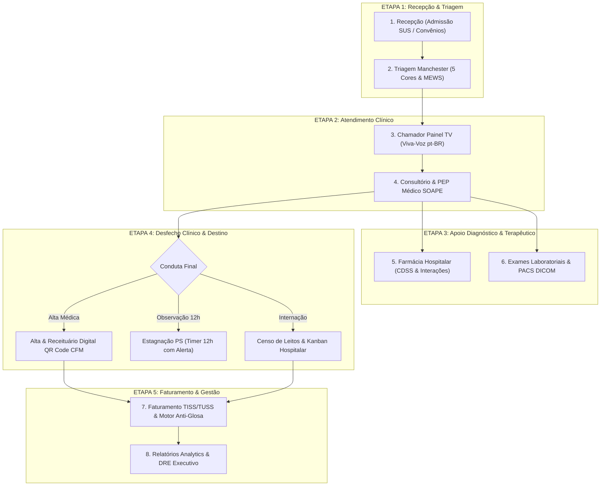

---

### Particularidades e Diferenciais das Abas do Health Nexus

| # | Aba / Módulo | Funcionalidades Principais | Diferencial & Particularidades | Perfil com Acesso Total |
|:---:|:---|:---|:---|:---|
| **1** | **Autenticação & RBAC** | Login JWT, 24 contas clínicas/devs, perfis de acesso | Preservação de usuários em limpezas, lixeira com confirmação, auditoria de acessos. | Master / Administrador |
| **2** | **Dashboard Executivo** | KPIs em tempo real, receita, volume de atendimentos | Gráficos Chart.js clicáveis como botões de filtro ativo que direcionam para as abas. | Master, Médicos, Gestores |
| **3** | **Agenda de Consultas** | Marcação de consultas, seleção de médico e sala | Bot de WhatsApp Lembrete Interativo com resposta simulada [1] Confirmar / [2] Reagendar. | Recepção, Médicos, Master |
| **4** | **Pacientes (SUS)** | Admissão 11 campos SUS, CEP automático ViaCEP | Validação de responsável legal, busca unificada por Nome/CPF, Lixeira soft-delete. | Todos os perfis clínicos |
| **5** | **Atendimentos & Triagem** | Fila visual Kanban, classificação de risco Manchester | Cálculo MEWS, protocolos de emergência (IAM, AVC, Sepse) + chamada no Painel TV. | Enfermagem, Médicos, Master |
| **6** | **Painel TV (Chamador)** | Anúncio para sala de espera em tela cheia | Web Speech API: chamada em viva voz sintetizada em português (pt-BR) com áudio chime. | Recepção, Sala de Espera |
| **7** | **Prontuário PEP (SOAPE)** | Atendimento médico, CID-10, prescrições e evoluções | Resumo em 3-linhas (IA 2.0), exames preditivos, QR Code CFM SHA-256, PACS DICOM. | Médicos, Master |
| **8** | **Alertas & Estagnação** | Monitoramento de gargalos e permanência PS | Timer PS 12h (Azul <10h / Amarelo 10-12h / Vermelho >12h pulsante com reatribuição). | Coordenação Médica, Master |
| **9** | **Censo de Leitos** | Mapa visual de leitos hospitalares | Cards tricolores (Verde=Vago, Vermelho=Ocupado, Amarelo=Higienização pós-alta). | Enfermagem, Regulação, Master |
| **10** | **Kanban de Internação** | Gestão de internados por 5 setores | Metas de permanência (SLA) dinâmicas, timeline de evolução clínica, auditoria de atrasos. | Regulação de Leitos, Médicos |
| **11** | **Escalas de Trabalho** | Gestão de plantões de Médicos e Enfermeiros | Sub-abas dedicadas, turnos (6h, 12h, 24h, 12x36), garantia de plantão ativado para HOJE. | Gestão de Enfermagem e Médica |
| **12** | **Farmácia & Estoque** | Controle de estoque de medicamentos e insumos | Pesquisa global de fármacos em tempo real via OpenFDA / ANVISA por princípio ativo. | Farmacêuticos, Master |
| **13** | **Faturamento TISS / ANS** | Emissão de lotes XML TISS v4.01.00 e auditoria TUSS | Motor Anti-Glosa, verificação de carência e validação de procedimentos TUSS. | Faturamento, Financeiro, Master |

---

## 📌 Sumário Executivo

- 1. [Visão Geral & Arquitetura do Fluxo Hospitalar](#sec-1)
- 2. [Central de Atendimentos & Painel Kanban](#sec-2)
  - 2.1. [Cards Métricos e Filtros de Fila](#sec-2-1)
  - 2.2. [Fila 1: Aguardando Triagem (Protocolo Manchester)](#sec-2-2)
  - 2.3. [Fila 2: Aguardando Médico (Chamada de Consultório)](#sec-2-3)
  - 2.4. [Fila 3: Em Atendimento (Ações do Médico)](#sec-2-4)
- 3. [Prontuário Eletrônico Médico (PEP SOAPE)](#sec-3)
  - 3.1. [Estrutura SOAPE](#sec-3-1)
  - 3.2. [Motor CDSS & Alertas de Interações Medicamentosas](#sec-3-2)
  - 3.3. [Autocomplete CID-10](#sec-3-3)
  - 3.4. [Assinatura Eletrônica, Hash SHA-256 e QR Code CFM](#sec-3-4)
- 4. [Guia Completo de Todos os Modais do Sistema](#sec-4)
  - 4.1. [Modal de Triagem Manchester](#sec-4-1)
  - 4.2. [Modal de Prescrição & Receituário Médico](#sec-4-2)
  - 4.3. [Modal de Transferência & Alocação de Leito](#sec-4-3)
  - 4.4. [Modal de Nova Admissão & Entrada de Paciente](#sec-4-4)
  - 4.5. [Modal de Direcionamento & Reatribuição de Fila](#sec-4-5)
  - 4.6. [Modal de Histórico Pós-Alta & Prontuário Consolidado](#sec-4-6)
  - 4.7. [Modal de Aprovação de Acesso de Usuários](#sec-4-7)
  - 4.8. [Modal de Gestão de Usuários & Troca de Perfil](#sec-4-8)
- 5. [Gestão de Pacientes & Linha do Cuidado Completa](#sec-5)
- 6. [Gestão da Equipe Médica & Corpo Clínico](#sec-6)
- 7. [Gestão de Consultórios & Salas de Atendimento](#sec-7)
- 8. [Gestão Avançada de Leitos, Censo & Histórico](#sec-8)
- 9. [Agenda, Escala Médica & Consultas Eletivas](#sec-9)
- 10. [Farmácia & Dispensação de Medicamentos](#sec-10)
- 11. [Faturamento, Guias TISS & Gestão Financeira](#sec-11)
- 12. [Relatórios Analytics & Indicadores Hospitalares](#sec-12)
- 13. [Painel de Chamada TV & Sala de Espera](#sec-13)
- 14. [Central de Estagnação & Aprovações de Acesso](#sec-14)
- 15. [Configurações, Backup e Sincronização em Nuvem (Turso Cloud)](#sec-15)
- 16. [Sistema de Avisos, Notificações & Toasts](#sec-16)
- 17. [Tabela de Máscaras, Atalhos & Teclas de Atalho](#sec-17)
- 18. [Solução de Dúvidas Frequentes & Erros Comuns (FAQ)](#sec-18)
- 19. [Novas Funcionalidades Avançadas Assistenciais & Tecnológicas (v2.8.0)](#sec-19)

---

<h2 id="sec-1">1. Visão Geral & Arquitetura do Fluxo Hospitalar</h2>

O **Health Nexus** organiza a jornada assistencial do paciente desde a recepção até a alta definitiva ou internação em UTI/Enfermaria, respeitando os níveis de autorização definidos pela matriz de segurança.

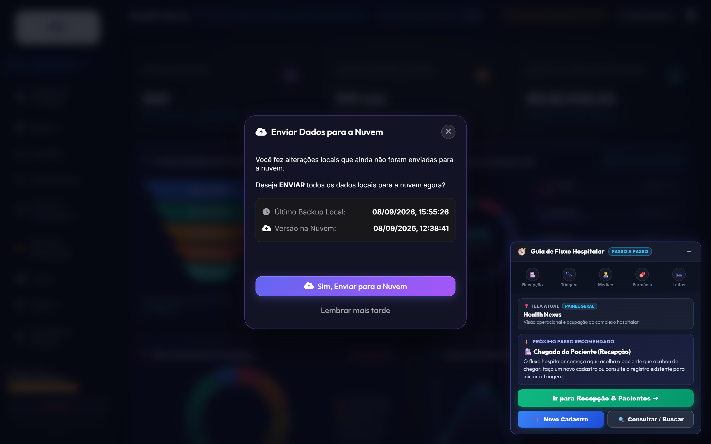

### 🔒 Perfis de Acesso & Matriz de Permissões (RBAC)

| Perfil | Acesso Visual às Abas | Prontuário (PEP) | Triagem Manchester | Prescrição Médica | Gestão de Leitos | Faturamento / TISS | Configurações / Nuvem |
|:---|:---|:---|:---|:---|:---|:---|:---|
| **Master / Admin** | Todas as 13 abas habilitadas | Acesso Completo & Auditoria | Execução & Edição | Visualização & Auditoria | Controle Total de Vagas | Gestão Financeira Global | Configuração Total & Backup |
| **Médico(a)** | Dashboard, Pacientes, Atendimentos, Leitos, Farmácia, Relatórios | Assinatura Digital SOAPE | Consulta de Sinais Vitais | Prescrição & CDSS Ativo | Solicitação de Internação | Visualização de Procedimentos | Bloqueado por Política |
| **Enfermeiro(a)** | Dashboard, Pacientes, Atendimentos, Leitos, Farmácia, Escalas | Leitura de Condutas | Execução Manchester & MEWS | Checagem de Aprazamento | Movimentação & Higienização | Bloqueado por Política | Bloqueado por Política |
| **Recepcionista** | Dashboard, Pacientes, Agenda, Atendimentos, Painel TV | Bloqueado por Sigilo | Encaminhamento para Fila | Bloqueado por Política | Bloqueado por Política | Emissão de Recibo Particular | Bloqueado por Política |
| **Farmacêutico(a)** | Dashboard, Farmácia, Atendimentos (Prescrições), Relatórios | Consulta de Prescrições | Bloqueado por Política | Validação de Interações | Bloqueado por Política | Baixa de Medicamentos | Bloqueado por Política |
| **Faturista / Finanças**| Dashboard, Faturamento TISS, Relatórios, Configurações Básicas | Bloqueado (Dados Clínicos Ocultos) | Bloqueado por Política | Bloqueado por Política | Consulta de Diárias | Emissão XML TISS & Anti-Glosa | Relatórios de Caixa |
| **Desenvolvedor** | Todas as abas com Painel de Diagnóstico | Auditoria Técnica | Simulação de Triagens | Auditoria de Logs | Inspeção de Banco | Testes de Carga de Guias | Dual-Pipeline Sync & Console |

---

<h2 id="sec-2">2. Central de Atendimentos & Painel Kanban</h2>

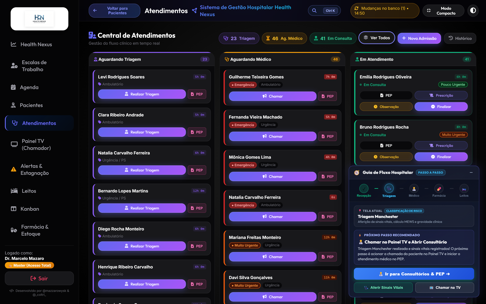

<h3 id="sec-2-1">2.1. Cards Métricos e Filtros de Fila</h3>

No topo da aba **Atendimentos**, encontram-se os 4 **Cards Métricos Clicáveis** para controle imediato do fluxo:

| Card | Ícone | Cor Tema | Ação ao Clicar | Descrição / Objetivo | Meta Operacional |
|:---|:---:|:---:|:---|:---|:---|
| **Triagem** | 🩺 | Roxo (`#8b5cf6`) | `filterKanbanColumn('triage')` | Filtra a tela para exibir exclusivamente a coluna de pacientes aguardando triagem. | Fila zero / Espera < 10 min |
| **Ag. Médico** | ⏳ | Amarelo (`#f59e0b`) | `filterKanbanColumn('waiting')` | Filtra a tela para exibir apenas os pacientes triados aguardando chamada do médico. | Respeitar SLA Manchester |
| **Em Consulta** | 👨‍⚕️ | Verde (`#10b981`) | `filterKanbanColumn('active')` | Filtra a tela para focar nos atendimentos em andamento e em observação no PS. | Giro de consultório ágil |
| **Ver Todos** | 📊 | Neutro (`#94a3b8`) | `filterKanbanColumn('all')` | Reseta os filtros e exibe as 3 colunas lado a lado no painel Kanban integrado. | Visão global do pronto-socorro |

---

<h3 id="sec-2-2">2.2. Fila 1: Aguardando Triagem (Protocolo de Manchester)</h3>

Pacientes admitidos na recepção dão entrada nesta fila para classificação de risco pela enfermagem.

#### Tabela de Parâmetros Clínicos e Sinais Vitais da Triagem

| Parâmetro Clínico | Unidade / Formato | Faixa de Referência Normal | Limiar de Alerta Moderado | Limiar Crítico de Emergência | Conduta Imediata no Sistema |
|:---|:---:|:---|:---|:---|:---|
| **Pressão Arterial (PA)** | mmHg (`000/00`) | 110/70 a 120/80 mmHg | 140/90 a 179/109 mmHg | PAS >= 180 ou PAD >= 110 mmHg | Aciona Protocolo de Crise Hipertensiva |
| **Frequência Cardíaca (FC)** | bpm | 60 a 100 bpm | 101 a 120 bpm ou 50 a 59 bpm | FC > 130 bpm ou FC < 40 bpm | Alerta de Taquiarritmia / Bradicardia Grave |
| **Frequência Respiratória** | irpm | 12 a 20 irpm | 21 a 24 irpm | FR > 28 irpm ou FR < 10 irpm | Alerta de Insuficiência Respiratória Aguda |
| **Temperatura Axilar** | °C | 36,0°C a 37,2°C | 37,8°C a 38,9°C (Febre) | Temp >= 39,5°C ou Temp < 35,0°C | Protocolo de Sepse / Manta Térmica |
| **Saturação de Oxigênio (SpO2)**| % em ar ambiente | 95% a 100% | 92% a 94% | SpO2 < 90% | Oferta imediata de O2 sob máscara / cateter |
| **Glicemia Capilar** | mg/dL | 70 a 99 mg/dL (jejum) | 140 a 250 mg/dL | Glicemia < 60 ou > 300 mg/dL | Alerta de Hipoglicemia / Cetoacidose Diabética |
| **Escala de Coma de Glasgow** | Escore (3 a 15) | 15 (Lúcido e Orientado) | 13 a 14 (Sonolento) | Glasgow <= 8 | Intubação Orotraqueal / Sala Vermelha |
| **Escala Visual Analógica (EVA)**| Escore (0 a 10) | 0 a 2 (Dor Leve) | 4 a 7 (Dor Moderada) | 8 a 10 (Dor Intensa / Insuportável) | Analgesia escalonada imediata |

#### Tabela de Classificação de Risco (Manchester) e Metas de Tempo

| Cor de Risco | Gravidade Clínica | Meta Máxima de Espera | Sinalização Visual no Card | Protocolo Automático Associado | Ação Obrigatória da Equipe |
|:---:|:---|:---:|:---|:---:|:---|
| **Vermelho** | Emergência Absoluta | **Imediato (0 min)** | Card Vermelho Piscante com Sirene | Protocolo de Ressuscitação / Parada / Choque | Conduzir imediatamente à Sala Vermelha sem burocracia. |
| **Laranja** | Muito Urgente | **10 minutos** | Borda Laranja com Badge Alerta | Protocolo IAM / AVC Isquêmico / Dor Torácica | Prioridade máxima na fila; chamar médico de plantão. |
| **Amarelo** | Urgente | **60 minutos** | Borda Amarela com Contador | Protocolo de Sepse / Crise Asmática / Fraturas | Monitorização periódica de sinais vitais a cada 30 min. |
| **Verde** | Pouco Urgente | **120 minutos** | Borda Verde com Tempo Transcorrido | Queixas Agudas Simples / Amigdalites / Entorses | Acomodação na sala de espera assistida. |
| **Azul** | Não Urgente | **240 minutos** | Borda Azul Padrão | Queixas Crônicas / Troca de Receita / Atestados | Orientação de atendimento em Unidade Básica de Saúde. |

---

<h3 id="sec-2-3">2.3. Fila 2: Aguardando Médico (Chamada de Consultório)</h3>

Nesta coluna, os pacientes são ordenados por **Gravidade Manchester** e **Tempo de Espera Decorrido**.

#### Tabela de Operações da Fila de Espera Médica

| Ação no Card | Ícone | Função Operacional | Mecanismo Técnico Envolvido | Efeito Imediato no Sistema |
|:---|:---:|:---|:---|:---|
| **Chamar Paciente na TV** | 📢 | Dispara chamada sonora e visual | Web Speech API + Websocket Local | Toca o chime de chamada, pronuncia nome do paciente e sala na TV. |
| **Iniciar Atendimento** | 🩺 | Abre o consultório e inicia consulta | Move registro para coluna "Em Consulta" | Carrega os dados da triagem e histórico anterior no PEP médico. |
| **Reclassificar Risco** | 🔄 | Reavalia o estado de saúde na espera | Abre o modal de reclassificação | Atualiza a cor Manchester caso o quadro clínico tenha piorado. |
| **Encaminhar para Medicação**| 💉 | Administra medicação de alívio rápida | Emite solicitação para a sala de medicação | Paciente aguarda analgesia sem perder posição na fila. |
| **Registrar Evasão** | 🏃 | Registra desistência do paciente | Altera status para "Evadido" | Libera a fila e gera log de auditoria com data e hora exatas. |

---

<h3 id="sec-2-4">2.4. Fila 3: Em Atendimento (Ações do Médico)</h3>

Coluna onde o médico realiza o atendimento ativo. Cada card contém 5 botões de ação:

#### Tabela de Controles e Botões de Ação do Médico

| Botão | Ícone | Ação Executada | Parâmetros Obrigatórios | Resultado no Fluxo Hospitalar |
|:---|:---:|:---|:---|:---|
| **PEP** | 🩺 | Abre o Prontuário Eletrônico SOAPE | Login médico ativo e CRM | Acesso total a anamnese, hipóteses diagnósticas e IA preditiva. |
| **Prescrição** | 📜 | Abre o receituário digital | Seleção de medicamento e posologia | Gera receita com código de barras, QR Code CFM e baixa na farmácia. |
| **Observação** | ⏱️ | Coloca em observação no PS (12h max)| Motivo clínico e reavaliação | Inicia contagem regressiva de estagnação com alerta aos 10h e 12h. |
| **Transferir Leito**| 🛏️ | Solicita leito de internação hospitalar| Especialidade médica e tipo de vaga | Envia solicitação formal para o Censo e Kanban de Internação. |
| **Finalizar** | ✅ | Conclui o atendimento com alta médica | Diagnóstico CID-10 e conduta final | Emite atestado, receita, guia de faturamento e encerra a conta. |

---

<h2 id="sec-3">3. Prontuário Eletrônico Médico (PEP SOAPE)</h2>

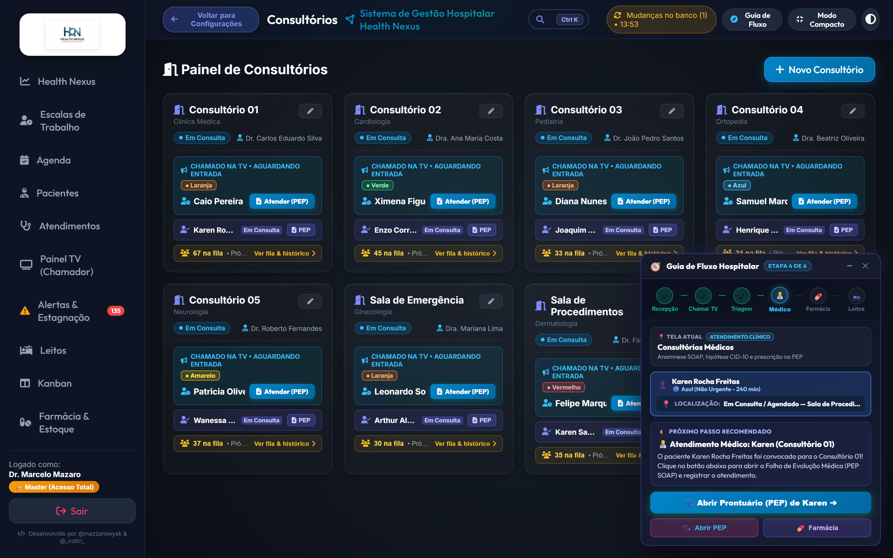

<h3 id="sec-3-1">3.1. Estrutura SOAPE</h3>

| Bloco SOAPE | Elemento Clínico | Finalidade do Registro | Exemplo de Preenchimento Padronizado |
|:---|:---|:---|:---|
| **Subjetivo (S)** | Anamnese & Queixa | Relato cronológico e queixas narradas pelo paciente | *"Paciente relata dor precordial em aperto há 90 min, com irradiação para mandíbula e MSE, associada a náuseas e sudorese fria profusa."* |
| **Objetivo (O)** | Exame Físico & Sinais | Dados mensuráveis, sinais vitais e achados de palpação | *"BEG, sudoreico, taquicárdico. PA: 150/95 mmHg, FC: 108 bpm, FR: 22 irpm, SpO2: 94%. Ausculta cardíaca: RCR 2T sem sopros. Murmúrio vesicular presente."* |
| **Avaliação (A)** | Diagnóstico & Escore | Hipótese diagnóstica estruturada e código CID-10 | *"I21.0 — Infarto agudo transmural da parede anterior do miocárdio. TIMI Risk: 5 pontos (Alto Risco)."* |
| **Plano (P)** | Conduta Terapêutica | Prescrição medicamentosa, pedidos de exames e dieta | *"ECG 12 derivações imediato, AAS 300mg VO mastigável, Clopidogrel 300mg VO, Nitroglicerina SL se dor, contato urgente com hemodinâmica."* |
| **Evolução (E)** | Resposta ao Tratamento| Acompanhamento temporal da resposta às condutas | *"Após 30 minutos de analgesia, paciente relata melhora substancial da dor (EVA 2/10). ECG evidenciou supradesnivelamento de ST em V1-V4."* |

---

<h3 id="sec-3-2">3.2. Motor CDSS & Alertas de Interações Medicamentosas</h3>

O módulo de Suporte à Decisão Clínica (CDSS) monitora ativamente as prescrições para prevenir eventos adversos graves:

| Interação Fármaco A + B | Nível de Gravidade | Mecanismo Farmacodinâmico | Risco Clínico Potencial | Ação Automática Recomendada pelo Sistema |
|:---|:---:|:---|:---|:---|
| **Sildenafila + Isossorbida** | 🔴 Contraindicação Absoluta | Potencialização excessiva do óxido nítrico e GMPc | **Hipotensão arterial severa e choque refratário** | Bloqueia emissão da prescrição e exige troca de vasodilatador. |
| **Varfarina + Cetoprofeno** | 🔴 Contraindicação Absoluta | Deslocamento da ligação proteica e inibição plaquetária | **Hemorragia digestiva alta e sangramento grave** | Sugere substituição do AINE por Dipirona ou Paracetamol. |
| **Fentanil + Midazolam** | 🔴 Alto Risco | Sinergismo depressor sobre o centro respiratório central| **Depressão respiratória severa, apneia e óbito** | Alerta para monitorização rigorosa com oxímetro e Naloxona à mão. |
| **Azitromicina + Ondansetrona**| 🟡 Risco Moderado | Bloqueio dos canais de potássio hERG no miocárdio | **Prolongamento do intervalo QTc e Torsades de Pointes**| Solicita confirmação com realização de ECG prévio à infusão. |
| **Clonazepam + Morfina** | 🔴 Alto Risco | Potencialização da sedação e depressão no SNC | **Sedação profunda, hipoxemia e redução do reflexo de tosse**| Reduz doses recomendadas em 50% e orienta leito monitorizado. |
| **Ciprofloxacino + Dexametasona**| 🟡 Risco Moderado | Alteração do metabolismo de colágeno e fibroblastos | **Tendinite aguda e risco aumentado de ruptura do tendão de Aquiles** | Alerta o médico para limitar tempo de uso em pacientes idosos. |
| **Espironolactona + Enalapril**| 🟡 Risco Moderado | Inibição cumulativa da excreção renal de potássio | **Hipercalemia grave com arritmias ventriculares** | Sugere monitorização do potássio sérico e função renal (ureia/creatinina). |
| **Fluconazol + Sinvastatina** | 🔴 Alto Risco | Inibição potente do citocromo CYP3A4 | **Rabdomiólise e insuficiência renal aguda** | Recomenda suspensão temporária da estatina durante o antifúngico. |

---

<h3 id="sec-3-3">3.3. Autocomplete CID-10 e Diagnósticos Frequentes</h3>

| Código CID-10 | Descrição Oficial da Doença (OMS) | Especialidade Responsável | Protocolo de Emergência Associado | Exames Complementares Típicos |
|:---:|:---|:---|:---|:---|
| **I21.9** | Infarto Agudo do Miocárdio não especificado | Cardiologia / Emergência | Protocolo IAM (Porta-ECG < 10 min) | Troponina I, CK-MB, ECG 12 derivações, Ecocardiograma. |
| **I64** | Acidente Vascular Cerebral não especificado | Neurologia / Emergência | Protocolo AVC (Janela Trombolítica 4,5h) | Tomografia de Crânio, Angio-TC, Glicemia, Tempo de Protrombina. |
| **A41.9** | Sepse não especificada | Terapia Intensiva / PS | Protocolo Sepse (Pacote da 1ª Hora) | Hemoculturas (2 pares), Lactato Sérico, Gasometria, Leucograma. |
| **J18.9** | Pneumonia não especificada | Pneumologia / Clínica | Protocolo Respiratório (CURB-65) | Radiografia de Tórax, PCR quantitativo, Hemograma completo. |
| **K35.8** | Apendicite Aguda Outra e a Não Especificada | Cirurgia Geral | Protocolo de Abdome Agudo Cirúrgico | Ultrassom de Abdome, Tomografia, Jejum absoluto, Hemograma. |
| **E11.0** | Diabetes Mellitus Tipo 2 com Coma | Endocrinologia / Emergência| Protocolo de Cetoacidose / Estado Hiperosmolar | Glicemia horária, Gasometria arterial, Cetonemia, Eletrólitos. |
| **J44.1** | DPOC com Exacerbação Aguda | Pneumologia / Emergência | Protocolo DPOC Descompensado | Gasometria arterial, Radiografia de tórax, Nebulização contínua. |
| **R10.4** | Outras Dores Abdominais e as Não Especificadas | Clínica Geral / PS | Investigação Diagnóstica em Observação | Amilase, Lipase, EAS urina, Ultrassonografia total. |

---

<h3 id="sec-3-4">3.4. Assinatura Eletrônica, Hash SHA-256 e QR Code CFM</h3>

| Requisito de Segurança | Tecnologia Empregada | Legislação & Conformidade | Impacto Prático na Autenticidade do Documento |
|:---|:---|:---|:---|
| **Hash SHA-256 Criptográfico** | Algoritmo determinístico de 256 bits | Medida Provisória nº 2.200-2 / ICP-Brasil | Gera uma impressão digital única; qualquer caractere alterado invalida o hash. |
| **QR Code de Validação Pública**| Imagem bidimensional com URL segura | Resolução CFM nº 2.299/2021 | Paciente ou farmácia escaneia com o smartphone e confere o laudo original online. |
| **Carimbo Digital UTC** | Sincronização temporal ISO-8601 | Padrão Horário de Brasília / Observatório Nacional | Prova a data e o segundo exato em que a conduta foi tomada. |
| **CRM e RQE do Médico** | Chave pública do prestador cadastrado | Conselho Regional de Medicina | Vincula juridicamente a autoria da receita ou laudo ao profissional habilitado. |

---

<h2 id="sec-4">4. Guia Completo de Todos os Modais do Sistema</h2>

<h3 id="sec-4-1">4.1. Modal de Triagem Manchester</h3>

- **Gatilho de Abertura:** Clique no botão `Realizar Triagem` na coluna 1 do Kanban de Atendimentos.
- **Campos de Entrada do Formulário:**

| Campo | Identificador HTML | Tipo de Entrada | Regra de Validação | Exemplo de Preenchimento Válido |
|:---|:---|:---|:---|:---|
| **Pressão Arterial** | `#triage-pa` | Texto formatado | Máscara `000/00`, PAS 50-300, PAD 30-200 | `120/80` |
| **Frequência Cardíaca** | `#triage-fc` | Numérico | Inteiro positivo entre 30 e 250 bpm | `78` |
| **Frequência Respiratória**| `#triage-fr` | Numérico | Inteiro positivo entre 8 e 60 irpm | `16` |
| **Temperatura** | `#triage-temp` | Decimal (`00.0`) | Valor entre 32.0 e 43.0 °C | `36.6` |
| **Saturação de O2** | `#triage-spo2` | Numérico | Porcentagem entre 50% e 100% | `98` |
| **Glicemia Capilar** | `#triage-glicemia` | Numérico | Valor entre 20 e 800 mg/dL | `95` |
| **Escala de Dor** | `#triage-dor` | Seletor (0 a 10) | Escala visual numérica obrigatória | `3 - Dor Leve` |
| **Queixa Principal** | `#triage-complaints` | Área de texto | Mínimo de 10 caracteres explicativos | `Cefaleia holocraniana pulsátil há 1 dia.` |

- **Botões e Ações do Modal:**

| Botão | Identificador HTML | Ação Disparada | Validação Prévia | Efeito no Sistema |
|:---|:---|:---|:---|:---|
| **Salvar & Chamar na TV**| `#btn-triage-save-call` | Salva triagem e aciona chamada sonora | Todos os campos vitais preenchidos | Grava cor, toca chime e anuncia paciente na TV. |
| **Apenas Salvar Triagem** | `#btn-triage-save-only` | Conclui sem acionar a chamada de voz | Todos os campos vitais preenchidos | Move o paciente para a coluna "Aguardando Médico". |
| **Cancelar** | `#btn-triage-cancel` | Fecha modal sem persistir dados | Nenhuma validação exigida | Descarta alterações e mantém o status anterior. |

---

<h3 id="sec-4-2">4.2. Modal de Prescrição & Receituário Médico</h3>

- **Gatilho de Abertura:** Clique no botão `Prescrição` no card do paciente ou dentro do PEP Médico.
- **Campos de Entrada do Formulário:**

| Campo | Identificador HTML | Tipo de Entrada | Opções / Regras | Exemplo de Preenchimento Válido |
|:---|:---|:---|:---|:---|
| **Fármaco / Medicamento** | `#prescription-drug-search` | Autocomplete | Busca por nome comercial ou princípio ativo | `Amoxicilina + Clavulanato 875mg` |
| **Dose Unitária** | `#prescription-dosage` | Texto curto | Valor e unidade de medida | `1 comprimido` ou `500 mg` |
| **Via de Administração** | `#prescription-route` | Seletor | VO, EV, IM, SC, SL, Inalatória, Tópica | `Via Oral (VO)` |
| **Posologia / Frequência** | `#prescription-freq` | Seletor / Texto | 8/8h, 12/12h, 1x ao dia, Se necessário | `De 8 em 8 horas por 7 dias` |
| **Orientações Especiais** | `#prescription-notes` | Área de texto | Instruções para o paciente e enfermagem | `Tomar após as principais refeições com água.` |

- **Botões e Ações do Modal:**

| Botão | Identificador HTML | Ação Disparada | Validação Prévia | Efeito no Sistema |
|:---|:---|:---|:---|:---|
| **Adicionar Fármaco** | `#btn-add-drug-item` | Insere o medicamento na lista ativa | Fármaco e posologia preenchidos | Valida interação CDSS e inclui linha na receita. |
| **Salvar & Dispensar** | `#btn-save-dispense` | Envia pedido direto à farmácia | Ao menos 1 medicamento na lista | Envia ordem de separação com baixa no estoque. |
| **Imprimir Receita (PDF)**| `#btn-print-rx-pdf` | Gera PDF oficial padrão CFM com QR Code| Prescrição salva no sistema | Download de documento com carimbo digital SHA-256. |
| **Fechar** | `#btn-close-prescription`| Encerra a visualização | Salva rascunho automático | Retorna à aba sem perder itens adicionados. |

---

<h3 id="sec-4-3">4.3. Modal de Transferência & Alocação de Leito</h3>

- **Gatilho de Abertura:** Clique no botão `Transferir Leito` no card do paciente na Central de Atendimentos.
- **Campos de Entrada do Formulário:**

| Campo | Identificador HTML | Tipo de Entrada | Regra de Negócio | Exemplo de Preenchimento Válido |
|:---|:---|:---|:---|:---|
| **Paciente Selecionado** | `#transfer-patient-name` | Texto somente-leitura | Pré-carregado com nome e prontuário | `Marcelo Mazaro (Prontuário #0042)` |
| **Setor Hospitalar Destino**| `#transfer-sector-select`| Seletor de opções | Enfermaria Geral, UTI Adulto, Isolamento | `UTI Adulto - Bloco B` |
| **Leito Vago Disponível** | `#transfer-bed-select` | Seletor dinâmico | Apenas leitos com status "Vago" | `Leito UTI-03 (Vago / Higienizado)` |
| **Justificativa Clínica** | `#transfer-reason` | Área de texto | Mínimo 15 caracteres para auditoria | `Necessidade de suporte ventilatório mecânico invasivo.`|

- **Botões e Ações do Modal:**

| Botão | Identificador HTML | Ação Disparada | Validação Prévia | Efeito no Sistema |
|:---|:---|:---|:---|:---|
| **Confirmar Transferência**| `#btn-confirm-transfer` | Ocupa o novo leito e move paciente | Leito de destino vago selecionado | Altera status do leito para Ocupado e gera log. |
| **Solicitar Higienização** | `#btn-request-cleaning` | Envia leito anterior para limpeza | Leito de origem desocupado | Marca leito anterior como "Higienização". |
| **Cancelar** | `#btn-cancel-transfer` | Fecha janela sem alterações | Nenhuma validação exigida | Mantém o paciente no local atual. |

---

<h3 id="sec-4-4">4.4. Modal de Nova Admissão & Entrada de Paciente</h3>

- **Gatilho de Abertura:** Clique no botão `+ Nova Admissão` no topo da Central de Atendimentos ou tecle `Alt + N`.
- **Campos de Entrada do Formulário:**

| Campo | Identificador HTML | Tipo de Entrada | Regra de Validação | Exemplo de Preenchimento Válido |
|:---|:---|:---|:---|:---|
| **Paciente** | `#admissao-patient-select`| Autocomplete / Busca | Paciente cadastrado no banco | `Camila Ferreira de Souza` |
| **Tipo de Atendimento** | `#admissao-type` | Seletor | Emergência, Urgência, Consulta Eletiva | `Pronto-Socorro Adulto` |
| **Convênio / Plano de Saúde**| `#admissao-insurance`| Seletor | SUS, Unimed, Bradesco, Particular | `Unimed Saúde Nacional` |
| **Número da Carteirinha** | `#admissao-card-number`| Texto alfanumérico | Obrigatório se convênio privado | `0034.9812.3340.01-8` |
| **Queixa Inicial / Motivo** | `#admissao-chief-complaint`| Texto curto | Descreve o motivo da procura médica | `Febre persistente há 3 dias e tosse produtiva.`|

- **Botões e Ações do Modal:**

| Botão | Identificador HTML | Ação Disparada | Validação Prévia | Efeito no Sistema |
|:---|:---|:---|:---|:---|
| **Confirmar Entrada** | `#btn-confirm-admissao` | Cria novo atendimento ativo | Paciente e motivo preenchidos | Insere o paciente na Fila 1 (Aguardando Triagem). |
| **+ Cadastrar Novo Paciente**| `#btn-quick-new-patient`| Abre modal de cadastro rápido | Nenhuma exigência prévia | Permite cadastrar paciente novo sem sair do fluxo. |
| **Fechar** | `#btn-close-admissao` | Cancela a admissão | Nenhuma validação | Fecha o modal sem registrar atendimento. |

---

<h3 id="sec-4-5">4.5. Modal de Direcionamento & Reatribuição de Fila</h3>

- **Gatilho de Abertura:** Na aba **Estagnação**, clique no botão `Direcionar` de um paciente com tempo excedido.
- **Campos de Entrada do Formulário:**

| Campo | Identificador HTML | Tipo de Entrada | Regra de Negócio | Exemplo de Preenchimento Válido |
|:---|:---|:---|:---|:---|
| **Paciente Estagnado** | `#stagnation-patient` | Somente leitura | Dados do atendimento com tempo em atraso | `Lucas Mendes (Tempo decorrido: 13h 40min)` |
| **Novo Consultório** | `#stagnation-room` | Seletor de salas | Salas disponíveis com médico ativo | `Consultório 03 (Dr. Roberto Alves)` |
| **Conduta Imediata** | `#stagnation-action` | Seletor | Reavaliar agora, Alta assistida, Vaga UTI | `Reavaliação Médica Imediata` |
| **Observações da Regulação**| `#stagnation-notes` | Área de texto | Justificativa do remanejamento urgente | `Paciente aguarda laudo de tomografia para desfecho.`|

- **Botões e Ações do Modal:**

| Botão | Identificador HTML | Ação Disparada | Validação Prévia | Efeito no Sistema |
|:---|:---|:---|:---|:---|
| **Confirmar Reatribuição**| `#btn-confirm-reassign` | Move paciente para topo da fila médica | Novo consultório selecionado | Zera alertas vermelhos e notifica médico da sala. |
| **Solicitar Internação** | `#btn-request-bed-urgent`| Converte observação em internação | Laudo de solicitação preenchido | Cria chamado urgente na Central de Leitos. |
| **Cancelar** | `#btn-cancel-reassign` | Descarta a operação | Nenhuma validação | Mantém paciente na fila de alerta de estagnação. |

---

<h3 id="sec-4-6">4.6. Modal de Histórico Pós-Alta & Prontuário Consolidado</h3>

- **Gatilho de Abertura:** Clique no botão `Histórico` no cabeçalho ou na aba **Pacientes**.
- **Campos e Filtros do Histórico:**

| Campo / Filtro | Identificador HTML | Tipo de Controle | Regra de Filtro | Exemplo de Uso |
|:---|:---|:---|:---|:---|
| **Busca por Nome ou CPF**| `#history-search-input` | Campo de busca instantânea| Filtra registros em tempo real | `Renato Ramos` ou `341.890` |
| **Filtro por Período** | `#history-date-range` | Seletor de datas | Hoje, Últimos 7 dias, Mês, Personalizado| `Últimos 30 dias` |
| **Filtro por Desfecho** | `#history-outcome-filter`| Seletor | Alta médica, Internação, Transferência | `Alta Médica Curada` |

- **Botões e Ações do Modal:**

| Botão | Identificador HTML | Ação Disparada | Validação Prévia | Efeito no Sistema |
|:---|:---|:---|:---|:---|
| **Imprimir Prontuário (PDF)**| `#btn-print-consolidated-pdf`| Gera PDF com toda a linha do cuidado | Atendimento selecionado | Baixa histórico completo com todas as evoluções. |
| **Visualizar Evolução** | `#btn-view-timeline` | Abre linha do tempo detalhada | Seleção de registro | Exibe todos os passos da admissão até a alta. |
| **Fechar** | `#btn-close-history` | Fecha modal de histórico | Nenhuma validação | Retorna à tela anterior. |

---

<h3 id="sec-4-7">4.7. Modal de Aprovação de Acesso de Usuários</h3>

- **Gatilho de Abertura:** Exclusivo do **Administrador Master** na aba de Gestão de Usuários e Estagnação.
- **Campos de Validação do Operador:**

| Campo Informativo | Identificador HTML | Origem do Dado | Função de Auditoria |
|:---|:---|:---|:---|
| **Nome Completo do Solicitante**| `#user-req-name` | Cadastro inicial | Identificação nominal do colaborador. |
| **E-mail Institucional** | `#user-req-email` | Cadastro inicial | Validação de domínio corporativo (`@hospital.com`). |
| **Perfil Solicitado** | `#user-req-role` | Formulário de registro | Cargo pretendido (Médico, Enfermagem, etc.). |
| **Registro Profissional** | `#user-req-council` | CRM / COREN informado | Checagem de regularidade no conselho de classe. |

- **Botões e Ações do Modal:**

| Botão | Identificador HTML | Ação Disparada | Validação Prévia | Efeito no Sistema |
|:---|:---|:---|:---|:---|
| **Aprovar Acesso Total** | `#btn-approve-user` | Ativa credencial com perfil solicitado | Auditoria de CRM/COREN positiva | Libera login no sistema e sincroniza com Turso Cloud. |
| **Aprovar com Restrição** | `#btn-approve-restricted`| Ativa perfil com permissões limitadas | Seleção de novo papel restrito | Usuário acessa apenas visualização básica. |
| **Recusar Solicitação** | `#btn-reject-user` | Exclui cadastro pendente | Confirmação do administrador | Bloqueia credencial e envia notificação de recusa. |

---

<h3 id="sec-4-8">4.8. Modal de Gestão de Usuários & Troca de Perfil</h3>

- **Gatilho de Abertura:** Clique no avatar ou nome do usuário logado no canto superior direito do cabeçalho.
- **Campos de Configuração da Conta:**

| Campo | Identificador HTML | Tipo de Entrada | Regra de Validação | Exemplo de Preenchimento Válido |
|:---|:---|:---|:---|:---|
| **Nome de Exibição** | `#profile-display-name` | Texto | Mínimo de 3 caracteres | `Dr. Carlos Eduardo Silva` |
| **Senha Atual** | `#profile-current-password`| Senha | Obrigatória para validar alterações | `********` |
| **Nova Senha** | `#profile-new-password` | Senha forte | Mínimo 8 dígitos, letras e números | `Nexus@2026Secure` |
| **Confirmar Nova Senha** | `#profile-confirm-password`| Senha idêntica | Deve coincidir com a nova senha | `Nexus@2026Secure` |

- **Botões e Ações do Modal:**

| Botão | Identificador HTML | Ação Disparada | Validação Prévia | Efeito no Sistema |
|:---|:---|:---|:---|:---|
| **Salvar Alterações** | `#btn-save-profile` | Atualiza senha e dados cadastrais | Senha atual válida e confirmação correta | Emite toast de sucesso e atualiza a sessão. |
| **Encerrar Sessão (Logout)**| `#btn-logout` | Efetua logout seguro do sistema | Confirmação do operador | Destrói o token JWT local e volta à tela de login. |
| **Fechar** | `#btn-close-profile` | Encerra sem alterar dados | Nenhuma validação | Mantém as configurações originais da conta. |

---

<h2 id="sec-5">5. Gestão de Pacientes & Linha do Cuidado Completa</h2>

Na aba **Pacientes**, o hospital mantém o cadastro centralizado e o acesso à trajetória clínica completa.

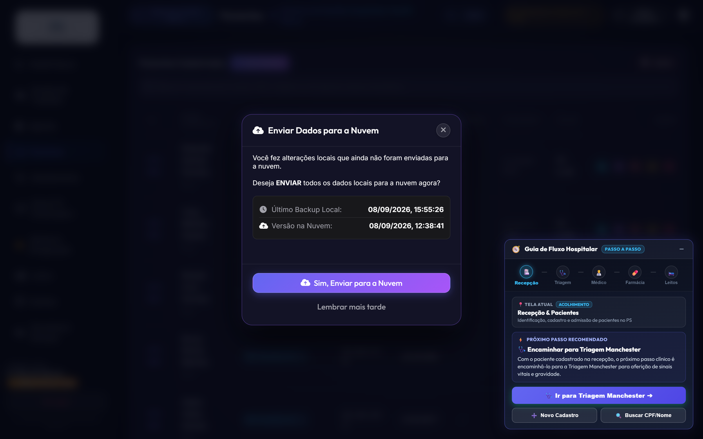

### 📋 Tabela de Campos Cadastrais do Paciente (Padrão 11 Campos SUS)

| # | Campo Cadastral | Identificador HTML | Tipo de Dado | Regra de Validação | Exemplo de Preenchimento Válido |
|:---:|:---|:---|:---|:---|:---|
| **1** | **Nome Completo** | `#paciente-nome` | Texto alfabético | Mínimo 3 caracteres, sem abreviações | `Renato Ramos Machado` |
| **2** | **CPF** | `#paciente-cpf` | Numérico formatado | 11 dígitos com cálculo de dígitos verificadores | `341.890.128-44` |
| **3** | **Data de Nascimento** | `#paciente-nascimento` | Data (`AAAA-MM-DD`) | Não pode ser data futura; calcula idade automática | `1985-04-12` (41 anos) |
| **4** | **Sexo / Gênero** | `#paciente-sexo` | Seletor de opções | Masculino, Feminino, Outro | `Masculino` |
| **5** | **Nome Completo da Mãe**| `#paciente-mae` | Texto alfabético | Campo obrigatório para cruzamento no SUS | `Maria das Dores Machado` |
| **6** | **Cartão Nacional SUS**| `#paciente-cns` | Numérico formatado | 15 dígitos padrão Ministério da Saúde | `700 1234 5678 9012` |
| **7** | **Telefone / WhatsApp** | `#paciente-telefone` | Formato `(00) 00000-0000` | DDD de 2 dígitos + número de 9 dígitos | `(11) 98765-4321` |
| **8** | **CEP Residencial** | `#paciente-cep` | Formato `00000-000` | 8 dígitos; autopreenchimento via API ViaCEP | `01310-100` |
| **9** | **Logradouro & Número**| `#paciente-endereco` | Texto | Preenchido automaticamente via CEP + número | `Avenida Paulista, 1578, Apto 82` |
| **10**| **Bairro, Cidade & UF** | `#paciente-cidade-uf` | Texto | Autopreenchido pelo CEP com sigla do estado | `Bela Vista - São Paulo / SP` |
| **11**| **Responsável Legal** | `#paciente-responsavel` | Texto e telefone | Obrigatório se idade < 18 anos ou > 65 anos | `Tereza Ramos (Mãe) - (11) 98877-6655`|

### 🛡️ Tabela de Ações e Operações da Aba Pacientes

| Ação no Painel | Ícone / Botão | Finalidade Operacional | Regra de Segurança | Resultado no Banco de Dados |
|:---|:---:|:---|:---|:---|
| **Novo Paciente** | `+ Adicionar` | Cadastra novo prontuário | CPF único obrigatório | Cria registro com timestamp e ID sequencial. |
| **Busca Spotlight** | 🔍 | Localiza prontuários rapidamente | Busca por CPF ou parte do nome | Filtra a listagem em tempo real na tela. |
| **Editar Cadastro** | ✏️ | Atualiza telefone, endereço ou convênio | Apenas operadores autorizados | Grava nova versão com registro de auditoria. |
| **Linha do Cuidado** | 📜 | Exibe histórico completo de consultas | Qualquer profissional clínico | Abre timeline com todas as passagens no hospital. |
| **Mover para Lixeira**| 🗑️ | Soft-delete do paciente | Confirmação em modal seguro | Oculta da lista geral mantendo histórico seguro. |
| **Restaurar Lixeira** | ♻️ | Reativa paciente excluído | Exclusivo Administrador Master | Restaura prontuário com integridade intacta. |

---

<h2 id="sec-6">6. Gestão da Equipe Médica & Corpo Clínico</h2>

Na aba **Médicos**, gerencia-se o corpo clínico, especialidades, consultórios e status de plantão ativo.

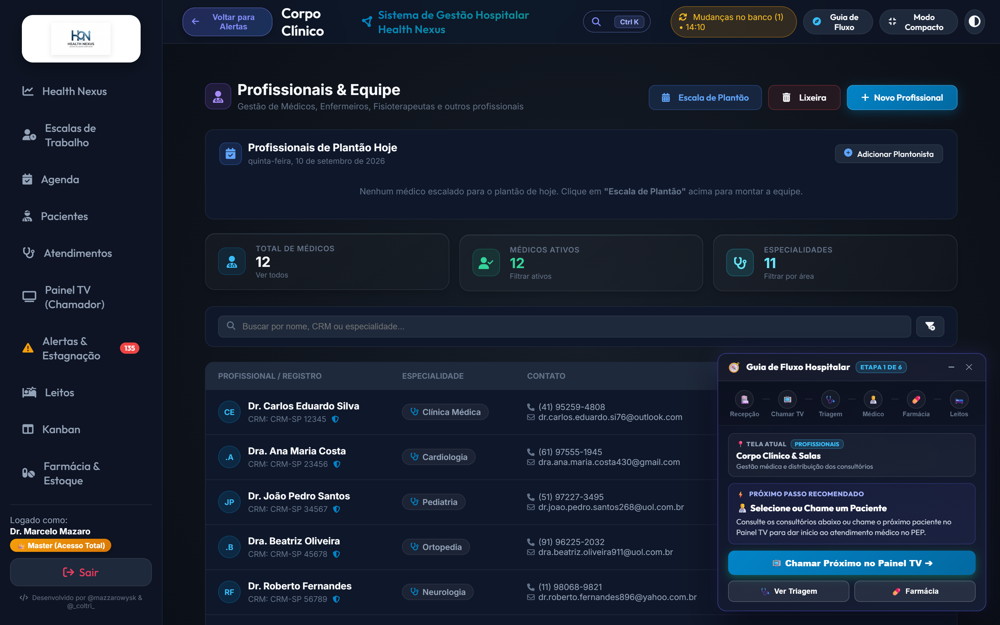

### 🩺 Tabela de Cadastro e Status do Corpo Clínico

| Médico(a) | CRM / UF | Especialidade RQE | Consultório Alocado | Turno de Trabalho | Status Plantão | Ações Disponíveis |
|:---|:---:|:---|:---:|:---:|:---:|:---|
| **Dr. Carlos Eduardo Silva** | `123456/SP` | Cardiologia (RQE 45102) | Consultório 01 | Manhã (07h às 13h) | 🟢 `Em Plantão` | `🩺 Abrir PEP`, `Escala`, `Editar` |
| **Dra. Mariana Costa** | `234567/SP` | Pediatria (RQE 38921) | Consultório 02 | Manhã (07h às 13h) | 🟢 `Em Plantão` | `🩺 Abrir PEP`, `Escala`, `Editar` |
| **Dr. Roberto Alves** | `345678/SP` | Ortopedia e Traumatologia| Consultório 03 | Tarde (13h às 19h) | ⚪ `Folga` | `Ativar Plantão`, `Ver Agenda` |
| **Dra. Fernanda Lima** | `456789/SP` | Emergência e Terapia Int.| Sala Vermelha | Noite 12h (19h às 07h)| 🟢 `Em Plantão` | `🚨 Sala Vermelha`, `Histórico` |
| **Dr. André Guimarães** | `567890/SP` | Cirurgia Geral (RQE 21094) | Centro Cirúrgico | Plantão 24 horas | 🟢 `Em Cirurgia` | `Avisar Retorno`, `Substituto` |
| **Dra. Beatriz Santos** | `678901/SP` | Ginecologia e Obstetrícia | Consultório 04 | Tarde (13h às 19h) | 🟡 `Intervalo` | `Retornar à Sala`, `Transferir` |
| **Dra. Juliana Costa** | `789012/SP` | Cardiologia Intensiva | Consultório 01 | Noite 12h (19h às 07h)| 🟢 `Em Plantão` | `🩺 Abrir PEP`, `Escala`, `Plantão` |
| **Enf. Patrícia Lima** | `COREN-SP 18920`| Enfermagem de Emergência | Sala de Triagem | Manhã (07h às 13h) | 🟢 `Em Plantão` | `🩺 Triagem MEWS`, `Troca Turno`|

### ⚙️ Tabela de Operações de Gestão do Corpo Clínico

| Operação | Gatilho / Botão | Descrição do Procedimento | Requisito Prévio | Efeito Prático na Recepção e TV |
|:---|:---:|:---|:---|:---|
| **Cadastrar Médico** | `+ Novo Médico` | Registra nome, CRM, RQE e contatos | Validação de CRM junto ao CFM | Habilita o médico para escalas e assinaturas no PEP. |
| **Alocar Consultório** | `Alocar Sala` | Define em qual sala física o médico atende | Consultório vago selecionado | Direciona o painel TV para chamar pacientes para a sala correta. |
| **Alternar Plantão** | `Ativar / Pausar`| Alterna status entre Ativo, Intervalo e Folga | Seleção do profissional | Atualiza o contador de médicos disponíveis no Dashboard. |
| **Substituição de Emergência**| `Substituir`| Transfere a fila de um médico para outro | Ausência justificada de médico | Move todos os pacientes em espera para o novo médico sem atraso. |

---

<h2 id="sec-7">7. Gestão de Consultórios & Salas de Atendimento</h2>

Na aba **Consultórios**, gerencia-se a infraestrutura física de atendimento ambulatorial e emergencial.

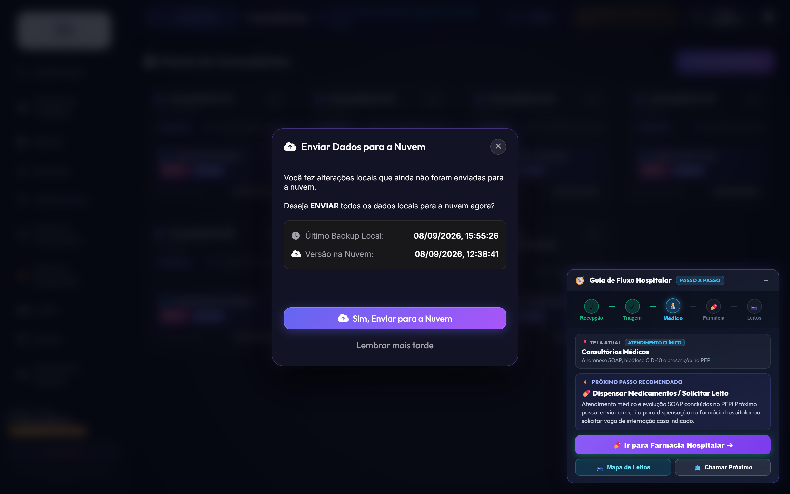

### 🚪 Tabela de Status e Ocupação das Salas de Atendimento

| Sala / Consultório | Ala / Bloco | Especialidade Principal | Médico Responsável | Status Atual | Tempo na Situação | Ações Rápidas |
|:---|:---|:---|:---|:---:|:---:|:---|
| **Consultório 01** | Térreo - Bloco A | Clínica Médica / Geral | Dr. Carlos Eduardo Silva | 🟢 `Em Atendimento` | 18 min | `🩺 Ver Atendimento`, `Finalizar` |
| **Consultório 02** | Térreo - Bloco A | Pediatria Ambulatorial | Dra. Mariana Costa | 🟢 `Disponível` | 4 min | `📢 Chamar Próximo`, `Pausar` |
| **Consultório 03** | Térreo - Bloco A | Ortopedia e Imobilizações | Dr. Roberto Alves | 🟡 `Higienização` | 12 min | `✨ Liberar Sala`, `Alocar Médico` |
| **Consultório 04** | Térreo - Bloco B | Ginecologia e Obstetrícia | Dra. Beatriz Santos | 🟢 `Em Atendimento` | 25 min | `🩺 Ver Atendimento`, `Pausar` |
| **Consultório 05** | 1º Andar - Especialidades | Neurologia Clínica | Dr. Marcos Vinicius | ⚪ `Fechado` | Fora de Turno | `Abrir Sala`, `Definir Escala` |
| **Sala Amarela** | Ala de Urgência | Observação Rápida Adulto | Dra. Fernanda Lima | 🔴 `Capacidade Máxima`| 2h 15m | `Transferir para Leito`, `Reavaliar` |
| **Sala Vermelha** | Emergência Crítica | Ressuscitação & Politrauma | Equipe de Choque Plantonista | 🟢 `Prontidão Total` | Prontidão Permanente | `🚨 Receber Emergência`, `Checklist` |
| **Sala de Sutura** | Urgência Cirúrgica | Pequenos Procedimentos | Dr. André Guimarães | 🟢 `Disponível` | 8 min | `Encaminhar Paciente`, `Repor Material` |
| **Obs. Pediátrica**| Ala Infantil | Suporte Respiratório Pediátrico | Dra. Mariana Costa | 🟢 `Disponível` | 15 min | `Acolher Criança`, `Oxigenoterapia` |
| **Sala de Gesso** | Ortopedia | Imobilizações e Tala Gessada | Dr. Roberto Alves | 🟢 `Disponível` | 30 min | `Realizar Redução`, `Imobilizar` |

---

<h2 id="sec-8">8. Gestão Avançada de Leitos, Censo & Histórico</h2>

Na aba **Leitos**, o hospital monitora a taxa de ocupação em tempo real, giros de leito e desinfecção.

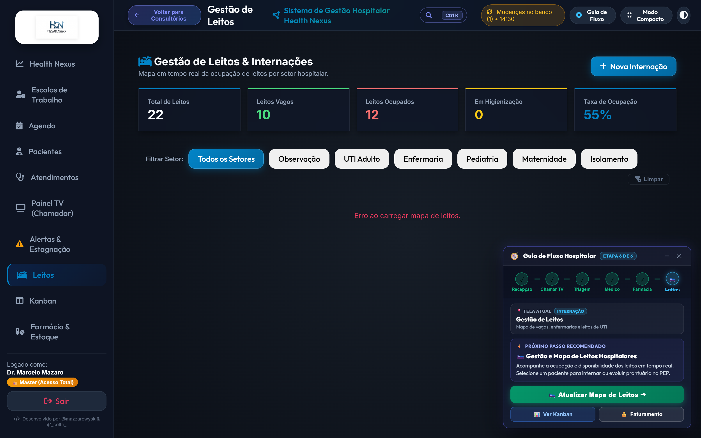

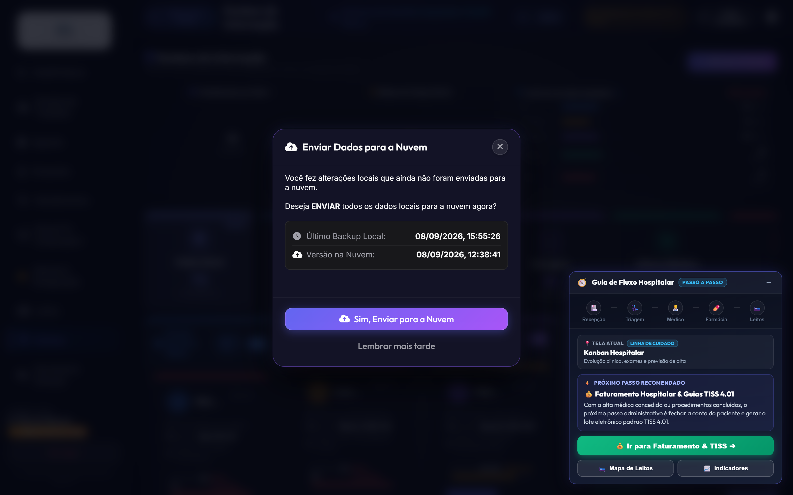

### 🛏️ Tabela do Censo Hospitalar e Mapa de Leitos

| Leito ID | Setor / Ala Hospitalar | Paciente Alocado | Diagnóstico de Internação | Tempo Internado | Status do Leito | Ações Permitidas |
|:---|:---|:---|:---|:---:|:---:|:---|
| **Leito 101-A** | Enfermaria Geral Adulto | Marcelo Mazaro | Pneumonia Comunitária Grave | 2 dias | 🔴 `Ocupado` | `🩺 PEP`, `📋 Prescrição`, `🚪 Alta` |
| **Leito 101-B** | Enfermaria Geral Adulto | Flávio Augusto Oliveira | Pós-operatório de Colecistectomia | 1 dia | 🔴 `Ocupado` | `🩺 PEP`, `📋 Prescrição`, `🚪 Alta` |
| **Leito 102-A** | Enfermaria Geral Adulto | Vago para Admissão | Aguardando paciente regulado | 0h | 🟢 `Vago` | `🛏️ Internar Paciente`, `Bloquear` |
| **Leito 102-B** | Enfermaria Geral Adulto | Em Desinfecção Terminal | Procedimento pós-alta de paciente | 35 min | 🟡 `Higienização` | `✨ Concluir Limpeza & Liberar` |
| **Leito 103-A** | Enfermaria Geral Adulto | Carlos Eduardo Santos | Descompensação de ICC Classe III | 3 dias | 🔴 `Ocupado` | `🩺 PEP`, `Ecocardiograma`, `Diuréticos` |
| **Leito UTI-01** | UTI Geral Adulto | José Ramos dos Santos | Choque Séptico / Foco Pulmonar | 5 dias | 🔴 `Ocupado` | `🚨 Acompanhar UTI`, `Exames` |
| **Leito UTI-02** | UTI Geral Adulto | Vago com Ventilador Pronto | Vaga regulada para emergência | 0h | 🟢 `Vago` | `🛏️ Internar Paciente Crítico` |
| **Leito UTI-03** | UTI Geral Adulto | Helena Albuquerque | IAM com Supra pós-angioplastia | 3 dias | 🔴 `Ocupado` | `🩺 PEP`, `Curva Enzimática` |
| **Leito UTI-04** | UTI Geral Adulto | Amanda Vasconcelos | Pós-PCR revertida em monitorização | 1 dia | 🔴 `Ocupado` | `🚨 Gasometria 2/2h`, `Sedação Contínua`|
| **Leito ISOL-01**| Isolamento Respiratório | Lucas Mendes Neves | Suspeita de Tuberculose Bacilífera | 4 dias | 🔴 `Ocupado` | `🛡️ Protocolo Isolamento`, `Evolução` |
| **Leito ISOL-02**| Isolamento Respiratório | Vago com Pressão Negativa | Pronto para paciente infectocontagioso| 0h | 🟢 `Vago` | `🛏️ Alocar Caso Suspeito` |
| **Leito PED-01** | Enfermaria Pediátrica | Enzo Gabriel Ferreira (3 anos) | Bronquiolite Viral Aguda | 1 dia | 🔴 `Ocupado` | `🩺 PEP Pediátrico`, `Acompanhante` |

#### ⚡ Destaque Spotlight Pulsante & Sincronização em Tempo Real (v2.8.1)
- **Realce Imediato no Mapa:** Ao confirmar uma internação pelo PEP (desfecho "Solicitar Internação" &rarr; modal de leitos) ou pelo botão "Alocar Leito", o sistema invalida de forma imediata o cache em memória do navegador (`invalidateCacheForUrl`). O card do leito é instantaneamente destacado com animação de pulso luminoso (`patient-pulse-selected patient-spotlight-glow`), badge `⚡ Paciente em Foco` e scroll suave centralizado.
- **Proteção contra Filtros Ocultos:** Caso o filtro de setor esteja focado em uma ala diferente do leito alocado (ex: filtro em *UTI* para leito de *Observação*), o sistema redefine automaticamente o filtro para *Todos os Setores*, assegurando 100% de visibilidade para a equipe multidisciplinar.
- **Preservação do Foco Assistencial no Guia de Fluxo (Smart Flow Guide):** Na Etapa 6 de 6 (Gestão de Leitos), quando o paciente está internado, o card inteligente fixa o foco na assistência médica diária (`🩺 Evolução Médica no PEP` como ação principal de 1-clique). Ficam disponíveis botões secundários para `🚪 Conceder Alta`, `🎯 Focar no Leito` e `📊 Ver no Kanban`. O avanço para o Faturamento TISS é bloqueado até que a alta médica seja homologada, garantindo a integridade da linha de cuidado.

---

<h2 id="sec-9">9. Agenda, Escala Médica & Consultas Eletivas</h2>

Na aba **Agenda**, realiza-se a marcação, controle de presença e integração com lembretes via WhatsApp.

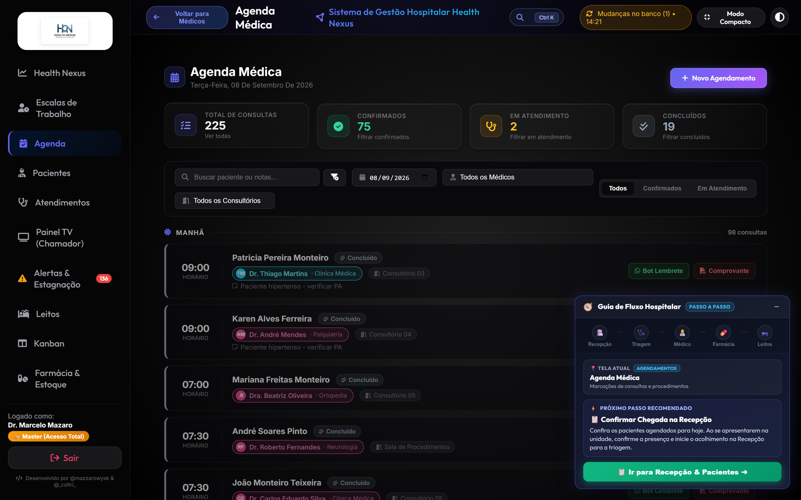

### 📅 Tabela de Operações da Grade de Agendamentos

| Operação | Parâmetros Obrigatórios | Mecanismo do Sistema | Resultado Gerado | Perfil Autorizado |
|:---|:---|:---|:---|:---|
| **Novo Agendamento** | Paciente, Especialidade, Médico, Data, Hora | Grava consulta na grade horária | Ticket gerado e horário reservado na agenda. | Recepção, Médico, Master |
| **Disparo WhatsApp Bot** | ID da consulta e celular válido | API de mensageria com opções [1] Sim / [2] Não| Envia lembrete e registra status de confirmação.| Recepção, Sistema Automático |
| **Check-in de Presença** | Paciente presente na recepção | Altera status de Agendado para "Presente" | Move o paciente para a fila de espera do médico. | Recepção |
| **Imprimir Comprovante** | ID do agendamento confirmado | Gera documento PDF formatado em padrão A4 | Emite comprovante impresso de data e preparo. | Recepção, Paciente |
| **Reagendar Horário** | Novo dia e horário disponível | Atualiza data mantendo o histórico de contato | Notifica o paciente sobre o novo agendamento. | Recepção, Paciente |
| **Cancelar Horário** | Motivo do cancelamento registrado | Libera a vaga na grade e atualiza estatísticas | Vaga fica livre imediatamente para outros pacientes.| Recepção, Médico |

### ⏱️ Tabela de Tipos de Turnos e Regras das Escalas de Plantão

| Turno de Trabalho | Carga Horária | Horário Padrão | Intervalo Regulamentar | Regra de Substituição |
|:---|:---:|:---:|:---:|:---|
| **Manhã (M6)** | 6 horas | 07:00 às 13:00 | 15 minutos | Passagem de plantão obrigatória às 12:45. |
| **Tarde (T6)** | 6 horas | 13:00 às 19:00 | 15 minutos | Passagem de plantão obrigatória às 18:45. |
| **Noite (N12)** | 12 horas | 19:00 às 07:00 | 1 hora de descanso | Proibido abandono de posto sem rendição médica. |
| **Plantão 24h** | 24 horas | 07:00 às 07:00 (D+1) | Intervalos programados | Exclusivo para equipes de UTI e Centro Cirúrgico. |
| **Regime 12x36** | 12 horas | Dias alternados | Folga de 36 horas subsequente | Escala padrão de enfermagem hospitalar. |

---

<h2 id="sec-10">10. Farmácia & Dispensação de Medicamentos</h2>

Na aba **Farmácia**, faz-se a gestão de estoque, lotes, validade e rastreabilidade de medicamentos críticos.

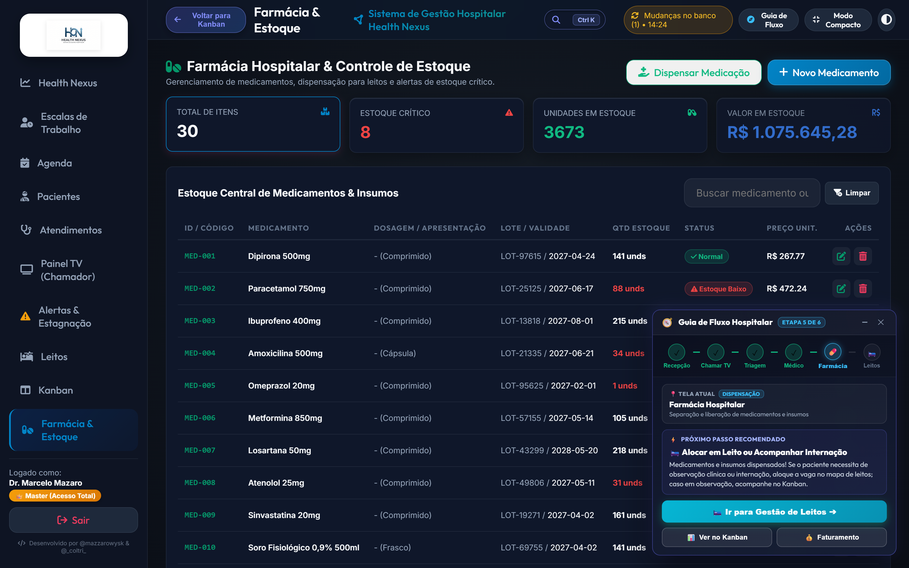

### 💊 Tabela de Catálogo de Medicamentos de Alto Giro e Emergência

| Fármaco / Princípio Ativo | Apresentação / Via | Número do Lote | Data de Validade | Estoque Atual | Estoque Mínimo | Status do Estoque |
|:---|:---|:---:|:---:|:---:|:---:|:---:|
| **Dipirona Sódica 500mg/ml** | Ampola 2ml (EV/IM) | `L-9821` | 2027-12-31 | 450 ampolas | 100 ampolas | 🟢 `Estoque Regular` |
| **Amoxicilina + Clavulanato 875mg**| Comprimido Revestido (VO)| `L-4410` | 2026-11-20 | 85 caixas | 100 caixas | 🟡 `Abaixo do Mínimo` |
| **Fentanil 0,05mg/ml** | Ampola 10ml (EV - Psicotrópico)| `L-1102` | 2026-09-15 | 14 ampolas | 20 ampolas | 🔴 `Alerta Reposição Crítica`|
| **Ceftriaxona Dissódica 1g** | Frasco-ampola Pó (EV) | `L-7734` | 2027-08-30 | 320 frascos | 80 frascos | 🟢 `Estoque Regular` |
| **Adrenalina 1mg/ml (Epinefrina)**| Ampola 1ml (EV/SC - Carrinho)| `L-3390` | 2027-05-10 | 95 ampolas | 30 ampolas | 🟢 `Estoque Regular` |
| **Enoxaparina Sódica 40mg/0,4ml**| Seringa Preenchida (SC) | `L-5521` | 2026-12-05 | 45 seringas | 50 seringas | 🟡 `Abaixo do Mínimo` |
| **Midazolam 5mg/ml** | Ampola 3ml (EV - Psicotrópico)| `L-2219` | 2027-03-18 | 60 ampolas | 40 ampolas | 🟢 `Estoque Regular` |
| **Amiodarona 50mg/ml** | Ampola 3ml (EV - Antiarrítmico)| `L-8841` | 2026-10-30 | 38 ampolas | 25 ampolas | 🟢 `Estoque Regular` |
| **Morfina 10mg/ml** | Ampola 1ml (EV - Entorpecente)| `L-0092` | 2027-04-12 | 22 ampolas | 15 ampolas | 🟢 `Estoque Controlado` |
| **Soro Fisiológico 0,9% 500ml** | Bolsa Plástica Sistema Fechado| `L-6612` | 2028-01-15 | 580 bolsas | 150 bolsas | 🟢 `Estoque Regular` |
| **Metoclopramida 10mg/2ml** | Ampola 2ml (EV/IM - Antiemético)| `L-1834` | 2027-07-22 | 190 ampolas | 60 ampolas | 🟢 `Estoque Regular` |
| **Omeprazol Sódico 40mg** | Frasco-ampola Pó Liofilizado| `L-9022` | 2026-12-18 | 130 frascos | 50 frascos | 🟢 `Estoque Regular` |

---

<h2 id="sec-11">11. Faturamento, Guias TISS & Gestão Financeira</h2>

Na aba **Faturamento TISS**, gerenciam-se as guias de convênio, auditoria de procedimentos e arquivos XML ANS.

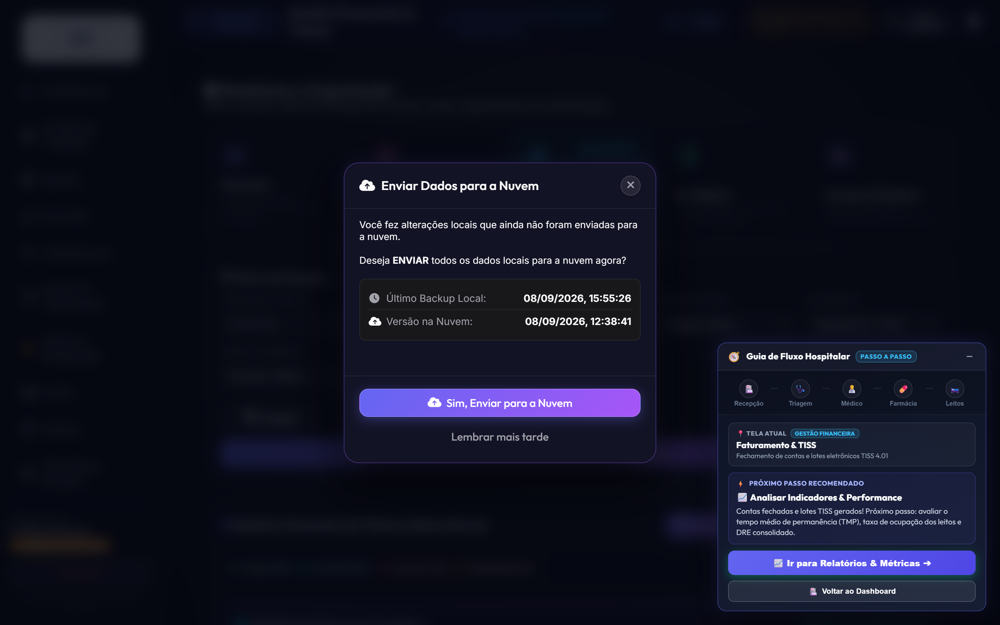

### 💰 Tabela de Guias e Lotes de Faturamento TISS

| Guia ID | Beneficiário | Convênio / Operadora | Código TUSS Principal | Valor Total | Status de Faturamento | Ações Disponíveis |
|:---|:---|:---|:---:|:---:|:---:|:---|
| `#GUIA-801` | Renato Ramos Machado | Unimed Saúde Cooperativa | `10101012` (Consulta PS) | R$ 350,00 | 🟡 `Pendente Auditoria` | `🛡️ Auditar`, `Editar`, `Anexar Laudo` |
| `#GUIA-802` | Camila Ferreira de Souza | Bradesco Saúde Top | `40304310` (Hemograma Completo)| R$ 180,00 | 🟢 `Aprovado no Lote` | `📦 Gerar XML TISS`, `Ver Detalhes` |
| `#GUIA-803` | Lucas Mendes Neves | SulAmérica Saúde Especial | `40801010` (Radiografia Tórax) | R$ 250,00 | 🟢 `Faturado e Enviado` | `📄 Imprimir Guia Oficial`, `Recibo` |
| `#GUIA-804` | José Ramos dos Santos | Amil Assistência Médica | `20101015` (Diária UTI Adulto) | R$ 2.800,00 | 🟡 `Aguardando Carência` | `🛡️ Validar Contrato`, `Auditar` |
| `#GUIA-805` | Helena Albuquerque | Particular com Recibo | `30101020` (Sutura Cirúrgica) | R$ 420,00 | 🟢 `Quitado via PIX` | `🧾 Emitir Recibo Fiscal`, `DRE` |
| `#GUIA-806` | Flávio Augusto Oliveira | Porto Seguro Saúde | `31001017` (Colecistectomia) | R$ 4.600,00 | 🔴 `Glosa Detectada` | `⚠️ Recurso Anti-Glosa`, `Corrigir` |
| `#GUIA-807` | Amanda Vasconcelos | Bradesco Saúde Top | `40101010` (ECG 12 Derivações) | R$ 95,00 | 🟢 `Aprovado no Lote` | `📦 Gerar XML TISS`, `Ver Detalhes` |
| `#GUIA-808` | Carlos Eduardo Santos | Unimed Saúde Cooperativa | `40901122` (Ecocardiograma Transtorácico)| R$ 480,00 | 🟡 `Pendente Auditoria` | `🛡️ Auditar`, `Anexar Laudo` |

### 📊 Tabela de Procedimentos Frequentes da Tabela TUSS

| Código TUSS | Descrição Terminológica ANS | Rol ANS | Valor Sugerido | Exigência Obrigatória |
|:---:|:---|:---:|:---:|:---|
| **10101012** | Consulta Médica em Pronto-Socorro / Emergência | Sim | R$ 150,00 a R$ 350,00 | Registro de Anamnese e CID-10 no PEP. |
| **40304310** | Hemograma Completo com Contagem de Plaquetas | Sim | R$ 45,00 a R$ 90,00 | Justificativa médica com indicação clínica. |
| **40801010** | Radiografia de Tórax em 2 Posições (PA e Perfil) | Sim | R$ 85,00 a R$ 160,00 | Hipótese diagnóstica e laudo radiológico assinado. |
| **41001010** | Tomografia Computadorizada de Crânio sem Contraste | Sim | R$ 380,00 a R$ 750,00 | Escore de trauma ou suspeita de AVC agudo. |
| **20101015** | Diária de Internação em Unidade de Terapia Intensiva| Sim | R$ 1.800,00 a R$ 3.500,00 | Prescrição diária, relatório de admissão e evolução. |

---

<h2 id="sec-12">12. Relatórios Analytics & Indicadores Hospitalares</h2>

Na aba **Relatórios**, o sistema consolida inteligência de dados clínicos e financeiros para a diretoria.

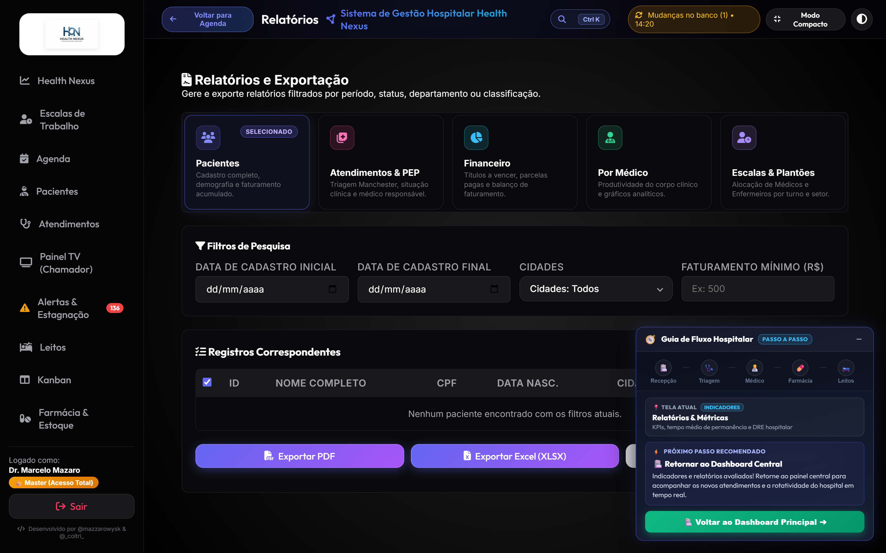

### 📈 Tabela de Painéis Analíticos Hospitalares

| Painel Analítico | Principais Indicadores Consolidados | Granularidade Temporal | Formatos de Exportação | Público Decisor |
|:---|:---|:---:|:---:|:---|
| **DRE & Finanças** | Receita bruta, ticket médio, glosas acumuladas, custos por leito | Diário / Mensal / Anual | PDF Executivo / Excel / CSV | Diretoria Financeira & Controladoria |
| **Atendimentos PS** | Volume por hora, taxa de conversão em internação, gravidade Manchester | Turno / Diário / Semanal | PDF / Excel | Coordenação Médica & Enfermagem |
| **Ocupação & Censo**| Taxa de ocupação de leitos, tempo médio de permanência (TMP), giro de leitos| Tempo Real / Mensal | PDF / Excel | Núcleo Interno de Regulação (NIR) |
| **Produtividade Médica**| Consultas finalizadas por profissional, adesão a protocolos de emergência| Mensal / Individual | PDF Confidencial | Direção Clínica & Comissão de Ética |
| **Auditoria TISS** | Taxa de conformidade de guias, procedimentos glosados, tempo de recurso | Quinzenal / Mensal | XML Lote / Relatório PDF | Faturamento & Auditoria Médica |

---

<h2 id="sec-13">13. Painel de Chamada TV & Sala de Espera</h2>

O **Painel TV** opera em tela cheia na sala de espera para direcionamento sonoro e visual dos pacientes por viva-voz sintetizado.

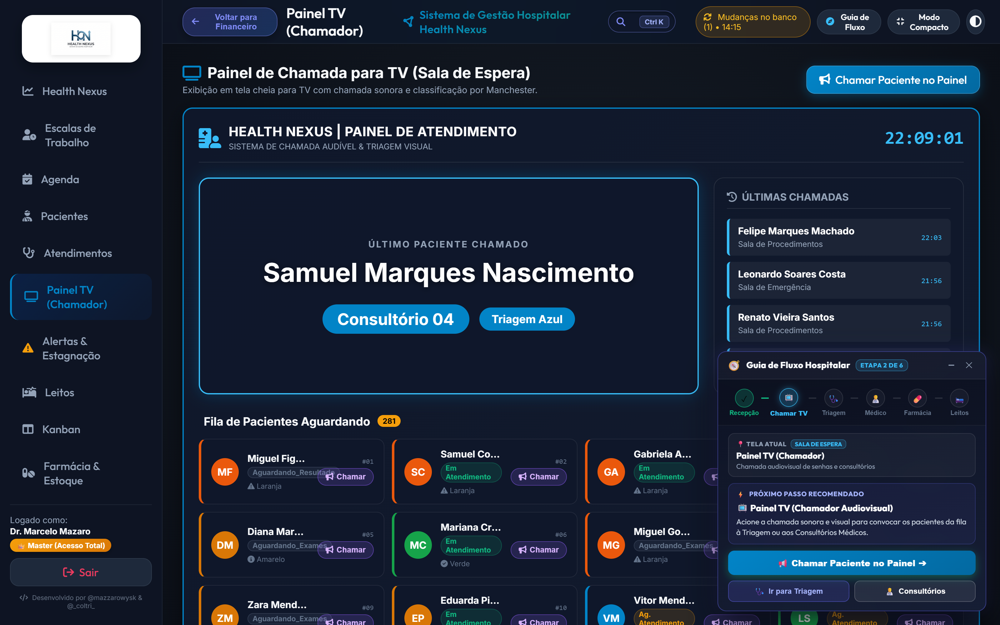

### 📺 Tabela de Elementos do Painel TV

| Componente da Tela | Função Visual / Sonora | Tecnologia Envolvida | Benefício para o Paciente |
|:---|:---|:---|:---|
| **Card do Chamado Principal** | Exibe nome em letras garrafais e sala/consultório de destino | Animação CSS Pulse + Glassmorphism | Visibilidade nítida mesmo a grandes distâncias no saguão. |
| **Sintetizador de Voz (Viva-Voz)**| Pronuncia o nome do paciente e a sala em áudio claro | Web Speech Synthesis API (pt-BR) | Acessibilidade total para deficientes visuais e idosos. |
| **Carrossel dos Últimos 5 Chamados**| Lista lateral com histórico de chamadas recentes | Renderização reativa em tempo real | Permite conferir o consultório mesmo se perdeu o primeiro anúncio. |
| **Relógio & Data em Tempo Real** | Horário sincronizado e dados da instituição | Javascript Date Engine | Orientação temporal e conforto na espera assistencial. |

### 🎛️ Tabela de Controles e Modos do Chamador TV

| Ação / Controle | Atalho / Botão | Descrição da Operação | Perfil Autorizado |
|:---|:---:|:---|:---|
| **Modo Tela Cheia** | Tecla `F11` ou Botão Fullscreen | Oculta barras de navegação do browser para uso em Smart TVs. | Qualquer colaborador |
| **Testar Voz do Sistema** | Botão "Testar Voz" | Executa áudio de teste calibrando volume e velocidade da voz pt-BR. | Recepção / TI |
| **Repetir Última Chamada** | Botão "Chamar Novamente" | Dispara novamente o sinal sonoro e voz do paciente atual. | Recepção / Triagem |
| **Calibração de Chime** | Seletor de Áudio | Escolhe entre sinal sonoro Clássico, Suave ou Emergencial. | TI / Recepção |

---

<h2 id="sec-14">14. Central de Estagnação & Aprovações de Acesso</h2>

Painel de controle de gargalos clínicos e permanência de pacientes em observação no PS acima de 12 horas.

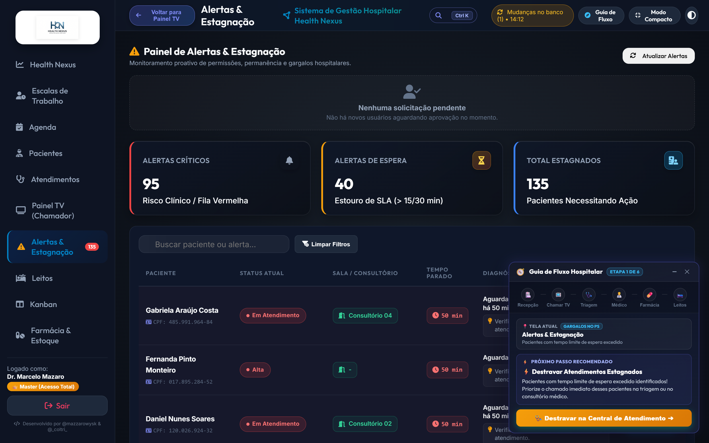

### ⏳ Tabela de Níveis de Alerta de Permanência (PS 12h)

| Nível de Alerta | Faixa de Tempo | Cor Visual do Badge | Risco Assistencial | Ação Obrigatória da Equipe |
|:---|:---:|:---|:---|:---|
| **Estável** | Menos de 10 horas | 🔵 Azul | Quadro dentro da janela esperada de observação | Reavaliação clínica regular e checagem de exames. |
| **Atenção** | Entre 10h e 12 horas | 🟡 Amarelo | Risco iminente de ultrapassar teto de observação | Definir desfecho (alta médica ou solicitação de leito). |
| **Crítico (Estagnado)**| Mais de 12 horas | 🔴 Vermelho Pulsante | **Gargalo assistencial estagnado** | Reatribuição imediata de consultório ou vaga urgente em leito. |

### 🛡️ Tabela de Gestão de Aprovação de Acessos (RBAC)

| Campo / Operação | Descrição | Regra de Negócio | Ação do Administrador Master |
|:---|:---|:---|:---|
| **Solicitação Pendente** | Usuário cadastrado aguardando liberação | Permissão inicial bloqueada até auditoria | Visualiza login, cargo solicitado e data de cadastro. |
| **Aprovar Usuário** | Libera acesso conforme o perfil solicitado | Ativa credenciais no banco local e nuvem Turso | Clique em **Aprovar Acesso** (emite toast verde de sucesso). |
| **Recusar / Modificar** | Rebaixa o perfil para acesso padrão | Impede acesso a privilégios administrativos | Define cargo restrito ou cancela o cadastro do operador. |

---

<h2 id="sec-15">15. Configurações, Backup e Sincronização em Nuvem (Turso Cloud)</h2>

Administração global do sistema, parâmetros do banco local-first e sincronização distribuída com Turso Cloud DB.

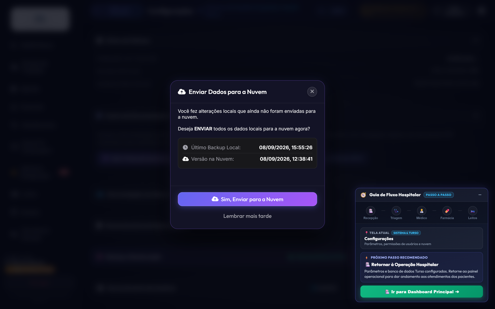

### ☁️ Tabela de Recursos de Sincronização e Banco de Dados

| Funcionalidade | Mecanismo | Comportamento Técnico | Vantagem Operacional |
|:---|:---|:---|:---|
| **Dual-Pipeline Sync** | Proxy local + Fallback HTTP nativo | Se a rota primária falhar, tenta rota direta Turso Cloud | 99.9% de disponibilidade em qualquer infraestrutura. |
| **Backup Manual JSON** | Download direto de arquivo .json | Serializa todo o banco de dados e salva no computador | Cópia de segurança física independente de servidores. |
| **Restauração de Backup**| Upload de arquivo .json estruturado | Valida o esquema e sobrescreve o banco com segurança | Recuperação rápida em caso de troca de estação de trabalho. |
| **Gerar Simulação (300+)**| Gerador estocástico avançado | Cria 35+ pacientes, 35 internações, médicos e leitos | Ambiente completo e realista para treinamento e testes. |
| **Limpeza com Preservação**| Soft-reset seguro | Limpa prontuários preservando contas de usuários essenciais | Reinício de base sem perda de acessos da equipe médica. |

---

<h2 id="sec-16">16. Sistema de Avisos, Notificações & Toasts</h2>

Sistema centralizado de alertas visuais instantâneos (*Toasts*) e direcionamento assistencial reativo.

### 🔔 Tabela de Tipos de Notificações do Sistema

| Tipo de Aviso | Cor / Ícone | Duração em Tela | Gatilho Típico | Comportamento Interativo |
|:---|:---:|:---|:---|:---|
| **Sucesso (Success)** | 🟢 Verde (`#10b981`) | 3,5 segundos | Paciente admitido, consulta salva, receita emitida | Desaparece automaticamente com animação fade-out. |
| **Alerta (Warning)** | 🟡 Amarelo (`#f59e0b`) | 5,0 segundos | Medicamento abaixo do estoque, permanência >10h | Alerta a equipe sobre necessidade de atenção imediata. |
| **Erro (Danger)** | 🔴 Vermelho (`#ef4444`) | 6,0 segundos | Falha de validação, interação medicamentosa grave | Exige confirmação ou ajuste imediato pelo operador. |
| **Notificação de Fluxo**| 🟣 Roxo / Gradiente | Fixa até ação | Paciente chamado para consultório ou internado | Botão **"IR PARA A ABA ➔"** com rolagem suave e efeito Glow. |

---

<h2 id="sec-17">17. Tabela de Máscaras, Atalhos & Teclas de Atalho</h2>

### ⌨️ Tabela de Teclas de Atalho do Teclado

| Tecla de Atalho | Contexto de Uso | Função Executada no Sistema |
|:---:|:---|:---|
| **`Ctrl + K`** (ou `Cmd + K`) | Em qualquer tela do sistema | Foca a **Busca Global Spotlight** no topo da tela. |
| **`Alt + M`** | Em qualquer tela do sistema | Retorna ao **Manual do Usuário** no tópico pesquisado com efeito pulsar. |
| **`Alt + N`** | Aba Atendimentos / Agenda | Abre o modal de **Nova Admissão / Agendamento**. |
| **`Alt + Seta Esquerda`** | Em qualquer tela do sistema | Volta para a aba visualizada anteriormente no histórico. |
| **`F11`** | Aba Painel TV | Alterna para o **Modo Fullscreen** para monitores de sala de espera. |
| **`Esc`** | Em qualquer modal aberto | Fecha o modal ativo e retorna ao painel sem salvar dados parciais. |

### 📝 Tabela de Máscaras e Formatos de Entrada de Dados

| Campo Clínico / Cadastral | Máscara de Entrada | Expressão / Formato | Exemplo de Preenchimento Válido |
|:---|:---:|:---|:---|
| **CPF** | `000.000.000-00` | 11 dígitos numéricos com dígitos verificadores | `341.890.128-44` |
| **Cartão SUS (CNS)** | `000 0000 0000 0000` | 15 dígitos padrão Ministério da Saúde | `700 1234 5678 9012` |
| **Pressão Arterial (PA)** | `000/00` | Milímetros de mercúrio (mmHg) sistólica/diastólica | `120/80` |
| **Telefone / WhatsApp** | `(00) 00000-0000` | DDD de 2 dígitos + número com 9 dígitos | `(11) 98765-4321` |
| **CEP** | `00000-000` | 8 dígitos com busca automática ViaCEP | `01310-100` |
| **Registro Médico (CRM)**| `000000/UF` | Número do conselho + sigla do estado federativo | `123456/SP` |
| **Código TUSS ANS** | `00000000` | Código terminológico unificado de 8 dígitos | `10101012` (Consulta em consultório) |

---

<h2 id="sec-18">18. Solução de Dúvidas Frequentes & Erros Comuns (FAQ)</h2>

### ❓ Tabela de Diagnóstico e Resolução de Dúvidas

| Dúvida / Situação Operacional | Causa Raiz | Procedimento de Resolução Passo a Passo |
|:---|:---|:---|
| **Como recuperar a senha de um médico ou operador?** | Esquecimento de senha ou bloqueio | Vá em **Configurações → Usuários**, localize o usuário e clique no ícone **Chave (Reset Senha)** para definir nova senha. |
| **O Painel TV não está emitindo som na chamada** | Bloqueio de autoplay do navegador | Clique uma vez em qualquer parte da tela da TV para conceder permissão de áudio à Web Speech API. |
| **O lote de guias TISS deu divergência na exportação** | Código TUSS ou carência ausente | Acesse a aba **Faturamento TISS**, clique em **🛡️ Auditar Guia** para identificar e corrigir os campos glosados. |
| **Como dar alta a um paciente e liberar o leito?** | Finalização do ciclo de internação | No card do leito ocupado, clique em **Alta Hospitalar**. O sistema move o leito para **Higienização** e após limpeza clique em **Liberar Leito**. |
| **O gráfico de fluxo Kanban está zerado no Dashboard** | Falha de sincronização localDB | O sistema agora conta com auto-seed sob demanda. Pressione `Ctrl + Shift + R` para atualizar a página. |
| **Como imprimir a receita médica com QR Code CFM?** | Conclusão do atendimento PEP | No modal do PEP, clique em **Imprimir PDF**. O documento é gerado com hash SHA-256 e QR Code de validação pública. |
| **O paciente não aparece na busca rápida Spotlight** | Digitação incompleta ou lixeira | Digite ao menos 3 letras do nome ou os 6 primeiros dígitos do CPF; confira se o paciente não está na Lixeira de Pacientes. |
| **A sincronização com a nuvem Turso exibe alerta amarelo**| Instabilidade temporária de rede | O sistema aciona o Fallback HTTP nativo automaticamente. Se persistir, clique em "Sincronizar Agora" nas Configurações. |

---

<h2 id="sec-19">19. Novas Funcionalidades Avançadas Assistenciais & Tecnológicas (v2.8.0) 🚀</h2>

O **Health Nexus v2.8.0** consolida 6 pilares de alta complexidade hospitalar e inteligência clínica:

### ⏱️ Tabela de Metas Clínicas dos Protocolos de Emergência Aguda

| Protocolo de Emergência | Gatilhos de Triagem Manchester | Meta Crítica de Tempo | Exames e Intervenções Obrigatórias |
|:---|:---|:---:|:---|
| **IAM com Supra (Infarto)** | *"Dor torácica típica"*, *"irradiação para MSE"*, *"sudorese fria"* | **Porta-ECG: < 10 min** **Porta-Balão: < 90 min** | ECG 12 derivações imediato, Troponina quantitativa, AAS mastigável, contato com hemodinâmica. |
| **AVC Isquêmico Agudo** | *"Déficit neurológico focal"*, *"assimetria facial"*, *"disartria"* | **Porta-TC: < 20 min** **Janela Trombolítica: 4,5h** | Tomografia computadorizada de crânio sem contraste, glicemia capilar e cálculo de escore NIHSS. |
| **Sepse / Choque Séptico** | *"Hipotensão arterial"*, *"taquipneia"*, *"febre/hipotermia"*, *"leucocitose"*| **Pacote da 1ª Hora** | Coleta de 2 pares de hemoculturas, dosagem de lactato sérico, antibiótico de amplo espectro e ressuscitação volêmica (30 ml/kg). |

### 🩻 Tabela de Ferramentas do Visualizador PACS / DICOM Integrado

| Ferramenta no Canvas | Ícone / Atalho | Função Operacional | Indicação Clínica |
|:---|:---:|:---|:---|
| **Ajuste de Brilho & Contraste** | ☀️ / Botão Windowing | Ajusta a janela de atenuação Hounsfield | Diferenciação entre partes moles, parênquima pulmonar e estruturas ósseas. |
| **Zoom & Panorâmica (Pan)** | 🔍 / Roda do Mouse + Arraste | Amplia regiões anatômicas suspeitas | Identificação de microfraturas, nódulos ou linhas de pneumotórax. |
| **Inversão de Cores (Negativo)**| 🔄 / Botão Inverter | Alterna entre fundo preto e branco radiológico | Realce de contornos vasculares e densidades tênues. |
| **Régua Milimétrica Calibrada**| 📏 / Ferramenta Caliper | Mede distâncias em milímetros reais na imagem | Mensuração precisa de diâmetro de lesões, cálculos e desvios de linha média. |

### 🛡️ Tabela de Validações do Motor Anti-Glosa TISS / ANS 4.01.00

| Regra de Auditoria | Código de Validação | Falha Detectada | Ação Corretiva do Sistema |
|:---|:---:|:---|:---|
| **Validação de Matrícula** | `GLOSA-1001` | Número de carteirinha com dígitos inválidos | Bloqueia exportação do lote até correção do cadastro do beneficiário. |
| **Compatibilidade TUSS x Especialidade**| `GLOSA-2045` | Procedimento cirúrgico prescrito por especialidade incompatível | Alerta o faturamento para reclassificar o prestador executante. |
| **Justificativa Clínica de SADT** | `GLOSA-3012` | Exame de alta complexidade sem CID-10 associado | Exige vinculação de hipótese diagnóstica no prontuário antes do faturamento. |
| **Carência Contratual** | `GLOSA-4099` | Procedimento realizado antes do término de carência | Sinaliza a guia como *Pendente de Recurso Administrativo*. |

---

*Manual do Usuário e Guia Operacional Definitivo homologado para a versão 2.8.0 do Health Nexus. Todos os direitos reservados.*
