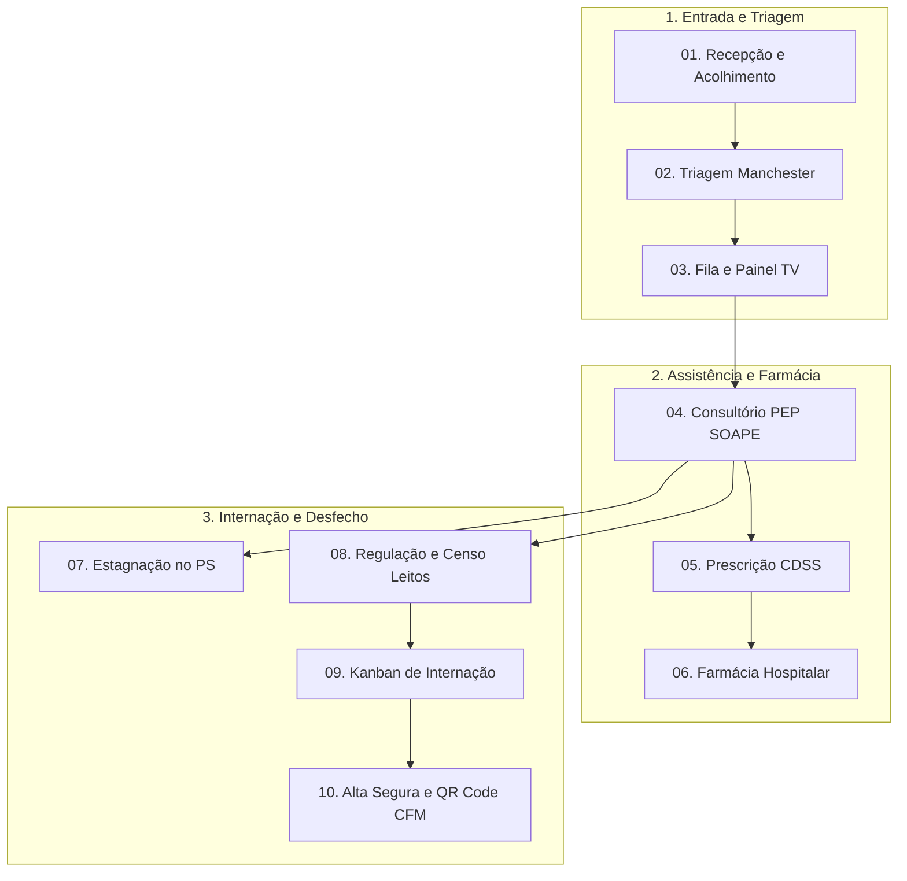

# Manual de Fluxo Operacional & Jornada Assistencial do Paciente
## Arquitetura de Processos Clínicos, Triagem Manchester, Chamadas com Voz, CDSS e Regulação Hospitalar
### Health Nexus v2.8.0 — Documentação Oficial de Engenharia Hospitalar & Gestão Clínica

---

## 1. RESUMO EXECUTIVO & ESCOPO OPERACIONAL

O **Health Nexus** é uma plataforma hospitalar e ambulatorial de alta performance projetada para garantir segurança do paciente (alinhada às Metas Internacionais de Segurança do Paciente da OMS/ONA), conformidade com a LGPD (Lei nº 13.709/2018), interoperabilidade com o padrão ANS TISS 4.01 e integração assistencial contínua.

Este manual descreve o **ciclo completo de fluxo operacional** — desde a primeira abordagem do paciente na recepção hospitalar até o desfecho final, que pode ser a desospitalização com sumário de alta e prescrição com QR Code autenticável pelo Conselho Federal de Medicina (CFM), ou o encaminhamento regulado para leitos de internação e terapia intensiva (UTI).

### Princípios Norteadores do Fluxo Operacional:
1. **Atendimento Prioritário Baseado em Risco:** Nenhuma fila no Health Nexus é meramente cronológica; a prioridade assistencial é determinada rigorosamente pelo **Protocolo de Manchester** e pelo escore preditivo de deterioração clínica **MEWS** (Modified Early Warning Score).
2. **Prevenção Ativa de Erros Farmacológicos:** O motor de apoio à decisão clínica (**CDSS - Clinical Decision Support System**) intercepta prescrições com interações medicamentosas graves e reações alérgicas antes que a medicação seja dispensada pela farmácia.
3. **Visibilidade Operacional em Tempo Real:** Painéis dinâmicos de chamada por síntese de voz (Web Speech API), censo visual de leitos hospitalares e telemetria de estagnação garantem que a equipe multidisciplinar identifique gargalos instantaneamente.
4. **Rastreabilidade e Não Repúdio:** Todas as transações, prescrições, mudanças de status e registros no prontuário eletrônico (PEP) são carimbadas com identificador do profissional, timestamp auditável e assinatura digital.

## 2. ARQUITETURA GERAL DA JORNADA DO PACIENTE

O fluxo hospitalar no Health Nexus é organizado em **três macrofases sequenciais** e integradas:

1. **Porta de Entrada & Classificação de Risco (Etapas 01 a 03):** Recepção com validação de CPF e preenchimento de endereço via ViaCEP, Triagem de Enfermagem pelo Protocolo de Manchester e chamada sonora na sala de espera via Painel TV (Web Speech API pt-BR).
2. **Assistência Clínica, Farmácia & Telemetria (Etapas 04 a 07):** Atendimento no consultório com prontuário estruturado SOAPE, Prescrição Eletrônica protegida por CDSS (alertas de alergias e interações medicamentosas), dispensação rastreável na Farmácia Hospitalar e monitoramento do tempo de permanência no Pronto-Socorro.
3. **Regulação, Internação & Alta Hospitalar (Etapas 08 a 10):** Regulação de leitos pelo NIR com mapa do censo hospitalar (UTI e Enfermarias), acompanhamento multidisciplinar no Kanban de Internação por especialidade e encerramento com Alta Segura, receita com QR Code autenticável pelo CFM e geração de guias TISS 4.01 (ANS).

| Macrofase Operacional | Etapas do Sistema | Perfis Envolvidos | Meta Assistencial e Governança |
| :--- | :--- | :--- | :--- |
| **1. Porta de Entrada & Risco** | 01. Recepção · 02. Triagem · 03. TV | Recepção & Enfermagem | Admissão rápida (< 5 min) e priorização imediata por risco vital |
| **2. Assistência & Farmácia** | 04. Consultório · 05. Prescrição · 06. Farmácia · 07. Estagnação | Médicos & Farmacêuticos | Registro SOAPE completo e bloqueio de interações graves |
| **3. Governança & Desfecho** | 08. Regulação · 09. Kanban · 10. Alta e TISS | NIR, Assistenciais e Faturamento | Otimização do giro de leitos, alta com QR Code e faturamento ANS |

## 3. DETALHAMENTO DAS ETAPAS OPERACIONAIS COM PRINTS EXCLUSIVOS

### ETAPA 01: ACOLHIMENTO, ADMISSÃO E PREVENÇÃO DE DUPLICIDADES (RECEPÇÃO)

A recepção é a porta de entrada física e digital do paciente no complexo de saúde. O objetivo operacional é registrar a admissão com agilidade máxima (< 5 minutos por ficha), eliminando homônimos e prontuários duplicados.

#### Rotina Operacional da Recepção:
1. **Identificação Documental:** Coleta do CPF ou número do Cartão Nacional de Saúde (CNS).
2. **Validação Automática de Integridade:**
   - O sistema efetua a verificação de algoritmo do CPF (dígitos verificadores).
   - O campo CEP realiza consulta assíncrona ao *ViaCEP* para preenchimento imediato de logradouro, bairro, município e UF.
3. **Mecanismo Antiduplicidade (HTTP 409 Conflict):**
   - Caso um operador tente cadastrar um paciente cujo CPF ou Nome Completo (case-insensitive e normalizado sem acentos) já conste na base ativa, o sistema emite alerta imediato e oferece a reutilização da ficha cadastral mestre, preservando o histórico preexistente.
4. **Abertura da Ficha de Atendimento:**
   - O atendente vincula o convênio (Particular, Unimed, Bradesco Saúde, SUS, etc.) e o motivo geral da procura.
   - O paciente recebe a pulseira hospitalar e sua ficha é despachada automaticamente para o status **Aguardando_Triagem**.

---

### ETAPA 02: TRIAGEM DE ENFERMAGEM & PROTOCOLO DE MANCHESTER

Ao ser chamado pelo nome ou número da senha, o paciente entra no consultório de triagem, conduzido por profissional de enfermagem capacitado.

#### Parâmetros Coletados e Registrados:
- **Pressão Arterial (PA):** Sistólica e Diastólica (mmHg).
- **Frequência Cardíaca (FC):** Batimentos por minuto (bpm).
- **Frequência Respiratória (FR):** Incursões por minuto (irpm).
- **Temperatura Axilar (°C):** Termometria digital.
- **Saturação Periférica de Oxigênio (SpO2 %):** Oximetria de pulso.
- **Glicemia Capilar (mg/dL):** Em casos suspeitos ou diabéticos.
- **Escala Visual Analógica de Dor (EVA 0 a 10):** Mensuração de desconforto álgico.

#### Classificação Internacional de Manchester & SLA:

| Classificação | Cor de Risco | Gravidade Clínica | SLA Tempo Máximo de Espera | Conduta Operacional Imediata |
| :--- | :--- | :--- | :--- | :--- |
| **Emergência** | 🔴 Vermelho | Risco iminente de morte | **0 minutos (Imediato)** | Encaminhamento imediato para Sala Vermelha / Ressuscitação |
| **Muito Urgente** | 🟠 Laranja | Risco crítico de deterioração | **10 minutos** | Monitorização contínua e acionamento do médico plantonista |
| **Urgente** | 🟡 Amarelo | Condição estável com gravidade moderada | **60 minutos** | Encaminhamento para leito de observação ou sala de espera medicada |
| **Pouco Urgente** | 🟢 Verde | Condição crônica agudizada sem risco vital | **120 minutos** | Aguardo na sala de espera para consulta médica |
| **Não Urgente** | 🔵 Azul | Queixas leves e de baixa complexidade | **240 minutos** | Atendimento eletivo ou orientação para UBS de referência |

#### Escore MEWS (Modified Early Warning Score):
O sistema calcula automaticamente o índice MEWS com base na combinação dos sinais vitais. Índices MEWS >= 4 disparam um card pulsante na cor vermelha no topo da fila médica, alertando toda a equipe sobre risco iminente de colapso hemodinâmico.

---

### ETAPA 03: PAINEL TV DE CHAMADAS EM SALA DE ESPERA COM SÍNTESE DE VOZ

O módulo de TV substitui as tradicionais senhas impressas por um painel audiovisual dinâmico para salas de espera e recepções hospitalares, compatível com smart TVs, monitores verticais e navegadores modernos.

#### Recursos do Painel TV do Health Nexus:
1. **Síntese de Voz Nativa em Português (Web Speech API):**
   - Ao ser acionado o botão "Chamar para Consulta", a TV reproduz mensagem falada clara: *"Atenção: Paciente [Nome do Paciente], favor dirigir-se ao [Consultório 01]"*.
2. **Identificação Visual em Alto Contraste:**
   - O card da chamada atual é exibido em tamanho ampliado com piscar luminoso, facilitando a visualização por idosos e pessoas com baixa acuidade visual.
3. **Histórico dos Últimos Chamados:**
   - Exibição lateral em rolagem com os últimos 5 pacientes convocados, reduzindo pedidos de repetição na recepção.
4. **Sincronização em Tempo Real (Polling 3s / WebSocket):**
   - A TV escuta alterações da fila em tempo real, sem necessidade de recarregar a página manualmente pelo operador.

---

### ETAPA 04: ATENDIMENTO MÉDICO NO CONSULTÓRIO & PRONTUÁRIO ELETRÔNICO (PEP SOAPE)

O médico acessa a lista de consultórios e visualiza a fila ordenada estritamente pela prioridade Manchester e pelo tempo de espera decorrido.

#### Estrutura do Prontuário Clínico SOAPE:
- **S (Subjetivo):** Anamnese relatada pelo paciente ou acompanhante, queixa principal e tempo de evolução dos sintomas.
- **O (Objetivo):** Exame físico detalhado, inspeção, ausculta cardiopulmonar, palpação abdominal e conferência dos sinais vitais aferidos na triagem.
- **A (Avaliação):** Hipótese diagnóstica estruturada com busca rápida de código **CID-10** (Classificação Internacional de Doenças) e estratificação de gravidade.
- **P (Plano Terapêutico):** Solicitação de exames laboratoriais/imagem, conduta medicamentosa e orientações gerais.
- **E (Evolução Assistencial):** Desfecho do atendimento: Alta com Receita, Observação no PS ou Solicitação de Internação Hospitalar.

---

### ETAPA 05: PRESCRIÇÃO ELETRÔNICA & CDSS (INTERAÇÕES E ALERGIAS)

Integrado ao Prontuário Eletrônico, o módulo de prescrição do Health Nexus conta com inteligência de suporte à decisão clínica (**CDSS**):

#### Regras de Segurança Farmacológica:
1. **Checagem Ativa de Alergias:**
   - Se o paciente possui alergia declarada a Dipirona, Penicilinas ou AINEs e o médico tenta prescrever um desses compostos, o sistema bloqueia a emissão e emite alerta com borda vermelha pulsante.
2. **Interações Medicamentosas de Grau Grave:**
   - O motor analisa a combinação de medicamentos e detecta riscos de toxicidade, arritmias (prolongamento do intervalo QT) ou sinergismo nocivo (ex.: Varfarina com Ácido Acetilsalicílico ou Levofloxacino com Amiodarona).
3. **Assinatura Digital & Carimbo do Conselho:**
   - A prescrição é assinada com o CRM e UF do médico responsável, gerando código de validação criptográfico para conferência pela farmácia e pelo paciente.

---

### ETAPA 06: FARMÁCIA HOSPITALAR, APRAZAMENTO E DISPENSAÇÃO RASTREÁVEL

A farmácia hospitalar recebe instantaneamente as prescrições médicas salvas no sistema, dispensando papel e telefonemas intermediários.

#### Ciclo da Dispensação:
1. **Fila de Prescrições Pendentes:** Ordenadas por urgência do setor (Pronto-Socorro, UTI, Enfermaria).
2. **Checagem de Estoque em Tempo Real:** Verificação de saldo de frascos, ampolas e comprimidos por lote e validade.
3. **Aprazamento pela Enfermagem:** Definição de horários de administração (ex.: 6/6h, 8/8h, 12/12h).
4. **Baixa Rastreável:** Leitura de código de barras na separação do kit unitário com baixa automática no Kardex de estoque hospitalar.

---

### ETAPA 07: TELEMETRIA DE ESTAGNAÇÃO NO PRONTO-SOCORRO (PS)

O módulo de **Estagnação PS** é uma ferramenta de governança clínica desenhada para combater a superlotação e a permanência indevida de pacientes em macas de pronto-atendimento.

#### Níveis de Alerta de Permanência:
- **Faixa Verde (0 a 2 horas):** Paciente em tempo regulamentar de triagem, consulta e coleta de exames iniciais.
- **Faixa Amarela (2 a 4 horas):** Paciente aguardando laudo de exames ou reavaliação médica. Requer acompanhamento da chefia de enfermagem.
- **Faixa Vermelha (> 4 a 6 horas):** Risco de desassistência e estagnação de fluxo. O sistema emite notificação para a coordenação do PS para decisão rápida: Alta hospitalar ou pedido formal de internação.

---

### ETAPA 08: REGULAÇÃO DE LEITOS, CENSO HOSPITALAR E HIGIENIZAÇÃO

Quando o médico assistente define pela necessidade de internação, o paciente é transferido para o fluxo do **NIR (Núcleo Interno de Regulação)**.

#### Ciclo de Vida do Leito Hospitalar:
1. **Vago (Verde):** Leito limpo, revisado e disponível para admissão imediata.
2. **Ocupado (Vermelho):** Leito com paciente alocado fisicamente e equipe médica atribuída.
3. **Aguardando Higienização (Amarelo):** Paciente recebeu alta ou foi transferido; a equipe de hotelaria/limpeza é acionada para desinfecção terminal.
4. **Em Manutenção (Cinza):** Bloqueio técnico para reparos de infraestrutura, gases medicinais ou isolamento epidemiológico.

---

### ETAPA 09: KANBAN DE INTERNAÇÃO E GESTÃO POR ESPECIALIDADE

O Kanban de Internação oferece visão visual integrada de todos os leitos ativos divididos por clínicas e especialidades:
- **Clínica Médica**
- **Cirurgia Geral & Especialidades Cirúrgicas**
- **Unidade de Terapia Intensiva (UTI Adulto / Coronariana)**
- **Maternidade & Pediatria**

#### Funcionalidades do Kanban:
- Visualização de diagnósticos principais, dias de internação (LOS - Length of Stay) e riscos assistenciais.
- Cards com indicação de isolamento respiratório ou de contato.
- Movimentação entre leitos com registro no censo hospitalar.

---

### ETAPA 10: DESOSPITALIZAÇÃO, ALTA SEGURA, FATURAMENTO TISS & QR CODE

A conclusão do ciclo assistencial encerra tanto o prontuário clínico quanto o lote de faturamento hospitalar.

#### Procedimentos da Alta:
1. **Sumário de Alta:** Diagnósticos tratados, exames relevantes realizados, procedimentos cirúrgicos executados e plano de cuidados domiciliares.
2. **Prescrição de Alta com QR Code (CFM):** Receita médica emitida com QR Code escaneável por celular para conferência de autenticidade no validador do Conselho Federal de Medicina.
3. **Faturamento TISS 4.01 (ANS):**
   - Agrupamento de diárias, taxas, medicamentos, materiais e honorários médicos.
   - Geração de Guia de SP/SADT e Guia de Resumo de Internação compatíveis com XML TISS da Agência Nacional de Saúde Suplementar (ANS).

---

## 4. MATRIZ DE RESPONSABILIDADES OPERACIONAIS (RACI MATRIX)

A tabela abaixo define os papéis funcionais de cada membro da equipe hospitalar ao longo do fluxo:

| Etapa do Fluxo Assistencial | Recepção | Enfermagem | Médico Emergencista | Médico Hospitalista | Farmacêutico | Núcleo de Regulação (NIR) | Faturamento & Auditoria |
| :--- | :--- | :--- | :--- | :--- | :--- | :--- | :--- |
| **01. Admissão e Busca CEP** | [Responsável] | [Informado] | [Não Envolvido] | [Não Envolvido] | [Não Envolvido] | [Não Envolvido] | [Consultado] |
| **02. Triagem Manchester & MEWS** | [Informado] | [Responsável] | [Consultado] | [Não Envolvido] | [Não Envolvido] | [Não Envolvido] | [Não Envolvido] |
| **03. Chamada no Painel TV** | [Apoio] | [Operador] | [Responsável] | [Não Envolvido] | [Não Envolvido] | [Não Envolvido] | [Não Envolvido] |
| **04. Atendimento PEP SOAPE** | [Não Envolvido] | [Apoio] | [Responsável] | [Responsável] | [Não Envolvido] | [Não Envolvido] | [Não Envolvido] |
| **05. Prescrição & Alertas CDSS**| [Não Envolvido] | [Consultado] | [Responsável] | [Responsável] | [Aprovador] | [Não Envolvido] | [Consultado] |
| **06. Separação e Dispensação** | [Não Envolvido] | [Administrador]| [Não Envolvido] | [Não Envolvido] | [Responsável] | [Não Envolvido] | [Auditor] |
| **07. Telemetria Estagnação PS** | [Informado] | [Monitor] | [Responsável] | [Não Envolvido] | [Não Envolvido] | [Gestor] | [Não Envolvido] |
| **08. Regulação e Censo Leitos**| [Informado] | [Consultado] | [Solicitante] | [Solicitante] | [Não Envolvido] | [Responsável] | [Não Envolvido] |
| **09. Evolução no Kanban** | [Não Envolvido] | [Anotador] | [Não Envolvido] | [Responsável] | [Consultado] | [Monitor] | [Não Envolvido] |
| **10. Alta Segura e Guia TISS** | [Recepção Pós] | [Orientador] | [Responsável] | [Responsável] | [Informado] | [Liberador] | [Responsável] |

---

## 5. MATRIZ DE SLAs ASSISTENCIAIS E METAS TEMPORAIS

| Marco Assistencial | Meta Operacional | Ação de Contingência se Estourar | Responsável pelo Desbloqueio |
| :--- | :--- | :--- | :--- |
| **Acolhimento na Recepção** | <= 5 minutos | Abertura de guichê de contingência na recepção | Supervisão de Recepção |
| **Espera para Triagem Manchester** | <= 10 minutos | Alocação de segundo enfermeiro triador | Coordenação de Enfermagem |
| **Manchester Vermelho (Emergência)**| **0 minutos (Imediato)**| Acionamento de Código Vermelho na Sala de Parada | Médico Plantonista e Equipe |
| **Manchester Laranja (Muito Urgente)**| <= 10 minutos | Interrupção de consultas eletivas para atendimento | Chefe de Plantão Médico |
| **Manchester Amarelo (Urgente)** | <= 60 minutos | Reavaliação de sinais vitais e escore MEWS | Enfermeiro de Sala de Espera |
| **Tempo de Permanência no PS** | <= 4 horas | Desfecho clínico compulsório: Alta ou Pedido de Leito | Gestor de Pronto-Socorro |
| **Higienização de Leito Hospitalar** | <= 45 minutos | Notificação de prioridade para equipe de Hotelaria | Gestão de Leitos / Hotelaria |
| **Dispensação de Medicação Urgente** | <= 15 minutos | Fármaco retirado no satélite de emergência da farmácia| Farmacêutico Plantonista |
| **Fechamento de Conta e Guia TISS** | <= 24 horas pós-alta | Auditoria concorrente de prontuário e faturamento | Auditoria de Contas Médicas |

---

## 6. PROTOCOLOS DE CONTINGÊNCIA & DEGRADAÇÃO CONTROLADA

1. **Indisponibilidade Temporária de Conexão Externa:**
   - O Health Nexus mantém cache de sessão local via IndexedDB e sessionStorage, permitindo que a triagem e o atendimento médico continuem operando sem interrupção súbita.
   - Assim que a conectividade for restabelecida, o mecanismo de sincronização enfileirada efetua a persistência no banco de dados central.
2. **Superlotação de Leitos de UTI:**
   - O Núcleo Interno de Regulação (NIR) aciona o protocolo de leito extra de retaguarda ou transferência regulada via central de regulação municipal/estadual (CROSS / Central de Vagas), mantendo o paciente sob monitoramento MEWS no PS.
3. **Queda de Energia no Complexo Hospitalar:**
   - O sistema é hospedado em infraestrutura redundante e as estações de trabalho de áreas críticas (Triagem, Sala Vermelha, Farmácia e UTI) são conectadas a circuitos ininterruptos de no-break e geradores automáticos com chave de transferência em menos de 8 segundos.

---

## 7. CONFORMIDADE REGULATÓRIA, AUDITORIA & LGPD

- **LGPD (Lei Geral de Proteção de Dados - Lei 13.709/2018):**
  - Dados sensíveis de saúde são protegidos por controle de acesso baseado em papéis (RBAC - Role-Based Access Control).
  - Logs detalhados registram visualizações e alterações de prontuários com hash e IP de origem.
- **Resolução CFM nº 1.821/2007:**
  - Nível de Garantia de Segurança 2 (NGS2) para prontuários eletrônicos sem papel.
  - Guarda e preservação documental com assinatura digital e carimbo de tempo.
- **Padrão ANS TISS 4.01:**
  - Validação estrita de tabelas de domínio (TUSS, CID-10, CBHPM) na geração de lotes XML de faturamento.

---

*Manual de Fluxo Operacional e Jornada Assistencial do Paciente — Health Nexus v2.8.0*  
*Documento aprovado pela Diretoria Técnica Médica e Gerência de Engenharia Hospitalar.*
