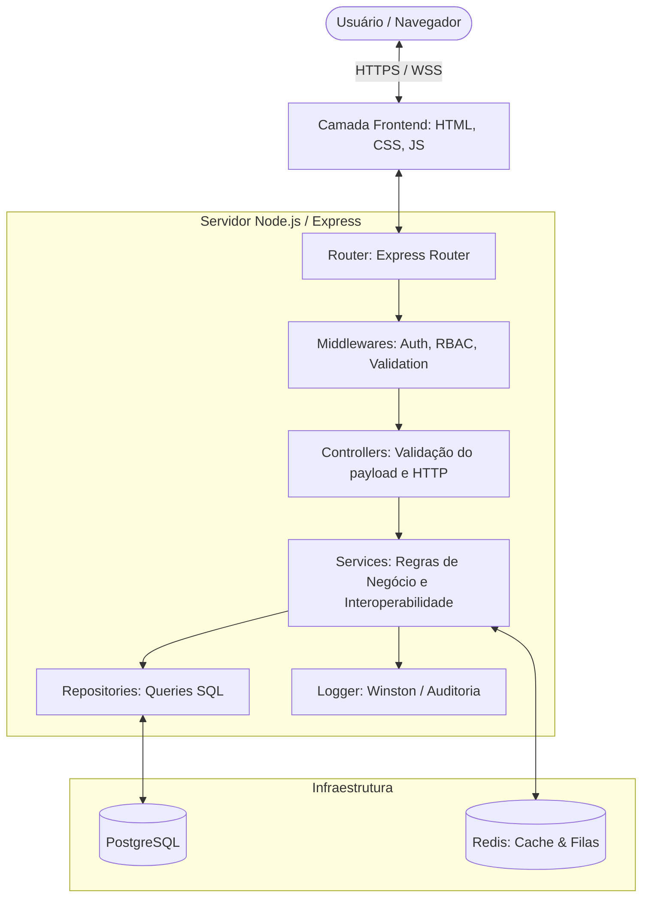
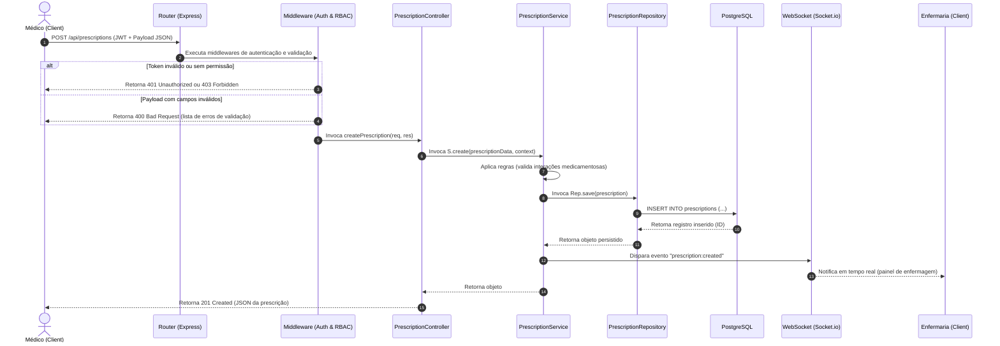

# Health Nexus — Arquitetura Geral de Software

Este documento detalha o desenho arquitetural do **Health Nexus**, especificando os padrões, as camadas do sistema, o fluxo das requisições, a gestão de logs, cache, tratamento de erros e o design de plugins/extensões.

---

## 1. Diagrama de Camadas

O sistema é construído sobre o padrão arquitetural em camadas para desacoplar as responsabilidades de visualização, roteamento, lógica de negócios, acesso a dados e auditoria.



### Detalhamento das Camadas

1.  **Frontend (Navegador)**: Single Page Application (SPA) construído sobre padrões web puros. Comunica-se com o backend via requisições assíncronas (`fetch` API) e canais bidirecionais (*WebSockets*).
2.  **Router**: Camada do Express responsável por expor os endpoints HTTP e direcioná-los aos controllers correspondentes.
3.  **Middlewares**: Interceptadores globais ou específicos executados no ciclo da requisição para lidar com:
    *   Autenticação (Validação do token JWT).
    *   Autorização baseada em Perfis e Permissões (RBAC).
    *   Sanitização e Validação de payloads de entrada (ex: via Zod/Joi).
4.  **Controllers**: Responsáveis por interpretar os parâmetros da requisição HTTP (parâmetros de rota, query strings, headers e body), delegar a lógica para os *Services*, e retornar o status HTTP adequado com o payload de resposta JSON.
5.  **Services**: A "Zona de Negócio". Todo o comportamento da aplicação, integrações externas (ex: FHIR, ViaCEP), regras clínicas e cálculos residem nesta camada. É isolada de conceitos do Express (não lida com objetos `req` ou `res`).
6.  **Repositories**: Abstração da camada de persistência. Contém comandos SQL parametrizados ou chamadas ao Query Builder para interagir com o banco de dados PostgreSQL.
7.  **Database**: Banco de dados relacional PostgreSQL garantindo transações ACID necessárias para o fluxo financeiro e prontuários médicos.

---

## 2. Ciclo de Vida da Requisição (Request Flow)

Para ilustrar o ciclo de uma requisição típica, o fluxo abaixo demonstra o processo de registro de uma prescrição médica:



---

## 3. Tratamento Global de Erros

O tratamento de falhas no Health Nexus segue uma estrutura hierárquica baseada em exceções customizadas herdadas de uma classe base `AppError`.

### Estrutura do Erro Retornado à API
Todas as falhas tratadas retornam o mesmo padrão JSON:
```json
{
  "status": "error",
  "statusCode": 400,
  "message": "Mensagem descritiva do erro",
  "errors": []
}
```

### Classe Base de Erros (`AppError.js`)
No backend, as exceções seguem este modelo padrão:
```javascript
class AppError extends Error {
  constructor(message, statusCode = 400, errors = []) {
    super(message);
    this.statusCode = statusCode;
    this.status = 'error';
    this.errors = errors;
    Error.captureStackTrace(this, this.constructor);
  }
}
```

### Middleware Global de Erros
Um único middleware captura exceções não tratadas nas rotas do Express, garantindo que o servidor nunca sofra um *crash* catastrófico e que nenhuma stacktrace interna do banco de dados seja exposta ao usuário:
```javascript
app.use((err, req, res, next) => {
  if (err instanceof AppError) {
    return res.status(err.statusCode).json({
      status: err.status,
      statusCode: err.statusCode,
      message: err.message,
      errors: err.errors
    });
  }

  // Erros inesperados de infraestrutura ou sintaxe de código
  console.error('CRITICAL SYSTEM ERROR:', err);
  return res.status(500).json({
    status: 'error',
    statusCode: 500,
    message: 'Ocorreu um erro interno no servidor.'
  });
});
```

---

## 4. Estratégia de Caching e Filas

Para obter alta performance e evitar sobrecarga no banco relacional PostgreSQL, o Health Nexus utiliza o **Redis**:

### Caching
*   **Tabelas de Referência**: Cadastros que mudam raramente (tabelas do CID-10, Terminologia TUSS, municípios do IBGE e tabelas de Convênio) são cacheados em memória no Redis com expiração longa (TTL de 24 horas).
*   **Sessões**: Gerenciamento de revogação de tokens JWT em tempo real (blacklist de logout).

### Filas em Segundo Plano (Background Jobs)
Tarefas de processamento pesado ou integrações demoradas são enfileiradas e processadas de forma assíncrona usando o Redis como broker (ex: utilizando BullMQ):
1.  **Envio de confirmações por WhatsApp/Email**.
2.  **Exportação de faturamentos de guias XML TISS complexas**.
3.  **Processamento de IA (Sumarização da OpenAI)**.
4.  **Sincronização em lote com o barramento do Ministério da Saúde / CNES**.

---

## 5. Estrutura para Plugins e Integrações Futuras

Para viabilizar extensões e novas conexões a softwares de terceiros (como sistemas de faturamento locais, prontuários legados ou equipamentos médicos IoT), o Health Nexus introduz o conceito de **Adapters** e **Hooks**.

### Service Adapters (Interoperabilidade)
As conexões externas não são codificadas diretamente nas regras de negócio. Utiliza-se a injeção de dependências através de interfaces comuns de serviços.
*   **Exemplo**: A classe `WhatsAppService` implementa uma interface genérica de comunicação. Caso o hospital mude de provedor de SMS/WhatsApp, altera-se apenas o *Adapter* sem impactar os serviços clínicos que invocam o envio de lembretes.

### Hooks de Eventos (Event-Driven Architecture)
O Health Nexus publica eventos em um barramento interno (`EventEmitter` para processos locais ou Redis Pub/Sub para instâncias horizontais de servidores).
*   **Eventos Típicos**: `patient.admitted`, `encounter.completed`, `billing.generated`.
*   **Extensibilidade**: Desenvolvedores externos ou plugins internos podem subscrever a esses eventos para disparar rotinas adicionais sem modificar o core do sistema.
