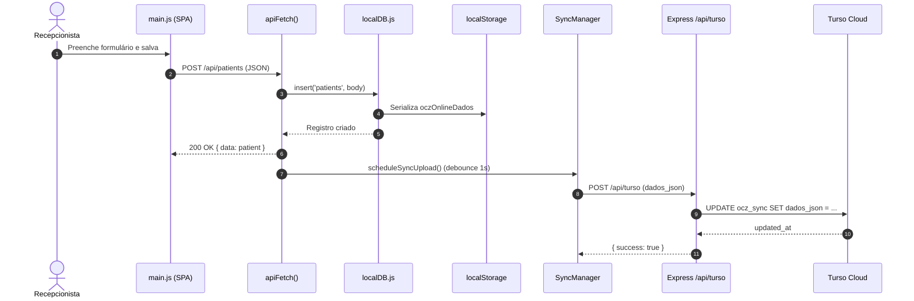

# Health Nexus — Arquitetura Geral de Software

> **Versão do documento:** 1.0.1 (alinhado ao código)  
> **Última atualização:** Agosto 2026  
> **Arquitetura atual:** Offline-first (SPA + localStorage + sync Turso)

Este documento descreve a arquitetura **implementada** na v1.0.1 do Health Nexus. Seções marcadas como *Roadmap* referem-se a evoluções planejadas para v2.0.

---

## 1. Diagrama de Camadas (v1.0.1)

O sistema opera como um **monólito híbrido local-first**: a maior parte da lógica de negócio, persistência e controle de acesso reside no navegador. O backend Express atua principalmente como proxy de sincronização com a nuvem (Turso).

```mermaid
graph TD
    User([Usuário / Navegador]) <-->|HTTPS| SPA[SPA Vanilla JS — src/main.js]

    subgraph ClientLayer [Camada Cliente — Navegador]
        SPA
        APIFetch[apiFetch — mock REST local]
        LocalDB[localDB.js — CRUD localStorage]
        SyncMgr[SyncManager — sync Turso]
        RBAC[getRolePermissions — RBAC UI]
    end

    subgraph ServerLayer [Servidor Node.js / Express]
        Express[backend/app.js]
        TursoProxy[/api/turso — sync endpoint]
    end

    subgraph Persistence [Persistência]
        LS[(localStorage — oczOnlineDados)]
        Turso[(Turso LibSQL — ocz_sync blob JSON)]
    end

    SPA --> APIFetch
    APIFetch --> LocalDB
    LocalDB --> LS
    SyncMgr -->|POST/GET| TursoProxy
    TursoProxy --> Turso
    SPA --> RBAC
```

### Detalhamento das Camadas

1. **SPA (`src/main.js`)**: Single Page Application em JavaScript vanilla (~13k linhas). Renderiza todas as abas (dashboard, pacientes, agenda, atendimento, PEP, farmácia, financeiro, etc.), gerencia estado global e UI.
2. **`apiFetch()`**: Interceptador que simula a API REST no cliente. Rotas `/api/*` são roteadas para `localDB.js` (CRUD genérico). Rotas de sync (`/api/turso`) passam para o backend real.
3. **`localDB.js`**: Camada de persistência local. Armazena entidades como arrays JSON dentro de `localStorage` (`oczOnlineDados`). Expõe `list`, `get`, `insert`, `update`, `remove`.
4. **`SyncManager`**: Classe em `main.js` responsável por push/pull com Turso, cooldown (60s), auto-sync (15 min) e resolução de conflitos local vs nuvem.
5. **RBAC (frontend)**: Função `getRolePermissions()` controla abas visíveis e flags (`canSignPEP`, `canDoTriage`, etc.) por perfil hospitalar.
6. **Backend Express (`backend/app.js`)**: Servidor enxuto. Endpoint principal: `/api/turso` (GET status/download, POST upload do blob JSON). Rotas REST legadas retornam 404.
7. **Turso (LibSQL)**: Nuvem edge. Dados sincronizados como snapshot serializado na tabela `ocz_sync` (colunas `dados_json`, `config_json`, `updated_at`).

---

## 2. Ciclo de Vida de uma Requisição (v1.0.1)

Exemplo: cadastro de um paciente via `POST /api/patients`.


```mermaid
sequenceDiagram
    autonumber
    actor User as Recepcionista
    participant UI as main.js (SPA)
    participant AF as apiFetch()
    participant LDB as localDB.js
    participant LS as localStorage
    participant SM as SyncManager
    participant BE as Express /api/turso
    participant TC as Turso Cloud

    User->>UI: Preenche formulário e salva
    UI->>AF: POST /api/patients (JSON)
    AF->>LDB: insert('patients', body)
    LDB->>LS: Serializa oczOnlineDados
    LDB-->>AF: Registro criado
    AF-->>UI: 200 OK { data: patient }
    AF->>SM: scheduleSyncUpload() (debounce 1s)
    SM->>BE: POST /api/turso (dados_json)
    BE->>TC: UPDATE ocz_sync SET dados_json = ...
    TC-->>BE: updated_at
    BE-->>SM: { success: true }
```

### Fluxo de autenticação

1. Usuário submete login na tela de autenticação.
2. `apiFetch('/api/auth/login')` busca usuário em `localDB.list('users')` pelo `username`.
3. Token armazenado em `sessionStorage` (`hn_token`, `hn_user`).
4. RBAC aplicado via `getRolePermissions()` ao renderizar a estrutura da aplicação.

> **Limitação conhecida (v1.0.1):** validação de senha e JWT real ainda não implementados no fluxo principal. Ver `docs/07-Seguranca/01-autenticacao-autorizacao.md`.

---

## 3. Tratamento de Erros (v1.0.1)

No cliente, `apiFetch()` retorna um objeto mock de `Response` com `ok`, `status` e `json()`. Erros de persistência local são capturados em bloco `try/catch` e retornam status 500 com `{ message }`.

No backend (`backend/app.js`), erros de sync Turso retornam:
```json
{ "error": "Erro interno de sincronização" }
```

Rotas inexistentes retornam:
```json
{ "error": "Rota relacional legada não existe mais. Use offline-first architecture." }
```

### Roadmap — Tratamento global de erros (v2.0)

Na arquitetura-alvo com backend REST completo, erros seguirão o padrão `AppError` com middleware global Express, retornando:
```json
{
  "status": "error",
  "statusCode": 400,
  "message": "Mensagem descritiva",
  "errors": []
}
```

---

## 4. Cache e Performance (v1.0.1)

| Mecanismo | Implementação | TTL |
|-----------|---------------|-----|
| Cache de dados da API | `dataCache` (Map) em `main.js` | 30 segundos |
| Persistência local | `localStorage` | Permanente (até reset) |
| Sync cooldown | `SyncManager.cooldownMs` | 60 segundos |
| Auto-sync | `SyncManager.syncIntervalMs` | 15 minutos |

Não há Redis nem cache server-side na v1.0.1.

### Roadmap — Redis e filas (v2.0)

Planejado para ambientes multi-instância:
- Cache de tabelas de referência (CID-10, TUSS, IBGE)
- Blacklist de tokens JWT
- Filas assíncronas (WhatsApp, exportação TISS, IA)

---

## 5. Entidades Lógicas (tabelas em JSON)

O banco local é um objeto JSON com chaves de coleção. Principais entidades:

| Chave localStorage | Descrição |
|--------------------|-----------|
| `users` | Usuários e perfis RBAC |
| `patients` | Cadastro de pacientes |
| `encounters` | Atendimentos / fila Kanban |
| `appointments` | Agenda de consultas |
| `triages` | Triagens Manchester |
| `clinical_notes` | Prontuário SOAPE |
| `prescriptions` | Prescrições médicas |
| `pharmacy_items` | Estoque farmácia |
| `beds` | Mapa de leitos |
| `financial_installments` | Parcelas financeiras |
| `tv_calls` | Chamadas do painel TV |

Detalhes em `docs/04-Banco-de-Dados/02-dicionario-dados-global.md`.

---

## 6. Extensibilidade e Roadmap

### v1.0.1 — Estado atual
- Integração ViaCEP (autocomplete de endereço no frontend)
- Exportação PDF/XLSX/CSV (jsPDF, SheetJS)
- Web Speech API (painel TV)
- Sync Turso (blob JSON)

### v2.0 — Planejado
- **Adapters**: interfaces para WhatsApp, FHIR, gateways bancários
- **Event-driven**: `EventEmitter` ou Redis Pub/Sub para `patient.admitted`, `encounter.completed`
- **Backend REST real**: controllers/services/repositories com PostgreSQL ou Turso relacional
- **WebSockets**: Socket.io para triagem, leitos e revogação de sessão em tempo real
- **Modularização**: separar `main.js` em módulos por aba (`src/modules/`)

---

## 7. Limitações Conhecidas (v1.0.1)

| Limitação | Impacto |
|-----------|---------|
| Dados em `localStorage` (~5–10 MB) | Volume limitado de registros |
| Sync como blob JSON | Sem integridade referencial; conflitos multi-usuário |
| RBAC só no frontend | Não impede manipulação via DevTools |
| Monolito `main.js` (~13k linhas) | Manutenção e testes difíceis |
| Sem testes automatizados | Regressões não detectadas automaticamente |

Estas limitações são aceitáveis para **demonstração, prototipagem e piloto controlado**, mas bloqueiam uso clínico em produção sem as evoluções da v2.0.
