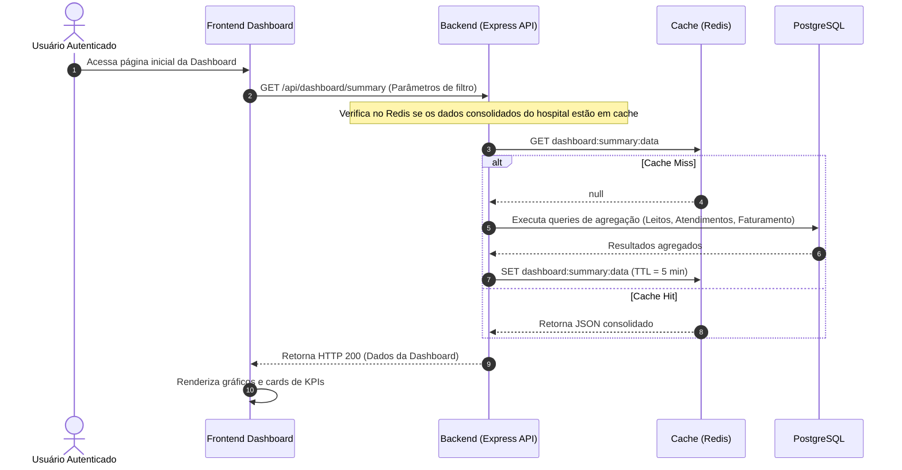
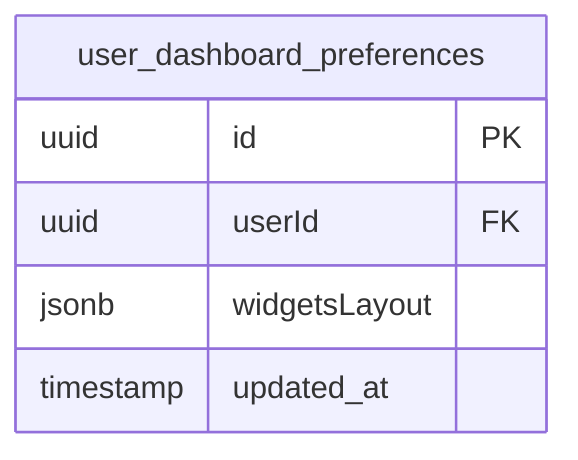

# Health Nexus — Módulo 01: Dashboard

Este documento detalha os requisitos e especificações para o módulo de **Dashboard** do Health Nexus.

---

## 1. Objetivo
Fornecer visualizações centralizadas e em tempo real sobre o status clínico, operacional e financeiro do hospital ou clínica. O painel deve permitir que gestores, diretores e chefes de enfermagem monitorem indicadores-chave de desempenho (KPIs) para a tomada rápida de decisões.

---

## 2. Fluxo de Processo (Workflow)
O painel consome dados de múltiplos módulos e se atualiza de forma assíncrona ou em tempo real (via WebSockets para indicadores operacionais).



---

## 3. Regras de Negócio
1.  **Diferenciação por Perfil**: O painel exibido varia conforme o perfil do usuário logado:
    *   *Médicos*: Foco em pacientes agendados para o dia, pendências de assinatura de PEP e exames críticos liberados.
    *   *Direção/Financeiro*: Foco em receita do mês, glosas de convênio, custo operacional e faturamento pendente.
    *   *Enfermagem Chefe*: Ocupação de leitos, tempo médio de espera na triagem e pacientes graves na UPA.
2.  **Taxa de Atualização (WebSockets)**: Indicadores críticos de pronto-socorro (ex: número de pacientes em fila de triagem) devem atualizar automaticamente via WebSockets sem necessidade de refresh manual.
3.  **Filtragem de Período**: O painel deve permitir filtragem temporal: Hoje, Últimos 7 dias, Mês Atual, Período Customizado.

---

## 4. Banco de Dados (Schema)
O módulo de dashboard não possui tabelas de dados operacionais exclusivas. Ele realiza consultas de leitura consolidada sobre as tabelas existentes no sistema (`patients`, `appointments`, `beds`, `billing_items`, etc.). No entanto, utiliza tabelas de configuração do usuário:



---

## 5. APIs

### `GET /api/dashboard/summary`
Retorna dados gerais consolidados para a dashboard administrativa.
*   **Parâmetros de Query**: `startDate` (ISO Date), `endDate` (ISO Date).
*   **Response (200 OK)**:
```json
{
  "activePatients": 142,
  "occupancyRate": 84.5,
  "averageWaitTimeMinutes": 18,
  "dailyAppointmentsCount": 84,
  "billingSummary": {
    "totalRevenue": 245000.00,
    "pendingClaims": 45100.00
  }
}
```

### `PUT /api/dashboard/preferences`
Salva as preferências de layout de widgets da dashboard do usuário logado.
*   **Request Body**:
```json
{
  "widgetsLayout": {
    "showBilling": true,
    "showOccupancy": true,
    "gridConfig": [
      {"id": "widget-occupancy", "row": 1, "col": 1},
      {"id": "widget-revenue", "row": 1, "col": 2}
    ]
  }
}
```

---

## 6. Wireframe (Textual)
```
+----------------------------------------------------------------------------------+
|  [HEALTH NEXUS]  |  Dashboard  |  Pacientes  |  Agenda  |        Usuario: Dr. João  |
+----------------------------------------------------------------------------------+
|  FILTROS: [ Hoje | 7 dias | Mês ]   [ Unidade: Hospital Central ]                |
+----------------------------------------------------------------------------------+
|  +-------------------+  +-------------------+  +-------------------+  +--------+ |
|  | Ocupação Leitos   |  | Tempo Médio Espera|  | Faturamento (Mês) |  | Alertas| |
|  |     84.5%         |  |    18 minutos     |  |   R$ 245.000,00   |  | 3 Crít.| |
|  +-------------------+  +-------------------+  +-------------------+  +--------+ |
|                                                                                  |
|  +----------------------------------------+  +---------------------------------+ |
|  | Fluxo de Triagem (Tempo Real)          |  | Procedimentos Mais Faturados    | |
|  | [Gráfico de Linha: Espera por cor]     |  | [Gráfico de Pizza: Convênios]   | |
|  +----------------------------------------+  +---------------------------------+ |
+----------------------------------------------------------------------------------+
```

---

## 7. Casos de Uso

| ID | Caso de Uso | Ator Principal | Pré-condições | Fluxo Principal |
| :--- | :--- | :--- | :--- | :--- |
| **UC-0101** | Visualizar Indicadores Administrativos | Diretor Hospitalar | Usuário autenticado com perfil administrativo/financeiro. | 1. O usuário entra na rota `/dashboard`; 2. O frontend solicita os dados via API filtrados para o mês corrente; 3. Renderiza os widgets financeiros e operacionais. |

---

## 8. Perfis e Permissões (RBAC)
*   **Administrador / Diretor**: Acesso total a todos os widgets (Clínico, Operacional e Financeiro).
*   **Enfermeiro Chefe**: Acesso apenas a widgets de ocupação, triagem e tempo de espera.
*   **Médico**: Acesso apenas ao widget de agenda do dia e pendências de prontuário.
*   **Financeiro**: Acesso exclusivo a widgets de faturamento, glosas e contas a pagar/receber.

---

## 9. Dicionário de Campos

| Campo de Interface | Descrição | Tipo | Validação |
| :--- | :--- | :--- | :--- |
| `startDate` | Data inicial do período de consulta | Date | Formato ISO YYYY-MM-DD |
| `endDate` | Data final do período de consulta | Date | Formato ISO YYYY-MM-DD |
| `widgetId` | Identificador do widget a ser configurado | String | Alfanumérico, máximo 50 caracteres |

---

## 10. Validações
*   **Período de Consulta**: A data final (`endDate`) não pode ser anterior à data de início (`startDate`). O intervalo máximo para consultas operacionais em tempo real é de 90 dias para evitar gargalos de processamento.
*   **Parâmetros de Preferências**: O campo `widgetsLayout` deve ser um JSON válido e conter apenas IDs de widgets mapeados e homologados no sistema.
