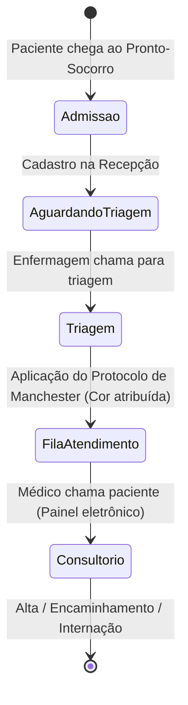
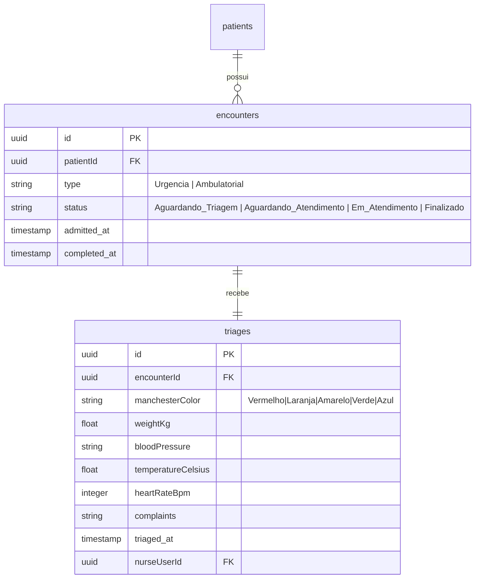

# Health Nexus — Módulo 02: Atendimento

Este documento detalha os requisitos e especificações para o módulo de **Atendimento** do Health Nexus.

---

## 1. Objetivo
Gerenciar a recepção de pacientes, abertura de atendimentos de urgência/emergência ou ambulatoriais, classificação de risco baseada no Protocolo de Manchester e a distribuição de chamadas nas salas de atendimento médico.

---

## 2. Fluxo de Processo (Workflow)
O fluxo padrão engloba a admissão inicial, a classificação de risco efetuada pela enfermagem e a fila de espera médica organizada pela prioridade de triagem.



---

## 3. Regras de Negócio
1.  **Protocolo de Manchester**: O paciente triado deve receber obrigatoriamente uma cor de prioridade com o respectivo tempo máximo de espera recomendado:
    *   `Vermelho` (Emergência): Atendimento imediato.
    *   `Laranja` (Muito Urgente): Até 10 minutos.
    *   `Amarelo` (Urgente): Até 60 minutos.
    *   `Verde` (Pouco Urgente): Até 120 minutos.
    *   `Azul` (Não Urgente): Até 240 minutos.
2.  **Ordenação da Fila**: A fila de chamada do consultório médico deve priorizar a gravidade da cor em vez da ordem de chegada. Em caso de empate na cor de triagem, o tempo de espera mais longo define a prioridade.
3.  **Chamada no Painel**: A chamada do paciente para triagem ou consultório deve disparar um sinal visual e sonoro no Painel de Chamada (via WebSockets).

---

## 4. Banco de Dados (Schema)
O atendimento vincula o paciente ao encontro clínico e rastreia o progresso temporal.



---

## 5. APIs

### `POST /api/encounters`
Abre um novo atendimento/admissão de recepção.
*   **Request Body**:
```json
{
  "patientId": "e1f1ad7e-bf91-4d1a-a53c-12b23a54b38d",
  "type": "Urgencia"
}
```
*   **Response (210 Created)**:
```json
{
  "encounterId": "f98c8c22-d7b1-42cb-b1b7-7ff3ad40e21a",
  "status": "Aguardando_Triagem",
  "admitted_at": "2026-07-18T14:38:00Z"
}
```

### `POST /api/encounters/:id/triage`
Registra a triagem Manchester do atendimento.
*   **Request Body**:
```json
{
  "manchesterColor": "Amarelo",
  "weightKg": 78.5,
  "bloodPressure": "120/80",
  "temperatureCelsius": 37.8,
  "heartRateBpm": 88,
  "complaints": "Paciente relata dor de cabeça intensa e febre desde ontem."
}
```
*   **Response (200 OK)**:
```json
{
  "triageId": "c88d8b12-921c-4b5b-ad7d-df99ac2f482d",
  "status": "Aguardando_Atendimento"
}
```

---

## 6. Wireframe (Textual)
```
+----------------------------------------------------------------------------------+
|  [HEALTH NEXUS]  |  Atendimento > Nova Triagem                                   |
+----------------------------------------------------------------------------------+
|  Paciente: Maria de Souza | ID: 124.532-A                                        |
|                                                                                  |
|  +-- Parâmetros Vitais --------------------------------------------------------+ |
|  |  PA: [ 120/80   ] mmHg    FC: [ 88  ] bpm    Temp: [ 37.8 ] °C   Peso: [ 78.5]  |
|  +-----------------------------------------------------------------------------+ |
|                                                                                  |
|  +-- Classificação Manchester (Selecione a Prioridade) ------------------------+ |
|  |  [ ( ) Vermelho ]   [ ( ) Laranja ]   [ (X) Amarelo ]   [ ( ) Verde ]   [ ] |
|  +-----------------------------------------------------------------------------+ |
|                                                                                  |
|  Queixa Principal:                                                               |
|  [ Paciente com cefaleia intensa e febre moderada há 24h.                    ] |
|                                                                                  |
|  [ Cancelar ]                                            [ Salvar Classificação ]|
+----------------------------------------------------------------------------------+
```

---

## 7. Casos de Uso

| ID | Caso de Uso | Ator Principal | Pré-condições | Fluxo Principal |
| :--- | :--- | :--- | :--- | :--- |
| **UC-0201** | Realizar Triagem de Paciente | Enfermeiro | Atendimento aberto com status `Aguardando_Triagem`. | 1. O Enfermeiro seleciona o paciente na fila de triagem; 2. Mede os sinais vitais e preenche os campos; 3. Define a classificação de risco (Manchester); 4. Salva os dados; 5. O sistema atualiza o status para `Aguardando_Atendimento` e insere na fila de chamada médica. |

---

## 8. Perfis e Permissões (RBAC)
*   **Recepcionista**: Permissão de leitura/escrita para Abertura de Atendimentos (`POST /api/encounters`). Não acessa os dados e formulários de Triagem.
*   **Enfermeiro**: Acesso para leitura/escrita na Fila de Triagem (`POST /api/encounters/:id/triage`).
*   **Médico**: Acesso para visualização da fila triada e alteração do status para "Em Atendimento".

---

## 9. Dicionário de Campos

| Campo de Interface | Descrição | Tipo | Validação |
| :--- | :--- | :--- | :--- |
| `manchesterColor` | Cor de prioridade segundo Protocolo | String | Enum: `Vermelho`, `Laranja`, `Amarelo`, `Verde`, `Azul` |
| `bloodPressure` | Pressão arterial medida | String | Regex format `^\d{2,3}\/\d{2,3}$` (ex: 120/80) |
| `temperatureCelsius`| Temperatura corporal em °C | Decimal | Faixa permitida: 30.0 a 45.0 |
| `heartRateBpm` | Frequência cardíaca em batimentos/min| Inteiro | Faixa permitida: 30 a 220 |

---

## 10. Validações
*   **Sinais Vitais Obrigatórios**: Não é possível salvar uma triagem sem informar a Pressão Arterial (`bloodPressure`), Temperatura (`temperatureCelsius`) e Queixa Principal (`complaints`).
*   **Classificação Manchester**: A seleção da cor de prioridade é obrigatória antes da gravação do atendimento no banco de dados.
