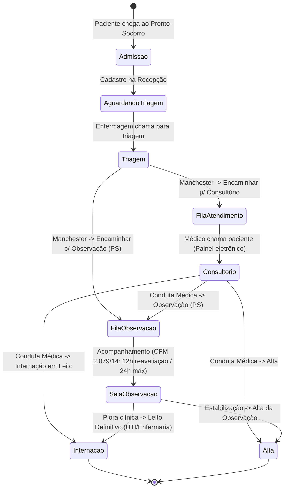
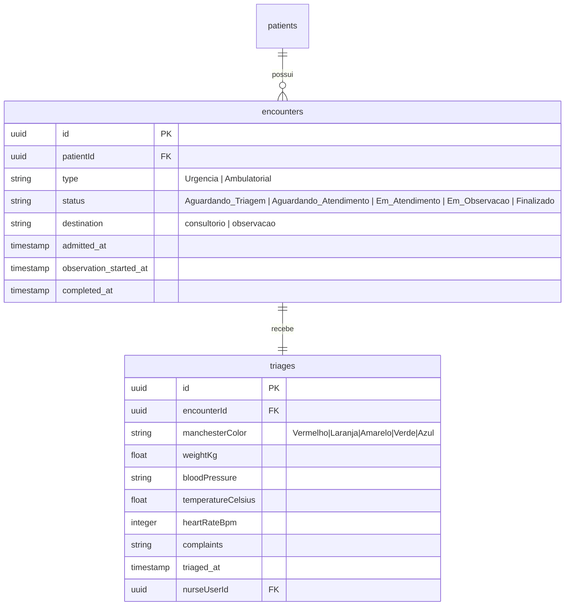

# Health Nexus — Módulo 02: Atendimento

Este documento detalha os requisitos e especificações para o módulo de **Atendimento** do Health Nexus.

---

## 1. Objetivo
Gerenciar a recepção de pacientes, abertura de atendimentos de urgência/emergência ou ambulatoriais, classificação de risco baseada no Protocolo de Manchester e a distribuição de chamadas nas salas de atendimento médico.

---

## 2. Fluxo de Processo (Workflow)
O fluxo padrão engloba a admissão inicial, a classificação de risco efetuada pela enfermagem com desfecho duplo (Consultório Médico ou Observação do PS), e o acompanhamento assistencial completo.


```mermaid
stateDiagram-v2
    [*] --> Admissao : Paciente chega ao Pronto-Socorro
    Admissao --> AguardandoTriagem : Cadastro na Recepção
    AguardandoTriagem --> Triagem : Enfermagem chama para triagem
    Triagem --> FilaAtendimento : Manchester -> Encaminhar p/ Consultório
    Triagem --> FilaObservacao : Manchester -> Encaminhar p/ Observação (PS)
    FilaAtendimento --> Consultorio : Médico chama paciente (Painel eletrônico)
    Consultorio --> FilaObservacao : Conduta Médica -> Observação (PS)
    Consultorio --> Internacao : Conduta Médica -> Internação em Leito
    Consultorio --> Alta : Conduta Médica -> Alta
    FilaObservacao --> SalaObservacao : Acompanhamento (CFM 2.079/14: 12h reavaliação / 24h máx)
    SalaObservacao --> Internacao : Piora clínica -> Leito Definitivo (UTI/Enfermaria)
    SalaObservacao --> Alta : Estabilização -> Alta da Observação
    Internacao --> [*]
    Alta --> [*]
```

---

## 3. Regras de Negócio
1.  **Protocolo de Manchester**: O paciente triado deve receber obrigatoriamente uma cor de prioridade com o respectivo tempo máximo de espera recomendado:
    *   `Vermelho` (Emergência): Atendimento imediato.
    *   `Laranja` (Muito Urgente): Até 10 minutos.
    *   `Amarelo` (Urgente): Até 60 minutos.
    *   `Verde` (Pouco Urgente): Até 120 minutos.
    *   `Azul` (Não Urgente): Até 240 minutos.
2.  **Desfecho Duplo na Triagem**: Ao concluir a triagem Manchester, o profissional de enfermagem dispõe de duas ações de encaminhamento:
    *   `Encaminhar p/ Consultório`: Envia o paciente para a fila de espera médica normal (`Aguardando Atendimento`).
    *   `Encaminhar p/ Observação (PS)`: Direciona o paciente diretamente para a sala de observação do pronto-socorro (`Em Observação`), reservada para casos de maior gravidade, necessidade de estabilização imediata ou início imediato de hidratação/medicação venosa.
3.  **Sala de Observação do Pronto-Socorro (Resolução CFM nº 2.079/14)**:
    *   **Meta de Reavaliação (12 Horas)**: Todo paciente em observação deve ser formalmente reavaliado pela equipe médica no intervalo máximo de 12 horas.
    *   **Limite Legal de Permanência (24 Horas)**: A permanência máxima na sala de observação do PS é de 24 horas. Ao atingir esse prazo, o paciente deve receber alta por melhora clínica ou ser obrigatoriamente transferido para leito de internação hospitalar definitiva (Clínica Médica, Cirúrgica, UTI, etc.).
    *   **Ações Assistenciais na Observação**: O módulo de observação disponibiliza 4 ações imediatas por paciente: Abrir PEP SOAP, Prescrever Medicamento, Transferir/Internar em Leito Hospitalar e Concluir Alta da Observação (com registro de data e horário).
4.  **Ordenação da Fila**: A fila de chamada do consultório médico prioriza a gravidade da cor em vez da ordem de chegada. Em caso de empate na cor de triagem, o tempo de espera mais longo define a prioridade.
5.  **Chamada no Painel (TV Signage & Voz) e Vínculo com Consultório**: A chamada do paciente para triagem ou consultório dispara sinal visual no Painel TV e anúncio sonoro (*Web Speech API*). Ao ser chamado, o status do atendimento transiciona para `Em_Atendimento` com vínculo da sala/consultório, permitindo abertura direta do PEP em 1 clique pelo médico.
6.  **Linha do Cuidado Completa (Patient Journey Timeline)**: O sistema consolida todos os atendimentos, triagens, notas SOAP, prescrições, períodos de observação no PS e internações em uma linha do tempo unificada acessível pelo prontuário e busca global.
7.  **Registro Histórico de Alta**: Ao conceder alta (seja ambulatorial, de consultório ou de observação), o sistema registra o carimbo temporal exato (`alta_data_hora`) no prontuário do paciente, mantendo o histórico visível em badge na ficha cadastral do paciente.

---

## 4. Banco de Dados (Schema)
O atendimento vincula o paciente ao encontro clínico e rastreia o progresso temporal.


```mermaid
erDiagram
    patients ||--o{ encounters : "possui"
    encounters {
        uuid id PK
        uuid patientId FK
        string type "Urgencia | Ambulatorial"
        string status "Aguardando_Triagem | Aguardando_Atendimento | Em_Atendimento | Em_Observacao | Finalizado"
        string destination "consultorio | observacao"
        timestamp admitted_at
        timestamp observation_started_at
        timestamp completed_at
    }
    encounters ||--|| triages : "recebe"
    triages {
        uuid id PK
        uuid encounterId FK
        string manchesterColor "Vermelho|Laranja|Amarelo|Verde|Azul"
        float weightKg
        string bloodPressure
        float temperatureCelsius
        integer heartRateBpm
        string complaints
        timestamp triaged_at
        uuid nurseUserId FK
    }
```

---

## 5. APIs

### `POST /api/encounters`
Abre um novo atendimento/admissão de recepção.
*   **Request Body**:
```json
{
  "patientId": "e1f1ad7e-bf91-4d1a-a53c-12b23a54b38d",
  "type": "Urgencia"
}
```
*   **Response (210 Created)**:
```json
{
  "encounterId": "f98c8c22-d7b1-42cb-b1b7-7ff3ad40e21a",
  "status": "Aguardando_Triagem",
  "admitted_at": "2026-07-18T14:38:00Z"
}
```

### `POST /api/encounters/:id/triage`
Registra a triagem Manchester do atendimento com desfecho de destino (`consultorio` ou `observacao`).
*   **Request Body**:
```json
{
  "manchesterColor": "Amarelo",
  "weightKg": 78.5,
  "bloodPressure": "120/80",
  "temperatureCelsius": 37.8,
  "heartRateBpm": 88,
  "complaints": "Paciente relata dor de cabeça intensa e febre desde ontem.",
  "destination": "observacao"
}
```
*   **Response (200 OK)**:
```json
{
  "triageId": "c88d8b12-921c-4b5b-ad7d-df99ac2f482d",
  "status": "Em_Observacao",
  "destination": "observacao",
  "observation_started_at": "2026-09-24T18:30:00Z"
}
```

### `POST /api/encounters/:id/finish-observation`
Conclui o período de observação do paciente no Pronto-Socorro com alta clínica e registro do carimbo temporal.
*   **Request Body**:
```json
{
  "notes": "Paciente estável e hidratado após 6h de observação. Alta médica concedida."
}
```
*   **Response (200 OK)**:
```json
{
  "encounterId": "f98c8c22-d7b1-42cb-b1b7-7ff3ad40e21a",
  "status": "Finalizado",
  "completed_at": "2026-09-25T00:30:00Z"
}
```

---

## 6. Wireframe (Textual)
```
+----------------------------------------------------------------------------------+
|  [HEALTH NEXUS]  |  Atendimento > Nova Triagem                                   |
+----------------------------------------------------------------------------------+
|  Paciente: Maria de Souza | ID: 124.532-A                                        |
|                                                                                  |
|  +-- Parâmetros Vitais --------------------------------------------------------+ |
|  |  PA: [ 120/80   ] mmHg    FC: [ 88  ] bpm    Temp: [ 37.8 ] °C   Peso: [ 78.5]  |
|  +-----------------------------------------------------------------------------+ |
|                                                                                  |
|  +-- Classificação Manchester (Selecione a Prioridade) ------------------------+ |
|  |  [ ( ) Vermelho ]   [ ( ) Laranja ]   [ (X) Amarelo ]   [ ( ) Verde ]   [ ] |
|  +-----------------------------------------------------------------------------+ |
|                                                                                  |
|  Queixa Principal:                                                               |
|  [ Paciente com cefaleia intensa e febre moderada há 24h.                    ] |
|                                                                                  |
|  [ Cancelar ]     [ Encaminhar p/ Consultório ]   [ 🛏️ Encaminhar p/ Observação ]|
+----------------------------------------------------------------------------------+
```

---

## 7. Casos de Uso

| ID | Caso de Uso | Ator Principal | Pré-condições | Fluxo Principal |
| :--- | :--- | :--- | :--- | :--- |
| **UC-0201** | Realizar Triagem de Paciente | Enfermeiro | Atendimento aberto com status `Aguardando_Triagem`. | 1. O Enfermeiro seleciona o paciente na fila de triagem; 2. Mede os sinais vitais e preenche os campos; 3. Define a classificação de risco (Manchester); 4. Escolhe entre `Encaminhar p/ Consultório` (status `Aguardando_Atendimento`) ou `Encaminhar p/ Observação (PS)` (status `Em_Observacao`); 5. Sistema salva os dados e insere na fila de destino com alertas em tempo real. |
| **UC-0202** | Manejo de Paciente em Observação (PS) | Médico / Enfermeiro | Paciente com status `Em_Observacao` na sala de observação do PS. | 1. Equipe acessa a aba "Observação (PS)"; 2. Monitora tempo de permanência contra os limites da Resolução CFM nº 2.079/14 (12h/24h); 3. Executa ações assistenciais necessárias (PEP SOAP, Prescrição Médica); 4. Decide pelo desfecho: Concluir Alta da Observação (carimbo de data/hora) ou Internação definitiva em leito hospitalar. |

---

## 8. Perfis e Permissões (RBAC)
*   **Recepcionista**: Permissão de leitura/escrita para Abertura de Atendimentos (`POST /api/encounters`). Não acessa os dados e formulários de Triagem.
*   **Enfermeiro**: Acesso para leitura/escrita na Fila de Triagem (`POST /api/encounters/:id/triage`).
*   **Médico**: Acesso para visualização da fila triada e alteração do status para "Em Atendimento".

---

## 9. Dicionário de Campos

| Campo de Interface | Descrição | Tipo | Validação |
| :--- | :--- | :--- | :--- |
| `manchesterColor` | Cor de prioridade segundo Protocolo | String | Enum: `Vermelho`, `Laranja`, `Amarelo`, `Verde`, `Azul` |
| `bloodPressure` | Pressão arterial medida | String | Regex format `^\d{2,3}\/\d{2,3}$` (ex: 120/80) |
| `temperatureCelsius`| Temperatura corporal em °C | Decimal | Faixa permitida: 30.0 a 45.0 |
| `heartRateBpm` | Frequência cardíaca em batimentos/min| Inteiro | Faixa permitida: 30 a 220 |

---

## 10. Validações
*   **Sinais Vitais Obrigatórios**: Não é possível salvar uma triagem sem informar a Pressão Arterial (`bloodPressure`), Temperatura (`temperatureCelsius`) e Queixa Principal (`complaints`).
*   **Classificação Manchester**: A seleção da cor de prioridade é obrigatória antes da gravação do atendimento no banco de dados.
