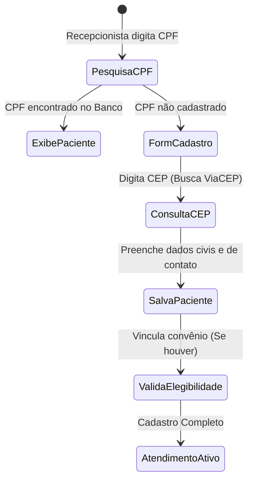
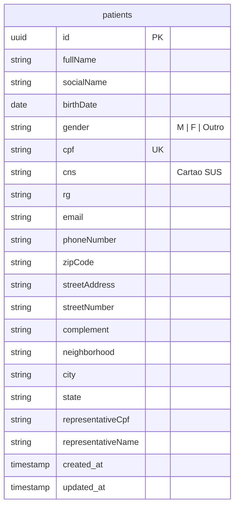

# Health Nexus — Módulo 03: Pacientes

Este documento detalha os requisitos e especificações para o módulo de **Pacientes** (Cadastro Central) do Health Nexus.

---

## 1. Objetivo
Centralizar o cadastro demográfico dos pacientes, registros de identificação civil e validação de cobertura/elegibilidade de saúde. Este é o cadastro mestre que alimenta o Prontuário Eletrônico do Paciente (PEP), agendas e faturamento.

---

## 2. Fluxo de Processo (Workflow)
O fluxo padrão abrange a pesquisa de homônimos para evitar duplicidade de prontuários, cadastro de dados demográficos integrando APIs externas, e verificação de plano de saúde.



---

## 3. Regras de Negócio
1.  **Chave Única**: O CPF deve ser único por paciente. Caso o paciente seja menor de idade e não possua CPF próprio, é obrigatório registrar o CPF e nome do Responsável Legal.
2.  **Integração ViaCEP**: O preenchimento do campo CEP deve acionar um gatilho para preencher automaticamente os campos: Logradouro, Bairro, Cidade e Estado.
3.  **Identificação do SUS**: O número do Cartão Nacional de Saúde (CNS) deve ser validado pelo algoritmo oficial do Ministério da Saúde (validador de integridade do CNS).
4.  **Cadastro Biométrico (Opcional)**: O sistema deve permitir anexar uma foto facial do paciente direto da webcam para identificação visual e segurança nas etapas seguintes (evita fraudes de identidade).

---

## 4. Banco de Dados (Schema)
Modelagem central do paciente no banco de dados.



---

## 5. APIs

### `POST /api/patients`
Cria um novo paciente.
*   **Request Body**:
```json
{
  "fullName": "Maria de Souza Silva",
  "birthDate": "1985-05-15",
  "gender": "F",
  "cpf": "12345678901",
  "email": "maria.souza@email.com",
  "phoneNumber": "11988887777",
  "zipCode": "01310100",
  "streetAddress": "Avenida Paulista",
  "streetNumber": "1000",
  "neighborhood": "Bela Vista",
  "city": "São Paulo",
  "state": "SP"
}
```
*   **Response (201 Created)**:
```json
{
  "patientId": "e1f1ad7e-bf91-4d1a-a53c-12b23a54b38d",
  "fullName": "Maria de Souza Silva"
}
```

### `GET /api/patients/search`
Pesquisa pacientes por CPF, CNS ou Nome Completo.
*   **Parâmetros de Query**: `query` (String de pesquisa).
*   **Response (200 OK)**:
```json
[
  {
    "patientId": "e1f1ad7e-bf91-4d1a-a53c-12b23a54b38d",
    "fullName": "Maria de Souza Silva",
    "birthDate": "1985-05-15",
    "cpf": "12345678901"
  }
]
```

---

## 6. Wireframe (Textual)
```
+----------------------------------------------------------------------------------+
|  [HEALTH NEXUS]  |  Pacientes > Novo Cadastro                                    |
+----------------------------------------------------------------------------------+
|  *Nome Completo: [ Maria de Souza Silva                                       ]  |
|  Nome Social:    [                                                            ]  |
|  *Data Nasc:     [ 15/05/1985 ]   *Gênero: [ Feminino ]   *CPF: [ 123.456.789-01] |
|                                                                                  |
|  +-- Endereço -----------------------------------------------------------------+ |
|  |  *CEP: [ 01310-100 ] [Buscar]  Rua: [ Avenida Paulista                     ] |
|  |  Nº:   [ 1000      ]           Compl: [ Apto 42    ] Bairro: [ Bela Vista ]  |
|  |  Cidade: [ São Paulo          ]  UF: [ SP ]                                  |
|  +-----------------------------------------------------------------------------+ |
|                                                                                  |
|  [ Cancelar ]                                                  [ Salvar Cadastro ]|
+----------------------------------------------------------------------------------+
```

---

## 7. Casos de Uso

| ID | Caso de Uso | Ator Principal | Pré-condições | Fluxo Principal |
| :--- | :--- | :--- | :--- | :--- |
| **UC-0301** | Cadastrar Novo Paciente | Recepcionista | Usuário autenticado na recepção. | 1. Recepcionista acessa tela de cadastro; 2. Digita o CPF e o sistema valida se já existe; 3. Preenche dados obrigatórios; 4. Digita o CEP e o sistema autocompleta o endereço; 5. Salva o registro. |

---

## 8. Perfis e Permissões (RBAC)
*   **Recepcionista / Administrativo**: Permissão total de leitura e escrita (criar/editar cadastros). Não possui permissão para exclusão (`DELETE`).
*   **Enfermeiro / Médico**: Permissão de leitura dos dados demográficos para vinculação clínica.
*   **Administrador de TI**: Permissão para excluir registros duplicados ou corrigir inconsistências cadastrais estruturais.

---

## 9. Dicionário de Campos

| Campo de Interface | Descrição | Tipo | Validação |
| :--- | :--- | :--- | :--- |
| `fullName` | Nome completo civil do paciente | String | Mínimo 3 palavras, máximo 150 caracteres |
| `birthDate` | Data de nascimento do paciente | Date | Deve ser menor que a data atual |
| `cpf` | Cadastro de Pessoa Física | String | Formato de 11 dígitos, verificação matemática de dígitos |
| `zipCode` | Código de Endereçamento Postal | String | Formato de 8 dígitos |

---

## 10. Validações
*   **Validador de CPF**: Impede o cadastro de números com formatos inválidos ou sequências repetidas (ex: `111.111.111-11`).
*   **Idade & Responsável**: Se a diferença entre a data atual e a data de nascimento for menor que 18 anos, os campos `representativeCpf` e `representativeName` tornam-se de preenchimento obrigatório no frontend e backend.
