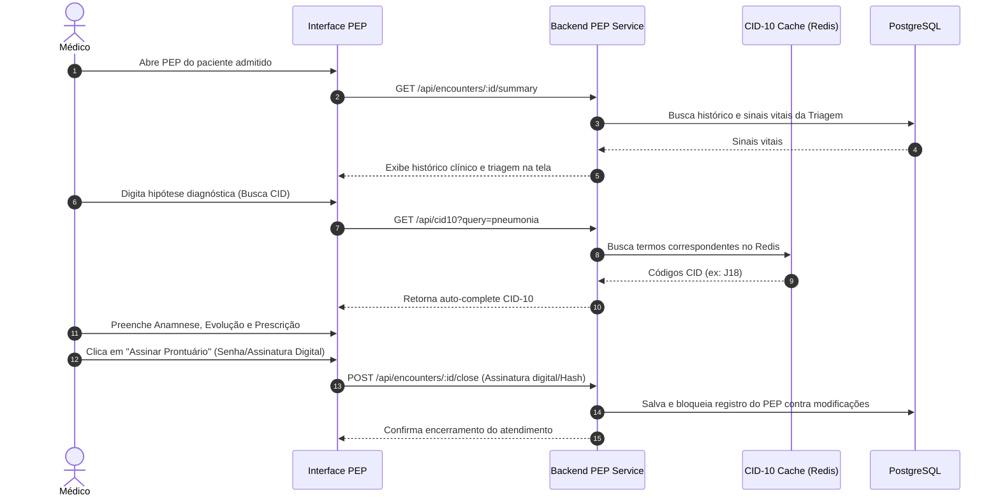
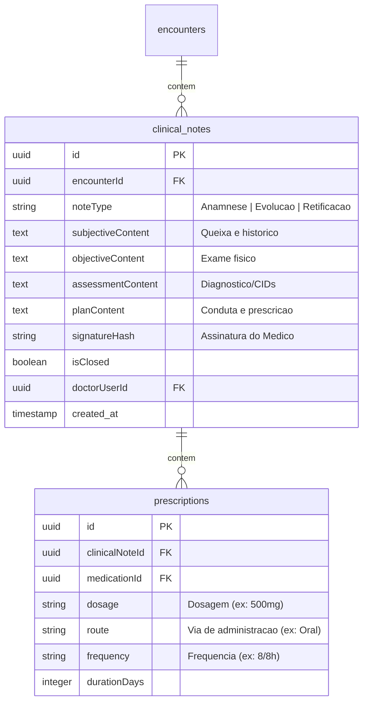

# Health Nexus — Módulo 04: Prontuário

Este documento detalha os requisitos e especificações para o módulo de **Prontuário** (Prontuário Eletrônico do Paciente - PEP) do Health Nexus.

---

## 1. Objetivo
Registrar todo o histórico clínico do paciente, incluindo anamnese, exames físicos, diagnósticos (CID-10), evoluções médicas e multidisciplinares, prescrições de medicamentos, solicitações e laudos de exames.

---

## 2. Fluxo de Processo (Workflow)
O fluxo do atendimento clínico no prontuário eletrônico segue a triagem de sinais vitais, consulta clínica, prescrição e assinatura eletrônica.



---

## 3. Regras de Negócio
1.  **Imutabilidade pós-fechamento**: Uma vez assinado eletronicamente e fechado o atendimento pelo profissional de saúde, a anamnese, evolução e prescrição tornam-se **imutáveis**. Qualquer correção posterior deve ser feita exclusivamente via "Termo de Retificação" (adendo com data e assinatura do profissional), mantendo o histórico original intacto (exigência do CFM - Conselho Federal de Medicina).
2.  **Catálogo de Medicamentos**: A prescrição médica de medicamentos deve ser vinculada à tabela de estoque ativo da farmácia hospitalar para validação de dosagens e disponibilidade física.
3.  **Alertas de Interações**: Ao adicionar múltiplos medicamentos, o backend deve acionar regras que comparem se há interações medicamentosas graves cadastradas no banco, alertando o médico com pop-ups na tela.

---

## 4. Banco de Dados (Schema)
O prontuário armazena múltiplos eventos clínicos vinculados a um atendimento.



---

## 5. APIs

### `POST /api/encounters/:id/notes`
Registra ou atualiza rascunho de evolução clínica / anamnese do prontuário.
*   **Request Body**:
```json
{
  "noteType": "Anamnese",
  "subjectiveContent": "Paciente queixa-se de tosse produtiva.",
  "objectiveContent": "Presença de estertores crepitantes em base direita.",
  "assessmentContent": "Hipótese de Pneumonia Adquirida na Comunidade. CID-10 J18.",
  "planContent": "Iniciar antibioticoterapia e repouso."
}
```
*   **Response (200 OK)**:
```json
{
  "clinicalNoteId": "78da8a9e-f2c2-4cb1-8012-4fb32ad0c98f",
  "isClosed": false
}
```

### `POST /api/encounters/:id/sign`
Assina e finaliza o prontuário do atendimento em caráter irrevogável.
*   **Request Body**:
```json
{
  "passwordVerification": "senha_medico_123",
  "digitalSignatureCertificate": "hash_certificado_icp_brasil_opcional"
}
```
*   **Response (200 OK)**:
```json
{
  "signatureHash": "a98f12cc2f5e8b4e723de49ac0b8923a",
  "isClosed": true,
  "signedAt": "2026-07-18T14:38:00Z"
}
```

---

## 6. Wireframe (Textual)
```
+----------------------------------------------------------------------------------+
|  [HEALTH NEXUS]  |  PEP > Atendimento Clínico                                    |
+----------------------------------------------------------------------------------+
|  Paciente: Maria de Souza | Idade: 41 anos | Sinais Vitais: PA 12/8 - Temp 37.8°C|
+----------------------------------------------------------------------------------+
|  [ Anamnese / Evolução ]  [ Prescrição ]  [ Exames ]  [ Histórico de Consultas ]  |
+----------------------------------------------------------------------------------+
|  Subjetivo (Queixas do paciente):                                                |
|  [ Paciente relata cefaleia persistente com náuseas...                         ] |
|                                                                                  |
|  Objetivo (Exame Físico):                                                       |
|  [ Abdômen flácido, indolor à palpação...                                      ] |
|                                                                                  |
|  Diagnóstico (CID-10):                                                           |
|  [ R51 - Cefaleia                                                           [x] ] |
|                                                                                  |
|  [ Salvar Rascunho ]                                        [ Assinar e Fechar ] |
+----------------------------------------------------------------------------------+
```

---

## 7. Casos de Uso

| ID | Caso de Uso | Ator Principal | Pré-condições | Fluxo Principal |
| :--- | :--- | :--- | :--- | :--- |
| **UC-0401** | Prescrever Medicamento com Alerta | Médico | Atendimento clínico ativo no PEP. | 1. O Médico insere o medicamento e a dose; 2. O sistema executa busca assíncrona de interações com os medicamentos já prescritos; 3. Havendo interação, exibe pop-up de alerta de toxicidade; 4. O Médico confirma a prescrição justificando a conduta; 5. O sistema registra a prescrição na nota clínica. |

---

## 8. Perfis e Permissões (RBAC)
*   **Médico / Cirurgião**: Permissão total de leitura e escrita para criar e fechar notas clínicas e prescrições.
*   **Enfermeiro**: Permissão de leitura do PEP do atendimento atual. Permissão de escrita apenas para o tipo de evolução `Evolução de Enfermagem`. Não pode assinar notas de médicos.
*   **Equipe de Faturamento**: Permissão de leitura apenas dos códigos CID-10 e procedimentos realizados para fins de auditoria de cobrança (não tem acesso ao corpo descritivo da anamnese íntima do paciente).

---

## 9. Dicionário de Campos

| Campo de Interface | Descrição | Tipo | Validação |
| :--- | :--- | :--- | :--- |
| `subjectiveContent`| Anotações subjetivas (queixas) | Texto | Limite máximo de 10.000 caracteres |
| `assessmentContent`| Diagnóstico médico / CID-10 | Texto | Obrigatório conter código CID-10 associado |
| `signatureHash` | Assinatura digital criptográfica | String | Formato de hash hexadecimal |

---

## 10. Validações
*   **Bloqueio de Modificação**: Qualquer tentativa de `PUT` ou `DELETE` em uma `clinical_note` onde `isClosed = true` deve retornar um erro HTTP 403 Forbidden.
*   **Assinatura Eletrônica**: O sistema exige a validação da senha do usuário logado antes de gerar o hash de assinatura e marcar `isClosed = true`.
