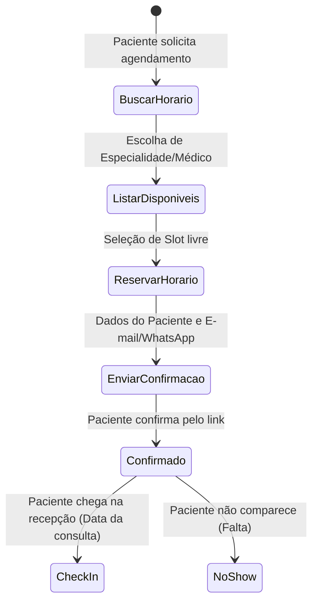
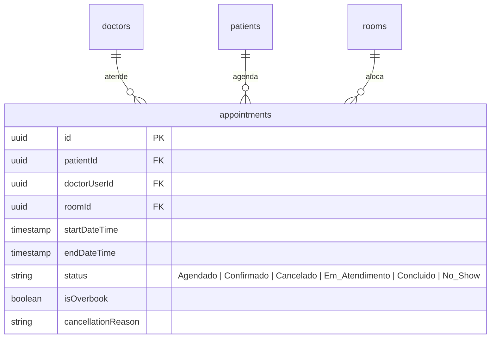

# Health Nexus — Módulo 05: Agenda

Este documento detalha os requisitos e especificações para o módulo de **Agenda** do Health Nexus.

---

## 1. Objetivo
Organizar a agenda de atendimentos, consultas ambulatoriais, exames de diagnóstico por imagem, agendamentos cirúrgicos, escalas de plantões de profissionais de saúde e gerenciar o fluxo de salas físicas e recursos hospitalares.

---

## 2. Fluxo de Processo (Workflow)
O fluxo envolve a consulta de disponibilidade de horários por profissional/especialidade, reserva temporária, confirmação via integração e controle de faltas (No-show).



---

## 3. Regras de Negócio
1.  **Bloqueio de Overbooking**: O sistema não deve permitir dois agendamentos no mesmo horário (slot) para o mesmo profissional na mesma sala física, exceto se configurado previamente um parâmetro de encaixe.
2.  **Limite de Encaixes**: O limite de vagas de encaixe por turno é parametrizável por profissional de saúde (ex: máximo de 2 encaixes por turno de 4 horas).
3.  **Lembrete Automático**: O sistema deve disparar automaticamente uma notificação via WhatsApp Business (ou SMTP) 24 horas antes do agendamento, solicitando que o paciente confirme com "Sim" ou cancele com "Não" (atualizando o banco de dados sem intervenção humana).
4.  **Sincronização Externa**: O sistema deve fornecer sincronização de via única (outbound) com o Google Calendar dos médicos que ativarem a integração nas configurações pessoais.

---

## 4. Banco de Dados (Schema)
O banco controla horários, bloqueios e recursos.



---

## 5. APIs

### `POST /api/appointments`
Agenda uma nova consulta ou exame.
*   **Request Body**:
```json
{
  "patientId": "e1f1ad7e-bf91-4d1a-a53c-12b23a54b38d",
  "doctorUserId": "65b8221c-a111-472e-834c-1200df12ab87",
  "roomId": "098d8c22-b9e1-4c12-a1f9-8ff78b9012cd",
  "startDateTime": "2026-07-20T14:00:00Z",
  "endDateTime": "2026-07-20T14:30:00Z"
}
```
*   **Response (201 Created)**:
```json
{
  "appointmentId": "f0da8c9e-52f1-4db3-9823-1acb29ad89ef",
  "status": "Agendado"
}
```

### `GET /api/appointments/available`
Retorna horários livres para um médico ou especialidade em um intervalo de datas.
*   **Parâmetros de Query**: `doctorUserId`, `startDate`, `endDate`.
*   **Response (200 OK)**:
```json
[
  {
    "startDateTime": "2026-07-20T14:30:00Z",
    "endDateTime": "2026-07-20T15:00:00Z"
  },
  {
    "startDateTime": "2026-07-20T15:00:00Z",
    "endDateTime": "2026-07-20T15:30:00Z"
  }
]
```

---

## 6. Wireframe (Textual)
```
+----------------------------------------------------------------------------------+
|  [HEALTH NEXUS]  |  Agenda > Calendário                                          |
+----------------------------------------------------------------------------------+
|  MÉDICO: [ Dr. Carlos Alberto ]  SALA: [ Consultório 03 ]    DATA: [ 20/07/2026] |
+----------------------------------------------------------------------------------+
|  [ Grade de Horários ]                                                           |
|  08:00 - [ Maria de Souza Silva        ] [Confirmado ] [Chamar] [Editar] [Canc.] |
|  08:30 - [ João Ferreira dos Santos    ] [Agendado   ]          [Editar] [Canc.] |
|  09:00 - [ (Horário Livre)             ] [Agendar + ]                            |
|  09:30 - [ Ana Paula Rodrigues         ] [Cancelado  ]          [Ver Motivo]     |
|  10:00 - [ Pedro Cardoso (Encaixe)     ] [Confirmado ] [Chamar] [Editar] [Canc.] |
|  10:30 - [ (Horário Livre)             ] [Agendar + ]                            |
|                                                                                  |
|  [ Bloquear Horário da Agenda ]                              [ Exportar Agenda ] |
+----------------------------------------------------------------------------------+
```

---

## 7. Casos de Uso

| ID | Caso de Uso | Ator Principal | Pré-condições | Fluxo Principal |
| :--- | :--- | :--- | :--- | :--- |
| **UC-0501** | Agendar Consulta de Paciente | Recepcionista | Paciente cadastrado no banco. | 1. Recepcionista busca horários disponíveis para o especialista; 2. Seleciona o horário; 3. Vincula o paciente; 4. Salva o agendamento; 5. O sistema dispara e-mail de confirmação para o paciente. |

---

## 8. Perfis e Permissões (RBAC)
*   **Recepcionista / Atendente**: Permissão total de leitura e gravação para agendar, reagendar, confirmar e cancelar horários de todos os profissionais.
*   **Médico / Profissional de Saúde**: Permissão de leitura de sua própria agenda e permissão para definir bloqueios de horários (ausências justificadas). Não pode editar agendas de terceiros.
*   **Paciente**: Permissão para visualizar horários livres e solicitar agendamento (caso o portal do paciente esteja ativo).

---

## 9. Dicionário de Campos

| Campo de Interface | Descrição | Tipo | Validação |
| :--- | :--- | :--- | :--- |
| `startDateTime` | Data e hora de início da consulta | DateTime | Deve ser maior que a data atual e em horário comercial |
| `endDateTime` | Data e hora de término da consulta | DateTime | Deve ser posterior à data de início |
| `isOverbook` | Flag que indica se é vaga de encaixe | Boolean | Padrão `false` |

---

## 10. Validações
*   **Conflito de Sala**: O sistema deve recusar a criação do agendamento se a sala física (`roomId`) estiver alocada em horários sobrepostos, retornando HTTP 409 Conflict.
*   **Status de Cancelamento**: Quando o status de um agendamento for alterado para `Cancelado`, o preenchimento da justificativa (`cancellationReason`) passa a ser obrigatório no payload.
