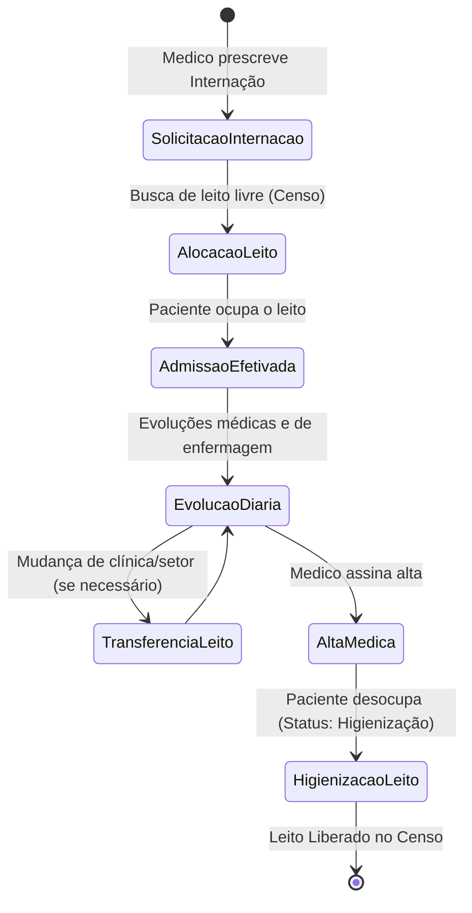
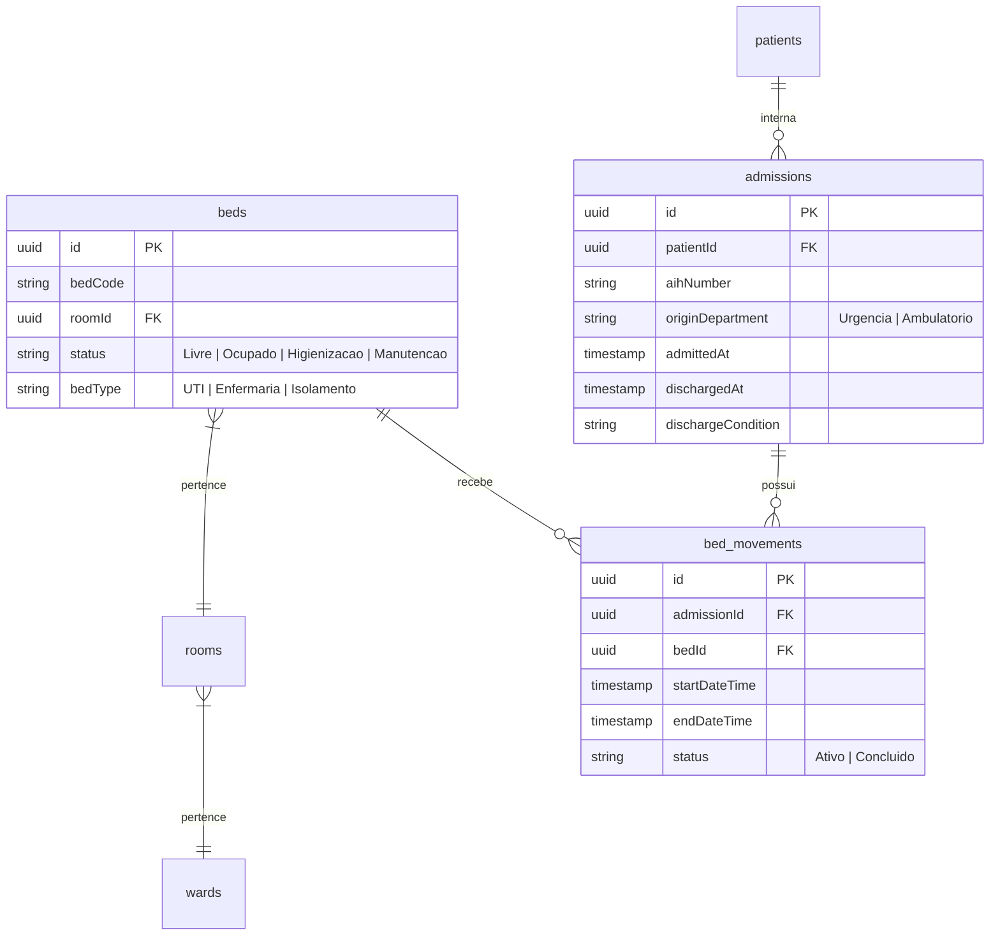

# Health Nexus — Módulo 06: Internações

Este documento detalha os requisitos e especificações para o módulo de **Internações** do Health Nexus.

---

## 1. Objetivo
Controlar o ciclo de internação do paciente: desde a autorização de AIH (Autorização de Internação Hospitalar) ou guia de convênio, alocação de leitos (Censo Hospitalar), transferências entre setores (ex: Enfermaria para UTI), prescrições de rotina de enfermagem, dietas, até a alta médica e fechamento da conta de internação.

---

## 2. Fluxo de Processo (Workflow)
O fluxo gerencia a admissão para um leito livre, transferências internas sob autorização médica, e o fluxo de desocupação e higienização pós-alta.



---

## 3. Regras de Negócio
1.  **Censo Hospitalar em Tempo Real**: O sistema deve manter uma visualização gráfica de mapa de leitos (Censo) atualizada em tempo real. O status de um leito pode ser: `Livre`, `Ocupado`, `Higienização`, `Manutenção`, ou `Reservado`.
2.  **Duplicidade de Ocupação**: Um paciente não pode estar alocado em mais de um leito simultaneamente.
3.  **Autorização prévia de AIH/Guia**: Para internações eletivas, o sistema exige a validação do número da AIH (SUS) ou Guia de Internação (Convênio) para autorizar a admissão física. Para internações de urgência, o sistema permite a alocação imediata e dá um prazo de 48 horas para regularização do documento.
4.  **Notificação de Higienização**: Ao registrar a alta do paciente, o status do leito é alterado automaticamente para `Higienização`, e uma notificação via WebSocket é enviada para o painel da equipe de limpeza.

---

## 4. Banco de Dados (Schema)
O banco controla leitos, alas, setores e a movimentação dos pacientes.



---

## 5. APIs

### `POST /api/admissions`
Registra a admissão hospitalar de um paciente e aloca o primeiro leito.
*   **Request Body**:
```json
{
  "patientId": "e1f1ad7e-bf91-4d1a-a53c-12b23a54b38d",
  "bedId": "d09b22cb-111a-4ab2-92cf-1298c9db8741",
  "aihNumber": "351234567890",
  "originDepartment": "Urgencia"
}
```
*   **Response (201 Created)**:
```json
{
  "admissionId": "1a8f9b2c-c7b1-4bb2-ad79-df99ac2f87ab",
  "status": "Internado"
}
```

### `POST /api/admissions/:id/transfer`
Transfere o paciente internado para um leito diferente.
*   **Request Body**:
```json
{
  "targetBedId": "87ca8a9e-f2c2-4cb1-8012-4fb32ad0c123"
}
```
*   **Response (200 OK)**:
```json
{
  "movementId": "a98f12cc-2f5e-8b4e-723d-e49ac0b892ab",
  "status": "Transferido"
}
```

---

## 6. Wireframe (Textual)
```
+----------------------------------------------------------------------------------+
|  [HEALTH NEXUS]  |  Internações > Censo Hospitalar (Mapa de Leitos)              |
+----------------------------------------------------------------------------------+
|  LEGENDA: [Livre (Verde)] [Ocupado (Vermelho)] [Higienização (Azul)] [Manut. (Cinza)] |
+----------------------------------------------------------------------------------+
|  +-- ALA A: CLINICA MÉDICA ----------------------------------------------------+ |
|  |  +--------------+  +--------------+  +--------------+  +--------------+     | |
|  |  | Quarto 101-A |  | Quarto 101-B |  | Quarto 102-A |  | Quarto 102-B |     | |
|  |  | [Ocupado]    |  | [Livre]      |  | [Higienização|  | [Manutenção] |     | |
|  |  | Paciente:    |  |              |  | Leito: L03   |  | Leito: L04   |     | |
|  |  | João Silva   |  |              |  |              |  |              |     | |
|  |  +--------------+  +--------------+  +--------------+  +--------------+     | |
|  +-----------------------------------------------------------------------------+ |
|                                                                                  |
|  [ Internar Paciente ]        [ Solicitações Pendentes: 4 ]      [ Relatório ]   |
+----------------------------------------------------------------------------------+
```

---

## 7. Casos de Uso

| ID | Caso de Uso | Ator Principal | Pré-condições | Fluxo Principal |
| :--- | :--- | :--- | :--- | :--- |
| **UC-0601** | Transferir Paciente de Leito | Médico / Enfermeiro Chefe | Paciente internado em leito ativo. Leito de destino livre. | 1. O usuário abre o mapa de leitos; 2. Seleciona o paciente internado; 3. Clica em "Transferir"; 4. Seleciona o novo leito disponível; 5. O sistema registra o fim da movimentação no leito anterior, inicia a movimentação no novo leito e altera o status do leito anterior para `Higienização`. |

---

## 8. Perfis e Permissões (RBAC)
*   **Enfermeiro / Médico**: Permissão para solicitar internação, admitir o paciente no leito, realizar transferências e assinar altas.
*   **Recepcionista**: Permissão para realizar o cadastro inicial da AIH/Guia de faturamento no ato da internação. Não realiza transferências clínicas.
*   **Equipe de Higienização**: Acesso ao painel de limpeza de leitos, com permissão exclusiva para alterar o status do leito de `Higienização` para `Livre` após a conclusão do serviço.

---

## 9. Dicionário de Campos

| Campo de Interface | Descrição | Tipo | Validação |
| :--- | :--- | :--- | :--- |
| `aihNumber` | Autorização de Internação Hospitalar | String | Opcional, 12 dígitos numéricos |
| `dischargeCondition`| Condição médica de saída | String | Enum: `Melhora`, `Obito`, `Transferencia`, `Evasao` |
| `bedType` | Tipo ou classificação do leito | String | Enum: `UTI`, `Enfermaria`, `Isolamento`, `Semi-Intensivo` |

---

## 10. Validações
*   **Validação de Leito Livre**: O backend deve verificar em uma transação com isolamento de banco de dados (`SELECT FOR UPDATE`) se o `bedId` de destino permanece com o status `Livre` no momento exato da atribuição do paciente, rejeitando a operação se houver concorrência concorrente.
*   **Alta Médica**: Não é permitido liberar o leito (`Discharged`) sem que a condição de alta (`dischargeCondition`) e o diagnóstico de encerramento estejam devidamente preenchidos.
