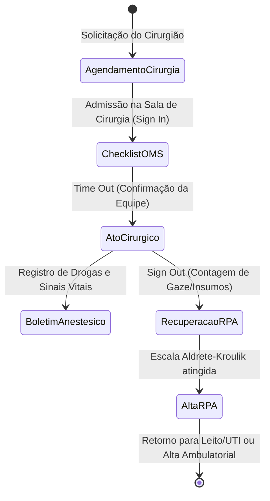
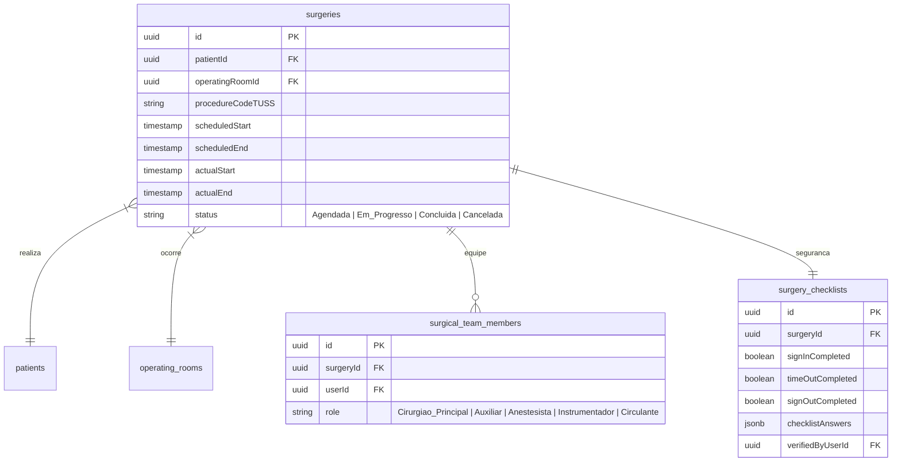

# Health Nexus — Módulo 07: Centro Cirúrgico

Este documento detalha os requisitos e especificações para o módulo de **Centro Cirúrgico** do Health Nexus.

---

## 1. Objetivo
Gerenciar o agendamento de cirurgias, alocação de salas cirúrgicas, controle de equipamentos e materiais esterilizados necessários (OPME), atribuição da equipe cirúrgica (Cirurgião, Anestesista, Instrumentador, Circulante), registro do Boletim Anestésico, Ficha Cirúrgica (Safety Checklist da OMS) e monitoramento de leitos na Recuperação Pós-Anestésica (RPA).

---

## 2. Fluxo de Processo (Workflow)
O fluxo cobre a solicitação da cirurgia, checagem pré-operatória de segurança, execução do ato cirúrgico com registro anestésico, e a transferência para a RPA ou UTI.



---

## 3. Regras de Negócio
1.  **Safety Checklist da OMS**: É obrigatório o preenchimento do checklist de segurança cirúrgica nas 3 etapas críticas: *Antes da indução anestésica (Sign In)*, *Antes da incisão cirúrgica (Time Out)* e *Antes do paciente deixar a sala (Sign Out)*.
2.  **Rastreabilidade de OPME**: Materiais Especiais (Órteses, Próteses e Materiais Especiais) devem ser vinculados ao prontuário do paciente com número de lote, número de registro da Anvisa e etiqueta de esterilização da CME (Central de Material e Esterilização).
3.  **Critérios de Alta da RPA**: O paciente só pode receber alta da RPA se atingir pontuação mínima de 8 a 10 na Escala de Aldrete-Kroulik (que avalia atividade respiratória, circulação, consciência, saturação e atividade motora).
4.  **Alocação Concorrente**: O sistema deve alertar caso o cirurgião principal ou o anestesista sejam agendados para cirurgias em salas diferentes em horários sobrepostos.

---

## 4. Banco de Dados (Schema)
O banco rastreia cirurgias, equipes, salas e checklists.



---

## 5. APIs

### `POST /api/surgeries`
Agenda um procedimento cirúrgico.
*   **Request Body**:
```json
{
  "patientId": "e1f1ad7e-bf91-4d1a-a53c-12b23a54b38d",
  "operatingRoomId": "c88d8b12-921c-4b5b-ad7d-df99ac2f482d",
  "procedureCodeTUSS": "30101014",
  "scheduledStart": "2026-07-22T08:00:00Z",
  "scheduledEnd": "2026-07-22T12:00:00Z",
  "team": [
    {"userId": "65b8221c-a111-472e-834c-1200df12ab87", "role": "Cirurgiao_Principal"},
    {"userId": "098d8c22-b9e1-4c12-a1f9-8ff78b9012cd", "role": "Anestesista"}
  ]
}
```
*   **Response (201 Created)**:
```json
{
  "surgeryId": "b1b77ff3-ad40-42cb-b1b7-7ff3ad40e21a",
  "status": "Agendada"
}
```

### `PUT /api/surgeries/:id/checklist`
Salva as respostas do Checklist da OMS.
*   **Request Body**:
```json
{
  "step": "TimeOut",
  "answers": {
    "patientIdentityConfirmed": true,
    "surgicalSiteMarked": true,
    "pulseOximeterFunctioning": true,
    "antibioticProphylaxisGiven": "N/A"
  }
}
```
*   **Response (200 OK)**:
```json
{
  "surgeryId": "b1b77ff3-ad40-42cb-b1b7-7ff3ad40e21a",
  "timeOutCompleted": true
}
```

---

## 6. Wireframe (Textual)
```
+----------------------------------------------------------------------------------+
|  [HEALTH NEXUS]  |  Centro Cirúrgico > Checklist OMS (Time Out)                  |
+----------------------------------------------------------------------------------+
|  CIRURGIA ID: #2045  | Paciente: Maria de Souza | Procedimento: Colecistectomia  |
+----------------------------------------------------------------------------------+
|  [Fase 1: Sign In (Ok)]  ===>  [* Fase 2: Time Out *]  ===>  [Fase 3: Sign Out]  |
+----------------------------------------------------------------------------------+
|  [X] Todos os membros da equipe se apresentaram por nome e função?               |
|  [X] Confirmação verbal da identidade do paciente, sítio cirúrgico e procedimento? |
|  [X] Os antibióticos profiláticos foram administrados nos últimos 60 minutos?    |
|      ( ) Sim  ( ) Não  (X) Não se aplica                                         |
|  [ ] Previsão de eventos críticos (Perda de sangue, tempo previsto, via aérea)? |
|                                                                                  |
|  [ Cancelar ]                                                    [ Confirmar ]   |
+----------------------------------------------------------------------------------+
```

---

## 7. Casos de Uso

| ID | Caso de Uso | Ator Principal | Pré-condições | Fluxo Principal |
| :--- | :--- | :--- | :--- | :--- |
| **UC-0701** | Registrar Boletim Anestésico | Anestesista | Cirurgia em andamento (`status = Em_Progresso`). | 1. O Anestesista acessa o painel da cirurgia; 2. Abre a ficha de anestesia; 3. Insere a técnica de anestesia (Geral, Raquidiana, etc.) e registra os tempos de indução; 4. Adiciona os medicamentos e gases administrados; 5. Monitora e salva os sinais vitais a cada 5 minutos. |

---

## 8. Perfis e Permissões (RBAC)
*   **Cirurgião**: Permissão de leitura e escrita nos dados do agendamento, descrição cirúrgica e prescrição pós-operatória.
*   **Anestesista**: Permissão exclusiva de escrita para o Boletim Anestésico e avaliação pré e pós-anestésica.
*   **Enfermeiro de Centro Cirúrgico**: Permissão de preenchimento do Checklist da OMS (Sign In / Out), consumo de materiais e registro de intercorrências de sala.
*   **Faturamento**: Acesso para leitura da folha de sala e contagem de órteses/próteses (OPME) usadas para cobrar o convênio correspondente.

---

## 9. Dicionário de Campos

| Campo de Interface | Descrição | Tipo | Validação |
| :--- | :--- | :--- | :--- |
| `procedureCodeTUSS`| Código do procedimento médico | String | Deve constar na tabela TUSS (8 caracteres) |
| `role` | Função do profissional na equipe | String | Enum: `Cirurgiao_Principal`, `Auxiliar`, `Anestesista`, etc. |
| `aldreteScore` | Pontuação de Aldrete-Kroulik (RPA)| Inteiro | Faixa permitida: 0 a 10 |

---

## 10. Validações
*   **Esterilização de Insumos**: Não é permitido fechar a contagem do checklist cirúrgico (`Sign Out`) se existirem campos de código de autoclave vazios para qualquer material cirúrgico consignado inserido na sala.
*   **Idade Gestacional / Jejum**: Para procedimentos pediátricos e cirurgias com anestesia geral, o campo `hoursFasting` (tempo de jejum) deve ser validado para garantir o limite mínimo clínico (ex: mínimo 8 horas para sólidos).
