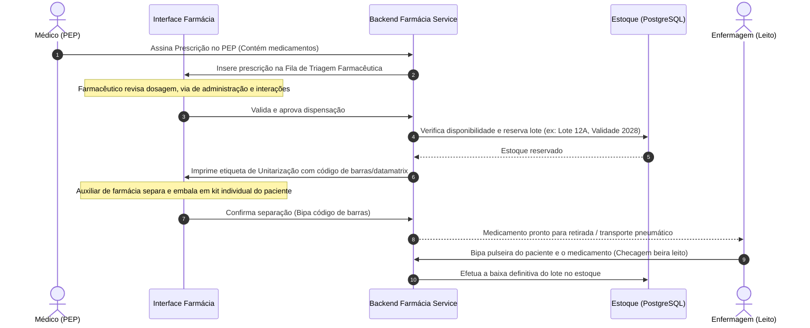
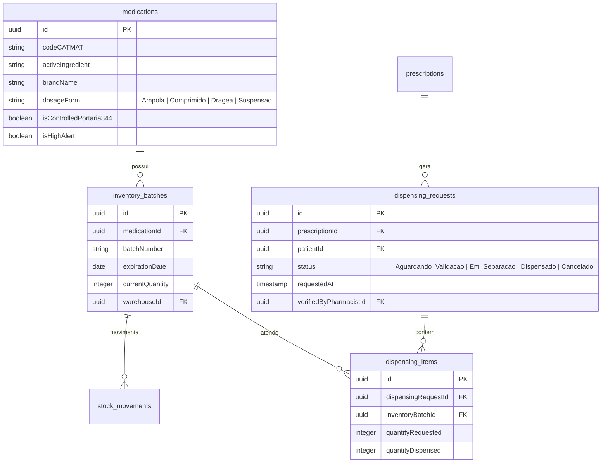

# Health Nexus — Módulo 08: Farmácia

Este documento detalha os requisitos e especificações para o módulo de **Farmácia** do Health Nexus.

---

## 1. Objetivo
Gerenciar a farmácia hospitalar central e suas subfarmácias satélites (ex: farmácia da UTI, do Centro Cirúrgico, da UPA), controlando a triagem de receitas/prescrições médicas, a dispensação individualizada ou por dose unitária, o fracionamento de ampolas e comprimidos, a rastreabilidade por lote e data de validade, e o inventário de psicotrópicos e controlados (Portaria 344/98 da Anvisa).

---

## 2. Fluxo de Processo (Workflow)
O fluxo envolve a chegada da prescrição eletrônica assinada, validação clínica pelo farmacêutico, unitarização (se necessária), separação do lote correspondente, checagem e dispensação à equipe de enfermagem.



---

## 3. Regras de Negócio
1.  **Validação Farmacêutica Obrigatória**: Medicamentos classificados como de *Alta Vigilância* (ex: Quimioterápicos, Insulina, Anticoagulantes, Opiáceos) ou psicotrópicos exigem a validação expressa e assinatura digital de um Farmacêutico no sistema antes de serem liberados para separação física.
2.  **Rastreabilidade Total por Lote**: Nenhuma movimentação de saída de medicamento pode ocorrer sem a identificação do número do lote (`batchNumber`) e data de validade correspondente.
3.  **Regra de Inventário FEFO (First Expired, First Out)**: O sistema deve sugerir automaticamente a saída dos lotes com data de validade mais próxima do vencimento para evitar perdas financeiras.
4.  **Alerta de Estoque Mínimo**: Ao atingir o nível crítico de segurança configurado para o item, o sistema deve disparar um alerta interno no módulo de Compras/Estoque.

---

## 4. Banco de Dados (Schema)
O banco gerencia medicamentos, lotes, estoques físicos e solicitações de dispensação.



---

## 5. APIs

### `POST /api/dispensing`
Cria uma solicitação de dispensação baseada em prescrição.
*   **Request Body**:
```json
{
  "prescriptionId": "78da8a9e-f2c2-4cb1-8012-4fb32ad0c98f",
  "patientId": "e1f1ad7e-bf91-4d1a-a53c-12b23a54b38d",
  "items": [
    {"medicationId": "f0da8c9e-52f1-4db3-9823-1acb29ad89ef", "quantityRequested": 2}
  ]
}
```
*   **Response (201 Created)**:
```json
{
  "dispensingRequestId": "c88d8b12-921c-4b5b-ad7d-df99ac2f482d",
  "status": "Aguardando_Validacao"
}
```

### `PUT /api/dispensing/:id/verify`
Farmacêutico assina digitalmente a validação da prescrição.
*   **Request Body**:
```json
{
  "pharmacistPassword": "senha_farmaceutico_123",
  "status": "Em_Separacao"
}
```
*   **Response (200 OK)**:
```json
{
  "dispensingRequestId": "c88d8b12-921c-4b5b-ad7d-df99ac2f482d",
  "status": "Em_Separacao",
  "verifiedAt": "2026-07-18T14:38:00Z"
}
```

---

## 6. Wireframe (Textual)
```
+----------------------------------------------------------------------------------+
|  [HEALTH NEXUS]  |  Farmácia > Fila de Dispensação                               |
+----------------------------------------------------------------------------------+
|  FILTRAR: [X] Aguardando Validação  [ ] Em Separação  [ ] Dispensados             |
+----------------------------------------------------------------------------------+
|  Prescrição #4892  | Paciente: Maria de Souza | Leito: UTI-02  | Médico: Dr. João|
+----------------------------------------------------------------------------------+
|  Medicamento              Qtd.  Lote Disponível  Validade    Alerta              |
|  [ ] Dipirona Ampola 1g   2     LT1820           12/2028     -                   |
|  [ ] Midazolam Ampola 5mg 5     LT0912           05/2027     [ Psicotrópico ]    |
|  [ ] Insulina NPH 100UI   1     LT2011           09/2026     [ Alta Vigilância ] |
|                                                                                  |
|  [ Rejeitar Prescrição ]                                [ Validar e Separar ]   |
+----------------------------------------------------------------------------------+
```

---

## 7. Casos de Uso

| ID | Caso de Uso | Ator Principal | Pré-condições | Fluxo Principal |
| :--- | :--- | :--- | :--- | :--- |
| **UC-0801** | Dispensar Psicotrópico (Portaria 344/98) | Farmacêutico | Prescrição ativa contendo medicamento controlado. | 1. O Farmacêutico abre a solicitação de dispensação; 2. Insere a senha para assinar eletronicamente a validação; 3. O sistema gera a etiqueta de unitarização com lote/validade; 4. Registra no livro digital da Anvisa a baixa com dados do paciente/médico. |

---

## 8. Perfis e Permissões (RBAC)
*   **Farmacêutico**: Acesso total para triagem, validação clínica de prescrições, inventário e balanços de controlados.
*   **Auxiliar de Farmácia**: Permissão para visualizar fila de separação, bipar lotes de medicamentos para separar kits e emitir etiquetas. Não possui permissão para validar clinicamente ou liberar medicamentos controlados sem assinatura do farmacêutico responsável.
*   **Administrativo**: Acesso para visualização de relatórios de consumo, perdas e auditoria de compras.

---

## 9. Dicionário de Campos

| Campo de Interface | Descrição | Tipo | Validação |
| :--- | :--- | :--- | :--- |
| `codeCATMAT` | Código federal do medicamento | String | Cadastro federal SIASG/CATMAT (6 a 9 dígitos) |
| `batchNumber` | Número do lote de fabricação | String | Alfanumérico, máximo 20 caracteres |
| `expirationDate` | Data de vencimento do lote | Date | Deve ser posterior à data atual |

---

## 10. Validações
*   **Bloqueio de Lote Vencido**: O backend deve bloquear qualquer tentativa de dispensação de um lote cuja `expirationDate` seja menor ou igual à data corrente (`currentDate`), retornando HTTP 422 Unprocessable Entity.
*   **Duplo Fator de Validação**: Medicamentos de Alta Vigilância (`isHighAlert = true`) exigem que o sistema solicite a confirmação dupla na tela (dupla checagem eletrônica).
