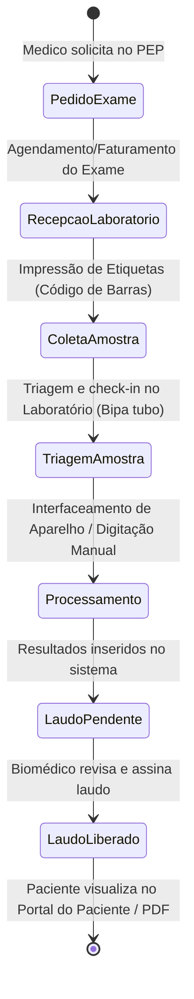
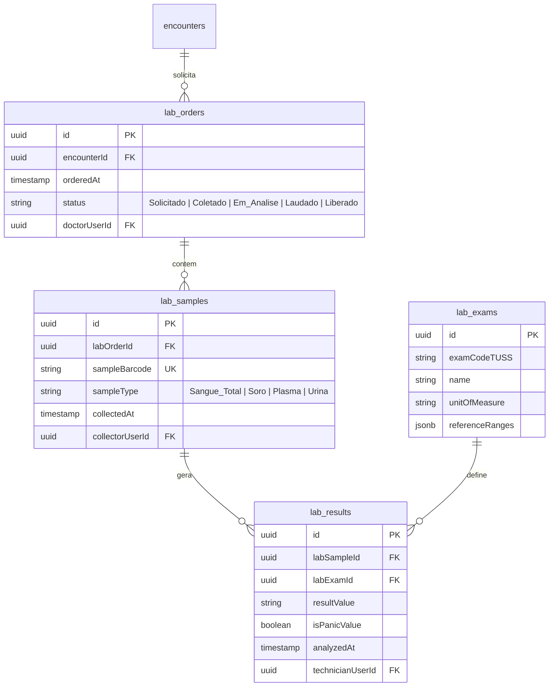

# Health Nexus — Módulo 09: Laboratório

Este documento detalha os requisitos e especificações para o módulo de **Laboratório** (LIS - Laboratory Information System) do Health Nexus.

---

## 1. Objetivo
Gerenciar o fluxo de análises clínicas da instituição: recebimento de pedidos de exames laboratoriais (Sangue, Urina, Liquor, etc.), triagem de amostras, geração de etiquetas de código de barras para tubos, registro de coleta, interfaceamento com equipamentos analisadores automatizados, digitação de resultados (valores de referência), validação biomédica/médica dos laudos e entrega do resultado impresso ou via portal web.

---

## 2. Fluxo de Processo (Workflow)
O fluxo gerencia desde o pedido médico no PEP até a coleta da amostra, processamento da máquina, validação técnica do laudo e liberação.



---

## 3. Regras de Negócio
1.  **Garantia de Identidade (Etiqueta Única)**: Cada amostra/tubo deve carregar uma etiqueta adesiva contendo um código de barras exclusivo gerado no ato da coleta, trazendo: Nome do Paciente, Registro Hospitalar, Data da Coleta, Tipo de Tubo e Exame Solicitado.
2.  **Valores de Referência Dinâmicos**: Os valores de referência para os exames (ex: Hemograma, Creatinina, Colesterol) devem ser definidos no banco de dados com base na idade (faixa etária) e gênero biológico do paciente.
3.  **Alertas de Valores de Pânico**: Caso o resultado digitado ou recebido do aparelho esteja em nível crítico de pânico (ex: Potássio < 2.5 mEq/L ou > 6.0 mEq/L), o sistema deve emitir um alerta visual piscante na tela do validador e enviar imediatamente uma notificação prioritária (via WebSocket) para o prontuário do paciente (PEP) e para o enfermeiro do setor.
4.  **Interfaceamento**: O módulo deve possuir suporte a protocolos padrão ASTM ou HL7 para ler os dados de saída diretamente dos equipamentos laboratoriais automáticos de hematologia e bioquímica, evitando erros humanos de digitação.

---

## 4. Banco de Dados (Schema)
O banco controla exames, amostras, resultados e assinaturas técnicas.



---

## 5. APIs

### `POST /api/lab-orders`
Cria um pedido de exames laboratoriais.
*   **Request Body**:
```json
{
  "encounterId": "f98c8c22-d7b1-42cb-b1b7-7ff3ad40e21a",
  "exams": [
    {"labExamId": "1a111a11-1a1a-1a1a-1a1a-1a111a111a11"},
    {"labExamId": "2b222b22-2b2b-2b2b-2b2b-2b222b222b22"}
  ]
}
```
*   **Response (201 Created)**:
```json
{
  "labOrderId": "3c333c33-3c3c-3c3c-3c3c-3c333c333c33",
  "status": "Solicitado"
}
```

### `POST /api/lab-orders/:id/collect`
Registra a coleta de amostras físicas de um pedido.
*   **Request Body**:
```json
{
  "samples": [
    {
      "sampleType": "Sangue_Total",
      "sampleBarcode": "202607180001"
    }
  ]
}
```
*   **Response (200 OK)**:
```json
{
  "status": "Coletado",
  "collectedAt": "2026-07-18T14:38:00Z"
}
```

---

## 6. Wireframe (Textual)
```
+----------------------------------------------------------------------------------+
|  [HEALTH NEXUS]  |  Laboratório > Digitação de Resultados                        |
+----------------------------------------------------------------------------------+
|  Amostra: #202607180001 | Paciente: Maria de Souza | Exame: Hemograma Completo   |
+----------------------------------------------------------------------------------+
|  Parâmetro             Resultado     Unidade      Referência         Alerta      |
|  Eritrócitos           [ 4.5     ]   M/uL         4.0 - 5.2          -           |
|  Hemoglobina           [ 12.1    ]   g/dL         12.0 - 16.0        -           |
|  Plaquetas             [ 45.000  ]   mil/uL       150.000-450.000    [ Pânico! ] |
|  Leucócitos            [ 7.200   ]   /uL          4.000 - 11.000     -           |
|                                                                                  |
|  [ Cancelar ]           [ Marcar como Pânico ]                 [ Assinar Laudo ] |
+----------------------------------------------------------------------------------+
```

---

## 7. Casos de Uso

| ID | Caso de Uso | Ator Principal | Pré-condições | Fluxo Principal |
| :--- | :--- | :--- | :--- | :--- |
| **UC-0901** | Liberar Laudo de Exames | Biomédico / Médico Patologista | Exame coletado e resultados processados. | 1. O Biomédico abre a fila de laudos pendentes; 2. Confere os valores digitados/importados; 3. Insere a senha de assinatura do conselho profissional (CRBM/CRM); 4. O sistema gera a chave de autenticidade no rodapé do laudo, altera o status para `Liberado` e envia o PDF para o prontuário. |

---

## 8. Perfis e Permissões (RBAC)
*   **Biomédico / Farmacêutico Analista / Patologista**: Acesso total para digitação, alteração e validação técnica de exames (assinatura de laudos).
*   **Técnico de Coleta**: Permissão exclusiva de leitura de pedidos e gravação de registros de coleta/amostras físicas (`POST /api/lab-orders/:id/collect`). Não realiza validação de laudos.
*   **Médico Assistente (Solicitante)**: Permissão de leitura dos laudos prontos no prontuário do paciente (PEP).

---

## 9. Dicionário de Campos

| Campo de Interface | Descrição | Tipo | Validação |
| :--- | :--- | :--- | :--- |
| `sampleBarcode` | Código único impresso no tubo/frasco | String | Formato numérico de 12 dígitos, único global |
| `resultValue` | Valor quantitativo ou qualitativo | String | Máximo 200 caracteres (pode conter texto ou números) |
| `isPanicValue` | Flag indicando valor de pânico clínico | Boolean | Padrão `false` |

---

## 10. Validações
*   **Validação de Coleta**: Não é permitido liberar o processamento do laudo se a amostra correspondente não tiver a data e hora de coleta registrada (`collectedAt` preenchido).
*   **Double Check de Pânico**: Caso um valor de pânico seja inserido, o sistema exige uma confirmação do operador (pop-up confirmando a revisão do valor) para evitar falsos alarmes por erro de digitação.
