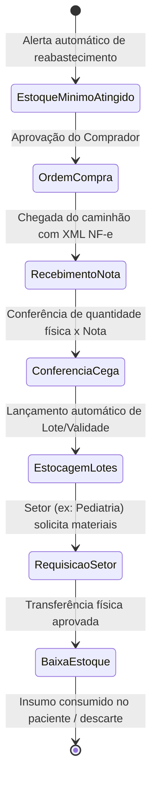
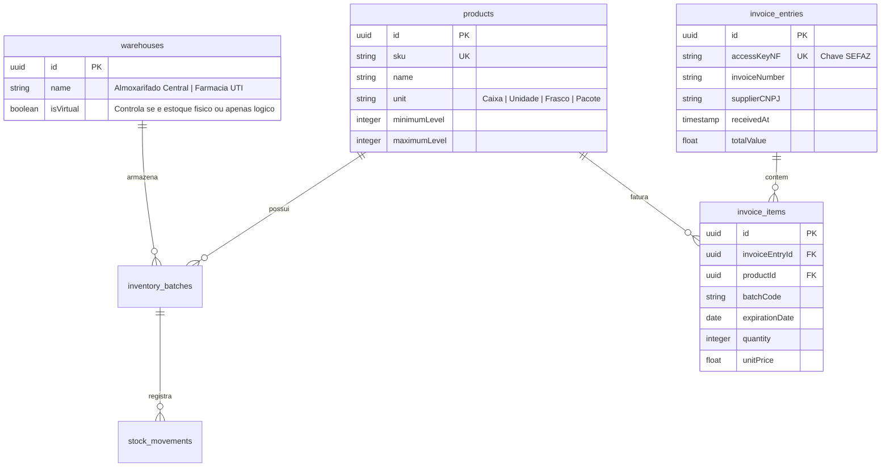

# Health Nexus — Módulo 10: Estoque

Este documento detalha os requisitos e especificações para o módulo de **Estoque** (Almoxarifado e Suprimentos) do Health Nexus.

---

## 1. Objetivo
Controlar o fluxo físico e financeiro de insumos hospitalares (medicamentos, descartáveis, órteses/próteses, fios cirúrgicos, gases medicinais, produtos de escritório e higiene) desde a ordem de compra, entrada de mercadorias via nota fiscal (XML da SEFAZ), armazenamento nos almoxarifados, transferências internas, inventários rotativos e auditoria de validade de lotes.

---

## 2. Fluxo de Processo (Workflow)
O fluxo padrão engloba a requisição de compras por estoque mínimo, cotação com fornecedores, entrada por importação de XML de Nota Fiscal (SEFAZ), estocagem e distribuição interna.



---

## 3. Regras de Negócio
1.  **Conferência Cega**: No ato do recebimento físico das mercadorias, o auxiliar de almoxarifado realiza a contagem sem visualizar a quantidade faturada no XML (conferência cega). O sistema só autoriza a entrada definitiva no estoque se a contagem física coincidir com o XML da Nota Fiscal (dentro de margens de tolerância configuráveis).
2.  **Rastreabilidade CME**: Materiais que necessitam de reprocessamento (esterilização) devem ser rastreados com histórico de ciclos de autoclave no CME antes de retornarem ao estoque cirúrgico ativo.
3.  **Bloqueio de Validade Próxima**: O sistema deve bloquear saídas ou transferências de itens com vencimento inferior a 30 dias para uso rotineiro, direcionando esses itens para destinação prioritária ou devolução de lote ao fornecedor.
4.  **Custo Médio Ponderado**: O valor contábil do estoque de cada insumo deve ser recalculado automaticamente a cada nova entrada de nota fiscal usando o método de Custo Médio Ponderado.

---

## 4. Banco de Dados (Schema)
O banco gerencia almoxarifados, produtos, entradas de notas fiscais, lotes e transferências.



---

## 5. APIs

### `POST /api/inventory/invoices`
Registra a entrada de nota fiscal eletrônica via importação do XML.
*   **Request Body (JSON estruturado a partir da leitura do XML)**:
```json
{
  "accessKeyNF": "35260712345678901234567890123456789012345678",
  "invoiceNumber": "10984",
  "supplierCNPJ": "12345678000199",
  "totalValue": 15400.00,
  "items": [
    {
      "sku": "MED-DIP-500",
      "batchCode": "B2044",
      "expirationDate": "2029-01-30",
      "quantity": 1000,
      "unitPrice": 15.40
    }
  ]
}
```
*   **Response (201 Created)**:
```json
{
  "invoiceEntryId": "9b2c12ab-f7b1-4bb2-ad79-df99ac2f8722",
  "status": "Aguardando_Conferencia"
}
```

### `POST /api/inventory/transfer`
Efetua transferência de insumos entre almoxarifados.
*   **Request Body**:
```json
{
  "sourceWarehouseId": "111a111a-1a1a-1a1a-1a1a-111111111111",
  "targetWarehouseId": "222b222b-2b2b-2b2b-2b2b-222222222222",
  "inventoryBatchId": "333c333c-3c3c-3c3c-3c3c-333333333333",
  "quantity": 50
}
```
*   **Response (200 OK)**:
```json
{
  "transferId": "444d444d-4d4d-4d4d-4d4d-444444444444",
  "status": "Concluida"
}
```

---

## 6. Wireframe (Textual)
```
+----------------------------------------------------------------------------------+
|  [HEALTH NEXUS]  |  Estoque > Nova Requisição de Transferência                   |
+----------------------------------------------------------------------------------+
|  Origem: [ Almoxarifado Central ]     Destino: [ Farmácia Centro Cirúrgico ]     |
+----------------------------------------------------------------------------------+
|  Buscar Produto: [ Seringa 10ml                                            ]    |
|                                                                                  |
|  Lotes Disponíveis na Origem:                                                    |
|  [X] LT-0982 (Validade: 10/2028) - Qtd Disponível: 450 un.                       |
|  [ ] LT-0421 (Validade: 04/2027) - Qtd Disponível: 120 un.                       |
|                                                                                  |
|  Quantidade a Transferir: [ 100        ]                                         |
|                                                                                  |
|  Motivo da Transferência:                                                        |
|  [ Reposição de estoque semanal para cirurgias eletivas.                       ] |
|                                                                                  |
|  [ Cancelar ]                                               [ Confirmar Envio ]  |
+----------------------------------------------------------------------------------+
```

---

## 7. Casos de Uso

| ID | Caso de Uso | Ator Principal | Pré-condições | Fluxo Principal |
| :--- | :--- | :--- | :--- | :--- |
| **UC-1001** | Realizar Conferência Cega | Auxiliar de Almoxarifado | Nota Fiscal importada no sistema (`status = Aguardando_Conferencia`). | 1. O Auxiliar abre a conferência de entrada da nota; 2. Bipa os códigos dos produtos recebidos e digita a quantidade contada fisicamente; 3. O sistema compara as informações com a Nota Fiscal; 4. Coincidindo os dados, gera a entrada dos lotes no sistema e altera o status para `Concluido`. |

---

## 8. Perfis e Permissões (RBAC)
*   **Comprador / Gestor de Suprimentos**: Permissão para criar ordens de compra, homologar fornecedores e gerenciar parâmetros de níveis mínimos de estoque.
*   **Auxiliar de Almoxarifado**: Permissão para registrar conferências, bipar entradas/saídas físicas e realizar inventários. Não autoriza ordens de compra de alto valor.
*   **Enfermeiro de Setor**: Permissão de leitura e solicitação de requisição interna de materiais para sua respectiva ala.

---

## 9. Dicionário de Campos

| Campo de Interface | Descrição | Tipo | Validação |
| :--- | :--- | :--- | :--- |
| `accessKeyNF` | Chave de 44 dígitos da Nota Fiscal | String | Formato numérico estrito de 44 caracteres |
| `minimumLevel` | Quantidade mínima de segurança | Inteiro | Não pode ser negativo |
| `quantity` | Quantidade movimentada | Inteiro | Deve ser maior que zero |

---

## 10. Validações
*   **Estoque Insuficiente**: O backend deve rejeitar qualquer tentativa de saída ou transferência onde a quantidade solicitada (`quantity`) seja maior do que a quantidade física disponível em estoque no lote selecionado (`currentQuantity`), retornando HTTP 422 Unprocessable Entity.
*   **CNPJ Fornecedor**: O CNPJ do emissor da Nota Fiscal deve ser validado pelo algoritmo de módulo 11 para garantir a integridade dos dados fiscais do fornecedor.
