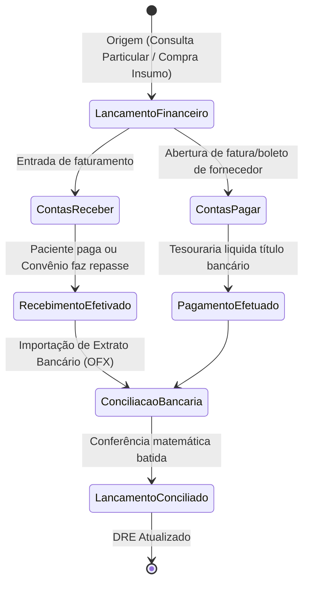
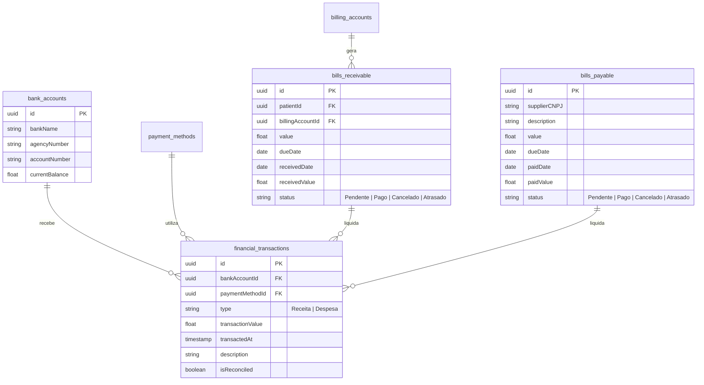

# Health Nexus — Módulo 11: Financeiro

Este documento detalha os requisitos e especificações para o módulo **Financeiro** do Health Nexus.

---

## 1. Objetivo
Controlar a saúde financeira da instituição de saúde: contas a pagar, contas a receber (particulares, cartões de crédito/débito, boletos, repasses de convênios), fluxo de caixa real e projetado, conciliação bancária de extratos OFX, e geração de relatórios de demonstrativo de resultados de exercício (DRE).

---

## 2. Fluxo de Processo (Workflow)
O fluxo padrão gerencia contas a receber originadas do faturamento de consultas ou altas hospitalares, o contas a pagar gerado por compras de suprimentos, e a conciliação final com a conta bancária.



---

## 3. Regras de Negócio
1.  **Transações Criptografadas**: Todas as transações financeiras devem conter hashes de integridade no banco de dados para evitar inserções diretas maliciosas por fora da aplicação.
2.  **Fluxo de Caixa Projetado**: O DRE e fluxo de caixa devem separar lançamentos "Previstos" (compromissos futuros) de lançamentos "Realizados" (títulos liquidados).
3.  **Conciliação OFX Automática**: O sistema deve efetuar conciliação prévia automática de extratos em formato OFX, identificando lançamentos correspondentes por valor exato e data aproximada (janela de ±3 dias), solicitando intervenção manual apenas em caso de divergência ou múltiplos correspondentes.
4.  **Integração de PIX Dinâmico**: O sistema na recepção deve ser capaz de gerar QR Codes de PIX dinâmicos (via API do banco) contendo o valor exato da consulta, monitorando a confirmação do pagamento em tempo real via Webhooks bancários para liberação imediata do atendimento.

---

## 4. Banco de Dados (Schema)
O banco controla contas, títulos a pagar/receber, transações e formas de pagamento.



---

## 5. APIs

### `POST /api/financial/receivables`
Cria um título a receber.
*   **Request Body**:
```json
{
  "patientId": "e1f1ad7e-bf91-4d1a-a53c-12b23a54b38d",
  "billingAccountId": "9b2c12ab-f7b1-4bb2-ad79-df99ac2f8722",
  "value": 250.00,
  "dueDate": "2026-07-25"
}
```
*   **Response (201 Created)**:
```json
{
  "billReceivableId": "c88d8b12-921c-4b5b-ad7d-df99ac2f482d",
  "status": "Pendente"
}
```

### `POST /api/financial/pix/generate`
Gera QR Code dinâmico para recebimento imediato via PIX.
*   **Request Body**:
```json
{
  "billReceivableId": "c88d8b12-921c-4b5b-ad7d-df99ac2f482d",
  "amount": 250.00
}
```
*   **Response (200 OK)**:
```json
{
  "qrCodeString": "00020101021226870014br.gov.bcb.pix...",
  "qrCodeImageUrl": "https://storage.healthnexus.com/pix/qrcode_12984.png",
  "paymentToken": "tok_pix_87d9a12bc239"
}
```

---

## 6. Wireframe (Textual)
```
+----------------------------------------------------------------------------------+
|  [HEALTH NEXUS]  |  Financeiro > Baixa de Contas a Receber                       |
+----------------------------------------------------------------------------------+
|  BUSCAR PACIENTE: [ Maria de Souza Silva                                  ]      |
+----------------------------------------------------------------------------------+
|  Títulos Pendentes:                                                              |
|  ID     Vencimento    Descrição               Valor      Ações                   |
|  #1082  25/07/2026    Consulta Ambulatorial   R$ 250,00  [ Baixar ] [ Gerar Pix ]|
|  #1154  10/08/2026    Exame Radiologia        R$ 450,00  [ Baixar ] [ Cancelar ] |
|                                                                                  |
|  +-- Registrar Liquidação Manual ----------------------------------------------+ |
|  |  *Data do Recebimento: [ 18/07/2026 ]  *Conta Destino: [ Itaú C/C principal ]|
|  |  *Valor Recebido:      [ R$ 250,00  ]  *Forma de Pgto:  [ Cartão Débito     ]|
|  +-----------------------------------------------------------------------------+ |
|                                                                                  |
|  [ Voltar ]                                                    [ Confirmar Baixa ]|
+----------------------------------------------------------------------------------+
```

---

## 7. Casos de Uso

| ID | Caso de Uso | Ator Principal | Pré-condições | Fluxo Principal |
| :--- | :--- | :--- | :--- | :--- |
| **UC-1101** | Efetuar Conciliação Bancária | Analista Financeiro | Arquivo OFX do banco gerado. Lançamentos pendentes de conciliação no sistema. | 1. O Analista faz o upload do arquivo OFX; 2. O sistema lê as transações bancárias e busca correspondência no Contas a Pagar/Receber; 3. Exibe lançamentos casados; 4. O Analista revisa e clica em "Conciliar"; 5. O sistema atualiza `isReconciled = true` e altera o saldo real da conta. |

---

## 8. Perfis e Permissões (RBAC)
*   **Diretor Financeiro / Controller**: Permissão de leitura/escrita para todas as áreas, incluindo alteração de contas bancárias da empresa, DRE, plano de contas e conciliações de alto valor.
*   **Operador de Caixa / Recepcionista**: Permissão para gerar recebimentos, registrar PIX/Cartão e baixar consultas no ato. Não possui permissão para contas a pagar, DRE ou extratos OFX.
*   **Faturamento**: Permissão de leitura de títulos a receber gerados por convênios.

---

## 9. Dicionário de Campos

| Campo de Interface | Descrição | Tipo | Validação |
| :--- | :--- | :--- | :--- |
| `dueDate` | Data máxima para pagamento do título | Date | Deve ser igual ou maior que a data de criação |
| `transactionValue` | Valor monetário do movimento | Decimal | Deve ser maior que zero |
| `type` | Tipo de movimentação financeira | String | Enum: `Receita`, `Despesa` |

---

## 10. Validações
*   **Estorno de Título**: Não é permitido estornar/cancelar um lançamento financeiro conciliado (`isReconciled = true`) sem que o usuário tenha o perfil de `Diretor Financeiro` e justifique a ação em campo auditado.
*   **Transações de Caixa**: O operador não pode fechar o caixa diário se houver diferença matemática entre os recebimentos em dinheiro registrados no sistema e o valor físico de fechamento.
