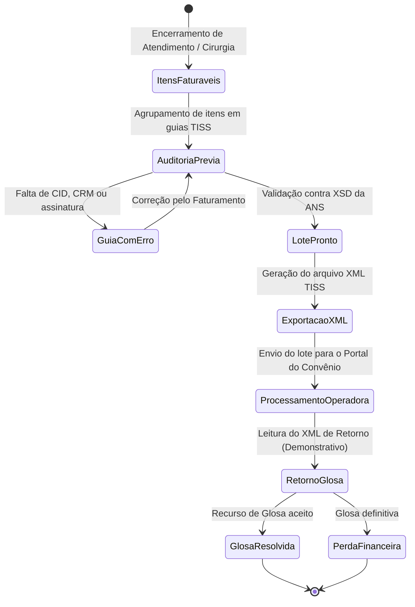
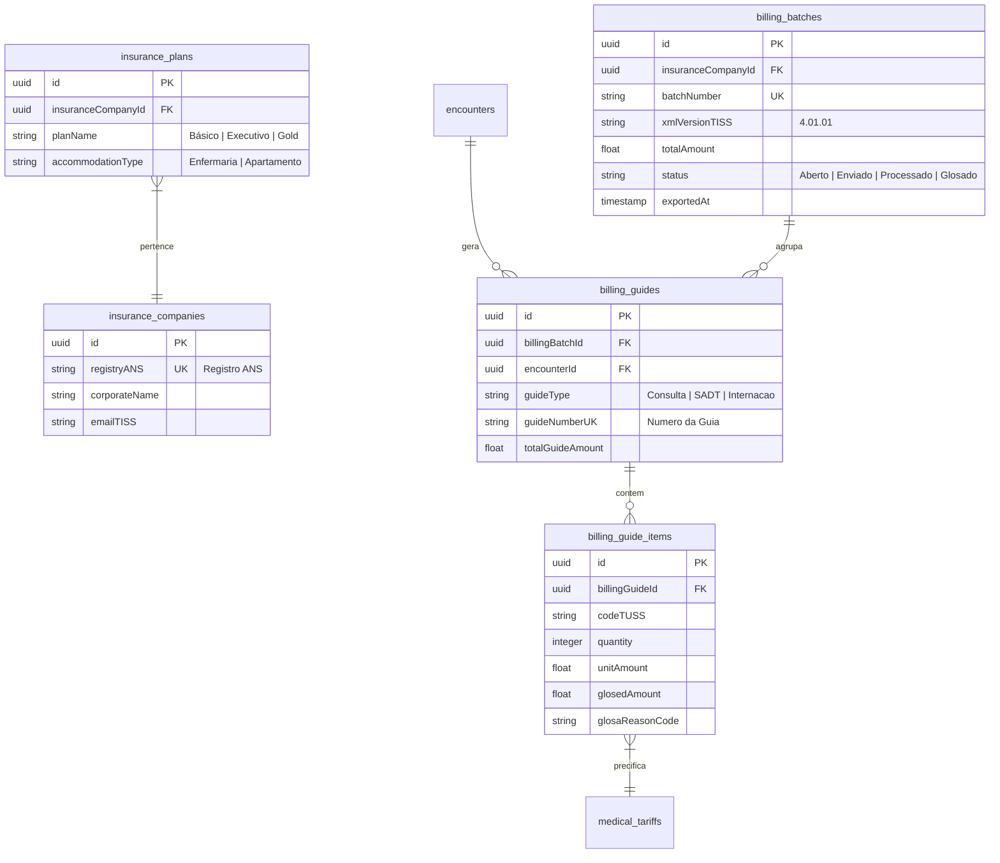

# Health Nexus — Módulo 12: Convênios

Este documento detalha os requisitos e especificações para o módulo de **Convênios** (Faturamento de Saúde Suplementar - ANS) do Health Nexus.

---

## 1. Objetivo
Gerenciar o faturamento de atendimentos médicos e hospitalares vinculados a operadoras de planos de saúde suplementar privados, cobrindo a parametrização de tabelas contratuais (TUSS, AMB, CBHPM), geração de guias padrão TISS (Consultas, SP/SADT, Resumo de Internação), geração de lotes eletrônicos em formato XML TISS, validação de esquemas XML contra os XSDs oficiais da ANS e o controle de glosas de pagamentos.

---

## 2. Fluxo de Processo (Workflow)
O fluxo padrão engloba a captura de itens faturáveis dos atendimentos (consultas, materiais, medicamentos), auditoria interna de erros nas guias, exportação do lote XML, envio à operadora e processamento do arquivo de retorno para identificar glosas.



---

## 3. Regras de Negócio
1.  **Padrão TISS Obrigatório**: Toda a comunicação eletrônica com as operadoras de planos de saúde deve respeitar rigidamente a versão ativa do Padrão TISS (Troca de Informação de Saúde Suplementar) da ANS.
2.  **Tabelas TUSS**: O sistema deve parametrizar os códigos de procedimentos, exames, taxas, diárias e materiais com base na Terminologia Unificada da Saúde Suplementar (TUSS).
3.  **Validação Prévia do XML (XSD)**: Antes de autorizar o download de qualquer lote de guias, o backend do Health Nexus deve rodar uma validação sintática do XML contra os arquivos XSD correspondentes à versão TISS utilizada pelo convênio, bloqueando o envio em caso de erros de tags.
4.  **Gestão de Glosas**: Ao receber o arquivo XML de demonstrativo de pagamento da operadora, o sistema deve confrontar os itens pagos com os itens faturados originais. Itens não pagos (glosados) devem ser destacados com os respectivos códigos de glosa da ANS, abrindo um processo de "Recurso de Glosa" interno.

---

## 4. Banco de Dados (Schema)
O banco gerencia tabelas contratuais, operadoras de saúde, guias faturadas, lotes XML e glosas.



---

## 5. APIs

### `POST /api/billing/batches`
Cria um novo lote de faturamento para guias de um convênio.
*   **Request Body**:
```json
{
  "insuranceCompanyId": "e1f1ad7e-bf91-4d1a-a53c-12b23a54b38d",
  "guideIds": [
    "78da8a9e-f2c2-4cb1-8012-4fb32ad0c98f",
    "87ca8a9e-f2c2-4cb1-8012-4fb32ad0c123"
  ]
}
```
*   **Response (201 Created)**:
```json
{
  "billingBatchId": "c88d8b12-921c-4b5b-ad7d-df99ac2f482d",
  "batchNumber": "202607180001",
  "totalAmount": 700.00,
  "status": "Aberto"
}
```

### `GET /api/billing/batches/:id/xml`
Gera e valida o arquivo XML TISS do lote para exportação.
*   **Response (200 OK - XML Content Type)**:
```xml
<?xml version="1.0" encoding="UTF-8"?>
<ans:loteGuia xmlns:ans="http://www.ans.gov.br/padroes/tiss/schemas">
    <ans:cabecalho>
        <ans:identificacaoTransacao>
            <ans:tipoTransacao>ENVIO_LOTE_GUIAS</ans:tipoTransacao>
            <ans:sequencialTransacao>10294</ans:sequencialTransacao>
        </ans:identificacaoTransacao>
    </ans:cabecalho>
    <!-- Guias e itens omitidos para brevidade -->
</ans:loteGuia>
```

---

## 6. Wireframe (Textual)
```
+----------------------------------------------------------------------------------+
|  [HEALTH NEXUS]  |  Convênios > Detalhes do Lote de Faturamento                 |
+----------------------------------------------------------------------------------+
|  LOTE #: 202607180001 | Convênio: Bradesco Saúde | Status: Aberto                |
+----------------------------------------------------------------------------------+
|  Guias incluídas no lote:                                                        |
|  [X] Guia SADT #98122 | Paciente: Maria de Souza | Exames Bioq. | R$ 450,00      |
|  [X] Guia Cons. #40921 | Paciente: João Silva     | Consulta     | R$ 150,00      |
|  [X] Guia SADT #87622 | Paciente: Ana Rodrigues  | Raio-X       | R$ 100,00      |
|                                                                                  |
|  Total do Lote: R$ 700,00 | Quantidade de Guias: 3                               |
|                                                                                  |
|  [ Adicionar Guias ]    [ Excluir Guias Selecionadas ]     [ Gerar XML TISS ]    |
+----------------------------------------------------------------------------------+
```

---

## 7. Casos de Uso

| ID | Caso de Uso | Ator Principal | Pré-condições | Fluxo Principal |
| :--- | :--- | :--- | :--- | :--- |
| **UC-1201** | Processar Arquivo de Retorno de Glosas | Faturista | Arquivo XML de demonstrativo da operadora recebido. | 1. O Faturista faz o upload do XML de retorno da operadora; 2. O sistema analisa o arquivo tag por tag e cruza os códigos TUSS; 3. Identifica itens pagos com diferença ou não pagos; 4. Registra os valores glosados no banco; 5. Destaca as guias com status "Glosado" para recurso. |

---

## 8. Perfis e Permissões (RBAC)
*   **Faturista de Convênios**: Permissão total de leitura e escrita para gerar lotes, exportar XML, importar arquivos de retorno e realizar recursos de glosa.
*   **Auditor Médico**: Permissão de leitura das guias de faturamento e PEP dos pacientes para validar justificativas de recursos de glosas técnicas.
*   **Administrativo**: Leitura de relatórios estatísticos de faturamento e curvas de glosas por convênio.

---

## 9. Dicionário de Campos

| Campo de Interface | Descrição | Tipo | Validação |
| :--- | :--- | :--- | :--- |
| `registryANS` | Registro da operadora na ANS | String | Código de 6 dígitos numéricos da ANS |
| `guideNumber` | Número único da guia física/eletrônica | String | Alfanumérico, máximo 20 caracteres |
| `codeTUSS` | Código do item faturado na tabela TUSS| String | 8 dígitos numéricos da tabela TUSS |

---

## 10. Validações
*   **CPF/CNS do Beneficiário**: O sistema deve recusar a exportação de guias em que a matrícula do beneficiário ou o CPF não estejam parametrizados de acordo com o padrão do convênio específico.
*   **Assinatura do Médico**: Não é permitido exportar guias de consulta se o campo `doctorCRM` estiver em branco ou se a nota clínica do prontuário associada não tiver sido assinada digitalmente (`isClosed = false`).
