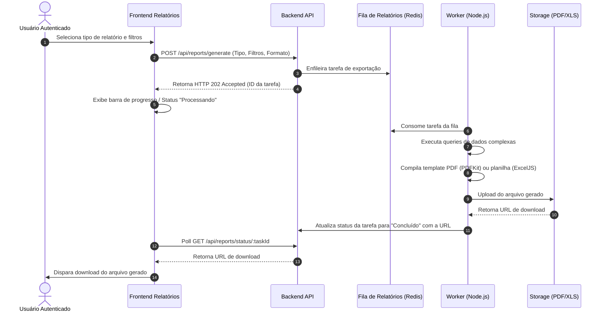
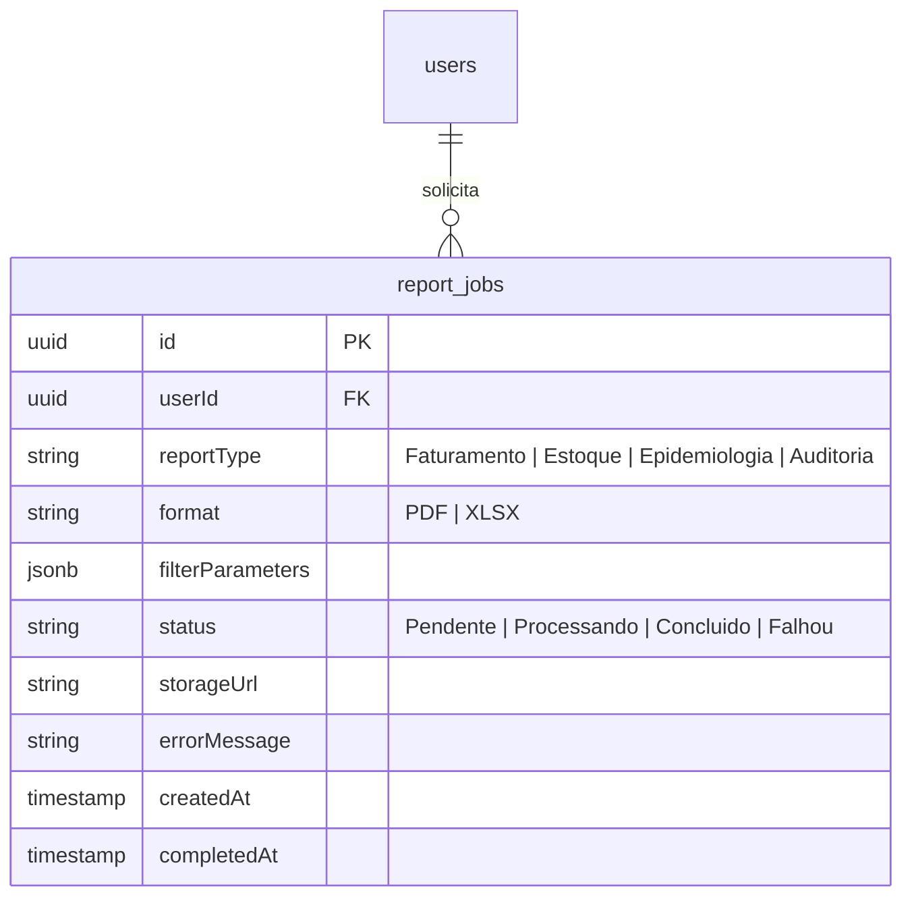

# Health Nexus — Módulo 13: Relatórios

Este documento detalha os requisitos e especificações para o módulo de **Relatórios** do Health Nexus.

---

## 1. Objetivo
Disponibilizar mecanismos de exportação de dados estruturados nos formatos PDF e Excel (XLSX). O módulo permite extrair relatórios consolidados sobre faturamento, epidemiologia, ocupação de leitos, histórico de movimentação de estoque e auditoria de ações de usuários.

---

## 2. Fluxo de Processo (Workflow)
O processamento de relatórios extensos ocorre de forma assíncrona, utilizando filas com Redis para evitar travamento da API.



---

## 3. Regras de Negócio
1.  **Processamento Assíncrono para Grandes Períodos**: Consultas que abrangem intervalos superiores a 30 dias de dados operacionais ou que envolvam mais de 5.000 linhas de retorno no banco de dados devem ser processadas obrigatoriamente em segundo plano (background jobs) via fila Redis.
2.  **Mascaramento de Dados Sensíveis (LGPD)**: Relatórios exportados para fins estatísticos ou administrativos (ex: faturamento ou epidemiológico) devem mascarar automaticamente dados sensíveis do paciente (ex: CPF e nome completo abreviado) se o perfil do usuário logado não tiver privilégio de acesso ao PEP.
3.  **Marca D'água de Confidencialidade**: Todos os relatórios PDF contendo dados clínicos devem trazer no cabeçalho ou rodapé a marca d'água "CONFIDENCIAL - DADOS DE SAÚDE" e o ID do usuário que gerou a exportação para rastreamento de vazamentos.

---

## 4. Banco de Dados (Schema)
O banco controla as tarefas de geração de relatórios solicitadas pelos usuários.



---

## 5. APIs

### `POST /api/reports/generate`
Solicita a geração de um relatório.
*   **Request Body**:
```json
{
  "reportType": "Faturamento",
  "format": "XLSX",
  "filterParameters": {
    "startDate": "2026-06-01",
    "endDate": "2026-06-30",
    "insuranceCompanyId": "e1f1ad7e-bf91-4d1a-a53c-12b23a54b38d"
  }
}
```
*   **Response (202 Accepted)**:
```json
{
  "taskId": "f98c8c22-d7b1-42cb-b1b7-7ff3ad40e21a",
  "status": "Pendente"
}
```

### `GET /api/reports/status/:id`
Consulta o status do processamento da exportação.
*   **Response (200 OK - Processando)**:
```json
{
  "taskId": "f98c8c22-d7b1-42cb-b1b7-7ff3ad40e21a",
  "status": "Processando"
}
```
*   **Response (200 OK - Concluído)**:
```json
{
  "taskId": "f98c8c22-d7b1-42cb-b1b7-7ff3ad40e21a",
  "status": "Concluido",
  "storageUrl": "https://storage.healthnexus.com/reports/faturamento_20260718.xlsx",
  "completedAt": "2026-07-18T14:38:00Z"
}
```

---

## 6. Wireframe (Textual)
```
+----------------------------------------------------------------------------------+
|  [HEALTH NEXUS]  |  Relatórios > Exportação de Dados                             |
+----------------------------------------------------------------------------------+
|  Selecione o Relatório: [ Faturamento de Convênios                             v ] |
|  Formato de Saída:      ( ) PDF (Documento Impresso)   (X) XLSX (Planilha Excel) |
+----------------------------------------------------------------------------------+
|  +-- Filtros Adicionais -------------------------------------------------------+ |
|  |  Período: [ 01/06/2026 ] a [ 30/06/2026 ]                                   | |
|  |  Operadora: [ Bradesco Saúde                                              v ] | |
|  +-----------------------------------------------------------------------------+ |
|                                                                                  |
|  Painel de Exportações Recentes:                                                 |
|  Data        Tipo          Filtros                  Status       Ação            |
|  18/07/2026  Estoque       Almoxarifado Central     [Concluído]  [Download XML]  |
|  18/07/2026  Faturamento   Período: 06/2026         [Process.]   (Aguarde)       |
|                                                                                  |
|  [ Cancelar ]                                               [ Gerar Relatório ]  |
+----------------------------------------------------------------------------------+
```

---

## 7. Casos de Uso

| ID | Caso de Uso | Ator Principal | Pré-condições | Fluxo Principal |
| :--- | :--- | :--- | :--- | :--- |
| **UC-1301** | Exportar Relatório de Auditoria de Acessos | Administrador de TI | Perfil administrativo/TI. | 1. O Usuário acessa o painel de exportação; 2. Define o filtro por data e ID de usuário específico; 3. Solicita formato XLSX; 4. O sistema processa as logs de auditoria; 5. Disponibiliza o link para download da planilha de rastreabilidade. |

---

## 8. Perfis e Permissões (RBAC)
*   **Direção / Gestão**: Acesso para geração de relatórios financeiros e de faturamento.
*   **Farmacêutico / Almoxarife**: Acesso exclusivo para relatórios de estoque, perdas e validade de lotes.
*   **Médico / Equipe Assistencial**: Acesso a relatórios epidemiológicos e de internações clínicas (sem dados de faturamento financeiro).
*   **Administrador de TI**: Acesso total a relatórios de auditoria do sistema e logs de acessos.

---

## 9. Dicionário de Campos

| Campo de Interface | Descrição | Tipo | Validação |
| :--- | :--- | :--- | :--- |
| `reportType` | Tipo de relatório a ser gerado | String | Enum: `Faturamento`, `Estoque`, `Epidemiologia`, `Auditoria` |
| `format` | Formato final da exportação | String | Enum: `PDF`, `XLSX` |
| `filterParameters` | Parâmetros de consulta | JSON | Deve respeitar o schema do tipo de relatório |

---

## 10. Validações
*   **Validação de Filtros**: Não é permitido iniciar a geração de relatórios com parâmetros de consulta abertos (ex: sem definir intervalo de datas), garantindo a estabilidade e performance do banco de dados relacional.
*   **Limitação de Downloads**: O link gerado para download temporário (`storageUrl`) deve possuir assinatura digital com tempo de expiração curto (TTL de 60 minutos) por motivos de segurança da informação.
