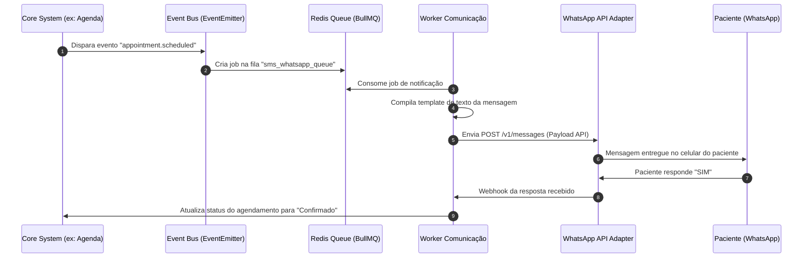
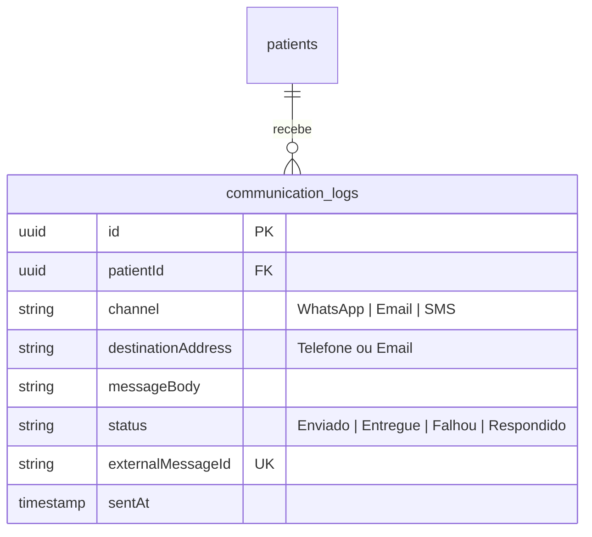

# Health Nexus — Módulo 14: Comunicação

Este documento detalha os requisitos e especificações para o módulo de **Comunicação** do Health Nexus.

---

## 1. Objetivo
Centralizar todos os canais de interação interna e externa: envio de notificações de confirmação de consultas via WhatsApp Business API, disparos de emails transacionais (SMTP), painéis eletrônicos de chamada de pacientes na recepção (TV/Monitores via WebSockets) e a infraestrutura de telemedicina para teleconsultas integradas.

---

## 2. Fluxo de Processo (Workflow)
O fluxo gerencia eventos do sistema que disparam mensagens automáticas na fila do broker (Redis), enviando-as assincronamente aos adaptadores de comunicação.



---

## 3. Regras de Negócio
1.  **Opt-in de Comunicação**: O paciente deve consentir expressamente com o recebimento de mensagens eletrônicas (WhatsApp/Email) no ato do cadastro de pacientes (LGPD Compliance).
2.  **Janela de Envio Regulamentada**: Mensagens automáticas de marketing ou confirmação de consulta não urgente só podem ser enviadas entre 08h00 e 20h00, evitando perturbação do sossego do paciente, exceto alertas críticos de saúde.
3.  **Segurança em Telemedicina**: As sessões de videoconferência de telemedicina devem ser estabelecidas via protocolo seguro WebRTC peer-to-peer criptografado de ponta a ponta (SRTP/DTLS) e não podem ser gravadas nos servidores da instituição por motivos de sigilo médico, a menos que autorizado pelo paciente para fins de auditoria de perícia.

---

## 4. Banco de Dados (Schema)
O banco gerencia templates, logs de entrega e status de mensagens de comunicação.



---

## 5. APIs

### `POST /api/communication/send-message`
Envia manualmente uma notificação para um paciente.
*   **Request Body**:
```json
{
  "patientId": "e1f1ad7e-bf91-4d1a-a53c-12b23a54b38d",
  "channel": "WhatsApp",
  "messageBody": "Olá Maria, confirmamos seu agendamento para 20/07 às 14h00. Responda SIM para confirmar."
}
```
*   **Response (200 OK)**:
```json
{
  "communicationLogId": "c88d8b12-921c-4b5b-ad7d-df99ac2f482d",
  "status": "Enviado",
  "externalMessageId": "wamid.HBgLNTU1MTk4ODg3Nzc3NxUCABEYEE..."
}
```

### `POST /api/communication/webhooks/whatsapp`
Webhook público exposto para receber confirmações de entrega e respostas de pacientes da API do WhatsApp.
*   **Response (200 OK - Vazio)**:
*(Processa a resposta em background de acordo com o payload recebido da Meta).*

---

## 6. Wireframe (Textual)
```
+----------------------------------------------------------------------------------+
|  [HEALTH NEXUS]  |  Comunicação > Painel de Chamada (Configurações)               |
+----------------------------------------------------------------------------------+
|  MONITOR DA RECEPÇÃO: [ TV Recepção Principal                                v ] |
+----------------------------------------------------------------------------------+
|  Fila de Chamada de Voz em Tempo Real:                                           |
|  Paciente                      Consultório       Médico            Ação          |
|  Maria de Souza Silva          Consultório 03    Dr. Carlos        [ Chamar TV ] |
|  João Ferreira dos Santos      Consultório 01    Dra. Ana          [ Chamar TV ] |
|  Ana Paula Rodrigues           Triagem 02        Enf. Roberta      [ Chamar TV ] |
|                                                                                  |
|  Mensagem Enviada na TV do Hall:                                                 |
|  ==============================================================================  |
|  |  PACIENTE: MARIA DE SOUZA SILVA  ===>  IR PARA: CONSULTÓRIO 03              |  |
|  ==============================================================================  |
|                                                                                  |
|  [ Configurar Som ]        [ Limpar Histórico de Chamados ]       [ Fechar Painel ]|
+----------------------------------------------------------------------------------+
```

---

## 7. Casos de Uso

| ID | Caso de Uso | Ator Principal | Pré-condições | Fluxo Principal |
| :--- | :--- | :--- | :--- | :--- |
| **UC-1401** | Chamar Paciente no Painel da Recepção | Médico / Enfermeiro | Atendimento ativo no consultório/triagem. | 1. O profissional clica no botão "Chamar" na fila de espera; 2. O backend emite evento WebSocket `call:patient`; 3. A TV da recepção intercepta o evento, exibe o nome em tela cheia com efeito sonoro visual; 4. Registra na log de comunicação da chamada. |

---

## 8. Perfis e Permissões (RBAC)
*   **Médico / Enfermeiro**: Permissão para chamar pacientes no painel e iniciar videoconferências de telemedicina.
*   **Recepcionista**: Permissão para chamar pacientes na fila de triagem e disparar lembretes manuais de agendamento.
*   **Suporte de TI / Administrador**: Parametrização das chaves de API do WhatsApp (Meta API Tokens), configurações do servidor SMTP de emails e layouts de TV.

---

## 9. Dicionário de Campos

| Campo de Interface | Descrição | Tipo | Validação |
| :--- | :--- | :--- | :--- |
| `channel` | Canal de envio da comunicação | String | Enum: `WhatsApp`, `Email`, `SMS` |
| `destinationAddress`| Endereço do destinatário | String | Validar formato de e-mail ou número com DDI/DDD |

---

## 10. Validações
*   **Formato de Número de Telefone**: O backend deve sanitizar e validar o número de telefone de destino no formato internacional E.164 (ex: `+5511988887777`), rejeitando formatos inválidos.
*   **Limitação de Caracteres**: O corpo de mensagens SMS/WhatsApp automáticas possui limite máximo de 1600 caracteres para evitar cobranças excedentes não autorizadas das operadoras.
