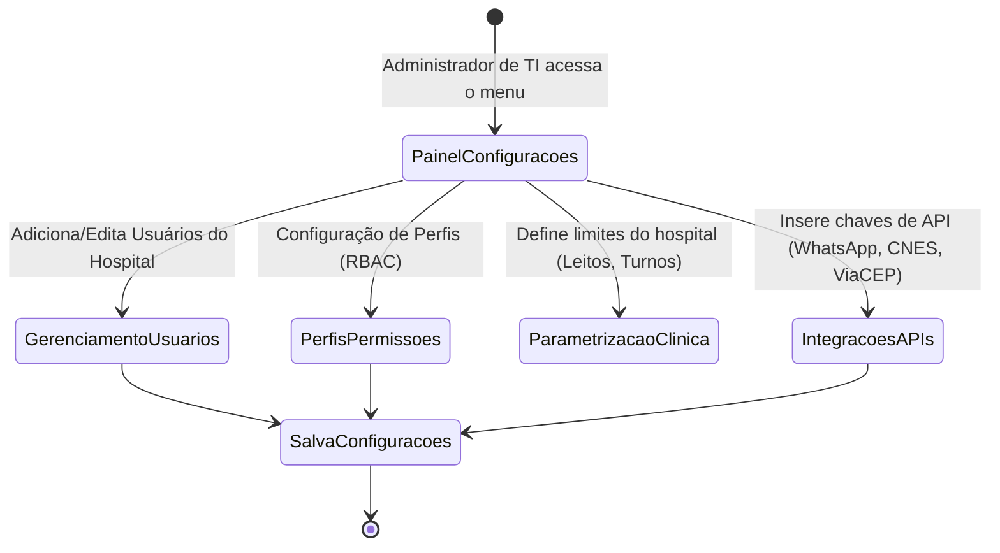

# Health Nexus — Módulo 15: Configurações

Este documento detalha os requisitos e especificações para o módulo de **Configurações** do Health Nexus.

---

## 1. Objetivo
Centralizar a administração global do sistema: gerenciamento de usuários (médicos, enfermeiros, faturistas, recepcionistas), definição de perfis e controle de acesso baseado em papéis (RBAC), parametrização de variáveis gerais da instituição, credenciais de integração com APIs externas, segurança e logs de auditoria técnica.

---

## 2. Fluxo de Processo (Workflow)
O fluxo padrão engloba a criação de usuários, atribuição de perfis de acesso, e a definição de políticas gerais de segurança e integrações da instituição.



---

## 3. Regras de Negócio
1.  **Princípio do Privilégio Mínimo (Zero Trust)**: Por padrão, todo novo usuário criado possui nível de permissão nulo. As permissões de acesso devem ser adicionadas explicitamente por meio da atribuição de um perfil (RBAC).
2.  **Segurança de Senhas**: A política de complexidade de senhas deve ser forçada nas configurações globais: mínimo de 8 caracteres, contendo pelo menos uma letra maiúscula, uma letra minúscula, um número e um caractere especial. O histórico de senhas deve impedir o reuso das últimas 3 senhas.
3.  **Auditoria de Configurações**: Qualquer alteração em chaves de criptografia, parâmetros de faturamento ou níveis de privilégios de perfis no RBAC deve registrar automaticamente uma entrada na tabela de auditoria imutável do sistema contendo o ID do administrador responsável.
4.  **Assinatura Digital**: Os médicos e profissionais que emitem documentos legais (laudos e receitas) devem realizar o upload de seus dados profissionais (CRM, especialidades) e certificado digital ICP-Brasil válido no seu perfil de usuário.

---

## 4. Banco de Dados (Schema)
O banco controla usuários, perfis, permissões e chaves de parametrização.

```mermaid
erDiagram
    users }|--|| roles : "possui"
    roles ||--o{ role_permissions : "contem"
    permissions ||--o{ role_permissions : "define"

    users {
        uuid id PK
        string username UK
        string email UK
        string passwordHash
        uuid roleId FK
        string fullName
        string professionalRegistry "CRM | COREN | CRBM"
        boolean isActive
        timestamp passwordChangedAt
    }
    roles {
        uuid id PK
        string name "Medico | Recepcionista | TI"
        string description
    }
    permissions {
        uuid id PK
        string code UK "EXAMES_LER | PEP_GRAVAR"
        string description
    }
    role_permissions {
        uuid roleId PK FK
        uuid permissionId PK FK
    }
```

---

## 5. APIs

### `POST /api/settings/users`
Cria um novo usuário na instituição.
*   **Request Body**:
```json
{
  "username": "dr.joao.silva",
  "email": "joao.silva@hospital.com",
  "fullName": "João da Silva",
  "roleId": "e1f1ad7e-bf91-4d1a-a53c-12b23a54b38d",
  "professionalRegistry": "CRM-SP12345"
}
```
*   **Response (201 Created)**:
```json
{
  "userId": "c88d8b12-921c-4b5b-ad7d-df99ac2f482d",
  "status": "Criado_Pendente_Ativacao"
}
```

### `PUT /api/settings/security`
Altera as diretrizes de segurança globais do sistema.
*   **Request Body**:
```json
{
  "passwordExpirationDays": 90,
  "mfaRequired": true,
  "sessionTimeoutMinutes": 15
}
```
*   **Response (200 OK)**:
```json
{
  "message": "Configurações de segurança atualizadas com sucesso."
}
```

---

## 6. Wireframe (Textual)
```
+----------------------------------------------------------------------------------+
|  [HEALTH NEXUS]  |  Configurações > Perfis e Permissões (RBAC)                   |
+----------------------------------------------------------------------------------+
|  PERFIL: [ Enfermeiro                                                        ]  |
+----------------------------------------------------------------------------------+
|  Selecione as permissões para este perfil:                                        |
|  Módulo              Visualizar    Criar/Editar    Excluir       Assinar         |
|  Prontuário (PEP)     [X]           [X]             [ ]           [ ]            |
|  Agenda               [X]           [ ]             [ ]           [ ]            |
|  Internações          [X]           [X]             [ ]           [ ]            |
|  Triagem Manchester   [X]           [X]             [ ]           [X]            |
|  Financeiro           [ ]           [ ]             [ ]           [ ]            |
|                                                                                  |
|  [ Cancelar ]                                               [ Salvar Perfil ]    |
+----------------------------------------------------------------------------------+
```

---

## 7. Casos de Uso

| ID | Caso de Uso | Ator Principal | Pré-condições | Fluxo Principal |
| :--- | :--- | :--- | :--- | :--- |
| **UC-1501** | Revogar Acesso de Usuário | Administrador de TI | Usuário cadastrado no banco. | 1. O Administrador acessa a lista de usuários; 2. Localiza o profissional; 3. Altera a flag `isActive` para `false`; 4. Salva a configuração; 5. O sistema desloga o usuário em tempo real via WebSocket e invalida seu token JWT. |

---

## 8. Perfis e Permissões (RBAC)
*   **Administrador de TI**: Acesso total a todas as APIs deste módulo.
*   **Demais Perfis (Médico, Recepcionista, etc.)**: Sem qualquer acesso a este módulo. Possuem apenas permissão para editar seus dados cadastrais básicos no menu "Meu Perfil".

---

## 9. Dicionário de Campos

| Campo de Interface | Descrição | Tipo | Validação |
| :--- | :--- | :--- | :--- |
| `email` | E-mail corporativo do usuário | String | Deve ser formato válido de e-mail |
| `isActive` | Situação de ativação do login | Boolean | Padrão `true` para novos cadastros |
| `sessionTimeoutMinutes`| Tempo de timeout de inatividade | Inteiro | Faixa permitida: 5 a 60 minutos |

---

## 10. Validações
*   **Auto-Exclusão**: O sistema deve bloquear qualquer tentativa de um usuário administrador inativar ou excluir a si mesmo (`userId` logado = `userId` a ser inativado), evitando o travamento (lockout) administrativo do hospital.
*   **CRM Único**: O registro profissional (`professionalRegistry`) do médico ou enfermeiro deve ser validado para evitar duplicidades no banco de dados.
