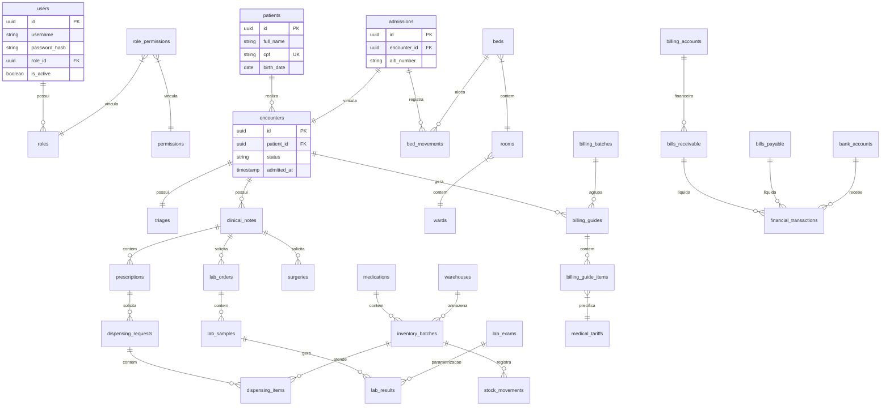

# Health Nexus — Modelo Entidade-Relacionamento (ERD)

Este documento apresenta o modelo lógico-relacional consolidado do banco de dados PostgreSQL do **Health Nexus**.

---

## 1. Diagrama de Entidade-Relacionamento Global

O diagrama abaixo especifica os principais relacionamentos entre as entidades do sistema, garantindo a integridade dos dados clínicos e transações financeiras.

---

## 2. Padrões de Integridade Referencial

1.  **Deleções Lógicas (Soft Delete)**: Entidades principais (como `patients`, `users`, `medications`) não sofrem deleções físicas (`DELETE FROM ...`) sob nenhuma hipótese clínica. O banco utiliza uma coluna `deleted_at` com indexação condicional para manter registros excluídos acessíveis para fins de auditoria médica e legal.
2.  **Cascateamento Restrito (Restrict/No Action)**: Não é utilizado o cascateamento automático de deleção (`ON DELETE CASCADE`) para registros clínicos ou financeiros vinculados.
    *   *Exemplo*: Se houver tentativa de excluir um registro na tabela `patients` que possui registros vinculados na tabela `encounters`, o banco de dados gera um erro de violação de chave estrangeira (`foreign key constraint error`), impedindo a quebra da integridade histórica.
3.  **Locks de Transação (Concurrency Control)**: Para operações financeiras e de alocação de leitos/estoques, utiliza-se controle de concorrência pessimista por meio de comandos SQL `SELECT FOR UPDATE` para evitar condições de corrida (Race Conditions) em acessos simultâneos nas APIs.
