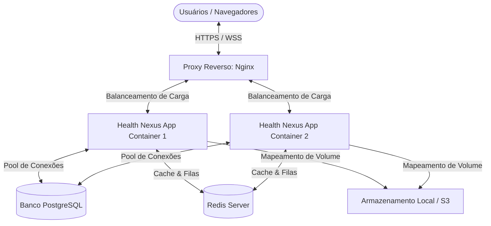

# Health Nexus — Implantação, CI/CD e Infraestrutura

Este documento especifica a arquitetura de infraestrutura de servidores, configuração de containers Docker, parametrização do proxy reverso e a esteira de implantação contínua (CI/CD) do **Health Nexus**.

---

## 1. Topologia de Infraestrutura

O Health Nexus adota uma arquitetura conteinerizada escalável horizontalmente, suportando deploys em ambientes on-premise (servidor local do hospital) ou multi-cloud (AWS, GCP, Azure).



### Detalhes de Infraestrutura
*   **Nginx**: Atua como Nginx Ingress Controller e Proxy Reverso. Responsável pelo encerramento de TLS (certificado SSL Let's Encrypt), compressão gzip de arquivos estáticos do frontend e roteamento/balanceamento de carga (Load Balancer) entre as instâncias da aplicação backend.
*   **Docker & Docker Compose**: Permite subir localmente ou em produção todo o stack (Node.js, PostgreSQL e Redis) com consistência total de dependências através do arquivo `docker-compose.yml`.

---

## 2. Esteira de Integração e Entrega Contínua (CI/CD)

Todo merge para a branch `main` ou `release` dispara automaticamente uma esteira de pipeline (GitHub Actions / GitLab CI):

### Etapas do Pipeline (Jobs)
1.  **Validação de Qualidade (Linter)**: Roda o ESLint para garantir os padrões de formatação e Clean Code do projeto.
2.  **Testes Automatizados**: Executa as suítes de testes unitários e de integração (`npm run test`). O deploy é cancelado imediatamente se qualquer teste falhar.
3.  **Build de Imagem**: Gera a nova imagem Docker do backend marcada com a versão correspondente do commit (Git Tag).
4.  **Publicação da Imagem**: Envia a imagem gerada para o repositório privado de containers (Docker Registry / AWS ECR).
5.  **Deploy em Staging/Produção**: Atualiza as instâncias do servidor fazendo download da imagem e executando a migração do banco de dados (database migrations) em caráter pré-execução sem tempo de inatividade (*Zero Downtime Deploy*).

---

## 3. Variáveis de Ambiente e Configurações (.env)

O arquivo `.env` gerencia chaves de criptografia e parâmetros de conexão de banco. **Nunca** deve ser versionado no Git.

```ini
# --- Configurações Gerais do Servidor ---
NODE_ENV=production
PORT=3000
API_URL=https://api.healthnexus.com

# --- Banco de Dados PostgreSQL ---
DB_HOST=127.0.0.1
DB_PORT=5432
DB_USER=health_nexus_admin
DB_PASS=senha_forte_segura_db
DB_NAME=health_nexus_production

# --- Cache & Broker Redis ---
REDIS_HOST=127.0.0.1
REDIS_PORT=6379
REDIS_PASS=senha_forte_redis

# --- Criptografia e Autenticação ---
JWT_SECRET=super_secret_key_generator_aes_256_hash
JWT_EXPIRATION=12h

# --- Integrações Externas ---
WHATSAPP_TOKEN=token_meta_api_whatsapp
OPENAI_API_KEY=token_openai_secreto
GOOGLE_OAUTH_CLIENT_ID=client_id_google_calendar
```
