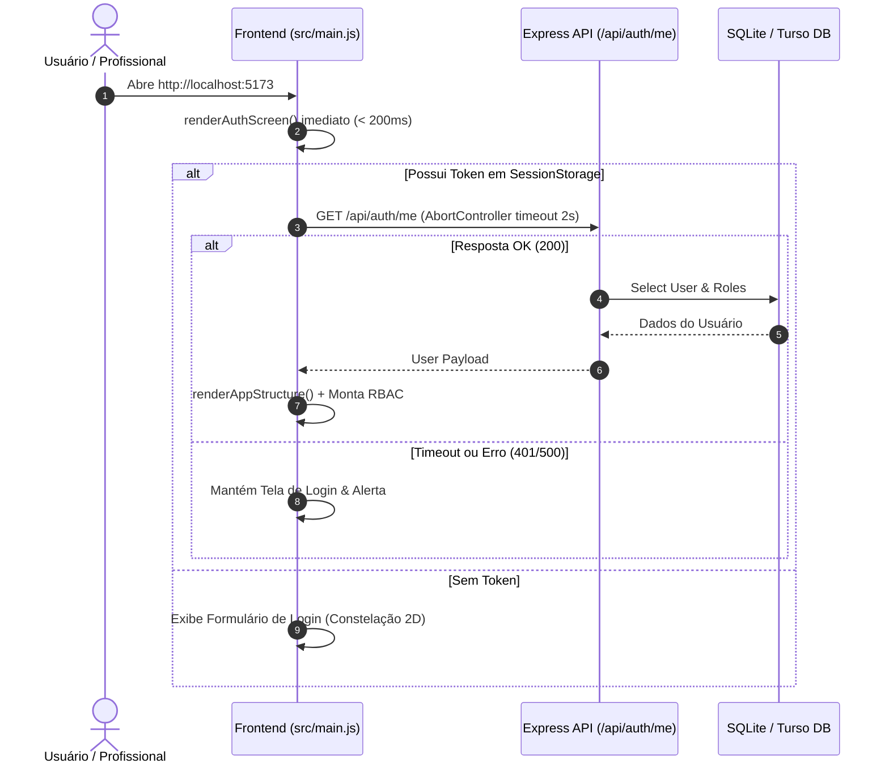
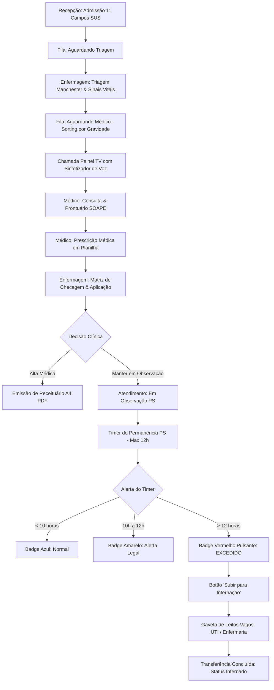
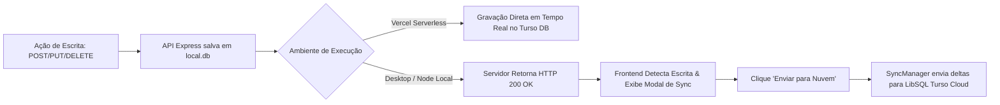

# 💻 Health Nexus — Guia Completo do Desenvolvedor & Arquitetura de Software

> **Versão:** 2.0.0 (Fase 2 Concluída)  
> **Arquitetura:** Monólito Híbrido Local-First (Vanilla JS Single Page Application + Express REST API + Dual-Database SQLite/Turso LibSQL)  
> **Última Atualização:** Julho / 2026  

---

## 📐 1. Organograma da Arquitetura do Sistema

O **Health Nexus** foi construído com separação limpa de responsabilidades mantendo extrema simplicidade operacional (zero frameworks pesados no frontend, performance instantânea < 5ms localmente).

```mermaid
graph TD
    subgraph Client ["💻 Client Layer (Navegador)"]
        UI["SPA Vanilla JS (src/main.js)"]
        CSS["Design System & CSS Tokens (src/styles.css)"]
        TTS["Web Speech API (Sintetizador Voz TV)"]
        PDF["PDF Generator (Scripts / Canvas A4)"]
    end

    subgraph Server ["⚡ Server Layer (Node.js / Express)"]
        API["Express REST API (backend/app.js)"]
        AUTH["JWT Middleware & RBAC Checker"]
        SYNC["SyncManager & Cloud Proxy"]
        SHUTDOWN["Graceful Shutdown (Heartbeat)"]
    end

    subgraph Data ["🗄️ Persistence Layer (Dual-Database)"]
        SQLITE[("local.db (SQLite Local)")"]
        TURSO[("Turso Cloud DB (LibSQL Edge)")"]
    end

    UI -->|HTTP / REST JSON| API
    API --> AUTH
    API -->|knex / better-sqlite3| SQLITE
    SYNC -->|HTTP LibSQL Sync| TURSO
    API --> SYNC
    UI --> TTS
    UI --> PDF
```

---

## 🔄 2. Fluxogramas dos Processos Principais

### 2.1 Fluxograma de Inicialização & Autenticação Instantânea



---

### 2.2 Fluxograma de Atendimento, Prescrição Planilha & Observação PS (12h)



---

### 2.3 Fluxograma da Sincronização Local-First ↔ Cloud Turso DB



---

## 📊 3. Tabelas de Referência Completa da API REST

Toda a API REST está concentrada em `backend/app.js`.

### 3.1 Endpoints de Autenticação e Usuários
| Método | Endpoint | Descrição | Permissão RBAC |
|---|---|---|---|
| `POST` | `/api/auth/login` | Autentica usuário e retorna Token JWT + Perfil | Público |
| `POST` | `/api/auth/register` | Cadastro de novo usuário (Pendente se Master sem chave) | Público |
| `GET` | `/api/auth/me` | Valida sessão ativa e renova dados do perfil | Logado |
| `GET` | `/api/users` | Lista todos os usuários cadastrados | Admin / Master |
| `PUT` | `/api/users/:id/approve-master` | Aprova ou rejeita cadastro de acesso Master | Apenas Master |
| `DELETE` | `/api/users/:id` | Executa soft-delete em conta de usuário | Admin / Master |

### 3.2 Endpoints de Pacientes e Triagem
| Método | Endpoint | Descrição | Permissão RBAC |
|---|---|---|---|
| `GET` | `/api/patients` | Lista pacientes (suporta busca por nome, CPF e ID) | Recepção, Enfermeiro, Médico, Master |
| `POST` | `/api/patients` | Admissão com 11 campos SUS + validação de responsável | Recepcionista, Master |
| `PUT` | `/api/patients/:id` | Atualiza dados cadastrais de paciente | Recepcionista, Master |
| `DELETE` | `/api/patients/:id` | Move paciente para a Lixeira de Segurança | Apenas Master |
| `POST` | `/api/encounters/:id/triage` | Registra sinais vitais e cor Manchester | Enfermeiro, Médico, Master |

### 3.3 Endpoints da Fase 2 (Prescrição, Timer PS, Escala de Plantão)
| Método | Endpoint | Descrição | Permissão RBAC |
|---|---|---|---|
| `GET` | `/api/encounters/:id/prescriptions` | Obtém prescrições e matriz de checagem | Médico, Enfermeiro |
| `POST` | `/api/encounters/:id/prescriptions` | Cria nova prescrição médica em planilha | Médico, Master |
| `POST` | `/api/prescriptions/:id/administrate` | Registra dose/checagem da enfermagem | Enfermeiro, Aux. Enfermagem |
| `PUT` | `/api/encounters/:id/transfer-bed` | Transfere paciente de Obs PS para Leito vagos | Enfermeiro, Médico, Master |
| `GET` | `/api/duty-schedules` | Consulta escala de médicos de plantão do dia | Todos os perfis |
| `POST` | `/api/duty-schedules` | Adiciona plantonista à escala por turno | Admin, Master |

---

## 🗄️ 4. Esquema de Banco de Dados (Dicionário de Tabelas)

```mermaid
erDiagram
    users ||--o{ clinical_notes : signs
    patients ||--o{ encounters : has
    encounters ||--o1 triages : receives
    encounters ||--o{ clinical_notes : contains
    encounters ||--o{ prescriptions : includes
    prescriptions ||--o{ prescription_administrations : tracks
    beds ||--o| encounters : occupies
    doctors ||--o{ duty_schedules : scheduled
```

### Principais Tabelas:
1. **`users`**: Contas e perfis RBAC (`id`, `name`, `username`, `password_hash`, `role`, `deleted_at`).
2. **`patients`**: Cadastros SUS (`id`, `fullName`, `cpf`, `birthDate`, `responsibleName`, `responsibleCpf`, `responsiblePhone`, `responsibleRelationship`, `deleted_at`).
3. **`encounters`**: Atendimentos ativos/histórico (`id`, `patientId`, `status`, `observation_started_at`, `transfer_bed_id`, `deleted_at`).
4. **`prescriptions`**: Medicamentos em planilha (`id`, `encounterId`, `medicationName`, `dosage`, `route`, `frequency`, `instructions`).
5. **`prescription_administrations`**: Doses checadas (`id`, `prescriptionId`, `administered_at`, `nurse_name`).
6. **`duty_schedules`**: Escala de plantão (`id`, `doctorId`, `doctorName`, `shiftDate`, `shiftType`, `roomName`).

---

## 🛠️ 5. Guia de Setup & Resolução de Problemas para Desenvolvedores

### Passo a Passo de Execução Local:

```bash
# 1. Clonar repositório
git clone https://github.com/Mazzarowysk/Health-Nexus.git
cd Health-Nexus

# 2. Instalar dependências
npm install

# 3. Rodar em modo desenvolvimento
npm run dev

# 4. Executar build de produção
npm run build
```

---

*Documentação mantida pela equipe de Engenharia de Software Health Nexus.*
