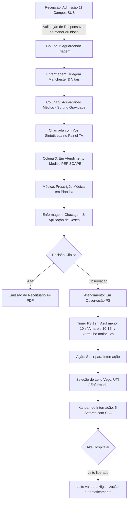

# 📘 Health Nexus — Manual Operacional do Usuário (Completo & Ilustrado)

> **Versão:** 2.3.0 — Agosto/2026  
> **Público-Alvo:** Recepcionistas, Enfermeiros, Médicos, Farmacêuticos, Gestores Financeiros e Administradores Hospitalares  
> **Sistema:** Health Nexus — Gestão Hospitalar & Pronto-Socorro

---

## 🏛️ 1. Organograma da Estrutura Hospitalar & Perfis de Acesso (RBAC)

O **Health Nexus** utiliza Controle de Acesso Baseado em Perfis (RBAC — Role-Based Access Control) para garantir a segurança dos dados clínicos e sigilo financeiro.

```
                    ┌─────────────────────────────────────────┐
                    │      👑 MASTER / ADMINISTRADOR           │
                    │   Gestão Total · Aprovação · Auditoria  │
                    └────────────────────┬────────────────────┘
                                         │
        ┌───────────────────┬────────────┴───────┬───────────────────┐
        │                   │                    │                   │
┌───────┴──────┐   ┌────────┴───────┐   ┌────────┴──────┐   ┌────────┴──────┐
│ 💻 DESENVOLV.│   │ 🩺 MÉDICO /    │   │ 🩺 ENFERMAGEM │   │ 📋 RECEPÇÃO   │
│ Acesso Total │   │  CORPO CLÍNICO │   │ Triagem/Obs/  │   │ Admissão/TV/  │
│  + Sync DB   │   │ PEP & Planilha │   │ Leitos/Meds   │   │ Caixa Entrada │
└──────────────┘   └────────────────┘   └───────────────┘   └───────────────┘
                                                 │
                                        ┌────────┴──────┐
                                        │ 💊 FARMÁCIA / │
                                        │  ESTOQUE      │
                                        └───────────────┘
```

### Matriz Geral de Permissões RBAC

| Perfil | Acesso Visual às Abas | Prontuário (PEP) | Triagem Manchester | Prescrição Planilha | Gestão de Leitos | Financeiro | Lixeira / Sync |
|---|---|---|---|---|---|---|---|
| **👑 Master / Admin** | Todas as abas | Total | Total | Total | Total | Total | Exclusivo |
| **🩺 Médico** | Dashboard, Pacientes, Atendimento, Leitos, Farmácia, Relatórios | Assinatura SOAPE | Consulta | Criação de Planilha | Solicitação | Bloqueado | Bloqueado |
| **🩺 Enfermeiro(a)** | Dashboard, Pacientes, Atendimento, Leitos, Farmácia | Leitura | Execução Manchester | Checagem de Doses | Gestão / Transferência | Bloqueado | Bloqueado |
| **📋 Recepcionista** | Dashboard, Pacientes, Agenda, Atendimento, Painel TV, Caixa | Bloqueado | Bloqueado | Bloqueado | Bloqueado | Apenas Entradas | Bloqueado |
| **💊 Farmacêutico(a)**| Dashboard, Pacientes, Farmácia, Relatórios | Bloqueado | Bloqueado | Bloqueado | Bloqueado | Bloqueado | Bloqueado |

---

## 🔄 2. Fluxograma da Jornada Completa do Paciente no PS



---

## 📋 3. Admissão SUS com Validação de Responsável Legal

Na aba **Pacientes**, a Recepção realiza a admissão cadastral com **11 Campos SUS**.

### Tabela de Campos e Regras de Segurança

| Campo | Preenchimento | Regra de Validação do Sistema |
|---|---|---|
| **Nome Completo** | Nome oficial | Trava contra nomes duplicados (409 Conflict) |
| **CPF** | 11 dígitos | Validação matemática de CPF real + trava contra duplicidades |
| **Data de Nascimento** | DD/MM/AAAA | Calcula a **Idade** automaticamente em tempo real |
| **Cartão SUS** | 15 dígitos | Validação de formato SUS |
| **Telefone / Celular** | DDD + Número | Aplicação de máscara automática |
| **CEP (ViaCEP)** | 8 dígitos | Consulta automática e preenchimento de Rua, Bairro e Cidade |
| **Responsável Legal** | Obrigatório se < 18 ou > 65 anos | Exige **Nome, CPF, Telefone e Parentesco** do responsável legal |

---

## 🚦 4. Triagem Manchester & Fila de Espera por Gravidade

A Enfermagem classifica os pacientes em 5 níveis de gravidade.

```mermaid
gantt
    title Prazos Limite do Protocolo de Manchester
    dateFormat  X
    axisFormat %s min

    section Emergência
    Atendimento Imediato (0 min) : active, 0, 1
    section Muito Urgente
    Atendimento em até 10 min    : critical, 0, 10
    section Urgente
    Atendimento em até 60 min    : 0, 60
    section Pouco Urgente
    Atendimento em até 120 min   : 0, 120
    section Não Urgente
    Atendimento em até 240 min   : 0, 240
```



---

## 💊 5. Prescrição em Planilha & Matriz da Enfermagem

O médico monta a prescrição em formato de tabela. A equipe de enfermagem visualiza a matriz de horários e clica em **"Checar/Administrar"** para gravar o profissional e o horário exato da aplicação.

### Vias de Administração & Frequências Suportadas

| Via de Administração | Frequência Padrão | Descrição Operacional |
|---|---|---|
| **VO** (Via Oral) | `6/6h`, `8/8h`, `12/12h` | Comprimidos, xaropes e gotas |
| **EV / IV** (Endovenosa) | `Contínua`, `12/12h`, `8/8h` | Injeções e soros em veia |
| **IM** (Intramuscular) | `Dose Única`, `24/24h` | Injeções em músculo |
| **SC** (Subcutânea) | `12/12h`, `1x/dia` | Insulinas e anticoagulantes |
| **Tópica / Inalatória** | `Se dor`, `8/8h` | Pomadas, nebulizações |

---

## ⏱️ 6. Timer de Observação PS (12h) & Transferência de Leitos

O sistema monitora a permanência do paciente em observação no Pronto-Socorro:

- **🟢/🔵 < 10 Horas:** Estágio normal de observação (`⏱️ Obs PS: Xh Ym / 12h max`).
- **🟡 10h a 12h:** Alerta de aproximação do limite legal (`⚠️ Atenção: Xh Ym`).
- **🔴 > 12 Horas:** Alerta crítico pulsante (`🚨 EXCEDEU 12H PS: TRANSFERIR`).

### Passo a Passo para Subir para Internação:
1. Clique no botão **"🛌 Subir para Internação"** no card do paciente.
2. Selecione um **Leito Vago** na gaveta lateral (UTI, Enfermaria, Pediatria).
3. Confirme a transferência. O atendimento muda para `Internado` e o leito vira `Ocupado`.

---

## 📊 7. Kanban de Internação — Grade Síncrona & 5 Setores

O **Kanban de Internação** organiza visualmente os pacientes hospitalizados em 5 setores estratégicos com metas de permanência (SLA) individuais:

| # | Setor | Cor | Meta de Permanência |
|---|---|---|---|
| 1 | 🔵 **Pronto Socorro (Obs)** | Azul Índigo | 24 horas |
| 2 | 🟠 **Corredor de Internação** | Âmbar | 1 dia |
| 3 | 🟣 **Clínica Cirúrgica** | Roxo | 7 dias |
| 4 | 🟢 **Clínica Médica (SUS)** | Verde | 10 dias |
| 5 | 🔴 **UTI** | Vermelho | 5 dias |

### 📐 Seletores de Setor (Visão Geral)
Os 6 cards superiores funcionam como filtros interativos: **"Visão Geral"** exibe todos os setores lado a lado; clicar em um setor específico expande aquela coluna em grid de múltiplos cartões (largura total).

### 🎨 Design dos Cards de Paciente
Cada card exibe:
- **Avatar com iniciais** do paciente (cor do setor)
- **Nome, Diagnóstico, Leito e Médico responsável**
- **Barra de progresso SLA** colorida dinamicamente (verde → âmbar → rosê)
- **Botões de ação:** Prontuário, Evolução, Editar, Mover Setor, Alta
- **Borda superior colorida** indicando status do SLA de relance

### 📊 Cards Analíticos do Topo
- **Distribuição por Setor:** Clique nas fatias do gráfico Donut para filtrar o Kanban instantaneamente. Clique no número central para o **Modal de Detalhamento por Setor** (lista pacientes por ala e leito).
- **Metas de Tempo (SLA):** Clique nas fatias verde/âmbar/vermelho para filtrar pacientes por status de SLA. Clique no percentual central para o **Modal de Auditoria de SLAs** (lista completa com botão "Prontuário" e filtro "Filtrar Atrasados").
- **Funil da Jornada Hospitalar:** Barras horizontais mostrando a distribuição de pacientes por setor em percentual.

---

## 🛏️ 8. Gestão de Leitos — Mapa Interativo

O **Mapa de Leitos** apresenta todos os leitos da instituição em grid de cards visuais.

### Status dos Leitos

| Status | Cor da Borda Superior | Descrição |
|---|---|---|
| **Vago** | 🟢 Verde | Leito disponível para internação |
| **Ocupado** | 🔴 Rosê/Vinho | Leito com paciente internado |
| **Higienização** | 🟡 Âmbar | Leito em processo de limpeza pós-alta |

### Ações por Leito
- **Leito Vago:** Botão **"Internar Neste Leito"** (azul índigo) — abre seleção de paciente.
- **Leito Ocupado:** Botão **"Alta Hospitalar"** (vinho/rosê suavizado) — abre modal de confirmação e automaticamente envia o leito para higienização.
- **Em Higienização:** Botão **"Liberar Leito"** (verde) — retorna o leito ao status vago.

### Modal de Confirmação de Alta
O modal "Confirmar Alta" apresenta:
- Acento colorido no topo (gradiente rosê)
- Ícone representativo da ação
- Mensagem de confirmação
- Badge informativo: *"O leito será marcado como Em Higienização automaticamente"*
- Botões com espaçamento confortável: **Cancelar** (neutro) e **Sim, Confirmar** (rosê vinho)

---

## 📄 9. Prontuário Eletrônico (PEP) — PDF Real & Anexo de Exames

Na janela do Prontuário do Paciente, o profissional conta com duas ações principais:

- **📄 Gerar PDF:** Compila automaticamente todo o histórico assistencial (Internações, Evoluções, Urgência/PS, Consultas e Anotações) e gera o download direto de um relatório PDF oficial A4 (jsPDF + autoTable).
- **📎 Anexar Exame:** Permite selecionar qualquer arquivo de laudo ou imagem do computador. O sistema registra no histórico com data, hora, nome e tamanho do anexo.

---

## 💳 10. Gestão Financeira & Baixa Manual de Parcela

No módulo de **Relatórios / Financeiro**:
- A Recepcionista ou Administrador visualiza a lista de faturas e títulos em aberto.
- Clique no botão **Dar Baixa Manual** para quitar uma parcela individual preenchendo o valor pago, forma de pagamento (Pix, Cartão, Dinheiro) e observações.
- É possível selecionar múltiplas parcelas e realizar **Baixa Manual em Lote**.

---

## 🌗 11. Modo Claro & Modo Escuro

O sistema suporta dois temas visuais que podem ser alternados pelo botão ☀️/🌙 no canto superior direito:

- **Modo Escuro (padrão):** Fundo azul escuro (`#0f172a`), cards em vidro translúcido escuro, ideal para ambientes com pouca luz.
- **Modo Claro:** Fundo cinza slate suave (`#e2e8f0`), cards em vidro translúcido claro, ideal para ambientes iluminados.

> **Importante:** Todos os modais, janelas e componentes respeitam automaticamente o tema ativo — não há mais divergência de cores entre modais e o restante da interface.

---

## 🛠️ 12. Guia de Solução de Problemas & Dúvidas Frequentes (FAQ)

| Problema | Causa Provável | Solução Recomendada |
|---|---|---|
| **Como emitir PDF do prontuário?** | Impressão ou download de histórico | Clique em **Prontuário** no card do paciente e selecione **📄 Gerar PDF**. |
| **TV sem som na chamada de paciente** | Permissão de áudio silenciada no Chrome | Clique em qualquer área da tela da TV para ativar a Web Speech API. |
| **Sincronização Turso com aviso vermelho** | Falha de internet ou token pendente | Vá em **Configurações → Turso**, clique em **Testar Conexão** e em seguida **Sincronizar Agora**. |
| **Modal aparece escuro no modo claro** | Componente com rgba hardcoded | Verificar se o componente usa variáveis CSS de tema (`var(--bg-secondary)`). |
| **Botão Prontuário não funciona no modal SLA** | Atributo onclick malformado | Atualizar o sistema para a versão 2.3.0+ que corrige este bug. |
| **Erro de CPF duplicado na admissão** | Paciente já cadastrado anteriormente | Use a busca de pacientes para re-admitir sem criar duplicidade. |
| **Cards do Kanban sem destaque de cor** | Cache do navegador | Pressione `Ctrl+Shift+R` para recarregar o sistema sem cache. |

---

## ⏰ 13. Módulo de Escalas de Trabalho (Médicos e Enfermeiros)

O módulo de **Escalas de Trabalho & Plantões** (aba <i class="fa-solid fa-user-clock"></i>) permite a gestão operacional completa da equipe hospitalar:

### 13.1. Navegação por Orelhas
- **🩺 Escala de Médicos:** Visualização dos plantões por médico, CRM, especialidade, turno (Manhã, Tarde, Noite, Plantão 24h), consultório/setor e horas de carga horária.
- **💉 Escala de Enfermeiros:** Visualização dos plantões por enfermeiro, COREN, setor/função (Triagem Manchester, Enfermaria Geral, UTI Adulto, Medicação, Centro Cirúrgico) e turnos (6h, 12h, Escala 12x36).

### 13.2. Controle de Contas e Logins por Perfil
- Cada Médico e Enfermeiro possui login de acesso cadastrado (ex: `dr.carloseduard`, `silviacwb`).
- Ao logar com perfil Médico ou Enfermeiro, o profissional tem acesso às abas assistenciais e escalas, mantendo **bloqueado** o acesso a configurações avançadas de sistema e gestão de usuários.

### 13.3. Filtros, Cadastro de Plantão e Impressão
- **Filtros:** Busca rápida por nome/registro/setor, filtro por período (Hoje, Esta Semana, Este Mês, Todos) e filtro por turno.
- **Cadastrar Plantão:** Botão **"+ Novo Plantão"** para alocação direta de profissionais.
- **Impressão:** Botão **"Imprimir Escala"** gera relatório formatado para fixação física nos setores.

---

## 🛡️ 14. Gerenciamento de Usuários & Auditoria de Acessos

O painel de **Gerenciamento de Usuários & Permissões** conta com recursos avançados de auditoria e controle:
- **Gestão de Exclusão de Contas:** Liberação de lixeira para contas operacionais e de desenvolvimento (incluindo `Breno Coltri` / `@bcoltri`), garantindo que apenas a conta root Master (`@mazzarowysk`) permaneça imutável.
- **Histórico dos 5 Últimos Acessos:** Exibição imediata dos 5 acessos mais recentes do usuário selecionado, com registro de entrada, saída e tempo total de uso.
- **Verificação Completa de Acessos:** Botão interativo que alterna para a auditoria estendida de segurança, detalhando endereço IP de origem, dispositivo/navegador, módulos assistenciais acessados e validação de segurança RBAC.
- **Fechamento e Interação Fluida:** Botões de fechar (X superior e botão 'Fechar' no rodapé) e clique no backdrop com evento otimizado de remoção do modal.

---

*Manual operacional produzido e homologado pela equipe Health Nexus (v2.4.0) — Agosto/2026.*


